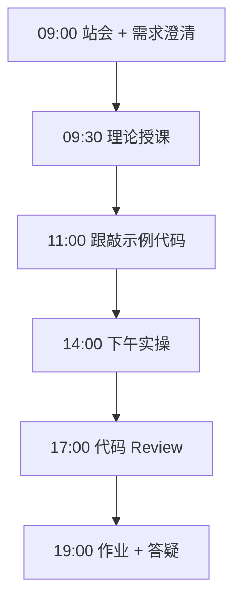
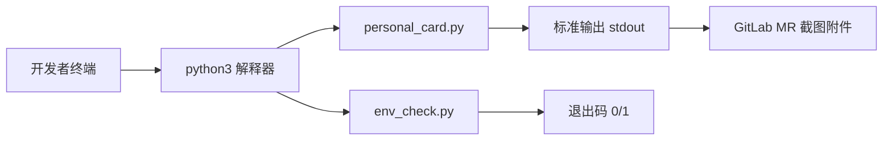

# Day 01：开发环境与第一行代码

> **阶段**：第一阶段:Python编程基础 | **Epic**：NEXUS-E1 | **预计学时**：6-8 小时

## 旁白解读：今日上下文

> 🎬 **模拟站会 09:00** — 智链科技 Nexus 项目组

**陈工（Tech Lead）**：各位早上好，欢迎加入 NexusAgent 项目组。今天不追求写多复杂的代码，目标是三件事：环境能跑、第一行 Python 能输出中文、知道代码怎么提交到 GitLab。昨天产品林悦在 Jira 里挂了三个 Story，最核心的是「学员能在本地跑通示例脚本」——这是后面 69 天所有交付的门槛。

**林悦（产品经理）**：从用户视角，今天像「新员工入职打印工牌」。`personal_card.py` 就是最小可用产品：输入员工字段，输出可读卡片。字段设计别随便写，后面用户画像 Agent 会复用类似结构。

**小王（学员代表）**：我昨晚装好 Python，但 Windows 终端中文乱码怎么办？

**陈工**：下午 `env_check.py` 就是干这个的。企业里我们不会口头问「你环境好了吗」，而是用脚本自检，失败就标红退出码 1，CI 同理。今天先把地基打好，明天开始处理真实文本数据。


**今日在 NexusAgent 主线中的位置**：Day 1 产出是 CLI 文本输出原型，对应 NexusAgent v0.1 最简用户可见界面

**今日 Jira 看板**：
- `NEXUS-E1-D01-S01`
- `NEXUS-E1-D01-S02`
- `NEXUS-E1-D01-S03`

---


## 需求文档（产品林悦下发）

**文档编号**：PRD-NEXUS-D01  
**版本**：v1.0  
**优先级**：P0

### 背景

第一阶段:Python编程基础阶段第 1 天教学任务，与 NexusAgent 主线项目对齐。

### User Stories

### NEXUS-E1-D01-S01

**描述**：开发环境与第一行代码 相关交付

**验收标准**：
- [ ] 代码可本地运行
- [ ] 通过 `scripts/verify_day.py --day 1`

### NEXUS-E1-D01-S02

**描述**：开发环境与第一行代码 相关交付

**验收标准**：
- [ ] 代码可本地运行
- [ ] 通过 `scripts/verify_day.py --day 1`

### NEXUS-E1-D01-S03

**描述**：开发环境与第一行代码 相关交付

**验收标准**：
- [ ] 代码可本地运行
- [ ] 通过 `scripts/verify_day.py --day 1`


---


## 今日课表

### 上午 09:00-12:00

- 09:00 站会：介绍 NexusAgent 70 天路线图与智链科技模拟组织架构
- 09:30 安装 Python 3.10+、VS Code/Cursor、Git 基础配置
- 10:30 终端入门：cd/ls/python3、路径与虚拟环境概念预习
- 11:00 语法速览：变量、字符串、f-string、注释规范

### 下午 14:00-17:30

- 14:00 跟敲 personal_card.py：理解「可运行脚本」最小交付单元
- 15:00 跟敲 env_check.py：建立「先自检再开发」的企业习惯
- 16:00 代码 Review：命名规范 snake_case、文件头 docstring
- 17:00 演示 Git 首次提交与 MR 流程（feature 分支）

### 晚自习 19:00-21:00

- 19:00 作业答疑：排查 Windows/macOS/Linux 环境差异
- 20:00 预习 Day 2 运算符与字符串清洗场景
- 20:30 学员互评：朗读各自卡片输出，互相找 typo

---


## 课堂笔记

### 核心知识点速查

| 序号 | 知识点 | 代码位置 |
|------|--------|----------|
| 1 | Python 解释器与 python3 命令 | 见下午实操 |
| 2 | 变量赋值与动态类型 | 见下午实操 |
| 3 | f-string 格式化字符串 | 见下午实操 |
| 4 | 模块导入 import | 见下午实操 |
| 5 | if __name__ == '__main__' 入口守卫 | 见下午实操 |
| 6 | 函数 def 与类型注解 -> None | 见下午实操 |
| 7 | 标准输出 print 与退出码 sys.exit | 见下午实操 |
| 8 | UTF-8 编码与中文终端显示 | 见下午实操 |
| 9 | snake_case 命名规范 | 见下午实操 |
| 10 | docstring 文档字符串 | 见下午实操 |

### 今日流程图



### 架构示意图（当日目标）



---


## 实操代码清单

- `code/personal_card.py`
- `code/env_check.py`

请按顺序创建并运行。每段代码均可直接复制到对应文件执行。

---

## 实验手册（分时段操作表）

### 实验步骤 1：09:30-10:30 理论

| 时间 | 动作 | 预期结果 | 失败处理 |
|------|------|----------|----------|
| +0min | 打开课件本节 | 看到需求与验收标准 | 检查是否拉取最新 `develop` 分支 |
| +10min | 创建/打开当日 `code/` 文件 | 文件路径与清单一致 | 对照「实操代码清单」 |
| +30min | 粘贴并运行第一个脚本 | 终端有正常输出无 Traceback | 见下方「排错手册」 |
| +60min | 完成全部文件并自测 | `python3` 运行通过 | 使用 `scripts/verify_day.py --day 1` |
| +90min | 提交 Git 并建 MR | MR 关联 Jira NEXUS-E1-D01-S01 | 按附录 Git 示例操作 |


### 实验步骤 2：10:30-12:00 跟敲

| 时间 | 动作 | 预期结果 | 失败处理 |
|------|------|----------|----------|
| +0min | 打开课件本节 | 看到需求与验收标准 | 检查是否拉取最新 `develop` 分支 |
| +10min | 创建/打开当日 `code/` 文件 | 文件路径与清单一致 | 对照「实操代码清单」 |
| +30min | 粘贴并运行第一个脚本 | 终端有正常输出无 Traceback | 见下方「排错手册」 |
| +60min | 完成全部文件并自测 | `python3` 运行通过 | 使用 `scripts/verify_day.py --day 1` |
| +90min | 提交 Git 并建 MR | MR 关联 Jira NEXUS-E1-D01-S01 | 按附录 Git 示例操作 |


### 实验步骤 3：14:00-15:30 实操

| 时间 | 动作 | 预期结果 | 失败处理 |
|------|------|----------|----------|
| +0min | 打开课件本节 | 看到需求与验收标准 | 检查是否拉取最新 `develop` 分支 |
| +10min | 创建/打开当日 `code/` 文件 | 文件路径与清单一致 | 对照「实操代码清单」 |
| +30min | 粘贴并运行第一个脚本 | 终端有正常输出无 Traceback | 见下方「排错手册」 |
| +60min | 完成全部文件并自测 | `python3` 运行通过 | 使用 `scripts/verify_day.py --day 1` |
| +90min | 提交 Git 并建 MR | MR 关联 Jira NEXUS-E1-D01-S01 | 按附录 Git 示例操作 |


### 实验步骤 4：15:30-17:00 联调

| 时间 | 动作 | 预期结果 | 失败处理 |
|------|------|----------|----------|
| +0min | 打开课件本节 | 看到需求与验收标准 | 检查是否拉取最新 `develop` 分支 |
| +10min | 创建/打开当日 `code/` 文件 | 文件路径与清单一致 | 对照「实操代码清单」 |
| +30min | 粘贴并运行第一个脚本 | 终端有正常输出无 Traceback | 见下方「排错手册」 |
| +60min | 完成全部文件并自测 | `python3` 运行通过 | 使用 `scripts/verify_day.py --day 1` |
| +90min | 提交 Git 并建 MR | MR 关联 Jira NEXUS-E1-D01-S01 | 按附录 Git 示例操作 |


### 实验步骤 5：19:00-20:30 作业

| 时间 | 动作 | 预期结果 | 失败处理 |
|------|------|----------|----------|
| +0min | 打开课件本节 | 看到需求与验收标准 | 检查是否拉取最新 `develop` 分支 |
| +10min | 创建/打开当日 `code/` 文件 | 文件路径与清单一致 | 对照「实操代码清单」 |
| +30min | 粘贴并运行第一个脚本 | 终端有正常输出无 Traceback | 见下方「排错手册」 |
| +60min | 完成全部文件并自测 | `python3` 运行通过 | 使用 `scripts/verify_day.py --day 1` |
| +90min | 提交 Git 并建 MR | MR 关联 Jira NEXUS-E1-D01-S01 | 按附录 Git 示例操作 |


### 排错手册（Day 1）

1. **`command not found: python3`** → 安装 Python 3.10+ 或使用 `py -3`（Windows）
2. **`ModuleNotFoundError`** → 确认当前目录、是否激活 venv、`pip install -r requirements.txt`（若当日有）
3. **`SyntaxError: invalid syntax`** → 检查上一行是否缺括号、引号是否中文
4. **`UnicodeDecodeError`** → 文件保存为 UTF-8，终端 `export PYTHONIOENCODING=utf-8`
5. **API 相关（Day12+）** → 检查 `.env` 中 Key，无 Key 时使用课件 MOCK 模式

---


## 逐步跟敲指南（完整源码与解析）

> 以下代码与 `code/` 目录完全一致，可直接复制。每段附行级说明。

### 文件：`code/personal_card.py`

**操作步骤**：
1. 在 `courseware/day-01/code/` 下创建文件 `personal_card.py`
2. 完整粘贴下方代码
3. 在终端执行：`cd courseware/day-01/code && python3 personal_card.py`（若为包内模块则按课件说明）

```python
#!/usr/bin/env python3
# -*- coding: utf-8 -*-
"""
个人信息卡片生成器 — NexusAgent 训练营 Day 1 示例
模拟企业场景：为内部员工生成可打印的工牌信息摘要
"""

# 导入 sys 模块，用于读取命令行参数与退出码控制
import sys

# 定义员工姓名字符串变量，后续会参与格式化输出
employee_name = "张晓明"

# 定义员工工号，企业系统中唯一标识
employee_id = "SL-2026-0847"

# 定义所属部门名称
department = "智能体平台研发部"

# 定义岗位职级标题
job_title = "初级 Python 开发工程师"

# 定义入职日期字符串，格式为 ISO 风格 YYYY-MM-DD
hire_date = "2026-03-01"

# 定义办公地点楼层信息
office_location = "北京·中关村软件园 A3-1208"

# 定义直属经理姓名，用于工牌紧急联系人区
manager_name = "陈建国（Tech Lead）"

# 定义分隔线常量，全大写表示不可变配置
SEPARATOR_LINE = "=" * 48

# 定义副分隔线，视觉上弱于主分隔线
SUB_SEPARATOR = "-" * 48

# 使用 f-string 拼接多行卡片正文，\n 表示换行符
card_body = f"""
{SEPARATOR_LINE}
        智链科技 SmartLink · 员工信息卡
{SEPARATOR_LINE}
  姓名：{employee_name}
  工号：{employee_id}
  部门：{department}
  岗位：{job_title}
  入职：{hire_date}
  工位：{office_location}
  直属：{manager_name}
{SUB_SEPARATOR}
  系统账号：{employee_id.lower()}
  邮箱前缀：{employee_name[0]}.zhang@smartlink.cn
{SEPARATOR_LINE}
"""

# 定义欢迎语文案，强调训练营主线项目
welcome_message = (
    "欢迎加入 NexusAgent 项目组！"
    "今日目标：让 Python 在终端输出第一份「可交付」文本。"
)

# 主函数：组织程序入口逻辑，便于后续单元测试与复用
def main() -> None:
    # 向标准输出打印欢迎语
    print(welcome_message)
    # 打印空行，提升终端可读性
    print()
    # 打印完整卡片内容
    print(card_body)
    # 打印学习提示，引导学员修改变量观察变化
    print("提示：修改文件顶部变量后重新运行 python personal_card.py")


# Python 惯用入口守卫：仅在被直接执行时调用 main
if __name__ == "__main__":
    # 调用主函数
    main()
    # 以状态码 0 正常退出（显式写出便于学员理解退出语义）
    sys.exit(0)

```

**解析要点（`personal_card.py`）**：

- 共 **79** 行，请逐行阅读注释中的中文说明

- 运行前确认 Python 版本 ≥ 3.10：`python3 --version`

- 若报错，先检查缩进是否为 4 空格，勿混用 Tab

- 企业 Review 清单：命名是否清晰、是否有异常处理、是否可复用

---

### 文件：`code/env_check.py`

**操作步骤**：
1. 在 `courseware/day-01/code/` 下创建文件 `env_check.py`
2. 完整粘贴下方代码
3. 在终端执行：`cd courseware/day-01/code && python3 env_check.py`（若为包内模块则按课件说明）

```python
#!/usr/bin/env python3
# -*- coding: utf-8 -*-
"""
开发环境自检脚本 — 验证 Python 版本、编码与基本 IO 能力
企业场景：CI 流水线本地预检（pre-commit 前身）
"""

# 导入 platform 模块，读取操作系统与 Python 构建信息
import platform

# 导入 sys 模块，检查解释器版本与默认编码
import sys

# 导入 os 模块，检查环境变量与当前工作目录
import os

# 导入 locale 模块，检测系统区域与编码设置
import locale

# 导入 datetime 模块，为检查报告打上时间戳
from datetime import datetime

# 定义最低可接受的 Python 次版本号元组 (major, minor)
MIN_PYTHON = (3, 10)

# 定义检查项结果列表，每项为 (名称, 是否通过, 详情)
check_results: list[tuple[str, bool, str]] = []


def record_check(name: str, passed: bool, detail: str) -> None:
    """记录单项检查结果到全局列表。"""
    # 将三元组追加到结果列表
    check_results.append((name, passed, detail))


def check_python_version() -> None:
    """验证当前解释器版本是否满足训练营要求。"""
    # 读取当前版本的前两位 (major, minor)
    current = sys.version_info[:2]
    # 与最低版本比较，得到布尔值
    ok = current >= MIN_PYTHON
    # 格式化详情字符串，包含完整 version_info
    detail = f"当前 {current[0]}.{current[1]}，要求 >= {MIN_PYTHON[0]}.{MIN_PYTHON[1]}"
    # 写入检查结果
    record_check("Python 版本", ok, detail)


def check_utf8_io() -> None:
    """验证标准输出能否正确处理中文（UTF-8）。"""
    # 测试字符串包含中文与 emoji，覆盖常见编码坑
    sample = "智链科技 NexusAgent 环境正常 ✅"
    try:
        # 尝试编码为 utf-8 字节再解码，模拟 IO 管道
        encoded = sample.encode("utf-8")
        decoded = encoded.decode("utf-8")
        # 比较往返后是否一致
        ok = decoded == sample
        detail = "UTF-8 编解码往返成功"
    except UnicodeError as exc:
        # 捕获编码异常并记录失败原因
        ok = False
        detail = f"编码异常: {exc}"
    record_check("UTF-8 中文 IO", ok, detail)


def check_working_directory() -> None:
    """确认当前工作目录可访问且包含预期课件路径片段。"""
    # 获取进程当前工作目录绝对路径
    cwd = os.getcwd()
    # 判断路径非空即视为可访问（极简校验，Day1 够用）
    ok = bool(cwd)
    detail = f"cwd={cwd}"
    record_check("工作目录", ok, detail)


def check_env_variables() -> None:
    """检查常用环境变量是否存在（非强制）。"""
    # 读取 PATH，开发者机器通常必有
    path_val = os.environ.get("PATH", "")
    # 有 PATH 即认为环境变量可读
    ok = len(path_val) > 0
    detail = f"PATH 长度={len(path_val)} 字符"
    record_check("环境变量 PATH", ok, detail)


def check_platform_info() -> None:
    """收集平台信息，便于讲师远程排查学员环境问题。"""
    # 拼接系统、版本、机器类型
    info = f"{platform.system()} {platform.release()} / {platform.machine()}"
    # 能读取即通过
    record_check("平台信息", True, info)


def render_report() -> str:
    """将检查结果渲染为可读文本报告。"""
    # 报告头部时间戳
    lines = [
        "=" * 50,
        "NexusAgent 开发环境自检报告",
        f"生成时间: {datetime.now().isoformat(timespec='seconds')}",
        "=" * 50,
    ]
    # 遍历每项检查，格式化 PASS/FAIL
    for name, passed, detail in check_results:
        status = "PASS" if passed else "FAIL"
        lines.append(f"[{status}] {name}: {detail}")
    # 统计失败数量
    failures = sum(1 for _, p, _ in check_results if not p)
    lines.append("-" * 50)
    lines.append(f"合计: {len(check_results)} 项, 失败 {failures} 项")
    # 用换行符连接各行
    return "\n".join(lines)


def main() -> None:
    """按顺序执行全部检查并打印报告。"""
    check_python_version()
    check_utf8_io()
    check_working_directory()
    check_env_variables()
    check_platform_info()
    report = render_report()
    print(report)
    # 任一失败则退出码为 1，供脚本化调用
    has_failure = any(not p for _, p, _ in check_results)
    sys.exit(1 if has_failure else 0)


if __name__ == "__main__":
    main()

```

**解析要点（`env_check.py`）**：

- 共 **130** 行，请逐行阅读注释中的中文说明

- 运行前确认 Python 版本 ≥ 3.10：`python3 --version`

- 若报错，先检查缩进是否为 4 空格，勿混用 Tab

- 企业 Review 清单：命名是否清晰、是否有异常处理、是否可复用

---


### 深度讲解 1：Python 解释器与 python3 命令

在企业级 Python 开发与大模型应用工程中，**Python 解释器与 python3 命令** 是学员必须牢固掌握的基本功。智链科技 Nexus 项目组在 Day 1 的代码评审中，特别强调以下几点：

1. **为什么学**：Python 解释器与 python3 命令 直接服务于后续 NexusAgent 平台的 `NEXUS-E1` 模块。没有扎实的 Python 解释器与 python3 命令，Day 8 之后调用 API、解析 JSON、编写 Agent 工具函数时会出现大量低级错误。

2. **常见坑**：
   - 忽略输入类型校验，导致运行时 `TypeError`
   - 编码问题（Windows 默认 GBK vs UTF-8）
   - 复制粘贴时缩进错乱（Python 对缩进敏感）

3. **企业实践**：在 SmartLink 的 GitLab 仓库中，所有与 Python 解释器与 python3 命令 相关的代码必须经过 Ruff 静态检查；变量命名使用 `snake_case`，常量使用 `UPPER_SNAKE_CASE`。

4. **与主线项目的关系**：今日代码位于 `courseware/day-01/code/`，部分模块将逐步合并到 `platform/nexus_agent/`。请养成「每日代码皆可运行、皆可测试」的习惯。

5. **扩展阅读建议**：完成今日作业后，可阅读 `docs/project-master-plan.md` 中关于 NEXUS-E1 的章节，建立全局视角。

**课堂互动题**：请用 3 句话向非技术同事解释「Python 解释器与 python3 命令」是什么。写在作业 MR 的评论里，讲师会抽查点评。

**实操检查清单**：
- [ ] 能不看课件复述 Python 解释器与 python3 命令 的定义
- [ ] 能独立写出相关代码并运行
- [ ] 能向同学讲解一处容易写错的地方


### 深度讲解 2：变量赋值与动态类型

在企业级 Python 开发与大模型应用工程中，**变量赋值与动态类型** 是学员必须牢固掌握的基本功。智链科技 Nexus 项目组在 Day 1 的代码评审中，特别强调以下几点：

1. **为什么学**：变量赋值与动态类型 直接服务于后续 NexusAgent 平台的 `NEXUS-E1` 模块。没有扎实的 变量赋值与动态类型，Day 8 之后调用 API、解析 JSON、编写 Agent 工具函数时会出现大量低级错误。

2. **常见坑**：
   - 忽略输入类型校验，导致运行时 `TypeError`
   - 编码问题（Windows 默认 GBK vs UTF-8）
   - 复制粘贴时缩进错乱（Python 对缩进敏感）

3. **企业实践**：在 SmartLink 的 GitLab 仓库中，所有与 变量赋值与动态类型 相关的代码必须经过 Ruff 静态检查；变量命名使用 `snake_case`，常量使用 `UPPER_SNAKE_CASE`。

4. **与主线项目的关系**：今日代码位于 `courseware/day-01/code/`，部分模块将逐步合并到 `platform/nexus_agent/`。请养成「每日代码皆可运行、皆可测试」的习惯。

5. **扩展阅读建议**：完成今日作业后，可阅读 `docs/project-master-plan.md` 中关于 NEXUS-E1 的章节，建立全局视角。

**课堂互动题**：请用 3 句话向非技术同事解释「变量赋值与动态类型」是什么。写在作业 MR 的评论里，讲师会抽查点评。

**实操检查清单**：
- [ ] 能不看课件复述 变量赋值与动态类型 的定义
- [ ] 能独立写出相关代码并运行
- [ ] 能向同学讲解一处容易写错的地方


### 深度讲解 3：f-string 格式化字符串

在企业级 Python 开发与大模型应用工程中，**f-string 格式化字符串** 是学员必须牢固掌握的基本功。智链科技 Nexus 项目组在 Day 1 的代码评审中，特别强调以下几点：

1. **为什么学**：f-string 格式化字符串 直接服务于后续 NexusAgent 平台的 `NEXUS-E1` 模块。没有扎实的 f-string 格式化字符串，Day 8 之后调用 API、解析 JSON、编写 Agent 工具函数时会出现大量低级错误。

2. **常见坑**：
   - 忽略输入类型校验，导致运行时 `TypeError`
   - 编码问题（Windows 默认 GBK vs UTF-8）
   - 复制粘贴时缩进错乱（Python 对缩进敏感）

3. **企业实践**：在 SmartLink 的 GitLab 仓库中，所有与 f-string 格式化字符串 相关的代码必须经过 Ruff 静态检查；变量命名使用 `snake_case`，常量使用 `UPPER_SNAKE_CASE`。

4. **与主线项目的关系**：今日代码位于 `courseware/day-01/code/`，部分模块将逐步合并到 `platform/nexus_agent/`。请养成「每日代码皆可运行、皆可测试」的习惯。

5. **扩展阅读建议**：完成今日作业后，可阅读 `docs/project-master-plan.md` 中关于 NEXUS-E1 的章节，建立全局视角。

**课堂互动题**：请用 3 句话向非技术同事解释「f-string 格式化字符串」是什么。写在作业 MR 的评论里，讲师会抽查点评。

**实操检查清单**：
- [ ] 能不看课件复述 f-string 格式化字符串 的定义
- [ ] 能独立写出相关代码并运行
- [ ] 能向同学讲解一处容易写错的地方


### 深度讲解 4：模块导入 import

在企业级 Python 开发与大模型应用工程中，**模块导入 import** 是学员必须牢固掌握的基本功。智链科技 Nexus 项目组在 Day 1 的代码评审中，特别强调以下几点：

1. **为什么学**：模块导入 import 直接服务于后续 NexusAgent 平台的 `NEXUS-E1` 模块。没有扎实的 模块导入 import，Day 8 之后调用 API、解析 JSON、编写 Agent 工具函数时会出现大量低级错误。

2. **常见坑**：
   - 忽略输入类型校验，导致运行时 `TypeError`
   - 编码问题（Windows 默认 GBK vs UTF-8）
   - 复制粘贴时缩进错乱（Python 对缩进敏感）

3. **企业实践**：在 SmartLink 的 GitLab 仓库中，所有与 模块导入 import 相关的代码必须经过 Ruff 静态检查；变量命名使用 `snake_case`，常量使用 `UPPER_SNAKE_CASE`。

4. **与主线项目的关系**：今日代码位于 `courseware/day-01/code/`，部分模块将逐步合并到 `platform/nexus_agent/`。请养成「每日代码皆可运行、皆可测试」的习惯。

5. **扩展阅读建议**：完成今日作业后，可阅读 `docs/project-master-plan.md` 中关于 NEXUS-E1 的章节，建立全局视角。

**课堂互动题**：请用 3 句话向非技术同事解释「模块导入 import」是什么。写在作业 MR 的评论里，讲师会抽查点评。

**实操检查清单**：
- [ ] 能不看课件复述 模块导入 import 的定义
- [ ] 能独立写出相关代码并运行
- [ ] 能向同学讲解一处容易写错的地方


### 深度讲解 5：if __name__ == '__main__' 入口守卫

在企业级 Python 开发与大模型应用工程中，**if __name__ == '__main__' 入口守卫** 是学员必须牢固掌握的基本功。智链科技 Nexus 项目组在 Day 1 的代码评审中，特别强调以下几点：

1. **为什么学**：if __name__ == '__main__' 入口守卫 直接服务于后续 NexusAgent 平台的 `NEXUS-E1` 模块。没有扎实的 if __name__ == '__main__' 入口守卫，Day 8 之后调用 API、解析 JSON、编写 Agent 工具函数时会出现大量低级错误。

2. **常见坑**：
   - 忽略输入类型校验，导致运行时 `TypeError`
   - 编码问题（Windows 默认 GBK vs UTF-8）
   - 复制粘贴时缩进错乱（Python 对缩进敏感）

3. **企业实践**：在 SmartLink 的 GitLab 仓库中，所有与 if __name__ == '__main__' 入口守卫 相关的代码必须经过 Ruff 静态检查；变量命名使用 `snake_case`，常量使用 `UPPER_SNAKE_CASE`。

4. **与主线项目的关系**：今日代码位于 `courseware/day-01/code/`，部分模块将逐步合并到 `platform/nexus_agent/`。请养成「每日代码皆可运行、皆可测试」的习惯。

5. **扩展阅读建议**：完成今日作业后，可阅读 `docs/project-master-plan.md` 中关于 NEXUS-E1 的章节，建立全局视角。

**课堂互动题**：请用 3 句话向非技术同事解释「if __name__ == '__main__' 入口守卫」是什么。写在作业 MR 的评论里，讲师会抽查点评。

**实操检查清单**：
- [ ] 能不看课件复述 if __name__ == '__main__' 入口守卫 的定义
- [ ] 能独立写出相关代码并运行
- [ ] 能向同学讲解一处容易写错的地方


### 深度讲解 6：函数 def 与类型注解 -> None

在企业级 Python 开发与大模型应用工程中，**函数 def 与类型注解 -> None** 是学员必须牢固掌握的基本功。智链科技 Nexus 项目组在 Day 1 的代码评审中，特别强调以下几点：

1. **为什么学**：函数 def 与类型注解 -> None 直接服务于后续 NexusAgent 平台的 `NEXUS-E1` 模块。没有扎实的 函数 def 与类型注解 -> None，Day 8 之后调用 API、解析 JSON、编写 Agent 工具函数时会出现大量低级错误。

2. **常见坑**：
   - 忽略输入类型校验，导致运行时 `TypeError`
   - 编码问题（Windows 默认 GBK vs UTF-8）
   - 复制粘贴时缩进错乱（Python 对缩进敏感）

3. **企业实践**：在 SmartLink 的 GitLab 仓库中，所有与 函数 def 与类型注解 -> None 相关的代码必须经过 Ruff 静态检查；变量命名使用 `snake_case`，常量使用 `UPPER_SNAKE_CASE`。

4. **与主线项目的关系**：今日代码位于 `courseware/day-01/code/`，部分模块将逐步合并到 `platform/nexus_agent/`。请养成「每日代码皆可运行、皆可测试」的习惯。

5. **扩展阅读建议**：完成今日作业后，可阅读 `docs/project-master-plan.md` 中关于 NEXUS-E1 的章节，建立全局视角。

**课堂互动题**：请用 3 句话向非技术同事解释「函数 def 与类型注解 -> None」是什么。写在作业 MR 的评论里，讲师会抽查点评。

**实操检查清单**：
- [ ] 能不看课件复述 函数 def 与类型注解 -> None 的定义
- [ ] 能独立写出相关代码并运行
- [ ] 能向同学讲解一处容易写错的地方


### 深度讲解 7：标准输出 print 与退出码 sys.exit

在企业级 Python 开发与大模型应用工程中，**标准输出 print 与退出码 sys.exit** 是学员必须牢固掌握的基本功。智链科技 Nexus 项目组在 Day 1 的代码评审中，特别强调以下几点：

1. **为什么学**：标准输出 print 与退出码 sys.exit 直接服务于后续 NexusAgent 平台的 `NEXUS-E1` 模块。没有扎实的 标准输出 print 与退出码 sys.exit，Day 8 之后调用 API、解析 JSON、编写 Agent 工具函数时会出现大量低级错误。

2. **常见坑**：
   - 忽略输入类型校验，导致运行时 `TypeError`
   - 编码问题（Windows 默认 GBK vs UTF-8）
   - 复制粘贴时缩进错乱（Python 对缩进敏感）

3. **企业实践**：在 SmartLink 的 GitLab 仓库中，所有与 标准输出 print 与退出码 sys.exit 相关的代码必须经过 Ruff 静态检查；变量命名使用 `snake_case`，常量使用 `UPPER_SNAKE_CASE`。

4. **与主线项目的关系**：今日代码位于 `courseware/day-01/code/`，部分模块将逐步合并到 `platform/nexus_agent/`。请养成「每日代码皆可运行、皆可测试」的习惯。

5. **扩展阅读建议**：完成今日作业后，可阅读 `docs/project-master-plan.md` 中关于 NEXUS-E1 的章节，建立全局视角。

**课堂互动题**：请用 3 句话向非技术同事解释「标准输出 print 与退出码 sys.exit」是什么。写在作业 MR 的评论里，讲师会抽查点评。

**实操检查清单**：
- [ ] 能不看课件复述 标准输出 print 与退出码 sys.exit 的定义
- [ ] 能独立写出相关代码并运行
- [ ] 能向同学讲解一处容易写错的地方


### 深度讲解 8：UTF-8 编码与中文终端显示

在企业级 Python 开发与大模型应用工程中，**UTF-8 编码与中文终端显示** 是学员必须牢固掌握的基本功。智链科技 Nexus 项目组在 Day 1 的代码评审中，特别强调以下几点：

1. **为什么学**：UTF-8 编码与中文终端显示 直接服务于后续 NexusAgent 平台的 `NEXUS-E1` 模块。没有扎实的 UTF-8 编码与中文终端显示，Day 8 之后调用 API、解析 JSON、编写 Agent 工具函数时会出现大量低级错误。

2. **常见坑**：
   - 忽略输入类型校验，导致运行时 `TypeError`
   - 编码问题（Windows 默认 GBK vs UTF-8）
   - 复制粘贴时缩进错乱（Python 对缩进敏感）

3. **企业实践**：在 SmartLink 的 GitLab 仓库中，所有与 UTF-8 编码与中文终端显示 相关的代码必须经过 Ruff 静态检查；变量命名使用 `snake_case`，常量使用 `UPPER_SNAKE_CASE`。

4. **与主线项目的关系**：今日代码位于 `courseware/day-01/code/`，部分模块将逐步合并到 `platform/nexus_agent/`。请养成「每日代码皆可运行、皆可测试」的习惯。

5. **扩展阅读建议**：完成今日作业后，可阅读 `docs/project-master-plan.md` 中关于 NEXUS-E1 的章节，建立全局视角。

**课堂互动题**：请用 3 句话向非技术同事解释「UTF-8 编码与中文终端显示」是什么。写在作业 MR 的评论里，讲师会抽查点评。

**实操检查清单**：
- [ ] 能不看课件复述 UTF-8 编码与中文终端显示 的定义
- [ ] 能独立写出相关代码并运行
- [ ] 能向同学讲解一处容易写错的地方


### 深度讲解 9：snake_case 命名规范

在企业级 Python 开发与大模型应用工程中，**snake_case 命名规范** 是学员必须牢固掌握的基本功。智链科技 Nexus 项目组在 Day 1 的代码评审中，特别强调以下几点：

1. **为什么学**：snake_case 命名规范 直接服务于后续 NexusAgent 平台的 `NEXUS-E1` 模块。没有扎实的 snake_case 命名规范，Day 8 之后调用 API、解析 JSON、编写 Agent 工具函数时会出现大量低级错误。

2. **常见坑**：
   - 忽略输入类型校验，导致运行时 `TypeError`
   - 编码问题（Windows 默认 GBK vs UTF-8）
   - 复制粘贴时缩进错乱（Python 对缩进敏感）

3. **企业实践**：在 SmartLink 的 GitLab 仓库中，所有与 snake_case 命名规范 相关的代码必须经过 Ruff 静态检查；变量命名使用 `snake_case`，常量使用 `UPPER_SNAKE_CASE`。

4. **与主线项目的关系**：今日代码位于 `courseware/day-01/code/`，部分模块将逐步合并到 `platform/nexus_agent/`。请养成「每日代码皆可运行、皆可测试」的习惯。

5. **扩展阅读建议**：完成今日作业后，可阅读 `docs/project-master-plan.md` 中关于 NEXUS-E1 的章节，建立全局视角。

**课堂互动题**：请用 3 句话向非技术同事解释「snake_case 命名规范」是什么。写在作业 MR 的评论里，讲师会抽查点评。

**实操检查清单**：
- [ ] 能不看课件复述 snake_case 命名规范 的定义
- [ ] 能独立写出相关代码并运行
- [ ] 能向同学讲解一处容易写错的地方


### 深度讲解 10：docstring 文档字符串

在企业级 Python 开发与大模型应用工程中，**docstring 文档字符串** 是学员必须牢固掌握的基本功。智链科技 Nexus 项目组在 Day 1 的代码评审中，特别强调以下几点：

1. **为什么学**：docstring 文档字符串 直接服务于后续 NexusAgent 平台的 `NEXUS-E1` 模块。没有扎实的 docstring 文档字符串，Day 8 之后调用 API、解析 JSON、编写 Agent 工具函数时会出现大量低级错误。

2. **常见坑**：
   - 忽略输入类型校验，导致运行时 `TypeError`
   - 编码问题（Windows 默认 GBK vs UTF-8）
   - 复制粘贴时缩进错乱（Python 对缩进敏感）

3. **企业实践**：在 SmartLink 的 GitLab 仓库中，所有与 docstring 文档字符串 相关的代码必须经过 Ruff 静态检查；变量命名使用 `snake_case`，常量使用 `UPPER_SNAKE_CASE`。

4. **与主线项目的关系**：今日代码位于 `courseware/day-01/code/`，部分模块将逐步合并到 `platform/nexus_agent/`。请养成「每日代码皆可运行、皆可测试」的习惯。

5. **扩展阅读建议**：完成今日作业后，可阅读 `docs/project-master-plan.md` 中关于 NEXUS-E1 的章节，建立全局视角。

**课堂互动题**：请用 3 句话向非技术同事解释「docstring 文档字符串」是什么。写在作业 MR 的评论里，讲师会抽查点评。

**实操检查清单**：
- [ ] 能不看课件复述 docstring 文档字符串 的定义
- [ ] 能独立写出相关代码并运行
- [ ] 能向同学讲解一处容易写错的地方


## 阶段复盘锚点（第一阶段:Python编程基础）

今天是 **第一阶段:Python编程基础** 的第 **1** 个学习日。请回顾：

- 昨天学了什么？今天如何承接？
- 今天的内容在 70 天路线图中的坐标？
- 如果我是 Tech Lead，会如何 Review 今日代码？

**陈工寄语**：慢即是快。企业里没人关心你一天学了多少个语法点，只关心你写的脚本能不能在服务器上稳定跑 7×24 小时。今天把地基打牢，后面 Agent 编排、RAG 检索才不会塌。

**林悦补充**：产品侧只验收「用户能感知到的价值」。今日交付虽然简单，但「个人信息卡片」本质是后续「用户画像 Agent」的数据采集原型——字段设计请认真思考。

**代码量统计（累计）**：完成今日后，个人仓库累计约 **1400** 行（含注释与测试），全营目标 10 万行。

**明日预告**：请提前阅读 `courseware/day-02/README.md` 开头的旁白，了解上下文。


## 常见问题 FAQ（讲师答疑实录）


**Q1：学习「Python 解释器与 python3 命令」时最常问的问题是什么？**

A：学员常问「这在大模型开发里到底用在哪里」。直接回答：在 NexusAgent 的 `NEXUS-E1` 中，Python 解释器与 python3 命令 用于支撑「开发环境与第一行代码」这一交付。建议你打开 `platform/` 对照看未来模块如何引用今日写法。另一个常见问题是「要不要背语法」——不需要背，但要能写出可运行代码，并能在报错时读懂 Traceback。

**追问**：如果线上报错与 Python 解释器与 python3 命令 相关，如何排查？  
**答**：① 复现 ② 最小化输入 ③ 打印中间变量 ④ 查 GitLab 历史 diff ⑤ 在 Jira 建 Bug 单附上日志。


**Q2：学习「变量赋值与动态类型」时最常问的问题是什么？**

A：学员常问「这在大模型开发里到底用在哪里」。直接回答：在 NexusAgent 的 `NEXUS-E1` 中，变量赋值与动态类型 用于支撑「开发环境与第一行代码」这一交付。建议你打开 `platform/` 对照看未来模块如何引用今日写法。另一个常见问题是「要不要背语法」——不需要背，但要能写出可运行代码，并能在报错时读懂 Traceback。

**追问**：如果线上报错与 变量赋值与动态类型 相关，如何排查？  
**答**：① 复现 ② 最小化输入 ③ 打印中间变量 ④ 查 GitLab 历史 diff ⑤ 在 Jira 建 Bug 单附上日志。


**Q3：学习「f-string 格式化字符串」时最常问的问题是什么？**

A：学员常问「这在大模型开发里到底用在哪里」。直接回答：在 NexusAgent 的 `NEXUS-E1` 中，f-string 格式化字符串 用于支撑「开发环境与第一行代码」这一交付。建议你打开 `platform/` 对照看未来模块如何引用今日写法。另一个常见问题是「要不要背语法」——不需要背，但要能写出可运行代码，并能在报错时读懂 Traceback。

**追问**：如果线上报错与 f-string 格式化字符串 相关，如何排查？  
**答**：① 复现 ② 最小化输入 ③ 打印中间变量 ④ 查 GitLab 历史 diff ⑤ 在 Jira 建 Bug 单附上日志。


**Q4：学习「模块导入 import」时最常问的问题是什么？**

A：学员常问「这在大模型开发里到底用在哪里」。直接回答：在 NexusAgent 的 `NEXUS-E1` 中，模块导入 import 用于支撑「开发环境与第一行代码」这一交付。建议你打开 `platform/` 对照看未来模块如何引用今日写法。另一个常见问题是「要不要背语法」——不需要背，但要能写出可运行代码，并能在报错时读懂 Traceback。

**追问**：如果线上报错与 模块导入 import 相关，如何排查？  
**答**：① 复现 ② 最小化输入 ③ 打印中间变量 ④ 查 GitLab 历史 diff ⑤ 在 Jira 建 Bug 单附上日志。


**Q5：学习「if __name__ == '__main__' 入口守卫」时最常问的问题是什么？**

A：学员常问「这在大模型开发里到底用在哪里」。直接回答：在 NexusAgent 的 `NEXUS-E1` 中，if __name__ == '__main__' 入口守卫 用于支撑「开发环境与第一行代码」这一交付。建议你打开 `platform/` 对照看未来模块如何引用今日写法。另一个常见问题是「要不要背语法」——不需要背，但要能写出可运行代码，并能在报错时读懂 Traceback。

**追问**：如果线上报错与 if __name__ == '__main__' 入口守卫 相关，如何排查？  
**答**：① 复现 ② 最小化输入 ③ 打印中间变量 ④ 查 GitLab 历史 diff ⑤ 在 Jira 建 Bug 单附上日志。


**Q6：学习「函数 def 与类型注解 -> None」时最常问的问题是什么？**

A：学员常问「这在大模型开发里到底用在哪里」。直接回答：在 NexusAgent 的 `NEXUS-E1` 中，函数 def 与类型注解 -> None 用于支撑「开发环境与第一行代码」这一交付。建议你打开 `platform/` 对照看未来模块如何引用今日写法。另一个常见问题是「要不要背语法」——不需要背，但要能写出可运行代码，并能在报错时读懂 Traceback。

**追问**：如果线上报错与 函数 def 与类型注解 -> None 相关，如何排查？  
**答**：① 复现 ② 最小化输入 ③ 打印中间变量 ④ 查 GitLab 历史 diff ⑤ 在 Jira 建 Bug 单附上日志。


**Q7：学习「标准输出 print 与退出码 sys.exit」时最常问的问题是什么？**

A：学员常问「这在大模型开发里到底用在哪里」。直接回答：在 NexusAgent 的 `NEXUS-E1` 中，标准输出 print 与退出码 sys.exit 用于支撑「开发环境与第一行代码」这一交付。建议你打开 `platform/` 对照看未来模块如何引用今日写法。另一个常见问题是「要不要背语法」——不需要背，但要能写出可运行代码，并能在报错时读懂 Traceback。

**追问**：如果线上报错与 标准输出 print 与退出码 sys.exit 相关，如何排查？  
**答**：① 复现 ② 最小化输入 ③ 打印中间变量 ④ 查 GitLab 历史 diff ⑤ 在 Jira 建 Bug 单附上日志。


**Q8：学习「UTF-8 编码与中文终端显示」时最常问的问题是什么？**

A：学员常问「这在大模型开发里到底用在哪里」。直接回答：在 NexusAgent 的 `NEXUS-E1` 中，UTF-8 编码与中文终端显示 用于支撑「开发环境与第一行代码」这一交付。建议你打开 `platform/` 对照看未来模块如何引用今日写法。另一个常见问题是「要不要背语法」——不需要背，但要能写出可运行代码，并能在报错时读懂 Traceback。

**追问**：如果线上报错与 UTF-8 编码与中文终端显示 相关，如何排查？  
**答**：① 复现 ② 最小化输入 ③ 打印中间变量 ④ 查 GitLab 历史 diff ⑤ 在 Jira 建 Bug 单附上日志。


**Q9：学习「snake_case 命名规范」时最常问的问题是什么？**

A：学员常问「这在大模型开发里到底用在哪里」。直接回答：在 NexusAgent 的 `NEXUS-E1` 中，snake_case 命名规范 用于支撑「开发环境与第一行代码」这一交付。建议你打开 `platform/` 对照看未来模块如何引用今日写法。另一个常见问题是「要不要背语法」——不需要背，但要能写出可运行代码，并能在报错时读懂 Traceback。

**追问**：如果线上报错与 snake_case 命名规范 相关，如何排查？  
**答**：① 复现 ② 最小化输入 ③ 打印中间变量 ④ 查 GitLab 历史 diff ⑤ 在 Jira 建 Bug 单附上日志。


**Q10：学习「docstring 文档字符串」时最常问的问题是什么？**

A：学员常问「这在大模型开发里到底用在哪里」。直接回答：在 NexusAgent 的 `NEXUS-E1` 中，docstring 文档字符串 用于支撑「开发环境与第一行代码」这一交付。建议你打开 `platform/` 对照看未来模块如何引用今日写法。另一个常见问题是「要不要背语法」——不需要背，但要能写出可运行代码，并能在报错时读懂 Traceback。

**追问**：如果线上报错与 docstring 文档字符串 相关，如何排查？  
**答**：① 复现 ② 最小化输入 ③ 打印中间变量 ④ 查 GitLab 历史 diff ⑤ 在 Jira 建 Bug 单附上日志。


## 面试押题（与今日知识点挂钩）

以下题目会出现在 Day 67-69 模拟面试中，建议今日就开始积累答案：

1. **Python 解释器与 python3 命令**：请结合 NexusAgent 项目举例说明你在哪一天、哪段代码里用到了它？
2. **变量赋值与动态类型**：请结合 NexusAgent 项目举例说明你在哪一天、哪段代码里用到了它？
3. **f-string 格式化字符串**：请结合 NexusAgent 项目举例说明你在哪一天、哪段代码里用到了它？
4. **模块导入 import**：请结合 NexusAgent 项目举例说明你在哪一天、哪段代码里用到了它？
5. **if __name__ == '__main__' 入口守卫**：请结合 NexusAgent 项目举例说明你在哪一天、哪段代码里用到了它？
6. **函数 def 与类型注解 -> None**：请结合 NexusAgent 项目举例说明你在哪一天、哪段代码里用到了它？

**参考答案思路**：采用 STAR 法则（情境-任务-行动-结果），引用 `courseware/day-01/code/` 中的具体文件名与函数名。

---


## Code Review 检查表（陈工版）

合并 MR 前自查：

- [ ] 所有新增 `.py` 文件顶部有模块说明 docstring
- [ ] 无硬编码密钥（API Key 走环境变量）
- [ ] 函数长度 < 50 行，过长则拆分
- [ ] 异常有明确提示，禁止裸 `except:`
- [ ] 提交信息符合 `feat(day-01): ...`
- [ ] README 或注释说明如何运行
- [ ] 与 Jira Story 验收标准逐条对应

**今日重点审查项**：开发环境与第一行代码 相关逻辑是否可读、可测、可扩展至 `platform/nexus_agent/`。

---


## 课后作业

### 作业说明

**作业：定制你自己的「训练营学员证」**

1. 复制 `personal_card.py` 为 `homework/student_card.py`
2. 修改字段：姓名、学号（格式 NX-2026-XXXX）、班级、学习目标（一句话）
3. 新增函数 `build_footer()` 返回页脚字符串，包含生成日期（使用 `datetime.date.today()`）
4. 在 `main()` 中调用并打印页脚
5. 运行 `python homework/student_card.py` 并截图提交 MR

**验收标准**：脚本可运行、含中文无乱码、至少 2 个自定义函数、有类型注解。


### 提交要求

1. 代码提交到分支 `feature/day-01-homework`
2. GitLab MR 标题：`[Day-01] homework: 课后作业`
3. 在 MR 描述中附上运行截图或终端输出

### 评分标准（满分 100）

| 项 | 分值 |
|----|------|
| 功能完整 | 40 |
| 代码规范与注释 | 30 |
| 异常处理 | 15 |
| MR 与 Jira 关联 | 15 |

---

## 作业参考答案

> ⚠️ 请先独立完成再对照答案

```python
#!/usr/bin/env python3
# -*- coding: utf-8 -*-
# 学员证作业参考答案
from datetime import date


def build_footer() -> str:
  today = date.today().isoformat()
  return f"生成日期: {today} | NexusAgent Bootcamp Day 1"


def main() -> None:
  name = "李训练营"
  student_id = "NX-2026-0001"
  clazz = "70天零基础班 A 组"
  goal = "70 天内独立交付企业级 Agent 平台模块"
  print("=" * 40)
  print("智链科技 · 训练营学员证")
  print(f"姓名: {name}")
  print(f"学号: {student_id}")
  print(f"班级: {clazz}")
  print(f"目标: {goal}")
  print(build_footer())
  print("=" * 40)


if __name__ == "__main__":
  main()
```


---


## 附录：Git 提交示例

```bash
git checkout develop
git pull origin develop
git checkout -b feature/day-01-开发环境与第一行代码
# 完成代码后
git add courseware/day-01/
git commit -m "feat(day-01): 开发环境与第一行代码"
git push -u origin feature/day-01-开发环境与第一行代码
```

---

*课件版本 Day-01-v1.0 | 智链科技培训中心*
