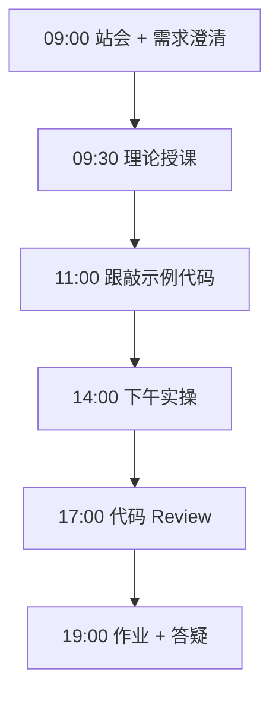
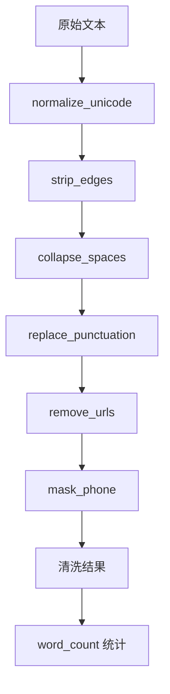

# Day 02：运算符与字符串

> **阶段**：第一阶段:Python编程基础 | **Epic**：NEXUS-E1 | **预计学时**：6-8 小时

## 旁白解读：今日上下文

> 🎬 **模拟站会 09:00** — 智链科技 Nexus 项目组

**林悦**：今天上午客服部发来一批用户反馈，里面全是表情、链接、手机号，直接进知识库会污染检索。Jira D02-S01 要求今天交付一个「文本清洗脚本」，能批量处理。

**陈工**：注意，别写一个 200 行的 `clean_all` 巨无霸函数。企业代码要管道化：每个函数只做一件事，方便单测，也方便以后把某一步换成 ML 模型。下午我们会用正则，别恐惧，先会用 `re.sub` 就够。

**小李（后端）**：字符串为什么不可变？我每次 `s.strip()` 好像改了原串？

**陈工**：`strip` 返回新对象，原串不变。这个特性关系到后面字典 key、缓存 key 的设计。今天把运算符和字符串吃透，明天流程控制写猜数字游戏就轻松了。


**今日在 NexusAgent 主线中的位置**：text_cleaner 是 NexusAgent 文档入库前清洗链路的教学原型

**今日 Jira 看板**：
- `NEXUS-E1-D02-S01`
- `NEXUS-E1-D02-S02`

---


## 需求文档（产品林悦下发）

**文档编号**：PRD-NEXUS-D02  
**版本**：v1.0  
**优先级**：P0

### 背景

第一阶段:Python编程基础阶段第 2 天教学任务，与 NexusAgent 主线项目对齐。

### User Stories

### NEXUS-E1-D02-S01

**描述**：运算符与字符串 相关交付

**验收标准**：
- [ ] 代码可本地运行
- [ ] 通过 `scripts/verify_day.py --day 2`

### NEXUS-E1-D02-S02

**描述**：运算符与字符串 相关交付

**验收标准**：
- [ ] 代码可本地运行
- [ ] 通过 `scripts/verify_day.py --day 2`


---


## 今日课表

### 上午 09:00-12:00

- 09:00 站会：回顾 Day1 MR，讲解字符串不可变特性
- 09:30 算术/比较/逻辑运算符与优先级
- 10:30 字符串方法：strip/split/join/replace/in
- 11:00 切片与索引：正负下标、步长

### 下午 14:00-17:30

- 14:00 引入 re 模块：match/search/sub 基础
- 14:45 跟敲 text_cleaner.py 管道式函数设计
- 16:00 实操：为客服评论样本编写清洗规则
- 17:00 Review：单一职责函数 vs 上帝函数

### 晚自习 19:00-21:00

- 19:00 作业：扩展清洗规则（邮箱打码）
- 20:00 LeetCode 风格小练习：回文字符串判断
- 20:45 阅读 Python 官方 str 文档索引

---


## 课堂笔记

### 核心知识点速查

| 序号 | 知识点 | 代码位置 |
|------|--------|----------|
| 1 | 算术运算符 + - * / // % ** | 见下午实操 |
| 2 | 比较运算符 == != < > <= >= | 见下午实操 |
| 3 | 逻辑运算符 and or not | 见下午实操 |
| 4 | 字符串不可变性与新对象 | 见下午实操 |
| 5 | str 方法 strip/split/join/replace | 见下午实操 |
| 6 | 切片 s[start:end:step] | 见下午实操 |
| 7 | 正则表达式 re.sub/re.findall | 见下午实操 |
| 8 | Unicode 规范化 NFKC | 见下午实操 |
| 9 | 管道式数据处理 | 见下午实操 |
| 10 | 关键字-only 参数 * | 见下午实操 |

### 今日流程图



### 架构示意图（当日目标）



---


## 实操代码清单

- `code/text_cleaner.py`

请按顺序创建并运行。每段代码均可直接复制到对应文件执行。

---

## 实验手册（分时段操作表）

### 实验步骤 1：09:30-10:30 理论

| 时间 | 动作 | 预期结果 | 失败处理 |
|------|------|----------|----------|
| +0min | 打开课件本节 | 看到需求与验收标准 | 检查是否拉取最新 `develop` 分支 |
| +10min | 创建/打开当日 `code/` 文件 | 文件路径与清单一致 | 对照「实操代码清单」 |
| +30min | 粘贴并运行第一个脚本 | 终端有正常输出无 Traceback | 见下方「排错手册」 |
| +60min | 完成全部文件并自测 | `python3` 运行通过 | 使用 `scripts/verify_day.py --day 2` |
| +90min | 提交 Git 并建 MR | MR 关联 Jira NEXUS-E1-D02-S01 | 按附录 Git 示例操作 |


### 实验步骤 2：10:30-12:00 跟敲

| 时间 | 动作 | 预期结果 | 失败处理 |
|------|------|----------|----------|
| +0min | 打开课件本节 | 看到需求与验收标准 | 检查是否拉取最新 `develop` 分支 |
| +10min | 创建/打开当日 `code/` 文件 | 文件路径与清单一致 | 对照「实操代码清单」 |
| +30min | 粘贴并运行第一个脚本 | 终端有正常输出无 Traceback | 见下方「排错手册」 |
| +60min | 完成全部文件并自测 | `python3` 运行通过 | 使用 `scripts/verify_day.py --day 2` |
| +90min | 提交 Git 并建 MR | MR 关联 Jira NEXUS-E1-D02-S01 | 按附录 Git 示例操作 |


### 实验步骤 3：14:00-15:30 实操

| 时间 | 动作 | 预期结果 | 失败处理 |
|------|------|----------|----------|
| +0min | 打开课件本节 | 看到需求与验收标准 | 检查是否拉取最新 `develop` 分支 |
| +10min | 创建/打开当日 `code/` 文件 | 文件路径与清单一致 | 对照「实操代码清单」 |
| +30min | 粘贴并运行第一个脚本 | 终端有正常输出无 Traceback | 见下方「排错手册」 |
| +60min | 完成全部文件并自测 | `python3` 运行通过 | 使用 `scripts/verify_day.py --day 2` |
| +90min | 提交 Git 并建 MR | MR 关联 Jira NEXUS-E1-D02-S01 | 按附录 Git 示例操作 |


### 实验步骤 4：15:30-17:00 联调

| 时间 | 动作 | 预期结果 | 失败处理 |
|------|------|----------|----------|
| +0min | 打开课件本节 | 看到需求与验收标准 | 检查是否拉取最新 `develop` 分支 |
| +10min | 创建/打开当日 `code/` 文件 | 文件路径与清单一致 | 对照「实操代码清单」 |
| +30min | 粘贴并运行第一个脚本 | 终端有正常输出无 Traceback | 见下方「排错手册」 |
| +60min | 完成全部文件并自测 | `python3` 运行通过 | 使用 `scripts/verify_day.py --day 2` |
| +90min | 提交 Git 并建 MR | MR 关联 Jira NEXUS-E1-D02-S01 | 按附录 Git 示例操作 |


### 实验步骤 5：19:00-20:30 作业

| 时间 | 动作 | 预期结果 | 失败处理 |
|------|------|----------|----------|
| +0min | 打开课件本节 | 看到需求与验收标准 | 检查是否拉取最新 `develop` 分支 |
| +10min | 创建/打开当日 `code/` 文件 | 文件路径与清单一致 | 对照「实操代码清单」 |
| +30min | 粘贴并运行第一个脚本 | 终端有正常输出无 Traceback | 见下方「排错手册」 |
| +60min | 完成全部文件并自测 | `python3` 运行通过 | 使用 `scripts/verify_day.py --day 2` |
| +90min | 提交 Git 并建 MR | MR 关联 Jira NEXUS-E1-D02-S01 | 按附录 Git 示例操作 |


### 排错手册（Day 2）

1. **`command not found: python3`** → 安装 Python 3.10+ 或使用 `py -3`（Windows）
2. **`ModuleNotFoundError`** → 确认当前目录、是否激活 venv、`pip install -r requirements.txt`（若当日有）
3. **`SyntaxError: invalid syntax`** → 检查上一行是否缺括号、引号是否中文
4. **`UnicodeDecodeError`** → 文件保存为 UTF-8，终端 `export PYTHONIOENCODING=utf-8`
5. **API 相关（Day12+）** → 检查 `.env` 中 Key，无 Key 时使用课件 MOCK 模式

---


## 逐步跟敲指南（完整源码与解析）

> 以下代码与 `code/` 目录完全一致，可直接复制。每段附行级说明。

### 文件：`code/text_cleaner.py`

**操作步骤**：
1. 在 `courseware/day-02/code/` 下创建文件 `text_cleaner.py`
2. 完整粘贴下方代码
3. 在终端执行：`cd courseware/day-02/code && python3 text_cleaner.py`（若为包内模块则按课件说明）

```python
#!/usr/bin/env python3
# -*- coding: utf-8 -*-
"""
文本清洗工具 text_cleaner.py
企业场景：客服工单、用户评论入库前的标准化预处理
"""

# 导入 re 模块，提供正则表达式能力
import re

# 导入 unicodedata，用于 Unicode 规范化（全角转半角等）
import unicodedata

# 导入 typing 中的类型别名辅助（仅注解，运行时不强制）
from typing import Iterable

# 定义默认需要剥离的空白字符集合
WHITESPACE_CHARS = " \t\n\r\f\v"

# 定义常见中文标点映射表（全角 -> 半角或统一形式）
PUNCT_MAP = {
    "，": ",",
    "。": ".",
    "！": "!",
    "？": "?",
    "：": ":",
    "；": ";",
    "（": "(",
    "）": ")",
    "【": "[",
    "】": "]",
}


def normalize_unicode(text: str) -> str:
    """将文本做 NFC 规范化，减少同形异码问题。"""
    # NFKC 兼容分解再组合，常用于全角字母数字
    return unicodedata.normalize("NFKC", text)


def strip_edges(text: str) -> str:
    """去除首尾空白字符。"""
    # str.strip 可传入自定义字符集
    return text.strip(WHITESPACE_CHARS)


def collapse_internal_spaces(text: str) -> str:
    """将连续空白压缩为单个空格。"""
    # 正则 \s+ 匹配任意空白 run
    return re.sub(r"\s+", " ", text)


def replace_punctuation(text: str, mapping: dict[str, str] | None = None) -> str:
    """按映射表替换标点符号。"""
    # 若未传入映射则使用模块级默认表
    table = mapping if mapping is not None else PUNCT_MAP
    # 遍历映射逐项 replace（数据量小，Day2 足够）
    result = text
    for src, dst in table.items():
        result = result.replace(src, dst)
    return result


def remove_urls(text: str) -> str:
    """删除 http/https 链接，防止垃圾信息入库。"""
    # 简单 URL 正则，教学用途不追求 RFC 完整覆盖
    pattern = r"https?://\S+"
    return re.sub(pattern, "[URL]", text)


def remove_mentions(text: str) -> str:
    """将 @用户名 替换为占位符。"""
    pattern = r"@\w+"
    return re.sub(pattern, "@USER", text)


def mask_phone_numbers(text: str) -> str:
    """中国大陆手机号打码：保留前3后4。"""
    def _mask(match: re.Match[str]) -> str:
        # 提取匹配到的完整号码字符串
        phone = match.group(0)
        # 长度不足则原样返回
        if len(phone) < 7:
            return phone
        # 中间四位替换为星号
        return phone[:3] + "****" + phone[-4:]
    # 匹配 11 位 1 开头手机号
    return re.sub(r"1\d{10}", _mask, text)


def clean_text(raw: str, *, mask_phone: bool = True) -> str:
    """
    管道式清洗：按固定顺序应用各子步骤。
    mask_phone 为关键字-only 参数，调用时必须写参数名。
    """
    # 空输入直接返回空串，避免后续无意义计算
    if not raw:
        return ""
    # 步骤 1：Unicode 规范化
    step = normalize_unicode(raw)
    # 步骤 2：去首尾空白
    step = strip_edges(step)
    # 步骤 3：压缩内部空白
    step = collapse_internal_spaces(step)
    # 步骤 4：标点统一
    step = replace_punctuation(step)
    # 步骤 5：URL 与 @ 处理
    step = remove_urls(step)
    step = remove_mentions(step)
    # 步骤 6：可选手机号脱敏
    if mask_phone:
        step = mask_phone_numbers(step)
    return step


def batch_clean(lines: Iterable[str]) -> list[str]:
    """批量清洗多行文本，返回新列表。"""
    # 列表推导式对每行调用 clean_text
    return [clean_text(line) for line in lines]


def word_count(text: str) -> dict[str, int]:
    """统计字符数、词数（空白分词）、行数。"""
    # 字符总数含标点
    chars = len(text)
    # split 默认按任意空白切分
    words = len(text.split()) if text else 0
    # 按换行分段
    lines = len(text.splitlines()) if text else 0
    # 返回结构化统计字典
    return {"chars": chars, "words": words, "lines": lines}


def demo() -> None:
    """演示入口：构造脏数据并打印清洗前后对比。"""
    dirty_samples = [
        "  你好，世界！  访问 https://smartlink.cn/docs  ",
        "@alice 我的手机号是13812345678，请回电。",
        "全角ＡＢＣ１２３　测试",
    ]
    print("=" * 56)
    print("text_cleaner 演示")
    print("=" * 56)
    for idx, raw in enumerate(dirty_samples, start=1):
        cleaned = clean_text(raw)
        stats = word_count(cleaned)
        print(f"[样本 {idx}] 原始: {raw!r}")
        print(f"[样本 {idx}] 清洗: {cleaned!r}")
        print(f"[样本 {idx}] 统计: {stats}")
        print("-" * 56)


def main() -> None:
    demo()


if __name__ == "__main__":
    main()

```

**解析要点（`text_cleaner.py`）**：

- 共 **158** 行，请逐行阅读注释中的中文说明

- 运行前确认 Python 版本 ≥ 3.10：`python3 --version`

- 若报错，先检查缩进是否为 4 空格，勿混用 Tab

- 企业 Review 清单：命名是否清晰、是否有异常处理、是否可复用

---


### 深度讲解 1：算术运算符 + - * / // % **

在企业级 Python 开发与大模型应用工程中，**算术运算符 + - * / // % **** 是学员必须牢固掌握的基本功。智链科技 Nexus 项目组在 Day 2 的代码评审中，特别强调以下几点：

1. **为什么学**：算术运算符 + - * / // % ** 直接服务于后续 NexusAgent 平台的 `NEXUS-E1` 模块。没有扎实的 算术运算符 + - * / // % **，Day 9 之后调用 API、解析 JSON、编写 Agent 工具函数时会出现大量低级错误。

2. **常见坑**：
   - 忽略输入类型校验，导致运行时 `TypeError`
   - 编码问题（Windows 默认 GBK vs UTF-8）
   - 复制粘贴时缩进错乱（Python 对缩进敏感）

3. **企业实践**：在 SmartLink 的 GitLab 仓库中，所有与 算术运算符 + - * / // % ** 相关的代码必须经过 Ruff 静态检查；变量命名使用 `snake_case`，常量使用 `UPPER_SNAKE_CASE`。

4. **与主线项目的关系**：今日代码位于 `courseware/day-02/code/`，部分模块将逐步合并到 `platform/nexus_agent/`。请养成「每日代码皆可运行、皆可测试」的习惯。

5. **扩展阅读建议**：完成今日作业后，可阅读 `docs/project-master-plan.md` 中关于 NEXUS-E1 的章节，建立全局视角。

**课堂互动题**：请用 3 句话向非技术同事解释「算术运算符 + - * / // % **」是什么。写在作业 MR 的评论里，讲师会抽查点评。

**实操检查清单**：
- [ ] 能不看课件复述 算术运算符 + - * / // % ** 的定义
- [ ] 能独立写出相关代码并运行
- [ ] 能向同学讲解一处容易写错的地方


### 深度讲解 2：比较运算符 == != < > <= >=

在企业级 Python 开发与大模型应用工程中，**比较运算符 == != < > <= >=** 是学员必须牢固掌握的基本功。智链科技 Nexus 项目组在 Day 2 的代码评审中，特别强调以下几点：

1. **为什么学**：比较运算符 == != < > <= >= 直接服务于后续 NexusAgent 平台的 `NEXUS-E1` 模块。没有扎实的 比较运算符 == != < > <= >=，Day 9 之后调用 API、解析 JSON、编写 Agent 工具函数时会出现大量低级错误。

2. **常见坑**：
   - 忽略输入类型校验，导致运行时 `TypeError`
   - 编码问题（Windows 默认 GBK vs UTF-8）
   - 复制粘贴时缩进错乱（Python 对缩进敏感）

3. **企业实践**：在 SmartLink 的 GitLab 仓库中，所有与 比较运算符 == != < > <= >= 相关的代码必须经过 Ruff 静态检查；变量命名使用 `snake_case`，常量使用 `UPPER_SNAKE_CASE`。

4. **与主线项目的关系**：今日代码位于 `courseware/day-02/code/`，部分模块将逐步合并到 `platform/nexus_agent/`。请养成「每日代码皆可运行、皆可测试」的习惯。

5. **扩展阅读建议**：完成今日作业后，可阅读 `docs/project-master-plan.md` 中关于 NEXUS-E1 的章节，建立全局视角。

**课堂互动题**：请用 3 句话向非技术同事解释「比较运算符 == != < > <= >=」是什么。写在作业 MR 的评论里，讲师会抽查点评。

**实操检查清单**：
- [ ] 能不看课件复述 比较运算符 == != < > <= >= 的定义
- [ ] 能独立写出相关代码并运行
- [ ] 能向同学讲解一处容易写错的地方


### 深度讲解 3：逻辑运算符 and or not

在企业级 Python 开发与大模型应用工程中，**逻辑运算符 and or not** 是学员必须牢固掌握的基本功。智链科技 Nexus 项目组在 Day 2 的代码评审中，特别强调以下几点：

1. **为什么学**：逻辑运算符 and or not 直接服务于后续 NexusAgent 平台的 `NEXUS-E1` 模块。没有扎实的 逻辑运算符 and or not，Day 9 之后调用 API、解析 JSON、编写 Agent 工具函数时会出现大量低级错误。

2. **常见坑**：
   - 忽略输入类型校验，导致运行时 `TypeError`
   - 编码问题（Windows 默认 GBK vs UTF-8）
   - 复制粘贴时缩进错乱（Python 对缩进敏感）

3. **企业实践**：在 SmartLink 的 GitLab 仓库中，所有与 逻辑运算符 and or not 相关的代码必须经过 Ruff 静态检查；变量命名使用 `snake_case`，常量使用 `UPPER_SNAKE_CASE`。

4. **与主线项目的关系**：今日代码位于 `courseware/day-02/code/`，部分模块将逐步合并到 `platform/nexus_agent/`。请养成「每日代码皆可运行、皆可测试」的习惯。

5. **扩展阅读建议**：完成今日作业后，可阅读 `docs/project-master-plan.md` 中关于 NEXUS-E1 的章节，建立全局视角。

**课堂互动题**：请用 3 句话向非技术同事解释「逻辑运算符 and or not」是什么。写在作业 MR 的评论里，讲师会抽查点评。

**实操检查清单**：
- [ ] 能不看课件复述 逻辑运算符 and or not 的定义
- [ ] 能独立写出相关代码并运行
- [ ] 能向同学讲解一处容易写错的地方


### 深度讲解 4：字符串不可变性与新对象

在企业级 Python 开发与大模型应用工程中，**字符串不可变性与新对象** 是学员必须牢固掌握的基本功。智链科技 Nexus 项目组在 Day 2 的代码评审中，特别强调以下几点：

1. **为什么学**：字符串不可变性与新对象 直接服务于后续 NexusAgent 平台的 `NEXUS-E1` 模块。没有扎实的 字符串不可变性与新对象，Day 9 之后调用 API、解析 JSON、编写 Agent 工具函数时会出现大量低级错误。

2. **常见坑**：
   - 忽略输入类型校验，导致运行时 `TypeError`
   - 编码问题（Windows 默认 GBK vs UTF-8）
   - 复制粘贴时缩进错乱（Python 对缩进敏感）

3. **企业实践**：在 SmartLink 的 GitLab 仓库中，所有与 字符串不可变性与新对象 相关的代码必须经过 Ruff 静态检查；变量命名使用 `snake_case`，常量使用 `UPPER_SNAKE_CASE`。

4. **与主线项目的关系**：今日代码位于 `courseware/day-02/code/`，部分模块将逐步合并到 `platform/nexus_agent/`。请养成「每日代码皆可运行、皆可测试」的习惯。

5. **扩展阅读建议**：完成今日作业后，可阅读 `docs/project-master-plan.md` 中关于 NEXUS-E1 的章节，建立全局视角。

**课堂互动题**：请用 3 句话向非技术同事解释「字符串不可变性与新对象」是什么。写在作业 MR 的评论里，讲师会抽查点评。

**实操检查清单**：
- [ ] 能不看课件复述 字符串不可变性与新对象 的定义
- [ ] 能独立写出相关代码并运行
- [ ] 能向同学讲解一处容易写错的地方


### 深度讲解 5：str 方法 strip/split/join/replace

在企业级 Python 开发与大模型应用工程中，**str 方法 strip/split/join/replace** 是学员必须牢固掌握的基本功。智链科技 Nexus 项目组在 Day 2 的代码评审中，特别强调以下几点：

1. **为什么学**：str 方法 strip/split/join/replace 直接服务于后续 NexusAgent 平台的 `NEXUS-E1` 模块。没有扎实的 str 方法 strip/split/join/replace，Day 9 之后调用 API、解析 JSON、编写 Agent 工具函数时会出现大量低级错误。

2. **常见坑**：
   - 忽略输入类型校验，导致运行时 `TypeError`
   - 编码问题（Windows 默认 GBK vs UTF-8）
   - 复制粘贴时缩进错乱（Python 对缩进敏感）

3. **企业实践**：在 SmartLink 的 GitLab 仓库中，所有与 str 方法 strip/split/join/replace 相关的代码必须经过 Ruff 静态检查；变量命名使用 `snake_case`，常量使用 `UPPER_SNAKE_CASE`。

4. **与主线项目的关系**：今日代码位于 `courseware/day-02/code/`，部分模块将逐步合并到 `platform/nexus_agent/`。请养成「每日代码皆可运行、皆可测试」的习惯。

5. **扩展阅读建议**：完成今日作业后，可阅读 `docs/project-master-plan.md` 中关于 NEXUS-E1 的章节，建立全局视角。

**课堂互动题**：请用 3 句话向非技术同事解释「str 方法 strip/split/join/replace」是什么。写在作业 MR 的评论里，讲师会抽查点评。

**实操检查清单**：
- [ ] 能不看课件复述 str 方法 strip/split/join/replace 的定义
- [ ] 能独立写出相关代码并运行
- [ ] 能向同学讲解一处容易写错的地方


### 深度讲解 6：切片 s[start:end:step]

在企业级 Python 开发与大模型应用工程中，**切片 s[start:end:step]** 是学员必须牢固掌握的基本功。智链科技 Nexus 项目组在 Day 2 的代码评审中，特别强调以下几点：

1. **为什么学**：切片 s[start:end:step] 直接服务于后续 NexusAgent 平台的 `NEXUS-E1` 模块。没有扎实的 切片 s[start:end:step]，Day 9 之后调用 API、解析 JSON、编写 Agent 工具函数时会出现大量低级错误。

2. **常见坑**：
   - 忽略输入类型校验，导致运行时 `TypeError`
   - 编码问题（Windows 默认 GBK vs UTF-8）
   - 复制粘贴时缩进错乱（Python 对缩进敏感）

3. **企业实践**：在 SmartLink 的 GitLab 仓库中，所有与 切片 s[start:end:step] 相关的代码必须经过 Ruff 静态检查；变量命名使用 `snake_case`，常量使用 `UPPER_SNAKE_CASE`。

4. **与主线项目的关系**：今日代码位于 `courseware/day-02/code/`，部分模块将逐步合并到 `platform/nexus_agent/`。请养成「每日代码皆可运行、皆可测试」的习惯。

5. **扩展阅读建议**：完成今日作业后，可阅读 `docs/project-master-plan.md` 中关于 NEXUS-E1 的章节，建立全局视角。

**课堂互动题**：请用 3 句话向非技术同事解释「切片 s[start:end:step]」是什么。写在作业 MR 的评论里，讲师会抽查点评。

**实操检查清单**：
- [ ] 能不看课件复述 切片 s[start:end:step] 的定义
- [ ] 能独立写出相关代码并运行
- [ ] 能向同学讲解一处容易写错的地方


### 深度讲解 7：正则表达式 re.sub/re.findall

在企业级 Python 开发与大模型应用工程中，**正则表达式 re.sub/re.findall** 是学员必须牢固掌握的基本功。智链科技 Nexus 项目组在 Day 2 的代码评审中，特别强调以下几点：

1. **为什么学**：正则表达式 re.sub/re.findall 直接服务于后续 NexusAgent 平台的 `NEXUS-E1` 模块。没有扎实的 正则表达式 re.sub/re.findall，Day 9 之后调用 API、解析 JSON、编写 Agent 工具函数时会出现大量低级错误。

2. **常见坑**：
   - 忽略输入类型校验，导致运行时 `TypeError`
   - 编码问题（Windows 默认 GBK vs UTF-8）
   - 复制粘贴时缩进错乱（Python 对缩进敏感）

3. **企业实践**：在 SmartLink 的 GitLab 仓库中，所有与 正则表达式 re.sub/re.findall 相关的代码必须经过 Ruff 静态检查；变量命名使用 `snake_case`，常量使用 `UPPER_SNAKE_CASE`。

4. **与主线项目的关系**：今日代码位于 `courseware/day-02/code/`，部分模块将逐步合并到 `platform/nexus_agent/`。请养成「每日代码皆可运行、皆可测试」的习惯。

5. **扩展阅读建议**：完成今日作业后，可阅读 `docs/project-master-plan.md` 中关于 NEXUS-E1 的章节，建立全局视角。

**课堂互动题**：请用 3 句话向非技术同事解释「正则表达式 re.sub/re.findall」是什么。写在作业 MR 的评论里，讲师会抽查点评。

**实操检查清单**：
- [ ] 能不看课件复述 正则表达式 re.sub/re.findall 的定义
- [ ] 能独立写出相关代码并运行
- [ ] 能向同学讲解一处容易写错的地方


### 深度讲解 8：Unicode 规范化 NFKC

在企业级 Python 开发与大模型应用工程中，**Unicode 规范化 NFKC** 是学员必须牢固掌握的基本功。智链科技 Nexus 项目组在 Day 2 的代码评审中，特别强调以下几点：

1. **为什么学**：Unicode 规范化 NFKC 直接服务于后续 NexusAgent 平台的 `NEXUS-E1` 模块。没有扎实的 Unicode 规范化 NFKC，Day 9 之后调用 API、解析 JSON、编写 Agent 工具函数时会出现大量低级错误。

2. **常见坑**：
   - 忽略输入类型校验，导致运行时 `TypeError`
   - 编码问题（Windows 默认 GBK vs UTF-8）
   - 复制粘贴时缩进错乱（Python 对缩进敏感）

3. **企业实践**：在 SmartLink 的 GitLab 仓库中，所有与 Unicode 规范化 NFKC 相关的代码必须经过 Ruff 静态检查；变量命名使用 `snake_case`，常量使用 `UPPER_SNAKE_CASE`。

4. **与主线项目的关系**：今日代码位于 `courseware/day-02/code/`，部分模块将逐步合并到 `platform/nexus_agent/`。请养成「每日代码皆可运行、皆可测试」的习惯。

5. **扩展阅读建议**：完成今日作业后，可阅读 `docs/project-master-plan.md` 中关于 NEXUS-E1 的章节，建立全局视角。

**课堂互动题**：请用 3 句话向非技术同事解释「Unicode 规范化 NFKC」是什么。写在作业 MR 的评论里，讲师会抽查点评。

**实操检查清单**：
- [ ] 能不看课件复述 Unicode 规范化 NFKC 的定义
- [ ] 能独立写出相关代码并运行
- [ ] 能向同学讲解一处容易写错的地方


### 深度讲解 9：管道式数据处理

在企业级 Python 开发与大模型应用工程中，**管道式数据处理** 是学员必须牢固掌握的基本功。智链科技 Nexus 项目组在 Day 2 的代码评审中，特别强调以下几点：

1. **为什么学**：管道式数据处理 直接服务于后续 NexusAgent 平台的 `NEXUS-E1` 模块。没有扎实的 管道式数据处理，Day 9 之后调用 API、解析 JSON、编写 Agent 工具函数时会出现大量低级错误。

2. **常见坑**：
   - 忽略输入类型校验，导致运行时 `TypeError`
   - 编码问题（Windows 默认 GBK vs UTF-8）
   - 复制粘贴时缩进错乱（Python 对缩进敏感）

3. **企业实践**：在 SmartLink 的 GitLab 仓库中，所有与 管道式数据处理 相关的代码必须经过 Ruff 静态检查；变量命名使用 `snake_case`，常量使用 `UPPER_SNAKE_CASE`。

4. **与主线项目的关系**：今日代码位于 `courseware/day-02/code/`，部分模块将逐步合并到 `platform/nexus_agent/`。请养成「每日代码皆可运行、皆可测试」的习惯。

5. **扩展阅读建议**：完成今日作业后，可阅读 `docs/project-master-plan.md` 中关于 NEXUS-E1 的章节，建立全局视角。

**课堂互动题**：请用 3 句话向非技术同事解释「管道式数据处理」是什么。写在作业 MR 的评论里，讲师会抽查点评。

**实操检查清单**：
- [ ] 能不看课件复述 管道式数据处理 的定义
- [ ] 能独立写出相关代码并运行
- [ ] 能向同学讲解一处容易写错的地方


### 深度讲解 10：关键字-only 参数 *

在企业级 Python 开发与大模型应用工程中，**关键字-only 参数 *** 是学员必须牢固掌握的基本功。智链科技 Nexus 项目组在 Day 2 的代码评审中，特别强调以下几点：

1. **为什么学**：关键字-only 参数 * 直接服务于后续 NexusAgent 平台的 `NEXUS-E1` 模块。没有扎实的 关键字-only 参数 *，Day 9 之后调用 API、解析 JSON、编写 Agent 工具函数时会出现大量低级错误。

2. **常见坑**：
   - 忽略输入类型校验，导致运行时 `TypeError`
   - 编码问题（Windows 默认 GBK vs UTF-8）
   - 复制粘贴时缩进错乱（Python 对缩进敏感）

3. **企业实践**：在 SmartLink 的 GitLab 仓库中，所有与 关键字-only 参数 * 相关的代码必须经过 Ruff 静态检查；变量命名使用 `snake_case`，常量使用 `UPPER_SNAKE_CASE`。

4. **与主线项目的关系**：今日代码位于 `courseware/day-02/code/`，部分模块将逐步合并到 `platform/nexus_agent/`。请养成「每日代码皆可运行、皆可测试」的习惯。

5. **扩展阅读建议**：完成今日作业后，可阅读 `docs/project-master-plan.md` 中关于 NEXUS-E1 的章节，建立全局视角。

**课堂互动题**：请用 3 句话向非技术同事解释「关键字-only 参数 *」是什么。写在作业 MR 的评论里，讲师会抽查点评。

**实操检查清单**：
- [ ] 能不看课件复述 关键字-only 参数 * 的定义
- [ ] 能独立写出相关代码并运行
- [ ] 能向同学讲解一处容易写错的地方


## 阶段复盘锚点（第一阶段:Python编程基础）

今天是 **第一阶段:Python编程基础** 的第 **2** 个学习日。请回顾：

- 昨天学了什么？今天如何承接？
- 今天的内容在 70 天路线图中的坐标？
- 如果我是 Tech Lead，会如何 Review 今日代码？

**陈工寄语**：慢即是快。企业里没人关心你一天学了多少个语法点，只关心你写的脚本能不能在服务器上稳定跑 7×24 小时。今天把地基打牢，后面 Agent 编排、RAG 检索才不会塌。

**林悦补充**：产品侧只验收「用户能感知到的价值」。今日交付虽然简单，但「个人信息卡片」本质是后续「用户画像 Agent」的数据采集原型——字段设计请认真思考。

**代码量统计（累计）**：完成今日后，个人仓库累计约 **2800** 行（含注释与测试），全营目标 10 万行。

**明日预告**：请提前阅读 `courseware/day-03/README.md` 开头的旁白，了解上下文。


## 常见问题 FAQ（讲师答疑实录）


**Q1：学习「算术运算符 + - * / // % **」时最常问的问题是什么？**

A：学员常问「这在大模型开发里到底用在哪里」。直接回答：在 NexusAgent 的 `NEXUS-E1` 中，算术运算符 + - * / // % ** 用于支撑「运算符与字符串」这一交付。建议你打开 `platform/` 对照看未来模块如何引用今日写法。另一个常见问题是「要不要背语法」——不需要背，但要能写出可运行代码，并能在报错时读懂 Traceback。

**追问**：如果线上报错与 算术运算符 + - * / // % ** 相关，如何排查？  
**答**：① 复现 ② 最小化输入 ③ 打印中间变量 ④ 查 GitLab 历史 diff ⑤ 在 Jira 建 Bug 单附上日志。


**Q2：学习「比较运算符 == != < > <= >=」时最常问的问题是什么？**

A：学员常问「这在大模型开发里到底用在哪里」。直接回答：在 NexusAgent 的 `NEXUS-E1` 中，比较运算符 == != < > <= >= 用于支撑「运算符与字符串」这一交付。建议你打开 `platform/` 对照看未来模块如何引用今日写法。另一个常见问题是「要不要背语法」——不需要背，但要能写出可运行代码，并能在报错时读懂 Traceback。

**追问**：如果线上报错与 比较运算符 == != < > <= >= 相关，如何排查？  
**答**：① 复现 ② 最小化输入 ③ 打印中间变量 ④ 查 GitLab 历史 diff ⑤ 在 Jira 建 Bug 单附上日志。


**Q3：学习「逻辑运算符 and or not」时最常问的问题是什么？**

A：学员常问「这在大模型开发里到底用在哪里」。直接回答：在 NexusAgent 的 `NEXUS-E1` 中，逻辑运算符 and or not 用于支撑「运算符与字符串」这一交付。建议你打开 `platform/` 对照看未来模块如何引用今日写法。另一个常见问题是「要不要背语法」——不需要背，但要能写出可运行代码，并能在报错时读懂 Traceback。

**追问**：如果线上报错与 逻辑运算符 and or not 相关，如何排查？  
**答**：① 复现 ② 最小化输入 ③ 打印中间变量 ④ 查 GitLab 历史 diff ⑤ 在 Jira 建 Bug 单附上日志。


**Q4：学习「字符串不可变性与新对象」时最常问的问题是什么？**

A：学员常问「这在大模型开发里到底用在哪里」。直接回答：在 NexusAgent 的 `NEXUS-E1` 中，字符串不可变性与新对象 用于支撑「运算符与字符串」这一交付。建议你打开 `platform/` 对照看未来模块如何引用今日写法。另一个常见问题是「要不要背语法」——不需要背，但要能写出可运行代码，并能在报错时读懂 Traceback。

**追问**：如果线上报错与 字符串不可变性与新对象 相关，如何排查？  
**答**：① 复现 ② 最小化输入 ③ 打印中间变量 ④ 查 GitLab 历史 diff ⑤ 在 Jira 建 Bug 单附上日志。


**Q5：学习「str 方法 strip/split/join/replace」时最常问的问题是什么？**

A：学员常问「这在大模型开发里到底用在哪里」。直接回答：在 NexusAgent 的 `NEXUS-E1` 中，str 方法 strip/split/join/replace 用于支撑「运算符与字符串」这一交付。建议你打开 `platform/` 对照看未来模块如何引用今日写法。另一个常见问题是「要不要背语法」——不需要背，但要能写出可运行代码，并能在报错时读懂 Traceback。

**追问**：如果线上报错与 str 方法 strip/split/join/replace 相关，如何排查？  
**答**：① 复现 ② 最小化输入 ③ 打印中间变量 ④ 查 GitLab 历史 diff ⑤ 在 Jira 建 Bug 单附上日志。


**Q6：学习「切片 s[start:end:step]」时最常问的问题是什么？**

A：学员常问「这在大模型开发里到底用在哪里」。直接回答：在 NexusAgent 的 `NEXUS-E1` 中，切片 s[start:end:step] 用于支撑「运算符与字符串」这一交付。建议你打开 `platform/` 对照看未来模块如何引用今日写法。另一个常见问题是「要不要背语法」——不需要背，但要能写出可运行代码，并能在报错时读懂 Traceback。

**追问**：如果线上报错与 切片 s[start:end:step] 相关，如何排查？  
**答**：① 复现 ② 最小化输入 ③ 打印中间变量 ④ 查 GitLab 历史 diff ⑤ 在 Jira 建 Bug 单附上日志。


**Q7：学习「正则表达式 re.sub/re.findall」时最常问的问题是什么？**

A：学员常问「这在大模型开发里到底用在哪里」。直接回答：在 NexusAgent 的 `NEXUS-E1` 中，正则表达式 re.sub/re.findall 用于支撑「运算符与字符串」这一交付。建议你打开 `platform/` 对照看未来模块如何引用今日写法。另一个常见问题是「要不要背语法」——不需要背，但要能写出可运行代码，并能在报错时读懂 Traceback。

**追问**：如果线上报错与 正则表达式 re.sub/re.findall 相关，如何排查？  
**答**：① 复现 ② 最小化输入 ③ 打印中间变量 ④ 查 GitLab 历史 diff ⑤ 在 Jira 建 Bug 单附上日志。


**Q8：学习「Unicode 规范化 NFKC」时最常问的问题是什么？**

A：学员常问「这在大模型开发里到底用在哪里」。直接回答：在 NexusAgent 的 `NEXUS-E1` 中，Unicode 规范化 NFKC 用于支撑「运算符与字符串」这一交付。建议你打开 `platform/` 对照看未来模块如何引用今日写法。另一个常见问题是「要不要背语法」——不需要背，但要能写出可运行代码，并能在报错时读懂 Traceback。

**追问**：如果线上报错与 Unicode 规范化 NFKC 相关，如何排查？  
**答**：① 复现 ② 最小化输入 ③ 打印中间变量 ④ 查 GitLab 历史 diff ⑤ 在 Jira 建 Bug 单附上日志。


**Q9：学习「管道式数据处理」时最常问的问题是什么？**

A：学员常问「这在大模型开发里到底用在哪里」。直接回答：在 NexusAgent 的 `NEXUS-E1` 中，管道式数据处理 用于支撑「运算符与字符串」这一交付。建议你打开 `platform/` 对照看未来模块如何引用今日写法。另一个常见问题是「要不要背语法」——不需要背，但要能写出可运行代码，并能在报错时读懂 Traceback。

**追问**：如果线上报错与 管道式数据处理 相关，如何排查？  
**答**：① 复现 ② 最小化输入 ③ 打印中间变量 ④ 查 GitLab 历史 diff ⑤ 在 Jira 建 Bug 单附上日志。


**Q10：学习「关键字-only 参数 *」时最常问的问题是什么？**

A：学员常问「这在大模型开发里到底用在哪里」。直接回答：在 NexusAgent 的 `NEXUS-E1` 中，关键字-only 参数 * 用于支撑「运算符与字符串」这一交付。建议你打开 `platform/` 对照看未来模块如何引用今日写法。另一个常见问题是「要不要背语法」——不需要背，但要能写出可运行代码，并能在报错时读懂 Traceback。

**追问**：如果线上报错与 关键字-only 参数 * 相关，如何排查？  
**答**：① 复现 ② 最小化输入 ③ 打印中间变量 ④ 查 GitLab 历史 diff ⑤ 在 Jira 建 Bug 单附上日志。


## 面试押题（与今日知识点挂钩）

以下题目会出现在 Day 67-69 模拟面试中，建议今日就开始积累答案：

1. **算术运算符 + - * / // % ****：请结合 NexusAgent 项目举例说明你在哪一天、哪段代码里用到了它？
2. **比较运算符 == != < > <= >=**：请结合 NexusAgent 项目举例说明你在哪一天、哪段代码里用到了它？
3. **逻辑运算符 and or not**：请结合 NexusAgent 项目举例说明你在哪一天、哪段代码里用到了它？
4. **字符串不可变性与新对象**：请结合 NexusAgent 项目举例说明你在哪一天、哪段代码里用到了它？
5. **str 方法 strip/split/join/replace**：请结合 NexusAgent 项目举例说明你在哪一天、哪段代码里用到了它？
6. **切片 s[start:end:step]**：请结合 NexusAgent 项目举例说明你在哪一天、哪段代码里用到了它？

**参考答案思路**：采用 STAR 法则（情境-任务-行动-结果），引用 `courseware/day-02/code/` 中的具体文件名与函数名。

---


## Code Review 检查表（陈工版）

合并 MR 前自查：

- [ ] 所有新增 `.py` 文件顶部有模块说明 docstring
- [ ] 无硬编码密钥（API Key 走环境变量）
- [ ] 函数长度 < 50 行，过长则拆分
- [ ] 异常有明确提示，禁止裸 `except:`
- [ ] 提交信息符合 `feat(day-02): ...`
- [ ] README 或注释说明如何运行
- [ ] 与 Jira Story 验收标准逐条对应

**今日重点审查项**：运算符与字符串 相关逻辑是否可读、可测、可扩展至 `platform/nexus_agent/`。

---


## 课后作业

### 作业说明

**作业：扩展 text_cleaner**

1. 在 `homework/text_cleaner_hw.py` 中复制并扩展 `clean_text`
2. 新增 `mask_email(text)`：将 `user@domain.com` 转为 `u***@domain.com`
3. 新增 `extract_hashtags(text)`：返回文本中所有 `#话题` 列表（不含 #）
4. 编写 `assert` 自测至少 3 个用例
5. 提交 MR 并附终端运行截图


### 提交要求

1. 代码提交到分支 `feature/day-02-homework`
2. GitLab MR 标题：`[Day-02] homework: 课后作业`
3. 在 MR 描述中附上运行截图或终端输出

### 评分标准（满分 100）

| 项 | 分值 |
|----|------|
| 功能完整 | 40 |
| 代码规范与注释 | 30 |
| 异常处理 | 15 |
| MR 与 Jira 关联 | 15 |

---

## 作业参考答案

> ⚠️ 请先独立完成再对照答案

```python
import re

def mask_email(text: str) -> str:
  def repl(m: re.Match[str]) -> str:
    user, domain = m.group(1), m.group(2)
    masked = (user[0] + "***") if user else "***"
    return f"{masked}@{domain}"
  return re.sub(r"([\w.+-]+)@([\w.-]+)", repl, text)

def extract_hashtags(text: str) -> list[str]:
  return re.findall(r"#([\w\u4e00-\u9fff]+)", text)

def clean_text(raw: str) -> str:
  step = raw.strip()
  step = mask_email(step)
  return step

assert extract_hashtags("关注 #NexusAgent #大模型") == ["NexusAgent", "大模型"]
assert "@" in mask_email("a@b.com")
print("homework tests passed")
```


---


## 附录：Git 提交示例

```bash
git checkout develop
git pull origin develop
git checkout -b feature/day-02-运算符与字符串
# 完成代码后
git add courseware/day-02/
git commit -m "feat(day-02): 运算符与字符串"
git push -u origin feature/day-02-运算符与字符串
```

---

*课件版本 Day-02-v1.0 | 智链科技培训中心*
