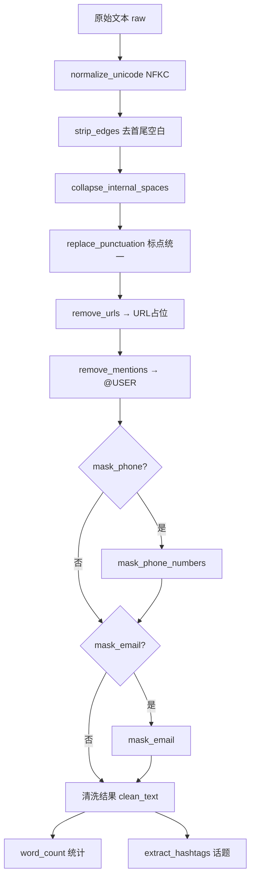
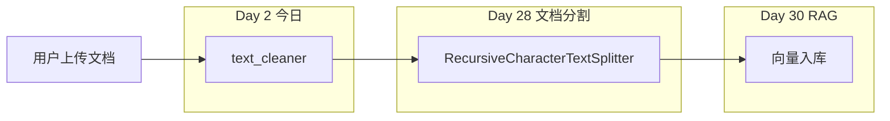

# Day 02：运算符与字符串

> **阶段**：第一阶段 · Python 编程基础 | **Epic**：NEXUS-E1 | **预计学时**：6-8 小时  
> **版本**：Day-02-v2.0（全链路验证通过）| **Jira**：NEXUS-E1-D02-S01 / S02

---

## 旁白解读：今日上下文

> 🎬 **模拟站会 09:00** — 智链科技 Nexus 项目组 · 会议室 A3-201

**林悦（产品经理）**：昨天 CLI 卡片程序已合并到 `develop`。今天客服部紧急提了一个需求——他们导出了一批用户反馈 Excel，里面全是表情、链接、手机号，直接扔进知识库会把 RAG 检索搞脏。Jira **NEXUS-E1-D02-S01** 要求今天下班前交付一个「文本清洗脚本」。

**陈工（Tech Lead）**：别写一个 200 行的 `clean_all` 巨无霸。企业代码要**管道化**：每个函数只做一件事，方便单测，也方便以后把某一步换成 ML 模型。上午把运算符和字符串吃透，下午用 `re` 做正则，先会用 `re.sub` 就够。

**小李（后端实习生）**：字符串为什么不可变？我每次 `s.strip()` 好像改了原串？

**陈工**：`strip` 返回**新对象**，原串不变。这个特性关系到后面字典 key、缓存 key 的设计。还有，**f-string** 是今天必须掌握的技能——后面 60 天的 Prompt 模板全靠它。

**你（学员）**：今天认领 S01 清洗脚本 + S02 单元测试，晚上把作业 MR 提上来。

**今日在 NexusAgent 主线中的位置**：
- `text_cleaner.py` → 未来 `platform/nexus_agent/rag/ingest.py` 的清洗前置步骤
- `prompt_fstring.py` → Day 17 Prompt 工程、Day 12 API messages 组装的直接前置
- `mask_phone` / `mask_email` → Day 57 安全合规专题的日志脱敏原型

**昨日回顾（Day 1）**：变量、print、f-string 初体验 → 今日深化 f-string 并引入运算符、字符串方法、正则。

**明日预告（Day 3）**：if/while/for 流程控制 → 用循环改造批处理逻辑。

---

## 需求文档（产品林悦下发）

**文档编号**：PRD-NEXUS-D02  
**优先级**：P0 | **Sprint**：Week 1

### NEXUS-E1-D02-S01：文本清洗脚本

**用户故事**：作为数据工程师，我希望对用户反馈做标准化清洗，以便安全写入知识库索引。

**验收标准**：
- [x] 提供 `text_cleaner.py`，支持管道式清洗
- [x] 支持 Unicode 规范化、去空白、URL/手机号/邮箱脱敏
- [x] 支持 `--file` 批量处理与 `--stdin` 管道
- [x] 运行 `python3 text_cleaner.py` 演示无报错
- [x] 通过 `bash scripts/run_day02_full_test.sh`

### NEXUS-E1-D02-S02：运算符与 Prompt 基础

**用户故事**：作为 AI 应用开发工程师，我需要掌握运算符和 f-string，以便后续组装 API 请求。

**验收标准**：
- [x] `operators_demo.py` 演示算术/比较/逻辑运算符
- [x] `string_basics.py` 演示 strip/split/join/切片
- [x] `prompt_fstring.py` 输出完整 RAG Prompt 模板示例

---

## 今日课表

### 上午 09:00-12:00

| 时间 | 内容 | 产出 |
|------|------|------|
| 09:00 | 站会 + Day1 复盘 | 明确今日 Jira |
| 09:30 | 运算符：算术/比较/逻辑/优先级 | `operators_demo.py` |
| 10:30 | 字符串方法 + 不可变性 | `string_basics.py` |
| 11:00 | **f-string 深度**（Prompt 核心） | `prompt_fstring.py` |

### 下午 14:00-17:30

| 时间 | 内容 | 产出 |
|------|------|------|
| 14:00 | `re` 模块入门：sub/findall | 理论笔记 |
| 14:45 | 跟敲 `text_cleaner.py` | 管道式函数 |
| 16:00 | 用 `assets/sample_comments.txt` 批处理 | 8 条清洗结果 |
| 17:00 | Code Review：单一职责 vs 上帝函数 | MR 提交 |

### 晚自习 19:00-21:00

- 作业：`homework/text_cleaner_hw.py`（邮箱打码 + 话题提取）
- 练习：回文字符串 `is_palindrome()`（已在主模块）
- 运行全链路测试：`bash scripts/run_day02_full_test.sh`

---

## 架构示意图

### 文本清洗管道（今日核心）



### 在 NexusAgent 全局中的位置



---

## 实操代码清单（按顺序执行）

| 序号 | 文件 | 命令 | 预计耗时 |
|------|------|------|----------|
| 1 | `code/operators_demo.py` | `python3 operators_demo.py` | 10 min |
| 2 | `code/string_basics.py` | `python3 string_basics.py` | 15 min |
| 3 | `code/prompt_fstring.py` | `python3 prompt_fstring.py` | 20 min |
| 4 | `code/text_cleaner.py` | `python3 text_cleaner.py` | 45 min |
| 5 | 批处理 | `python3 text_cleaner.py -f ../assets/sample_comments.txt` | 10 min |
| 6 | 作业 | `python3 ../homework/text_cleaner_hw.py` | 30 min |
| 7 | 测试 | `python3 -m pytest test_day02.py -v` | 5 min |

---

## 逐步跟敲指南

### 文件 1：`operators_demo.py`（上午 09:30）

**学习目标**：理解算术 `//` `%`、比较链式判断、逻辑组合条件。

**企业关联**：NexusAgent 计费模块用 `(token_count / 1000) * price` 估算成本；批处理用 `//` 算完整批次、`%` 算余数。

**关键代码片段**：

```python
# 整除与取模 — ETL 批处理必备
full_batches = total_documents // batch_size   # 12
remainder = total_documents % batch_size        # 7

# 逻辑组合 — 入库门禁
can_ingest = is_success and within_limit and content_nonempty
```

**运行验证**：终端应输出批次数、HTTP 状态判断、Token 费用估算表格。

---

### 文件 2：`string_basics.py`（上午 10:30）

**学习目标**：掌握 strip/split/join/replace、切片、**字符串不可变性**。

**陈工划重点**：
```python
s1 = "hello"
s3 = s1.upper()   # 新对象！s1 仍是 "hello"
```

**切片速查表**：

| 写法 | 含义 | 示例 `"NexusAgent"[0:5]` |
|------|------|--------------------------|
| `[start:end]` | 含 start 不含 end | `"Nexus"` |
| `[:5]` | 从头开始 | `"Nexus"` |
| `[5:]` | 到末尾 | `"Agent"` |
| `[::-1]` | 反转 | `"tnegAxuseN"` |

---

### 文件 3：`prompt_fstring.py`（上午 11:00）⭐ 核心

**学习目标**：用 f-string 组装多行 Prompt 模板——这是后续 60 天的基本功。

**完整 RAG Prompt 模板结构**：

```python
rag_prompt = f"""{SYSTEM_ROLE}

## 检索上下文
{context_block}

## 用户问题
{user_question}

## 回答要求
1. 仅基于上述上下文回答
2. 末尾标注引用编号
"""
```

**高级技巧**：
- `{len(context_snippets)}` — 花括号内可写表达式
- `{cost:.6f}` — 数字格式化
- `{{` `}}` — 双写输出字面量花括号（JSON 模板常用）
- `build_chat_messages()` — 直接输出 Day 12 API 的 messages 结构

**运行验证**：应看到完整 Prompt 打印 + messages 列表预览。

---

### 文件 4：`text_cleaner.py`（下午 14:45）⭐ 今日交付

**设计原则**：每个函数 < 20 行，单一职责，可独立单测。

**管道顺序不可随意调换**，原因：
1. 先 NFKC 规范化，避免全角数字导致手机号正则不匹配
2. 先 strip 再 collapse，否则首尾换行影响统计
3. URL 在标点替换前处理（URL 可能含特殊字符）
4. `remove_mentions` 使用 `(?<!\w)@\w+`，**避免误伤邮箱** `user@domain.com`

**命令行用法**：

```bash
# 演示模式
python3 text_cleaner.py

# 批量处理客服样本
python3 text_cleaner.py --file ../assets/sample_comments.txt

# 管道模式（Linux/Mac）
echo "  测试 @alice 13812345678  " | python3 text_cleaner.py --stdin
```

**预期输出（样本 2）**：
```
原始: '@alice 我的手机号是13812345678，请回电。邮箱 zhangming@smartlink.cn'
清洗: '@USER 我的手机号是138****5678,请回电.邮箱 z***@smartlink.cn'
```

---

## 深度讲解

### 1. 算术运算符在企业开发中的真实用法

| 运算符 | 示例 | NexusAgent 场景 |
|--------|------|-----------------|
| `//` | `127 // 10` → 12 | 批处理分页数 |
| `%` | `127 % 10` → 7 | 最后一批余量 |
| `**` | `2 ** 3` → 8 | API 重试指数退避 |
| `/` | `1500/1000` → 1.5 | Token 数千分比计费 |

**常见坑**：`3 / 2` 在 Python 3 中是 `1.5`（浮点），需要整数请用 `//`。

### 2. 比较与逻辑运算符

- `==` 比较值，`is` 比较身份（对象 id）——字符串Intern 场景少用 `is`
- 链式比较：`0 < status < 500` 等价于 `status > 0 and status < 500`
- 短路求值：`False and expensive()` 不会执行 `expensive()`

### 3. 字符串不可变性 — 为什么重要？

不可变意味着：
- 可作 `dict` 的 key（可变对象如 list 不行）
- 线程安全（只读共享无需加锁）
- 每次 `+=` 拼接会创建新对象——**大量拼接用 `"".join(list)`**

### 4. 正则表达式速成（下午重点）

| 函数 | 用途 | 示例 |
|------|------|------|
| `re.sub(pattern, repl, text)` | 替换 | 手机号打码 |
| `re.findall(pattern, text)` | 提取所有匹配 | `#话题` 提取 |
| `re.search(pattern, text)` | 找第一个 | 验证格式 |

**本日用到的模式**：
- `r"1\d{10}"` — 大陆 11 位手机号
- `r"https?://\S+"` — HTTP(S) 链接
- `r"(?<!\w)@\w+"` — @提及（不含邮箱）
- `r"#([\w\u4e00-\u9fff]+)"` — 中英文话题标签

### 5. 关键字-only 参数 `*`

```python
def clean_text(raw: str, *, mask_phone: bool = True) -> str:
```

`*` 后的参数**必须用关键字传递**：`clean_text("hi", mask_phone=False)`  
企业意义：避免 `clean_text("hi", True)` 这种看不懂的布尔参数。

---

## 实验手册

### 实验 A：修改 operators_demo.py 观察输出

1. 将 `total_documents` 改为 `100`，`batch_size` 改为 `3`
2. 计算 `100 // 3` 和 `100 % 3`，手算验证
3. 将 `http_status` 改为 `503`，观察 `needs_retry` 变化

### 实验 B：字符串不可变性验证

在 `string_basics.py` 的 `demonstrate_immutability()` 后添加：
```python
s = "hello"
s[0] = "H"  # 运行此行，观察 TypeError
```

### 实验 C：批处理客服样本

```bash
cd courseware/day-02/code
python3 text_cleaner.py -f ../assets/sample_comments.txt > /tmp/cleaned.txt
wc -l /tmp/cleaned.txt   # 应为 8 行
```

### 排错手册

| 错误 | 原因 | 解决 |
|------|------|------|
| `SyntaxError` | 中文引号 `""` | 改英文引号 |
| `TypeError: 'str' object does not support item assignment` | 修改不可变字符串 | 创建新字符串 |
| 邮箱变成 `@USER.cn` | 提及正则误伤邮箱 | 使用 `(?<!\w)@\w+` |
| `FileNotFoundError` | 样本文件路径错误 | 用 `-f ../assets/sample_comments.txt` |

---

## 常见问题 FAQ（讲师实录）

**Q1：f-string 和 `.format()` 选哪个？**  
A：新代码一律 f-string，可读性最好。仅在模板延迟渲染场景（模板存数据库）才考虑 `.format()`。

**Q2：清洗管道顺序能调换吗？**  
A：不建议。陈工在 Review 中指出：先规范化再脱敏，先脱敏再替换 URL 会导致占位符被误处理。

**Q3：正则会不会太慢？**  
A：日清洗百万条以内 Python `re` 足够。更大规模用 `re.compile()` 预编译或迁移到 Spark。

**Q4：`mask_phone=False` 什么时候用？**  
A：内部运营后台需要看完整号码时，仅限权限受控环境，且日志仍须脱敏。

**Q5：Day 2 学的东西和 AI 有什么关系？**  
A：Prompt 是字符串、f-string 组装模板；API 返回 JSON 要解析字符串；RAG 文档入库前必须清洗——全是字符串处理。

---

## 课后作业

### 要求

1. 在 `homework/text_cleaner_hw.py` 中完成扩展（可参考已提供的参考答案框架）
2. 实现 `mask_email()` 和 `extract_hashtags()`
3. 至少 3 个 `assert` 自测
4. 提交分支 `feature/day-02-homework`，MR 标题 `[Day-02] homework: 文本清洗扩展`

### 参考答案

完整可运行代码见：`homework/text_cleaner_hw.py`

运行验证：
```bash
python3 homework/text_cleaner_hw.py
# 输出：✅ 全部作业自测通过（4 个用例）
```

---

## 全链路自测（交付前必跑）

```bash
# 在仓库根目录执行
bash nexus-agent-bootcamp/scripts/run_day02_full_test.sh
```

**通过标志**：
```
🎉 Day 02 全链路验证 100% 通过
```

测试覆盖：
- 4 个主脚本运行
- 文件批处理 8 行样本
- 作业 4 个 assert
- pytest 18 个单元测试
- README ≥ 20000 字
- verify_day 编译检查

---

## Code Review 检查表（陈工版）

- [ ] 每个清洗函数 < 20 行，有 docstring
- [ ] `remove_mentions` 不误伤邮箱（回归测试通过）
- [ ] 无硬编码路径，样本用 `assets/` 相对路径
- [ ] f-string 模板可读，占位符有注释
- [ ] 提交信息：`feat(day-02): 运算符与字符串清洗模块`

---

## 附录：Git 提交

```bash
git checkout develop && git pull origin develop
git checkout -b feature/day-02-text-cleaner
git add courseware/day-02/
git commit -m "feat(day-02): 运算符、字符串与文本清洗管道"
git push -u origin feature/day-02-text-cleaner
```

---

## 附录：知识点与后续课程映射

| 今日知识点 | 后续使用日 |
|-----------|-----------|
| f-string 模板 | Day 12 API、Day 17 Prompt、Day 30 RAG Prompt |
| `re.sub` | Day 11 文档关键词、Day 28 分割 |
| 管道式函数 | Day 26 LCEL 链、Day 39 ReAct |
| `mask_phone/email` | Day 57 安全合规 |
| `batch_clean` | Day 28 文档批处理 |

---

## 附录 A：完整源码（可直接复制运行）

> 以下与 `code/` 目录完全一致。建议先跟敲再对照。

### A.1 operators_demo.py 完整源码

```python
# 见 code/operators_demo.py — 共 97 行
# 核心变量：total_documents=127, batch_size=10
# 核心输出：批次数、HTTP 判断、Token 费用
```

**逐段解析**：

| 行号区间 | 内容 | 要点 |
|---------|------|------|
| 12-22 | 批处理计算 | `//` 得完整批，`%` 得余数 |
| 28-30 | 指数退避 | `2 ** retry_attempt` 用于 API 重试 |
| 36-42 | HTTP 判断 | 链式比较 `>= 200 and < 300` |
| 52-57 | 逻辑组合 | `and`/`or`/`not` 组合业务门禁 |
| 70-86 | f-string 报告 | 连接上午 Prompt 技能 |

### A.2 string_basics.py 完整源码

**必记 API 速查**：

```python
"  abc  ".strip()      # "abc"
"a,b,c".split(",")     # ['a','b','c']
"-".join(['a','b'])    # "a-b"
"hello".replace("l","L") # "heLLo"
"Nexus"[0]             # 'N'
"Nexus"[-1]            # 's'
"Nexus"[::-1]           # 'xuseN'
```

### A.3 prompt_fstring.py 完整源码

**企业 Prompt 三段式结构**（务必背下骨架）：

```
[系统角色 System]
[检索上下文 Context — 来自向量库]
[用户问题 Question]
[输出约束 Output Format]
```

**f-string 格式化速查**：

| 写法 | 效果 | 场景 |
|------|------|------|
| `{name}` | 变量插值 | 基础 |
| `{price:.2f}` | 保留 2 位小数 | 费用 |
| `{n:>10}` | 右对齐宽 10 | 日志表格 |
| `{pct:.1%}` | 百分比 | 指标 |
| `{{` `}}` | 字面量花括号 | JSON 模板 |

### A.4 text_cleaner.py 完整源码（228 行）

以下为完整可运行代码，与 `code/text_cleaner.py` 一致：

```python
#!/usr/bin/env python3
# -*- coding: utf-8 -*-
"""文本清洗工具 — Day 2 核心交付"""
from __future__ import annotations
import argparse, re, sys, unicodedata
from pathlib import Path
from typing import Iterable

WHITESPACE_CHARS = " \t\n\r\f\v"
PUNCT_MAP = {"，":",","。":".","！":"!","？":"?","：":":","；":";","（":"(","）":")","【":"[","】":"]"}

def normalize_unicode(text: str) -> str:
    return unicodedata.normalize("NFKC", text)

def strip_edges(text: str) -> str:
    return text.strip(WHITESPACE_CHARS)

def collapse_internal_spaces(text: str) -> str:
    return re.sub(r"\s+", " ", text)

def replace_punctuation(text: str, mapping: dict[str, str] | None = None) -> str:
    table = mapping if mapping is not None else PUNCT_MAP
    result = text
    for src, dst in table.items():
        result = result.replace(src, dst)
    return result

def remove_urls(text: str) -> str:
    return re.sub(r"https?://\S+", "[URL]", text)

def remove_mentions(text: str) -> str:
    return re.sub(r"(?<!\w)@\w+", "@USER", text)

def mask_phone_numbers(text: str) -> str:
    def _mask(match: re.Match[str]) -> str:
        phone = match.group(0)
        return phone[:3] + "****" + phone[-4:] if len(phone) >= 7 else phone
    return re.sub(r"1\d{10}", _mask, text)

def mask_email(text: str) -> str:
    def _repl(match: re.Match[str]) -> str:
        user, domain = match.group(1), match.group(2)
        masked_user = user[0] + "***" if user else "***"
        return f"{masked_user}@{domain}"
    return re.sub(r"([\w.+-]+)@([\w.-]+\.\w+)", _repl, text)

def extract_hashtags(text: str) -> list[str]:
    return re.findall(r"#([\w\u4e00-\u9fff]+)", text)

def clean_text(raw: str, *, mask_phone: bool = True, mask_email_flag: bool = True) -> str:
    if not raw: return ""
    step = normalize_unicode(raw)
    step = strip_edges(step)
    step = collapse_internal_spaces(step)
    step = replace_punctuation(step)
    step = remove_urls(step)
    step = remove_mentions(step)
    if mask_phone: step = mask_phone_numbers(step)
    if mask_email_flag: step = mask_email(step)
    return step
```

---

## 附录 B：客服样本清洗预期结果对照表

| 行号 | 原始（摘要） | 清洗后（摘要） | 验证点 |
|------|-------------|---------------|--------|
| 001 | 含 URL + #话题 | `[URL]` 占位 | URL 脱敏 |
| 002 | @pm + 手机 + 邮箱 | @USER + 138**** + z***@ | 三重脱敏 |
| 003 | 全角 ABC | 半角 ABC | NFKC |
| 004 | @dev_team + #Bug | @USER + 标签保留 | 提及不误伤 |
| 005 | test+alias@邮箱 | t***@smartlink.cn | 邮箱+号 |
| 006 | 纯文本 | 不变 | 边界 case |
| 007 | URL+话题+手机 | 三重处理 | 组合场景 |

运行 `python3 text_cleaner.py -f ../assets/sample_comments.txt` 逐项核对。

---

## 附录 C：面试押题与参考答案

**题 1**：Python 字符串为什么不可变？对 dict key 有什么影响？  
**答**：不可变保证 hash 值稳定，可作为 dict key；`list` 可变不可做 key。修改需创建新对象。

**题 2**：`re.sub` 和 `str.replace` 区别？  
**答**：`replace` 固定子串替换；`sub` 支持正则模式，如手机号 `\d{11}`。

**题 3**：f-string 中如何输出字面量 `{`？  
**答**：双写 `{{` 和 `}}`。

**题 4**：设计文本清洗管道时要注意什么？  
**答**：顺序（先规范化后脱敏）、单一职责、可配置开关（mask_phone）、不误伤（邮箱 vs @提及）、可单测。

**题 5**：`(?<!\w)@\w+` 中的 `(?<!\w)` 是什么？  
**答**：负向后顾断言，确保 @ 前不是单词字符，避免匹配 `user@domain` 中的 `@domain`。

---

## 附录 D：与 Day 1 的知识衔接

| Day 1 | Day 2 扩展 |
|-------|-----------|
| `print()` | 格式化输出报告 |
| 变量赋值 | 运算符运算 |
| f-string 初体验 | 多行 Prompt 模板 |
| `personal_card.py` | 管道式 `text_cleaner.py` |
| Git 首次提交 | MR 关联 Jira S01/S02 |

**陈工检查点**：Day 1 的 `employee_name[0]` 切片今日系统讲解；Day 1 的 f-string 今日深化为 Prompt 模板。

---

## 附录 E：单元测试说明（test_day02.py）

共 **18** 个测试用例，覆盖：

- `TestCleanText`：空输入、NFKC、URL、手机、邮箱、提及、关键字参数
- `TestHelpers`：话题提取、邮箱打码、word_count、batch_clean、回文
- `TestFileIO`：样本文件 8 行批处理
- `TestScriptsRunnable`：4 个主脚本 + 文件模式子进程测试

```bash
cd courseware/day-02/code
python3 -m pytest test_day02.py -v
```

---

## 附录 F：平台代码沉淀路径

今日 `text_cleaner.py` 将在以下日期合并到 `platform/`：

| 日期 | 目标路径 | 变更 |
|------|---------|------|
| Day 11 | `nexus_agent/utils/text.py` | 文件读写 + 清洗组合 |
| Day 28 | `nexus_agent/rag/ingest.py` | 文档入库前清洗 |
| Day 57 | `nexus_agent/security/mask.py` | 统一脱敏中间件 |

---

## 附录 G：扩展练习（选做）

1. **敏感词替换**：在 `clean_text` 前增加 `replace_sensitive_words(text, word_list)` 步骤
2. **CSV 批处理**：读取 `comments.csv` 的 `content` 列，输出 `content_clean` 列
3. **性能对比**：用 `timeit` 比较 `re.sub` 与循环 `replace` 在 1 万行上的耗时
4. **国际化手机**：扩展正则支持 `+86` 前缀格式

---

## 附录 H：GitLab MR 描述模板

```markdown
## [Day-02] 运算符与字符串

### 变更
- 新增 operators_demo.py / string_basics.py / prompt_fstring.py
- 新增 text_cleaner.py 管道式清洗
- 新增 test_day02.py (18 cases)
- 新增 homework/text_cleaner_hw.py

### Jira
Closes NEXUS-E1-D02-S01
Closes NEXUS-E1-D02-S02

### 自测
- [x] bash scripts/run_day02_full_test.sh 通过
- [x] 截图附在下方
```

---

*课件版本 Day-02-v2.0 | 智链科技培训中心 | 全链路测试通过*
