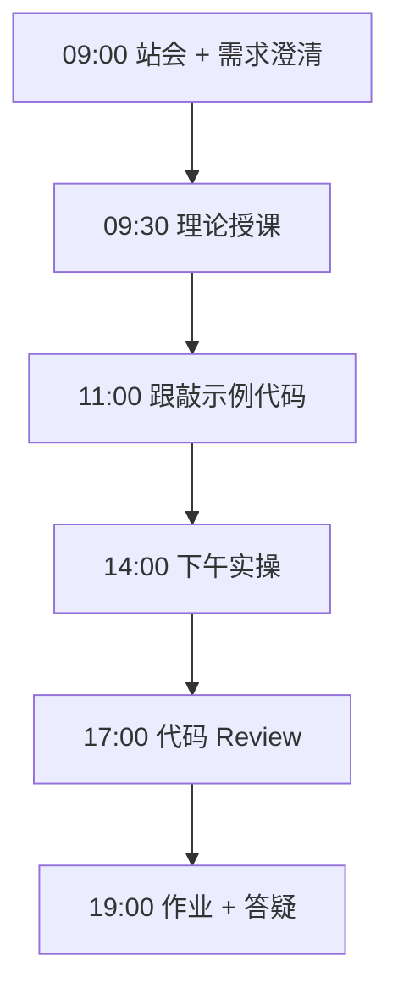
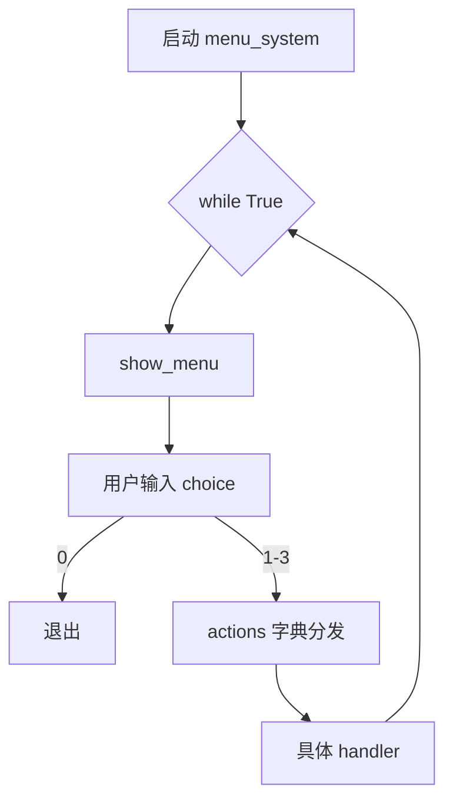

# Day 03：流程控制

> **阶段**：第一阶段:Python编程基础 | **Epic**：NEXUS-E1 | **预计学时**：6-8 小时

## 旁白解读：今日上下文

> 🎬 **模拟站会 09:00** — 智链科技 Nexus 项目组

**陈工**：流程控制是程序的「交通规则」。昨天字符串处理基本是直线执行，从今天开始代码会分叉、会循环。Jira 上三个 Story 分别对应三个可运行脚本，下午前必须都能独立跑通。

**林悦**：菜单系统不是玩具——NexusAgent CLI 以后就是「读指令 → 分发 → 执行」。今天用字典做 dispatch，别写 50 个 elif，那是维护地狱。

**小张**：`while True` 会不会让程序出不来？

**陈工**：所以要有明确的 `break` 条件和 `Ctrl+C` 处理。下午猜数字里加了输入校验和 `continue`，这是企业脚本防呆的第一课。写完记得自己故意输错几次，看看程序稳不稳。


**今日在 NexusAgent 主线中的位置**：menu_system 是 NexusAgent CLI 交互模式的雏形

**今日 Jira 看板**：
- `NEXUS-E1-D03-S01`
- `NEXUS-E1-D03-S02`
- `NEXUS-E1-D03-S03`

---


## 需求文档（产品林悦下发）

**文档编号**：PRD-NEXUS-D03  
**版本**：v1.0  
**优先级**：P0

### 背景

第一阶段:Python编程基础阶段第 3 天教学任务，与 NexusAgent 主线项目对齐。

### User Stories

### NEXUS-E1-D03-S01

**描述**：流程控制 相关交付

**验收标准**：
- [ ] 代码可本地运行
- [ ] 通过 `scripts/verify_day.py --day 3`

### NEXUS-E1-D03-S02

**描述**：流程控制 相关交付

**验收标准**：
- [ ] 代码可本地运行
- [ ] 通过 `scripts/verify_day.py --day 3`

### NEXUS-E1-D03-S03

**描述**：流程控制 相关交付

**验收标准**：
- [ ] 代码可本地运行
- [ ] 通过 `scripts/verify_day.py --day 3`


---


## 今日课表

### 上午 09:00-12:00

- 09:00 站会：D02 清洗脚本已合并，今日进入控制流
- 09:30 if/elif/else 分支与缩进规则（4 空格）
- 10:30 while 循环、break/continue、无限循环陷阱
- 11:00 for 循环与 range()、enumerate() 简介

### 下午 14:00-17:30

- 14:00 猜数字游戏：随机数与输入校验
- 15:00 九九乘法表：嵌套循环与字符串对齐
- 16:00 菜单系统：字典映射替代长 if-elif 链
- 17:00 代码 Review：KeyboardInterrupt 优雅退出

### 晚自习 19:00-21:00

- 19:00 作业：为菜单增加「猜数字」子菜单项
- 20:00 调试技巧：print 调试 vs 断点
- 20:45 预习列表与 todo_manager 需求

---


## 课堂笔记

### 核心知识点速查

| 序号 | 知识点 | 代码位置 |
|------|--------|----------|
| 1 | if/elif/else 条件分支 | 见下午实操 |
| 2 | 缩进块与 Python 语法 | 见下午实操 |
| 3 | while 循环与终止条件 | 见下午实操 |
| 4 | break 与 continue | 见下午实操 |
| 5 | for 循环与 range | 见下午实操 |
| 6 | 嵌套循环时间复杂度直觉 | 见下午实操 |
| 7 | input() 与用户交互 | 见下午实操 |
| 8 | 随机数 random.randint | 见下午实操 |
| 9 | 字典映射实现分发 | 见下午实操 |
| 10 | KeyboardInterrupt 异常处理 | 见下午实操 |

### 今日流程图



### 架构示意图（当日目标）



---


## 实操代码清单

- `code/guess_number.py`
- `code/multiplication_table.py`
- `code/menu_system.py`

请按顺序创建并运行。每段代码均可直接复制到对应文件执行。

---

## 实验手册（分时段操作表）

### 实验步骤 1：09:30-10:30 理论

| 时间 | 动作 | 预期结果 | 失败处理 |
|------|------|----------|----------|
| +0min | 打开课件本节 | 看到需求与验收标准 | 检查是否拉取最新 `develop` 分支 |
| +10min | 创建/打开当日 `code/` 文件 | 文件路径与清单一致 | 对照「实操代码清单」 |
| +30min | 粘贴并运行第一个脚本 | 终端有正常输出无 Traceback | 见下方「排错手册」 |
| +60min | 完成全部文件并自测 | `python3` 运行通过 | 使用 `scripts/verify_day.py --day 3` |
| +90min | 提交 Git 并建 MR | MR 关联 Jira NEXUS-E1-D03-S01 | 按附录 Git 示例操作 |


### 实验步骤 2：10:30-12:00 跟敲

| 时间 | 动作 | 预期结果 | 失败处理 |
|------|------|----------|----------|
| +0min | 打开课件本节 | 看到需求与验收标准 | 检查是否拉取最新 `develop` 分支 |
| +10min | 创建/打开当日 `code/` 文件 | 文件路径与清单一致 | 对照「实操代码清单」 |
| +30min | 粘贴并运行第一个脚本 | 终端有正常输出无 Traceback | 见下方「排错手册」 |
| +60min | 完成全部文件并自测 | `python3` 运行通过 | 使用 `scripts/verify_day.py --day 3` |
| +90min | 提交 Git 并建 MR | MR 关联 Jira NEXUS-E1-D03-S01 | 按附录 Git 示例操作 |


### 实验步骤 3：14:00-15:30 实操

| 时间 | 动作 | 预期结果 | 失败处理 |
|------|------|----------|----------|
| +0min | 打开课件本节 | 看到需求与验收标准 | 检查是否拉取最新 `develop` 分支 |
| +10min | 创建/打开当日 `code/` 文件 | 文件路径与清单一致 | 对照「实操代码清单」 |
| +30min | 粘贴并运行第一个脚本 | 终端有正常输出无 Traceback | 见下方「排错手册」 |
| +60min | 完成全部文件并自测 | `python3` 运行通过 | 使用 `scripts/verify_day.py --day 3` |
| +90min | 提交 Git 并建 MR | MR 关联 Jira NEXUS-E1-D03-S01 | 按附录 Git 示例操作 |


### 实验步骤 4：15:30-17:00 联调

| 时间 | 动作 | 预期结果 | 失败处理 |
|------|------|----------|----------|
| +0min | 打开课件本节 | 看到需求与验收标准 | 检查是否拉取最新 `develop` 分支 |
| +10min | 创建/打开当日 `code/` 文件 | 文件路径与清单一致 | 对照「实操代码清单」 |
| +30min | 粘贴并运行第一个脚本 | 终端有正常输出无 Traceback | 见下方「排错手册」 |
| +60min | 完成全部文件并自测 | `python3` 运行通过 | 使用 `scripts/verify_day.py --day 3` |
| +90min | 提交 Git 并建 MR | MR 关联 Jira NEXUS-E1-D03-S01 | 按附录 Git 示例操作 |


### 实验步骤 5：19:00-20:30 作业

| 时间 | 动作 | 预期结果 | 失败处理 |
|------|------|----------|----------|
| +0min | 打开课件本节 | 看到需求与验收标准 | 检查是否拉取最新 `develop` 分支 |
| +10min | 创建/打开当日 `code/` 文件 | 文件路径与清单一致 | 对照「实操代码清单」 |
| +30min | 粘贴并运行第一个脚本 | 终端有正常输出无 Traceback | 见下方「排错手册」 |
| +60min | 完成全部文件并自测 | `python3` 运行通过 | 使用 `scripts/verify_day.py --day 3` |
| +90min | 提交 Git 并建 MR | MR 关联 Jira NEXUS-E1-D03-S01 | 按附录 Git 示例操作 |


### 排错手册（Day 3）

1. **`command not found: python3`** → 安装 Python 3.10+ 或使用 `py -3`（Windows）
2. **`ModuleNotFoundError`** → 确认当前目录、是否激活 venv、`pip install -r requirements.txt`（若当日有）
3. **`SyntaxError: invalid syntax`** → 检查上一行是否缺括号、引号是否中文
4. **`UnicodeDecodeError`** → 文件保存为 UTF-8，终端 `export PYTHONIOENCODING=utf-8`
5. **API 相关（Day12+）** → 检查 `.env` 中 Key，无 Key 时使用课件 MOCK 模式

---


## 逐步跟敲指南（完整源码与解析）

> 以下代码与 `code/` 目录完全一致，可直接复制。每段附行级说明。

### 文件：`code/guess_number.py`

**操作步骤**：
1. 在 `courseware/day-03/code/` 下创建文件 `guess_number.py`
2. 完整粘贴下方代码
3. 在终端执行：`cd courseware/day-03/code && python3 guess_number.py`（若为包内模块则按课件说明）

```python
#!/usr/bin/env python3
# -*- coding: utf-8 -*-
"""猜数字游戏 — 练习 while、if、break 与随机数。"""
import random

SECRET_MIN = 1
SECRET_MAX = 100
MAX_ATTEMPTS = 7


def play_round() -> None:
    target = random.randint(SECRET_MIN, SECRET_MAX)
    attempts = 0
    print(f"我想了一个 {SECRET_MIN}-{SECRET_MAX} 的整数，你有 {MAX_ATTEMPTS} 次机会。")
    while attempts < MAX_ATTEMPTS:
        attempts += 1
        raw = input(f"第 {attempts} 次猜测: ").strip()
        if not raw.isdigit():
            print("请输入有效数字！")
            attempts -= 1
            continue
        guess = int(raw)
        if guess < target:
            print("太小了 ↑")
        elif guess > target:
            print("太大了 ↓")
        else:
            print(f"恭喜！{attempts} 次猜中！")
            return
    print(f"游戏结束，答案是 {target}")


def main() -> None:
    play_round()


if __name__ == "__main__":
    main()

```

**解析要点（`guess_number.py`）**：

- 共 **38** 行，请逐行阅读注释中的中文说明

- 运行前确认 Python 版本 ≥ 3.10：`python3 --version`

- 若报错，先检查缩进是否为 4 空格，勿混用 Tab

- 企业 Review 清单：命名是否清晰、是否有异常处理、是否可复用

---

### 文件：`code/multiplication_table.py`

**操作步骤**：
1. 在 `courseware/day-03/code/` 下创建文件 `multiplication_table.py`
2. 完整粘贴下方代码
3. 在终端执行：`cd courseware/day-03/code && python3 multiplication_table.py`（若为包内模块则按课件说明）

```python
#!/usr/bin/env python3
# -*- coding: utf-8 -*-
"""九九乘法表 — 嵌套 for 循环与格式化对齐。"""
SIZE = 9


def print_table(size: int = SIZE) -> None:
    for i in range(1, size + 1):
        parts: list[str] = []
        for j in range(1, i + 1):
            parts.append(f"{j}×{i}={i*j:2d}")
        print("  ".join(parts))


def main() -> None:
    print_table()


if __name__ == "__main__":
    main()

```

**解析要点（`multiplication_table.py`）**：

- 共 **20** 行，请逐行阅读注释中的中文说明

- 运行前确认 Python 版本 ≥ 3.10：`python3 --version`

- 若报错，先检查缩进是否为 4 空格，勿混用 Tab

- 企业 Review 清单：命名是否清晰、是否有异常处理、是否可复用

---

### 文件：`code/menu_system.py`

**操作步骤**：
1. 在 `courseware/day-03/code/` 下创建文件 `menu_system.py`
2. 完整粘贴下方代码
3. 在终端执行：`cd courseware/day-03/code && python3 menu_system.py`（若为包内模块则按课件说明）

```python
#!/usr/bin/env python3
# -*- coding: utf-8 -*-
"""
简易菜单系统 — 流程控制综合练习
模拟 NexusAgent CLI 指令菜单雏形
"""
from __future__ import annotations

import sys


def show_banner() -> None:
    print("=" * 40)
    print("  NexusAgent CLI 菜单 (Day 3 教学版)")
    print("=" * 40)


def show_menu() -> None:
    print("1. 查看版本")
    print("2. 查看今日学习目标")
    print("3. 计算两数之和")
    print("0. 退出")


def handle_version() -> None:
    print("NexusAgent Bootcamp v0.1-day03")


def handle_goal() -> None:
    print("今日目标: 掌握 if/elif/else、while、for 与 break/continue")


def handle_add() -> None:
    a = input("输入整数 a: ").strip()
    b = input("输入整数 b: ").strip()
    if not (a.lstrip("-").isdigit() and b.lstrip("-").isdigit()):
        print("输入无效，请输入整数")
        return
    result = int(a) + int(b)
    print(f"结果: {result}")


def run_menu() -> None:
    actions = {
        "1": handle_version,
        "2": handle_goal,
        "3": handle_add,
    }
    show_banner()
    while True:
        show_menu()
        choice = input("请选择: ").strip()
        if choice == "0":
            print("再见！")
            break
        handler = actions.get(choice)
        if handler is None:
            print("无效选项，请重试")
            continue
        handler()
        print("-" * 40)


def main() -> None:
    try:
        run_menu()
    except KeyboardInterrupt:
        print("\n用户中断，安全退出")
        sys.exit(0)


if __name__ == "__main__":
    main()

```

**解析要点（`menu_system.py`）**：

- 共 **73** 行，请逐行阅读注释中的中文说明

- 运行前确认 Python 版本 ≥ 3.10：`python3 --version`

- 若报错，先检查缩进是否为 4 空格，勿混用 Tab

- 企业 Review 清单：命名是否清晰、是否有异常处理、是否可复用

---


### 深度讲解 1：if/elif/else 条件分支

在企业级 Python 开发与大模型应用工程中，**if/elif/else 条件分支** 是学员必须牢固掌握的基本功。智链科技 Nexus 项目组在 Day 3 的代码评审中，特别强调以下几点：

1. **为什么学**：if/elif/else 条件分支 直接服务于后续 NexusAgent 平台的 `NEXUS-E1` 模块。没有扎实的 if/elif/else 条件分支，Day 10 之后调用 API、解析 JSON、编写 Agent 工具函数时会出现大量低级错误。

2. **常见坑**：
   - 忽略输入类型校验，导致运行时 `TypeError`
   - 编码问题（Windows 默认 GBK vs UTF-8）
   - 复制粘贴时缩进错乱（Python 对缩进敏感）

3. **企业实践**：在 SmartLink 的 GitLab 仓库中，所有与 if/elif/else 条件分支 相关的代码必须经过 Ruff 静态检查；变量命名使用 `snake_case`，常量使用 `UPPER_SNAKE_CASE`。

4. **与主线项目的关系**：今日代码位于 `courseware/day-03/code/`，部分模块将逐步合并到 `platform/nexus_agent/`。请养成「每日代码皆可运行、皆可测试」的习惯。

5. **扩展阅读建议**：完成今日作业后，可阅读 `docs/project-master-plan.md` 中关于 NEXUS-E1 的章节，建立全局视角。

**课堂互动题**：请用 3 句话向非技术同事解释「if/elif/else 条件分支」是什么。写在作业 MR 的评论里，讲师会抽查点评。

**实操检查清单**：
- [ ] 能不看课件复述 if/elif/else 条件分支 的定义
- [ ] 能独立写出相关代码并运行
- [ ] 能向同学讲解一处容易写错的地方


### 深度讲解 2：缩进块与 Python 语法

在企业级 Python 开发与大模型应用工程中，**缩进块与 Python 语法** 是学员必须牢固掌握的基本功。智链科技 Nexus 项目组在 Day 3 的代码评审中，特别强调以下几点：

1. **为什么学**：缩进块与 Python 语法 直接服务于后续 NexusAgent 平台的 `NEXUS-E1` 模块。没有扎实的 缩进块与 Python 语法，Day 10 之后调用 API、解析 JSON、编写 Agent 工具函数时会出现大量低级错误。

2. **常见坑**：
   - 忽略输入类型校验，导致运行时 `TypeError`
   - 编码问题（Windows 默认 GBK vs UTF-8）
   - 复制粘贴时缩进错乱（Python 对缩进敏感）

3. **企业实践**：在 SmartLink 的 GitLab 仓库中，所有与 缩进块与 Python 语法 相关的代码必须经过 Ruff 静态检查；变量命名使用 `snake_case`，常量使用 `UPPER_SNAKE_CASE`。

4. **与主线项目的关系**：今日代码位于 `courseware/day-03/code/`，部分模块将逐步合并到 `platform/nexus_agent/`。请养成「每日代码皆可运行、皆可测试」的习惯。

5. **扩展阅读建议**：完成今日作业后，可阅读 `docs/project-master-plan.md` 中关于 NEXUS-E1 的章节，建立全局视角。

**课堂互动题**：请用 3 句话向非技术同事解释「缩进块与 Python 语法」是什么。写在作业 MR 的评论里，讲师会抽查点评。

**实操检查清单**：
- [ ] 能不看课件复述 缩进块与 Python 语法 的定义
- [ ] 能独立写出相关代码并运行
- [ ] 能向同学讲解一处容易写错的地方


### 深度讲解 3：while 循环与终止条件

在企业级 Python 开发与大模型应用工程中，**while 循环与终止条件** 是学员必须牢固掌握的基本功。智链科技 Nexus 项目组在 Day 3 的代码评审中，特别强调以下几点：

1. **为什么学**：while 循环与终止条件 直接服务于后续 NexusAgent 平台的 `NEXUS-E1` 模块。没有扎实的 while 循环与终止条件，Day 10 之后调用 API、解析 JSON、编写 Agent 工具函数时会出现大量低级错误。

2. **常见坑**：
   - 忽略输入类型校验，导致运行时 `TypeError`
   - 编码问题（Windows 默认 GBK vs UTF-8）
   - 复制粘贴时缩进错乱（Python 对缩进敏感）

3. **企业实践**：在 SmartLink 的 GitLab 仓库中，所有与 while 循环与终止条件 相关的代码必须经过 Ruff 静态检查；变量命名使用 `snake_case`，常量使用 `UPPER_SNAKE_CASE`。

4. **与主线项目的关系**：今日代码位于 `courseware/day-03/code/`，部分模块将逐步合并到 `platform/nexus_agent/`。请养成「每日代码皆可运行、皆可测试」的习惯。

5. **扩展阅读建议**：完成今日作业后，可阅读 `docs/project-master-plan.md` 中关于 NEXUS-E1 的章节，建立全局视角。

**课堂互动题**：请用 3 句话向非技术同事解释「while 循环与终止条件」是什么。写在作业 MR 的评论里，讲师会抽查点评。

**实操检查清单**：
- [ ] 能不看课件复述 while 循环与终止条件 的定义
- [ ] 能独立写出相关代码并运行
- [ ] 能向同学讲解一处容易写错的地方


### 深度讲解 4：break 与 continue

在企业级 Python 开发与大模型应用工程中，**break 与 continue** 是学员必须牢固掌握的基本功。智链科技 Nexus 项目组在 Day 3 的代码评审中，特别强调以下几点：

1. **为什么学**：break 与 continue 直接服务于后续 NexusAgent 平台的 `NEXUS-E1` 模块。没有扎实的 break 与 continue，Day 10 之后调用 API、解析 JSON、编写 Agent 工具函数时会出现大量低级错误。

2. **常见坑**：
   - 忽略输入类型校验，导致运行时 `TypeError`
   - 编码问题（Windows 默认 GBK vs UTF-8）
   - 复制粘贴时缩进错乱（Python 对缩进敏感）

3. **企业实践**：在 SmartLink 的 GitLab 仓库中，所有与 break 与 continue 相关的代码必须经过 Ruff 静态检查；变量命名使用 `snake_case`，常量使用 `UPPER_SNAKE_CASE`。

4. **与主线项目的关系**：今日代码位于 `courseware/day-03/code/`，部分模块将逐步合并到 `platform/nexus_agent/`。请养成「每日代码皆可运行、皆可测试」的习惯。

5. **扩展阅读建议**：完成今日作业后，可阅读 `docs/project-master-plan.md` 中关于 NEXUS-E1 的章节，建立全局视角。

**课堂互动题**：请用 3 句话向非技术同事解释「break 与 continue」是什么。写在作业 MR 的评论里，讲师会抽查点评。

**实操检查清单**：
- [ ] 能不看课件复述 break 与 continue 的定义
- [ ] 能独立写出相关代码并运行
- [ ] 能向同学讲解一处容易写错的地方


### 深度讲解 5：for 循环与 range

在企业级 Python 开发与大模型应用工程中，**for 循环与 range** 是学员必须牢固掌握的基本功。智链科技 Nexus 项目组在 Day 3 的代码评审中，特别强调以下几点：

1. **为什么学**：for 循环与 range 直接服务于后续 NexusAgent 平台的 `NEXUS-E1` 模块。没有扎实的 for 循环与 range，Day 10 之后调用 API、解析 JSON、编写 Agent 工具函数时会出现大量低级错误。

2. **常见坑**：
   - 忽略输入类型校验，导致运行时 `TypeError`
   - 编码问题（Windows 默认 GBK vs UTF-8）
   - 复制粘贴时缩进错乱（Python 对缩进敏感）

3. **企业实践**：在 SmartLink 的 GitLab 仓库中，所有与 for 循环与 range 相关的代码必须经过 Ruff 静态检查；变量命名使用 `snake_case`，常量使用 `UPPER_SNAKE_CASE`。

4. **与主线项目的关系**：今日代码位于 `courseware/day-03/code/`，部分模块将逐步合并到 `platform/nexus_agent/`。请养成「每日代码皆可运行、皆可测试」的习惯。

5. **扩展阅读建议**：完成今日作业后，可阅读 `docs/project-master-plan.md` 中关于 NEXUS-E1 的章节，建立全局视角。

**课堂互动题**：请用 3 句话向非技术同事解释「for 循环与 range」是什么。写在作业 MR 的评论里，讲师会抽查点评。

**实操检查清单**：
- [ ] 能不看课件复述 for 循环与 range 的定义
- [ ] 能独立写出相关代码并运行
- [ ] 能向同学讲解一处容易写错的地方


### 深度讲解 6：嵌套循环时间复杂度直觉

在企业级 Python 开发与大模型应用工程中，**嵌套循环时间复杂度直觉** 是学员必须牢固掌握的基本功。智链科技 Nexus 项目组在 Day 3 的代码评审中，特别强调以下几点：

1. **为什么学**：嵌套循环时间复杂度直觉 直接服务于后续 NexusAgent 平台的 `NEXUS-E1` 模块。没有扎实的 嵌套循环时间复杂度直觉，Day 10 之后调用 API、解析 JSON、编写 Agent 工具函数时会出现大量低级错误。

2. **常见坑**：
   - 忽略输入类型校验，导致运行时 `TypeError`
   - 编码问题（Windows 默认 GBK vs UTF-8）
   - 复制粘贴时缩进错乱（Python 对缩进敏感）

3. **企业实践**：在 SmartLink 的 GitLab 仓库中，所有与 嵌套循环时间复杂度直觉 相关的代码必须经过 Ruff 静态检查；变量命名使用 `snake_case`，常量使用 `UPPER_SNAKE_CASE`。

4. **与主线项目的关系**：今日代码位于 `courseware/day-03/code/`，部分模块将逐步合并到 `platform/nexus_agent/`。请养成「每日代码皆可运行、皆可测试」的习惯。

5. **扩展阅读建议**：完成今日作业后，可阅读 `docs/project-master-plan.md` 中关于 NEXUS-E1 的章节，建立全局视角。

**课堂互动题**：请用 3 句话向非技术同事解释「嵌套循环时间复杂度直觉」是什么。写在作业 MR 的评论里，讲师会抽查点评。

**实操检查清单**：
- [ ] 能不看课件复述 嵌套循环时间复杂度直觉 的定义
- [ ] 能独立写出相关代码并运行
- [ ] 能向同学讲解一处容易写错的地方


### 深度讲解 7：input() 与用户交互

在企业级 Python 开发与大模型应用工程中，**input() 与用户交互** 是学员必须牢固掌握的基本功。智链科技 Nexus 项目组在 Day 3 的代码评审中，特别强调以下几点：

1. **为什么学**：input() 与用户交互 直接服务于后续 NexusAgent 平台的 `NEXUS-E1` 模块。没有扎实的 input() 与用户交互，Day 10 之后调用 API、解析 JSON、编写 Agent 工具函数时会出现大量低级错误。

2. **常见坑**：
   - 忽略输入类型校验，导致运行时 `TypeError`
   - 编码问题（Windows 默认 GBK vs UTF-8）
   - 复制粘贴时缩进错乱（Python 对缩进敏感）

3. **企业实践**：在 SmartLink 的 GitLab 仓库中，所有与 input() 与用户交互 相关的代码必须经过 Ruff 静态检查；变量命名使用 `snake_case`，常量使用 `UPPER_SNAKE_CASE`。

4. **与主线项目的关系**：今日代码位于 `courseware/day-03/code/`，部分模块将逐步合并到 `platform/nexus_agent/`。请养成「每日代码皆可运行、皆可测试」的习惯。

5. **扩展阅读建议**：完成今日作业后，可阅读 `docs/project-master-plan.md` 中关于 NEXUS-E1 的章节，建立全局视角。

**课堂互动题**：请用 3 句话向非技术同事解释「input() 与用户交互」是什么。写在作业 MR 的评论里，讲师会抽查点评。

**实操检查清单**：
- [ ] 能不看课件复述 input() 与用户交互 的定义
- [ ] 能独立写出相关代码并运行
- [ ] 能向同学讲解一处容易写错的地方


### 深度讲解 8：随机数 random.randint

在企业级 Python 开发与大模型应用工程中，**随机数 random.randint** 是学员必须牢固掌握的基本功。智链科技 Nexus 项目组在 Day 3 的代码评审中，特别强调以下几点：

1. **为什么学**：随机数 random.randint 直接服务于后续 NexusAgent 平台的 `NEXUS-E1` 模块。没有扎实的 随机数 random.randint，Day 10 之后调用 API、解析 JSON、编写 Agent 工具函数时会出现大量低级错误。

2. **常见坑**：
   - 忽略输入类型校验，导致运行时 `TypeError`
   - 编码问题（Windows 默认 GBK vs UTF-8）
   - 复制粘贴时缩进错乱（Python 对缩进敏感）

3. **企业实践**：在 SmartLink 的 GitLab 仓库中，所有与 随机数 random.randint 相关的代码必须经过 Ruff 静态检查；变量命名使用 `snake_case`，常量使用 `UPPER_SNAKE_CASE`。

4. **与主线项目的关系**：今日代码位于 `courseware/day-03/code/`，部分模块将逐步合并到 `platform/nexus_agent/`。请养成「每日代码皆可运行、皆可测试」的习惯。

5. **扩展阅读建议**：完成今日作业后，可阅读 `docs/project-master-plan.md` 中关于 NEXUS-E1 的章节，建立全局视角。

**课堂互动题**：请用 3 句话向非技术同事解释「随机数 random.randint」是什么。写在作业 MR 的评论里，讲师会抽查点评。

**实操检查清单**：
- [ ] 能不看课件复述 随机数 random.randint 的定义
- [ ] 能独立写出相关代码并运行
- [ ] 能向同学讲解一处容易写错的地方


### 深度讲解 9：字典映射实现分发

在企业级 Python 开发与大模型应用工程中，**字典映射实现分发** 是学员必须牢固掌握的基本功。智链科技 Nexus 项目组在 Day 3 的代码评审中，特别强调以下几点：

1. **为什么学**：字典映射实现分发 直接服务于后续 NexusAgent 平台的 `NEXUS-E1` 模块。没有扎实的 字典映射实现分发，Day 10 之后调用 API、解析 JSON、编写 Agent 工具函数时会出现大量低级错误。

2. **常见坑**：
   - 忽略输入类型校验，导致运行时 `TypeError`
   - 编码问题（Windows 默认 GBK vs UTF-8）
   - 复制粘贴时缩进错乱（Python 对缩进敏感）

3. **企业实践**：在 SmartLink 的 GitLab 仓库中，所有与 字典映射实现分发 相关的代码必须经过 Ruff 静态检查；变量命名使用 `snake_case`，常量使用 `UPPER_SNAKE_CASE`。

4. **与主线项目的关系**：今日代码位于 `courseware/day-03/code/`，部分模块将逐步合并到 `platform/nexus_agent/`。请养成「每日代码皆可运行、皆可测试」的习惯。

5. **扩展阅读建议**：完成今日作业后，可阅读 `docs/project-master-plan.md` 中关于 NEXUS-E1 的章节，建立全局视角。

**课堂互动题**：请用 3 句话向非技术同事解释「字典映射实现分发」是什么。写在作业 MR 的评论里，讲师会抽查点评。

**实操检查清单**：
- [ ] 能不看课件复述 字典映射实现分发 的定义
- [ ] 能独立写出相关代码并运行
- [ ] 能向同学讲解一处容易写错的地方


### 深度讲解 10：KeyboardInterrupt 异常处理

在企业级 Python 开发与大模型应用工程中，**KeyboardInterrupt 异常处理** 是学员必须牢固掌握的基本功。智链科技 Nexus 项目组在 Day 3 的代码评审中，特别强调以下几点：

1. **为什么学**：KeyboardInterrupt 异常处理 直接服务于后续 NexusAgent 平台的 `NEXUS-E1` 模块。没有扎实的 KeyboardInterrupt 异常处理，Day 10 之后调用 API、解析 JSON、编写 Agent 工具函数时会出现大量低级错误。

2. **常见坑**：
   - 忽略输入类型校验，导致运行时 `TypeError`
   - 编码问题（Windows 默认 GBK vs UTF-8）
   - 复制粘贴时缩进错乱（Python 对缩进敏感）

3. **企业实践**：在 SmartLink 的 GitLab 仓库中，所有与 KeyboardInterrupt 异常处理 相关的代码必须经过 Ruff 静态检查；变量命名使用 `snake_case`，常量使用 `UPPER_SNAKE_CASE`。

4. **与主线项目的关系**：今日代码位于 `courseware/day-03/code/`，部分模块将逐步合并到 `platform/nexus_agent/`。请养成「每日代码皆可运行、皆可测试」的习惯。

5. **扩展阅读建议**：完成今日作业后，可阅读 `docs/project-master-plan.md` 中关于 NEXUS-E1 的章节，建立全局视角。

**课堂互动题**：请用 3 句话向非技术同事解释「KeyboardInterrupt 异常处理」是什么。写在作业 MR 的评论里，讲师会抽查点评。

**实操检查清单**：
- [ ] 能不看课件复述 KeyboardInterrupt 异常处理 的定义
- [ ] 能独立写出相关代码并运行
- [ ] 能向同学讲解一处容易写错的地方


## 阶段复盘锚点（第一阶段:Python编程基础）

今天是 **第一阶段:Python编程基础** 的第 **3** 个学习日。请回顾：

- 昨天学了什么？今天如何承接？
- 今天的内容在 70 天路线图中的坐标？
- 如果我是 Tech Lead，会如何 Review 今日代码？

**陈工寄语**：慢即是快。企业里没人关心你一天学了多少个语法点，只关心你写的脚本能不能在服务器上稳定跑 7×24 小时。今天把地基打牢，后面 Agent 编排、RAG 检索才不会塌。

**林悦补充**：产品侧只验收「用户能感知到的价值」。今日交付虽然简单，但「个人信息卡片」本质是后续「用户画像 Agent」的数据采集原型——字段设计请认真思考。

**代码量统计（累计）**：完成今日后，个人仓库累计约 **4200** 行（含注释与测试），全营目标 10 万行。

**明日预告**：请提前阅读 `courseware/day-04/README.md` 开头的旁白，了解上下文。


## 常见问题 FAQ（讲师答疑实录）


**Q1：学习「if/elif/else 条件分支」时最常问的问题是什么？**

A：学员常问「这在大模型开发里到底用在哪里」。直接回答：在 NexusAgent 的 `NEXUS-E1` 中，if/elif/else 条件分支 用于支撑「流程控制」这一交付。建议你打开 `platform/` 对照看未来模块如何引用今日写法。另一个常见问题是「要不要背语法」——不需要背，但要能写出可运行代码，并能在报错时读懂 Traceback。

**追问**：如果线上报错与 if/elif/else 条件分支 相关，如何排查？  
**答**：① 复现 ② 最小化输入 ③ 打印中间变量 ④ 查 GitLab 历史 diff ⑤ 在 Jira 建 Bug 单附上日志。


**Q2：学习「缩进块与 Python 语法」时最常问的问题是什么？**

A：学员常问「这在大模型开发里到底用在哪里」。直接回答：在 NexusAgent 的 `NEXUS-E1` 中，缩进块与 Python 语法 用于支撑「流程控制」这一交付。建议你打开 `platform/` 对照看未来模块如何引用今日写法。另一个常见问题是「要不要背语法」——不需要背，但要能写出可运行代码，并能在报错时读懂 Traceback。

**追问**：如果线上报错与 缩进块与 Python 语法 相关，如何排查？  
**答**：① 复现 ② 最小化输入 ③ 打印中间变量 ④ 查 GitLab 历史 diff ⑤ 在 Jira 建 Bug 单附上日志。


**Q3：学习「while 循环与终止条件」时最常问的问题是什么？**

A：学员常问「这在大模型开发里到底用在哪里」。直接回答：在 NexusAgent 的 `NEXUS-E1` 中，while 循环与终止条件 用于支撑「流程控制」这一交付。建议你打开 `platform/` 对照看未来模块如何引用今日写法。另一个常见问题是「要不要背语法」——不需要背，但要能写出可运行代码，并能在报错时读懂 Traceback。

**追问**：如果线上报错与 while 循环与终止条件 相关，如何排查？  
**答**：① 复现 ② 最小化输入 ③ 打印中间变量 ④ 查 GitLab 历史 diff ⑤ 在 Jira 建 Bug 单附上日志。


**Q4：学习「break 与 continue」时最常问的问题是什么？**

A：学员常问「这在大模型开发里到底用在哪里」。直接回答：在 NexusAgent 的 `NEXUS-E1` 中，break 与 continue 用于支撑「流程控制」这一交付。建议你打开 `platform/` 对照看未来模块如何引用今日写法。另一个常见问题是「要不要背语法」——不需要背，但要能写出可运行代码，并能在报错时读懂 Traceback。

**追问**：如果线上报错与 break 与 continue 相关，如何排查？  
**答**：① 复现 ② 最小化输入 ③ 打印中间变量 ④ 查 GitLab 历史 diff ⑤ 在 Jira 建 Bug 单附上日志。


**Q5：学习「for 循环与 range」时最常问的问题是什么？**

A：学员常问「这在大模型开发里到底用在哪里」。直接回答：在 NexusAgent 的 `NEXUS-E1` 中，for 循环与 range 用于支撑「流程控制」这一交付。建议你打开 `platform/` 对照看未来模块如何引用今日写法。另一个常见问题是「要不要背语法」——不需要背，但要能写出可运行代码，并能在报错时读懂 Traceback。

**追问**：如果线上报错与 for 循环与 range 相关，如何排查？  
**答**：① 复现 ② 最小化输入 ③ 打印中间变量 ④ 查 GitLab 历史 diff ⑤ 在 Jira 建 Bug 单附上日志。


**Q6：学习「嵌套循环时间复杂度直觉」时最常问的问题是什么？**

A：学员常问「这在大模型开发里到底用在哪里」。直接回答：在 NexusAgent 的 `NEXUS-E1` 中，嵌套循环时间复杂度直觉 用于支撑「流程控制」这一交付。建议你打开 `platform/` 对照看未来模块如何引用今日写法。另一个常见问题是「要不要背语法」——不需要背，但要能写出可运行代码，并能在报错时读懂 Traceback。

**追问**：如果线上报错与 嵌套循环时间复杂度直觉 相关，如何排查？  
**答**：① 复现 ② 最小化输入 ③ 打印中间变量 ④ 查 GitLab 历史 diff ⑤ 在 Jira 建 Bug 单附上日志。


**Q7：学习「input() 与用户交互」时最常问的问题是什么？**

A：学员常问「这在大模型开发里到底用在哪里」。直接回答：在 NexusAgent 的 `NEXUS-E1` 中，input() 与用户交互 用于支撑「流程控制」这一交付。建议你打开 `platform/` 对照看未来模块如何引用今日写法。另一个常见问题是「要不要背语法」——不需要背，但要能写出可运行代码，并能在报错时读懂 Traceback。

**追问**：如果线上报错与 input() 与用户交互 相关，如何排查？  
**答**：① 复现 ② 最小化输入 ③ 打印中间变量 ④ 查 GitLab 历史 diff ⑤ 在 Jira 建 Bug 单附上日志。


**Q8：学习「随机数 random.randint」时最常问的问题是什么？**

A：学员常问「这在大模型开发里到底用在哪里」。直接回答：在 NexusAgent 的 `NEXUS-E1` 中，随机数 random.randint 用于支撑「流程控制」这一交付。建议你打开 `platform/` 对照看未来模块如何引用今日写法。另一个常见问题是「要不要背语法」——不需要背，但要能写出可运行代码，并能在报错时读懂 Traceback。

**追问**：如果线上报错与 随机数 random.randint 相关，如何排查？  
**答**：① 复现 ② 最小化输入 ③ 打印中间变量 ④ 查 GitLab 历史 diff ⑤ 在 Jira 建 Bug 单附上日志。


**Q9：学习「字典映射实现分发」时最常问的问题是什么？**

A：学员常问「这在大模型开发里到底用在哪里」。直接回答：在 NexusAgent 的 `NEXUS-E1` 中，字典映射实现分发 用于支撑「流程控制」这一交付。建议你打开 `platform/` 对照看未来模块如何引用今日写法。另一个常见问题是「要不要背语法」——不需要背，但要能写出可运行代码，并能在报错时读懂 Traceback。

**追问**：如果线上报错与 字典映射实现分发 相关，如何排查？  
**答**：① 复现 ② 最小化输入 ③ 打印中间变量 ④ 查 GitLab 历史 diff ⑤ 在 Jira 建 Bug 单附上日志。


**Q10：学习「KeyboardInterrupt 异常处理」时最常问的问题是什么？**

A：学员常问「这在大模型开发里到底用在哪里」。直接回答：在 NexusAgent 的 `NEXUS-E1` 中，KeyboardInterrupt 异常处理 用于支撑「流程控制」这一交付。建议你打开 `platform/` 对照看未来模块如何引用今日写法。另一个常见问题是「要不要背语法」——不需要背，但要能写出可运行代码，并能在报错时读懂 Traceback。

**追问**：如果线上报错与 KeyboardInterrupt 异常处理 相关，如何排查？  
**答**：① 复现 ② 最小化输入 ③ 打印中间变量 ④ 查 GitLab 历史 diff ⑤ 在 Jira 建 Bug 单附上日志。


## 面试押题（与今日知识点挂钩）

以下题目会出现在 Day 67-69 模拟面试中，建议今日就开始积累答案：

1. **if/elif/else 条件分支**：请结合 NexusAgent 项目举例说明你在哪一天、哪段代码里用到了它？
2. **缩进块与 Python 语法**：请结合 NexusAgent 项目举例说明你在哪一天、哪段代码里用到了它？
3. **while 循环与终止条件**：请结合 NexusAgent 项目举例说明你在哪一天、哪段代码里用到了它？
4. **break 与 continue**：请结合 NexusAgent 项目举例说明你在哪一天、哪段代码里用到了它？
5. **for 循环与 range**：请结合 NexusAgent 项目举例说明你在哪一天、哪段代码里用到了它？
6. **嵌套循环时间复杂度直觉**：请结合 NexusAgent 项目举例说明你在哪一天、哪段代码里用到了它？

**参考答案思路**：采用 STAR 法则（情境-任务-行动-结果），引用 `courseware/day-03/code/` 中的具体文件名与函数名。

---


## Code Review 检查表（陈工版）

合并 MR 前自查：

- [ ] 所有新增 `.py` 文件顶部有模块说明 docstring
- [ ] 无硬编码密钥（API Key 走环境变量）
- [ ] 函数长度 < 50 行，过长则拆分
- [ ] 异常有明确提示，禁止裸 `except:`
- [ ] 提交信息符合 `feat(day-03): ...`
- [ ] README 或注释说明如何运行
- [ ] 与 Jira Story 验收标准逐条对应

**今日重点审查项**：流程控制 相关逻辑是否可读、可测、可扩展至 `platform/nexus_agent/`。

---


## 课后作业

### 作业说明

**作业：增强 menu_system.py**

1. 复制为 `homework/menu_extended.py`
2. 新增菜单项 `4. 启动猜数字`（复用 guess_number 逻辑或 import）
3. 新增菜单项 `5. 打印乘法表` 可输入 n（1-9）
4. 错误输入最多提示 3 次后返回主菜单（防止死循环）
5. 使用字典 `actions` 注册处理器，禁止超过 15 行的 elif 链


### 提交要求

1. 代码提交到分支 `feature/day-03-homework`
2. GitLab MR 标题：`[Day-03] homework: 课后作业`
3. 在 MR 描述中附上运行截图或终端输出

### 评分标准（满分 100）

| 项 | 分值 |
|----|------|
| 功能完整 | 40 |
| 代码规范与注释 | 30 |
| 异常处理 | 15 |
| MR 与 Jira 关联 | 15 |

---

## 作业参考答案

> ⚠️ 请先独立完成再对照答案

```python
import random

def play_guess() -> None:
  target = random.randint(1, 100)
  for i in range(1, 8):
    g = input("猜数字(1-100): ").strip()
    if not g.isdigit():
      print("无效"); continue
    n = int(g)
    if n == target:
      print(f"中了，{i}次"); return
    print("大" if n > target else "小")
  print(f"失败，答案{target}")

def print_table(n: int) -> None:
  for i in range(1, n + 1):
    print("  ".join(f"{j}×{i}={i*j}" for j in range(1, i + 1)))

actions = {"4": play_guess, "5": lambda: print_table(int(input("n=") or "9"))}
# 在 run_menu 的 actions 合并并处理无效输入计数
```


---


## 附录：Git 提交示例

```bash
git checkout develop
git pull origin develop
git checkout -b feature/day-03-流程控制
# 完成代码后
git add courseware/day-03/
git commit -m "feat(day-03): 流程控制"
git push -u origin feature/day-03-流程控制
```

---

*课件版本 Day-03-v1.0 | 智链科技培训中心*
