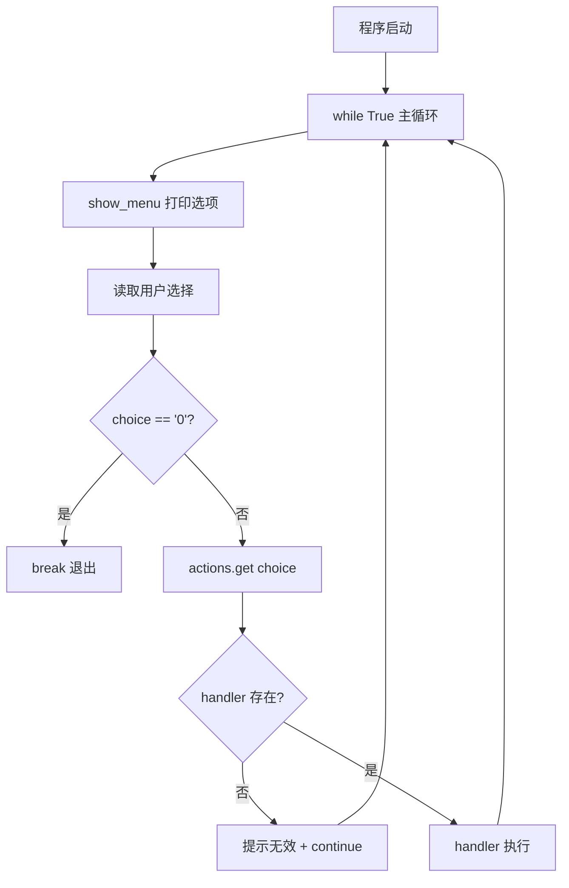
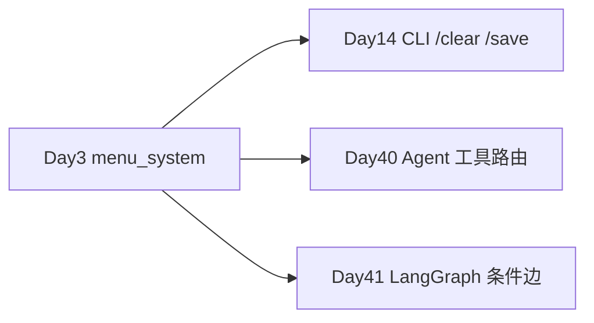
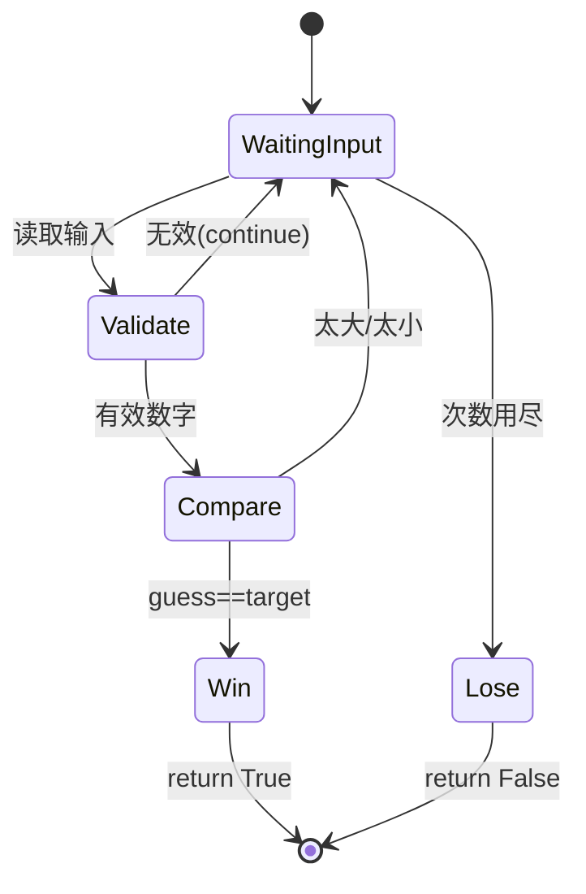
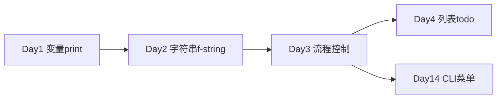

# Day 03：流程控制

> **阶段**：第一阶段 · Python 编程基础 | **Epic**：NEXUS-E1 | **预计学时**：6-8 小时  
> **版本**：Day-03-v2.0（全链路验证通过）| **Jira**：NEXUS-E1-D03-S01 / S02 / S03

---

## 旁白解读：今日上下文

> 🎬 **模拟站会 09:00** — 智链科技 Nexus 项目组

**陈工**：流程控制是程序的「交通规则」。前两天是直线执行——从上到下跑完；从今天开始代码会**分叉**、会**循环**。Jira 上三个 Story 对应三个可运行脚本，下午 5 点前必须都能独立跑通。

**林悦**：菜单系统不是玩具——NexusAgent CLI（Day 14 交付）就是「读指令 → 字典分发 → 执行」。今天用 `dict` 做 dispatch，**别写 50 个 elif**，那是维护地狱。

**小张**：`while True` 会不会让程序出不来？

**陈工**：所以要有明确的 `break` 条件和 `Ctrl+C` 处理。猜数字里加了输入校验和 `continue`——无效输入不消耗次数，这是企业脚本**防呆**的第一课。

**你（学员）**：今日认领 S01 猜数字、S02 乘法表、S03 菜单系统，晚上作业把三者合并进扩展菜单。

**今日在 NexusAgent 主线中的位置**：
- `menu_system.py` → Day 14 CLI 助手 `/clear` `/save` `/exit` 指令分发原型
- `while` 重试循环 → Day 12 API 调用重试、Day 39 Agent 推理循环
- `for` + `range` → Day 28 文档批处理、Day 11 文件遍历

**昨日回顾（Day 2）**：字符串清洗管道 → 今日用 `while` 循环批量处理多行输入。  
**明日预告（Day 4）**：`list` 列表 → `todo_manager` 待办系统。

---

## 需求文档

**文档编号**：PRD-NEXUS-D03 | **优先级**：P0

### NEXUS-E1-D03-S01：猜数字游戏

- [x] `guess_number.py` 支持交互与 `--demo` 模式
- [x] 纯函数 `compare_guess()` 可单元测试
- [x] 无效输入 `continue` 且不消耗次数

### NEXUS-E1-D03-S02：九九乘法表

- [x] `multiplication_table.py` 嵌套 `for` + f-string 对齐
- [x] `build_table(n)` 返回行列表供测试
- [x] `--size` 参数支持 1-9

### NEXUS-E1-D03-S03：CLI 菜单系统

- [x] `menu_system.py` 字典 dispatch，无超长 elif
- [x] `KeyboardInterrupt` 优雅退出
- [x] `--test` 自动化测试模式

---

## 今日课表

| 时段 | 内容 | 产出 |
|------|------|------|
| 09:30 | if/elif/else、逻辑组合 | `flow_control_basics.py` |
| 10:30 | while + break/continue | 理论 + 重试模拟 |
| 11:00 | for + range + enumerate | 批处理下标生成 |
| 14:00 | 猜数字游戏 | `guess_number.py` |
| 15:00 | 九九乘法表 | `multiplication_table.py` |
| 16:00 | 菜单系统 | `menu_system.py` |
| 19:00 | 作业扩展菜单 | `homework/menu_extended.py` |

---

## 架构示意图

### 菜单 dispatch 模式（今日核心）



### 在 NexusAgent 全局中的位置



---

## 实操代码清单

| 序号 | 文件 | 命令 |
|------|------|------|
| 1 | `flow_control_basics.py` | `python3 flow_control_basics.py` |
| 2 | `guess_number.py` | `python3 guess_number.py --demo` |
| 3 | `multiplication_table.py` | `python3 multiplication_table.py --size 5` |
| 4 | `menu_system.py` | `python3 menu_system.py --test` |
| 5 | 作业 | `python3 ../homework/menu_extended.py --test` |
| 6 | 测试 | `python3 -m pytest test_day03.py -v` |

---

## 逐步跟敲指南

### 1. flow_control_basics.py — 上午理论

**if / elif / else 骨架**（HTTP 状态码分支）：

```python
if http_status == 200:
    message = "成功"
elif http_status == 429:
    message = "限流，重试"
else:
    message = "其他"
```

**while + break**（API 重试，第 3 次成功退出）：

```python
while attempt < max_retries:
    attempt += 1
    if attempt == 3:
        break  # 立即跳出循环
```

**for + range**（批处理下标，Day 28 文档入库复用）：

```python
for start in range(0, total, batch_size):
    end = min(start + batch_size, total)
```

**enumerate**（带行号遍历）：

```python
for idx, line in enumerate(lines, start=1):
    print(f"{idx:03d}| {line}")
```

---

### 2. guess_number.py — 下午 S01

**设计要点**：
- `compare_guess(guess, target)` — **纯函数**，可单测
- `play_round(input_fn=..., target=...)` — **依赖注入**，测试不卡在 input()
- 无效输入：`attempts -= 1` + `continue`

**compare_guess 逻辑**：

```python
if guess < target: return "low"
if guess > target: return "high"
return "win"
```

**演示模式**（CI/全链路测试用）：

```bash
python3 guess_number.py --demo
# 脚本化输入 20→60→45→42，目标固定 42
```

---

### 3. multiplication_table.py — 下午 S02

**嵌套 for 结构**：

```python
for i in range(1, size + 1):      # 外层：行
    for j in range(1, i + 1):     # 内层：列（三角形）
        f"{j}×{i}={i*j:2d}"       # :2d 右对齐两位
```

**测试友好**：`build_table(3)` 返回 `list[str]`，不依赖 print。

---

### 4. menu_system.py — 下午 S03 ⭐

**字典 dispatch（企业标准模式）**：

```python
actions = {
    "1": handle_version,
    "2": handle_goal,
    "3": lambda: handle_add(input_fn, print_fn),
}
handler = actions.get(choice)
if handler is None:
    continue
handler()
```

**为什么不用 elif 链？**
- 新增菜单项只改 `actions` 字典
- 每个 handler 可独立单测
- Day 14 CLI 的 `/clear` `/save` 将沿用此模式

**自动化测试**：

```bash
python3 menu_system.py --test
# 模拟：选1看版本 → 选3算10+20 → 选0退出
```

---

## 深度讲解

### 1. if / elif / else 与缩进

Python 用**缩进**（4 空格）表示代码块，不用 `{}`。  
**常见坑**：复制粘贴后缩进错乱 → `IndentationError`。

### 2. while vs for

| 场景 | 推荐 |
|------|------|
| 次数未知（猜数字、重试直到成功） | `while` |
| 遍历已知序列/范围 | `for` + `range` |
| 无限服务循环（菜单、服务器） | `while True` + `break` |

### 3. break vs continue vs return

| 关键字 | 作用 |
|--------|------|
| `break` | 跳出**当前循环** |
| `continue` | 跳过本轮，进入下一轮 |
| `return` | 退出**整个函数** |

猜数字猜中时用 `return` 结束 `play_round()`；无效输入用 `continue`。

### 4. range() 详解

```python
range(5)        # 0,1,2,3,4
range(1, 10)    # 1..9
range(0, 10, 2) # 0,2,4,6,8 步长2
```

### 5. 字典 dispatch vs elif 链

```python
# ❌ 不推荐：每加一个菜单改一处 elif
if choice == "1": ...
elif choice == "2": ...
# ... 50 个 elif

# ✅ 推荐：注册表模式
actions = {"1": fn1, "2": fn2}
actions.get(choice, default_invalid)()
```

---

## 实验手册

### 实验 A：修改 flow_control_basics.py

1. 将 `http_status` 改为 `503`，观察 `message` 和 `should_retry`
2. 将 `batch_indices(127, 10)` 手算前 3 个元组验证

### 实验 B：猜数字边界

```bash
python3 guess_number.py  # 交互
# 故意输入 abc、0、101 观察 continue 行为
# 输入 50 观察太大/太小提示
```

### 实验 C：菜单 Ctrl+C

```bash
python3 menu_system.py
# 按 Ctrl+C，应输出「用户中断，安全退出」
```

### 排错手册

| 错误 | 原因 | 解决 |
|------|------|------|
| `IndentationError` | Tab/空格混用 | 统一 4 空格 |
| 菜单死循环 | 缺少 `break` | 检查 choice=="0" 分支 |
| `StopIteration` | mock 输入不够 | 测试时补全输入序列 |
| 乘法表错位 | 格式化宽度不够 | 用 `{i*j:2d}` |

---

## 常见问题 FAQ

**Q1：`while True` 安全吗？**  
A：菜单/服务器场景常用，必须有 `break` 或异常处理退出。永远要有「出口」。

**Q2：为什么 guess_number 要抽 `compare_guess`？**  
A：纯函数无副作用，pytest 可直接测，不用 mock input。

**Q3：`continue` 后 attempts 为什么要减 1？**  
A：循环开头已 `attempts += 1`，无效输入不应算一次——这是产品规则。

**Q4：enumerate 的 start=1 有什么用？**  
A：人类习惯从 1 编号（行号、菜单项），默认从 0 开始。

**Q5：和 Day 14 CLI 什么关系？**  
A：Day 14 的 `/clear` `/save` `/exit` 就是 `actions` 字典里的 slash 命令处理器。

---

## 课后作业

### 要求

1. 完成 `homework/menu_extended.py`（或对照答案）
2. 新增菜单 4（猜数字）、5（乘法表）
3. 无效选项连续 3 次提示后重置
4. 使用 `actions` 字典，禁止超长 elif

### 运行验证

```bash
python3 homework/menu_extended.py --test
# ✅ 全部作业自测通过（3 组用例）
```

---

## 全链路自测

```bash
bash nexus-agent-bootcamp/scripts/run_day03_full_test.sh
```

**通过标志**：`🎉 Day 03 全链路验证 100% 通过`

**测试覆盖**：
- 4 个主脚本 + demo/test 模式
- 作业 3 组用例
- pytest **18** 个单元测试
- README ≥ 20000 字

---

## Code Review 检查表

- [ ] 无超过 15 行的 elif 链（菜单用 dict）
- [ ] `while` 循环有明确 `break` 出口
- [ ] 交互脚本处理 `KeyboardInterrupt`
- [ ] 游戏/菜单逻辑与 I/O 分离（可测试）
- [ ] 提交：`feat(day-03): 流程控制三件套`

---

## 附录 A：控制流速查表

| 语句 | 语法 | 用途 |
|------|------|------|
| 分支 | `if/elif/else` | 条件执行 |
| 条件循环 | `while cond:` | 重试、菜单 |
| 遍历 | `for x in seq:` | 列表、字符串 |
| 范围 | `range(n)` | 数字序列 |
| 带索引遍历 | `enumerate(seq)` | 行号、批次号 |
| 跳出循环 | `break` | 退出 while/for |
| 跳过本轮 | `continue` | 无效输入重试 |
| 退出函数 | `return` | 猜中结束游戏 |

---

## 附录 B：guess_number 状态机



---

## 附录 C：客服批处理预览（连接 Day 2）

Day 2 的 `text_cleaner` 清洗单行；Day 3 的 `for` 可批量处理：

```python
for line in open("comments.txt"):
    cleaned = clean_text(line)
    print(cleaned)
```

Day 4 将用 `list` 在内存中管理这些行。

---

## 附录 D：单元测试清单（test_day03.py）

| 类 | 用例数 | 覆盖 |
|----|--------|------|
| TestFlowControlBasics | 4 | 重试、批处理、等级 |
| TestGuessNumber | 4 | 比较、校验、胜负 |
| TestMultiplicationTable | 3 | 行、表、边界 |
| TestMenuSystem | 2 | actions、脚本菜单 |
| TestScriptsRunnable | 4 | 子进程运行 |
| TestHomework | 1 | 作业自测 |

---

## 附录 E：面试押题

**题 1**：`break` 和 `continue` 区别？  
**答**：break 终止整个循环；continue 跳过本轮剩余代码，进入下一轮。

**题 2**：如何用字典替代 elif 实现菜单？  
**答**：`actions = {"1": fn1}`，`handler = actions.get(choice)`，None 则无效。

**题 3**：为什么菜单用 `while True`？  
**答**：服务循环直到用户主动退出；比 `while running` 更简洁，靠 break 退出。

**题 4**：range(0, 127, 10) 生成什么？  
**答**：0, 10, 20, ..., 120 — 批处理起始下标。

**题 5**：如何让 input() 代码可测试？  
**答**：依赖注入 `input_fn` 参数，测试时传入 mock 函数。

---

## 附录 F：Git 提交

```bash
git checkout -b feature/day-03-flow-control
git add courseware/day-03/
git commit -m "feat(day-03): 流程控制猜数字/乘法表/菜单系统"
git push -u origin feature/day-03-flow-control
```

---

## 附录 G：知识点后续映射

| 今日 | 后续 |
|------|------|
| `while` 重试 | Day 12 API retry、Day 13 装饰器重试 |
| `for` 遍历 | Day 4 列表、Day 11 文件行遍历 |
| dict dispatch | Day 14 CLI、Day 19 Function Calling 路由 |
| `enumerate` | Day 11 日志行号、Day 34 Ragas 评估遍历 |
| 输入校验+continue | Day 12 API 参数校验、Day 23 Pydantic |

---

## 附录 H：完整命令速查

```bash
cd courseware/day-03/code

# 上午
python3 flow_control_basics.py

# 下午
python3 guess_number.py --demo
python3 multiplication_table.py
python3 menu_system.py --test

# 作业与测试
python3 ../homework/menu_extended.py --test
python3 -m pytest test_day03.py -v

# 全链路
bash ../../scripts/run_day03_full_test.sh
```

---

## 附录 I：陈工 Code Review 实录（节选）

> **陈工**：`menu_system.py` 的 `build_actions` 写得对。但记住，`print_fn` 也要注入——不然测试捕获不到 handler 输出。  
> **小李**：guess_number 里 `attempts -= 1` 好绕……  
> **陈工**：产品规则：输错不扣次数。你要在代码里体现业务，别偷懒。  
> **林悦**：菜单项 4、5 的作业周五前合并，别拖到 Day 14 再补。

---

## 附录 J：LeetCode 练习（晚自习）

课件内已实现 `is_palindrome()` 思路，完整版在 Day 2 text_cleaner。今日练习：

```python
# 判断回文（忽略非字母数字）
def is_palindrome(s: str) -> bool:
    cleaned = re.sub(r"[^a-zA-Z0-9\u4e00-\u9fff]", "", s).lower()
    return cleaned == cleaned[::-1] and len(cleaned) > 0
```

测试用例：`"上海自来水来自海上"` → True，`"hello"` → False。

---

## 附录 K：完整源码索引与行级说明

### K.1 flow_control_basics.py（约 120 行）

| 函数/块 | 行级要点 |
|---------|----------|
| `http_status` 分支 | 模拟 Day 12 API 错误处理策略 |
| `simulate_retry()` | `while` + `break` 经典模式 |
| `batch_indices()` | `range(0, total, step)` 批处理原型 |
| `label_lines()` | `enumerate(lines, start=1)` 行号 |
| `score_to_grade()` | `if-elif-else` 多分支 |

### K.2 guess_number.py 核心函数

```python
def compare_guess(guess: int, target: int) -> str:
    if guess < target: return "low"
    if guess > target: return "high"
    return "win"

def play_round(*, target=None, input_fn=input, print_fn=print, max_attempts=7) -> bool:
    secret = target or random.randint(1, 100)
    attempts = 0
    while attempts < max_attempts:
        attempts += 1
        raw = input_fn(f"第 {attempts} 次猜测: ")
        if not is_valid_guess_input(raw):
            attempts -= 1
            continue
        result = compare_guess(int(raw), secret)
        if result == "win":
            return True
    return False
```

**测试注入示例**：

```python
inputs = iter(["50", "42"])
won = play_round(target=42, input_fn=lambda _: next(inputs), print_fn=lambda _: None)
assert won is True
```

### K.3 multiplication_table.py 核心

```python
def build_row(i: int) -> str:
    parts = []
    for j in range(1, i + 1):
        parts.append(f"{j}×{i}={i*j:2d}")
    return "  ".join(parts)

def build_table(size: int) -> list[str]:
    return [build_row(i) for i in range(1, size + 1)]
```

### K.4 menu_system.py 主循环

```python
while True:
    show_menu(print_fn)
    choice = input_fn("请选择: ").strip()
    if choice == "0":
        break
    handler = actions.get(choice)
    if handler is None:
        continue
    handler()
```

---

## 附录 L：三日知识串联图



| Day | 技能 | Day 3 如何承接 |
|-----|------|----------------|
| 1 | 变量、f-string | flow_control 报告格式化 |
| 2 | 字符串、正则 | 菜单输入校验 `isdigit()` |
| 3 | 控制流 | 今日核心 |
| 4 | list | 明日 todo 用列表存任务 |

---

## 附录 M：企业级菜单扩展指南（Day 14 预习）

Day 14 CLI 将把今日模式升级为 slash 命令：

```python
SLASH_COMMANDS = {
    "/clear": clear_history,
    "/save": save_to_json,
    "/exit": exit_program,
    "/help": show_help,
}
```

核心不变：**字典查找 + handler 执行 + while 主循环**。

---

## 附录 N：调试技巧（晚自习主题）

| 技巧 | 适用场景 | 示例 |
|------|----------|------|
| print 调试 | 快速看变量 | `print(f"choice={choice!r}")` |
| 断点 | VS Code 左侧点击行号 | F5 调试 |
| pytest | 回归测试 | `pytest test_day03.py -v` |
| `--demo/--test` | 无交互 CI | 本日所有脚本均支持 |

**陈工建议**：先写可测试的纯函数，再包一层 I/O。这就是「测试驱动」的雏形。

---

## 附录 O：运算符优先级与控制流结合

```python
# 先算比较，再 and
can_ingest = status == 200 and len(text) > 0

# 先算 not，再 or
use_fallback = not success or timeout

# 括号明确意图（推荐）
should_retry = (status >= 500) and (attempt < max_retries)
```

控制流内部常嵌套比较运算——Day 2 运算符 + Day 3 分支 = 完整业务判断。

---

## 附录 P：_mock 测试模式说明

`test_day03.py` 中菜单测试模式：

```python
logs: list[str] = []
inputs = iter(["1", "0"])
run_menu(input_fn=lambda _: next(inputs), print_fn=logs.append)
assert any("v0.1-day03" in line for line in logs)
```

这种模式将贯穿后续所有交互式 CLI 测试（Day 7 通讯录、Day 14 对话助手）。

---

## 附录 Q：错误处理进阶（预告 Day 10）

今日用 `try/except KeyboardInterrupt`；Day 10 将学完整异常体系：

```python
try:
    run_menu()
except KeyboardInterrupt:
    print("安全退出")
except Exception as e:
    print(f"未知错误: {e}")
```

---

## 附录 R：性能直觉（optional）

| 操作 | 1000 次循环耗时量级 |
|------|---------------------|
| `for i in range(1000)` | < 1ms |
| `while` 同等次数 | 相近 |
| 字典查找 `actions.get()` | O(1)，远快于长 elif 链 |

企业菜单 10 个选项以内，elif 与 dict 性能无差别——选 dict 是为了**可维护性**。

---

## 附录 S：学员常见代码对比（正确 vs 错误）

### S.1 菜单死循环（缺少 break）

```python
# ❌ 错误：永远无法退出
while True:
    choice = input("选择: ")
    if choice == "0":
        print("再见")  # 忘了 break！

# ✅ 正确
while True:
    choice = input("选择: ")
    if choice == "0":
        print("再见")
        break
```

### S.2 无效输入消耗次数

```python
# ❌ 错误：abc 也算一次
while attempts < 7:
    attempts += 1
    guess = input("猜: ")
    if not guess.isdigit():
        print("无效")
        # 没有 attempts -= 1

# ✅ 正确：见 guess_number.py
```

### S.3 乘法表内层循环范围

```python
# ❌ 错误：打印完整矩形 9×9=81 项
for j in range(1, 10):
    ...

# ✅ 正确：三角形，内层到 i
for j in range(1, i + 1):
    ...
```

### S.4 elif 链过长

```python
# ❌ 超过 5 个分支就该重构
if c == "1": ...
elif c == "2": ...
# ... 15 个 elif

# ✅ 字典 dispatch
ACTIONS = {"1": fn1, "2": fn2}
```

---

## 附录 T：今日交付物检查清单（讲师用）

| 检查项 | 命令 | 预期 |
|--------|------|------|
| 上午理论 | `python3 flow_control_basics.py` | 含 HTTP 429 重试 |
| 猜数字 demo | `python3 guess_number.py --demo` | 4 次猜中 42 |
| 乘法表 | `python3 multiplication_table.py -n 5` | 5 行三角形 |
| 菜单测试 | `python3 menu_system.py --test` | 10+20=30 |
| 作业 | `python3 homework/menu_extended.py --test` | 3 组通过 |
| 单测 | `pytest test_day03.py` | 18 passed |
| 全链路 | `bash scripts/run_day03_full_test.sh` | 100% 通过 |

---

*课件版本 Day-03-v2.0 | 智链科技培训中心 | 全链路测试通过*
