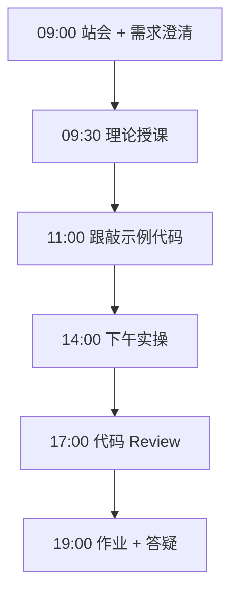
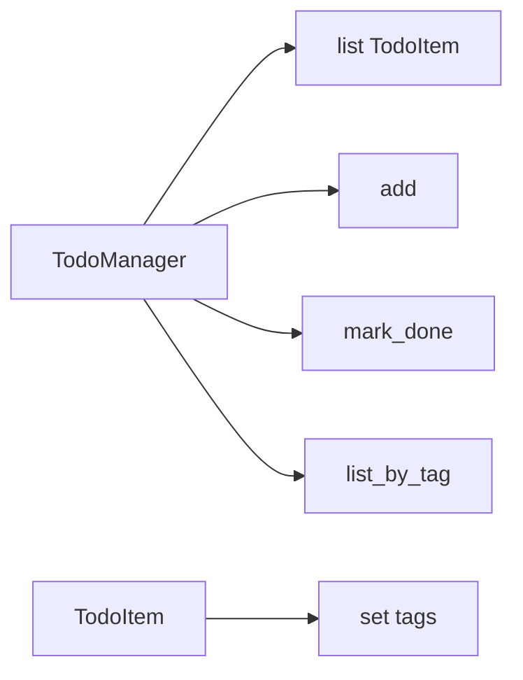

# Day 04：列表/元组/集合

> **阶段**：第一阶段:Python编程基础 | **Epic**：NEXUS-E1 | **预计学时**：6-8 小时

## 旁白解读：今日上下文

> 🎬 **模拟站会 09:00** — 智链科技 Nexus 项目组

**林悦**：任务看板是项目管理的基本盘。今天用 Python 内置容器在内存里模拟 Jira 待办，不连数据库，但 CRUD 思路一致。

**陈工**：重点三个容器——list 有序可变、tuple 有序不可变、set 无序不重复。标签用 set，任务列表用 list。别把所有东西塞一个 list 里用魔法下标，用 dataclass 让字段可读。

**小王**：列表推导式什么时候用？

**陈工**：过滤转换一行能表达清楚就用，复杂逻辑还是 for 循环，可读性优先。下午 stats 和 list_by_tag 就是标准模式，背下来后面写 RAG 文档过滤会天天用。


**今日在 NexusAgent 主线中的位置**：TodoManager 建模预演 NexusAgent 任务队列

**今日 Jira 看板**：
- `NEXUS-E1-D04-S01`
- `NEXUS-E1-D04-S02`

---


## 需求文档（产品林悦下发）

**文档编号**：PRD-NEXUS-D04  
**版本**：v1.0  
**优先级**：P0

### 背景

第一阶段:Python编程基础阶段第 4 天教学任务，与 NexusAgent 主线项目对齐。

### User Stories

### NEXUS-E1-D04-S01

**描述**：列表/元组/集合 相关交付

**验收标准**：
- [ ] 代码可本地运行
- [ ] 通过 `scripts/verify_day.py --day 4`

### NEXUS-E1-D04-S02

**描述**：列表/元组/集合 相关交付

**验收标准**：
- [ ] 代码可本地运行
- [ ] 通过 `scripts/verify_day.py --day 4`


---


## 今日课表

### 上午 09:00-12:00

- 09:00 站会：展示 Day3 菜单 MR，引入可变序列
- 09:30 list 创建、索引、切片、append/extend/pop
- 10:30 tuple 不可变与解包 *
- 11:00 set 去重、交集并集差集

### 下午 14:00-17:30

- 14:00 列表推导式与生成器表达式预览
- 14:45 跟敲 todo_manager：list + set 组合建模
- 16:00 引入 dataclass 简化数据类
- 17:00 Review：何时用 list vs set

### 晚自习 19:00-21:00

- 19:00 作业：待办支持优先级（用元组排序）
- 20:00 练习：两列表找共同元素
- 20:45 预习字典与 JSON

---


## 课堂笔记

### 核心知识点速查

| 序号 | 知识点 | 代码位置 |
|------|--------|----------|
| 1 | list 可变序列与常用 API | 见下午实操 |
| 2 | tuple 不可变与解包 | 见下午实操 |
| 3 | set 去重与集合运算 | 见下午实操 |
| 4 | 索引与切片负下标 | 见下午实操 |
| 5 | 列表推导式 [x for x in ...] | 见下午实操 |
| 6 | in 成员运算符 | 见下午实操 |
| 7 | dataclass 数据类 | 见下午实操 |
| 8 | 可选类型 Optional | 见下午实操 |
| 9 | sort 与 sorted 区别 | 见下午实操 |
| 10 | 类封装 _items 私有约定 | 见下午实操 |

### 今日流程图



### 架构示意图（当日目标）



---


## 实操代码清单

- `code/todo_manager.py`

请按顺序创建并运行。每段代码均可直接复制到对应文件执行。

---

## 实验手册（分时段操作表）

### 实验步骤 1：09:30-10:30 理论

| 时间 | 动作 | 预期结果 | 失败处理 |
|------|------|----------|----------|
| +0min | 打开课件本节 | 看到需求与验收标准 | 检查是否拉取最新 `develop` 分支 |
| +10min | 创建/打开当日 `code/` 文件 | 文件路径与清单一致 | 对照「实操代码清单」 |
| +30min | 粘贴并运行第一个脚本 | 终端有正常输出无 Traceback | 见下方「排错手册」 |
| +60min | 完成全部文件并自测 | `python3` 运行通过 | 使用 `scripts/verify_day.py --day 4` |
| +90min | 提交 Git 并建 MR | MR 关联 Jira NEXUS-E1-D04-S01 | 按附录 Git 示例操作 |


### 实验步骤 2：10:30-12:00 跟敲

| 时间 | 动作 | 预期结果 | 失败处理 |
|------|------|----------|----------|
| +0min | 打开课件本节 | 看到需求与验收标准 | 检查是否拉取最新 `develop` 分支 |
| +10min | 创建/打开当日 `code/` 文件 | 文件路径与清单一致 | 对照「实操代码清单」 |
| +30min | 粘贴并运行第一个脚本 | 终端有正常输出无 Traceback | 见下方「排错手册」 |
| +60min | 完成全部文件并自测 | `python3` 运行通过 | 使用 `scripts/verify_day.py --day 4` |
| +90min | 提交 Git 并建 MR | MR 关联 Jira NEXUS-E1-D04-S01 | 按附录 Git 示例操作 |


### 实验步骤 3：14:00-15:30 实操

| 时间 | 动作 | 预期结果 | 失败处理 |
|------|------|----------|----------|
| +0min | 打开课件本节 | 看到需求与验收标准 | 检查是否拉取最新 `develop` 分支 |
| +10min | 创建/打开当日 `code/` 文件 | 文件路径与清单一致 | 对照「实操代码清单」 |
| +30min | 粘贴并运行第一个脚本 | 终端有正常输出无 Traceback | 见下方「排错手册」 |
| +60min | 完成全部文件并自测 | `python3` 运行通过 | 使用 `scripts/verify_day.py --day 4` |
| +90min | 提交 Git 并建 MR | MR 关联 Jira NEXUS-E1-D04-S01 | 按附录 Git 示例操作 |


### 实验步骤 4：15:30-17:00 联调

| 时间 | 动作 | 预期结果 | 失败处理 |
|------|------|----------|----------|
| +0min | 打开课件本节 | 看到需求与验收标准 | 检查是否拉取最新 `develop` 分支 |
| +10min | 创建/打开当日 `code/` 文件 | 文件路径与清单一致 | 对照「实操代码清单」 |
| +30min | 粘贴并运行第一个脚本 | 终端有正常输出无 Traceback | 见下方「排错手册」 |
| +60min | 完成全部文件并自测 | `python3` 运行通过 | 使用 `scripts/verify_day.py --day 4` |
| +90min | 提交 Git 并建 MR | MR 关联 Jira NEXUS-E1-D04-S01 | 按附录 Git 示例操作 |


### 实验步骤 5：19:00-20:30 作业

| 时间 | 动作 | 预期结果 | 失败处理 |
|------|------|----------|----------|
| +0min | 打开课件本节 | 看到需求与验收标准 | 检查是否拉取最新 `develop` 分支 |
| +10min | 创建/打开当日 `code/` 文件 | 文件路径与清单一致 | 对照「实操代码清单」 |
| +30min | 粘贴并运行第一个脚本 | 终端有正常输出无 Traceback | 见下方「排错手册」 |
| +60min | 完成全部文件并自测 | `python3` 运行通过 | 使用 `scripts/verify_day.py --day 4` |
| +90min | 提交 Git 并建 MR | MR 关联 Jira NEXUS-E1-D04-S01 | 按附录 Git 示例操作 |


### 排错手册（Day 4）

1. **`command not found: python3`** → 安装 Python 3.10+ 或使用 `py -3`（Windows）
2. **`ModuleNotFoundError`** → 确认当前目录、是否激活 venv、`pip install -r requirements.txt`（若当日有）
3. **`SyntaxError: invalid syntax`** → 检查上一行是否缺括号、引号是否中文
4. **`UnicodeDecodeError`** → 文件保存为 UTF-8，终端 `export PYTHONIOENCODING=utf-8`
5. **API 相关（Day12+）** → 检查 `.env` 中 Key，无 Key 时使用课件 MOCK 模式

---


## 逐步跟敲指南（完整源码与解析）

> 以下代码与 `code/` 目录完全一致，可直接复制。每段附行级说明。

### 文件：`code/todo_manager.py`

**操作步骤**：
1. 在 `courseware/day-04/code/` 下创建文件 `todo_manager.py`
2. 完整粘贴下方代码
3. 在终端执行：`cd courseware/day-04/code && python3 todo_manager.py`（若为包内模块则按课件说明）

```python
#!/usr/bin/env python3
# -*- coding: utf-8 -*-
"""
待办事项管理器 todo_manager.py
数据结构：列表存任务 dict；集合存标签去重
企业场景：个人任务看板，后续对接 Jira API
"""
# 启用未来注解语法，允许前向引用类型
from __future__ import annotations

# 从 dataclasses 导入装饰器与 field 工厂
from dataclasses import dataclass, field

# 导入 datetime 用于记录任务创建时间戳
from datetime import datetime

# 导入 Optional 表示可选类型（可为 None）
from typing import Optional


@dataclass
class TodoItem:
    """单条待办：使用 dataclass 减少样板 __init__ 代码。"""

    # 任务标题，必填字符串
    title: str
    # 是否已完成，默认 False 表示待办
    done: bool = False
    # 标签集合，set 保证不重复；default_factory 避免可变默认参数陷阱
    tags: set[str] = field(default_factory=set)
    # 创建时间 ISO 格式字符串，自动生成
    created_at: str = field(
        default_factory=lambda: datetime.now().isoformat(timespec="seconds")
    )
    # 优先级 1(高) 到 5(低)，默认 3 为普通
    priority: int = 3

    def toggle(self) -> None:
        """切换完成状态：True变False，False变True。"""
        # 取反布尔字段
        self.done = not self.done

    def add_tag(self, tag: str) -> None:
        """向当前任务添加单个标签。"""
        # strip 去除首尾空白
        cleaned = tag.strip()
        # 非空才加入集合
        if cleaned:
            self.tags.add(cleaned)


class TodoManager:
    """内存版待办管理器，支持增删改查、标签过滤与排序。"""

    def __init__(self) -> None:
        # 私有列表存储 TodoItem 实例，下标即展示 ID
        self._items: list[TodoItem] = []

    def add(self, title: str, tags: Optional[set[str]] = None, priority: int = 3) -> TodoItem:
        """添加新任务，返回创建的 TodoItem 对象。"""
        # 规范化标题
        title = title.strip()
        # 业务校验：标题不能为空
        if not title:
            raise ValueError("标题不能为空")
        # 优先级限制在 1-5
        priority = max(1, min(5, priority))
        # 构造实体
        item = TodoItem(title=title, tags=tags or set(), priority=priority)
        # 追加到内部列表尾部
        self._items.append(item)
        return item

    def list_all(self) -> list[TodoItem]:
        """返回全部任务的浅拷贝列表，防止外部直接改内部状态。"""
        return list(self._items)

    def list_by_tag(self, tag: str) -> list[TodoItem]:
        """过滤包含指定标签的任务。"""
        tag = tag.strip()
        return [i for i in self._items if tag in i.tags]

    def list_pending(self) -> list[TodoItem]:
        """仅返回未完成任务。"""
        return [i for i in self._items if not i.done]

    def mark_done(self, index: int) -> None:
        """按索引标记为已完成。"""
        # 边界检查
        if index < 0 or index >= len(self._items):
            raise IndexError("索引越界")
        # 设置 done 标志
        self._items[index].done = True

    def toggle_at(self, index: int) -> None:
        """按索引切换完成状态。"""
        if index < 0 or index >= len(self._items):
            raise IndexError("索引越界")
        self._items[index].toggle()

    def remove(self, index: int) -> TodoItem:
        """删除并返回被移除的任务。"""
        if index < 0 or index >= len(self._items):
            raise IndexError("索引越界")
        return self._items.pop(index)

    def sort_by_priority(self) -> None:
        """按 priority 升序原地排序（数字越小越靠前）。"""
        self._items.sort(key=lambda x: x.priority)

    def unique_tags(self) -> set[str]:
        """汇总所有任务中出现过的标签（去重）。"""
        result: set[str] = set()
        for item in self._items:
            # 集合并集更新
            result |= item.tags
        return result

    def stats(self) -> dict[str, int]:
        """统计总任务数、已完成、待办数量。"""
        total = len(self._items)
        done = sum(1 for i in self._items if i.done)
        return {"total": total, "done": done, "pending": total - done}

    def render(self) -> str:
        """渲染 ASCII 表格字符串，便于终端打印。"""
        lines = ["ID | 状态 | 优先级 | 标题 | 标签", "-" * 58]
        for idx, item in enumerate(self._items):
            status = "✓" if item.done else " "
            tags = ",".join(sorted(item.tags)) or "-"
            lines.append(
                f"{idx:2d} | [{status}] | P{item.priority} | {item.title} | {tags}"
            )
        return "\n".join(lines)


def demo() -> None:
    """演示：创建管理器、添加样例、排序并打印。"""
    mgr = TodoManager()
    mgr.add("完成 env_check 文档", {"devops", "day1"}, priority=2)
    mgr.add("实现 text_cleaner 单测", {"python", "day2"}, priority=1)
    mgr.add("复习流程控制", {"python", "day3"}, priority=3)
    mgr.mark_done(0)
    mgr.sort_by_priority()
    print(mgr.render())
    print("统计:", mgr.stats())
    print("全部标签:", mgr.unique_tags())
    print("标签 python:", [i.title for i in mgr.list_by_tag("python")])
    print("待办:", [i.title for i in mgr.list_pending()])


def main() -> None:
    demo()


if __name__ == "__main__":
    main()

```

**解析要点（`todo_manager.py`）**：

- 共 **157** 行，请逐行阅读注释中的中文说明

- 运行前确认 Python 版本 ≥ 3.10：`python3 --version`

- 若报错，先检查缩进是否为 4 空格，勿混用 Tab

- 企业 Review 清单：命名是否清晰、是否有异常处理、是否可复用

---


### 深度讲解 1：list 可变序列与常用 API

在企业级 Python 开发与大模型应用工程中，**list 可变序列与常用 API** 是学员必须牢固掌握的基本功。智链科技 Nexus 项目组在 Day 4 的代码评审中，特别强调以下几点：

1. **为什么学**：list 可变序列与常用 API 直接服务于后续 NexusAgent 平台的 `NEXUS-E1` 模块。没有扎实的 list 可变序列与常用 API，Day 11 之后调用 API、解析 JSON、编写 Agent 工具函数时会出现大量低级错误。

2. **常见坑**：
   - 忽略输入类型校验，导致运行时 `TypeError`
   - 编码问题（Windows 默认 GBK vs UTF-8）
   - 复制粘贴时缩进错乱（Python 对缩进敏感）

3. **企业实践**：在 SmartLink 的 GitLab 仓库中，所有与 list 可变序列与常用 API 相关的代码必须经过 Ruff 静态检查；变量命名使用 `snake_case`，常量使用 `UPPER_SNAKE_CASE`。

4. **与主线项目的关系**：今日代码位于 `courseware/day-04/code/`，部分模块将逐步合并到 `platform/nexus_agent/`。请养成「每日代码皆可运行、皆可测试」的习惯。

5. **扩展阅读建议**：完成今日作业后，可阅读 `docs/project-master-plan.md` 中关于 NEXUS-E1 的章节，建立全局视角。

**课堂互动题**：请用 3 句话向非技术同事解释「list 可变序列与常用 API」是什么。写在作业 MR 的评论里，讲师会抽查点评。

**实操检查清单**：
- [ ] 能不看课件复述 list 可变序列与常用 API 的定义
- [ ] 能独立写出相关代码并运行
- [ ] 能向同学讲解一处容易写错的地方


### 深度讲解 2：tuple 不可变与解包

在企业级 Python 开发与大模型应用工程中，**tuple 不可变与解包** 是学员必须牢固掌握的基本功。智链科技 Nexus 项目组在 Day 4 的代码评审中，特别强调以下几点：

1. **为什么学**：tuple 不可变与解包 直接服务于后续 NexusAgent 平台的 `NEXUS-E1` 模块。没有扎实的 tuple 不可变与解包，Day 11 之后调用 API、解析 JSON、编写 Agent 工具函数时会出现大量低级错误。

2. **常见坑**：
   - 忽略输入类型校验，导致运行时 `TypeError`
   - 编码问题（Windows 默认 GBK vs UTF-8）
   - 复制粘贴时缩进错乱（Python 对缩进敏感）

3. **企业实践**：在 SmartLink 的 GitLab 仓库中，所有与 tuple 不可变与解包 相关的代码必须经过 Ruff 静态检查；变量命名使用 `snake_case`，常量使用 `UPPER_SNAKE_CASE`。

4. **与主线项目的关系**：今日代码位于 `courseware/day-04/code/`，部分模块将逐步合并到 `platform/nexus_agent/`。请养成「每日代码皆可运行、皆可测试」的习惯。

5. **扩展阅读建议**：完成今日作业后，可阅读 `docs/project-master-plan.md` 中关于 NEXUS-E1 的章节，建立全局视角。

**课堂互动题**：请用 3 句话向非技术同事解释「tuple 不可变与解包」是什么。写在作业 MR 的评论里，讲师会抽查点评。

**实操检查清单**：
- [ ] 能不看课件复述 tuple 不可变与解包 的定义
- [ ] 能独立写出相关代码并运行
- [ ] 能向同学讲解一处容易写错的地方


### 深度讲解 3：set 去重与集合运算

在企业级 Python 开发与大模型应用工程中，**set 去重与集合运算** 是学员必须牢固掌握的基本功。智链科技 Nexus 项目组在 Day 4 的代码评审中，特别强调以下几点：

1. **为什么学**：set 去重与集合运算 直接服务于后续 NexusAgent 平台的 `NEXUS-E1` 模块。没有扎实的 set 去重与集合运算，Day 11 之后调用 API、解析 JSON、编写 Agent 工具函数时会出现大量低级错误。

2. **常见坑**：
   - 忽略输入类型校验，导致运行时 `TypeError`
   - 编码问题（Windows 默认 GBK vs UTF-8）
   - 复制粘贴时缩进错乱（Python 对缩进敏感）

3. **企业实践**：在 SmartLink 的 GitLab 仓库中，所有与 set 去重与集合运算 相关的代码必须经过 Ruff 静态检查；变量命名使用 `snake_case`，常量使用 `UPPER_SNAKE_CASE`。

4. **与主线项目的关系**：今日代码位于 `courseware/day-04/code/`，部分模块将逐步合并到 `platform/nexus_agent/`。请养成「每日代码皆可运行、皆可测试」的习惯。

5. **扩展阅读建议**：完成今日作业后，可阅读 `docs/project-master-plan.md` 中关于 NEXUS-E1 的章节，建立全局视角。

**课堂互动题**：请用 3 句话向非技术同事解释「set 去重与集合运算」是什么。写在作业 MR 的评论里，讲师会抽查点评。

**实操检查清单**：
- [ ] 能不看课件复述 set 去重与集合运算 的定义
- [ ] 能独立写出相关代码并运行
- [ ] 能向同学讲解一处容易写错的地方


### 深度讲解 4：索引与切片负下标

在企业级 Python 开发与大模型应用工程中，**索引与切片负下标** 是学员必须牢固掌握的基本功。智链科技 Nexus 项目组在 Day 4 的代码评审中，特别强调以下几点：

1. **为什么学**：索引与切片负下标 直接服务于后续 NexusAgent 平台的 `NEXUS-E1` 模块。没有扎实的 索引与切片负下标，Day 11 之后调用 API、解析 JSON、编写 Agent 工具函数时会出现大量低级错误。

2. **常见坑**：
   - 忽略输入类型校验，导致运行时 `TypeError`
   - 编码问题（Windows 默认 GBK vs UTF-8）
   - 复制粘贴时缩进错乱（Python 对缩进敏感）

3. **企业实践**：在 SmartLink 的 GitLab 仓库中，所有与 索引与切片负下标 相关的代码必须经过 Ruff 静态检查；变量命名使用 `snake_case`，常量使用 `UPPER_SNAKE_CASE`。

4. **与主线项目的关系**：今日代码位于 `courseware/day-04/code/`，部分模块将逐步合并到 `platform/nexus_agent/`。请养成「每日代码皆可运行、皆可测试」的习惯。

5. **扩展阅读建议**：完成今日作业后，可阅读 `docs/project-master-plan.md` 中关于 NEXUS-E1 的章节，建立全局视角。

**课堂互动题**：请用 3 句话向非技术同事解释「索引与切片负下标」是什么。写在作业 MR 的评论里，讲师会抽查点评。

**实操检查清单**：
- [ ] 能不看课件复述 索引与切片负下标 的定义
- [ ] 能独立写出相关代码并运行
- [ ] 能向同学讲解一处容易写错的地方


### 深度讲解 5：列表推导式 [x for x in ...]

在企业级 Python 开发与大模型应用工程中，**列表推导式 [x for x in ...]** 是学员必须牢固掌握的基本功。智链科技 Nexus 项目组在 Day 4 的代码评审中，特别强调以下几点：

1. **为什么学**：列表推导式 [x for x in ...] 直接服务于后续 NexusAgent 平台的 `NEXUS-E1` 模块。没有扎实的 列表推导式 [x for x in ...]，Day 11 之后调用 API、解析 JSON、编写 Agent 工具函数时会出现大量低级错误。

2. **常见坑**：
   - 忽略输入类型校验，导致运行时 `TypeError`
   - 编码问题（Windows 默认 GBK vs UTF-8）
   - 复制粘贴时缩进错乱（Python 对缩进敏感）

3. **企业实践**：在 SmartLink 的 GitLab 仓库中，所有与 列表推导式 [x for x in ...] 相关的代码必须经过 Ruff 静态检查；变量命名使用 `snake_case`，常量使用 `UPPER_SNAKE_CASE`。

4. **与主线项目的关系**：今日代码位于 `courseware/day-04/code/`，部分模块将逐步合并到 `platform/nexus_agent/`。请养成「每日代码皆可运行、皆可测试」的习惯。

5. **扩展阅读建议**：完成今日作业后，可阅读 `docs/project-master-plan.md` 中关于 NEXUS-E1 的章节，建立全局视角。

**课堂互动题**：请用 3 句话向非技术同事解释「列表推导式 [x for x in ...]」是什么。写在作业 MR 的评论里，讲师会抽查点评。

**实操检查清单**：
- [ ] 能不看课件复述 列表推导式 [x for x in ...] 的定义
- [ ] 能独立写出相关代码并运行
- [ ] 能向同学讲解一处容易写错的地方


### 深度讲解 6：in 成员运算符

在企业级 Python 开发与大模型应用工程中，**in 成员运算符** 是学员必须牢固掌握的基本功。智链科技 Nexus 项目组在 Day 4 的代码评审中，特别强调以下几点：

1. **为什么学**：in 成员运算符 直接服务于后续 NexusAgent 平台的 `NEXUS-E1` 模块。没有扎实的 in 成员运算符，Day 11 之后调用 API、解析 JSON、编写 Agent 工具函数时会出现大量低级错误。

2. **常见坑**：
   - 忽略输入类型校验，导致运行时 `TypeError`
   - 编码问题（Windows 默认 GBK vs UTF-8）
   - 复制粘贴时缩进错乱（Python 对缩进敏感）

3. **企业实践**：在 SmartLink 的 GitLab 仓库中，所有与 in 成员运算符 相关的代码必须经过 Ruff 静态检查；变量命名使用 `snake_case`，常量使用 `UPPER_SNAKE_CASE`。

4. **与主线项目的关系**：今日代码位于 `courseware/day-04/code/`，部分模块将逐步合并到 `platform/nexus_agent/`。请养成「每日代码皆可运行、皆可测试」的习惯。

5. **扩展阅读建议**：完成今日作业后，可阅读 `docs/project-master-plan.md` 中关于 NEXUS-E1 的章节，建立全局视角。

**课堂互动题**：请用 3 句话向非技术同事解释「in 成员运算符」是什么。写在作业 MR 的评论里，讲师会抽查点评。

**实操检查清单**：
- [ ] 能不看课件复述 in 成员运算符 的定义
- [ ] 能独立写出相关代码并运行
- [ ] 能向同学讲解一处容易写错的地方


### 深度讲解 7：dataclass 数据类

在企业级 Python 开发与大模型应用工程中，**dataclass 数据类** 是学员必须牢固掌握的基本功。智链科技 Nexus 项目组在 Day 4 的代码评审中，特别强调以下几点：

1. **为什么学**：dataclass 数据类 直接服务于后续 NexusAgent 平台的 `NEXUS-E1` 模块。没有扎实的 dataclass 数据类，Day 11 之后调用 API、解析 JSON、编写 Agent 工具函数时会出现大量低级错误。

2. **常见坑**：
   - 忽略输入类型校验，导致运行时 `TypeError`
   - 编码问题（Windows 默认 GBK vs UTF-8）
   - 复制粘贴时缩进错乱（Python 对缩进敏感）

3. **企业实践**：在 SmartLink 的 GitLab 仓库中，所有与 dataclass 数据类 相关的代码必须经过 Ruff 静态检查；变量命名使用 `snake_case`，常量使用 `UPPER_SNAKE_CASE`。

4. **与主线项目的关系**：今日代码位于 `courseware/day-04/code/`，部分模块将逐步合并到 `platform/nexus_agent/`。请养成「每日代码皆可运行、皆可测试」的习惯。

5. **扩展阅读建议**：完成今日作业后，可阅读 `docs/project-master-plan.md` 中关于 NEXUS-E1 的章节，建立全局视角。

**课堂互动题**：请用 3 句话向非技术同事解释「dataclass 数据类」是什么。写在作业 MR 的评论里，讲师会抽查点评。

**实操检查清单**：
- [ ] 能不看课件复述 dataclass 数据类 的定义
- [ ] 能独立写出相关代码并运行
- [ ] 能向同学讲解一处容易写错的地方


### 深度讲解 8：可选类型 Optional

在企业级 Python 开发与大模型应用工程中，**可选类型 Optional** 是学员必须牢固掌握的基本功。智链科技 Nexus 项目组在 Day 4 的代码评审中，特别强调以下几点：

1. **为什么学**：可选类型 Optional 直接服务于后续 NexusAgent 平台的 `NEXUS-E1` 模块。没有扎实的 可选类型 Optional，Day 11 之后调用 API、解析 JSON、编写 Agent 工具函数时会出现大量低级错误。

2. **常见坑**：
   - 忽略输入类型校验，导致运行时 `TypeError`
   - 编码问题（Windows 默认 GBK vs UTF-8）
   - 复制粘贴时缩进错乱（Python 对缩进敏感）

3. **企业实践**：在 SmartLink 的 GitLab 仓库中，所有与 可选类型 Optional 相关的代码必须经过 Ruff 静态检查；变量命名使用 `snake_case`，常量使用 `UPPER_SNAKE_CASE`。

4. **与主线项目的关系**：今日代码位于 `courseware/day-04/code/`，部分模块将逐步合并到 `platform/nexus_agent/`。请养成「每日代码皆可运行、皆可测试」的习惯。

5. **扩展阅读建议**：完成今日作业后，可阅读 `docs/project-master-plan.md` 中关于 NEXUS-E1 的章节，建立全局视角。

**课堂互动题**：请用 3 句话向非技术同事解释「可选类型 Optional」是什么。写在作业 MR 的评论里，讲师会抽查点评。

**实操检查清单**：
- [ ] 能不看课件复述 可选类型 Optional 的定义
- [ ] 能独立写出相关代码并运行
- [ ] 能向同学讲解一处容易写错的地方


### 深度讲解 9：sort 与 sorted 区别

在企业级 Python 开发与大模型应用工程中，**sort 与 sorted 区别** 是学员必须牢固掌握的基本功。智链科技 Nexus 项目组在 Day 4 的代码评审中，特别强调以下几点：

1. **为什么学**：sort 与 sorted 区别 直接服务于后续 NexusAgent 平台的 `NEXUS-E1` 模块。没有扎实的 sort 与 sorted 区别，Day 11 之后调用 API、解析 JSON、编写 Agent 工具函数时会出现大量低级错误。

2. **常见坑**：
   - 忽略输入类型校验，导致运行时 `TypeError`
   - 编码问题（Windows 默认 GBK vs UTF-8）
   - 复制粘贴时缩进错乱（Python 对缩进敏感）

3. **企业实践**：在 SmartLink 的 GitLab 仓库中，所有与 sort 与 sorted 区别 相关的代码必须经过 Ruff 静态检查；变量命名使用 `snake_case`，常量使用 `UPPER_SNAKE_CASE`。

4. **与主线项目的关系**：今日代码位于 `courseware/day-04/code/`，部分模块将逐步合并到 `platform/nexus_agent/`。请养成「每日代码皆可运行、皆可测试」的习惯。

5. **扩展阅读建议**：完成今日作业后，可阅读 `docs/project-master-plan.md` 中关于 NEXUS-E1 的章节，建立全局视角。

**课堂互动题**：请用 3 句话向非技术同事解释「sort 与 sorted 区别」是什么。写在作业 MR 的评论里，讲师会抽查点评。

**实操检查清单**：
- [ ] 能不看课件复述 sort 与 sorted 区别 的定义
- [ ] 能独立写出相关代码并运行
- [ ] 能向同学讲解一处容易写错的地方


### 深度讲解 10：类封装 _items 私有约定

在企业级 Python 开发与大模型应用工程中，**类封装 _items 私有约定** 是学员必须牢固掌握的基本功。智链科技 Nexus 项目组在 Day 4 的代码评审中，特别强调以下几点：

1. **为什么学**：类封装 _items 私有约定 直接服务于后续 NexusAgent 平台的 `NEXUS-E1` 模块。没有扎实的 类封装 _items 私有约定，Day 11 之后调用 API、解析 JSON、编写 Agent 工具函数时会出现大量低级错误。

2. **常见坑**：
   - 忽略输入类型校验，导致运行时 `TypeError`
   - 编码问题（Windows 默认 GBK vs UTF-8）
   - 复制粘贴时缩进错乱（Python 对缩进敏感）

3. **企业实践**：在 SmartLink 的 GitLab 仓库中，所有与 类封装 _items 私有约定 相关的代码必须经过 Ruff 静态检查；变量命名使用 `snake_case`，常量使用 `UPPER_SNAKE_CASE`。

4. **与主线项目的关系**：今日代码位于 `courseware/day-04/code/`，部分模块将逐步合并到 `platform/nexus_agent/`。请养成「每日代码皆可运行、皆可测试」的习惯。

5. **扩展阅读建议**：完成今日作业后，可阅读 `docs/project-master-plan.md` 中关于 NEXUS-E1 的章节，建立全局视角。

**课堂互动题**：请用 3 句话向非技术同事解释「类封装 _items 私有约定」是什么。写在作业 MR 的评论里，讲师会抽查点评。

**实操检查清单**：
- [ ] 能不看课件复述 类封装 _items 私有约定 的定义
- [ ] 能独立写出相关代码并运行
- [ ] 能向同学讲解一处容易写错的地方


## 阶段复盘锚点（第一阶段:Python编程基础）

今天是 **第一阶段:Python编程基础** 的第 **4** 个学习日。请回顾：

- 昨天学了什么？今天如何承接？
- 今天的内容在 70 天路线图中的坐标？
- 如果我是 Tech Lead，会如何 Review 今日代码？

**陈工寄语**：慢即是快。企业里没人关心你一天学了多少个语法点，只关心你写的脚本能不能在服务器上稳定跑 7×24 小时。今天把地基打牢，后面 Agent 编排、RAG 检索才不会塌。

**林悦补充**：产品侧只验收「用户能感知到的价值」。今日交付虽然简单，但「个人信息卡片」本质是后续「用户画像 Agent」的数据采集原型——字段设计请认真思考。

**代码量统计（累计）**：完成今日后，个人仓库累计约 **5600** 行（含注释与测试），全营目标 10 万行。

**明日预告**：请提前阅读 `courseware/day-05/README.md` 开头的旁白，了解上下文。


## 常见问题 FAQ（讲师答疑实录）


**Q1：学习「list 可变序列与常用 API」时最常问的问题是什么？**

A：学员常问「这在大模型开发里到底用在哪里」。直接回答：在 NexusAgent 的 `NEXUS-E1` 中，list 可变序列与常用 API 用于支撑「列表/元组/集合」这一交付。建议你打开 `platform/` 对照看未来模块如何引用今日写法。另一个常见问题是「要不要背语法」——不需要背，但要能写出可运行代码，并能在报错时读懂 Traceback。

**追问**：如果线上报错与 list 可变序列与常用 API 相关，如何排查？  
**答**：① 复现 ② 最小化输入 ③ 打印中间变量 ④ 查 GitLab 历史 diff ⑤ 在 Jira 建 Bug 单附上日志。


**Q2：学习「tuple 不可变与解包」时最常问的问题是什么？**

A：学员常问「这在大模型开发里到底用在哪里」。直接回答：在 NexusAgent 的 `NEXUS-E1` 中，tuple 不可变与解包 用于支撑「列表/元组/集合」这一交付。建议你打开 `platform/` 对照看未来模块如何引用今日写法。另一个常见问题是「要不要背语法」——不需要背，但要能写出可运行代码，并能在报错时读懂 Traceback。

**追问**：如果线上报错与 tuple 不可变与解包 相关，如何排查？  
**答**：① 复现 ② 最小化输入 ③ 打印中间变量 ④ 查 GitLab 历史 diff ⑤ 在 Jira 建 Bug 单附上日志。


**Q3：学习「set 去重与集合运算」时最常问的问题是什么？**

A：学员常问「这在大模型开发里到底用在哪里」。直接回答：在 NexusAgent 的 `NEXUS-E1` 中，set 去重与集合运算 用于支撑「列表/元组/集合」这一交付。建议你打开 `platform/` 对照看未来模块如何引用今日写法。另一个常见问题是「要不要背语法」——不需要背，但要能写出可运行代码，并能在报错时读懂 Traceback。

**追问**：如果线上报错与 set 去重与集合运算 相关，如何排查？  
**答**：① 复现 ② 最小化输入 ③ 打印中间变量 ④ 查 GitLab 历史 diff ⑤ 在 Jira 建 Bug 单附上日志。


**Q4：学习「索引与切片负下标」时最常问的问题是什么？**

A：学员常问「这在大模型开发里到底用在哪里」。直接回答：在 NexusAgent 的 `NEXUS-E1` 中，索引与切片负下标 用于支撑「列表/元组/集合」这一交付。建议你打开 `platform/` 对照看未来模块如何引用今日写法。另一个常见问题是「要不要背语法」——不需要背，但要能写出可运行代码，并能在报错时读懂 Traceback。

**追问**：如果线上报错与 索引与切片负下标 相关，如何排查？  
**答**：① 复现 ② 最小化输入 ③ 打印中间变量 ④ 查 GitLab 历史 diff ⑤ 在 Jira 建 Bug 单附上日志。


**Q5：学习「列表推导式 [x for x in ...]」时最常问的问题是什么？**

A：学员常问「这在大模型开发里到底用在哪里」。直接回答：在 NexusAgent 的 `NEXUS-E1` 中，列表推导式 [x for x in ...] 用于支撑「列表/元组/集合」这一交付。建议你打开 `platform/` 对照看未来模块如何引用今日写法。另一个常见问题是「要不要背语法」——不需要背，但要能写出可运行代码，并能在报错时读懂 Traceback。

**追问**：如果线上报错与 列表推导式 [x for x in ...] 相关，如何排查？  
**答**：① 复现 ② 最小化输入 ③ 打印中间变量 ④ 查 GitLab 历史 diff ⑤ 在 Jira 建 Bug 单附上日志。


**Q6：学习「in 成员运算符」时最常问的问题是什么？**

A：学员常问「这在大模型开发里到底用在哪里」。直接回答：在 NexusAgent 的 `NEXUS-E1` 中，in 成员运算符 用于支撑「列表/元组/集合」这一交付。建议你打开 `platform/` 对照看未来模块如何引用今日写法。另一个常见问题是「要不要背语法」——不需要背，但要能写出可运行代码，并能在报错时读懂 Traceback。

**追问**：如果线上报错与 in 成员运算符 相关，如何排查？  
**答**：① 复现 ② 最小化输入 ③ 打印中间变量 ④ 查 GitLab 历史 diff ⑤ 在 Jira 建 Bug 单附上日志。


**Q7：学习「dataclass 数据类」时最常问的问题是什么？**

A：学员常问「这在大模型开发里到底用在哪里」。直接回答：在 NexusAgent 的 `NEXUS-E1` 中，dataclass 数据类 用于支撑「列表/元组/集合」这一交付。建议你打开 `platform/` 对照看未来模块如何引用今日写法。另一个常见问题是「要不要背语法」——不需要背，但要能写出可运行代码，并能在报错时读懂 Traceback。

**追问**：如果线上报错与 dataclass 数据类 相关，如何排查？  
**答**：① 复现 ② 最小化输入 ③ 打印中间变量 ④ 查 GitLab 历史 diff ⑤ 在 Jira 建 Bug 单附上日志。


**Q8：学习「可选类型 Optional」时最常问的问题是什么？**

A：学员常问「这在大模型开发里到底用在哪里」。直接回答：在 NexusAgent 的 `NEXUS-E1` 中，可选类型 Optional 用于支撑「列表/元组/集合」这一交付。建议你打开 `platform/` 对照看未来模块如何引用今日写法。另一个常见问题是「要不要背语法」——不需要背，但要能写出可运行代码，并能在报错时读懂 Traceback。

**追问**：如果线上报错与 可选类型 Optional 相关，如何排查？  
**答**：① 复现 ② 最小化输入 ③ 打印中间变量 ④ 查 GitLab 历史 diff ⑤ 在 Jira 建 Bug 单附上日志。


**Q9：学习「sort 与 sorted 区别」时最常问的问题是什么？**

A：学员常问「这在大模型开发里到底用在哪里」。直接回答：在 NexusAgent 的 `NEXUS-E1` 中，sort 与 sorted 区别 用于支撑「列表/元组/集合」这一交付。建议你打开 `platform/` 对照看未来模块如何引用今日写法。另一个常见问题是「要不要背语法」——不需要背，但要能写出可运行代码，并能在报错时读懂 Traceback。

**追问**：如果线上报错与 sort 与 sorted 区别 相关，如何排查？  
**答**：① 复现 ② 最小化输入 ③ 打印中间变量 ④ 查 GitLab 历史 diff ⑤ 在 Jira 建 Bug 单附上日志。


**Q10：学习「类封装 _items 私有约定」时最常问的问题是什么？**

A：学员常问「这在大模型开发里到底用在哪里」。直接回答：在 NexusAgent 的 `NEXUS-E1` 中，类封装 _items 私有约定 用于支撑「列表/元组/集合」这一交付。建议你打开 `platform/` 对照看未来模块如何引用今日写法。另一个常见问题是「要不要背语法」——不需要背，但要能写出可运行代码，并能在报错时读懂 Traceback。

**追问**：如果线上报错与 类封装 _items 私有约定 相关，如何排查？  
**答**：① 复现 ② 最小化输入 ③ 打印中间变量 ④ 查 GitLab 历史 diff ⑤ 在 Jira 建 Bug 单附上日志。


## 面试押题（与今日知识点挂钩）

以下题目会出现在 Day 67-69 模拟面试中，建议今日就开始积累答案：

1. **list 可变序列与常用 API**：请结合 NexusAgent 项目举例说明你在哪一天、哪段代码里用到了它？
2. **tuple 不可变与解包**：请结合 NexusAgent 项目举例说明你在哪一天、哪段代码里用到了它？
3. **set 去重与集合运算**：请结合 NexusAgent 项目举例说明你在哪一天、哪段代码里用到了它？
4. **索引与切片负下标**：请结合 NexusAgent 项目举例说明你在哪一天、哪段代码里用到了它？
5. **列表推导式 [x for x in ...]**：请结合 NexusAgent 项目举例说明你在哪一天、哪段代码里用到了它？
6. **in 成员运算符**：请结合 NexusAgent 项目举例说明你在哪一天、哪段代码里用到了它？

**参考答案思路**：采用 STAR 法则（情境-任务-行动-结果），引用 `courseware/day-04/code/` 中的具体文件名与函数名。

---


## Code Review 检查表（陈工版）

合并 MR 前自查：

- [ ] 所有新增 `.py` 文件顶部有模块说明 docstring
- [ ] 无硬编码密钥（API Key 走环境变量）
- [ ] 函数长度 < 50 行，过长则拆分
- [ ] 异常有明确提示，禁止裸 `except:`
- [ ] 提交信息符合 `feat(day-04): ...`
- [ ] README 或注释说明如何运行
- [ ] 与 Jira Story 验收标准逐条对应

**今日重点审查项**：列表/元组/集合 相关逻辑是否可读、可测、可扩展至 `platform/nexus_agent/`。

---


## 课后作业

### 作业说明

**作业：待办优先级**

1. 扩展 `TodoItem` 增加字段 `priority: int`（1 高 - 5 低，默认 3）
2. 实现 `sort_by_priority()` 原地排序列表
3. 实现 `unique_tags()` 返回所有标签的集合
4. 编写 `demo_priority()` 添加 5 条不同优先级任务并打印排序结果


### 提交要求

1. 代码提交到分支 `feature/day-04-homework`
2. GitLab MR 标题：`[Day-04] homework: 课后作业`
3. 在 MR 描述中附上运行截图或终端输出

### 评分标准（满分 100）

| 项 | 分值 |
|----|------|
| 功能完整 | 40 |
| 代码规范与注释 | 30 |
| 异常处理 | 15 |
| MR 与 Jira 关联 | 15 |

---

## 作业参考答案

> ⚠️ 请先独立完成再对照答案

```python
@dataclass
class TodoItem:
  title: str
  priority: int = 3
  done: bool = False
  tags: set[str] = field(default_factory=set)

def sort_by_priority(self) -> None:
  self._items.sort(key=lambda x: x.priority)

def unique_tags(self) -> set[str]:
  result: set[str] = set()
  for item in self._items:
    result |= item.tags
  return result
```


---


## 附录：Git 提交示例

```bash
git checkout develop
git pull origin develop
git checkout -b feature/day-04-列表/元组/集合
# 完成代码后
git add courseware/day-04/
git commit -m "feat(day-04): 列表/元组/集合"
git push -u origin feature/day-04-列表/元组/集合
```

---

*课件版本 Day-04-v1.0 | 智链科技培训中心*
