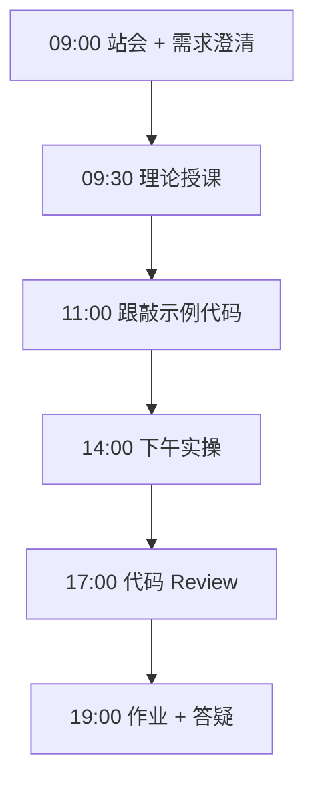
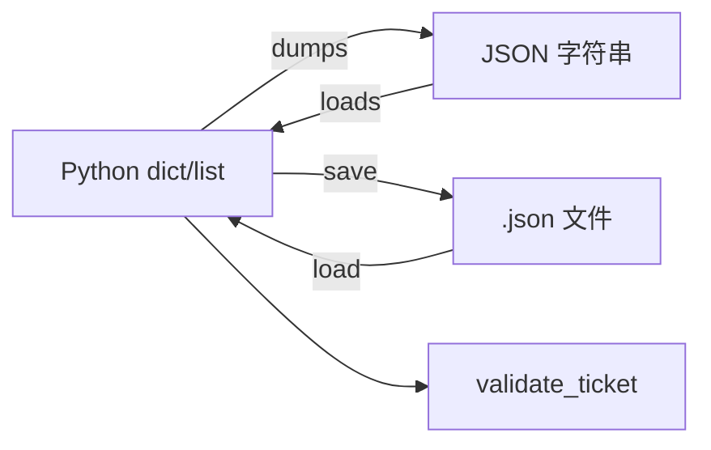

# Day 05：字典与JSON

> **阶段**：第一阶段:Python编程基础 | **Epic**：NEXUS-E1 | **预计学时**：6-8 小时

## 旁白解读：今日上下文

> 🎬 **模拟站会 09:00** — 智链科技 Nexus 项目组

**陈工**：大模型应用开发天天跟 JSON 打交道——API 请求体、响应体、工具调用参数全是 JSON。dict 是 Python 里映射 JSON 的天然结构，今天必须熟练到肌肉记忆。

**林悦**：上午产品给了工单导出样例，下午 json_parser 要能校验、汇总、落盘。将来 NexusAgent 读 Jira Webhook 也是这个套路。

**小李**：`ensure_ascii=False` 是什么意思？

**陈工**：默认 dumps 会把中文转成 \uXXXX，企业日志和配置文件可读性差。一律 False，文件编码 utf-8。嵌套访问别链式 `a['b']['c']` 炸 KeyError，用 get_nested 或 .get 渐进式取值。


**今日在 NexusAgent 主线中的位置**：json_parser 对齐 NexusAgent 配置加载模块

**今日 Jira 看板**：
- `NEXUS-E1-D05-S01`
- `NEXUS-E1-D05-S02`

---


## 需求文档（产品林悦下发）

**文档编号**：PRD-NEXUS-D05  
**版本**：v1.0  
**优先级**：P0

### 背景

第一阶段:Python编程基础阶段第 5 天教学任务，与 NexusAgent 主线项目对齐。

### User Stories

### NEXUS-E1-D05-S01

**描述**：字典与JSON 相关交付

**验收标准**：
- [ ] 代码可本地运行
- [ ] 通过 `scripts/verify_day.py --day 5`

### NEXUS-E1-D05-S02

**描述**：字典与JSON 相关交付

**验收标准**：
- [ ] 代码可本地运行
- [ ] 通过 `scripts/verify_day.py --day 5`


---


## 今日课表

### 上午 09:00-12:00

- 09:00 站会：API 时代数据全是 JSON
- 09:30 dict 创建、访问、get、keys/values/items
- 10:30 嵌套 dict 与浅拷贝/copy
- 11:00 json 模块 dumps/loads 与 ensure_ascii

### 下午 14:00-17:30

- 14:00 文件读写 Path.read_text/write_text
- 14:45 跟敲 json_parser：校验与汇总
- 16:00 错误处理：JSONDecodeError
- 17:00 Review：配置与业务数据分离

### 晚自习 19:00-21:00

- 19:00 作业：解析课程表 JSON
- 20:00 了解 JSON Schema 概念（预习）
- 20:45 阅读 FastAPI 响应 JSON 示例（浏览）

---


## 课堂笔记

### 核心知识点速查

| 序号 | 知识点 | 代码位置 |
|------|--------|----------|
| 1 | dict 键值对与哈希表 | 见下午实操 |
| 2 | dict.get 默认值 | 见下午实操 |
| 3 | keys/values/items 遍历 | 见下午实操 |
| 4 | 嵌套字典安全访问 | 见下午实操 |
| 5 | json.dumps 与 json.loads | 见下午实操 |
| 6 | ensure_ascii=False 中文 | 见下午实操 |
| 7 | Path 读写 UTF-8 文件 | 见下午实操 |
| 8 | JSONDecodeError 异常 | 见下午实操 |
| 9 | 数据校验返回 errors 列表 | 见下午实操 |
| 10 | 按字段聚合统计 | 见下午实操 |

### 今日流程图



### 架构示意图（当日目标）



---


## 实操代码清单

- `code/json_parser.py`

请按顺序创建并运行。每段代码均可直接复制到对应文件执行。

---

## 实验手册（分时段操作表）

### 实验步骤 1：09:30-10:30 理论

| 时间 | 动作 | 预期结果 | 失败处理 |
|------|------|----------|----------|
| +0min | 打开课件本节 | 看到需求与验收标准 | 检查是否拉取最新 `develop` 分支 |
| +10min | 创建/打开当日 `code/` 文件 | 文件路径与清单一致 | 对照「实操代码清单」 |
| +30min | 粘贴并运行第一个脚本 | 终端有正常输出无 Traceback | 见下方「排错手册」 |
| +60min | 完成全部文件并自测 | `python3` 运行通过 | 使用 `scripts/verify_day.py --day 5` |
| +90min | 提交 Git 并建 MR | MR 关联 Jira NEXUS-E1-D05-S01 | 按附录 Git 示例操作 |


### 实验步骤 2：10:30-12:00 跟敲

| 时间 | 动作 | 预期结果 | 失败处理 |
|------|------|----------|----------|
| +0min | 打开课件本节 | 看到需求与验收标准 | 检查是否拉取最新 `develop` 分支 |
| +10min | 创建/打开当日 `code/` 文件 | 文件路径与清单一致 | 对照「实操代码清单」 |
| +30min | 粘贴并运行第一个脚本 | 终端有正常输出无 Traceback | 见下方「排错手册」 |
| +60min | 完成全部文件并自测 | `python3` 运行通过 | 使用 `scripts/verify_day.py --day 5` |
| +90min | 提交 Git 并建 MR | MR 关联 Jira NEXUS-E1-D05-S01 | 按附录 Git 示例操作 |


### 实验步骤 3：14:00-15:30 实操

| 时间 | 动作 | 预期结果 | 失败处理 |
|------|------|----------|----------|
| +0min | 打开课件本节 | 看到需求与验收标准 | 检查是否拉取最新 `develop` 分支 |
| +10min | 创建/打开当日 `code/` 文件 | 文件路径与清单一致 | 对照「实操代码清单」 |
| +30min | 粘贴并运行第一个脚本 | 终端有正常输出无 Traceback | 见下方「排错手册」 |
| +60min | 完成全部文件并自测 | `python3` 运行通过 | 使用 `scripts/verify_day.py --day 5` |
| +90min | 提交 Git 并建 MR | MR 关联 Jira NEXUS-E1-D05-S01 | 按附录 Git 示例操作 |


### 实验步骤 4：15:30-17:00 联调

| 时间 | 动作 | 预期结果 | 失败处理 |
|------|------|----------|----------|
| +0min | 打开课件本节 | 看到需求与验收标准 | 检查是否拉取最新 `develop` 分支 |
| +10min | 创建/打开当日 `code/` 文件 | 文件路径与清单一致 | 对照「实操代码清单」 |
| +30min | 粘贴并运行第一个脚本 | 终端有正常输出无 Traceback | 见下方「排错手册」 |
| +60min | 完成全部文件并自测 | `python3` 运行通过 | 使用 `scripts/verify_day.py --day 5` |
| +90min | 提交 Git 并建 MR | MR 关联 Jira NEXUS-E1-D05-S01 | 按附录 Git 示例操作 |


### 实验步骤 5：19:00-20:30 作业

| 时间 | 动作 | 预期结果 | 失败处理 |
|------|------|----------|----------|
| +0min | 打开课件本节 | 看到需求与验收标准 | 检查是否拉取最新 `develop` 分支 |
| +10min | 创建/打开当日 `code/` 文件 | 文件路径与清单一致 | 对照「实操代码清单」 |
| +30min | 粘贴并运行第一个脚本 | 终端有正常输出无 Traceback | 见下方「排错手册」 |
| +60min | 完成全部文件并自测 | `python3` 运行通过 | 使用 `scripts/verify_day.py --day 5` |
| +90min | 提交 Git 并建 MR | MR 关联 Jira NEXUS-E1-D05-S01 | 按附录 Git 示例操作 |


### 排错手册（Day 5）

1. **`command not found: python3`** → 安装 Python 3.10+ 或使用 `py -3`（Windows）
2. **`ModuleNotFoundError`** → 确认当前目录、是否激活 venv、`pip install -r requirements.txt`（若当日有）
3. **`SyntaxError: invalid syntax`** → 检查上一行是否缺括号、引号是否中文
4. **`UnicodeDecodeError`** → 文件保存为 UTF-8，终端 `export PYTHONIOENCODING=utf-8`
5. **API 相关（Day12+）** → 检查 `.env` 中 Key，无 Key 时使用课件 MOCK 模式

---


## 逐步跟敲指南（完整源码与解析）

> 以下代码与 `code/` 目录完全一致，可直接复制。每段附行级说明。

### 文件：`code/json_parser.py`

**操作步骤**：
1. 在 `courseware/day-05/code/` 下创建文件 `json_parser.py`
2. 完整粘贴下方代码
3. 在终端执行：`cd courseware/day-05/code && python3 json_parser.py`（若为包内模块则按课件说明）

```python
#!/usr/bin/env python3
# -*- coding: utf-8 -*-
"""
JSON 解析与生成 json_parser.py
企业场景：读取 API 响应、配置文件、工单导出
"""
from __future__ import annotations

import json
from pathlib import Path
from typing import Any


SAMPLE_TICKET = {
    "id": "NEXUS-1024",
    "title": "实现用户登录 API",
    "status": "In Progress",
    "assignee": {"name": "张晓明", "email": "zhang@smartlink.cn"},
    "labels": ["backend", "p0"],
    "story_points": 5,
}


def to_json_string(data: Any, *, pretty: bool = True) -> str:
    """Python 对象序列化为 JSON 字符串。"""
    indent = 2 if pretty else None
    return json.dumps(data, ensure_ascii=False, indent=indent)


def from_json_string(text: str) -> Any:
    """JSON 字符串反序列化为 Python 对象。"""
    return json.loads(text)


def load_json_file(path: Path) -> Any:
    """从 UTF-8 文件读取 JSON。"""
    content = path.read_text(encoding="utf-8")
    return json.loads(content)


def save_json_file(path: Path, data: Any) -> None:
    """将对象写入 JSON 文件，自动创建父目录。"""
    path.parent.mkdir(parents=True, exist_ok=True)
    text = json.dumps(data, ensure_ascii=False, indent=2)
    path.write_text(text + "\n", encoding="utf-8")


def get_nested(data: dict[str, Any], keys: list[str], default: Any = None) -> Any:
    """安全读取嵌套字典，任一层缺失返回 default。"""
    current: Any = data
    for key in keys:
        if not isinstance(current, dict) or key not in current:
            return default
        current = current[key]
    return current


def validate_ticket(ticket: dict[str, Any]) -> list[str]:
    """校验工单必填字段，返回错误列表（空即通过）。"""
    errors: list[str] = []
    required = ["id", "title", "status"]
    for field in required:
        if field not in ticket or not ticket[field]:
            errors.append(f"缺少或为空: {field}")
    if "assignee" in ticket:
        email = get_nested(ticket, ["assignee", "email"])
        if email and "@" not in str(email):
            errors.append("assignee.email 格式可疑")
    return errors


def tickets_summary(tickets: list[dict[str, Any]]) -> dict[str, int]:
    """按 status 聚合计数。"""
    summary: dict[str, int] = {}
    for t in tickets:
        status = str(t.get("status", "Unknown"))
        summary[status] = summary.get(status, 0) + 1
    return summary


def demo() -> None:
    print("=== JSON 序列化 ===")
    text = to_json_string(SAMPLE_TICKET)
    print(text)
    print("=== 反序列化 ===")
    obj = from_json_string(text)
    print(type(obj), obj["id"])
    print("=== 嵌套读取 ===")
    print(get_nested(obj, ["assignee", "email"]))
    print("=== 校验 ===")
    print(validate_ticket(obj))
    tmp = Path("data/sample_ticket.json")
    save_json_file(tmp, SAMPLE_TICKET)
    loaded = load_json_file(tmp)
    print("=== 文件往返 ===", loaded["title"])
    batch = [SAMPLE_TICKET, {**SAMPLE_TICKET, "id": "NEXUS-1025", "status": "Done"}]
    print("=== 汇总 ===", tickets_summary(batch))


def main() -> None:
    demo()


if __name__ == "__main__":
    main()

```

**解析要点（`json_parser.py`）**：

- 共 **105** 行，请逐行阅读注释中的中文说明

- 运行前确认 Python 版本 ≥ 3.10：`python3 --version`

- 若报错，先检查缩进是否为 4 空格，勿混用 Tab

- 企业 Review 清单：命名是否清晰、是否有异常处理、是否可复用

---


### 深度讲解 1：dict 键值对与哈希表

在企业级 Python 开发与大模型应用工程中，**dict 键值对与哈希表** 是学员必须牢固掌握的基本功。智链科技 Nexus 项目组在 Day 5 的代码评审中，特别强调以下几点：

1. **为什么学**：dict 键值对与哈希表 直接服务于后续 NexusAgent 平台的 `NEXUS-E1` 模块。没有扎实的 dict 键值对与哈希表，Day 12 之后调用 API、解析 JSON、编写 Agent 工具函数时会出现大量低级错误。

2. **常见坑**：
   - 忽略输入类型校验，导致运行时 `TypeError`
   - 编码问题（Windows 默认 GBK vs UTF-8）
   - 复制粘贴时缩进错乱（Python 对缩进敏感）

3. **企业实践**：在 SmartLink 的 GitLab 仓库中，所有与 dict 键值对与哈希表 相关的代码必须经过 Ruff 静态检查；变量命名使用 `snake_case`，常量使用 `UPPER_SNAKE_CASE`。

4. **与主线项目的关系**：今日代码位于 `courseware/day-05/code/`，部分模块将逐步合并到 `platform/nexus_agent/`。请养成「每日代码皆可运行、皆可测试」的习惯。

5. **扩展阅读建议**：完成今日作业后，可阅读 `docs/project-master-plan.md` 中关于 NEXUS-E1 的章节，建立全局视角。

**课堂互动题**：请用 3 句话向非技术同事解释「dict 键值对与哈希表」是什么。写在作业 MR 的评论里，讲师会抽查点评。

**实操检查清单**：
- [ ] 能不看课件复述 dict 键值对与哈希表 的定义
- [ ] 能独立写出相关代码并运行
- [ ] 能向同学讲解一处容易写错的地方


### 深度讲解 2：dict.get 默认值

在企业级 Python 开发与大模型应用工程中，**dict.get 默认值** 是学员必须牢固掌握的基本功。智链科技 Nexus 项目组在 Day 5 的代码评审中，特别强调以下几点：

1. **为什么学**：dict.get 默认值 直接服务于后续 NexusAgent 平台的 `NEXUS-E1` 模块。没有扎实的 dict.get 默认值，Day 12 之后调用 API、解析 JSON、编写 Agent 工具函数时会出现大量低级错误。

2. **常见坑**：
   - 忽略输入类型校验，导致运行时 `TypeError`
   - 编码问题（Windows 默认 GBK vs UTF-8）
   - 复制粘贴时缩进错乱（Python 对缩进敏感）

3. **企业实践**：在 SmartLink 的 GitLab 仓库中，所有与 dict.get 默认值 相关的代码必须经过 Ruff 静态检查；变量命名使用 `snake_case`，常量使用 `UPPER_SNAKE_CASE`。

4. **与主线项目的关系**：今日代码位于 `courseware/day-05/code/`，部分模块将逐步合并到 `platform/nexus_agent/`。请养成「每日代码皆可运行、皆可测试」的习惯。

5. **扩展阅读建议**：完成今日作业后，可阅读 `docs/project-master-plan.md` 中关于 NEXUS-E1 的章节，建立全局视角。

**课堂互动题**：请用 3 句话向非技术同事解释「dict.get 默认值」是什么。写在作业 MR 的评论里，讲师会抽查点评。

**实操检查清单**：
- [ ] 能不看课件复述 dict.get 默认值 的定义
- [ ] 能独立写出相关代码并运行
- [ ] 能向同学讲解一处容易写错的地方


### 深度讲解 3：keys/values/items 遍历

在企业级 Python 开发与大模型应用工程中，**keys/values/items 遍历** 是学员必须牢固掌握的基本功。智链科技 Nexus 项目组在 Day 5 的代码评审中，特别强调以下几点：

1. **为什么学**：keys/values/items 遍历 直接服务于后续 NexusAgent 平台的 `NEXUS-E1` 模块。没有扎实的 keys/values/items 遍历，Day 12 之后调用 API、解析 JSON、编写 Agent 工具函数时会出现大量低级错误。

2. **常见坑**：
   - 忽略输入类型校验，导致运行时 `TypeError`
   - 编码问题（Windows 默认 GBK vs UTF-8）
   - 复制粘贴时缩进错乱（Python 对缩进敏感）

3. **企业实践**：在 SmartLink 的 GitLab 仓库中，所有与 keys/values/items 遍历 相关的代码必须经过 Ruff 静态检查；变量命名使用 `snake_case`，常量使用 `UPPER_SNAKE_CASE`。

4. **与主线项目的关系**：今日代码位于 `courseware/day-05/code/`，部分模块将逐步合并到 `platform/nexus_agent/`。请养成「每日代码皆可运行、皆可测试」的习惯。

5. **扩展阅读建议**：完成今日作业后，可阅读 `docs/project-master-plan.md` 中关于 NEXUS-E1 的章节，建立全局视角。

**课堂互动题**：请用 3 句话向非技术同事解释「keys/values/items 遍历」是什么。写在作业 MR 的评论里，讲师会抽查点评。

**实操检查清单**：
- [ ] 能不看课件复述 keys/values/items 遍历 的定义
- [ ] 能独立写出相关代码并运行
- [ ] 能向同学讲解一处容易写错的地方


### 深度讲解 4：嵌套字典安全访问

在企业级 Python 开发与大模型应用工程中，**嵌套字典安全访问** 是学员必须牢固掌握的基本功。智链科技 Nexus 项目组在 Day 5 的代码评审中，特别强调以下几点：

1. **为什么学**：嵌套字典安全访问 直接服务于后续 NexusAgent 平台的 `NEXUS-E1` 模块。没有扎实的 嵌套字典安全访问，Day 12 之后调用 API、解析 JSON、编写 Agent 工具函数时会出现大量低级错误。

2. **常见坑**：
   - 忽略输入类型校验，导致运行时 `TypeError`
   - 编码问题（Windows 默认 GBK vs UTF-8）
   - 复制粘贴时缩进错乱（Python 对缩进敏感）

3. **企业实践**：在 SmartLink 的 GitLab 仓库中，所有与 嵌套字典安全访问 相关的代码必须经过 Ruff 静态检查；变量命名使用 `snake_case`，常量使用 `UPPER_SNAKE_CASE`。

4. **与主线项目的关系**：今日代码位于 `courseware/day-05/code/`，部分模块将逐步合并到 `platform/nexus_agent/`。请养成「每日代码皆可运行、皆可测试」的习惯。

5. **扩展阅读建议**：完成今日作业后，可阅读 `docs/project-master-plan.md` 中关于 NEXUS-E1 的章节，建立全局视角。

**课堂互动题**：请用 3 句话向非技术同事解释「嵌套字典安全访问」是什么。写在作业 MR 的评论里，讲师会抽查点评。

**实操检查清单**：
- [ ] 能不看课件复述 嵌套字典安全访问 的定义
- [ ] 能独立写出相关代码并运行
- [ ] 能向同学讲解一处容易写错的地方


### 深度讲解 5：json.dumps 与 json.loads

在企业级 Python 开发与大模型应用工程中，**json.dumps 与 json.loads** 是学员必须牢固掌握的基本功。智链科技 Nexus 项目组在 Day 5 的代码评审中，特别强调以下几点：

1. **为什么学**：json.dumps 与 json.loads 直接服务于后续 NexusAgent 平台的 `NEXUS-E1` 模块。没有扎实的 json.dumps 与 json.loads，Day 12 之后调用 API、解析 JSON、编写 Agent 工具函数时会出现大量低级错误。

2. **常见坑**：
   - 忽略输入类型校验，导致运行时 `TypeError`
   - 编码问题（Windows 默认 GBK vs UTF-8）
   - 复制粘贴时缩进错乱（Python 对缩进敏感）

3. **企业实践**：在 SmartLink 的 GitLab 仓库中，所有与 json.dumps 与 json.loads 相关的代码必须经过 Ruff 静态检查；变量命名使用 `snake_case`，常量使用 `UPPER_SNAKE_CASE`。

4. **与主线项目的关系**：今日代码位于 `courseware/day-05/code/`，部分模块将逐步合并到 `platform/nexus_agent/`。请养成「每日代码皆可运行、皆可测试」的习惯。

5. **扩展阅读建议**：完成今日作业后，可阅读 `docs/project-master-plan.md` 中关于 NEXUS-E1 的章节，建立全局视角。

**课堂互动题**：请用 3 句话向非技术同事解释「json.dumps 与 json.loads」是什么。写在作业 MR 的评论里，讲师会抽查点评。

**实操检查清单**：
- [ ] 能不看课件复述 json.dumps 与 json.loads 的定义
- [ ] 能独立写出相关代码并运行
- [ ] 能向同学讲解一处容易写错的地方


### 深度讲解 6：ensure_ascii=False 中文

在企业级 Python 开发与大模型应用工程中，**ensure_ascii=False 中文** 是学员必须牢固掌握的基本功。智链科技 Nexus 项目组在 Day 5 的代码评审中，特别强调以下几点：

1. **为什么学**：ensure_ascii=False 中文 直接服务于后续 NexusAgent 平台的 `NEXUS-E1` 模块。没有扎实的 ensure_ascii=False 中文，Day 12 之后调用 API、解析 JSON、编写 Agent 工具函数时会出现大量低级错误。

2. **常见坑**：
   - 忽略输入类型校验，导致运行时 `TypeError`
   - 编码问题（Windows 默认 GBK vs UTF-8）
   - 复制粘贴时缩进错乱（Python 对缩进敏感）

3. **企业实践**：在 SmartLink 的 GitLab 仓库中，所有与 ensure_ascii=False 中文 相关的代码必须经过 Ruff 静态检查；变量命名使用 `snake_case`，常量使用 `UPPER_SNAKE_CASE`。

4. **与主线项目的关系**：今日代码位于 `courseware/day-05/code/`，部分模块将逐步合并到 `platform/nexus_agent/`。请养成「每日代码皆可运行、皆可测试」的习惯。

5. **扩展阅读建议**：完成今日作业后，可阅读 `docs/project-master-plan.md` 中关于 NEXUS-E1 的章节，建立全局视角。

**课堂互动题**：请用 3 句话向非技术同事解释「ensure_ascii=False 中文」是什么。写在作业 MR 的评论里，讲师会抽查点评。

**实操检查清单**：
- [ ] 能不看课件复述 ensure_ascii=False 中文 的定义
- [ ] 能独立写出相关代码并运行
- [ ] 能向同学讲解一处容易写错的地方


### 深度讲解 7：Path 读写 UTF-8 文件

在企业级 Python 开发与大模型应用工程中，**Path 读写 UTF-8 文件** 是学员必须牢固掌握的基本功。智链科技 Nexus 项目组在 Day 5 的代码评审中，特别强调以下几点：

1. **为什么学**：Path 读写 UTF-8 文件 直接服务于后续 NexusAgent 平台的 `NEXUS-E1` 模块。没有扎实的 Path 读写 UTF-8 文件，Day 12 之后调用 API、解析 JSON、编写 Agent 工具函数时会出现大量低级错误。

2. **常见坑**：
   - 忽略输入类型校验，导致运行时 `TypeError`
   - 编码问题（Windows 默认 GBK vs UTF-8）
   - 复制粘贴时缩进错乱（Python 对缩进敏感）

3. **企业实践**：在 SmartLink 的 GitLab 仓库中，所有与 Path 读写 UTF-8 文件 相关的代码必须经过 Ruff 静态检查；变量命名使用 `snake_case`，常量使用 `UPPER_SNAKE_CASE`。

4. **与主线项目的关系**：今日代码位于 `courseware/day-05/code/`，部分模块将逐步合并到 `platform/nexus_agent/`。请养成「每日代码皆可运行、皆可测试」的习惯。

5. **扩展阅读建议**：完成今日作业后，可阅读 `docs/project-master-plan.md` 中关于 NEXUS-E1 的章节，建立全局视角。

**课堂互动题**：请用 3 句话向非技术同事解释「Path 读写 UTF-8 文件」是什么。写在作业 MR 的评论里，讲师会抽查点评。

**实操检查清单**：
- [ ] 能不看课件复述 Path 读写 UTF-8 文件 的定义
- [ ] 能独立写出相关代码并运行
- [ ] 能向同学讲解一处容易写错的地方


### 深度讲解 8：JSONDecodeError 异常

在企业级 Python 开发与大模型应用工程中，**JSONDecodeError 异常** 是学员必须牢固掌握的基本功。智链科技 Nexus 项目组在 Day 5 的代码评审中，特别强调以下几点：

1. **为什么学**：JSONDecodeError 异常 直接服务于后续 NexusAgent 平台的 `NEXUS-E1` 模块。没有扎实的 JSONDecodeError 异常，Day 12 之后调用 API、解析 JSON、编写 Agent 工具函数时会出现大量低级错误。

2. **常见坑**：
   - 忽略输入类型校验，导致运行时 `TypeError`
   - 编码问题（Windows 默认 GBK vs UTF-8）
   - 复制粘贴时缩进错乱（Python 对缩进敏感）

3. **企业实践**：在 SmartLink 的 GitLab 仓库中，所有与 JSONDecodeError 异常 相关的代码必须经过 Ruff 静态检查；变量命名使用 `snake_case`，常量使用 `UPPER_SNAKE_CASE`。

4. **与主线项目的关系**：今日代码位于 `courseware/day-05/code/`，部分模块将逐步合并到 `platform/nexus_agent/`。请养成「每日代码皆可运行、皆可测试」的习惯。

5. **扩展阅读建议**：完成今日作业后，可阅读 `docs/project-master-plan.md` 中关于 NEXUS-E1 的章节，建立全局视角。

**课堂互动题**：请用 3 句话向非技术同事解释「JSONDecodeError 异常」是什么。写在作业 MR 的评论里，讲师会抽查点评。

**实操检查清单**：
- [ ] 能不看课件复述 JSONDecodeError 异常 的定义
- [ ] 能独立写出相关代码并运行
- [ ] 能向同学讲解一处容易写错的地方


### 深度讲解 9：数据校验返回 errors 列表

在企业级 Python 开发与大模型应用工程中，**数据校验返回 errors 列表** 是学员必须牢固掌握的基本功。智链科技 Nexus 项目组在 Day 5 的代码评审中，特别强调以下几点：

1. **为什么学**：数据校验返回 errors 列表 直接服务于后续 NexusAgent 平台的 `NEXUS-E1` 模块。没有扎实的 数据校验返回 errors 列表，Day 12 之后调用 API、解析 JSON、编写 Agent 工具函数时会出现大量低级错误。

2. **常见坑**：
   - 忽略输入类型校验，导致运行时 `TypeError`
   - 编码问题（Windows 默认 GBK vs UTF-8）
   - 复制粘贴时缩进错乱（Python 对缩进敏感）

3. **企业实践**：在 SmartLink 的 GitLab 仓库中，所有与 数据校验返回 errors 列表 相关的代码必须经过 Ruff 静态检查；变量命名使用 `snake_case`，常量使用 `UPPER_SNAKE_CASE`。

4. **与主线项目的关系**：今日代码位于 `courseware/day-05/code/`，部分模块将逐步合并到 `platform/nexus_agent/`。请养成「每日代码皆可运行、皆可测试」的习惯。

5. **扩展阅读建议**：完成今日作业后，可阅读 `docs/project-master-plan.md` 中关于 NEXUS-E1 的章节，建立全局视角。

**课堂互动题**：请用 3 句话向非技术同事解释「数据校验返回 errors 列表」是什么。写在作业 MR 的评论里，讲师会抽查点评。

**实操检查清单**：
- [ ] 能不看课件复述 数据校验返回 errors 列表 的定义
- [ ] 能独立写出相关代码并运行
- [ ] 能向同学讲解一处容易写错的地方


### 深度讲解 10：按字段聚合统计

在企业级 Python 开发与大模型应用工程中，**按字段聚合统计** 是学员必须牢固掌握的基本功。智链科技 Nexus 项目组在 Day 5 的代码评审中，特别强调以下几点：

1. **为什么学**：按字段聚合统计 直接服务于后续 NexusAgent 平台的 `NEXUS-E1` 模块。没有扎实的 按字段聚合统计，Day 12 之后调用 API、解析 JSON、编写 Agent 工具函数时会出现大量低级错误。

2. **常见坑**：
   - 忽略输入类型校验，导致运行时 `TypeError`
   - 编码问题（Windows 默认 GBK vs UTF-8）
   - 复制粘贴时缩进错乱（Python 对缩进敏感）

3. **企业实践**：在 SmartLink 的 GitLab 仓库中，所有与 按字段聚合统计 相关的代码必须经过 Ruff 静态检查；变量命名使用 `snake_case`，常量使用 `UPPER_SNAKE_CASE`。

4. **与主线项目的关系**：今日代码位于 `courseware/day-05/code/`，部分模块将逐步合并到 `platform/nexus_agent/`。请养成「每日代码皆可运行、皆可测试」的习惯。

5. **扩展阅读建议**：完成今日作业后，可阅读 `docs/project-master-plan.md` 中关于 NEXUS-E1 的章节，建立全局视角。

**课堂互动题**：请用 3 句话向非技术同事解释「按字段聚合统计」是什么。写在作业 MR 的评论里，讲师会抽查点评。

**实操检查清单**：
- [ ] 能不看课件复述 按字段聚合统计 的定义
- [ ] 能独立写出相关代码并运行
- [ ] 能向同学讲解一处容易写错的地方


## 阶段复盘锚点（第一阶段:Python编程基础）

今天是 **第一阶段:Python编程基础** 的第 **5** 个学习日。请回顾：

- 昨天学了什么？今天如何承接？
- 今天的内容在 70 天路线图中的坐标？
- 如果我是 Tech Lead，会如何 Review 今日代码？

**陈工寄语**：慢即是快。企业里没人关心你一天学了多少个语法点，只关心你写的脚本能不能在服务器上稳定跑 7×24 小时。今天把地基打牢，后面 Agent 编排、RAG 检索才不会塌。

**林悦补充**：产品侧只验收「用户能感知到的价值」。今日交付虽然简单，但「个人信息卡片」本质是后续「用户画像 Agent」的数据采集原型——字段设计请认真思考。

**代码量统计（累计）**：完成今日后，个人仓库累计约 **7000** 行（含注释与测试），全营目标 10 万行。

**明日预告**：请提前阅读 `courseware/day-06/README.md` 开头的旁白，了解上下文。


## 常见问题 FAQ（讲师答疑实录）


**Q1：学习「dict 键值对与哈希表」时最常问的问题是什么？**

A：学员常问「这在大模型开发里到底用在哪里」。直接回答：在 NexusAgent 的 `NEXUS-E1` 中，dict 键值对与哈希表 用于支撑「字典与JSON」这一交付。建议你打开 `platform/` 对照看未来模块如何引用今日写法。另一个常见问题是「要不要背语法」——不需要背，但要能写出可运行代码，并能在报错时读懂 Traceback。

**追问**：如果线上报错与 dict 键值对与哈希表 相关，如何排查？  
**答**：① 复现 ② 最小化输入 ③ 打印中间变量 ④ 查 GitLab 历史 diff ⑤ 在 Jira 建 Bug 单附上日志。


**Q2：学习「dict.get 默认值」时最常问的问题是什么？**

A：学员常问「这在大模型开发里到底用在哪里」。直接回答：在 NexusAgent 的 `NEXUS-E1` 中，dict.get 默认值 用于支撑「字典与JSON」这一交付。建议你打开 `platform/` 对照看未来模块如何引用今日写法。另一个常见问题是「要不要背语法」——不需要背，但要能写出可运行代码，并能在报错时读懂 Traceback。

**追问**：如果线上报错与 dict.get 默认值 相关，如何排查？  
**答**：① 复现 ② 最小化输入 ③ 打印中间变量 ④ 查 GitLab 历史 diff ⑤ 在 Jira 建 Bug 单附上日志。


**Q3：学习「keys/values/items 遍历」时最常问的问题是什么？**

A：学员常问「这在大模型开发里到底用在哪里」。直接回答：在 NexusAgent 的 `NEXUS-E1` 中，keys/values/items 遍历 用于支撑「字典与JSON」这一交付。建议你打开 `platform/` 对照看未来模块如何引用今日写法。另一个常见问题是「要不要背语法」——不需要背，但要能写出可运行代码，并能在报错时读懂 Traceback。

**追问**：如果线上报错与 keys/values/items 遍历 相关，如何排查？  
**答**：① 复现 ② 最小化输入 ③ 打印中间变量 ④ 查 GitLab 历史 diff ⑤ 在 Jira 建 Bug 单附上日志。


**Q4：学习「嵌套字典安全访问」时最常问的问题是什么？**

A：学员常问「这在大模型开发里到底用在哪里」。直接回答：在 NexusAgent 的 `NEXUS-E1` 中，嵌套字典安全访问 用于支撑「字典与JSON」这一交付。建议你打开 `platform/` 对照看未来模块如何引用今日写法。另一个常见问题是「要不要背语法」——不需要背，但要能写出可运行代码，并能在报错时读懂 Traceback。

**追问**：如果线上报错与 嵌套字典安全访问 相关，如何排查？  
**答**：① 复现 ② 最小化输入 ③ 打印中间变量 ④ 查 GitLab 历史 diff ⑤ 在 Jira 建 Bug 单附上日志。


**Q5：学习「json.dumps 与 json.loads」时最常问的问题是什么？**

A：学员常问「这在大模型开发里到底用在哪里」。直接回答：在 NexusAgent 的 `NEXUS-E1` 中，json.dumps 与 json.loads 用于支撑「字典与JSON」这一交付。建议你打开 `platform/` 对照看未来模块如何引用今日写法。另一个常见问题是「要不要背语法」——不需要背，但要能写出可运行代码，并能在报错时读懂 Traceback。

**追问**：如果线上报错与 json.dumps 与 json.loads 相关，如何排查？  
**答**：① 复现 ② 最小化输入 ③ 打印中间变量 ④ 查 GitLab 历史 diff ⑤ 在 Jira 建 Bug 单附上日志。


**Q6：学习「ensure_ascii=False 中文」时最常问的问题是什么？**

A：学员常问「这在大模型开发里到底用在哪里」。直接回答：在 NexusAgent 的 `NEXUS-E1` 中，ensure_ascii=False 中文 用于支撑「字典与JSON」这一交付。建议你打开 `platform/` 对照看未来模块如何引用今日写法。另一个常见问题是「要不要背语法」——不需要背，但要能写出可运行代码，并能在报错时读懂 Traceback。

**追问**：如果线上报错与 ensure_ascii=False 中文 相关，如何排查？  
**答**：① 复现 ② 最小化输入 ③ 打印中间变量 ④ 查 GitLab 历史 diff ⑤ 在 Jira 建 Bug 单附上日志。


**Q7：学习「Path 读写 UTF-8 文件」时最常问的问题是什么？**

A：学员常问「这在大模型开发里到底用在哪里」。直接回答：在 NexusAgent 的 `NEXUS-E1` 中，Path 读写 UTF-8 文件 用于支撑「字典与JSON」这一交付。建议你打开 `platform/` 对照看未来模块如何引用今日写法。另一个常见问题是「要不要背语法」——不需要背，但要能写出可运行代码，并能在报错时读懂 Traceback。

**追问**：如果线上报错与 Path 读写 UTF-8 文件 相关，如何排查？  
**答**：① 复现 ② 最小化输入 ③ 打印中间变量 ④ 查 GitLab 历史 diff ⑤ 在 Jira 建 Bug 单附上日志。


**Q8：学习「JSONDecodeError 异常」时最常问的问题是什么？**

A：学员常问「这在大模型开发里到底用在哪里」。直接回答：在 NexusAgent 的 `NEXUS-E1` 中，JSONDecodeError 异常 用于支撑「字典与JSON」这一交付。建议你打开 `platform/` 对照看未来模块如何引用今日写法。另一个常见问题是「要不要背语法」——不需要背，但要能写出可运行代码，并能在报错时读懂 Traceback。

**追问**：如果线上报错与 JSONDecodeError 异常 相关，如何排查？  
**答**：① 复现 ② 最小化输入 ③ 打印中间变量 ④ 查 GitLab 历史 diff ⑤ 在 Jira 建 Bug 单附上日志。


**Q9：学习「数据校验返回 errors 列表」时最常问的问题是什么？**

A：学员常问「这在大模型开发里到底用在哪里」。直接回答：在 NexusAgent 的 `NEXUS-E1` 中，数据校验返回 errors 列表 用于支撑「字典与JSON」这一交付。建议你打开 `platform/` 对照看未来模块如何引用今日写法。另一个常见问题是「要不要背语法」——不需要背，但要能写出可运行代码，并能在报错时读懂 Traceback。

**追问**：如果线上报错与 数据校验返回 errors 列表 相关，如何排查？  
**答**：① 复现 ② 最小化输入 ③ 打印中间变量 ④ 查 GitLab 历史 diff ⑤ 在 Jira 建 Bug 单附上日志。


**Q10：学习「按字段聚合统计」时最常问的问题是什么？**

A：学员常问「这在大模型开发里到底用在哪里」。直接回答：在 NexusAgent 的 `NEXUS-E1` 中，按字段聚合统计 用于支撑「字典与JSON」这一交付。建议你打开 `platform/` 对照看未来模块如何引用今日写法。另一个常见问题是「要不要背语法」——不需要背，但要能写出可运行代码，并能在报错时读懂 Traceback。

**追问**：如果线上报错与 按字段聚合统计 相关，如何排查？  
**答**：① 复现 ② 最小化输入 ③ 打印中间变量 ④ 查 GitLab 历史 diff ⑤ 在 Jira 建 Bug 单附上日志。


## 面试押题（与今日知识点挂钩）

以下题目会出现在 Day 67-69 模拟面试中，建议今日就开始积累答案：

1. **dict 键值对与哈希表**：请结合 NexusAgent 项目举例说明你在哪一天、哪段代码里用到了它？
2. **dict.get 默认值**：请结合 NexusAgent 项目举例说明你在哪一天、哪段代码里用到了它？
3. **keys/values/items 遍历**：请结合 NexusAgent 项目举例说明你在哪一天、哪段代码里用到了它？
4. **嵌套字典安全访问**：请结合 NexusAgent 项目举例说明你在哪一天、哪段代码里用到了它？
5. **json.dumps 与 json.loads**：请结合 NexusAgent 项目举例说明你在哪一天、哪段代码里用到了它？
6. **ensure_ascii=False 中文**：请结合 NexusAgent 项目举例说明你在哪一天、哪段代码里用到了它？

**参考答案思路**：采用 STAR 法则（情境-任务-行动-结果），引用 `courseware/day-05/code/` 中的具体文件名与函数名。

---


## Code Review 检查表（陈工版）

合并 MR 前自查：

- [ ] 所有新增 `.py` 文件顶部有模块说明 docstring
- [ ] 无硬编码密钥（API Key 走环境变量）
- [ ] 函数长度 < 50 行，过长则拆分
- [ ] 异常有明确提示，禁止裸 `except:`
- [ ] 提交信息符合 `feat(day-05): ...`
- [ ] README 或注释说明如何运行
- [ ] 与 Jira Story 验收标准逐条对应

**今日重点审查项**：字典与JSON 相关逻辑是否可读、可测、可扩展至 `platform/nexus_agent/`。

---


## 课后作业

### 作业说明

**作业：课程表 JSON**

1. 创建 `homework/schedule.json` 含至少 3 门课（name, day, hours）
2. 编写 `homework/schedule_loader.py` 读取并打印总学时
3. 实现 `find_by_day(schedule, day)` 返回当日课程列表
4. 非法 JSON 文件时打印友好错误，不崩溃


### 提交要求

1. 代码提交到分支 `feature/day-05-homework`
2. GitLab MR 标题：`[Day-05] homework: 课后作业`
3. 在 MR 描述中附上运行截图或终端输出

### 评分标准（满分 100）

| 项 | 分值 |
|----|------|
| 功能完整 | 40 |
| 代码规范与注释 | 30 |
| 异常处理 | 15 |
| MR 与 Jira 关联 | 15 |

---

## 作业参考答案

> ⚠️ 请先独立完成再对照答案

```python
import json
from pathlib import Path

def load_schedule(path: Path) -> list[dict]:
  try:
    return json.loads(path.read_text(encoding="utf-8"))
  except json.JSONDecodeError as e:
    print(f"JSON 解析失败: {e}")
    return []

def total_hours(courses: list[dict]) -> int:
  return sum(int(c.get("hours", 0)) for c in courses)

def find_by_day(courses: list[dict], day: int) -> list[dict]:
  return [c for c in courses if c.get("day") == day]
```


---


## 附录：Git 提交示例

```bash
git checkout develop
git pull origin develop
git checkout -b feature/day-05-字典与json
# 完成代码后
git add courseware/day-05/
git commit -m "feat(day-05): 字典与JSON"
git push -u origin feature/day-05-字典与json
```

---

*课件版本 Day-05-v1.0 | 智链科技培训中心*
