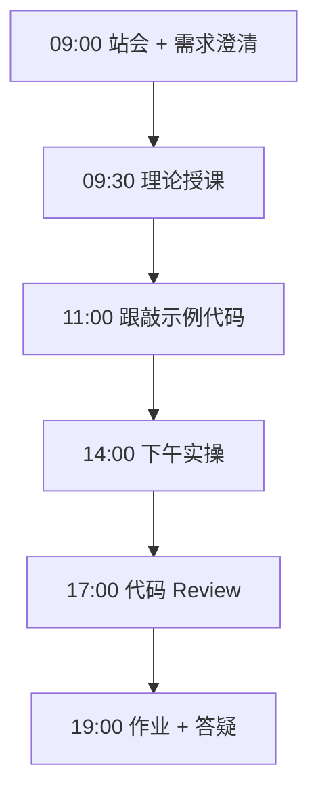
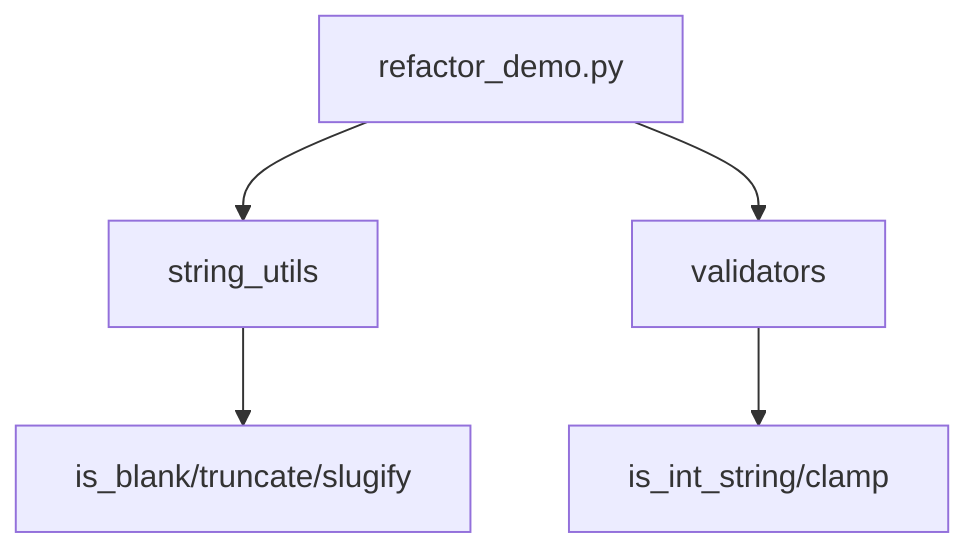

# Day 06：函数

> **阶段**：第一阶段:Python编程基础 | **Epic**：NEXUS-E1 | **预计学时**：6-8 小时

## 旁白解读：今日上下文

> 🎬 **模拟站会 09:00** — 智链科技 Nexus 项目组

**陈工**：Week1 前半段你们写了不少「能跑」的代码，今天专门治「乱」。函数不仅是语法，是团队分工的边界。Jira D06 要求把校验、字符串处理从业务脚本里撕出来。

**林悦**：产品不关心你几个文件，但关心改手机号校验规则时要不要改三个脚本。抽函数就是降低变更成本。

**小张**：`*args` 和 `**kwargs` 什么时候用？

**陈工**：需要透传或可变参数时用，别滥用。下午 `build_user_record(**fields)` 是典型配置型 API。每个函数加 docstring，参数含义写清楚，Code Review 省一半口水。明天 Week1 收官，把函数、dict、JSON、列表全串进通讯录项目。


**今日在 NexusAgent 主线中的位置**：validators 模块将并入 platform 输入校验层

**今日 Jira 看板**：
- `NEXUS-E1-D06-S01`
- `NEXUS-E1-D06-S02`
- `NEXUS-E1-D06-S03`

---


## 需求文档（产品林悦下发）

**文档编号**：PRD-NEXUS-D06  
**版本**：v1.0  
**优先级**：P0

### 背景

第一阶段:Python编程基础阶段第 6 天教学任务，与 NexusAgent 主线项目对齐。

### User Stories

### NEXUS-E1-D06-S01

**描述**：函数 相关交付

**验收标准**：
- [ ] 代码可本地运行
- [ ] 通过 `scripts/verify_day.py --day 6`

### NEXUS-E1-D06-S02

**描述**：函数 相关交付

**验收标准**：
- [ ] 代码可本地运行
- [ ] 通过 `scripts/verify_day.py --day 6`

### NEXUS-E1-D06-S03

**描述**：函数 相关交付

**验收标准**：
- [ ] 代码可本地运行
- [ ] 通过 `scripts/verify_day.py --day 6`


---


## 今日课表

### 上午 09:00-12:00

- 09:00 站会：Review Day5 JSON 作业，讨论代码重复问题
- 09:30 函数定义、返回值、早返回 early return
- 10:30 默认参数、关键字参数、*args/**kwargs
- 11:00 作用域 LEGB 与命名空间预览

### 下午 14:00-17:30

- 14:00 从 menu_system 抽离 validators.py
- 15:00 编写 string_utils.py 单一职责函数
- 16:00 refactor_demo.py 组合调用与 docstring
- 17:00 Review：DRY 原则与函数长度控制

### 晚自习 19:00-21:00

- 19:00 作业：为 json_parser 抽取 io_utils
- 20:00 了解 lambda 适用边界
- 20:45 预习 Week1 综合项目 contact_manager

---


## 课堂笔记

### 核心知识点速查

| 序号 | 知识点 | 代码位置 |
|------|--------|----------|
| 1 | def 函数定义与 return | 见下午实操 |
| 2 | 位置参数与关键字参数 | 见下午实操 |
| 3 | 默认参数与可变默认陷阱 | 见下午实操 |
| 4 | *args 元组收集 | 见下午实操 |
| 5 | **kwargs 字典收集 | 见下午实操 |
| 6 | 类型注解 Callable | 见下午实操 |
| 7 | docstring 文档 | 见下午实操 |
| 8 | DRY 不要重复自己 | 见下午实操 |
| 9 | 单一职责原则 SRP | 见下午实操 |
| 10 | lambda 与高阶函数 | 见下午实操 |

### 今日流程图



### 架构示意图（当日目标）



---


## 实操代码清单

- `code/string_utils.py`
- `code/validators.py`
- `code/refactor_demo.py`

请按顺序创建并运行。每段代码均可直接复制到对应文件执行。

---

## 实验手册（分时段操作表）

### 实验步骤 1：09:30-10:30 理论

| 时间 | 动作 | 预期结果 | 失败处理 |
|------|------|----------|----------|
| +0min | 打开课件本节 | 看到需求与验收标准 | 检查是否拉取最新 `develop` 分支 |
| +10min | 创建/打开当日 `code/` 文件 | 文件路径与清单一致 | 对照「实操代码清单」 |
| +30min | 粘贴并运行第一个脚本 | 终端有正常输出无 Traceback | 见下方「排错手册」 |
| +60min | 完成全部文件并自测 | `python3` 运行通过 | 使用 `scripts/verify_day.py --day 6` |
| +90min | 提交 Git 并建 MR | MR 关联 Jira NEXUS-E1-D06-S01 | 按附录 Git 示例操作 |


### 实验步骤 2：10:30-12:00 跟敲

| 时间 | 动作 | 预期结果 | 失败处理 |
|------|------|----------|----------|
| +0min | 打开课件本节 | 看到需求与验收标准 | 检查是否拉取最新 `develop` 分支 |
| +10min | 创建/打开当日 `code/` 文件 | 文件路径与清单一致 | 对照「实操代码清单」 |
| +30min | 粘贴并运行第一个脚本 | 终端有正常输出无 Traceback | 见下方「排错手册」 |
| +60min | 完成全部文件并自测 | `python3` 运行通过 | 使用 `scripts/verify_day.py --day 6` |
| +90min | 提交 Git 并建 MR | MR 关联 Jira NEXUS-E1-D06-S01 | 按附录 Git 示例操作 |


### 实验步骤 3：14:00-15:30 实操

| 时间 | 动作 | 预期结果 | 失败处理 |
|------|------|----------|----------|
| +0min | 打开课件本节 | 看到需求与验收标准 | 检查是否拉取最新 `develop` 分支 |
| +10min | 创建/打开当日 `code/` 文件 | 文件路径与清单一致 | 对照「实操代码清单」 |
| +30min | 粘贴并运行第一个脚本 | 终端有正常输出无 Traceback | 见下方「排错手册」 |
| +60min | 完成全部文件并自测 | `python3` 运行通过 | 使用 `scripts/verify_day.py --day 6` |
| +90min | 提交 Git 并建 MR | MR 关联 Jira NEXUS-E1-D06-S01 | 按附录 Git 示例操作 |


### 实验步骤 4：15:30-17:00 联调

| 时间 | 动作 | 预期结果 | 失败处理 |
|------|------|----------|----------|
| +0min | 打开课件本节 | 看到需求与验收标准 | 检查是否拉取最新 `develop` 分支 |
| +10min | 创建/打开当日 `code/` 文件 | 文件路径与清单一致 | 对照「实操代码清单」 |
| +30min | 粘贴并运行第一个脚本 | 终端有正常输出无 Traceback | 见下方「排错手册」 |
| +60min | 完成全部文件并自测 | `python3` 运行通过 | 使用 `scripts/verify_day.py --day 6` |
| +90min | 提交 Git 并建 MR | MR 关联 Jira NEXUS-E1-D06-S01 | 按附录 Git 示例操作 |


### 实验步骤 5：19:00-20:30 作业

| 时间 | 动作 | 预期结果 | 失败处理 |
|------|------|----------|----------|
| +0min | 打开课件本节 | 看到需求与验收标准 | 检查是否拉取最新 `develop` 分支 |
| +10min | 创建/打开当日 `code/` 文件 | 文件路径与清单一致 | 对照「实操代码清单」 |
| +30min | 粘贴并运行第一个脚本 | 终端有正常输出无 Traceback | 见下方「排错手册」 |
| +60min | 完成全部文件并自测 | `python3` 运行通过 | 使用 `scripts/verify_day.py --day 6` |
| +90min | 提交 Git 并建 MR | MR 关联 Jira NEXUS-E1-D06-S01 | 按附录 Git 示例操作 |


### 排错手册（Day 6）

1. **`command not found: python3`** → 安装 Python 3.10+ 或使用 `py -3`（Windows）
2. **`ModuleNotFoundError`** → 确认当前目录、是否激活 venv、`pip install -r requirements.txt`（若当日有）
3. **`SyntaxError: invalid syntax`** → 检查上一行是否缺括号、引号是否中文
4. **`UnicodeDecodeError`** → 文件保存为 UTF-8，终端 `export PYTHONIOENCODING=utf-8`
5. **API 相关（Day12+）** → 检查 `.env` 中 Key，无 Key 时使用课件 MOCK 模式

---


## 逐步跟敲指南（完整源码与解析）

> 以下代码与 `code/` 目录完全一致，可直接复制。每段附行级说明。

### 文件：`code/string_utils.py`

**操作步骤**：
1. 在 `courseware/day-06/code/` 下创建文件 `string_utils.py`
2. 完整粘贴下方代码
3. 在终端执行：`cd courseware/day-06/code && python3 string_utils.py`（若为包内模块则按课件说明）

```python
#!/usr/bin/env python3
# -*- coding: utf-8 -*-
"""字符串工具模块 — 供重构演示的原始实现片段。"""
from __future__ import annotations

import re


def is_blank(text: str) -> bool:
    return text.strip() == ""


def truncate(text: str, max_len: int, suffix: str = "...") -> str:
    if len(text) <= max_len:
        return text
    return text[: max_len - len(suffix)] + suffix


def slugify(text: str) -> str:
    text = text.strip().lower()
    text = re.sub(r"[^\w\s-]", "", text)
    text = re.sub(r"[-\s]+", "-", text)
    return text.strip("-")

```

**解析要点（`string_utils.py`）**：

- 共 **23** 行，请逐行阅读注释中的中文说明

- 运行前确认 Python 版本 ≥ 3.10：`python3 --version`

- 若报错，先检查缩进是否为 4 空格，勿混用 Tab

- 企业 Review 清单：命名是否清晰、是否有异常处理、是否可复用

---

### 文件：`code/validators.py`

**操作步骤**：
1. 在 `courseware/day-06/code/` 下创建文件 `validators.py`
2. 完整粘贴下方代码
3. 在终端执行：`cd courseware/day-06/code && python3 validators.py`（若为包内模块则按课件说明）

```python
#!/usr/bin/env python3
# -*- coding: utf-8 -*-
"""校验工具 — 从菜单系统中抽离的输入验证逻辑。"""
from __future__ import annotations


def is_int_string(value: str) -> bool:
    value = value.strip()
    if value.startswith("-"):
        return value[1:].isdigit() if len(value) > 1 else False
    return value.isdigit()


def clamp(value: int, low: int, high: int) -> int:
    return max(low, min(high, value))


def require_non_empty(value: str, field_name: str = "字段") -> str:
    cleaned = value.strip()
    if not cleaned:
        raise ValueError(f"{field_name}不能为空")
    return cleaned

```

**解析要点（`validators.py`）**：

- 共 **22** 行，请逐行阅读注释中的中文说明

- 运行前确认 Python 版本 ≥ 3.10：`python3 --version`

- 若报错，先检查缩进是否为 4 空格，勿混用 Tab

- 企业 Review 清单：命名是否清晰、是否有异常处理、是否可复用

---

### 文件：`code/refactor_demo.py`

**操作步骤**：
1. 在 `courseware/day-06/code/` 下创建文件 `refactor_demo.py`
2. 完整粘贴下方代码
3. 在终端执行：`cd courseware/day-06/code && python3 refactor_demo.py`（若为包内模块则按课件说明）

```python
#!/usr/bin/env python3
# -*- coding: utf-8 -*-
"""
函数与重构综合演示 refactor_demo.py
展示：抽取函数、默认参数、*args/**kwargs、文档字符串
"""
from __future__ import annotations

from typing import Any, Callable

from string_utils import is_blank, slugify, truncate
from validators import clamp, is_int_string, require_non_empty


def greet(name: str, title: str = "同学") -> str:
    """生成问候语；title 为默认参数。"""
    safe_name = require_non_empty(name, "姓名")
    return f"你好，{title} {safe_name}！欢迎回到 NexusAgent 训练营。"


def apply_ops(values: list[int], *ops: Callable[[int], int]) -> list[int]:
    """对列表每个元素依次应用多个一元函数。"""
    result = list(values)
    for op in ops:
        result = [op(x) for x in result]
    return result


def build_user_record(**fields: Any) -> dict[str, Any]:
    """使用 **kwargs 构建用户记录字典。"""
    record = {"source": "bootcamp"}
    record.update(fields)
    return record


def format_profile(name: str, bio: str, max_bio: int = 80) -> str:
    """组合多个工具函数格式化个人简介。"""
    if is_blank(bio):
        bio = "（暂无简介）"
    short_bio = truncate(bio, max_bio)
    slug = slugify(name)
    return f"用户: {name} | slug: {slug} | 简介: {short_bio}"


def parse_menu_number(raw: str, low: int = 0, high: int = 9) -> int | None:
    """解析菜单数字输入，非法返回 None。"""
    if not is_int_string(raw):
        return None
    num = int(raw.strip())
    return clamp(num, low, high)


def demo() -> None:
    print(greet("张晓明"))
    print(greet("李雷", title="工程师"))
    doubled = apply_ops([1, 2, 3], lambda x: x * 2, lambda x: x + 1)
    print("apply_ops:", doubled)
    user = build_user_record(name="小王", role="学员", day=6)
    print("user record:", user)
    print(format_profile("Nexus Agent", "企业级智能体平台" * 5))
    print("menu parse:", parse_menu_number("42", 0, 9))


def main() -> None:
    demo()


if __name__ == "__main__":
    main()

```

**解析要点（`refactor_demo.py`）**：

- 共 **69** 行，请逐行阅读注释中的中文说明

- 运行前确认 Python 版本 ≥ 3.10：`python3 --version`

- 若报错，先检查缩进是否为 4 空格，勿混用 Tab

- 企业 Review 清单：命名是否清晰、是否有异常处理、是否可复用

---


### 深度讲解 1：def 函数定义与 return

在企业级 Python 开发与大模型应用工程中，**def 函数定义与 return** 是学员必须牢固掌握的基本功。智链科技 Nexus 项目组在 Day 6 的代码评审中，特别强调以下几点：

1. **为什么学**：def 函数定义与 return 直接服务于后续 NexusAgent 平台的 `NEXUS-E1` 模块。没有扎实的 def 函数定义与 return，Day 13 之后调用 API、解析 JSON、编写 Agent 工具函数时会出现大量低级错误。

2. **常见坑**：
   - 忽略输入类型校验，导致运行时 `TypeError`
   - 编码问题（Windows 默认 GBK vs UTF-8）
   - 复制粘贴时缩进错乱（Python 对缩进敏感）

3. **企业实践**：在 SmartLink 的 GitLab 仓库中，所有与 def 函数定义与 return 相关的代码必须经过 Ruff 静态检查；变量命名使用 `snake_case`，常量使用 `UPPER_SNAKE_CASE`。

4. **与主线项目的关系**：今日代码位于 `courseware/day-06/code/`，部分模块将逐步合并到 `platform/nexus_agent/`。请养成「每日代码皆可运行、皆可测试」的习惯。

5. **扩展阅读建议**：完成今日作业后，可阅读 `docs/project-master-plan.md` 中关于 NEXUS-E1 的章节，建立全局视角。

**课堂互动题**：请用 3 句话向非技术同事解释「def 函数定义与 return」是什么。写在作业 MR 的评论里，讲师会抽查点评。

**实操检查清单**：
- [ ] 能不看课件复述 def 函数定义与 return 的定义
- [ ] 能独立写出相关代码并运行
- [ ] 能向同学讲解一处容易写错的地方


### 深度讲解 2：位置参数与关键字参数

在企业级 Python 开发与大模型应用工程中，**位置参数与关键字参数** 是学员必须牢固掌握的基本功。智链科技 Nexus 项目组在 Day 6 的代码评审中，特别强调以下几点：

1. **为什么学**：位置参数与关键字参数 直接服务于后续 NexusAgent 平台的 `NEXUS-E1` 模块。没有扎实的 位置参数与关键字参数，Day 13 之后调用 API、解析 JSON、编写 Agent 工具函数时会出现大量低级错误。

2. **常见坑**：
   - 忽略输入类型校验，导致运行时 `TypeError`
   - 编码问题（Windows 默认 GBK vs UTF-8）
   - 复制粘贴时缩进错乱（Python 对缩进敏感）

3. **企业实践**：在 SmartLink 的 GitLab 仓库中，所有与 位置参数与关键字参数 相关的代码必须经过 Ruff 静态检查；变量命名使用 `snake_case`，常量使用 `UPPER_SNAKE_CASE`。

4. **与主线项目的关系**：今日代码位于 `courseware/day-06/code/`，部分模块将逐步合并到 `platform/nexus_agent/`。请养成「每日代码皆可运行、皆可测试」的习惯。

5. **扩展阅读建议**：完成今日作业后，可阅读 `docs/project-master-plan.md` 中关于 NEXUS-E1 的章节，建立全局视角。

**课堂互动题**：请用 3 句话向非技术同事解释「位置参数与关键字参数」是什么。写在作业 MR 的评论里，讲师会抽查点评。

**实操检查清单**：
- [ ] 能不看课件复述 位置参数与关键字参数 的定义
- [ ] 能独立写出相关代码并运行
- [ ] 能向同学讲解一处容易写错的地方


### 深度讲解 3：默认参数与可变默认陷阱

在企业级 Python 开发与大模型应用工程中，**默认参数与可变默认陷阱** 是学员必须牢固掌握的基本功。智链科技 Nexus 项目组在 Day 6 的代码评审中，特别强调以下几点：

1. **为什么学**：默认参数与可变默认陷阱 直接服务于后续 NexusAgent 平台的 `NEXUS-E1` 模块。没有扎实的 默认参数与可变默认陷阱，Day 13 之后调用 API、解析 JSON、编写 Agent 工具函数时会出现大量低级错误。

2. **常见坑**：
   - 忽略输入类型校验，导致运行时 `TypeError`
   - 编码问题（Windows 默认 GBK vs UTF-8）
   - 复制粘贴时缩进错乱（Python 对缩进敏感）

3. **企业实践**：在 SmartLink 的 GitLab 仓库中，所有与 默认参数与可变默认陷阱 相关的代码必须经过 Ruff 静态检查；变量命名使用 `snake_case`，常量使用 `UPPER_SNAKE_CASE`。

4. **与主线项目的关系**：今日代码位于 `courseware/day-06/code/`，部分模块将逐步合并到 `platform/nexus_agent/`。请养成「每日代码皆可运行、皆可测试」的习惯。

5. **扩展阅读建议**：完成今日作业后，可阅读 `docs/project-master-plan.md` 中关于 NEXUS-E1 的章节，建立全局视角。

**课堂互动题**：请用 3 句话向非技术同事解释「默认参数与可变默认陷阱」是什么。写在作业 MR 的评论里，讲师会抽查点评。

**实操检查清单**：
- [ ] 能不看课件复述 默认参数与可变默认陷阱 的定义
- [ ] 能独立写出相关代码并运行
- [ ] 能向同学讲解一处容易写错的地方


### 深度讲解 4：*args 元组收集

在企业级 Python 开发与大模型应用工程中，***args 元组收集** 是学员必须牢固掌握的基本功。智链科技 Nexus 项目组在 Day 6 的代码评审中，特别强调以下几点：

1. **为什么学**：*args 元组收集 直接服务于后续 NexusAgent 平台的 `NEXUS-E1` 模块。没有扎实的 *args 元组收集，Day 13 之后调用 API、解析 JSON、编写 Agent 工具函数时会出现大量低级错误。

2. **常见坑**：
   - 忽略输入类型校验，导致运行时 `TypeError`
   - 编码问题（Windows 默认 GBK vs UTF-8）
   - 复制粘贴时缩进错乱（Python 对缩进敏感）

3. **企业实践**：在 SmartLink 的 GitLab 仓库中，所有与 *args 元组收集 相关的代码必须经过 Ruff 静态检查；变量命名使用 `snake_case`，常量使用 `UPPER_SNAKE_CASE`。

4. **与主线项目的关系**：今日代码位于 `courseware/day-06/code/`，部分模块将逐步合并到 `platform/nexus_agent/`。请养成「每日代码皆可运行、皆可测试」的习惯。

5. **扩展阅读建议**：完成今日作业后，可阅读 `docs/project-master-plan.md` 中关于 NEXUS-E1 的章节，建立全局视角。

**课堂互动题**：请用 3 句话向非技术同事解释「*args 元组收集」是什么。写在作业 MR 的评论里，讲师会抽查点评。

**实操检查清单**：
- [ ] 能不看课件复述 *args 元组收集 的定义
- [ ] 能独立写出相关代码并运行
- [ ] 能向同学讲解一处容易写错的地方


### 深度讲解 5：**kwargs 字典收集

在企业级 Python 开发与大模型应用工程中，****kwargs 字典收集** 是学员必须牢固掌握的基本功。智链科技 Nexus 项目组在 Day 6 的代码评审中，特别强调以下几点：

1. **为什么学**：**kwargs 字典收集 直接服务于后续 NexusAgent 平台的 `NEXUS-E1` 模块。没有扎实的 **kwargs 字典收集，Day 13 之后调用 API、解析 JSON、编写 Agent 工具函数时会出现大量低级错误。

2. **常见坑**：
   - 忽略输入类型校验，导致运行时 `TypeError`
   - 编码问题（Windows 默认 GBK vs UTF-8）
   - 复制粘贴时缩进错乱（Python 对缩进敏感）

3. **企业实践**：在 SmartLink 的 GitLab 仓库中，所有与 **kwargs 字典收集 相关的代码必须经过 Ruff 静态检查；变量命名使用 `snake_case`，常量使用 `UPPER_SNAKE_CASE`。

4. **与主线项目的关系**：今日代码位于 `courseware/day-06/code/`，部分模块将逐步合并到 `platform/nexus_agent/`。请养成「每日代码皆可运行、皆可测试」的习惯。

5. **扩展阅读建议**：完成今日作业后，可阅读 `docs/project-master-plan.md` 中关于 NEXUS-E1 的章节，建立全局视角。

**课堂互动题**：请用 3 句话向非技术同事解释「**kwargs 字典收集」是什么。写在作业 MR 的评论里，讲师会抽查点评。

**实操检查清单**：
- [ ] 能不看课件复述 **kwargs 字典收集 的定义
- [ ] 能独立写出相关代码并运行
- [ ] 能向同学讲解一处容易写错的地方


### 深度讲解 6：类型注解 Callable

在企业级 Python 开发与大模型应用工程中，**类型注解 Callable** 是学员必须牢固掌握的基本功。智链科技 Nexus 项目组在 Day 6 的代码评审中，特别强调以下几点：

1. **为什么学**：类型注解 Callable 直接服务于后续 NexusAgent 平台的 `NEXUS-E1` 模块。没有扎实的 类型注解 Callable，Day 13 之后调用 API、解析 JSON、编写 Agent 工具函数时会出现大量低级错误。

2. **常见坑**：
   - 忽略输入类型校验，导致运行时 `TypeError`
   - 编码问题（Windows 默认 GBK vs UTF-8）
   - 复制粘贴时缩进错乱（Python 对缩进敏感）

3. **企业实践**：在 SmartLink 的 GitLab 仓库中，所有与 类型注解 Callable 相关的代码必须经过 Ruff 静态检查；变量命名使用 `snake_case`，常量使用 `UPPER_SNAKE_CASE`。

4. **与主线项目的关系**：今日代码位于 `courseware/day-06/code/`，部分模块将逐步合并到 `platform/nexus_agent/`。请养成「每日代码皆可运行、皆可测试」的习惯。

5. **扩展阅读建议**：完成今日作业后，可阅读 `docs/project-master-plan.md` 中关于 NEXUS-E1 的章节，建立全局视角。

**课堂互动题**：请用 3 句话向非技术同事解释「类型注解 Callable」是什么。写在作业 MR 的评论里，讲师会抽查点评。

**实操检查清单**：
- [ ] 能不看课件复述 类型注解 Callable 的定义
- [ ] 能独立写出相关代码并运行
- [ ] 能向同学讲解一处容易写错的地方


### 深度讲解 7：docstring 文档

在企业级 Python 开发与大模型应用工程中，**docstring 文档** 是学员必须牢固掌握的基本功。智链科技 Nexus 项目组在 Day 6 的代码评审中，特别强调以下几点：

1. **为什么学**：docstring 文档 直接服务于后续 NexusAgent 平台的 `NEXUS-E1` 模块。没有扎实的 docstring 文档，Day 13 之后调用 API、解析 JSON、编写 Agent 工具函数时会出现大量低级错误。

2. **常见坑**：
   - 忽略输入类型校验，导致运行时 `TypeError`
   - 编码问题（Windows 默认 GBK vs UTF-8）
   - 复制粘贴时缩进错乱（Python 对缩进敏感）

3. **企业实践**：在 SmartLink 的 GitLab 仓库中，所有与 docstring 文档 相关的代码必须经过 Ruff 静态检查；变量命名使用 `snake_case`，常量使用 `UPPER_SNAKE_CASE`。

4. **与主线项目的关系**：今日代码位于 `courseware/day-06/code/`，部分模块将逐步合并到 `platform/nexus_agent/`。请养成「每日代码皆可运行、皆可测试」的习惯。

5. **扩展阅读建议**：完成今日作业后，可阅读 `docs/project-master-plan.md` 中关于 NEXUS-E1 的章节，建立全局视角。

**课堂互动题**：请用 3 句话向非技术同事解释「docstring 文档」是什么。写在作业 MR 的评论里，讲师会抽查点评。

**实操检查清单**：
- [ ] 能不看课件复述 docstring 文档 的定义
- [ ] 能独立写出相关代码并运行
- [ ] 能向同学讲解一处容易写错的地方


### 深度讲解 8：DRY 不要重复自己

在企业级 Python 开发与大模型应用工程中，**DRY 不要重复自己** 是学员必须牢固掌握的基本功。智链科技 Nexus 项目组在 Day 6 的代码评审中，特别强调以下几点：

1. **为什么学**：DRY 不要重复自己 直接服务于后续 NexusAgent 平台的 `NEXUS-E1` 模块。没有扎实的 DRY 不要重复自己，Day 13 之后调用 API、解析 JSON、编写 Agent 工具函数时会出现大量低级错误。

2. **常见坑**：
   - 忽略输入类型校验，导致运行时 `TypeError`
   - 编码问题（Windows 默认 GBK vs UTF-8）
   - 复制粘贴时缩进错乱（Python 对缩进敏感）

3. **企业实践**：在 SmartLink 的 GitLab 仓库中，所有与 DRY 不要重复自己 相关的代码必须经过 Ruff 静态检查；变量命名使用 `snake_case`，常量使用 `UPPER_SNAKE_CASE`。

4. **与主线项目的关系**：今日代码位于 `courseware/day-06/code/`，部分模块将逐步合并到 `platform/nexus_agent/`。请养成「每日代码皆可运行、皆可测试」的习惯。

5. **扩展阅读建议**：完成今日作业后，可阅读 `docs/project-master-plan.md` 中关于 NEXUS-E1 的章节，建立全局视角。

**课堂互动题**：请用 3 句话向非技术同事解释「DRY 不要重复自己」是什么。写在作业 MR 的评论里，讲师会抽查点评。

**实操检查清单**：
- [ ] 能不看课件复述 DRY 不要重复自己 的定义
- [ ] 能独立写出相关代码并运行
- [ ] 能向同学讲解一处容易写错的地方


### 深度讲解 9：单一职责原则 SRP

在企业级 Python 开发与大模型应用工程中，**单一职责原则 SRP** 是学员必须牢固掌握的基本功。智链科技 Nexus 项目组在 Day 6 的代码评审中，特别强调以下几点：

1. **为什么学**：单一职责原则 SRP 直接服务于后续 NexusAgent 平台的 `NEXUS-E1` 模块。没有扎实的 单一职责原则 SRP，Day 13 之后调用 API、解析 JSON、编写 Agent 工具函数时会出现大量低级错误。

2. **常见坑**：
   - 忽略输入类型校验，导致运行时 `TypeError`
   - 编码问题（Windows 默认 GBK vs UTF-8）
   - 复制粘贴时缩进错乱（Python 对缩进敏感）

3. **企业实践**：在 SmartLink 的 GitLab 仓库中，所有与 单一职责原则 SRP 相关的代码必须经过 Ruff 静态检查；变量命名使用 `snake_case`，常量使用 `UPPER_SNAKE_CASE`。

4. **与主线项目的关系**：今日代码位于 `courseware/day-06/code/`，部分模块将逐步合并到 `platform/nexus_agent/`。请养成「每日代码皆可运行、皆可测试」的习惯。

5. **扩展阅读建议**：完成今日作业后，可阅读 `docs/project-master-plan.md` 中关于 NEXUS-E1 的章节，建立全局视角。

**课堂互动题**：请用 3 句话向非技术同事解释「单一职责原则 SRP」是什么。写在作业 MR 的评论里，讲师会抽查点评。

**实操检查清单**：
- [ ] 能不看课件复述 单一职责原则 SRP 的定义
- [ ] 能独立写出相关代码并运行
- [ ] 能向同学讲解一处容易写错的地方


### 深度讲解 10：lambda 与高阶函数

在企业级 Python 开发与大模型应用工程中，**lambda 与高阶函数** 是学员必须牢固掌握的基本功。智链科技 Nexus 项目组在 Day 6 的代码评审中，特别强调以下几点：

1. **为什么学**：lambda 与高阶函数 直接服务于后续 NexusAgent 平台的 `NEXUS-E1` 模块。没有扎实的 lambda 与高阶函数，Day 13 之后调用 API、解析 JSON、编写 Agent 工具函数时会出现大量低级错误。

2. **常见坑**：
   - 忽略输入类型校验，导致运行时 `TypeError`
   - 编码问题（Windows 默认 GBK vs UTF-8）
   - 复制粘贴时缩进错乱（Python 对缩进敏感）

3. **企业实践**：在 SmartLink 的 GitLab 仓库中，所有与 lambda 与高阶函数 相关的代码必须经过 Ruff 静态检查；变量命名使用 `snake_case`，常量使用 `UPPER_SNAKE_CASE`。

4. **与主线项目的关系**：今日代码位于 `courseware/day-06/code/`，部分模块将逐步合并到 `platform/nexus_agent/`。请养成「每日代码皆可运行、皆可测试」的习惯。

5. **扩展阅读建议**：完成今日作业后，可阅读 `docs/project-master-plan.md` 中关于 NEXUS-E1 的章节，建立全局视角。

**课堂互动题**：请用 3 句话向非技术同事解释「lambda 与高阶函数」是什么。写在作业 MR 的评论里，讲师会抽查点评。

**实操检查清单**：
- [ ] 能不看课件复述 lambda 与高阶函数 的定义
- [ ] 能独立写出相关代码并运行
- [ ] 能向同学讲解一处容易写错的地方


## 阶段复盘锚点（第一阶段:Python编程基础）

今天是 **第一阶段:Python编程基础** 的第 **6** 个学习日。请回顾：

- 昨天学了什么？今天如何承接？
- 今天的内容在 70 天路线图中的坐标？
- 如果我是 Tech Lead，会如何 Review 今日代码？

**陈工寄语**：慢即是快。企业里没人关心你一天学了多少个语法点，只关心你写的脚本能不能在服务器上稳定跑 7×24 小时。今天把地基打牢，后面 Agent 编排、RAG 检索才不会塌。

**林悦补充**：产品侧只验收「用户能感知到的价值」。今日交付虽然简单，但「个人信息卡片」本质是后续「用户画像 Agent」的数据采集原型——字段设计请认真思考。

**代码量统计（累计）**：完成今日后，个人仓库累计约 **8400** 行（含注释与测试），全营目标 10 万行。

**明日预告**：请提前阅读 `courseware/day-07/README.md` 开头的旁白，了解上下文。


## 常见问题 FAQ（讲师答疑实录）


**Q1：学习「def 函数定义与 return」时最常问的问题是什么？**

A：学员常问「这在大模型开发里到底用在哪里」。直接回答：在 NexusAgent 的 `NEXUS-E1` 中，def 函数定义与 return 用于支撑「函数」这一交付。建议你打开 `platform/` 对照看未来模块如何引用今日写法。另一个常见问题是「要不要背语法」——不需要背，但要能写出可运行代码，并能在报错时读懂 Traceback。

**追问**：如果线上报错与 def 函数定义与 return 相关，如何排查？  
**答**：① 复现 ② 最小化输入 ③ 打印中间变量 ④ 查 GitLab 历史 diff ⑤ 在 Jira 建 Bug 单附上日志。


**Q2：学习「位置参数与关键字参数」时最常问的问题是什么？**

A：学员常问「这在大模型开发里到底用在哪里」。直接回答：在 NexusAgent 的 `NEXUS-E1` 中，位置参数与关键字参数 用于支撑「函数」这一交付。建议你打开 `platform/` 对照看未来模块如何引用今日写法。另一个常见问题是「要不要背语法」——不需要背，但要能写出可运行代码，并能在报错时读懂 Traceback。

**追问**：如果线上报错与 位置参数与关键字参数 相关，如何排查？  
**答**：① 复现 ② 最小化输入 ③ 打印中间变量 ④ 查 GitLab 历史 diff ⑤ 在 Jira 建 Bug 单附上日志。


**Q3：学习「默认参数与可变默认陷阱」时最常问的问题是什么？**

A：学员常问「这在大模型开发里到底用在哪里」。直接回答：在 NexusAgent 的 `NEXUS-E1` 中，默认参数与可变默认陷阱 用于支撑「函数」这一交付。建议你打开 `platform/` 对照看未来模块如何引用今日写法。另一个常见问题是「要不要背语法」——不需要背，但要能写出可运行代码，并能在报错时读懂 Traceback。

**追问**：如果线上报错与 默认参数与可变默认陷阱 相关，如何排查？  
**答**：① 复现 ② 最小化输入 ③ 打印中间变量 ④ 查 GitLab 历史 diff ⑤ 在 Jira 建 Bug 单附上日志。


**Q4：学习「*args 元组收集」时最常问的问题是什么？**

A：学员常问「这在大模型开发里到底用在哪里」。直接回答：在 NexusAgent 的 `NEXUS-E1` 中，*args 元组收集 用于支撑「函数」这一交付。建议你打开 `platform/` 对照看未来模块如何引用今日写法。另一个常见问题是「要不要背语法」——不需要背，但要能写出可运行代码，并能在报错时读懂 Traceback。

**追问**：如果线上报错与 *args 元组收集 相关，如何排查？  
**答**：① 复现 ② 最小化输入 ③ 打印中间变量 ④ 查 GitLab 历史 diff ⑤ 在 Jira 建 Bug 单附上日志。


**Q5：学习「**kwargs 字典收集」时最常问的问题是什么？**

A：学员常问「这在大模型开发里到底用在哪里」。直接回答：在 NexusAgent 的 `NEXUS-E1` 中，**kwargs 字典收集 用于支撑「函数」这一交付。建议你打开 `platform/` 对照看未来模块如何引用今日写法。另一个常见问题是「要不要背语法」——不需要背，但要能写出可运行代码，并能在报错时读懂 Traceback。

**追问**：如果线上报错与 **kwargs 字典收集 相关，如何排查？  
**答**：① 复现 ② 最小化输入 ③ 打印中间变量 ④ 查 GitLab 历史 diff ⑤ 在 Jira 建 Bug 单附上日志。


**Q6：学习「类型注解 Callable」时最常问的问题是什么？**

A：学员常问「这在大模型开发里到底用在哪里」。直接回答：在 NexusAgent 的 `NEXUS-E1` 中，类型注解 Callable 用于支撑「函数」这一交付。建议你打开 `platform/` 对照看未来模块如何引用今日写法。另一个常见问题是「要不要背语法」——不需要背，但要能写出可运行代码，并能在报错时读懂 Traceback。

**追问**：如果线上报错与 类型注解 Callable 相关，如何排查？  
**答**：① 复现 ② 最小化输入 ③ 打印中间变量 ④ 查 GitLab 历史 diff ⑤ 在 Jira 建 Bug 单附上日志。


**Q7：学习「docstring 文档」时最常问的问题是什么？**

A：学员常问「这在大模型开发里到底用在哪里」。直接回答：在 NexusAgent 的 `NEXUS-E1` 中，docstring 文档 用于支撑「函数」这一交付。建议你打开 `platform/` 对照看未来模块如何引用今日写法。另一个常见问题是「要不要背语法」——不需要背，但要能写出可运行代码，并能在报错时读懂 Traceback。

**追问**：如果线上报错与 docstring 文档 相关，如何排查？  
**答**：① 复现 ② 最小化输入 ③ 打印中间变量 ④ 查 GitLab 历史 diff ⑤ 在 Jira 建 Bug 单附上日志。


**Q8：学习「DRY 不要重复自己」时最常问的问题是什么？**

A：学员常问「这在大模型开发里到底用在哪里」。直接回答：在 NexusAgent 的 `NEXUS-E1` 中，DRY 不要重复自己 用于支撑「函数」这一交付。建议你打开 `platform/` 对照看未来模块如何引用今日写法。另一个常见问题是「要不要背语法」——不需要背，但要能写出可运行代码，并能在报错时读懂 Traceback。

**追问**：如果线上报错与 DRY 不要重复自己 相关，如何排查？  
**答**：① 复现 ② 最小化输入 ③ 打印中间变量 ④ 查 GitLab 历史 diff ⑤ 在 Jira 建 Bug 单附上日志。


**Q9：学习「单一职责原则 SRP」时最常问的问题是什么？**

A：学员常问「这在大模型开发里到底用在哪里」。直接回答：在 NexusAgent 的 `NEXUS-E1` 中，单一职责原则 SRP 用于支撑「函数」这一交付。建议你打开 `platform/` 对照看未来模块如何引用今日写法。另一个常见问题是「要不要背语法」——不需要背，但要能写出可运行代码，并能在报错时读懂 Traceback。

**追问**：如果线上报错与 单一职责原则 SRP 相关，如何排查？  
**答**：① 复现 ② 最小化输入 ③ 打印中间变量 ④ 查 GitLab 历史 diff ⑤ 在 Jira 建 Bug 单附上日志。


**Q10：学习「lambda 与高阶函数」时最常问的问题是什么？**

A：学员常问「这在大模型开发里到底用在哪里」。直接回答：在 NexusAgent 的 `NEXUS-E1` 中，lambda 与高阶函数 用于支撑「函数」这一交付。建议你打开 `platform/` 对照看未来模块如何引用今日写法。另一个常见问题是「要不要背语法」——不需要背，但要能写出可运行代码，并能在报错时读懂 Traceback。

**追问**：如果线上报错与 lambda 与高阶函数 相关，如何排查？  
**答**：① 复现 ② 最小化输入 ③ 打印中间变量 ④ 查 GitLab 历史 diff ⑤ 在 Jira 建 Bug 单附上日志。


## 面试押题（与今日知识点挂钩）

以下题目会出现在 Day 67-69 模拟面试中，建议今日就开始积累答案：

1. **def 函数定义与 return**：请结合 NexusAgent 项目举例说明你在哪一天、哪段代码里用到了它？
2. **位置参数与关键字参数**：请结合 NexusAgent 项目举例说明你在哪一天、哪段代码里用到了它？
3. **默认参数与可变默认陷阱**：请结合 NexusAgent 项目举例说明你在哪一天、哪段代码里用到了它？
4. ***args 元组收集**：请结合 NexusAgent 项目举例说明你在哪一天、哪段代码里用到了它？
5. ****kwargs 字典收集**：请结合 NexusAgent 项目举例说明你在哪一天、哪段代码里用到了它？
6. **类型注解 Callable**：请结合 NexusAgent 项目举例说明你在哪一天、哪段代码里用到了它？

**参考答案思路**：采用 STAR 法则（情境-任务-行动-结果），引用 `courseware/day-06/code/` 中的具体文件名与函数名。

---


## Code Review 检查表（陈工版）

合并 MR 前自查：

- [ ] 所有新增 `.py` 文件顶部有模块说明 docstring
- [ ] 无硬编码密钥（API Key 走环境变量）
- [ ] 函数长度 < 50 行，过长则拆分
- [ ] 异常有明确提示，禁止裸 `except:`
- [ ] 提交信息符合 `feat(day-06): ...`
- [ ] README 或注释说明如何运行
- [ ] 与 Jira Story 验收标准逐条对应

**今日重点审查项**：函数 相关逻辑是否可读、可测、可扩展至 `platform/nexus_agent/`。

---


## 课后作业

### 作业说明

**作业：抽取 io_utils 模块**

1. 从 Day5 `json_parser` 抽出 `load_json_file` / `save_json_file` 到 `homework/io_utils.py`
2. 新增 `load_json_or_none(path)` 失败返回 None 并打印警告
3. `homework/test_io.py` 调用并断言往返一致
4. 原 json_parser 改为 from io_utils import ...（若在本目录运行需说明 PYTHONPATH）


### 提交要求

1. 代码提交到分支 `feature/day-06-homework`
2. GitLab MR 标题：`[Day-06] homework: 课后作业`
3. 在 MR 描述中附上运行截图或终端输出

### 评分标准（满分 100）

| 项 | 分值 |
|----|------|
| 功能完整 | 40 |
| 代码规范与注释 | 30 |
| 异常处理 | 15 |
| MR 与 Jira 关联 | 15 |

---

## 作业参考答案

> ⚠️ 请先独立完成再对照答案

```python
# homework/io_utils.py
import json
from pathlib import Path
from typing import Any

def load_json_file(path: Path) -> Any:
  return json.loads(path.read_text(encoding="utf-8"))

def save_json_file(path: Path, data: Any) -> None:
  path.parent.mkdir(parents=True, exist_ok=True)
  path.write_text(json.dumps(data, ensure_ascii=False, indent=2) + "\n", encoding="utf-8")

def load_json_or_none(path: Path) -> Any | None:
  try:
    return load_json_file(path)
  except (OSError, json.JSONDecodeError) as exc:
    print(f"[warn] 无法加载 {path}: {exc}")
    return None
```


---


## 附录：Git 提交示例

```bash
git checkout develop
git pull origin develop
git checkout -b feature/day-06-函数
# 完成代码后
git add courseware/day-06/
git commit -m "feat(day-06): 函数"
git push -u origin feature/day-06-函数
```

---

*课件版本 Day-06-v1.0 | 智链科技培训中心*
