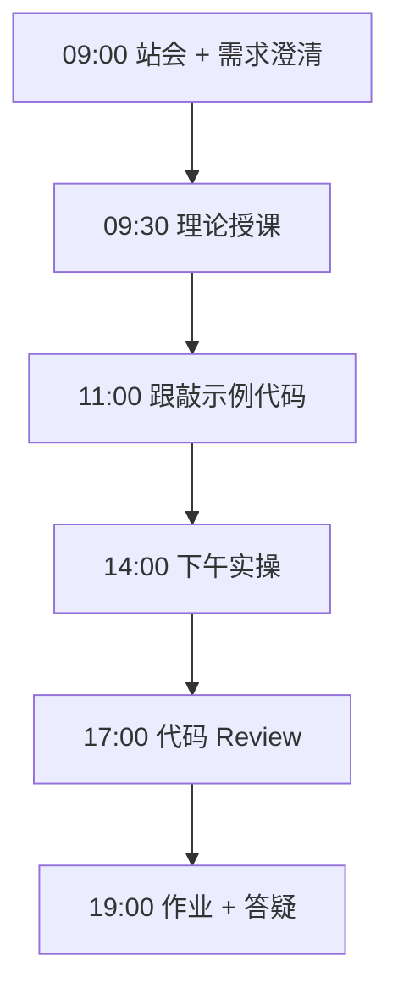
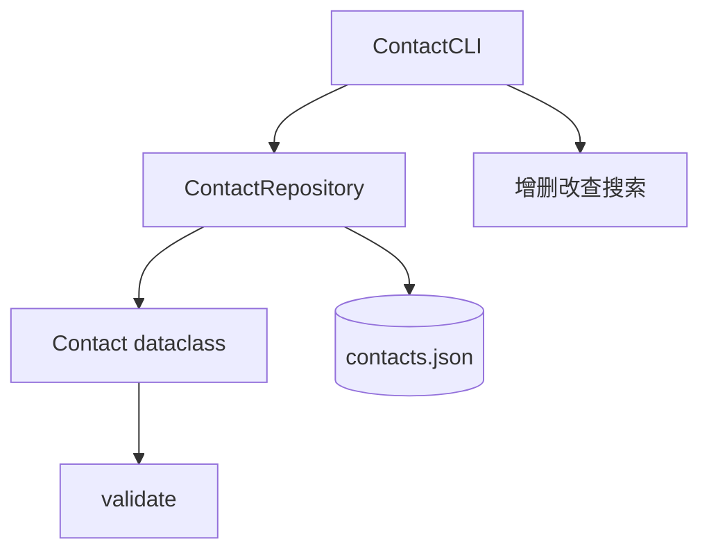

# Day 07：周复习

> **阶段**：第一阶段:Python编程基础 | **Epic**：NEXUS-E1 | **预计学时**：6-8 小时

## 旁白解读：今日上下文

> 🎬 **模拟站会 09:00** — 智链科技 Nexus 项目组

**陈工**：Week1 最后一天，不上新语法，把前六天全部串起来。通讯录项目是迷你版 NexusAgent 用户管理：有实体、有仓储、有界面。上午讲完三层，下午必须能演示「添加 → 落盘 → 重启还在」。

**林悦**：验收标准我再说一遍：CRUD 完整、JSON 持久化、搜索能用、输入有错要提示人不能崩。这就是用户能感知的企业级质感。

**全班**：Day1 还不会装 Python，今天已经写 CRUD 了？

**陈工**：慢即是快。下周开始文件、异常、面向对象加深，再往后就是真 API 了。今晚作业加 CSV 导出，用标准库 csv 模块，别手写逗号——那是经典踩坑题。Week1 总结 MR 明早十点前交，我看谁把注释和异常处理偷懒了。


**今日在 NexusAgent 主线中的位置**：contact_manager 是 NexusAgent 用户模块的教学替身

**今日 Jira 看板**：
- `NEXUS-E1-D07-S01`
- `NEXUS-E1-D07-S02`

---


## 需求文档（产品林悦下发）

**文档编号**：PRD-NEXUS-D07  
**版本**：v1.0  
**优先级**：P0

### 背景

第一阶段:Python编程基础阶段第 7 天教学任务，与 NexusAgent 主线项目对齐。

### User Stories

### NEXUS-E1-D07-S01

**描述**：周复习 相关交付

**验收标准**：
- [ ] 代码可本地运行
- [ ] 通过 `scripts/verify_day.py --day 7`

### NEXUS-E1-D07-S02

**描述**：周复习 相关交付

**验收标准**：
- [ ] 代码可本地运行
- [ ] 通过 `scripts/verify_day.py --day 7`


---


## 今日课表

### 上午 09:00-12:00

- 09:00 Week1 复盘站会：知识点速查测验（口头）
- 09:30 综合项目需求评审：通讯录 CRUD
- 10:30 架构讲解：Entity / Repository / CLI 三层
- 11:00 跟敲 contact_manager 数据模型与持久化

### 下午 14:00-17:30

- 14:00 完成 CLI 菜单与五项操作
- 15:30 联调：增删改查 + 搜索 + 异常处理
- 16:30 代码 Review：与 Day1-6 代码风格对齐
- 17:00 合并 feature/week1-capstone 分支演示

### 晚自习 19:00-21:00

- 19:00 提交 Week1 总结 MR（模板由讲师提供）
- 20:00 预习 Day8 文件操作与异常体系
- 20:30 自习：修补本周薄弱点

---


## 课堂笔记

### 核心知识点速查

| 序号 | 知识点 | 代码位置 |
|------|--------|----------|
| 1 | Week1 知识体系串联复盘 | 见下午实操 |
| 2 | dataclass 与 asdict 序列化 | 见下午实操 |
| 3 | Repository 仓储模式 | 见下午实操 |
| 4 | CRUD 完整生命周期 | 见下午实操 |
| 5 | JSON 文件持久化 | 见下午实操 |
| 6 | CLI 菜单与动作分发 | 见下午实操 |
| 7 | 输入校验与 ValueError | 见下午实操 |
| 8 | search 过滤与 any 生成器 | 见下午实操 |
| 9 | KeyboardInterrupt 安全保存 | 见下午实操 |
| 10 | 三层架构 Entity-Repo-UI | 见下午实操 |

### 今日流程图



### 架构示意图（当日目标）



---


## 实操代码清单

- `code/contact_manager.py`

请按顺序创建并运行。每段代码均可直接复制到对应文件执行。

---

## 实验手册（分时段操作表）

### 实验步骤 1：09:30-10:30 理论

| 时间 | 动作 | 预期结果 | 失败处理 |
|------|------|----------|----------|
| +0min | 打开课件本节 | 看到需求与验收标准 | 检查是否拉取最新 `develop` 分支 |
| +10min | 创建/打开当日 `code/` 文件 | 文件路径与清单一致 | 对照「实操代码清单」 |
| +30min | 粘贴并运行第一个脚本 | 终端有正常输出无 Traceback | 见下方「排错手册」 |
| +60min | 完成全部文件并自测 | `python3` 运行通过 | 使用 `scripts/verify_day.py --day 7` |
| +90min | 提交 Git 并建 MR | MR 关联 Jira NEXUS-E1-D07-S01 | 按附录 Git 示例操作 |


### 实验步骤 2：10:30-12:00 跟敲

| 时间 | 动作 | 预期结果 | 失败处理 |
|------|------|----------|----------|
| +0min | 打开课件本节 | 看到需求与验收标准 | 检查是否拉取最新 `develop` 分支 |
| +10min | 创建/打开当日 `code/` 文件 | 文件路径与清单一致 | 对照「实操代码清单」 |
| +30min | 粘贴并运行第一个脚本 | 终端有正常输出无 Traceback | 见下方「排错手册」 |
| +60min | 完成全部文件并自测 | `python3` 运行通过 | 使用 `scripts/verify_day.py --day 7` |
| +90min | 提交 Git 并建 MR | MR 关联 Jira NEXUS-E1-D07-S01 | 按附录 Git 示例操作 |


### 实验步骤 3：14:00-15:30 实操

| 时间 | 动作 | 预期结果 | 失败处理 |
|------|------|----------|----------|
| +0min | 打开课件本节 | 看到需求与验收标准 | 检查是否拉取最新 `develop` 分支 |
| +10min | 创建/打开当日 `code/` 文件 | 文件路径与清单一致 | 对照「实操代码清单」 |
| +30min | 粘贴并运行第一个脚本 | 终端有正常输出无 Traceback | 见下方「排错手册」 |
| +60min | 完成全部文件并自测 | `python3` 运行通过 | 使用 `scripts/verify_day.py --day 7` |
| +90min | 提交 Git 并建 MR | MR 关联 Jira NEXUS-E1-D07-S01 | 按附录 Git 示例操作 |


### 实验步骤 4：15:30-17:00 联调

| 时间 | 动作 | 预期结果 | 失败处理 |
|------|------|----------|----------|
| +0min | 打开课件本节 | 看到需求与验收标准 | 检查是否拉取最新 `develop` 分支 |
| +10min | 创建/打开当日 `code/` 文件 | 文件路径与清单一致 | 对照「实操代码清单」 |
| +30min | 粘贴并运行第一个脚本 | 终端有正常输出无 Traceback | 见下方「排错手册」 |
| +60min | 完成全部文件并自测 | `python3` 运行通过 | 使用 `scripts/verify_day.py --day 7` |
| +90min | 提交 Git 并建 MR | MR 关联 Jira NEXUS-E1-D07-S01 | 按附录 Git 示例操作 |


### 实验步骤 5：19:00-20:30 作业

| 时间 | 动作 | 预期结果 | 失败处理 |
|------|------|----------|----------|
| +0min | 打开课件本节 | 看到需求与验收标准 | 检查是否拉取最新 `develop` 分支 |
| +10min | 创建/打开当日 `code/` 文件 | 文件路径与清单一致 | 对照「实操代码清单」 |
| +30min | 粘贴并运行第一个脚本 | 终端有正常输出无 Traceback | 见下方「排错手册」 |
| +60min | 完成全部文件并自测 | `python3` 运行通过 | 使用 `scripts/verify_day.py --day 7` |
| +90min | 提交 Git 并建 MR | MR 关联 Jira NEXUS-E1-D07-S01 | 按附录 Git 示例操作 |


### 排错手册（Day 7）

1. **`command not found: python3`** → 安装 Python 3.10+ 或使用 `py -3`（Windows）
2. **`ModuleNotFoundError`** → 确认当前目录、是否激活 venv、`pip install -r requirements.txt`（若当日有）
3. **`SyntaxError: invalid syntax`** → 检查上一行是否缺括号、引号是否中文
4. **`UnicodeDecodeError`** → 文件保存为 UTF-8，终端 `export PYTHONIOENCODING=utf-8`
5. **API 相关（Day12+）** → 检查 `.env` 中 Key，无 Key 时使用课件 MOCK 模式

---


## 逐步跟敲指南（完整源码与解析）

> 以下代码与 `code/` 目录完全一致，可直接复制。每段附行级说明。

### 文件：`code/contact_manager.py`

**操作步骤**：
1. 在 `courseware/day-07/code/` 下创建文件 `contact_manager.py`
2. 完整粘贴下方代码
3. 在终端执行：`cd courseware/day-07/code && python3 contact_manager.py`（若为包内模块则按课件说明）

```python
#!/usr/bin/env python3
# -*- coding: utf-8 -*-
"""
通讯录管理器 contact_manager.py — Week1 综合项目
功能：完整 CRUD + JSON 文件持久化 + 命令行菜单
"""
from __future__ import annotations

import json
import sys
from dataclasses import asdict, dataclass, field
from pathlib import Path
from typing import Any, Optional


DEFAULT_DB = Path("data/contacts.json")


@dataclass
class Contact:
    """联系人实体。"""
    name: str
    phone: str
    email: str = ""
    company: str = "智链科技"
    tags: list[str] = field(default_factory=list)

    def validate(self) -> list[str]:
        errors: list[str] = []
        if not self.name.strip():
            errors.append("姓名不能为空")
        if not self.phone.strip():
            errors.append("电话不能为空")
        if self.email and "@" not in self.email:
            errors.append("邮箱格式不正确")
        return errors


class ContactRepository:
    """JSON 文件持久化仓储。"""

    def __init__(self, db_path: Path = DEFAULT_DB) -> None:
        self.db_path = db_path
        self._contacts: list[Contact] = []
        self.load()

    def load(self) -> None:
        if not self.db_path.exists():
            self._contacts = []
            return
        raw = json.loads(self.db_path.read_text(encoding="utf-8"))
        self._contacts = [Contact(**item) for item in raw]

    def save(self) -> None:
        self.db_path.parent.mkdir(parents=True, exist_ok=True)
        data = [asdict(c) for c in self._contacts]
        self.db_path.write_text(
            json.dumps(data, ensure_ascii=False, indent=2) + "\n",
            encoding="utf-8",
        )

    def all(self) -> list[Contact]:
        return list(self._contacts)

    def add(self, contact: Contact) -> None:
        errors = contact.validate()
        if errors:
            raise ValueError("; ".join(errors))
        self._contacts.append(contact)
        self.save()

    def get(self, index: int) -> Contact:
        return self._contacts[index]

    def update(self, index: int, **fields: Any) -> Contact:
        contact = self._contacts[index]
        for key, value in fields.items():
            if hasattr(contact, key):
                setattr(contact, key, value)
        errors = contact.validate()
        if errors:
            raise ValueError("; ".join(errors))
        self.save()
        return contact

    def delete(self, index: int) -> Contact:
        removed = self._contacts.pop(index)
        self.save()
        return removed

    def search(self, keyword: str) -> list[Contact]:
        key = keyword.lower()
        return [
            c
            for c in self._contacts
            if key in c.name.lower()
            or key in c.phone
            or key in c.email.lower()
            or any(key in t.lower() for t in c.tags)
        ]


class ContactCLI:
    """命令行界面。"""

    def __init__(self, repo: ContactRepository) -> None:
        self.repo = repo

    def render_table(self) -> None:
        contacts = self.repo.all()
        if not contacts:
            print("(通讯录为空，请先添加)")
            return
        print(f"{'ID':>3} | {'姓名':<8} | {'电话':<13} | {'邮箱':<20} | 标签")
        print("-" * 65)
        for i, c in enumerate(contacts):
            tags = ",".join(c.tags) or "-"
            print(f"{i:3d} | {c.name:<8} | {c.phone:<13} | {c.email:<20} | {tags}")

    def action_list(self) -> None:
        self.render_table()

    def action_add(self) -> None:
        name = input("姓名: ").strip()
        phone = input("电话: ").strip()
        email = input("邮箱(可空): ").strip()
        tags_raw = input("标签(逗号分隔,可空): ").strip()
        tags = [t.strip() for t in tags_raw.split(",") if t.strip()]
        try:
            self.repo.add(Contact(name=name, phone=phone, email=email, tags=tags))
            print("添加成功")
        except ValueError as exc:
            print(f"添加失败: {exc}")

    def action_update(self) -> None:
        self.render_table()
        idx = self._read_index()
        if idx is None:
            return
        phone = input("新电话(回车跳过): ").strip()
        email = input("新邮箱(回车跳过): ").strip()
        fields: dict[str, Any] = {}
        if phone:
            fields["phone"] = phone
        if email:
            fields["email"] = email
        try:
            self.repo.update(idx, **fields)
            print("更新成功")
        except (IndexError, ValueError) as exc:
            print(f"更新失败: {exc}")

    def action_delete(self) -> None:
        self.render_table()
        idx = self._read_index()
        if idx is None:
            return
        try:
            removed = self.repo.delete(idx)
            print(f"已删除: {removed.name}")
        except IndexError:
            print("索引无效")

    def action_search(self) -> None:
        keyword = input("搜索关键词: ").strip()
        results = self.repo.search(keyword)
        if not results:
            print("无匹配结果")
            return
        for c in results:
            print(f"- {c.name} {c.phone} {c.email}")

    def _read_index(self) -> Optional[int]:
        raw = input("输入 ID: ").strip()
        if not raw.isdigit():
            print("无效 ID")
            return None
        return int(raw)

    def run(self) -> None:
        actions = {
            "1": ("列出全部", self.action_list),
            "2": ("添加联系人", self.action_add),
            "3": ("更新联系人", self.action_update),
            "4": ("删除联系人", self.action_delete),
            "5": ("搜索", self.action_search),
        }
        print("=" * 40)
        print("  NexusAgent 通讯录 Week1 收官项目")
        print("=" * 40)
        while True:
            for key, (label, _) in actions.items():
                print(f"  {key}. {label}")
            print("  0. 保存并退出")
            choice = input("请选择: ").strip()
            if choice == "0":
                self.repo.save()
                print("数据已保存，再见！")
                break
            entry = actions.get(choice)
            if entry is None:
                print("无效选项")
                continue
            entry[1]()
            print("-" * 40)


def seed_demo_data(repo: ContactRepository) -> None:
    if repo.all():
        return
    repo.add(Contact("张晓明", "13800001111", "zhang@smartlink.cn", tags=["研发"]))
    repo.add(Contact("林悦", "13900002222", "linyue@smartlink.cn", tags=["产品"]))
    repo.add(Contact("陈建国", "13700003333", "chen@smartlink.cn", tags=["研发", "lead"]))


def main() -> None:
    repo = ContactRepository()
    seed_demo_data(repo)
    cli = ContactCLI(repo)
    try:
        cli.run()
    except KeyboardInterrupt:
        print("\n中断退出，已尝试保存")
        repo.save()
        sys.exit(0)


if __name__ == "__main__":
    main()

```

**解析要点（`contact_manager.py`）**：

- 共 **229** 行，请逐行阅读注释中的中文说明

- 运行前确认 Python 版本 ≥ 3.10：`python3 --version`

- 若报错，先检查缩进是否为 4 空格，勿混用 Tab

- 企业 Review 清单：命名是否清晰、是否有异常处理、是否可复用

---


### 深度讲解 1：Week1 知识体系串联复盘

在企业级 Python 开发与大模型应用工程中，**Week1 知识体系串联复盘** 是学员必须牢固掌握的基本功。智链科技 Nexus 项目组在 Day 7 的代码评审中，特别强调以下几点：

1. **为什么学**：Week1 知识体系串联复盘 直接服务于后续 NexusAgent 平台的 `NEXUS-E1` 模块。没有扎实的 Week1 知识体系串联复盘，Day 14 之后调用 API、解析 JSON、编写 Agent 工具函数时会出现大量低级错误。

2. **常见坑**：
   - 忽略输入类型校验，导致运行时 `TypeError`
   - 编码问题（Windows 默认 GBK vs UTF-8）
   - 复制粘贴时缩进错乱（Python 对缩进敏感）

3. **企业实践**：在 SmartLink 的 GitLab 仓库中，所有与 Week1 知识体系串联复盘 相关的代码必须经过 Ruff 静态检查；变量命名使用 `snake_case`，常量使用 `UPPER_SNAKE_CASE`。

4. **与主线项目的关系**：今日代码位于 `courseware/day-07/code/`，部分模块将逐步合并到 `platform/nexus_agent/`。请养成「每日代码皆可运行、皆可测试」的习惯。

5. **扩展阅读建议**：完成今日作业后，可阅读 `docs/project-master-plan.md` 中关于 NEXUS-E1 的章节，建立全局视角。

**课堂互动题**：请用 3 句话向非技术同事解释「Week1 知识体系串联复盘」是什么。写在作业 MR 的评论里，讲师会抽查点评。

**实操检查清单**：
- [ ] 能不看课件复述 Week1 知识体系串联复盘 的定义
- [ ] 能独立写出相关代码并运行
- [ ] 能向同学讲解一处容易写错的地方


### 深度讲解 2：dataclass 与 asdict 序列化

在企业级 Python 开发与大模型应用工程中，**dataclass 与 asdict 序列化** 是学员必须牢固掌握的基本功。智链科技 Nexus 项目组在 Day 7 的代码评审中，特别强调以下几点：

1. **为什么学**：dataclass 与 asdict 序列化 直接服务于后续 NexusAgent 平台的 `NEXUS-E1` 模块。没有扎实的 dataclass 与 asdict 序列化，Day 14 之后调用 API、解析 JSON、编写 Agent 工具函数时会出现大量低级错误。

2. **常见坑**：
   - 忽略输入类型校验，导致运行时 `TypeError`
   - 编码问题（Windows 默认 GBK vs UTF-8）
   - 复制粘贴时缩进错乱（Python 对缩进敏感）

3. **企业实践**：在 SmartLink 的 GitLab 仓库中，所有与 dataclass 与 asdict 序列化 相关的代码必须经过 Ruff 静态检查；变量命名使用 `snake_case`，常量使用 `UPPER_SNAKE_CASE`。

4. **与主线项目的关系**：今日代码位于 `courseware/day-07/code/`，部分模块将逐步合并到 `platform/nexus_agent/`。请养成「每日代码皆可运行、皆可测试」的习惯。

5. **扩展阅读建议**：完成今日作业后，可阅读 `docs/project-master-plan.md` 中关于 NEXUS-E1 的章节，建立全局视角。

**课堂互动题**：请用 3 句话向非技术同事解释「dataclass 与 asdict 序列化」是什么。写在作业 MR 的评论里，讲师会抽查点评。

**实操检查清单**：
- [ ] 能不看课件复述 dataclass 与 asdict 序列化 的定义
- [ ] 能独立写出相关代码并运行
- [ ] 能向同学讲解一处容易写错的地方


### 深度讲解 3：Repository 仓储模式

在企业级 Python 开发与大模型应用工程中，**Repository 仓储模式** 是学员必须牢固掌握的基本功。智链科技 Nexus 项目组在 Day 7 的代码评审中，特别强调以下几点：

1. **为什么学**：Repository 仓储模式 直接服务于后续 NexusAgent 平台的 `NEXUS-E1` 模块。没有扎实的 Repository 仓储模式，Day 14 之后调用 API、解析 JSON、编写 Agent 工具函数时会出现大量低级错误。

2. **常见坑**：
   - 忽略输入类型校验，导致运行时 `TypeError`
   - 编码问题（Windows 默认 GBK vs UTF-8）
   - 复制粘贴时缩进错乱（Python 对缩进敏感）

3. **企业实践**：在 SmartLink 的 GitLab 仓库中，所有与 Repository 仓储模式 相关的代码必须经过 Ruff 静态检查；变量命名使用 `snake_case`，常量使用 `UPPER_SNAKE_CASE`。

4. **与主线项目的关系**：今日代码位于 `courseware/day-07/code/`，部分模块将逐步合并到 `platform/nexus_agent/`。请养成「每日代码皆可运行、皆可测试」的习惯。

5. **扩展阅读建议**：完成今日作业后，可阅读 `docs/project-master-plan.md` 中关于 NEXUS-E1 的章节，建立全局视角。

**课堂互动题**：请用 3 句话向非技术同事解释「Repository 仓储模式」是什么。写在作业 MR 的评论里，讲师会抽查点评。

**实操检查清单**：
- [ ] 能不看课件复述 Repository 仓储模式 的定义
- [ ] 能独立写出相关代码并运行
- [ ] 能向同学讲解一处容易写错的地方


### 深度讲解 4：CRUD 完整生命周期

在企业级 Python 开发与大模型应用工程中，**CRUD 完整生命周期** 是学员必须牢固掌握的基本功。智链科技 Nexus 项目组在 Day 7 的代码评审中，特别强调以下几点：

1. **为什么学**：CRUD 完整生命周期 直接服务于后续 NexusAgent 平台的 `NEXUS-E1` 模块。没有扎实的 CRUD 完整生命周期，Day 14 之后调用 API、解析 JSON、编写 Agent 工具函数时会出现大量低级错误。

2. **常见坑**：
   - 忽略输入类型校验，导致运行时 `TypeError`
   - 编码问题（Windows 默认 GBK vs UTF-8）
   - 复制粘贴时缩进错乱（Python 对缩进敏感）

3. **企业实践**：在 SmartLink 的 GitLab 仓库中，所有与 CRUD 完整生命周期 相关的代码必须经过 Ruff 静态检查；变量命名使用 `snake_case`，常量使用 `UPPER_SNAKE_CASE`。

4. **与主线项目的关系**：今日代码位于 `courseware/day-07/code/`，部分模块将逐步合并到 `platform/nexus_agent/`。请养成「每日代码皆可运行、皆可测试」的习惯。

5. **扩展阅读建议**：完成今日作业后，可阅读 `docs/project-master-plan.md` 中关于 NEXUS-E1 的章节，建立全局视角。

**课堂互动题**：请用 3 句话向非技术同事解释「CRUD 完整生命周期」是什么。写在作业 MR 的评论里，讲师会抽查点评。

**实操检查清单**：
- [ ] 能不看课件复述 CRUD 完整生命周期 的定义
- [ ] 能独立写出相关代码并运行
- [ ] 能向同学讲解一处容易写错的地方


### 深度讲解 5：JSON 文件持久化

在企业级 Python 开发与大模型应用工程中，**JSON 文件持久化** 是学员必须牢固掌握的基本功。智链科技 Nexus 项目组在 Day 7 的代码评审中，特别强调以下几点：

1. **为什么学**：JSON 文件持久化 直接服务于后续 NexusAgent 平台的 `NEXUS-E1` 模块。没有扎实的 JSON 文件持久化，Day 14 之后调用 API、解析 JSON、编写 Agent 工具函数时会出现大量低级错误。

2. **常见坑**：
   - 忽略输入类型校验，导致运行时 `TypeError`
   - 编码问题（Windows 默认 GBK vs UTF-8）
   - 复制粘贴时缩进错乱（Python 对缩进敏感）

3. **企业实践**：在 SmartLink 的 GitLab 仓库中，所有与 JSON 文件持久化 相关的代码必须经过 Ruff 静态检查；变量命名使用 `snake_case`，常量使用 `UPPER_SNAKE_CASE`。

4. **与主线项目的关系**：今日代码位于 `courseware/day-07/code/`，部分模块将逐步合并到 `platform/nexus_agent/`。请养成「每日代码皆可运行、皆可测试」的习惯。

5. **扩展阅读建议**：完成今日作业后，可阅读 `docs/project-master-plan.md` 中关于 NEXUS-E1 的章节，建立全局视角。

**课堂互动题**：请用 3 句话向非技术同事解释「JSON 文件持久化」是什么。写在作业 MR 的评论里，讲师会抽查点评。

**实操检查清单**：
- [ ] 能不看课件复述 JSON 文件持久化 的定义
- [ ] 能独立写出相关代码并运行
- [ ] 能向同学讲解一处容易写错的地方


### 深度讲解 6：CLI 菜单与动作分发

在企业级 Python 开发与大模型应用工程中，**CLI 菜单与动作分发** 是学员必须牢固掌握的基本功。智链科技 Nexus 项目组在 Day 7 的代码评审中，特别强调以下几点：

1. **为什么学**：CLI 菜单与动作分发 直接服务于后续 NexusAgent 平台的 `NEXUS-E1` 模块。没有扎实的 CLI 菜单与动作分发，Day 14 之后调用 API、解析 JSON、编写 Agent 工具函数时会出现大量低级错误。

2. **常见坑**：
   - 忽略输入类型校验，导致运行时 `TypeError`
   - 编码问题（Windows 默认 GBK vs UTF-8）
   - 复制粘贴时缩进错乱（Python 对缩进敏感）

3. **企业实践**：在 SmartLink 的 GitLab 仓库中，所有与 CLI 菜单与动作分发 相关的代码必须经过 Ruff 静态检查；变量命名使用 `snake_case`，常量使用 `UPPER_SNAKE_CASE`。

4. **与主线项目的关系**：今日代码位于 `courseware/day-07/code/`，部分模块将逐步合并到 `platform/nexus_agent/`。请养成「每日代码皆可运行、皆可测试」的习惯。

5. **扩展阅读建议**：完成今日作业后，可阅读 `docs/project-master-plan.md` 中关于 NEXUS-E1 的章节，建立全局视角。

**课堂互动题**：请用 3 句话向非技术同事解释「CLI 菜单与动作分发」是什么。写在作业 MR 的评论里，讲师会抽查点评。

**实操检查清单**：
- [ ] 能不看课件复述 CLI 菜单与动作分发 的定义
- [ ] 能独立写出相关代码并运行
- [ ] 能向同学讲解一处容易写错的地方


### 深度讲解 7：输入校验与 ValueError

在企业级 Python 开发与大模型应用工程中，**输入校验与 ValueError** 是学员必须牢固掌握的基本功。智链科技 Nexus 项目组在 Day 7 的代码评审中，特别强调以下几点：

1. **为什么学**：输入校验与 ValueError 直接服务于后续 NexusAgent 平台的 `NEXUS-E1` 模块。没有扎实的 输入校验与 ValueError，Day 14 之后调用 API、解析 JSON、编写 Agent 工具函数时会出现大量低级错误。

2. **常见坑**：
   - 忽略输入类型校验，导致运行时 `TypeError`
   - 编码问题（Windows 默认 GBK vs UTF-8）
   - 复制粘贴时缩进错乱（Python 对缩进敏感）

3. **企业实践**：在 SmartLink 的 GitLab 仓库中，所有与 输入校验与 ValueError 相关的代码必须经过 Ruff 静态检查；变量命名使用 `snake_case`，常量使用 `UPPER_SNAKE_CASE`。

4. **与主线项目的关系**：今日代码位于 `courseware/day-07/code/`，部分模块将逐步合并到 `platform/nexus_agent/`。请养成「每日代码皆可运行、皆可测试」的习惯。

5. **扩展阅读建议**：完成今日作业后，可阅读 `docs/project-master-plan.md` 中关于 NEXUS-E1 的章节，建立全局视角。

**课堂互动题**：请用 3 句话向非技术同事解释「输入校验与 ValueError」是什么。写在作业 MR 的评论里，讲师会抽查点评。

**实操检查清单**：
- [ ] 能不看课件复述 输入校验与 ValueError 的定义
- [ ] 能独立写出相关代码并运行
- [ ] 能向同学讲解一处容易写错的地方


### 深度讲解 8：search 过滤与 any 生成器

在企业级 Python 开发与大模型应用工程中，**search 过滤与 any 生成器** 是学员必须牢固掌握的基本功。智链科技 Nexus 项目组在 Day 7 的代码评审中，特别强调以下几点：

1. **为什么学**：search 过滤与 any 生成器 直接服务于后续 NexusAgent 平台的 `NEXUS-E1` 模块。没有扎实的 search 过滤与 any 生成器，Day 14 之后调用 API、解析 JSON、编写 Agent 工具函数时会出现大量低级错误。

2. **常见坑**：
   - 忽略输入类型校验，导致运行时 `TypeError`
   - 编码问题（Windows 默认 GBK vs UTF-8）
   - 复制粘贴时缩进错乱（Python 对缩进敏感）

3. **企业实践**：在 SmartLink 的 GitLab 仓库中，所有与 search 过滤与 any 生成器 相关的代码必须经过 Ruff 静态检查；变量命名使用 `snake_case`，常量使用 `UPPER_SNAKE_CASE`。

4. **与主线项目的关系**：今日代码位于 `courseware/day-07/code/`，部分模块将逐步合并到 `platform/nexus_agent/`。请养成「每日代码皆可运行、皆可测试」的习惯。

5. **扩展阅读建议**：完成今日作业后，可阅读 `docs/project-master-plan.md` 中关于 NEXUS-E1 的章节，建立全局视角。

**课堂互动题**：请用 3 句话向非技术同事解释「search 过滤与 any 生成器」是什么。写在作业 MR 的评论里，讲师会抽查点评。

**实操检查清单**：
- [ ] 能不看课件复述 search 过滤与 any 生成器 的定义
- [ ] 能独立写出相关代码并运行
- [ ] 能向同学讲解一处容易写错的地方


### 深度讲解 9：KeyboardInterrupt 安全保存

在企业级 Python 开发与大模型应用工程中，**KeyboardInterrupt 安全保存** 是学员必须牢固掌握的基本功。智链科技 Nexus 项目组在 Day 7 的代码评审中，特别强调以下几点：

1. **为什么学**：KeyboardInterrupt 安全保存 直接服务于后续 NexusAgent 平台的 `NEXUS-E1` 模块。没有扎实的 KeyboardInterrupt 安全保存，Day 14 之后调用 API、解析 JSON、编写 Agent 工具函数时会出现大量低级错误。

2. **常见坑**：
   - 忽略输入类型校验，导致运行时 `TypeError`
   - 编码问题（Windows 默认 GBK vs UTF-8）
   - 复制粘贴时缩进错乱（Python 对缩进敏感）

3. **企业实践**：在 SmartLink 的 GitLab 仓库中，所有与 KeyboardInterrupt 安全保存 相关的代码必须经过 Ruff 静态检查；变量命名使用 `snake_case`，常量使用 `UPPER_SNAKE_CASE`。

4. **与主线项目的关系**：今日代码位于 `courseware/day-07/code/`，部分模块将逐步合并到 `platform/nexus_agent/`。请养成「每日代码皆可运行、皆可测试」的习惯。

5. **扩展阅读建议**：完成今日作业后，可阅读 `docs/project-master-plan.md` 中关于 NEXUS-E1 的章节，建立全局视角。

**课堂互动题**：请用 3 句话向非技术同事解释「KeyboardInterrupt 安全保存」是什么。写在作业 MR 的评论里，讲师会抽查点评。

**实操检查清单**：
- [ ] 能不看课件复述 KeyboardInterrupt 安全保存 的定义
- [ ] 能独立写出相关代码并运行
- [ ] 能向同学讲解一处容易写错的地方


### 深度讲解 10：三层架构 Entity-Repo-UI

在企业级 Python 开发与大模型应用工程中，**三层架构 Entity-Repo-UI** 是学员必须牢固掌握的基本功。智链科技 Nexus 项目组在 Day 7 的代码评审中，特别强调以下几点：

1. **为什么学**：三层架构 Entity-Repo-UI 直接服务于后续 NexusAgent 平台的 `NEXUS-E1` 模块。没有扎实的 三层架构 Entity-Repo-UI，Day 14 之后调用 API、解析 JSON、编写 Agent 工具函数时会出现大量低级错误。

2. **常见坑**：
   - 忽略输入类型校验，导致运行时 `TypeError`
   - 编码问题（Windows 默认 GBK vs UTF-8）
   - 复制粘贴时缩进错乱（Python 对缩进敏感）

3. **企业实践**：在 SmartLink 的 GitLab 仓库中，所有与 三层架构 Entity-Repo-UI 相关的代码必须经过 Ruff 静态检查；变量命名使用 `snake_case`，常量使用 `UPPER_SNAKE_CASE`。

4. **与主线项目的关系**：今日代码位于 `courseware/day-07/code/`，部分模块将逐步合并到 `platform/nexus_agent/`。请养成「每日代码皆可运行、皆可测试」的习惯。

5. **扩展阅读建议**：完成今日作业后，可阅读 `docs/project-master-plan.md` 中关于 NEXUS-E1 的章节，建立全局视角。

**课堂互动题**：请用 3 句话向非技术同事解释「三层架构 Entity-Repo-UI」是什么。写在作业 MR 的评论里，讲师会抽查点评。

**实操检查清单**：
- [ ] 能不看课件复述 三层架构 Entity-Repo-UI 的定义
- [ ] 能独立写出相关代码并运行
- [ ] 能向同学讲解一处容易写错的地方


## 阶段复盘锚点（第一阶段:Python编程基础）

今天是 **第一阶段:Python编程基础** 的第 **7** 个学习日。请回顾：

- 昨天学了什么？今天如何承接？
- 今天的内容在 70 天路线图中的坐标？
- 如果我是 Tech Lead，会如何 Review 今日代码？

**陈工寄语**：慢即是快。企业里没人关心你一天学了多少个语法点，只关心你写的脚本能不能在服务器上稳定跑 7×24 小时。今天把地基打牢，后面 Agent 编排、RAG 检索才不会塌。

**林悦补充**：产品侧只验收「用户能感知到的价值」。今日交付虽然简单，但「个人信息卡片」本质是后续「用户画像 Agent」的数据采集原型——字段设计请认真思考。

**代码量统计（累计）**：完成今日后，个人仓库累计约 **9800** 行（含注释与测试），全营目标 10 万行。

**明日预告**：请提前阅读 `courseware/day-08/README.md` 开头的旁白，了解上下文。


## 常见问题 FAQ（讲师答疑实录）


**Q1：学习「Week1 知识体系串联复盘」时最常问的问题是什么？**

A：学员常问「这在大模型开发里到底用在哪里」。直接回答：在 NexusAgent 的 `NEXUS-E1` 中，Week1 知识体系串联复盘 用于支撑「周复习」这一交付。建议你打开 `platform/` 对照看未来模块如何引用今日写法。另一个常见问题是「要不要背语法」——不需要背，但要能写出可运行代码，并能在报错时读懂 Traceback。

**追问**：如果线上报错与 Week1 知识体系串联复盘 相关，如何排查？  
**答**：① 复现 ② 最小化输入 ③ 打印中间变量 ④ 查 GitLab 历史 diff ⑤ 在 Jira 建 Bug 单附上日志。


**Q2：学习「dataclass 与 asdict 序列化」时最常问的问题是什么？**

A：学员常问「这在大模型开发里到底用在哪里」。直接回答：在 NexusAgent 的 `NEXUS-E1` 中，dataclass 与 asdict 序列化 用于支撑「周复习」这一交付。建议你打开 `platform/` 对照看未来模块如何引用今日写法。另一个常见问题是「要不要背语法」——不需要背，但要能写出可运行代码，并能在报错时读懂 Traceback。

**追问**：如果线上报错与 dataclass 与 asdict 序列化 相关，如何排查？  
**答**：① 复现 ② 最小化输入 ③ 打印中间变量 ④ 查 GitLab 历史 diff ⑤ 在 Jira 建 Bug 单附上日志。


**Q3：学习「Repository 仓储模式」时最常问的问题是什么？**

A：学员常问「这在大模型开发里到底用在哪里」。直接回答：在 NexusAgent 的 `NEXUS-E1` 中，Repository 仓储模式 用于支撑「周复习」这一交付。建议你打开 `platform/` 对照看未来模块如何引用今日写法。另一个常见问题是「要不要背语法」——不需要背，但要能写出可运行代码，并能在报错时读懂 Traceback。

**追问**：如果线上报错与 Repository 仓储模式 相关，如何排查？  
**答**：① 复现 ② 最小化输入 ③ 打印中间变量 ④ 查 GitLab 历史 diff ⑤ 在 Jira 建 Bug 单附上日志。


**Q4：学习「CRUD 完整生命周期」时最常问的问题是什么？**

A：学员常问「这在大模型开发里到底用在哪里」。直接回答：在 NexusAgent 的 `NEXUS-E1` 中，CRUD 完整生命周期 用于支撑「周复习」这一交付。建议你打开 `platform/` 对照看未来模块如何引用今日写法。另一个常见问题是「要不要背语法」——不需要背，但要能写出可运行代码，并能在报错时读懂 Traceback。

**追问**：如果线上报错与 CRUD 完整生命周期 相关，如何排查？  
**答**：① 复现 ② 最小化输入 ③ 打印中间变量 ④ 查 GitLab 历史 diff ⑤ 在 Jira 建 Bug 单附上日志。


**Q5：学习「JSON 文件持久化」时最常问的问题是什么？**

A：学员常问「这在大模型开发里到底用在哪里」。直接回答：在 NexusAgent 的 `NEXUS-E1` 中，JSON 文件持久化 用于支撑「周复习」这一交付。建议你打开 `platform/` 对照看未来模块如何引用今日写法。另一个常见问题是「要不要背语法」——不需要背，但要能写出可运行代码，并能在报错时读懂 Traceback。

**追问**：如果线上报错与 JSON 文件持久化 相关，如何排查？  
**答**：① 复现 ② 最小化输入 ③ 打印中间变量 ④ 查 GitLab 历史 diff ⑤ 在 Jira 建 Bug 单附上日志。


**Q6：学习「CLI 菜单与动作分发」时最常问的问题是什么？**

A：学员常问「这在大模型开发里到底用在哪里」。直接回答：在 NexusAgent 的 `NEXUS-E1` 中，CLI 菜单与动作分发 用于支撑「周复习」这一交付。建议你打开 `platform/` 对照看未来模块如何引用今日写法。另一个常见问题是「要不要背语法」——不需要背，但要能写出可运行代码，并能在报错时读懂 Traceback。

**追问**：如果线上报错与 CLI 菜单与动作分发 相关，如何排查？  
**答**：① 复现 ② 最小化输入 ③ 打印中间变量 ④ 查 GitLab 历史 diff ⑤ 在 Jira 建 Bug 单附上日志。


**Q7：学习「输入校验与 ValueError」时最常问的问题是什么？**

A：学员常问「这在大模型开发里到底用在哪里」。直接回答：在 NexusAgent 的 `NEXUS-E1` 中，输入校验与 ValueError 用于支撑「周复习」这一交付。建议你打开 `platform/` 对照看未来模块如何引用今日写法。另一个常见问题是「要不要背语法」——不需要背，但要能写出可运行代码，并能在报错时读懂 Traceback。

**追问**：如果线上报错与 输入校验与 ValueError 相关，如何排查？  
**答**：① 复现 ② 最小化输入 ③ 打印中间变量 ④ 查 GitLab 历史 diff ⑤ 在 Jira 建 Bug 单附上日志。


**Q8：学习「search 过滤与 any 生成器」时最常问的问题是什么？**

A：学员常问「这在大模型开发里到底用在哪里」。直接回答：在 NexusAgent 的 `NEXUS-E1` 中，search 过滤与 any 生成器 用于支撑「周复习」这一交付。建议你打开 `platform/` 对照看未来模块如何引用今日写法。另一个常见问题是「要不要背语法」——不需要背，但要能写出可运行代码，并能在报错时读懂 Traceback。

**追问**：如果线上报错与 search 过滤与 any 生成器 相关，如何排查？  
**答**：① 复现 ② 最小化输入 ③ 打印中间变量 ④ 查 GitLab 历史 diff ⑤ 在 Jira 建 Bug 单附上日志。


**Q9：学习「KeyboardInterrupt 安全保存」时最常问的问题是什么？**

A：学员常问「这在大模型开发里到底用在哪里」。直接回答：在 NexusAgent 的 `NEXUS-E1` 中，KeyboardInterrupt 安全保存 用于支撑「周复习」这一交付。建议你打开 `platform/` 对照看未来模块如何引用今日写法。另一个常见问题是「要不要背语法」——不需要背，但要能写出可运行代码，并能在报错时读懂 Traceback。

**追问**：如果线上报错与 KeyboardInterrupt 安全保存 相关，如何排查？  
**答**：① 复现 ② 最小化输入 ③ 打印中间变量 ④ 查 GitLab 历史 diff ⑤ 在 Jira 建 Bug 单附上日志。


**Q10：学习「三层架构 Entity-Repo-UI」时最常问的问题是什么？**

A：学员常问「这在大模型开发里到底用在哪里」。直接回答：在 NexusAgent 的 `NEXUS-E1` 中，三层架构 Entity-Repo-UI 用于支撑「周复习」这一交付。建议你打开 `platform/` 对照看未来模块如何引用今日写法。另一个常见问题是「要不要背语法」——不需要背，但要能写出可运行代码，并能在报错时读懂 Traceback。

**追问**：如果线上报错与 三层架构 Entity-Repo-UI 相关，如何排查？  
**答**：① 复现 ② 最小化输入 ③ 打印中间变量 ④ 查 GitLab 历史 diff ⑤ 在 Jira 建 Bug 单附上日志。


## 面试押题（与今日知识点挂钩）

以下题目会出现在 Day 67-69 模拟面试中，建议今日就开始积累答案：

1. **Week1 知识体系串联复盘**：请结合 NexusAgent 项目举例说明你在哪一天、哪段代码里用到了它？
2. **dataclass 与 asdict 序列化**：请结合 NexusAgent 项目举例说明你在哪一天、哪段代码里用到了它？
3. **Repository 仓储模式**：请结合 NexusAgent 项目举例说明你在哪一天、哪段代码里用到了它？
4. **CRUD 完整生命周期**：请结合 NexusAgent 项目举例说明你在哪一天、哪段代码里用到了它？
5. **JSON 文件持久化**：请结合 NexusAgent 项目举例说明你在哪一天、哪段代码里用到了它？
6. **CLI 菜单与动作分发**：请结合 NexusAgent 项目举例说明你在哪一天、哪段代码里用到了它？

**参考答案思路**：采用 STAR 法则（情境-任务-行动-结果），引用 `courseware/day-07/code/` 中的具体文件名与函数名。

---


## Code Review 检查表（陈工版）

合并 MR 前自查：

- [ ] 所有新增 `.py` 文件顶部有模块说明 docstring
- [ ] 无硬编码密钥（API Key 走环境变量）
- [ ] 函数长度 < 50 行，过长则拆分
- [ ] 异常有明确提示，禁止裸 `except:`
- [ ] 提交信息符合 `feat(day-07): ...`
- [ ] README 或注释说明如何运行
- [ ] 与 Jira Story 验收标准逐条对应

**今日重点审查项**：周复习 相关逻辑是否可读、可测、可扩展至 `platform/nexus_agent/`。

---


## 课后作业

### 作业说明

**作业：通讯录增强（Week1 收官）**

1. 在 `homework/contact_manager_plus.py` 基于课堂代码扩展
2. 新增「按标签过滤」菜单项
3. 新增「导出 CSV」到 `data/contacts_export.csv`（仅用 csv 标准库）
4. 删除前增加二次确认 `yes/no`
5. 编写 `homework/week1_quiz.md` 回答：list/dict/json/函数各一处本周应用场景

**加分项**：实现简单单元测试函数 `test_validate_contact()`


### 提交要求

1. 代码提交到分支 `feature/day-07-homework`
2. GitLab MR 标题：`[Day-07] homework: 课后作业`
3. 在 MR 描述中附上运行截图或终端输出

### 评分标准（满分 100）

| 项 | 分值 |
|----|------|
| 功能完整 | 40 |
| 代码规范与注释 | 30 |
| 异常处理 | 15 |
| MR 与 Jira 关联 | 15 |

---

## 作业参考答案

> ⚠️ 请先独立完成再对照答案

```python
import csv
from pathlib import Path

def filter_by_tag(repo, tag: str):
  return [c for c in repo.all() if tag in c.tags]

def export_csv(repo, path: Path) -> None:
  rows = repo.all()
  with path.open("w", encoding="utf-8", newline="") as f:
    w = csv.writer(f)
    w.writerow(["name", "phone", "email", "company", "tags"])
    for c in rows:
      w.writerow([c.name, c.phone, c.email, c.company, ",".join(c.tags)])

def confirm_delete() -> bool:
  return input("确认删除? yes/no: ").strip().lower() == "yes"

def test_validate_contact():
  c = Contact("", "1")
  assert c.validate()
  c2 = Contact("a", "1", "bad-email")
  assert any("邮箱" in e for e in c2.validate())
```


---


## 附录：Git 提交示例

```bash
git checkout develop
git pull origin develop
git checkout -b feature/day-07-周复习
# 完成代码后
git add courseware/day-07/
git commit -m "feat(day-07): 周复习"
git push -u origin feature/day-07-周复习
```

---

*课件版本 Day-07-v1.0 | 智链科技培训中心*
