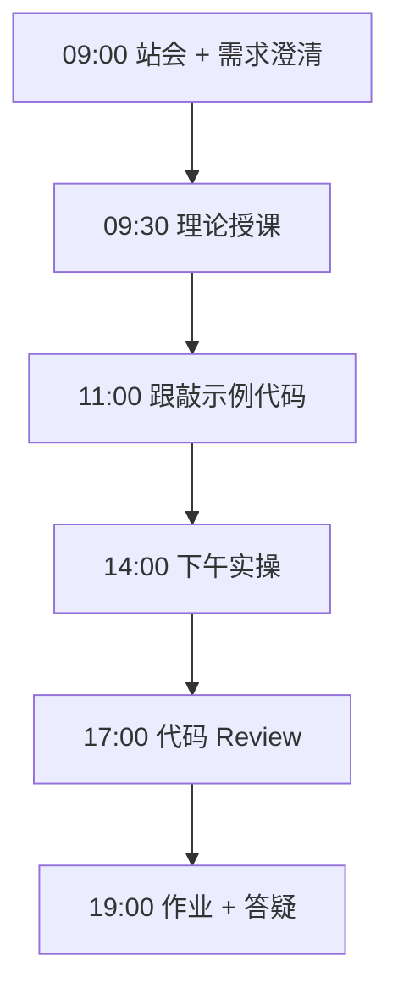
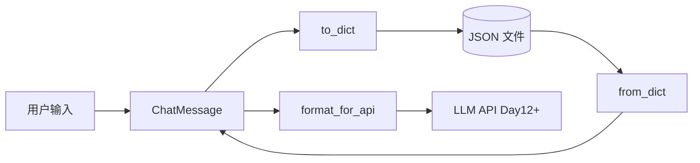

# Day 08：OOP 上：类与对象 — ChatMessage 领域模型

> **阶段**：第一阶段:Python编程基础 | **Epic**：NEXUS-E1 | **预计学时**：6-8 小时

## 旁白解读：今日上下文

> 🎬 **模拟站会 09:00** — 智链科技 Nexus 项目组

**林悦（产品经理）**：陈工，昨天我们把对话历史用列表存了，但每条消息还是裸字典，字段名经常写错。今天能不能定义一个「消息类」？

**陈工（Tech Lead）**：可以。我们引入 `ChatMessage` 领域模型，把 role、content、timestamp 封装起来。这是面向对象的第一步——用类表达业务概念，而不是到处传 dict。

**小王（后端）**：跟 OpenAI 的 messages 数组格式对齐吗？

**陈工**：对。`format_for_api()` 只输出 API 需要的字段，内部 metadata 自己留着做审计。今天先把类写好，Day 14 阶段项目会直接复用。

**测试小李**：空 content 要抛异常，避免脏数据进历史。

**陈工**：`__post_init__` 里做校验，企业代码不能信任外部输入。下午大家跟敲，17:00 我逐行 Review。


**今日在 NexusAgent 主线中的位置**：NexusAgent 对话服务底层消息实体，对应 platform/nexus_agent/schemas/message.py 雏形

**今日 Jira 看板**：
- `NEXUS-801`
- `NEXUS-802`
- `NEXUS-803`

---


## 需求文档（产品林悦下发）

**文档编号**：PRD-NEXUS-D08  
**版本**：v1.0  
**优先级**：P0

### 背景

第一阶段:Python编程基础阶段第 8 天教学任务，与 NexusAgent 主线项目对齐。

### User Stories

### NEXUS-801

**描述**：OOP 上：类与对象 — ChatMessage 领域模型 相关交付

**验收标准**：
- [ ] 代码可本地运行
- [ ] 通过 `scripts/verify_day.py --day 8`

### NEXUS-802

**描述**：OOP 上：类与对象 — ChatMessage 领域模型 相关交付

**验收标准**：
- [ ] 代码可本地运行
- [ ] 通过 `scripts/verify_day.py --day 8`

### NEXUS-803

**描述**：OOP 上：类与对象 — ChatMessage 领域模型 相关交付

**验收标准**：
- [ ] 代码可本地运行
- [ ] 通过 `scripts/verify_day.py --day 8`


---


## 今日课表

### 上午 09:00-12:00

- 09:00 站会：回顾 Day 7 函数与数据结构，引出「消息对象」需求
- 09:30 理论：类、对象、属性、方法、`__init__` 与 `self`
- 10:30 理论：`@dataclass`、枚举 Enum、类型注解入门
- 11:00 跟敲 chat_message.py：定义 MessageRole 与 ChatMessage

### 下午 14:00-17:30

- 14:00 实现 to_dict / from_dict 序列化方法
- 15:00 添加 word_count、preview 等业务方法
- 16:00 单元测试思维：构造合法/非法消息，观察异常
- 17:00 Code Review：命名规范、docstring 完整性检查

### 晚自习 19:00-21:00

- 19:00 作业：扩展 ChatMessage 支持 `is_empty()` 与 `merge()`
- 20:00 预习 Day 9 继承与多态，阅读 OpenAI API 消息格式文档

---


## 课堂笔记

### 核心知识点速查

| 序号 | 知识点 | 代码位置 |
|------|--------|----------|
| 1 | 类与对象：用 class 封装数据与行为 | 见下午实操 |
| 2 | __init__ 构造方法与 self | 见下午实操 |
| 3 | @dataclass 减少样板代码 | 见下午实操 |
| 4 | Enum 枚举类型约束取值 | 见下午实操 |
| 5 | __post_init__ 构造后校验 | 见下午实操 |
| 6 | 实例方法 vs 类方法 from_dict | 见下午实操 |
| 7 | 序列化 to_dict / 反序列化 | 见下午实操 |
| 8 | __repr__ 调试友好输出 | 见下午实操 |
| 9 | 领域模型 Domain Model 思想 | 见下午实操 |

### 今日流程图



### 架构示意图（当日目标）



---


## 实操代码清单

- `code/chat_message.py`

请按顺序创建并运行。每段代码均可直接复制到对应文件执行。

---

## 实验手册（分时段操作表）

### 实验步骤 1：09:30-10:30 理论

| 时间 | 动作 | 预期结果 | 失败处理 |
|------|------|----------|----------|
| +0min | 打开课件本节 | 看到需求与验收标准 | 检查是否拉取最新 `develop` 分支 |
| +10min | 创建/打开当日 `code/` 文件 | 文件路径与清单一致 | 对照「实操代码清单」 |
| +30min | 粘贴并运行第一个脚本 | 终端有正常输出无 Traceback | 见下方「排错手册」 |
| +60min | 完成全部文件并自测 | `python3` 运行通过 | 使用 `scripts/verify_day.py --day 8` |
| +90min | 提交 Git 并建 MR | MR 关联 Jira NEXUS-801 | 按附录 Git 示例操作 |


### 实验步骤 2：10:30-12:00 跟敲

| 时间 | 动作 | 预期结果 | 失败处理 |
|------|------|----------|----------|
| +0min | 打开课件本节 | 看到需求与验收标准 | 检查是否拉取最新 `develop` 分支 |
| +10min | 创建/打开当日 `code/` 文件 | 文件路径与清单一致 | 对照「实操代码清单」 |
| +30min | 粘贴并运行第一个脚本 | 终端有正常输出无 Traceback | 见下方「排错手册」 |
| +60min | 完成全部文件并自测 | `python3` 运行通过 | 使用 `scripts/verify_day.py --day 8` |
| +90min | 提交 Git 并建 MR | MR 关联 Jira NEXUS-801 | 按附录 Git 示例操作 |


### 实验步骤 3：14:00-15:30 实操

| 时间 | 动作 | 预期结果 | 失败处理 |
|------|------|----------|----------|
| +0min | 打开课件本节 | 看到需求与验收标准 | 检查是否拉取最新 `develop` 分支 |
| +10min | 创建/打开当日 `code/` 文件 | 文件路径与清单一致 | 对照「实操代码清单」 |
| +30min | 粘贴并运行第一个脚本 | 终端有正常输出无 Traceback | 见下方「排错手册」 |
| +60min | 完成全部文件并自测 | `python3` 运行通过 | 使用 `scripts/verify_day.py --day 8` |
| +90min | 提交 Git 并建 MR | MR 关联 Jira NEXUS-801 | 按附录 Git 示例操作 |


### 实验步骤 4：15:30-17:00 联调

| 时间 | 动作 | 预期结果 | 失败处理 |
|------|------|----------|----------|
| +0min | 打开课件本节 | 看到需求与验收标准 | 检查是否拉取最新 `develop` 分支 |
| +10min | 创建/打开当日 `code/` 文件 | 文件路径与清单一致 | 对照「实操代码清单」 |
| +30min | 粘贴并运行第一个脚本 | 终端有正常输出无 Traceback | 见下方「排错手册」 |
| +60min | 完成全部文件并自测 | `python3` 运行通过 | 使用 `scripts/verify_day.py --day 8` |
| +90min | 提交 Git 并建 MR | MR 关联 Jira NEXUS-801 | 按附录 Git 示例操作 |


### 实验步骤 5：19:00-20:30 作业

| 时间 | 动作 | 预期结果 | 失败处理 |
|------|------|----------|----------|
| +0min | 打开课件本节 | 看到需求与验收标准 | 检查是否拉取最新 `develop` 分支 |
| +10min | 创建/打开当日 `code/` 文件 | 文件路径与清单一致 | 对照「实操代码清单」 |
| +30min | 粘贴并运行第一个脚本 | 终端有正常输出无 Traceback | 见下方「排错手册」 |
| +60min | 完成全部文件并自测 | `python3` 运行通过 | 使用 `scripts/verify_day.py --day 8` |
| +90min | 提交 Git 并建 MR | MR 关联 Jira NEXUS-801 | 按附录 Git 示例操作 |


### 排错手册（Day 8）

1. **`command not found: python3`** → 安装 Python 3.10+ 或使用 `py -3`（Windows）
2. **`ModuleNotFoundError`** → 确认当前目录、是否激活 venv、`pip install -r requirements.txt`（若当日有）
3. **`SyntaxError: invalid syntax`** → 检查上一行是否缺括号、引号是否中文
4. **`UnicodeDecodeError`** → 文件保存为 UTF-8，终端 `export PYTHONIOENCODING=utf-8`
5. **API 相关（Day12+）** → 检查 `.env` 中 Key，无 Key 时使用课件 MOCK 模式

---


## 逐步跟敲指南（完整源码与解析）

> 以下代码与 `code/` 目录完全一致，可直接复制。每段附行级说明。

### 文件：`code/chat_message.py`

**操作步骤**：
1. 在 `courseware/day-08/code/` 下创建文件 `chat_message.py`
2. 完整粘贴下方代码
3. 在终端执行：`cd courseware/day-08/code && python3 chat_message.py`（若为包内模块则按课件说明）

```python
#!/usr/bin/env python3
"""
Day 8 示例：ChatMessage 类 —— 对话消息的领域模型

在企业级大模型应用中，每一条用户/助手消息都需要被结构化存储，
以便后续做历史记录、Token 统计、审计日志等。本模块定义最基础的消息实体。
"""
from __future__ import annotations

from dataclasses import dataclass, field
from datetime import datetime
from enum import Enum
from typing import Any


class MessageRole(str, Enum):
    """消息角色枚举，与 OpenAI Chat Completions API 的 role 字段对齐。"""

    SYSTEM = "system"      # 系统提示词，设定 AI 行为
    USER = "user"          # 终端用户输入
    ASSISTANT = "assistant"  # 模型回复
    TOOL = "tool"          # 工具调用结果（Day 40+ 会用到）


@dataclass
class ChatMessage:
    """
    单条聊天消息的领域对象。

    属性:
        role: 消息角色（system/user/assistant/tool）
        content: 消息正文，纯文本
        timestamp: 消息创建时间，默认取当前时间
        metadata: 扩展字段，如 token 数、模型名称、trace_id 等
    """

    role: MessageRole
    content: str
    timestamp: datetime = field(default_factory=datetime.now)
    metadata: dict[str, Any] = field(default_factory=dict)

    def __post_init__(self) -> None:
        """构造后校验：确保 role 为枚举类型、content 非空。"""
        # 允许传入字符串形式的 role，自动转换为枚举
        if isinstance(self.role, str):
            self.role = MessageRole(self.role)
        if not self.content or not self.content.strip():
            raise ValueError("消息内容 content 不能为空")

    def to_dict(self) -> dict[str, Any]:
        """序列化为字典，便于 JSON 存储或 API 传输。"""
        return {
            "role": self.role.value,
            "content": self.content,
            "timestamp": self.timestamp.isoformat(),
            "metadata": self.metadata,
        }

    @classmethod
    def from_dict(cls, data: dict[str, Any]) -> ChatMessage:
        """从字典反序列化，用于读取历史记录文件。"""
        ts = data.get("timestamp")
        if isinstance(ts, str):
            timestamp = datetime.fromisoformat(ts)
        else:
            timestamp = datetime.now()
        return cls(
            role=MessageRole(data["role"]),
            content=data["content"],
            timestamp=timestamp,
            metadata=data.get("metadata", {}),
        )

    def word_count(self) -> int:
        """粗略统计字数（中文按字符、英文按空格分词）。"""
        # 简单实现：去除首尾空白后按空白切分
        return len(self.content.split())

    def preview(self, max_len: int = 50) -> str:
        """生成消息预览，用于 CLI 历史列表展示。"""
        text = self.content.replace("\n", " ")
        if len(text) <= max_len:
            return text
        return text[: max_len - 3] + "..."

    def __repr__(self) -> str:
        return (
            f"ChatMessage(role={self.role.value!r}, "
            f"content={self.preview(30)!r}, "
            f"timestamp={self.timestamp:%Y-%m-%d %H:%M})"
        )


def demo() -> None:
    """演示 ChatMessage 的基本用法。"""
    # 1. 创建用户消息
    user_msg = ChatMessage(role=MessageRole.USER, content="你好，请介绍一下 NexusAgent 平台。")
    print("用户消息:", user_msg)
    print("字数:", user_msg.word_count())

    # 2. 创建助手回复，附带 metadata
    assistant_msg = ChatMessage(
        role=MessageRole.ASSISTANT,
        content="NexusAgent 是智链科技的企业级智能体协作平台，支持多轮对话与知识库问答。",
        metadata={"model": "qwen-plus", "tokens": 42},
    )
    print("助手消息:", assistant_msg)

    # 3. 序列化与反序列化
    payload = user_msg.to_dict()
    restored = ChatMessage.from_dict(payload)
    print("反序列化成功:", restored.role == user_msg.role)

    # 4. 批量消息列表（后续 Day 14 会用于对话历史）
    history: list[ChatMessage] = [user_msg, assistant_msg]
    print(f"\n对话历史共 {len(history)} 条:")
    for i, msg in enumerate(history, 1):
        print(f"  [{i}] {msg.role.value}: {msg.preview()}")


if __name__ == "__main__":
    demo()

```

**解析要点（`chat_message.py`）**：

- 共 **122** 行，请逐行阅读注释中的中文说明

- 运行前确认 Python 版本 ≥ 3.10：`python3 --version`

- 若报错，先检查缩进是否为 4 空格，勿混用 Tab

- 企业 Review 清单：命名是否清晰、是否有异常处理、是否可复用

---


### 深度讲解 1：类与对象：用 class 封装数据与行为

在企业级 Python 开发与大模型应用工程中，**类与对象：用 class 封装数据与行为** 是学员必须牢固掌握的基本功。智链科技 Nexus 项目组在 Day 8 的代码评审中，特别强调以下几点：

1. **为什么学**：类与对象：用 class 封装数据与行为 直接服务于后续 NexusAgent 平台的 `NEXUS-E1` 模块。没有扎实的 类与对象：用 class 封装数据与行为，Day 15 之后调用 API、解析 JSON、编写 Agent 工具函数时会出现大量低级错误。

2. **常见坑**：
   - 忽略输入类型校验，导致运行时 `TypeError`
   - 编码问题（Windows 默认 GBK vs UTF-8）
   - 复制粘贴时缩进错乱（Python 对缩进敏感）

3. **企业实践**：在 SmartLink 的 GitLab 仓库中，所有与 类与对象：用 class 封装数据与行为 相关的代码必须经过 Ruff 静态检查；变量命名使用 `snake_case`，常量使用 `UPPER_SNAKE_CASE`。

4. **与主线项目的关系**：今日代码位于 `courseware/day-08/code/`，部分模块将逐步合并到 `platform/nexus_agent/`。请养成「每日代码皆可运行、皆可测试」的习惯。

5. **扩展阅读建议**：完成今日作业后，可阅读 `docs/project-master-plan.md` 中关于 NEXUS-E1 的章节，建立全局视角。

**课堂互动题**：请用 3 句话向非技术同事解释「类与对象：用 class 封装数据与行为」是什么。写在作业 MR 的评论里，讲师会抽查点评。

**实操检查清单**：
- [ ] 能不看课件复述 类与对象：用 class 封装数据与行为 的定义
- [ ] 能独立写出相关代码并运行
- [ ] 能向同学讲解一处容易写错的地方


### 深度讲解 2：__init__ 构造方法与 self

在企业级 Python 开发与大模型应用工程中，**__init__ 构造方法与 self** 是学员必须牢固掌握的基本功。智链科技 Nexus 项目组在 Day 8 的代码评审中，特别强调以下几点：

1. **为什么学**：__init__ 构造方法与 self 直接服务于后续 NexusAgent 平台的 `NEXUS-E1` 模块。没有扎实的 __init__ 构造方法与 self，Day 15 之后调用 API、解析 JSON、编写 Agent 工具函数时会出现大量低级错误。

2. **常见坑**：
   - 忽略输入类型校验，导致运行时 `TypeError`
   - 编码问题（Windows 默认 GBK vs UTF-8）
   - 复制粘贴时缩进错乱（Python 对缩进敏感）

3. **企业实践**：在 SmartLink 的 GitLab 仓库中，所有与 __init__ 构造方法与 self 相关的代码必须经过 Ruff 静态检查；变量命名使用 `snake_case`，常量使用 `UPPER_SNAKE_CASE`。

4. **与主线项目的关系**：今日代码位于 `courseware/day-08/code/`，部分模块将逐步合并到 `platform/nexus_agent/`。请养成「每日代码皆可运行、皆可测试」的习惯。

5. **扩展阅读建议**：完成今日作业后，可阅读 `docs/project-master-plan.md` 中关于 NEXUS-E1 的章节，建立全局视角。

**课堂互动题**：请用 3 句话向非技术同事解释「__init__ 构造方法与 self」是什么。写在作业 MR 的评论里，讲师会抽查点评。

**实操检查清单**：
- [ ] 能不看课件复述 __init__ 构造方法与 self 的定义
- [ ] 能独立写出相关代码并运行
- [ ] 能向同学讲解一处容易写错的地方


### 深度讲解 3：@dataclass 减少样板代码

在企业级 Python 开发与大模型应用工程中，**@dataclass 减少样板代码** 是学员必须牢固掌握的基本功。智链科技 Nexus 项目组在 Day 8 的代码评审中，特别强调以下几点：

1. **为什么学**：@dataclass 减少样板代码 直接服务于后续 NexusAgent 平台的 `NEXUS-E1` 模块。没有扎实的 @dataclass 减少样板代码，Day 15 之后调用 API、解析 JSON、编写 Agent 工具函数时会出现大量低级错误。

2. **常见坑**：
   - 忽略输入类型校验，导致运行时 `TypeError`
   - 编码问题（Windows 默认 GBK vs UTF-8）
   - 复制粘贴时缩进错乱（Python 对缩进敏感）

3. **企业实践**：在 SmartLink 的 GitLab 仓库中，所有与 @dataclass 减少样板代码 相关的代码必须经过 Ruff 静态检查；变量命名使用 `snake_case`，常量使用 `UPPER_SNAKE_CASE`。

4. **与主线项目的关系**：今日代码位于 `courseware/day-08/code/`，部分模块将逐步合并到 `platform/nexus_agent/`。请养成「每日代码皆可运行、皆可测试」的习惯。

5. **扩展阅读建议**：完成今日作业后，可阅读 `docs/project-master-plan.md` 中关于 NEXUS-E1 的章节，建立全局视角。

**课堂互动题**：请用 3 句话向非技术同事解释「@dataclass 减少样板代码」是什么。写在作业 MR 的评论里，讲师会抽查点评。

**实操检查清单**：
- [ ] 能不看课件复述 @dataclass 减少样板代码 的定义
- [ ] 能独立写出相关代码并运行
- [ ] 能向同学讲解一处容易写错的地方


### 深度讲解 4：Enum 枚举类型约束取值

在企业级 Python 开发与大模型应用工程中，**Enum 枚举类型约束取值** 是学员必须牢固掌握的基本功。智链科技 Nexus 项目组在 Day 8 的代码评审中，特别强调以下几点：

1. **为什么学**：Enum 枚举类型约束取值 直接服务于后续 NexusAgent 平台的 `NEXUS-E1` 模块。没有扎实的 Enum 枚举类型约束取值，Day 15 之后调用 API、解析 JSON、编写 Agent 工具函数时会出现大量低级错误。

2. **常见坑**：
   - 忽略输入类型校验，导致运行时 `TypeError`
   - 编码问题（Windows 默认 GBK vs UTF-8）
   - 复制粘贴时缩进错乱（Python 对缩进敏感）

3. **企业实践**：在 SmartLink 的 GitLab 仓库中，所有与 Enum 枚举类型约束取值 相关的代码必须经过 Ruff 静态检查；变量命名使用 `snake_case`，常量使用 `UPPER_SNAKE_CASE`。

4. **与主线项目的关系**：今日代码位于 `courseware/day-08/code/`，部分模块将逐步合并到 `platform/nexus_agent/`。请养成「每日代码皆可运行、皆可测试」的习惯。

5. **扩展阅读建议**：完成今日作业后，可阅读 `docs/project-master-plan.md` 中关于 NEXUS-E1 的章节，建立全局视角。

**课堂互动题**：请用 3 句话向非技术同事解释「Enum 枚举类型约束取值」是什么。写在作业 MR 的评论里，讲师会抽查点评。

**实操检查清单**：
- [ ] 能不看课件复述 Enum 枚举类型约束取值 的定义
- [ ] 能独立写出相关代码并运行
- [ ] 能向同学讲解一处容易写错的地方


### 深度讲解 5：__post_init__ 构造后校验

在企业级 Python 开发与大模型应用工程中，**__post_init__ 构造后校验** 是学员必须牢固掌握的基本功。智链科技 Nexus 项目组在 Day 8 的代码评审中，特别强调以下几点：

1. **为什么学**：__post_init__ 构造后校验 直接服务于后续 NexusAgent 平台的 `NEXUS-E1` 模块。没有扎实的 __post_init__ 构造后校验，Day 15 之后调用 API、解析 JSON、编写 Agent 工具函数时会出现大量低级错误。

2. **常见坑**：
   - 忽略输入类型校验，导致运行时 `TypeError`
   - 编码问题（Windows 默认 GBK vs UTF-8）
   - 复制粘贴时缩进错乱（Python 对缩进敏感）

3. **企业实践**：在 SmartLink 的 GitLab 仓库中，所有与 __post_init__ 构造后校验 相关的代码必须经过 Ruff 静态检查；变量命名使用 `snake_case`，常量使用 `UPPER_SNAKE_CASE`。

4. **与主线项目的关系**：今日代码位于 `courseware/day-08/code/`，部分模块将逐步合并到 `platform/nexus_agent/`。请养成「每日代码皆可运行、皆可测试」的习惯。

5. **扩展阅读建议**：完成今日作业后，可阅读 `docs/project-master-plan.md` 中关于 NEXUS-E1 的章节，建立全局视角。

**课堂互动题**：请用 3 句话向非技术同事解释「__post_init__ 构造后校验」是什么。写在作业 MR 的评论里，讲师会抽查点评。

**实操检查清单**：
- [ ] 能不看课件复述 __post_init__ 构造后校验 的定义
- [ ] 能独立写出相关代码并运行
- [ ] 能向同学讲解一处容易写错的地方


### 深度讲解 6：实例方法 vs 类方法 from_dict

在企业级 Python 开发与大模型应用工程中，**实例方法 vs 类方法 from_dict** 是学员必须牢固掌握的基本功。智链科技 Nexus 项目组在 Day 8 的代码评审中，特别强调以下几点：

1. **为什么学**：实例方法 vs 类方法 from_dict 直接服务于后续 NexusAgent 平台的 `NEXUS-E1` 模块。没有扎实的 实例方法 vs 类方法 from_dict，Day 15 之后调用 API、解析 JSON、编写 Agent 工具函数时会出现大量低级错误。

2. **常见坑**：
   - 忽略输入类型校验，导致运行时 `TypeError`
   - 编码问题（Windows 默认 GBK vs UTF-8）
   - 复制粘贴时缩进错乱（Python 对缩进敏感）

3. **企业实践**：在 SmartLink 的 GitLab 仓库中，所有与 实例方法 vs 类方法 from_dict 相关的代码必须经过 Ruff 静态检查；变量命名使用 `snake_case`，常量使用 `UPPER_SNAKE_CASE`。

4. **与主线项目的关系**：今日代码位于 `courseware/day-08/code/`，部分模块将逐步合并到 `platform/nexus_agent/`。请养成「每日代码皆可运行、皆可测试」的习惯。

5. **扩展阅读建议**：完成今日作业后，可阅读 `docs/project-master-plan.md` 中关于 NEXUS-E1 的章节，建立全局视角。

**课堂互动题**：请用 3 句话向非技术同事解释「实例方法 vs 类方法 from_dict」是什么。写在作业 MR 的评论里，讲师会抽查点评。

**实操检查清单**：
- [ ] 能不看课件复述 实例方法 vs 类方法 from_dict 的定义
- [ ] 能独立写出相关代码并运行
- [ ] 能向同学讲解一处容易写错的地方


### 深度讲解 7：序列化 to_dict / 反序列化

在企业级 Python 开发与大模型应用工程中，**序列化 to_dict / 反序列化** 是学员必须牢固掌握的基本功。智链科技 Nexus 项目组在 Day 8 的代码评审中，特别强调以下几点：

1. **为什么学**：序列化 to_dict / 反序列化 直接服务于后续 NexusAgent 平台的 `NEXUS-E1` 模块。没有扎实的 序列化 to_dict / 反序列化，Day 15 之后调用 API、解析 JSON、编写 Agent 工具函数时会出现大量低级错误。

2. **常见坑**：
   - 忽略输入类型校验，导致运行时 `TypeError`
   - 编码问题（Windows 默认 GBK vs UTF-8）
   - 复制粘贴时缩进错乱（Python 对缩进敏感）

3. **企业实践**：在 SmartLink 的 GitLab 仓库中，所有与 序列化 to_dict / 反序列化 相关的代码必须经过 Ruff 静态检查；变量命名使用 `snake_case`，常量使用 `UPPER_SNAKE_CASE`。

4. **与主线项目的关系**：今日代码位于 `courseware/day-08/code/`，部分模块将逐步合并到 `platform/nexus_agent/`。请养成「每日代码皆可运行、皆可测试」的习惯。

5. **扩展阅读建议**：完成今日作业后，可阅读 `docs/project-master-plan.md` 中关于 NEXUS-E1 的章节，建立全局视角。

**课堂互动题**：请用 3 句话向非技术同事解释「序列化 to_dict / 反序列化」是什么。写在作业 MR 的评论里，讲师会抽查点评。

**实操检查清单**：
- [ ] 能不看课件复述 序列化 to_dict / 反序列化 的定义
- [ ] 能独立写出相关代码并运行
- [ ] 能向同学讲解一处容易写错的地方


### 深度讲解 8：__repr__ 调试友好输出

在企业级 Python 开发与大模型应用工程中，**__repr__ 调试友好输出** 是学员必须牢固掌握的基本功。智链科技 Nexus 项目组在 Day 8 的代码评审中，特别强调以下几点：

1. **为什么学**：__repr__ 调试友好输出 直接服务于后续 NexusAgent 平台的 `NEXUS-E1` 模块。没有扎实的 __repr__ 调试友好输出，Day 15 之后调用 API、解析 JSON、编写 Agent 工具函数时会出现大量低级错误。

2. **常见坑**：
   - 忽略输入类型校验，导致运行时 `TypeError`
   - 编码问题（Windows 默认 GBK vs UTF-8）
   - 复制粘贴时缩进错乱（Python 对缩进敏感）

3. **企业实践**：在 SmartLink 的 GitLab 仓库中，所有与 __repr__ 调试友好输出 相关的代码必须经过 Ruff 静态检查；变量命名使用 `snake_case`，常量使用 `UPPER_SNAKE_CASE`。

4. **与主线项目的关系**：今日代码位于 `courseware/day-08/code/`，部分模块将逐步合并到 `platform/nexus_agent/`。请养成「每日代码皆可运行、皆可测试」的习惯。

5. **扩展阅读建议**：完成今日作业后，可阅读 `docs/project-master-plan.md` 中关于 NEXUS-E1 的章节，建立全局视角。

**课堂互动题**：请用 3 句话向非技术同事解释「__repr__ 调试友好输出」是什么。写在作业 MR 的评论里，讲师会抽查点评。

**实操检查清单**：
- [ ] 能不看课件复述 __repr__ 调试友好输出 的定义
- [ ] 能独立写出相关代码并运行
- [ ] 能向同学讲解一处容易写错的地方


### 深度讲解 9：领域模型 Domain Model 思想

在企业级 Python 开发与大模型应用工程中，**领域模型 Domain Model 思想** 是学员必须牢固掌握的基本功。智链科技 Nexus 项目组在 Day 8 的代码评审中，特别强调以下几点：

1. **为什么学**：领域模型 Domain Model 思想 直接服务于后续 NexusAgent 平台的 `NEXUS-E1` 模块。没有扎实的 领域模型 Domain Model 思想，Day 15 之后调用 API、解析 JSON、编写 Agent 工具函数时会出现大量低级错误。

2. **常见坑**：
   - 忽略输入类型校验，导致运行时 `TypeError`
   - 编码问题（Windows 默认 GBK vs UTF-8）
   - 复制粘贴时缩进错乱（Python 对缩进敏感）

3. **企业实践**：在 SmartLink 的 GitLab 仓库中，所有与 领域模型 Domain Model 思想 相关的代码必须经过 Ruff 静态检查；变量命名使用 `snake_case`，常量使用 `UPPER_SNAKE_CASE`。

4. **与主线项目的关系**：今日代码位于 `courseware/day-08/code/`，部分模块将逐步合并到 `platform/nexus_agent/`。请养成「每日代码皆可运行、皆可测试」的习惯。

5. **扩展阅读建议**：完成今日作业后，可阅读 `docs/project-master-plan.md` 中关于 NEXUS-E1 的章节，建立全局视角。

**课堂互动题**：请用 3 句话向非技术同事解释「领域模型 Domain Model 思想」是什么。写在作业 MR 的评论里，讲师会抽查点评。

**实操检查清单**：
- [ ] 能不看课件复述 领域模型 Domain Model 思想 的定义
- [ ] 能独立写出相关代码并运行
- [ ] 能向同学讲解一处容易写错的地方


## 阶段复盘锚点（第一阶段:Python编程基础）

今天是 **第一阶段:Python编程基础** 的第 **8** 个学习日。请回顾：

- 昨天学了什么？今天如何承接？
- 今天的内容在 70 天路线图中的坐标？
- 如果我是 Tech Lead，会如何 Review 今日代码？

**陈工寄语**：慢即是快。企业里没人关心你一天学了多少个语法点，只关心你写的脚本能不能在服务器上稳定跑 7×24 小时。今天把地基打牢，后面 Agent 编排、RAG 检索才不会塌。

**林悦补充**：产品侧只验收「用户能感知到的价值」。今日交付虽然简单，但「个人信息卡片」本质是后续「用户画像 Agent」的数据采集原型——字段设计请认真思考。

**代码量统计（累计）**：完成今日后，个人仓库累计约 **11200** 行（含注释与测试），全营目标 10 万行。

**明日预告**：请提前阅读 `courseware/day-09/README.md` 开头的旁白，了解上下文。


## 常见问题 FAQ（讲师答疑实录）


**Q1：学习「类与对象：用 class 封装数据与行为」时最常问的问题是什么？**

A：学员常问「这在大模型开发里到底用在哪里」。直接回答：在 NexusAgent 的 `NEXUS-E1` 中，类与对象：用 class 封装数据与行为 用于支撑「OOP 上：类与对象 — ChatMessage 领域模型」这一交付。建议你打开 `platform/` 对照看未来模块如何引用今日写法。另一个常见问题是「要不要背语法」——不需要背，但要能写出可运行代码，并能在报错时读懂 Traceback。

**追问**：如果线上报错与 类与对象：用 class 封装数据与行为 相关，如何排查？  
**答**：① 复现 ② 最小化输入 ③ 打印中间变量 ④ 查 GitLab 历史 diff ⑤ 在 Jira 建 Bug 单附上日志。


**Q2：学习「__init__ 构造方法与 self」时最常问的问题是什么？**

A：学员常问「这在大模型开发里到底用在哪里」。直接回答：在 NexusAgent 的 `NEXUS-E1` 中，__init__ 构造方法与 self 用于支撑「OOP 上：类与对象 — ChatMessage 领域模型」这一交付。建议你打开 `platform/` 对照看未来模块如何引用今日写法。另一个常见问题是「要不要背语法」——不需要背，但要能写出可运行代码，并能在报错时读懂 Traceback。

**追问**：如果线上报错与 __init__ 构造方法与 self 相关，如何排查？  
**答**：① 复现 ② 最小化输入 ③ 打印中间变量 ④ 查 GitLab 历史 diff ⑤ 在 Jira 建 Bug 单附上日志。


**Q3：学习「@dataclass 减少样板代码」时最常问的问题是什么？**

A：学员常问「这在大模型开发里到底用在哪里」。直接回答：在 NexusAgent 的 `NEXUS-E1` 中，@dataclass 减少样板代码 用于支撑「OOP 上：类与对象 — ChatMessage 领域模型」这一交付。建议你打开 `platform/` 对照看未来模块如何引用今日写法。另一个常见问题是「要不要背语法」——不需要背，但要能写出可运行代码，并能在报错时读懂 Traceback。

**追问**：如果线上报错与 @dataclass 减少样板代码 相关，如何排查？  
**答**：① 复现 ② 最小化输入 ③ 打印中间变量 ④ 查 GitLab 历史 diff ⑤ 在 Jira 建 Bug 单附上日志。


**Q4：学习「Enum 枚举类型约束取值」时最常问的问题是什么？**

A：学员常问「这在大模型开发里到底用在哪里」。直接回答：在 NexusAgent 的 `NEXUS-E1` 中，Enum 枚举类型约束取值 用于支撑「OOP 上：类与对象 — ChatMessage 领域模型」这一交付。建议你打开 `platform/` 对照看未来模块如何引用今日写法。另一个常见问题是「要不要背语法」——不需要背，但要能写出可运行代码，并能在报错时读懂 Traceback。

**追问**：如果线上报错与 Enum 枚举类型约束取值 相关，如何排查？  
**答**：① 复现 ② 最小化输入 ③ 打印中间变量 ④ 查 GitLab 历史 diff ⑤ 在 Jira 建 Bug 单附上日志。


**Q5：学习「__post_init__ 构造后校验」时最常问的问题是什么？**

A：学员常问「这在大模型开发里到底用在哪里」。直接回答：在 NexusAgent 的 `NEXUS-E1` 中，__post_init__ 构造后校验 用于支撑「OOP 上：类与对象 — ChatMessage 领域模型」这一交付。建议你打开 `platform/` 对照看未来模块如何引用今日写法。另一个常见问题是「要不要背语法」——不需要背，但要能写出可运行代码，并能在报错时读懂 Traceback。

**追问**：如果线上报错与 __post_init__ 构造后校验 相关，如何排查？  
**答**：① 复现 ② 最小化输入 ③ 打印中间变量 ④ 查 GitLab 历史 diff ⑤ 在 Jira 建 Bug 单附上日志。


**Q6：学习「实例方法 vs 类方法 from_dict」时最常问的问题是什么？**

A：学员常问「这在大模型开发里到底用在哪里」。直接回答：在 NexusAgent 的 `NEXUS-E1` 中，实例方法 vs 类方法 from_dict 用于支撑「OOP 上：类与对象 — ChatMessage 领域模型」这一交付。建议你打开 `platform/` 对照看未来模块如何引用今日写法。另一个常见问题是「要不要背语法」——不需要背，但要能写出可运行代码，并能在报错时读懂 Traceback。

**追问**：如果线上报错与 实例方法 vs 类方法 from_dict 相关，如何排查？  
**答**：① 复现 ② 最小化输入 ③ 打印中间变量 ④ 查 GitLab 历史 diff ⑤ 在 Jira 建 Bug 单附上日志。


**Q7：学习「序列化 to_dict / 反序列化」时最常问的问题是什么？**

A：学员常问「这在大模型开发里到底用在哪里」。直接回答：在 NexusAgent 的 `NEXUS-E1` 中，序列化 to_dict / 反序列化 用于支撑「OOP 上：类与对象 — ChatMessage 领域模型」这一交付。建议你打开 `platform/` 对照看未来模块如何引用今日写法。另一个常见问题是「要不要背语法」——不需要背，但要能写出可运行代码，并能在报错时读懂 Traceback。

**追问**：如果线上报错与 序列化 to_dict / 反序列化 相关，如何排查？  
**答**：① 复现 ② 最小化输入 ③ 打印中间变量 ④ 查 GitLab 历史 diff ⑤ 在 Jira 建 Bug 单附上日志。


**Q8：学习「__repr__ 调试友好输出」时最常问的问题是什么？**

A：学员常问「这在大模型开发里到底用在哪里」。直接回答：在 NexusAgent 的 `NEXUS-E1` 中，__repr__ 调试友好输出 用于支撑「OOP 上：类与对象 — ChatMessage 领域模型」这一交付。建议你打开 `platform/` 对照看未来模块如何引用今日写法。另一个常见问题是「要不要背语法」——不需要背，但要能写出可运行代码，并能在报错时读懂 Traceback。

**追问**：如果线上报错与 __repr__ 调试友好输出 相关，如何排查？  
**答**：① 复现 ② 最小化输入 ③ 打印中间变量 ④ 查 GitLab 历史 diff ⑤ 在 Jira 建 Bug 单附上日志。


**Q9：学习「领域模型 Domain Model 思想」时最常问的问题是什么？**

A：学员常问「这在大模型开发里到底用在哪里」。直接回答：在 NexusAgent 的 `NEXUS-E1` 中，领域模型 Domain Model 思想 用于支撑「OOP 上：类与对象 — ChatMessage 领域模型」这一交付。建议你打开 `platform/` 对照看未来模块如何引用今日写法。另一个常见问题是「要不要背语法」——不需要背，但要能写出可运行代码，并能在报错时读懂 Traceback。

**追问**：如果线上报错与 领域模型 Domain Model 思想 相关，如何排查？  
**答**：① 复现 ② 最小化输入 ③ 打印中间变量 ④ 查 GitLab 历史 diff ⑤ 在 Jira 建 Bug 单附上日志。


## 面试押题（与今日知识点挂钩）

以下题目会出现在 Day 67-69 模拟面试中，建议今日就开始积累答案：

1. **类与对象：用 class 封装数据与行为**：请结合 NexusAgent 项目举例说明你在哪一天、哪段代码里用到了它？
2. **__init__ 构造方法与 self**：请结合 NexusAgent 项目举例说明你在哪一天、哪段代码里用到了它？
3. **@dataclass 减少样板代码**：请结合 NexusAgent 项目举例说明你在哪一天、哪段代码里用到了它？
4. **Enum 枚举类型约束取值**：请结合 NexusAgent 项目举例说明你在哪一天、哪段代码里用到了它？
5. **__post_init__ 构造后校验**：请结合 NexusAgent 项目举例说明你在哪一天、哪段代码里用到了它？
6. **实例方法 vs 类方法 from_dict**：请结合 NexusAgent 项目举例说明你在哪一天、哪段代码里用到了它？

**参考答案思路**：采用 STAR 法则（情境-任务-行动-结果），引用 `courseware/day-08/code/` 中的具体文件名与函数名。

---


## Code Review 检查表（陈工版）

合并 MR 前自查：

- [ ] 所有新增 `.py` 文件顶部有模块说明 docstring
- [ ] 无硬编码密钥（API Key 走环境变量）
- [ ] 函数长度 < 50 行，过长则拆分
- [ ] 异常有明确提示，禁止裸 `except:`
- [ ] 提交信息符合 `feat(day-08): ...`
- [ ] README 或注释说明如何运行
- [ ] 与 Jira Story 验收标准逐条对应

**今日重点审查项**：OOP 上：类与对象 — ChatMessage 领域模型 相关逻辑是否可读、可测、可扩展至 `platform/nexus_agent/`。

---


## 课后作业

### 作业说明

在 `homework/chat_message_ext.py` 中扩展 ChatMessage：

1. 实现 `is_empty()`：判断 content 是否仅含空白字符
2. 实现 `merge(other: ChatMessage) -> ChatMessage`：合并两条同 role 消息（content 用换行拼接）
3. 实现 `format_for_api() -> dict`：仅返回 `{"role": ..., "content": ...}`，供 LLM API 调用
4. 编写 `if __name__ == "__main__"` 演示上述三个方法


### 提交要求

1. 代码提交到分支 `feature/day-08-homework`
2. GitLab MR 标题：`[Day-08] homework: 课后作业`
3. 在 MR 描述中附上运行截图或终端输出

### 评分标准（满分 100）

| 项 | 分值 |
|----|------|
| 功能完整 | 40 |
| 代码规范与注释 | 30 |
| 异常处理 | 15 |
| MR 与 Jira 关联 | 15 |

---

## 作业参考答案

> ⚠️ 请先独立完成再对照答案

```python
# homework/chat_message_ext.py 参考答案
from chat_message import ChatMessage, MessageRole

class ChatMessageExt(ChatMessage):
    def is_empty(self) -> bool:
        return not self.content.strip()

    def merge(self, other: ChatMessage) -> ChatMessage:
        if self.role != other.role:
            raise ValueError("只能合并相同 role 的消息")
        return ChatMessage(
            role=self.role,
            content=self.content + "\n" + other.content,
            metadata={**self.metadata, **other.metadata},
        )

    def format_for_api(self) -> dict:
        return {"role": self.role.value, "content": self.content}

if __name__ == "__main__":
    m1 = ChatMessage(MessageRole.USER, "你好")
    m2 = ChatMessage(MessageRole.USER, "请继续")
    merged = m1.merge(m2)
    print(merged.format_for_api())
    print("is_empty:", ChatMessage(MessageRole.USER, "   ").is_empty())
```


---


## 附录：Git 提交示例

```bash
git checkout develop
git pull origin develop
git checkout -b feature/day-08-oop-上：类与对象
# 完成代码后
git add courseware/day-08/
git commit -m "feat(day-08): OOP 上：类与对象 — ChatMessage 领域模型"
git push -u origin feature/day-08-oop-上：类与对象
```

---

*课件版本 Day-08-v1.0 | 智链科技培训中心*
