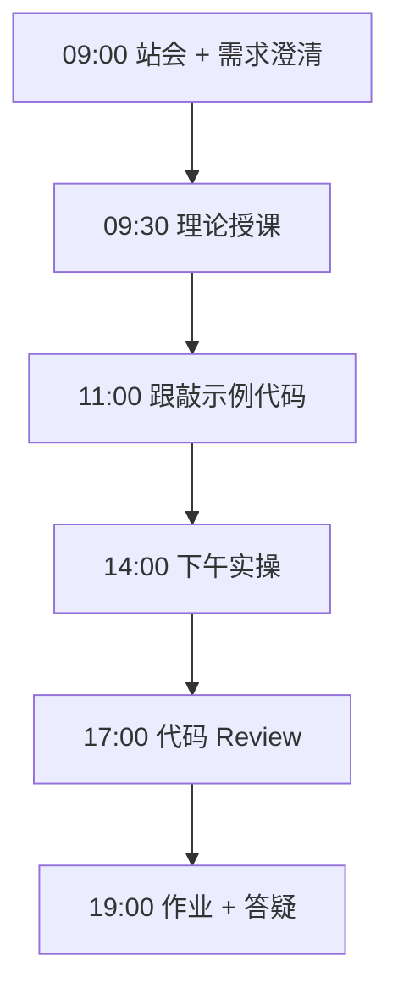
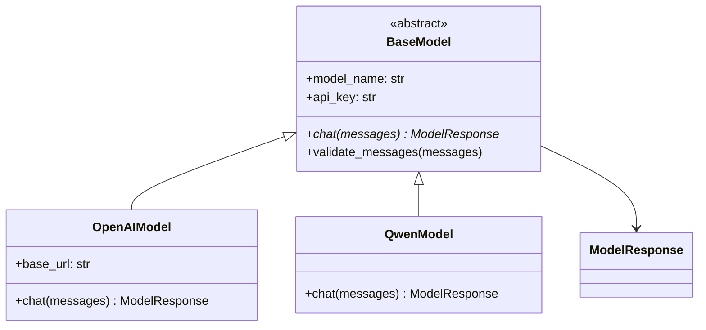

# Day 09：OOP 下：继承、抽象类与多态 — 模型适配层

> **阶段**：第一阶段:Python编程基础 | **Epic**：NEXUS-E1 | **预计学时**：6-8 小时

## 旁白解读：今日上下文

> 🎬 **模拟站会 09:00** — 智链科技 Nexus 项目组

**林悦**：产品要支持「模型切换」——客户 A 用通义，客户 B 用 OpenAI。不能每换一个模型就改一遍业务代码吧？

**陈工**：今天用继承搞定。`BaseModel` 定义统一 `chat()` 接口，`OpenAIModel`、`QwenModel` 各自实现。上层只认 `BaseModel` 类型，这就是依赖倒置。

**小王**：抽象类 ABC 和普通父类有啥区别？

**陈工**：ABC 强制子类实现 `chat()`，漏写就实例化报错。企业里接口契约要硬，不能靠自觉。

**架构老张**：这个适配层以后放 `platform/nexus_agent/llm/`，今天先在课件里练手。下午加工厂方法，字符串配置就能切模型。

**测试小李**：我会测子类能不能当父类用——多态对不对，LSP 原则。


**今日在 NexusAgent 主线中的位置**：platform/nexus_agent/llm/base.py 适配层原型

**今日 Jira 看板**：
- `NEXUS-901`
- `NEXUS-902`
- `NEXUS-903`

---


## 需求文档（产品林悦下发）

**文档编号**：PRD-NEXUS-D09  
**版本**：v1.0  
**优先级**：P0

### 背景

第一阶段:Python编程基础阶段第 9 天教学任务，与 NexusAgent 主线项目对齐。

### User Stories

### NEXUS-901

**描述**：OOP 下：继承、抽象类与多态 — 模型适配层 相关交付

**验收标准**：
- [ ] 代码可本地运行
- [ ] 通过 `scripts/verify_day.py --day 9`

### NEXUS-902

**描述**：OOP 下：继承、抽象类与多态 — 模型适配层 相关交付

**验收标准**：
- [ ] 代码可本地运行
- [ ] 通过 `scripts/verify_day.py --day 9`

### NEXUS-903

**描述**：OOP 下：继承、抽象类与多态 — 模型适配层 相关交付

**验收标准**：
- [ ] 代码可本地运行
- [ ] 通过 `scripts/verify_day.py --day 9`


---


## 今日课表

### 上午 09:00-12:00

- 09:00 站会：演示昨日 ChatMessage MR，今日目标「多模型统一接口」
- 09:30 理论：继承、super()、方法重写 override
- 10:30 理论：ABC 抽象基类、@abstractmethod
- 11:00 跟敲 base_model.py 与 openai_model.py

### 下午 14:00-17:30

- 14:00 实现 qwen_model.py，对比两家 API 差异
- 15:00 多态 demo：list[BaseModel] 统一遍历调用
- 16:00 简单工厂 create_model(provider)
- 17:00 Review：里氏替换原则 LSP，子类能否替换父类

### 晚自习 19:00-21:00

- 19:00 作业：新增 DeepSeekModel 子类
- 20:00 阅读通义千问 DashScope 官方文档 API 章节

---


## 课堂笔记

### 核心知识点速查

| 序号 | 知识点 | 代码位置 |
|------|--------|----------|
| 1 | 继承 extends 与 super() 调用父类 | 见下午实操 |
| 2 | 方法重写 override | 见下午实操 |
| 3 | ABC 抽象基类与 @abstractmethod | 见下午实操 |
| 4 | 多态：父类引用指向子类对象 | 见下午实操 |
| 5 | 里氏替换原则 LSP | 见下午实操 |
| 6 | 简单工厂模式 create_model | 见下午实操 |
| 7 | ModelResponse 统一响应 DTO | 见下午实操 |
| 8 | validate_messages 公共校验逻辑 | 见下午实操 |
| 9 | 依赖倒置：业务依赖抽象不依赖具体 | 见下午实操 |

### 今日流程图



### 架构示意图（当日目标）



---


## 实操代码清单

- `code/base_model.py`
- `code/openai_model.py`
- `code/qwen_model.py`
- `code/model_factory_demo.py`

请按顺序创建并运行。每段代码均可直接复制到对应文件执行。

---

## 实验手册（分时段操作表）

### 实验步骤 1：09:30-10:30 理论

| 时间 | 动作 | 预期结果 | 失败处理 |
|------|------|----------|----------|
| +0min | 打开课件本节 | 看到需求与验收标准 | 检查是否拉取最新 `develop` 分支 |
| +10min | 创建/打开当日 `code/` 文件 | 文件路径与清单一致 | 对照「实操代码清单」 |
| +30min | 粘贴并运行第一个脚本 | 终端有正常输出无 Traceback | 见下方「排错手册」 |
| +60min | 完成全部文件并自测 | `python3` 运行通过 | 使用 `scripts/verify_day.py --day 9` |
| +90min | 提交 Git 并建 MR | MR 关联 Jira NEXUS-901 | 按附录 Git 示例操作 |


### 实验步骤 2：10:30-12:00 跟敲

| 时间 | 动作 | 预期结果 | 失败处理 |
|------|------|----------|----------|
| +0min | 打开课件本节 | 看到需求与验收标准 | 检查是否拉取最新 `develop` 分支 |
| +10min | 创建/打开当日 `code/` 文件 | 文件路径与清单一致 | 对照「实操代码清单」 |
| +30min | 粘贴并运行第一个脚本 | 终端有正常输出无 Traceback | 见下方「排错手册」 |
| +60min | 完成全部文件并自测 | `python3` 运行通过 | 使用 `scripts/verify_day.py --day 9` |
| +90min | 提交 Git 并建 MR | MR 关联 Jira NEXUS-901 | 按附录 Git 示例操作 |


### 实验步骤 3：14:00-15:30 实操

| 时间 | 动作 | 预期结果 | 失败处理 |
|------|------|----------|----------|
| +0min | 打开课件本节 | 看到需求与验收标准 | 检查是否拉取最新 `develop` 分支 |
| +10min | 创建/打开当日 `code/` 文件 | 文件路径与清单一致 | 对照「实操代码清单」 |
| +30min | 粘贴并运行第一个脚本 | 终端有正常输出无 Traceback | 见下方「排错手册」 |
| +60min | 完成全部文件并自测 | `python3` 运行通过 | 使用 `scripts/verify_day.py --day 9` |
| +90min | 提交 Git 并建 MR | MR 关联 Jira NEXUS-901 | 按附录 Git 示例操作 |


### 实验步骤 4：15:30-17:00 联调

| 时间 | 动作 | 预期结果 | 失败处理 |
|------|------|----------|----------|
| +0min | 打开课件本节 | 看到需求与验收标准 | 检查是否拉取最新 `develop` 分支 |
| +10min | 创建/打开当日 `code/` 文件 | 文件路径与清单一致 | 对照「实操代码清单」 |
| +30min | 粘贴并运行第一个脚本 | 终端有正常输出无 Traceback | 见下方「排错手册」 |
| +60min | 完成全部文件并自测 | `python3` 运行通过 | 使用 `scripts/verify_day.py --day 9` |
| +90min | 提交 Git 并建 MR | MR 关联 Jira NEXUS-901 | 按附录 Git 示例操作 |


### 实验步骤 5：19:00-20:30 作业

| 时间 | 动作 | 预期结果 | 失败处理 |
|------|------|----------|----------|
| +0min | 打开课件本节 | 看到需求与验收标准 | 检查是否拉取最新 `develop` 分支 |
| +10min | 创建/打开当日 `code/` 文件 | 文件路径与清单一致 | 对照「实操代码清单」 |
| +30min | 粘贴并运行第一个脚本 | 终端有正常输出无 Traceback | 见下方「排错手册」 |
| +60min | 完成全部文件并自测 | `python3` 运行通过 | 使用 `scripts/verify_day.py --day 9` |
| +90min | 提交 Git 并建 MR | MR 关联 Jira NEXUS-901 | 按附录 Git 示例操作 |


### 排错手册（Day 9）

1. **`command not found: python3`** → 安装 Python 3.10+ 或使用 `py -3`（Windows）
2. **`ModuleNotFoundError`** → 确认当前目录、是否激活 venv、`pip install -r requirements.txt`（若当日有）
3. **`SyntaxError: invalid syntax`** → 检查上一行是否缺括号、引号是否中文
4. **`UnicodeDecodeError`** → 文件保存为 UTF-8，终端 `export PYTHONIOENCODING=utf-8`
5. **API 相关（Day12+）** → 检查 `.env` 中 Key，无 Key 时使用课件 MOCK 模式

---


## 逐步跟敲指南（完整源码与解析）

> 以下代码与 `code/` 目录完全一致，可直接复制。每段附行级说明。

### 文件：`code/base_model.py`

**操作步骤**：
1. 在 `courseware/day-09/code/` 下创建文件 `base_model.py`
2. 完整粘贴下方代码
3. 在终端执行：`cd courseware/day-09/code && python3 base_model.py`（若为包内模块则按课件说明）

```python
#!/usr/bin/env python3
"""
Day 9 示例：BaseModel 抽象基类 —— 统一大模型调用接口

企业里往往对接多家模型供应商（OpenAI、通义千问、DeepSeek 等），
通过继承抽象出统一接口，上层业务代码无需关心具体厂商实现。
"""
from __future__ import annotations

from abc import ABC, abstractmethod
from dataclasses import dataclass, field
from typing import Any


@dataclass
class ModelResponse:
    """模型调用的统一响应结构。"""

    content: str
    model_name: str
    usage: dict[str, int] = field(default_factory=dict)  # prompt_tokens, completion_tokens 等
    raw: dict[str, Any] = field(default_factory=dict)    # 原始 API 响应，调试用


class BaseModel(ABC):
    """
    大语言模型抽象基类。

    子类必须实现 chat() 方法。基类提供公共属性与工具方法。
    """

    def __init__(self, model_name: str, api_key: str = "", **kwargs: Any) -> None:
        self.model_name = model_name
        self.api_key = api_key
        self.extra_config = kwargs

    @abstractmethod
    def chat(self, messages: list[dict[str, str]], **kwargs: Any) -> ModelResponse:
        """
        发送多轮对话请求。

        Args:
            messages: [{"role": "user", "content": "..."}, ...]
        Returns:
            ModelResponse 统一响应对象
        """
        ...

    def validate_messages(self, messages: list[dict[str, str]]) -> None:
        """校验消息列表格式，子类可在 chat 开头调用。"""
        if not messages:
            raise ValueError("messages 不能为空")
        for msg in messages:
            if "role" not in msg or "content" not in msg:
                raise ValueError(f"消息缺少 role 或 content: {msg}")

    def __repr__(self) -> str:
        return f"{self.__class__.__name__}(model={self.model_name!r})"

```

**解析要点（`base_model.py`）**：

- 共 **58** 行，请逐行阅读注释中的中文说明

- 运行前确认 Python 版本 ≥ 3.10：`python3 --version`

- 若报错，先检查缩进是否为 4 空格，勿混用 Tab

- 企业 Review 清单：命名是否清晰、是否有异常处理、是否可复用

---

### 文件：`code/openai_model.py`

**操作步骤**：
1. 在 `courseware/day-09/code/` 下创建文件 `openai_model.py`
2. 完整粘贴下方代码
3. 在终端执行：`cd courseware/day-09/code && python3 openai_model.py`（若为包内模块则按课件说明）

```python
#!/usr/bin/env python3
"""
Day 9 示例：OpenAIModel —— 继承 BaseModel，模拟 OpenAI 兼容接口

实际项目中可替换为真实 requests 调用；本日侧重继承与多态演示。
"""
from __future__ import annotations

from typing import Any

from base_model import BaseModel, ModelResponse


class OpenAIModel(BaseModel):
    """OpenAI 及兼容 API（如 DeepSeek）的模型实现。"""

    def __init__(
        self,
        model_name: str = "gpt-4o-mini",
        api_key: str = "",
        base_url: str = "https://api.openai.com/v1",
        **kwargs: Any,
    ) -> None:
        super().__init__(model_name, api_key, **kwargs)
        self.base_url = base_url

    def chat(self, messages: list[dict[str, str]], **kwargs: Any) -> ModelResponse:
        """模拟调用 OpenAI Chat Completions API。"""
        self.validate_messages(messages)

        # 模拟 API 响应（Day 12 会改为真实 HTTP 请求）
        last_user = next(
            (m["content"] for m in reversed(messages) if m["role"] == "user"),
            "",
        )
        fake_reply = f"[OpenAI/{self.model_name}] 收到: {last_user[:50]}"

        return ModelResponse(
            content=fake_reply,
            model_name=self.model_name,
            usage={"prompt_tokens": 10, "completion_tokens": 20, "total_tokens": 30},
            raw={"id": "chatcmpl-mock-openai", "object": "chat.completion"},
        )


if __name__ == "__main__":
    model = OpenAIModel(model_name="gpt-4o-mini", api_key="sk-mock")
    resp = model.chat([{"role": "user", "content": "你好"}])
    print(resp.content)
    print("usage:", resp.usage)

```

**解析要点（`openai_model.py`）**：

- 共 **50** 行，请逐行阅读注释中的中文说明

- 运行前确认 Python 版本 ≥ 3.10：`python3 --version`

- 若报错，先检查缩进是否为 4 空格，勿混用 Tab

- 企业 Review 清单：命名是否清晰、是否有异常处理、是否可复用

---

### 文件：`code/qwen_model.py`

**操作步骤**：
1. 在 `courseware/day-09/code/` 下创建文件 `qwen_model.py`
2. 完整粘贴下方代码
3. 在终端执行：`cd courseware/day-09/code && python3 qwen_model.py`（若为包内模块则按课件说明）

```python
#!/usr/bin/env python3
"""
Day 9 示例：QwenModel —— 通义千问模型实现，演示多态

与 OpenAIModel 继承同一基类，上层可用 BaseModel 类型统一调度。
"""
from __future__ import annotations

from typing import Any

from base_model import BaseModel, ModelResponse


class QwenModel(BaseModel):
    """阿里云通义千问 DashScope API 模型实现。"""

    def __init__(
        self,
        model_name: str = "qwen-plus",
        api_key: str = "",
        **kwargs: Any,
    ) -> None:
        super().__init__(model_name, api_key, **kwargs)

    def chat(self, messages: list[dict[str, str]], **kwargs: Any) -> ModelResponse:
        """模拟调用通义千问 API。"""
        self.validate_messages(messages)

        last_user = next(
            (m["content"] for m in reversed(messages) if m["role"] == "user"),
            "",
        )
        # 通义千问风格的模拟回复
        fake_reply = f"[通义千问/{self.model_name}] 您好！关于「{last_user[:30]}」，我来为您解答。"

        return ModelResponse(
            content=fake_reply,
            model_name=self.model_name,
            usage={"input_tokens": 15, "output_tokens": 25},
            raw={"request_id": "mock-qwen-req-001"},
        )


def demo_polymorphism() -> None:
    """多态演示：同一函数处理不同子类。"""
    from openai_model import OpenAIModel

    models: list[BaseModel] = [
        OpenAIModel("gpt-4o-mini"),
        QwenModel("qwen-plus"),
    ]
    messages = [{"role": "user", "content": "什么是 RAG？"}]

    print("=== 多态调用 demo ===")
    for m in models:
        resp = m.chat(messages)
        print(f"{m} -> {resp.content}")


if __name__ == "__main__":
    demo_polymorphism()

```

**解析要点（`qwen_model.py`）**：

- 共 **61** 行，请逐行阅读注释中的中文说明

- 运行前确认 Python 版本 ≥ 3.10：`python3 --version`

- 若报错，先检查缩进是否为 4 空格，勿混用 Tab

- 企业 Review 清单：命名是否清晰、是否有异常处理、是否可复用

---

### 文件：`code/model_factory_demo.py`

**操作步骤**：
1. 在 `courseware/day-09/code/` 下创建文件 `model_factory_demo.py`
2. 完整粘贴下方代码
3. 在终端执行：`cd courseware/day-09/code && python3 model_factory_demo.py`（若为包内模块则按课件说明）

```python
#!/usr/bin/env python3
"""Day 9 综合演示：模型工厂与多态调度。"""
from __future__ import annotations

from base_model import BaseModel
from openai_model import OpenAIModel
from qwen_model import QwenModel


def create_model(provider: str, **kwargs) -> BaseModel:
    """
    简单工厂：根据 provider 字符串创建对应模型实例。

    企业实践中可扩展为注册表模式（Day 39 Agent 工具注册同理）。
    """
    registry: dict[str, type[BaseModel]] = {
        "openai": OpenAIModel,
        "qwen": QwenModel,
    }
    cls = registry.get(provider.lower())
    if cls is None:
        raise ValueError(f"未知 provider: {provider}，可选: {list(registry)}")
    return cls(**kwargs)


if __name__ == "__main__":
    for provider in ("openai", "qwen"):
        model = create_model(provider, model_name="default")
        r = model.chat([{"role": "user", "content": "讲个笑话"}])
        print(r.content)

```

**解析要点（`model_factory_demo.py`）**：

- 共 **30** 行，请逐行阅读注释中的中文说明

- 运行前确认 Python 版本 ≥ 3.10：`python3 --version`

- 若报错，先检查缩进是否为 4 空格，勿混用 Tab

- 企业 Review 清单：命名是否清晰、是否有异常处理、是否可复用

---


### 深度讲解 1：继承 extends 与 super() 调用父类

在企业级 Python 开发与大模型应用工程中，**继承 extends 与 super() 调用父类** 是学员必须牢固掌握的基本功。智链科技 Nexus 项目组在 Day 9 的代码评审中，特别强调以下几点：

1. **为什么学**：继承 extends 与 super() 调用父类 直接服务于后续 NexusAgent 平台的 `NEXUS-E1` 模块。没有扎实的 继承 extends 与 super() 调用父类，Day 16 之后调用 API、解析 JSON、编写 Agent 工具函数时会出现大量低级错误。

2. **常见坑**：
   - 忽略输入类型校验，导致运行时 `TypeError`
   - 编码问题（Windows 默认 GBK vs UTF-8）
   - 复制粘贴时缩进错乱（Python 对缩进敏感）

3. **企业实践**：在 SmartLink 的 GitLab 仓库中，所有与 继承 extends 与 super() 调用父类 相关的代码必须经过 Ruff 静态检查；变量命名使用 `snake_case`，常量使用 `UPPER_SNAKE_CASE`。

4. **与主线项目的关系**：今日代码位于 `courseware/day-09/code/`，部分模块将逐步合并到 `platform/nexus_agent/`。请养成「每日代码皆可运行、皆可测试」的习惯。

5. **扩展阅读建议**：完成今日作业后，可阅读 `docs/project-master-plan.md` 中关于 NEXUS-E1 的章节，建立全局视角。

**课堂互动题**：请用 3 句话向非技术同事解释「继承 extends 与 super() 调用父类」是什么。写在作业 MR 的评论里，讲师会抽查点评。

**实操检查清单**：
- [ ] 能不看课件复述 继承 extends 与 super() 调用父类 的定义
- [ ] 能独立写出相关代码并运行
- [ ] 能向同学讲解一处容易写错的地方


### 深度讲解 2：方法重写 override

在企业级 Python 开发与大模型应用工程中，**方法重写 override** 是学员必须牢固掌握的基本功。智链科技 Nexus 项目组在 Day 9 的代码评审中，特别强调以下几点：

1. **为什么学**：方法重写 override 直接服务于后续 NexusAgent 平台的 `NEXUS-E1` 模块。没有扎实的 方法重写 override，Day 16 之后调用 API、解析 JSON、编写 Agent 工具函数时会出现大量低级错误。

2. **常见坑**：
   - 忽略输入类型校验，导致运行时 `TypeError`
   - 编码问题（Windows 默认 GBK vs UTF-8）
   - 复制粘贴时缩进错乱（Python 对缩进敏感）

3. **企业实践**：在 SmartLink 的 GitLab 仓库中，所有与 方法重写 override 相关的代码必须经过 Ruff 静态检查；变量命名使用 `snake_case`，常量使用 `UPPER_SNAKE_CASE`。

4. **与主线项目的关系**：今日代码位于 `courseware/day-09/code/`，部分模块将逐步合并到 `platform/nexus_agent/`。请养成「每日代码皆可运行、皆可测试」的习惯。

5. **扩展阅读建议**：完成今日作业后，可阅读 `docs/project-master-plan.md` 中关于 NEXUS-E1 的章节，建立全局视角。

**课堂互动题**：请用 3 句话向非技术同事解释「方法重写 override」是什么。写在作业 MR 的评论里，讲师会抽查点评。

**实操检查清单**：
- [ ] 能不看课件复述 方法重写 override 的定义
- [ ] 能独立写出相关代码并运行
- [ ] 能向同学讲解一处容易写错的地方


### 深度讲解 3：ABC 抽象基类与 @abstractmethod

在企业级 Python 开发与大模型应用工程中，**ABC 抽象基类与 @abstractmethod** 是学员必须牢固掌握的基本功。智链科技 Nexus 项目组在 Day 9 的代码评审中，特别强调以下几点：

1. **为什么学**：ABC 抽象基类与 @abstractmethod 直接服务于后续 NexusAgent 平台的 `NEXUS-E1` 模块。没有扎实的 ABC 抽象基类与 @abstractmethod，Day 16 之后调用 API、解析 JSON、编写 Agent 工具函数时会出现大量低级错误。

2. **常见坑**：
   - 忽略输入类型校验，导致运行时 `TypeError`
   - 编码问题（Windows 默认 GBK vs UTF-8）
   - 复制粘贴时缩进错乱（Python 对缩进敏感）

3. **企业实践**：在 SmartLink 的 GitLab 仓库中，所有与 ABC 抽象基类与 @abstractmethod 相关的代码必须经过 Ruff 静态检查；变量命名使用 `snake_case`，常量使用 `UPPER_SNAKE_CASE`。

4. **与主线项目的关系**：今日代码位于 `courseware/day-09/code/`，部分模块将逐步合并到 `platform/nexus_agent/`。请养成「每日代码皆可运行、皆可测试」的习惯。

5. **扩展阅读建议**：完成今日作业后，可阅读 `docs/project-master-plan.md` 中关于 NEXUS-E1 的章节，建立全局视角。

**课堂互动题**：请用 3 句话向非技术同事解释「ABC 抽象基类与 @abstractmethod」是什么。写在作业 MR 的评论里，讲师会抽查点评。

**实操检查清单**：
- [ ] 能不看课件复述 ABC 抽象基类与 @abstractmethod 的定义
- [ ] 能独立写出相关代码并运行
- [ ] 能向同学讲解一处容易写错的地方


### 深度讲解 4：多态：父类引用指向子类对象

在企业级 Python 开发与大模型应用工程中，**多态：父类引用指向子类对象** 是学员必须牢固掌握的基本功。智链科技 Nexus 项目组在 Day 9 的代码评审中，特别强调以下几点：

1. **为什么学**：多态：父类引用指向子类对象 直接服务于后续 NexusAgent 平台的 `NEXUS-E1` 模块。没有扎实的 多态：父类引用指向子类对象，Day 16 之后调用 API、解析 JSON、编写 Agent 工具函数时会出现大量低级错误。

2. **常见坑**：
   - 忽略输入类型校验，导致运行时 `TypeError`
   - 编码问题（Windows 默认 GBK vs UTF-8）
   - 复制粘贴时缩进错乱（Python 对缩进敏感）

3. **企业实践**：在 SmartLink 的 GitLab 仓库中，所有与 多态：父类引用指向子类对象 相关的代码必须经过 Ruff 静态检查；变量命名使用 `snake_case`，常量使用 `UPPER_SNAKE_CASE`。

4. **与主线项目的关系**：今日代码位于 `courseware/day-09/code/`，部分模块将逐步合并到 `platform/nexus_agent/`。请养成「每日代码皆可运行、皆可测试」的习惯。

5. **扩展阅读建议**：完成今日作业后，可阅读 `docs/project-master-plan.md` 中关于 NEXUS-E1 的章节，建立全局视角。

**课堂互动题**：请用 3 句话向非技术同事解释「多态：父类引用指向子类对象」是什么。写在作业 MR 的评论里，讲师会抽查点评。

**实操检查清单**：
- [ ] 能不看课件复述 多态：父类引用指向子类对象 的定义
- [ ] 能独立写出相关代码并运行
- [ ] 能向同学讲解一处容易写错的地方


### 深度讲解 5：里氏替换原则 LSP

在企业级 Python 开发与大模型应用工程中，**里氏替换原则 LSP** 是学员必须牢固掌握的基本功。智链科技 Nexus 项目组在 Day 9 的代码评审中，特别强调以下几点：

1. **为什么学**：里氏替换原则 LSP 直接服务于后续 NexusAgent 平台的 `NEXUS-E1` 模块。没有扎实的 里氏替换原则 LSP，Day 16 之后调用 API、解析 JSON、编写 Agent 工具函数时会出现大量低级错误。

2. **常见坑**：
   - 忽略输入类型校验，导致运行时 `TypeError`
   - 编码问题（Windows 默认 GBK vs UTF-8）
   - 复制粘贴时缩进错乱（Python 对缩进敏感）

3. **企业实践**：在 SmartLink 的 GitLab 仓库中，所有与 里氏替换原则 LSP 相关的代码必须经过 Ruff 静态检查；变量命名使用 `snake_case`，常量使用 `UPPER_SNAKE_CASE`。

4. **与主线项目的关系**：今日代码位于 `courseware/day-09/code/`，部分模块将逐步合并到 `platform/nexus_agent/`。请养成「每日代码皆可运行、皆可测试」的习惯。

5. **扩展阅读建议**：完成今日作业后，可阅读 `docs/project-master-plan.md` 中关于 NEXUS-E1 的章节，建立全局视角。

**课堂互动题**：请用 3 句话向非技术同事解释「里氏替换原则 LSP」是什么。写在作业 MR 的评论里，讲师会抽查点评。

**实操检查清单**：
- [ ] 能不看课件复述 里氏替换原则 LSP 的定义
- [ ] 能独立写出相关代码并运行
- [ ] 能向同学讲解一处容易写错的地方


### 深度讲解 6：简单工厂模式 create_model

在企业级 Python 开发与大模型应用工程中，**简单工厂模式 create_model** 是学员必须牢固掌握的基本功。智链科技 Nexus 项目组在 Day 9 的代码评审中，特别强调以下几点：

1. **为什么学**：简单工厂模式 create_model 直接服务于后续 NexusAgent 平台的 `NEXUS-E1` 模块。没有扎实的 简单工厂模式 create_model，Day 16 之后调用 API、解析 JSON、编写 Agent 工具函数时会出现大量低级错误。

2. **常见坑**：
   - 忽略输入类型校验，导致运行时 `TypeError`
   - 编码问题（Windows 默认 GBK vs UTF-8）
   - 复制粘贴时缩进错乱（Python 对缩进敏感）

3. **企业实践**：在 SmartLink 的 GitLab 仓库中，所有与 简单工厂模式 create_model 相关的代码必须经过 Ruff 静态检查；变量命名使用 `snake_case`，常量使用 `UPPER_SNAKE_CASE`。

4. **与主线项目的关系**：今日代码位于 `courseware/day-09/code/`，部分模块将逐步合并到 `platform/nexus_agent/`。请养成「每日代码皆可运行、皆可测试」的习惯。

5. **扩展阅读建议**：完成今日作业后，可阅读 `docs/project-master-plan.md` 中关于 NEXUS-E1 的章节，建立全局视角。

**课堂互动题**：请用 3 句话向非技术同事解释「简单工厂模式 create_model」是什么。写在作业 MR 的评论里，讲师会抽查点评。

**实操检查清单**：
- [ ] 能不看课件复述 简单工厂模式 create_model 的定义
- [ ] 能独立写出相关代码并运行
- [ ] 能向同学讲解一处容易写错的地方


### 深度讲解 7：ModelResponse 统一响应 DTO

在企业级 Python 开发与大模型应用工程中，**ModelResponse 统一响应 DTO** 是学员必须牢固掌握的基本功。智链科技 Nexus 项目组在 Day 9 的代码评审中，特别强调以下几点：

1. **为什么学**：ModelResponse 统一响应 DTO 直接服务于后续 NexusAgent 平台的 `NEXUS-E1` 模块。没有扎实的 ModelResponse 统一响应 DTO，Day 16 之后调用 API、解析 JSON、编写 Agent 工具函数时会出现大量低级错误。

2. **常见坑**：
   - 忽略输入类型校验，导致运行时 `TypeError`
   - 编码问题（Windows 默认 GBK vs UTF-8）
   - 复制粘贴时缩进错乱（Python 对缩进敏感）

3. **企业实践**：在 SmartLink 的 GitLab 仓库中，所有与 ModelResponse 统一响应 DTO 相关的代码必须经过 Ruff 静态检查；变量命名使用 `snake_case`，常量使用 `UPPER_SNAKE_CASE`。

4. **与主线项目的关系**：今日代码位于 `courseware/day-09/code/`，部分模块将逐步合并到 `platform/nexus_agent/`。请养成「每日代码皆可运行、皆可测试」的习惯。

5. **扩展阅读建议**：完成今日作业后，可阅读 `docs/project-master-plan.md` 中关于 NEXUS-E1 的章节，建立全局视角。

**课堂互动题**：请用 3 句话向非技术同事解释「ModelResponse 统一响应 DTO」是什么。写在作业 MR 的评论里，讲师会抽查点评。

**实操检查清单**：
- [ ] 能不看课件复述 ModelResponse 统一响应 DTO 的定义
- [ ] 能独立写出相关代码并运行
- [ ] 能向同学讲解一处容易写错的地方


### 深度讲解 8：validate_messages 公共校验逻辑

在企业级 Python 开发与大模型应用工程中，**validate_messages 公共校验逻辑** 是学员必须牢固掌握的基本功。智链科技 Nexus 项目组在 Day 9 的代码评审中，特别强调以下几点：

1. **为什么学**：validate_messages 公共校验逻辑 直接服务于后续 NexusAgent 平台的 `NEXUS-E1` 模块。没有扎实的 validate_messages 公共校验逻辑，Day 16 之后调用 API、解析 JSON、编写 Agent 工具函数时会出现大量低级错误。

2. **常见坑**：
   - 忽略输入类型校验，导致运行时 `TypeError`
   - 编码问题（Windows 默认 GBK vs UTF-8）
   - 复制粘贴时缩进错乱（Python 对缩进敏感）

3. **企业实践**：在 SmartLink 的 GitLab 仓库中，所有与 validate_messages 公共校验逻辑 相关的代码必须经过 Ruff 静态检查；变量命名使用 `snake_case`，常量使用 `UPPER_SNAKE_CASE`。

4. **与主线项目的关系**：今日代码位于 `courseware/day-09/code/`，部分模块将逐步合并到 `platform/nexus_agent/`。请养成「每日代码皆可运行、皆可测试」的习惯。

5. **扩展阅读建议**：完成今日作业后，可阅读 `docs/project-master-plan.md` 中关于 NEXUS-E1 的章节，建立全局视角。

**课堂互动题**：请用 3 句话向非技术同事解释「validate_messages 公共校验逻辑」是什么。写在作业 MR 的评论里，讲师会抽查点评。

**实操检查清单**：
- [ ] 能不看课件复述 validate_messages 公共校验逻辑 的定义
- [ ] 能独立写出相关代码并运行
- [ ] 能向同学讲解一处容易写错的地方


### 深度讲解 9：依赖倒置：业务依赖抽象不依赖具体

在企业级 Python 开发与大模型应用工程中，**依赖倒置：业务依赖抽象不依赖具体** 是学员必须牢固掌握的基本功。智链科技 Nexus 项目组在 Day 9 的代码评审中，特别强调以下几点：

1. **为什么学**：依赖倒置：业务依赖抽象不依赖具体 直接服务于后续 NexusAgent 平台的 `NEXUS-E1` 模块。没有扎实的 依赖倒置：业务依赖抽象不依赖具体，Day 16 之后调用 API、解析 JSON、编写 Agent 工具函数时会出现大量低级错误。

2. **常见坑**：
   - 忽略输入类型校验，导致运行时 `TypeError`
   - 编码问题（Windows 默认 GBK vs UTF-8）
   - 复制粘贴时缩进错乱（Python 对缩进敏感）

3. **企业实践**：在 SmartLink 的 GitLab 仓库中，所有与 依赖倒置：业务依赖抽象不依赖具体 相关的代码必须经过 Ruff 静态检查；变量命名使用 `snake_case`，常量使用 `UPPER_SNAKE_CASE`。

4. **与主线项目的关系**：今日代码位于 `courseware/day-09/code/`，部分模块将逐步合并到 `platform/nexus_agent/`。请养成「每日代码皆可运行、皆可测试」的习惯。

5. **扩展阅读建议**：完成今日作业后，可阅读 `docs/project-master-plan.md` 中关于 NEXUS-E1 的章节，建立全局视角。

**课堂互动题**：请用 3 句话向非技术同事解释「依赖倒置：业务依赖抽象不依赖具体」是什么。写在作业 MR 的评论里，讲师会抽查点评。

**实操检查清单**：
- [ ] 能不看课件复述 依赖倒置：业务依赖抽象不依赖具体 的定义
- [ ] 能独立写出相关代码并运行
- [ ] 能向同学讲解一处容易写错的地方


## 阶段复盘锚点（第一阶段:Python编程基础）

今天是 **第一阶段:Python编程基础** 的第 **9** 个学习日。请回顾：

- 昨天学了什么？今天如何承接？
- 今天的内容在 70 天路线图中的坐标？
- 如果我是 Tech Lead，会如何 Review 今日代码？

**陈工寄语**：慢即是快。企业里没人关心你一天学了多少个语法点，只关心你写的脚本能不能在服务器上稳定跑 7×24 小时。今天把地基打牢，后面 Agent 编排、RAG 检索才不会塌。

**林悦补充**：产品侧只验收「用户能感知到的价值」。今日交付虽然简单，但「个人信息卡片」本质是后续「用户画像 Agent」的数据采集原型——字段设计请认真思考。

**代码量统计（累计）**：完成今日后，个人仓库累计约 **12600** 行（含注释与测试），全营目标 10 万行。

**明日预告**：请提前阅读 `courseware/day-10/README.md` 开头的旁白，了解上下文。


## 常见问题 FAQ（讲师答疑实录）


**Q1：学习「继承 extends 与 super() 调用父类」时最常问的问题是什么？**

A：学员常问「这在大模型开发里到底用在哪里」。直接回答：在 NexusAgent 的 `NEXUS-E1` 中，继承 extends 与 super() 调用父类 用于支撑「OOP 下：继承、抽象类与多态 — 模型适配层」这一交付。建议你打开 `platform/` 对照看未来模块如何引用今日写法。另一个常见问题是「要不要背语法」——不需要背，但要能写出可运行代码，并能在报错时读懂 Traceback。

**追问**：如果线上报错与 继承 extends 与 super() 调用父类 相关，如何排查？  
**答**：① 复现 ② 最小化输入 ③ 打印中间变量 ④ 查 GitLab 历史 diff ⑤ 在 Jira 建 Bug 单附上日志。


**Q2：学习「方法重写 override」时最常问的问题是什么？**

A：学员常问「这在大模型开发里到底用在哪里」。直接回答：在 NexusAgent 的 `NEXUS-E1` 中，方法重写 override 用于支撑「OOP 下：继承、抽象类与多态 — 模型适配层」这一交付。建议你打开 `platform/` 对照看未来模块如何引用今日写法。另一个常见问题是「要不要背语法」——不需要背，但要能写出可运行代码，并能在报错时读懂 Traceback。

**追问**：如果线上报错与 方法重写 override 相关，如何排查？  
**答**：① 复现 ② 最小化输入 ③ 打印中间变量 ④ 查 GitLab 历史 diff ⑤ 在 Jira 建 Bug 单附上日志。


**Q3：学习「ABC 抽象基类与 @abstractmethod」时最常问的问题是什么？**

A：学员常问「这在大模型开发里到底用在哪里」。直接回答：在 NexusAgent 的 `NEXUS-E1` 中，ABC 抽象基类与 @abstractmethod 用于支撑「OOP 下：继承、抽象类与多态 — 模型适配层」这一交付。建议你打开 `platform/` 对照看未来模块如何引用今日写法。另一个常见问题是「要不要背语法」——不需要背，但要能写出可运行代码，并能在报错时读懂 Traceback。

**追问**：如果线上报错与 ABC 抽象基类与 @abstractmethod 相关，如何排查？  
**答**：① 复现 ② 最小化输入 ③ 打印中间变量 ④ 查 GitLab 历史 diff ⑤ 在 Jira 建 Bug 单附上日志。


**Q4：学习「多态：父类引用指向子类对象」时最常问的问题是什么？**

A：学员常问「这在大模型开发里到底用在哪里」。直接回答：在 NexusAgent 的 `NEXUS-E1` 中，多态：父类引用指向子类对象 用于支撑「OOP 下：继承、抽象类与多态 — 模型适配层」这一交付。建议你打开 `platform/` 对照看未来模块如何引用今日写法。另一个常见问题是「要不要背语法」——不需要背，但要能写出可运行代码，并能在报错时读懂 Traceback。

**追问**：如果线上报错与 多态：父类引用指向子类对象 相关，如何排查？  
**答**：① 复现 ② 最小化输入 ③ 打印中间变量 ④ 查 GitLab 历史 diff ⑤ 在 Jira 建 Bug 单附上日志。


**Q5：学习「里氏替换原则 LSP」时最常问的问题是什么？**

A：学员常问「这在大模型开发里到底用在哪里」。直接回答：在 NexusAgent 的 `NEXUS-E1` 中，里氏替换原则 LSP 用于支撑「OOP 下：继承、抽象类与多态 — 模型适配层」这一交付。建议你打开 `platform/` 对照看未来模块如何引用今日写法。另一个常见问题是「要不要背语法」——不需要背，但要能写出可运行代码，并能在报错时读懂 Traceback。

**追问**：如果线上报错与 里氏替换原则 LSP 相关，如何排查？  
**答**：① 复现 ② 最小化输入 ③ 打印中间变量 ④ 查 GitLab 历史 diff ⑤ 在 Jira 建 Bug 单附上日志。


**Q6：学习「简单工厂模式 create_model」时最常问的问题是什么？**

A：学员常问「这在大模型开发里到底用在哪里」。直接回答：在 NexusAgent 的 `NEXUS-E1` 中，简单工厂模式 create_model 用于支撑「OOP 下：继承、抽象类与多态 — 模型适配层」这一交付。建议你打开 `platform/` 对照看未来模块如何引用今日写法。另一个常见问题是「要不要背语法」——不需要背，但要能写出可运行代码，并能在报错时读懂 Traceback。

**追问**：如果线上报错与 简单工厂模式 create_model 相关，如何排查？  
**答**：① 复现 ② 最小化输入 ③ 打印中间变量 ④ 查 GitLab 历史 diff ⑤ 在 Jira 建 Bug 单附上日志。


**Q7：学习「ModelResponse 统一响应 DTO」时最常问的问题是什么？**

A：学员常问「这在大模型开发里到底用在哪里」。直接回答：在 NexusAgent 的 `NEXUS-E1` 中，ModelResponse 统一响应 DTO 用于支撑「OOP 下：继承、抽象类与多态 — 模型适配层」这一交付。建议你打开 `platform/` 对照看未来模块如何引用今日写法。另一个常见问题是「要不要背语法」——不需要背，但要能写出可运行代码，并能在报错时读懂 Traceback。

**追问**：如果线上报错与 ModelResponse 统一响应 DTO 相关，如何排查？  
**答**：① 复现 ② 最小化输入 ③ 打印中间变量 ④ 查 GitLab 历史 diff ⑤ 在 Jira 建 Bug 单附上日志。


**Q8：学习「validate_messages 公共校验逻辑」时最常问的问题是什么？**

A：学员常问「这在大模型开发里到底用在哪里」。直接回答：在 NexusAgent 的 `NEXUS-E1` 中，validate_messages 公共校验逻辑 用于支撑「OOP 下：继承、抽象类与多态 — 模型适配层」这一交付。建议你打开 `platform/` 对照看未来模块如何引用今日写法。另一个常见问题是「要不要背语法」——不需要背，但要能写出可运行代码，并能在报错时读懂 Traceback。

**追问**：如果线上报错与 validate_messages 公共校验逻辑 相关，如何排查？  
**答**：① 复现 ② 最小化输入 ③ 打印中间变量 ④ 查 GitLab 历史 diff ⑤ 在 Jira 建 Bug 单附上日志。


**Q9：学习「依赖倒置：业务依赖抽象不依赖具体」时最常问的问题是什么？**

A：学员常问「这在大模型开发里到底用在哪里」。直接回答：在 NexusAgent 的 `NEXUS-E1` 中，依赖倒置：业务依赖抽象不依赖具体 用于支撑「OOP 下：继承、抽象类与多态 — 模型适配层」这一交付。建议你打开 `platform/` 对照看未来模块如何引用今日写法。另一个常见问题是「要不要背语法」——不需要背，但要能写出可运行代码，并能在报错时读懂 Traceback。

**追问**：如果线上报错与 依赖倒置：业务依赖抽象不依赖具体 相关，如何排查？  
**答**：① 复现 ② 最小化输入 ③ 打印中间变量 ④ 查 GitLab 历史 diff ⑤ 在 Jira 建 Bug 单附上日志。


## 面试押题（与今日知识点挂钩）

以下题目会出现在 Day 67-69 模拟面试中，建议今日就开始积累答案：

1. **继承 extends 与 super() 调用父类**：请结合 NexusAgent 项目举例说明你在哪一天、哪段代码里用到了它？
2. **方法重写 override**：请结合 NexusAgent 项目举例说明你在哪一天、哪段代码里用到了它？
3. **ABC 抽象基类与 @abstractmethod**：请结合 NexusAgent 项目举例说明你在哪一天、哪段代码里用到了它？
4. **多态：父类引用指向子类对象**：请结合 NexusAgent 项目举例说明你在哪一天、哪段代码里用到了它？
5. **里氏替换原则 LSP**：请结合 NexusAgent 项目举例说明你在哪一天、哪段代码里用到了它？
6. **简单工厂模式 create_model**：请结合 NexusAgent 项目举例说明你在哪一天、哪段代码里用到了它？

**参考答案思路**：采用 STAR 法则（情境-任务-行动-结果），引用 `courseware/day-09/code/` 中的具体文件名与函数名。

---


## Code Review 检查表（陈工版）

合并 MR 前自查：

- [ ] 所有新增 `.py` 文件顶部有模块说明 docstring
- [ ] 无硬编码密钥（API Key 走环境变量）
- [ ] 函数长度 < 50 行，过长则拆分
- [ ] 异常有明确提示，禁止裸 `except:`
- [ ] 提交信息符合 `feat(day-09): ...`
- [ ] README 或注释说明如何运行
- [ ] 与 Jira Story 验收标准逐条对应

**今日重点审查项**：OOP 下：继承、抽象类与多态 — 模型适配层 相关逻辑是否可读、可测、可扩展至 `platform/nexus_agent/`。

---


## 课后作业

### 作业说明

新增 `homework/deepseek_model.py`：

1. 继承 `BaseModel`，实现 `chat()` 方法
2. 模拟回复格式：`[DeepSeek/{model}] ...`
3. 在 `model_factory_demo.py` 中注册 `deepseek` provider
4. 写测试：传入非法 messages 应抛出 ValueError


### 提交要求

1. 代码提交到分支 `feature/day-09-homework`
2. GitLab MR 标题：`[Day-09] homework: 课后作业`
3. 在 MR 描述中附上运行截图或终端输出

### 评分标准（满分 100）

| 项 | 分值 |
|----|------|
| 功能完整 | 40 |
| 代码规范与注释 | 30 |
| 异常处理 | 15 |
| MR 与 Jira 关联 | 15 |

---

## 作业参考答案

> ⚠️ 请先独立完成再对照答案

```python
# homework/deepseek_model.py
from base_model import BaseModel, ModelResponse

class DeepSeekModel(BaseModel):
    def chat(self, messages, **kwargs):
        self.validate_messages(messages)
        last = next(m["content"] for m in reversed(messages) if m["role"] == "user")
        return ModelResponse(
            content=f"[DeepSeek/{self.model_name}] {last}",
            model_name=self.model_name,
            usage={"total_tokens": 50},
        )
```


---


## 附录：Git 提交示例

```bash
git checkout develop
git pull origin develop
git checkout -b feature/day-09-oop-下：继承、抽
# 完成代码后
git add courseware/day-09/
git commit -m "feat(day-09): OOP 下：继承、抽象类与多态 — 模型适配层"
git push -u origin feature/day-09-oop-下：继承、抽
```

---

*课件版本 Day-09-v1.0 | 智链科技培训中心*
