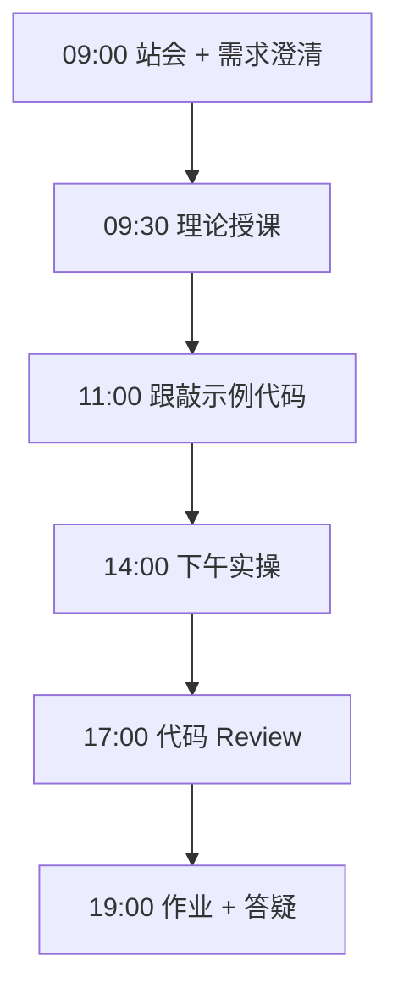
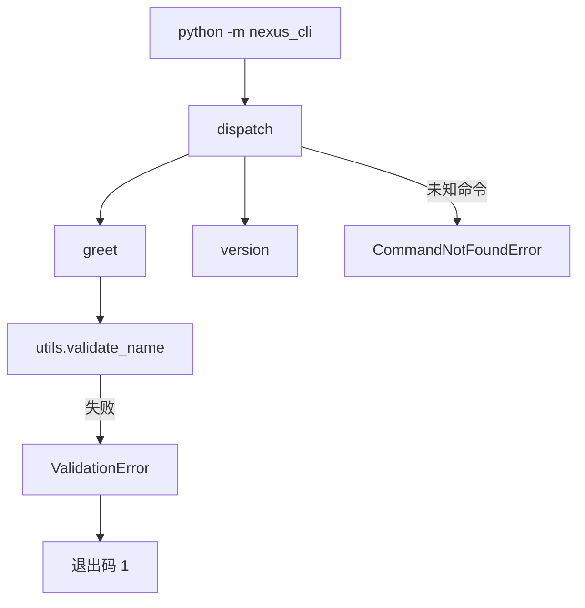

# Day 10：模块、包与异常 — nexus_cli 包结构

> **阶段**：第一阶段:Python编程基础 | **Epic**：NEXUS-E1 | **预计学时**：6-8 小时

## 旁白解读：今日上下文

> 🎬 **模拟站会 09:00** — 智链科技 Nexus 项目组

**陈工**：昨天模型类散在三个文件里，import 路径乱七八糟。今天把它们组织成标准 Python 包 `nexus_cli`。

**小王**：`__init__.py` 一定要写吗？Python 3.3 不是有 namespace package？

**陈工**：教学项目和平台代码我们统一显式 `__init__.py`，导出 `__all__`，IDE 自动补全才好用。`python -m nexus_cli` 是以后平台 CLI 的标准启动方式。

**林悦**：用户输错命令时别抛一屏 Traceback，要友好提示。

**陈工**：自定义异常层次：`NexusCLIError` 基类，子类 `ValidationError`、`CommandNotFoundError`。`__main__.py` 里统一 catch，打印中文错误，退出码 1。

**运维老周**：退出码规范很重要，CI 脚本靠这个判断成功失败。KeyboardInterrupt 返回 130 是 Unix 惯例。


**今日在 NexusAgent 主线中的位置**：platform/nexus_agent/cli/ 包结构原型

**今日 Jira 看板**：
- `NEXUS-1001`
- `NEXUS-1002`
- `NEXUS-1003`

---


## 需求文档（产品林悦下发）

**文档编号**：PRD-NEXUS-D10  
**版本**：v1.0  
**优先级**：P0

### 背景

第一阶段:Python编程基础阶段第 10 天教学任务，与 NexusAgent 主线项目对齐。

### User Stories

### NEXUS-1001

**描述**：模块、包与异常 — nexus_cli 包结构 相关交付

**验收标准**：
- [ ] 代码可本地运行
- [ ] 通过 `scripts/verify_day.py --day 10`

### NEXUS-1002

**描述**：模块、包与异常 — nexus_cli 包结构 相关交付

**验收标准**：
- [ ] 代码可本地运行
- [ ] 通过 `scripts/verify_day.py --day 10`

### NEXUS-1003

**描述**：模块、包与异常 — nexus_cli 包结构 相关交付

**验收标准**：
- [ ] 代码可本地运行
- [ ] 通过 `scripts/verify_day.py --day 10`


---


## 今日课表

### 上午 09:00-12:00

- 09:00 站会：昨日模型适配层合并 develop，今日打包成可安装 CLI
- 09:30 理论：import 机制、模块搜索路径 sys.path
- 10:30 理论：包 package、`__init__.py`、`__all__`
- 11:00 跟敲 nexus_cli 目录结构与 exceptions 层次

### 下午 14:00-17:30

- 14:00 实现 commands.py 与 argparse 子命令
- 14:30 实现 __main__.py，掌握 python -m 运行方式
- 16:00 异常处理：自定义异常 vs 裸 except
- 17:00 演示：故意触发 ValidationError 观察退出码

### 晚自习 19:00-21:00

- 19:00 作业：新增 `echo` 子命令
- 20:00 阅读 PEP 8 导入顺序规范

---


## 课堂笔记

### 核心知识点速查

| 序号 | 知识点 | 代码位置 |
|------|--------|----------|
| 1 | 模块 module 与包 package 区别 | 见下午实操 |
| 2 | __init__.py 包初始化与 __all__ | 见下午实操 |
| 3 | 相对导入 vs 绝对导入 | 见下午实操 |
| 4 | python -m package 运行机制 | 见下午实操 |
| 5 | __main__.py 包入口 | 见下午实操 |
| 6 | argparse 子命令 subparsers | 见下午实操 |
| 7 | 自定义异常继承 Exception | 见下午实操 |
| 8 | 异常层次与语义化错误码 | 见下午实操 |
| 9 | 进程退出码 exit code 约定 | 见下午实操 |

### 今日流程图



### 架构示意图（当日目标）



---


## 实操代码清单

- `code/nexus_cli/__init__.py`
- `code/nexus_cli/__main__.py`
- `code/nexus_cli/commands.py`
- `code/nexus_cli/utils.py`
- `code/nexus_cli/exceptions.py`
- `code/run_package_demo.py`

请按顺序创建并运行。每段代码均可直接复制到对应文件执行。

---

## 实验手册（分时段操作表）

### 实验步骤 1：09:30-10:30 理论

| 时间 | 动作 | 预期结果 | 失败处理 |
|------|------|----------|----------|
| +0min | 打开课件本节 | 看到需求与验收标准 | 检查是否拉取最新 `develop` 分支 |
| +10min | 创建/打开当日 `code/` 文件 | 文件路径与清单一致 | 对照「实操代码清单」 |
| +30min | 粘贴并运行第一个脚本 | 终端有正常输出无 Traceback | 见下方「排错手册」 |
| +60min | 完成全部文件并自测 | `python3` 运行通过 | 使用 `scripts/verify_day.py --day 10` |
| +90min | 提交 Git 并建 MR | MR 关联 Jira NEXUS-1001 | 按附录 Git 示例操作 |


### 实验步骤 2：10:30-12:00 跟敲

| 时间 | 动作 | 预期结果 | 失败处理 |
|------|------|----------|----------|
| +0min | 打开课件本节 | 看到需求与验收标准 | 检查是否拉取最新 `develop` 分支 |
| +10min | 创建/打开当日 `code/` 文件 | 文件路径与清单一致 | 对照「实操代码清单」 |
| +30min | 粘贴并运行第一个脚本 | 终端有正常输出无 Traceback | 见下方「排错手册」 |
| +60min | 完成全部文件并自测 | `python3` 运行通过 | 使用 `scripts/verify_day.py --day 10` |
| +90min | 提交 Git 并建 MR | MR 关联 Jira NEXUS-1001 | 按附录 Git 示例操作 |


### 实验步骤 3：14:00-15:30 实操

| 时间 | 动作 | 预期结果 | 失败处理 |
|------|------|----------|----------|
| +0min | 打开课件本节 | 看到需求与验收标准 | 检查是否拉取最新 `develop` 分支 |
| +10min | 创建/打开当日 `code/` 文件 | 文件路径与清单一致 | 对照「实操代码清单」 |
| +30min | 粘贴并运行第一个脚本 | 终端有正常输出无 Traceback | 见下方「排错手册」 |
| +60min | 完成全部文件并自测 | `python3` 运行通过 | 使用 `scripts/verify_day.py --day 10` |
| +90min | 提交 Git 并建 MR | MR 关联 Jira NEXUS-1001 | 按附录 Git 示例操作 |


### 实验步骤 4：15:30-17:00 联调

| 时间 | 动作 | 预期结果 | 失败处理 |
|------|------|----------|----------|
| +0min | 打开课件本节 | 看到需求与验收标准 | 检查是否拉取最新 `develop` 分支 |
| +10min | 创建/打开当日 `code/` 文件 | 文件路径与清单一致 | 对照「实操代码清单」 |
| +30min | 粘贴并运行第一个脚本 | 终端有正常输出无 Traceback | 见下方「排错手册」 |
| +60min | 完成全部文件并自测 | `python3` 运行通过 | 使用 `scripts/verify_day.py --day 10` |
| +90min | 提交 Git 并建 MR | MR 关联 Jira NEXUS-1001 | 按附录 Git 示例操作 |


### 实验步骤 5：19:00-20:30 作业

| 时间 | 动作 | 预期结果 | 失败处理 |
|------|------|----------|----------|
| +0min | 打开课件本节 | 看到需求与验收标准 | 检查是否拉取最新 `develop` 分支 |
| +10min | 创建/打开当日 `code/` 文件 | 文件路径与清单一致 | 对照「实操代码清单」 |
| +30min | 粘贴并运行第一个脚本 | 终端有正常输出无 Traceback | 见下方「排错手册」 |
| +60min | 完成全部文件并自测 | `python3` 运行通过 | 使用 `scripts/verify_day.py --day 10` |
| +90min | 提交 Git 并建 MR | MR 关联 Jira NEXUS-1001 | 按附录 Git 示例操作 |


### 排错手册（Day 10）

1. **`command not found: python3`** → 安装 Python 3.10+ 或使用 `py -3`（Windows）
2. **`ModuleNotFoundError`** → 确认当前目录、是否激活 venv、`pip install -r requirements.txt`（若当日有）
3. **`SyntaxError: invalid syntax`** → 检查上一行是否缺括号、引号是否中文
4. **`UnicodeDecodeError`** → 文件保存为 UTF-8，终端 `export PYTHONIOENCODING=utf-8`
5. **API 相关（Day12+）** → 检查 `.env` 中 Key，无 Key 时使用课件 MOCK 模式

---


## 逐步跟敲指南（完整源码与解析）

> 以下代码与 `code/` 目录完全一致，可直接复制。每段附行级说明。

### 文件：`code/nexus_cli/__init__.py`

**操作步骤**：
1. 在 `courseware/day-10/code/` 下创建文件 `nexus_cli/__init__.py`
2. 完整粘贴下方代码
3. 在终端执行：`cd courseware/day-10/code && python3 __init__.py`（若为包内模块则按课件说明）

```python
"""
nexus_cli — 智链科技 Nexus 命令行工具包（Day 10 教学示例）

包结构说明:
    nexus_cli/
    ├── __init__.py      # 包入口，导出公共 API
    ├── __main__.py      # python -m nexus_cli 入口
    ├── commands.py      # 子命令实现
    ├── utils.py         # 工具函数
    └── exceptions.py    # 自定义异常层次
"""
from nexus_cli.commands import run_greet, run_version
from nexus_cli.exceptions import NexusCLIError

__version__ = "0.1.0"
__all__ = ["run_greet", "run_version", "NexusCLIError", "__version__"]

```

**解析要点（`nexus_cli/__init__.py`）**：

- 共 **16** 行，请逐行阅读注释中的中文说明

- 运行前确认 Python 版本 ≥ 3.10：`python3 --version`

- 若报错，先检查缩进是否为 4 空格，勿混用 Tab

- 企业 Review 清单：命名是否清晰、是否有异常处理、是否可复用

---

### 文件：`code/nexus_cli/__main__.py`

**操作步骤**：
1. 在 `courseware/day-10/code/` 下创建文件 `nexus_cli/__main__.py`
2. 完整粘贴下方代码
3. 在终端执行：`cd courseware/day-10/code && python3 __main__.py`（若为包内模块则按课件说明）

```python
#!/usr/bin/env python3
"""
包模块入口：python -m nexus_cli

Python 通过 __main__.py 支持将包作为脚本运行。
"""
from __future__ import annotations

import sys

from nexus_cli.commands import dispatch
from nexus_cli.exceptions import NexusCLIError


def main(argv: list[str] | None = None) -> int:
    """CLI 主函数，返回进程退出码（0=成功，非0=失败）。"""
    argv = argv if argv is not None else sys.argv[1:]
    try:
        return dispatch(argv)
    except NexusCLIError as e:
        print(f"错误: {e}", file=sys.stderr)
        return 1
    except KeyboardInterrupt:
        print("\n已取消", file=sys.stderr)
        return 130


if __name__ == "__main__":
    raise SystemExit(main())

```

**解析要点（`nexus_cli/__main__.py`）**：

- 共 **29** 行，请逐行阅读注释中的中文说明

- 运行前确认 Python 版本 ≥ 3.10：`python3 --version`

- 若报错，先检查缩进是否为 4 空格，勿混用 Tab

- 企业 Review 清单：命名是否清晰、是否有异常处理、是否可复用

---

### 文件：`code/nexus_cli/commands.py`

**操作步骤**：
1. 在 `courseware/day-10/code/` 下创建文件 `nexus_cli/commands.py`
2. 完整粘贴下方代码
3. 在终端执行：`cd courseware/day-10/code && python3 commands.py`（若为包内模块则按课件说明）

```python
"""nexus_cli 子命令实现模块。"""
from __future__ import annotations

import argparse

from nexus_cli import __version__
from nexus_cli.exceptions import CommandNotFoundError
from nexus_cli.utils import banner, validate_name


def run_greet(name: str) -> None:
    """greet 子命令：向指定用户问好。"""
    validate_name(name)
    print(banner())
    print(f"你好，{name}！欢迎使用 Nexus CLI v{__version__}")


def run_version() -> None:
    """version 子命令：打印版本号。"""
    print(f"nexus_cli/{__version__}")


def build_parser() -> argparse.ArgumentParser:
    """构建 argparse 解析器，定义子命令。"""
    parser = argparse.ArgumentParser(prog="nexus_cli", description="Nexus 命令行工具")
    sub = parser.add_subparsers(dest="command", required=True)

    greet_p = sub.add_parser("greet", help="问候用户")
    greet_p.add_argument("name", help="用户名")

    sub.add_parser("version", help="显示版本")

    return parser


def dispatch(argv: list[str]) -> int:
    """根据 argv 分发到对应子命令处理函数。"""
    parser = build_parser()
    args = parser.parse_args(argv)

    if args.command == "greet":
        run_greet(args.name)
    elif args.command == "version":
        run_version()
    else:
        raise CommandNotFoundError(args.command)
    return 0

```

**解析要点（`nexus_cli/commands.py`）**：

- 共 **47** 行，请逐行阅读注释中的中文说明

- 运行前确认 Python 版本 ≥ 3.10：`python3 --version`

- 若报错，先检查缩进是否为 4 空格，勿混用 Tab

- 企业 Review 清单：命名是否清晰、是否有异常处理、是否可复用

---

### 文件：`code/nexus_cli/utils.py`

**操作步骤**：
1. 在 `courseware/day-10/code/` 下创建文件 `nexus_cli/utils.py`
2. 完整粘贴下方代码
3. 在终端执行：`cd courseware/day-10/code && python3 utils.py`（若为包内模块则按课件说明）

```python
"""nexus_cli 工具函数。"""
from __future__ import annotations

from nexus_cli.exceptions import ValidationError


def banner() -> str:
    """返回 ASCII 品牌横幅。"""
    return """
╔══════════════════════════════════╗
║     NexusAgent CLI  v0.1         ║
║     智链科技 SmartLink Tech      ║
╚══════════════════════════════════╝
""".strip()


def validate_name(name: str) -> None:
    """校验用户名：非空、长度 2-20、仅字母数字下划线中文。"""
    if not name or not name.strip():
        raise ValidationError("用户名不能为空")
    if len(name) > 20:
        raise ValidationError("用户名不能超过 20 个字符")

```

**解析要点（`nexus_cli/utils.py`）**：

- 共 **22** 行，请逐行阅读注释中的中文说明

- 运行前确认 Python 版本 ≥ 3.10：`python3 --version`

- 若报错，先检查缩进是否为 4 空格，勿混用 Tab

- 企业 Review 清单：命名是否清晰、是否有异常处理、是否可复用

---

### 文件：`code/nexus_cli/exceptions.py`

**操作步骤**：
1. 在 `courseware/day-10/code/` 下创建文件 `nexus_cli/exceptions.py`
2. 完整粘贴下方代码
3. 在终端执行：`cd courseware/day-10/code && python3 exceptions.py`（若为包内模块则按课件说明）

```python
"""nexus_cli 自定义异常层次。

企业代码应使用语义化异常，便于上层统一捕获与日志分类。
"""
from __future__ import annotations


class NexusCLIError(Exception):
    """所有 Nexus CLI 异常的基类。"""

    def __init__(self, message: str, code: str = "NEXUS_CLI_ERROR") -> None:
        super().__init__(message)
        self.message = message
        self.code = code


class ValidationError(NexusCLIError):
    """输入校验失败。"""

    def __init__(self, message: str) -> None:
        super().__init__(message, code="VALIDATION_ERROR")


class CommandNotFoundError(NexusCLIError):
    """未知子命令。"""

    def __init__(self, command: str) -> None:
        super().__init__(f"未知命令: {command}", code="COMMAND_NOT_FOUND")
        self.command = command

```

**解析要点（`nexus_cli/exceptions.py`）**：

- 共 **29** 行，请逐行阅读注释中的中文说明

- 运行前确认 Python 版本 ≥ 3.10：`python3 --version`

- 若报错，先检查缩进是否为 4 空格，勿混用 Tab

- 企业 Review 清单：命名是否清晰、是否有异常处理、是否可复用

---

### 文件：`code/run_package_demo.py`

**操作步骤**：
1. 在 `courseware/day-10/code/` 下创建文件 `run_package_demo.py`
2. 完整粘贴下方代码
3. 在终端执行：`cd courseware/day-10/code && python3 run_package_demo.py`（若为包内模块则按课件说明）

```python
#!/usr/bin/env python3
"""
Day 10 演示：以包方式运行 nexus_cli

在 code/ 目录下执行:
    python -m nexus_cli greet 张三
    python -m nexus_cli version
"""
from __future__ import annotations

import subprocess
import sys
from pathlib import Path

CODE_DIR = Path(__file__).resolve().parent


def run(cmd: list[str]) -> None:
    print(f"$ {' '.join(cmd)}")
    subprocess.run(cmd, cwd=CODE_DIR, check=False)
    print()


if __name__ == "__main__":
    py = sys.executable
    run([py, "-m", "nexus_cli", "greet", "林悦"])
    run([py, "-m", "nexus_cli", "version"])
    # 触发 ValidationError
    run([py, "-m", "nexus_cli", "greet", ""])

```

**解析要点（`run_package_demo.py`）**：

- 共 **29** 行，请逐行阅读注释中的中文说明

- 运行前确认 Python 版本 ≥ 3.10：`python3 --version`

- 若报错，先检查缩进是否为 4 空格，勿混用 Tab

- 企业 Review 清单：命名是否清晰、是否有异常处理、是否可复用

---


### 深度讲解 1：模块 module 与包 package 区别

在企业级 Python 开发与大模型应用工程中，**模块 module 与包 package 区别** 是学员必须牢固掌握的基本功。智链科技 Nexus 项目组在 Day 10 的代码评审中，特别强调以下几点：

1. **为什么学**：模块 module 与包 package 区别 直接服务于后续 NexusAgent 平台的 `NEXUS-E1` 模块。没有扎实的 模块 module 与包 package 区别，Day 17 之后调用 API、解析 JSON、编写 Agent 工具函数时会出现大量低级错误。

2. **常见坑**：
   - 忽略输入类型校验，导致运行时 `TypeError`
   - 编码问题（Windows 默认 GBK vs UTF-8）
   - 复制粘贴时缩进错乱（Python 对缩进敏感）

3. **企业实践**：在 SmartLink 的 GitLab 仓库中，所有与 模块 module 与包 package 区别 相关的代码必须经过 Ruff 静态检查；变量命名使用 `snake_case`，常量使用 `UPPER_SNAKE_CASE`。

4. **与主线项目的关系**：今日代码位于 `courseware/day-10/code/`，部分模块将逐步合并到 `platform/nexus_agent/`。请养成「每日代码皆可运行、皆可测试」的习惯。

5. **扩展阅读建议**：完成今日作业后，可阅读 `docs/project-master-plan.md` 中关于 NEXUS-E1 的章节，建立全局视角。

**课堂互动题**：请用 3 句话向非技术同事解释「模块 module 与包 package 区别」是什么。写在作业 MR 的评论里，讲师会抽查点评。

**实操检查清单**：
- [ ] 能不看课件复述 模块 module 与包 package 区别 的定义
- [ ] 能独立写出相关代码并运行
- [ ] 能向同学讲解一处容易写错的地方


### 深度讲解 2：__init__.py 包初始化与 __all__

在企业级 Python 开发与大模型应用工程中，**__init__.py 包初始化与 __all__** 是学员必须牢固掌握的基本功。智链科技 Nexus 项目组在 Day 10 的代码评审中，特别强调以下几点：

1. **为什么学**：__init__.py 包初始化与 __all__ 直接服务于后续 NexusAgent 平台的 `NEXUS-E1` 模块。没有扎实的 __init__.py 包初始化与 __all__，Day 17 之后调用 API、解析 JSON、编写 Agent 工具函数时会出现大量低级错误。

2. **常见坑**：
   - 忽略输入类型校验，导致运行时 `TypeError`
   - 编码问题（Windows 默认 GBK vs UTF-8）
   - 复制粘贴时缩进错乱（Python 对缩进敏感）

3. **企业实践**：在 SmartLink 的 GitLab 仓库中，所有与 __init__.py 包初始化与 __all__ 相关的代码必须经过 Ruff 静态检查；变量命名使用 `snake_case`，常量使用 `UPPER_SNAKE_CASE`。

4. **与主线项目的关系**：今日代码位于 `courseware/day-10/code/`，部分模块将逐步合并到 `platform/nexus_agent/`。请养成「每日代码皆可运行、皆可测试」的习惯。

5. **扩展阅读建议**：完成今日作业后，可阅读 `docs/project-master-plan.md` 中关于 NEXUS-E1 的章节，建立全局视角。

**课堂互动题**：请用 3 句话向非技术同事解释「__init__.py 包初始化与 __all__」是什么。写在作业 MR 的评论里，讲师会抽查点评。

**实操检查清单**：
- [ ] 能不看课件复述 __init__.py 包初始化与 __all__ 的定义
- [ ] 能独立写出相关代码并运行
- [ ] 能向同学讲解一处容易写错的地方


### 深度讲解 3：相对导入 vs 绝对导入

在企业级 Python 开发与大模型应用工程中，**相对导入 vs 绝对导入** 是学员必须牢固掌握的基本功。智链科技 Nexus 项目组在 Day 10 的代码评审中，特别强调以下几点：

1. **为什么学**：相对导入 vs 绝对导入 直接服务于后续 NexusAgent 平台的 `NEXUS-E1` 模块。没有扎实的 相对导入 vs 绝对导入，Day 17 之后调用 API、解析 JSON、编写 Agent 工具函数时会出现大量低级错误。

2. **常见坑**：
   - 忽略输入类型校验，导致运行时 `TypeError`
   - 编码问题（Windows 默认 GBK vs UTF-8）
   - 复制粘贴时缩进错乱（Python 对缩进敏感）

3. **企业实践**：在 SmartLink 的 GitLab 仓库中，所有与 相对导入 vs 绝对导入 相关的代码必须经过 Ruff 静态检查；变量命名使用 `snake_case`，常量使用 `UPPER_SNAKE_CASE`。

4. **与主线项目的关系**：今日代码位于 `courseware/day-10/code/`，部分模块将逐步合并到 `platform/nexus_agent/`。请养成「每日代码皆可运行、皆可测试」的习惯。

5. **扩展阅读建议**：完成今日作业后，可阅读 `docs/project-master-plan.md` 中关于 NEXUS-E1 的章节，建立全局视角。

**课堂互动题**：请用 3 句话向非技术同事解释「相对导入 vs 绝对导入」是什么。写在作业 MR 的评论里，讲师会抽查点评。

**实操检查清单**：
- [ ] 能不看课件复述 相对导入 vs 绝对导入 的定义
- [ ] 能独立写出相关代码并运行
- [ ] 能向同学讲解一处容易写错的地方


### 深度讲解 4：python -m package 运行机制

在企业级 Python 开发与大模型应用工程中，**python -m package 运行机制** 是学员必须牢固掌握的基本功。智链科技 Nexus 项目组在 Day 10 的代码评审中，特别强调以下几点：

1. **为什么学**：python -m package 运行机制 直接服务于后续 NexusAgent 平台的 `NEXUS-E1` 模块。没有扎实的 python -m package 运行机制，Day 17 之后调用 API、解析 JSON、编写 Agent 工具函数时会出现大量低级错误。

2. **常见坑**：
   - 忽略输入类型校验，导致运行时 `TypeError`
   - 编码问题（Windows 默认 GBK vs UTF-8）
   - 复制粘贴时缩进错乱（Python 对缩进敏感）

3. **企业实践**：在 SmartLink 的 GitLab 仓库中，所有与 python -m package 运行机制 相关的代码必须经过 Ruff 静态检查；变量命名使用 `snake_case`，常量使用 `UPPER_SNAKE_CASE`。

4. **与主线项目的关系**：今日代码位于 `courseware/day-10/code/`，部分模块将逐步合并到 `platform/nexus_agent/`。请养成「每日代码皆可运行、皆可测试」的习惯。

5. **扩展阅读建议**：完成今日作业后，可阅读 `docs/project-master-plan.md` 中关于 NEXUS-E1 的章节，建立全局视角。

**课堂互动题**：请用 3 句话向非技术同事解释「python -m package 运行机制」是什么。写在作业 MR 的评论里，讲师会抽查点评。

**实操检查清单**：
- [ ] 能不看课件复述 python -m package 运行机制 的定义
- [ ] 能独立写出相关代码并运行
- [ ] 能向同学讲解一处容易写错的地方


### 深度讲解 5：__main__.py 包入口

在企业级 Python 开发与大模型应用工程中，**__main__.py 包入口** 是学员必须牢固掌握的基本功。智链科技 Nexus 项目组在 Day 10 的代码评审中，特别强调以下几点：

1. **为什么学**：__main__.py 包入口 直接服务于后续 NexusAgent 平台的 `NEXUS-E1` 模块。没有扎实的 __main__.py 包入口，Day 17 之后调用 API、解析 JSON、编写 Agent 工具函数时会出现大量低级错误。

2. **常见坑**：
   - 忽略输入类型校验，导致运行时 `TypeError`
   - 编码问题（Windows 默认 GBK vs UTF-8）
   - 复制粘贴时缩进错乱（Python 对缩进敏感）

3. **企业实践**：在 SmartLink 的 GitLab 仓库中，所有与 __main__.py 包入口 相关的代码必须经过 Ruff 静态检查；变量命名使用 `snake_case`，常量使用 `UPPER_SNAKE_CASE`。

4. **与主线项目的关系**：今日代码位于 `courseware/day-10/code/`，部分模块将逐步合并到 `platform/nexus_agent/`。请养成「每日代码皆可运行、皆可测试」的习惯。

5. **扩展阅读建议**：完成今日作业后，可阅读 `docs/project-master-plan.md` 中关于 NEXUS-E1 的章节，建立全局视角。

**课堂互动题**：请用 3 句话向非技术同事解释「__main__.py 包入口」是什么。写在作业 MR 的评论里，讲师会抽查点评。

**实操检查清单**：
- [ ] 能不看课件复述 __main__.py 包入口 的定义
- [ ] 能独立写出相关代码并运行
- [ ] 能向同学讲解一处容易写错的地方


### 深度讲解 6：argparse 子命令 subparsers

在企业级 Python 开发与大模型应用工程中，**argparse 子命令 subparsers** 是学员必须牢固掌握的基本功。智链科技 Nexus 项目组在 Day 10 的代码评审中，特别强调以下几点：

1. **为什么学**：argparse 子命令 subparsers 直接服务于后续 NexusAgent 平台的 `NEXUS-E1` 模块。没有扎实的 argparse 子命令 subparsers，Day 17 之后调用 API、解析 JSON、编写 Agent 工具函数时会出现大量低级错误。

2. **常见坑**：
   - 忽略输入类型校验，导致运行时 `TypeError`
   - 编码问题（Windows 默认 GBK vs UTF-8）
   - 复制粘贴时缩进错乱（Python 对缩进敏感）

3. **企业实践**：在 SmartLink 的 GitLab 仓库中，所有与 argparse 子命令 subparsers 相关的代码必须经过 Ruff 静态检查；变量命名使用 `snake_case`，常量使用 `UPPER_SNAKE_CASE`。

4. **与主线项目的关系**：今日代码位于 `courseware/day-10/code/`，部分模块将逐步合并到 `platform/nexus_agent/`。请养成「每日代码皆可运行、皆可测试」的习惯。

5. **扩展阅读建议**：完成今日作业后，可阅读 `docs/project-master-plan.md` 中关于 NEXUS-E1 的章节，建立全局视角。

**课堂互动题**：请用 3 句话向非技术同事解释「argparse 子命令 subparsers」是什么。写在作业 MR 的评论里，讲师会抽查点评。

**实操检查清单**：
- [ ] 能不看课件复述 argparse 子命令 subparsers 的定义
- [ ] 能独立写出相关代码并运行
- [ ] 能向同学讲解一处容易写错的地方


### 深度讲解 7：自定义异常继承 Exception

在企业级 Python 开发与大模型应用工程中，**自定义异常继承 Exception** 是学员必须牢固掌握的基本功。智链科技 Nexus 项目组在 Day 10 的代码评审中，特别强调以下几点：

1. **为什么学**：自定义异常继承 Exception 直接服务于后续 NexusAgent 平台的 `NEXUS-E1` 模块。没有扎实的 自定义异常继承 Exception，Day 17 之后调用 API、解析 JSON、编写 Agent 工具函数时会出现大量低级错误。

2. **常见坑**：
   - 忽略输入类型校验，导致运行时 `TypeError`
   - 编码问题（Windows 默认 GBK vs UTF-8）
   - 复制粘贴时缩进错乱（Python 对缩进敏感）

3. **企业实践**：在 SmartLink 的 GitLab 仓库中，所有与 自定义异常继承 Exception 相关的代码必须经过 Ruff 静态检查；变量命名使用 `snake_case`，常量使用 `UPPER_SNAKE_CASE`。

4. **与主线项目的关系**：今日代码位于 `courseware/day-10/code/`，部分模块将逐步合并到 `platform/nexus_agent/`。请养成「每日代码皆可运行、皆可测试」的习惯。

5. **扩展阅读建议**：完成今日作业后，可阅读 `docs/project-master-plan.md` 中关于 NEXUS-E1 的章节，建立全局视角。

**课堂互动题**：请用 3 句话向非技术同事解释「自定义异常继承 Exception」是什么。写在作业 MR 的评论里，讲师会抽查点评。

**实操检查清单**：
- [ ] 能不看课件复述 自定义异常继承 Exception 的定义
- [ ] 能独立写出相关代码并运行
- [ ] 能向同学讲解一处容易写错的地方


### 深度讲解 8：异常层次与语义化错误码

在企业级 Python 开发与大模型应用工程中，**异常层次与语义化错误码** 是学员必须牢固掌握的基本功。智链科技 Nexus 项目组在 Day 10 的代码评审中，特别强调以下几点：

1. **为什么学**：异常层次与语义化错误码 直接服务于后续 NexusAgent 平台的 `NEXUS-E1` 模块。没有扎实的 异常层次与语义化错误码，Day 17 之后调用 API、解析 JSON、编写 Agent 工具函数时会出现大量低级错误。

2. **常见坑**：
   - 忽略输入类型校验，导致运行时 `TypeError`
   - 编码问题（Windows 默认 GBK vs UTF-8）
   - 复制粘贴时缩进错乱（Python 对缩进敏感）

3. **企业实践**：在 SmartLink 的 GitLab 仓库中，所有与 异常层次与语义化错误码 相关的代码必须经过 Ruff 静态检查；变量命名使用 `snake_case`，常量使用 `UPPER_SNAKE_CASE`。

4. **与主线项目的关系**：今日代码位于 `courseware/day-10/code/`，部分模块将逐步合并到 `platform/nexus_agent/`。请养成「每日代码皆可运行、皆可测试」的习惯。

5. **扩展阅读建议**：完成今日作业后，可阅读 `docs/project-master-plan.md` 中关于 NEXUS-E1 的章节，建立全局视角。

**课堂互动题**：请用 3 句话向非技术同事解释「异常层次与语义化错误码」是什么。写在作业 MR 的评论里，讲师会抽查点评。

**实操检查清单**：
- [ ] 能不看课件复述 异常层次与语义化错误码 的定义
- [ ] 能独立写出相关代码并运行
- [ ] 能向同学讲解一处容易写错的地方


### 深度讲解 9：进程退出码 exit code 约定

在企业级 Python 开发与大模型应用工程中，**进程退出码 exit code 约定** 是学员必须牢固掌握的基本功。智链科技 Nexus 项目组在 Day 10 的代码评审中，特别强调以下几点：

1. **为什么学**：进程退出码 exit code 约定 直接服务于后续 NexusAgent 平台的 `NEXUS-E1` 模块。没有扎实的 进程退出码 exit code 约定，Day 17 之后调用 API、解析 JSON、编写 Agent 工具函数时会出现大量低级错误。

2. **常见坑**：
   - 忽略输入类型校验，导致运行时 `TypeError`
   - 编码问题（Windows 默认 GBK vs UTF-8）
   - 复制粘贴时缩进错乱（Python 对缩进敏感）

3. **企业实践**：在 SmartLink 的 GitLab 仓库中，所有与 进程退出码 exit code 约定 相关的代码必须经过 Ruff 静态检查；变量命名使用 `snake_case`，常量使用 `UPPER_SNAKE_CASE`。

4. **与主线项目的关系**：今日代码位于 `courseware/day-10/code/`，部分模块将逐步合并到 `platform/nexus_agent/`。请养成「每日代码皆可运行、皆可测试」的习惯。

5. **扩展阅读建议**：完成今日作业后，可阅读 `docs/project-master-plan.md` 中关于 NEXUS-E1 的章节，建立全局视角。

**课堂互动题**：请用 3 句话向非技术同事解释「进程退出码 exit code 约定」是什么。写在作业 MR 的评论里，讲师会抽查点评。

**实操检查清单**：
- [ ] 能不看课件复述 进程退出码 exit code 约定 的定义
- [ ] 能独立写出相关代码并运行
- [ ] 能向同学讲解一处容易写错的地方


## 阶段复盘锚点（第一阶段:Python编程基础）

今天是 **第一阶段:Python编程基础** 的第 **10** 个学习日。请回顾：

- 昨天学了什么？今天如何承接？
- 今天的内容在 70 天路线图中的坐标？
- 如果我是 Tech Lead，会如何 Review 今日代码？

**陈工寄语**：慢即是快。企业里没人关心你一天学了多少个语法点，只关心你写的脚本能不能在服务器上稳定跑 7×24 小时。今天把地基打牢，后面 Agent 编排、RAG 检索才不会塌。

**林悦补充**：产品侧只验收「用户能感知到的价值」。今日交付虽然简单，但「个人信息卡片」本质是后续「用户画像 Agent」的数据采集原型——字段设计请认真思考。

**代码量统计（累计）**：完成今日后，个人仓库累计约 **14000** 行（含注释与测试），全营目标 10 万行。

**明日预告**：请提前阅读 `courseware/day-11/README.md` 开头的旁白，了解上下文。


## 常见问题 FAQ（讲师答疑实录）


**Q1：学习「模块 module 与包 package 区别」时最常问的问题是什么？**

A：学员常问「这在大模型开发里到底用在哪里」。直接回答：在 NexusAgent 的 `NEXUS-E1` 中，模块 module 与包 package 区别 用于支撑「模块、包与异常 — nexus_cli 包结构」这一交付。建议你打开 `platform/` 对照看未来模块如何引用今日写法。另一个常见问题是「要不要背语法」——不需要背，但要能写出可运行代码，并能在报错时读懂 Traceback。

**追问**：如果线上报错与 模块 module 与包 package 区别 相关，如何排查？  
**答**：① 复现 ② 最小化输入 ③ 打印中间变量 ④ 查 GitLab 历史 diff ⑤ 在 Jira 建 Bug 单附上日志。


**Q2：学习「__init__.py 包初始化与 __all__」时最常问的问题是什么？**

A：学员常问「这在大模型开发里到底用在哪里」。直接回答：在 NexusAgent 的 `NEXUS-E1` 中，__init__.py 包初始化与 __all__ 用于支撑「模块、包与异常 — nexus_cli 包结构」这一交付。建议你打开 `platform/` 对照看未来模块如何引用今日写法。另一个常见问题是「要不要背语法」——不需要背，但要能写出可运行代码，并能在报错时读懂 Traceback。

**追问**：如果线上报错与 __init__.py 包初始化与 __all__ 相关，如何排查？  
**答**：① 复现 ② 最小化输入 ③ 打印中间变量 ④ 查 GitLab 历史 diff ⑤ 在 Jira 建 Bug 单附上日志。


**Q3：学习「相对导入 vs 绝对导入」时最常问的问题是什么？**

A：学员常问「这在大模型开发里到底用在哪里」。直接回答：在 NexusAgent 的 `NEXUS-E1` 中，相对导入 vs 绝对导入 用于支撑「模块、包与异常 — nexus_cli 包结构」这一交付。建议你打开 `platform/` 对照看未来模块如何引用今日写法。另一个常见问题是「要不要背语法」——不需要背，但要能写出可运行代码，并能在报错时读懂 Traceback。

**追问**：如果线上报错与 相对导入 vs 绝对导入 相关，如何排查？  
**答**：① 复现 ② 最小化输入 ③ 打印中间变量 ④ 查 GitLab 历史 diff ⑤ 在 Jira 建 Bug 单附上日志。


**Q4：学习「python -m package 运行机制」时最常问的问题是什么？**

A：学员常问「这在大模型开发里到底用在哪里」。直接回答：在 NexusAgent 的 `NEXUS-E1` 中，python -m package 运行机制 用于支撑「模块、包与异常 — nexus_cli 包结构」这一交付。建议你打开 `platform/` 对照看未来模块如何引用今日写法。另一个常见问题是「要不要背语法」——不需要背，但要能写出可运行代码，并能在报错时读懂 Traceback。

**追问**：如果线上报错与 python -m package 运行机制 相关，如何排查？  
**答**：① 复现 ② 最小化输入 ③ 打印中间变量 ④ 查 GitLab 历史 diff ⑤ 在 Jira 建 Bug 单附上日志。


**Q5：学习「__main__.py 包入口」时最常问的问题是什么？**

A：学员常问「这在大模型开发里到底用在哪里」。直接回答：在 NexusAgent 的 `NEXUS-E1` 中，__main__.py 包入口 用于支撑「模块、包与异常 — nexus_cli 包结构」这一交付。建议你打开 `platform/` 对照看未来模块如何引用今日写法。另一个常见问题是「要不要背语法」——不需要背，但要能写出可运行代码，并能在报错时读懂 Traceback。

**追问**：如果线上报错与 __main__.py 包入口 相关，如何排查？  
**答**：① 复现 ② 最小化输入 ③ 打印中间变量 ④ 查 GitLab 历史 diff ⑤ 在 Jira 建 Bug 单附上日志。


**Q6：学习「argparse 子命令 subparsers」时最常问的问题是什么？**

A：学员常问「这在大模型开发里到底用在哪里」。直接回答：在 NexusAgent 的 `NEXUS-E1` 中，argparse 子命令 subparsers 用于支撑「模块、包与异常 — nexus_cli 包结构」这一交付。建议你打开 `platform/` 对照看未来模块如何引用今日写法。另一个常见问题是「要不要背语法」——不需要背，但要能写出可运行代码，并能在报错时读懂 Traceback。

**追问**：如果线上报错与 argparse 子命令 subparsers 相关，如何排查？  
**答**：① 复现 ② 最小化输入 ③ 打印中间变量 ④ 查 GitLab 历史 diff ⑤ 在 Jira 建 Bug 单附上日志。


**Q7：学习「自定义异常继承 Exception」时最常问的问题是什么？**

A：学员常问「这在大模型开发里到底用在哪里」。直接回答：在 NexusAgent 的 `NEXUS-E1` 中，自定义异常继承 Exception 用于支撑「模块、包与异常 — nexus_cli 包结构」这一交付。建议你打开 `platform/` 对照看未来模块如何引用今日写法。另一个常见问题是「要不要背语法」——不需要背，但要能写出可运行代码，并能在报错时读懂 Traceback。

**追问**：如果线上报错与 自定义异常继承 Exception 相关，如何排查？  
**答**：① 复现 ② 最小化输入 ③ 打印中间变量 ④ 查 GitLab 历史 diff ⑤ 在 Jira 建 Bug 单附上日志。


**Q8：学习「异常层次与语义化错误码」时最常问的问题是什么？**

A：学员常问「这在大模型开发里到底用在哪里」。直接回答：在 NexusAgent 的 `NEXUS-E1` 中，异常层次与语义化错误码 用于支撑「模块、包与异常 — nexus_cli 包结构」这一交付。建议你打开 `platform/` 对照看未来模块如何引用今日写法。另一个常见问题是「要不要背语法」——不需要背，但要能写出可运行代码，并能在报错时读懂 Traceback。

**追问**：如果线上报错与 异常层次与语义化错误码 相关，如何排查？  
**答**：① 复现 ② 最小化输入 ③ 打印中间变量 ④ 查 GitLab 历史 diff ⑤ 在 Jira 建 Bug 单附上日志。


**Q9：学习「进程退出码 exit code 约定」时最常问的问题是什么？**

A：学员常问「这在大模型开发里到底用在哪里」。直接回答：在 NexusAgent 的 `NEXUS-E1` 中，进程退出码 exit code 约定 用于支撑「模块、包与异常 — nexus_cli 包结构」这一交付。建议你打开 `platform/` 对照看未来模块如何引用今日写法。另一个常见问题是「要不要背语法」——不需要背，但要能写出可运行代码，并能在报错时读懂 Traceback。

**追问**：如果线上报错与 进程退出码 exit code 约定 相关，如何排查？  
**答**：① 复现 ② 最小化输入 ③ 打印中间变量 ④ 查 GitLab 历史 diff ⑤ 在 Jira 建 Bug 单附上日志。


## 面试押题（与今日知识点挂钩）

以下题目会出现在 Day 67-69 模拟面试中，建议今日就开始积累答案：

1. **模块 module 与包 package 区别**：请结合 NexusAgent 项目举例说明你在哪一天、哪段代码里用到了它？
2. **__init__.py 包初始化与 __all__**：请结合 NexusAgent 项目举例说明你在哪一天、哪段代码里用到了它？
3. **相对导入 vs 绝对导入**：请结合 NexusAgent 项目举例说明你在哪一天、哪段代码里用到了它？
4. **python -m package 运行机制**：请结合 NexusAgent 项目举例说明你在哪一天、哪段代码里用到了它？
5. **__main__.py 包入口**：请结合 NexusAgent 项目举例说明你在哪一天、哪段代码里用到了它？
6. **argparse 子命令 subparsers**：请结合 NexusAgent 项目举例说明你在哪一天、哪段代码里用到了它？

**参考答案思路**：采用 STAR 法则（情境-任务-行动-结果），引用 `courseware/day-10/code/` 中的具体文件名与函数名。

---


## Code Review 检查表（陈工版）

合并 MR 前自查：

- [ ] 所有新增 `.py` 文件顶部有模块说明 docstring
- [ ] 无硬编码密钥（API Key 走环境变量）
- [ ] 函数长度 < 50 行，过长则拆分
- [ ] 异常有明确提示，禁止裸 `except:`
- [ ] 提交信息符合 `feat(day-10): ...`
- [ ] README 或注释说明如何运行
- [ ] 与 Jira Story 验收标准逐条对应

**今日重点审查项**：模块、包与异常 — nexus_cli 包结构 相关逻辑是否可读、可测、可扩展至 `platform/nexus_agent/`。

---


## 课后作业

### 作业说明

扩展 nexus_cli 包：

1. 新增 `echo` 子命令：`python -m nexus_cli echo hello world` 原样输出
2. 在 exceptions.py 新增 `ConfigError`，用于配置文件缺失场景
3. 编写 `try/except` 演示捕获 `NexusCLIError` 及其子类


### 提交要求

1. 代码提交到分支 `feature/day-10-homework`
2. GitLab MR 标题：`[Day-10] homework: 课后作业`
3. 在 MR 描述中附上运行截图或终端输出

### 评分标准（满分 100）

| 项 | 分值 |
|----|------|
| 功能完整 | 40 |
| 代码规范与注释 | 30 |
| 异常处理 | 15 |
| MR 与 Jira 关联 | 15 |

---

## 作业参考答案

> ⚠️ 请先独立完成再对照答案

```python
# commands.py 中添加
def run_echo(text: str) -> None:
    print(text)

# build_parser 中
echo_p = sub.add_parser("echo")
echo_p.add_argument("text", nargs="+")

# dispatch 中
elif args.command == "echo":
    run_echo(" ".join(args.text))
```


---


## 附录：Git 提交示例

```bash
git checkout develop
git pull origin develop
git checkout -b feature/day-10-模块、包与异常-—-
# 完成代码后
git add courseware/day-10/
git commit -m "feat(day-10): 模块、包与异常 — nexus_cli 包结构"
git push -u origin feature/day-10-模块、包与异常-—-
```

---

*课件版本 Day-10-v1.0 | 智链科技培训中心*
