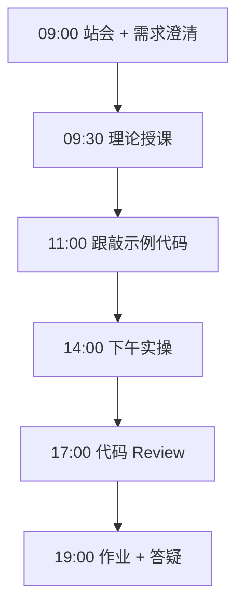
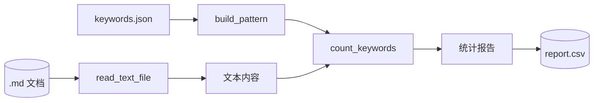

# Day 11：文件操作与正则 — 文档关键词统计器

> **阶段**：第一阶段:Python编程基础 | **Epic**：NEXUS-E1 | **预计学时**：6-8 小时

## 旁白解读：今日上下文

> 🎬 **模拟站会 09:00** — 智链科技 Nexus 项目组

**林悦**：客户上传知识库文档前，我们想自动统计里面有多少「Agent」「RAG」这类词，评估文档质量。能做个脚本吗？

**陈工**：今天练文件 IO 和正则。`Path.read_text()` 读文件，`re.compile` 做关键词匹配。注意 Windows 上 GBK 编码的坑，要 try UTF-8 再 fallback。

**小王**：英文要整词匹配，「API」不能匹配到「CAPITAL」吧？

**陈工**：用 `\b` 词边界。中文没有这个词边界概念，直接子串匹配。下午加目录批量扫描，为 Day 25 RAG 文档管道热身。

**架构老张**：这个计数器以后会进 ingestion pipeline 的质量门禁——关键词密度太低的文档可能不值得索引。

**测试小李**：我会准备空文件、二进制文件、超大文件，看异常处理是否得体。


**今日在 NexusAgent 主线中的位置**：RAG 文档入库前的质量扫描原型

**今日 Jira 看板**：
- `NEXUS-1101`
- `NEXUS-1102`
- `NEXUS-1103`

---


## 需求文档（产品林悦下发）

**文档编号**：PRD-NEXUS-D11  
**版本**：v1.0  
**优先级**：P0

### 背景

第一阶段:Python编程基础阶段第 11 天教学任务，与 NexusAgent 主线项目对齐。

### User Stories

### NEXUS-1101

**描述**：文件操作与正则 — 文档关键词统计器 相关交付

**验收标准**：
- [ ] 代码可本地运行
- [ ] 通过 `scripts/verify_day.py --day 11`

### NEXUS-1102

**描述**：文件操作与正则 — 文档关键词统计器 相关交付

**验收标准**：
- [ ] 代码可本地运行
- [ ] 通过 `scripts/verify_day.py --day 11`

### NEXUS-1103

**描述**：文件操作与正则 — 文档关键词统计器 相关交付

**验收标准**：
- [ ] 代码可本地运行
- [ ] 通过 `scripts/verify_day.py --day 11`


---


## 今日课表

### 上午 09:00-12:00

- 09:00 站会：nexus_cli 包已合并，今日做知识库文档预检工具
- 09:30 理论：Path 对象、读写文本、with 语句与上下文管理器
- 10:30 理论：正则 re 模块、compile、finditer、转义
- 11:00 跟敲 doc_keyword_counter.py 文件读取部分

### 下午 14:00-17:30

- 14:00 实现 build_pattern 与 count_keywords
- 15:00 目录批量扫描 scan_directory
- 16:00 编码处理：UTF-8 与 GBK 回退策略
- 17:00 用 sample_docs 跑通端到端演示

### 晚自习 19:00-21:00

- 19:00 作业：支持从 JSON 配置文件加载关键词列表
- 20:00 预习 requests 库，准备 Day 12 API 调用

---


## 课堂笔记

### 核心知识点速查

| 序号 | 知识点 | 代码位置 |
|------|--------|----------|
| 1 | pathlib.Path 面向对象路径操作 | 见下午实操 |
| 2 | read_text / write_text 文本读写 | 见下午实操 |
| 3 | UTF-8 与 GBK 编码处理 | 见下午实操 |
| 4 | 正则表达式 re.compile / finditer | 见下午实操 |
| 5 | re.escape 转义特殊字符 | 见下午实操 |
| 6 | 词边界 \b 整词匹配 | 见下午实操 |
| 7 | collections.Counter 计数 | 见下午实操 |
| 8 | glob 批量文件遍历 | 见下午实操 |
| 9 | 命令行参数 sys.argv 解析 | 见下午实操 |

### 今日流程图



### 架构示意图（当日目标）



---


## 实操代码清单

- `code/doc_keyword_counter.py`

请按顺序创建并运行。每段代码均可直接复制到对应文件执行。

---

## 实验手册（分时段操作表）

### 实验步骤 1：09:30-10:30 理论

| 时间 | 动作 | 预期结果 | 失败处理 |
|------|------|----------|----------|
| +0min | 打开课件本节 | 看到需求与验收标准 | 检查是否拉取最新 `develop` 分支 |
| +10min | 创建/打开当日 `code/` 文件 | 文件路径与清单一致 | 对照「实操代码清单」 |
| +30min | 粘贴并运行第一个脚本 | 终端有正常输出无 Traceback | 见下方「排错手册」 |
| +60min | 完成全部文件并自测 | `python3` 运行通过 | 使用 `scripts/verify_day.py --day 11` |
| +90min | 提交 Git 并建 MR | MR 关联 Jira NEXUS-1101 | 按附录 Git 示例操作 |


### 实验步骤 2：10:30-12:00 跟敲

| 时间 | 动作 | 预期结果 | 失败处理 |
|------|------|----------|----------|
| +0min | 打开课件本节 | 看到需求与验收标准 | 检查是否拉取最新 `develop` 分支 |
| +10min | 创建/打开当日 `code/` 文件 | 文件路径与清单一致 | 对照「实操代码清单」 |
| +30min | 粘贴并运行第一个脚本 | 终端有正常输出无 Traceback | 见下方「排错手册」 |
| +60min | 完成全部文件并自测 | `python3` 运行通过 | 使用 `scripts/verify_day.py --day 11` |
| +90min | 提交 Git 并建 MR | MR 关联 Jira NEXUS-1101 | 按附录 Git 示例操作 |


### 实验步骤 3：14:00-15:30 实操

| 时间 | 动作 | 预期结果 | 失败处理 |
|------|------|----------|----------|
| +0min | 打开课件本节 | 看到需求与验收标准 | 检查是否拉取最新 `develop` 分支 |
| +10min | 创建/打开当日 `code/` 文件 | 文件路径与清单一致 | 对照「实操代码清单」 |
| +30min | 粘贴并运行第一个脚本 | 终端有正常输出无 Traceback | 见下方「排错手册」 |
| +60min | 完成全部文件并自测 | `python3` 运行通过 | 使用 `scripts/verify_day.py --day 11` |
| +90min | 提交 Git 并建 MR | MR 关联 Jira NEXUS-1101 | 按附录 Git 示例操作 |


### 实验步骤 4：15:30-17:00 联调

| 时间 | 动作 | 预期结果 | 失败处理 |
|------|------|----------|----------|
| +0min | 打开课件本节 | 看到需求与验收标准 | 检查是否拉取最新 `develop` 分支 |
| +10min | 创建/打开当日 `code/` 文件 | 文件路径与清单一致 | 对照「实操代码清单」 |
| +30min | 粘贴并运行第一个脚本 | 终端有正常输出无 Traceback | 见下方「排错手册」 |
| +60min | 完成全部文件并自测 | `python3` 运行通过 | 使用 `scripts/verify_day.py --day 11` |
| +90min | 提交 Git 并建 MR | MR 关联 Jira NEXUS-1101 | 按附录 Git 示例操作 |


### 实验步骤 5：19:00-20:30 作业

| 时间 | 动作 | 预期结果 | 失败处理 |
|------|------|----------|----------|
| +0min | 打开课件本节 | 看到需求与验收标准 | 检查是否拉取最新 `develop` 分支 |
| +10min | 创建/打开当日 `code/` 文件 | 文件路径与清单一致 | 对照「实操代码清单」 |
| +30min | 粘贴并运行第一个脚本 | 终端有正常输出无 Traceback | 见下方「排错手册」 |
| +60min | 完成全部文件并自测 | `python3` 运行通过 | 使用 `scripts/verify_day.py --day 11` |
| +90min | 提交 Git 并建 MR | MR 关联 Jira NEXUS-1101 | 按附录 Git 示例操作 |


### 排错手册（Day 11）

1. **`command not found: python3`** → 安装 Python 3.10+ 或使用 `py -3`（Windows）
2. **`ModuleNotFoundError`** → 确认当前目录、是否激活 venv、`pip install -r requirements.txt`（若当日有）
3. **`SyntaxError: invalid syntax`** → 检查上一行是否缺括号、引号是否中文
4. **`UnicodeDecodeError`** → 文件保存为 UTF-8，终端 `export PYTHONIOENCODING=utf-8`
5. **API 相关（Day12+）** → 检查 `.env` 中 Key，无 Key 时使用课件 MOCK 模式

---


## 逐步跟敲指南（完整源码与解析）

> 以下代码与 `code/` 目录完全一致，可直接复制。每段附行级说明。

### 文件：`code/doc_keyword_counter.py`

**操作步骤**：
1. 在 `courseware/day-11/code/` 下创建文件 `doc_keyword_counter.py`
2. 完整粘贴下方代码
3. 在终端执行：`cd courseware/day-11/code && python3 doc_keyword_counter.py`（若为包内模块则按课件说明）

```python
#!/usr/bin/env python3
"""
Day 11 示例：文档关键词统计器 —— 文件 IO + 正则表达式

场景：企业知识库上传前，自动扫描文档中的敏感词、高频技术术语，
      为 RAG 索引质量评估提供基础数据（Day 25+ 会扩展为完整管道）。
"""
from __future__ import annotations

import re
import sys
from collections import Counter
from pathlib import Path


# 默认关注的技术关键词（可扩展为从配置文件加载）
DEFAULT_KEYWORDS: list[str] = [
    "Python", "API", "Agent", "RAG", "向量", "嵌入",
    "大模型", "LLM", "微调", "Docker", "FastAPI",
]

# 编译正则：整词匹配，忽略大小写（中文无边界，直接子串匹配）
def build_pattern(keywords: list[str]) -> re.Pattern[str]:
    """将关键词列表编译为单一正则表达式。"""
    escaped = [re.escape(kw) for kw in keywords]
    # 英文用词边界 \b，中文直接匹配
    parts = []
    for kw, esc in zip(keywords, escaped):
        if re.match(r"^[A-Za-z0-9]+$", kw):
            parts.append(rf"\b{esc}\b")
        else:
            parts.append(esc)
    return re.compile("|".join(parts), re.IGNORECASE)


def read_text_file(path: Path, encoding: str = "utf-8") -> str:
    """
    安全读取文本文件，自动处理常见编码问题。

    Raises:
        FileNotFoundError: 文件不存在
        UnicodeDecodeError: 编码无法解码（会尝试 gbk 回退）
    """
    if not path.exists():
        raise FileNotFoundError(f"文件不存在: {path}")
    if not path.is_file():
        raise IsADirectoryError(f"路径是目录而非文件: {path}")

    try:
        return path.read_text(encoding=encoding)
    except UnicodeDecodeError:
        # Windows 用户可能用 GBK 保存的文档
        return path.read_text(encoding="gbk", errors="replace")


def count_keywords(text: str, pattern: re.Pattern[str]) -> Counter[str]:
    """统计文本中各关键词出现次数。"""
    counter: Counter[str] = Counter()
    for match in pattern.finditer(text):
        counter[match.group().lower() if match.group().isascii() else match.group()] += 1
    return counter


def scan_file(path: Path, keywords: list[str] | None = None) -> dict:
    """
    扫描单个文件，返回统计报告字典。

    Returns:
        {
            "file": str,
            "total_chars": int,
            "total_lines": int,
            "keyword_hits": dict[str, int],
            "top_keywords": list[tuple[str, int]],
        }
    """
    keywords = keywords or DEFAULT_KEYWORDS
    pattern = build_pattern(keywords)
    text = read_text_file(path)

    lines = text.splitlines()
    hits = count_keywords(text, pattern)

    return {
        "file": str(path),
        "total_chars": len(text),
        "total_lines": len(lines),
        "keyword_hits": dict(hits),
        "top_keywords": hits.most_common(5),
    }


def scan_directory(dir_path: Path, glob_pattern: str = "*.md") -> list[dict]:
    """批量扫描目录下匹配的文档。"""
    reports = []
    for fp in sorted(dir_path.glob(glob_pattern)):
        if fp.is_file():
            reports.append(scan_file(fp))
    return reports


def print_report(report: dict) -> None:
    """格式化打印单文件报告。"""
    print(f"\n{'='*50}")
    print(f"文件: {report['file']}")
    print(f"字符数: {report['total_chars']}  |  行数: {report['total_lines']}")
    print("关键词命中:")
    if report["top_keywords"]:
        for kw, cnt in report["top_keywords"]:
            print(f"  - {kw}: {cnt}")
    else:
        print("  (无匹配)")


def main() -> None:
    """命令行入口：python doc_keyword_counter.py <文件或目录>"""
    if len(sys.argv) < 2:
        # 无参数时扫描内置示例文档
        sample = Path(__file__).parent / "sample_docs" / "intro.md"
        sample.parent.mkdir(parents=True, exist_ok=True)
        if not sample.exists():
            sample.write_text(
                """# NexusAgent 简介

NexusAgent 是智链科技的企业级 Agent 平台，基于 Python 与 FastAPI 构建。
支持 RAG 检索增强、多 Agent 协作与大模型 API 接入。

## 技术栈
- Python 3.10+
- 向量数据库
- LLM API（通义千问、DeepSeek）
""",
                encoding="utf-8",
            )
        target = sample
    else:
        target = Path(sys.argv[1])

    if target.is_dir():
        reports = scan_directory(target)
    else:
        reports = [scan_file(target)]

    for r in reports:
        print_report(r)

    total_hits = sum(sum(r["keyword_hits"].values()) for r in reports)
    print(f"\n{'='*50}")
    print(f"共扫描 {len(reports)} 个文件，关键词总命中 {total_hits} 次")


if __name__ == "__main__":
    main()

```

**解析要点（`doc_keyword_counter.py`）**：

- 共 **153** 行，请逐行阅读注释中的中文说明

- 运行前确认 Python 版本 ≥ 3.10：`python3 --version`

- 若报错，先检查缩进是否为 4 空格，勿混用 Tab

- 企业 Review 清单：命名是否清晰、是否有异常处理、是否可复用

---


### 深度讲解 1：pathlib.Path 面向对象路径操作

在企业级 Python 开发与大模型应用工程中，**pathlib.Path 面向对象路径操作** 是学员必须牢固掌握的基本功。智链科技 Nexus 项目组在 Day 11 的代码评审中，特别强调以下几点：

1. **为什么学**：pathlib.Path 面向对象路径操作 直接服务于后续 NexusAgent 平台的 `NEXUS-E1` 模块。没有扎实的 pathlib.Path 面向对象路径操作，Day 18 之后调用 API、解析 JSON、编写 Agent 工具函数时会出现大量低级错误。

2. **常见坑**：
   - 忽略输入类型校验，导致运行时 `TypeError`
   - 编码问题（Windows 默认 GBK vs UTF-8）
   - 复制粘贴时缩进错乱（Python 对缩进敏感）

3. **企业实践**：在 SmartLink 的 GitLab 仓库中，所有与 pathlib.Path 面向对象路径操作 相关的代码必须经过 Ruff 静态检查；变量命名使用 `snake_case`，常量使用 `UPPER_SNAKE_CASE`。

4. **与主线项目的关系**：今日代码位于 `courseware/day-11/code/`，部分模块将逐步合并到 `platform/nexus_agent/`。请养成「每日代码皆可运行、皆可测试」的习惯。

5. **扩展阅读建议**：完成今日作业后，可阅读 `docs/project-master-plan.md` 中关于 NEXUS-E1 的章节，建立全局视角。

**课堂互动题**：请用 3 句话向非技术同事解释「pathlib.Path 面向对象路径操作」是什么。写在作业 MR 的评论里，讲师会抽查点评。

**实操检查清单**：
- [ ] 能不看课件复述 pathlib.Path 面向对象路径操作 的定义
- [ ] 能独立写出相关代码并运行
- [ ] 能向同学讲解一处容易写错的地方


### 深度讲解 2：read_text / write_text 文本读写

在企业级 Python 开发与大模型应用工程中，**read_text / write_text 文本读写** 是学员必须牢固掌握的基本功。智链科技 Nexus 项目组在 Day 11 的代码评审中，特别强调以下几点：

1. **为什么学**：read_text / write_text 文本读写 直接服务于后续 NexusAgent 平台的 `NEXUS-E1` 模块。没有扎实的 read_text / write_text 文本读写，Day 18 之后调用 API、解析 JSON、编写 Agent 工具函数时会出现大量低级错误。

2. **常见坑**：
   - 忽略输入类型校验，导致运行时 `TypeError`
   - 编码问题（Windows 默认 GBK vs UTF-8）
   - 复制粘贴时缩进错乱（Python 对缩进敏感）

3. **企业实践**：在 SmartLink 的 GitLab 仓库中，所有与 read_text / write_text 文本读写 相关的代码必须经过 Ruff 静态检查；变量命名使用 `snake_case`，常量使用 `UPPER_SNAKE_CASE`。

4. **与主线项目的关系**：今日代码位于 `courseware/day-11/code/`，部分模块将逐步合并到 `platform/nexus_agent/`。请养成「每日代码皆可运行、皆可测试」的习惯。

5. **扩展阅读建议**：完成今日作业后，可阅读 `docs/project-master-plan.md` 中关于 NEXUS-E1 的章节，建立全局视角。

**课堂互动题**：请用 3 句话向非技术同事解释「read_text / write_text 文本读写」是什么。写在作业 MR 的评论里，讲师会抽查点评。

**实操检查清单**：
- [ ] 能不看课件复述 read_text / write_text 文本读写 的定义
- [ ] 能独立写出相关代码并运行
- [ ] 能向同学讲解一处容易写错的地方


### 深度讲解 3：UTF-8 与 GBK 编码处理

在企业级 Python 开发与大模型应用工程中，**UTF-8 与 GBK 编码处理** 是学员必须牢固掌握的基本功。智链科技 Nexus 项目组在 Day 11 的代码评审中，特别强调以下几点：

1. **为什么学**：UTF-8 与 GBK 编码处理 直接服务于后续 NexusAgent 平台的 `NEXUS-E1` 模块。没有扎实的 UTF-8 与 GBK 编码处理，Day 18 之后调用 API、解析 JSON、编写 Agent 工具函数时会出现大量低级错误。

2. **常见坑**：
   - 忽略输入类型校验，导致运行时 `TypeError`
   - 编码问题（Windows 默认 GBK vs UTF-8）
   - 复制粘贴时缩进错乱（Python 对缩进敏感）

3. **企业实践**：在 SmartLink 的 GitLab 仓库中，所有与 UTF-8 与 GBK 编码处理 相关的代码必须经过 Ruff 静态检查；变量命名使用 `snake_case`，常量使用 `UPPER_SNAKE_CASE`。

4. **与主线项目的关系**：今日代码位于 `courseware/day-11/code/`，部分模块将逐步合并到 `platform/nexus_agent/`。请养成「每日代码皆可运行、皆可测试」的习惯。

5. **扩展阅读建议**：完成今日作业后，可阅读 `docs/project-master-plan.md` 中关于 NEXUS-E1 的章节，建立全局视角。

**课堂互动题**：请用 3 句话向非技术同事解释「UTF-8 与 GBK 编码处理」是什么。写在作业 MR 的评论里，讲师会抽查点评。

**实操检查清单**：
- [ ] 能不看课件复述 UTF-8 与 GBK 编码处理 的定义
- [ ] 能独立写出相关代码并运行
- [ ] 能向同学讲解一处容易写错的地方


### 深度讲解 4：正则表达式 re.compile / finditer

在企业级 Python 开发与大模型应用工程中，**正则表达式 re.compile / finditer** 是学员必须牢固掌握的基本功。智链科技 Nexus 项目组在 Day 11 的代码评审中，特别强调以下几点：

1. **为什么学**：正则表达式 re.compile / finditer 直接服务于后续 NexusAgent 平台的 `NEXUS-E1` 模块。没有扎实的 正则表达式 re.compile / finditer，Day 18 之后调用 API、解析 JSON、编写 Agent 工具函数时会出现大量低级错误。

2. **常见坑**：
   - 忽略输入类型校验，导致运行时 `TypeError`
   - 编码问题（Windows 默认 GBK vs UTF-8）
   - 复制粘贴时缩进错乱（Python 对缩进敏感）

3. **企业实践**：在 SmartLink 的 GitLab 仓库中，所有与 正则表达式 re.compile / finditer 相关的代码必须经过 Ruff 静态检查；变量命名使用 `snake_case`，常量使用 `UPPER_SNAKE_CASE`。

4. **与主线项目的关系**：今日代码位于 `courseware/day-11/code/`，部分模块将逐步合并到 `platform/nexus_agent/`。请养成「每日代码皆可运行、皆可测试」的习惯。

5. **扩展阅读建议**：完成今日作业后，可阅读 `docs/project-master-plan.md` 中关于 NEXUS-E1 的章节，建立全局视角。

**课堂互动题**：请用 3 句话向非技术同事解释「正则表达式 re.compile / finditer」是什么。写在作业 MR 的评论里，讲师会抽查点评。

**实操检查清单**：
- [ ] 能不看课件复述 正则表达式 re.compile / finditer 的定义
- [ ] 能独立写出相关代码并运行
- [ ] 能向同学讲解一处容易写错的地方


### 深度讲解 5：re.escape 转义特殊字符

在企业级 Python 开发与大模型应用工程中，**re.escape 转义特殊字符** 是学员必须牢固掌握的基本功。智链科技 Nexus 项目组在 Day 11 的代码评审中，特别强调以下几点：

1. **为什么学**：re.escape 转义特殊字符 直接服务于后续 NexusAgent 平台的 `NEXUS-E1` 模块。没有扎实的 re.escape 转义特殊字符，Day 18 之后调用 API、解析 JSON、编写 Agent 工具函数时会出现大量低级错误。

2. **常见坑**：
   - 忽略输入类型校验，导致运行时 `TypeError`
   - 编码问题（Windows 默认 GBK vs UTF-8）
   - 复制粘贴时缩进错乱（Python 对缩进敏感）

3. **企业实践**：在 SmartLink 的 GitLab 仓库中，所有与 re.escape 转义特殊字符 相关的代码必须经过 Ruff 静态检查；变量命名使用 `snake_case`，常量使用 `UPPER_SNAKE_CASE`。

4. **与主线项目的关系**：今日代码位于 `courseware/day-11/code/`，部分模块将逐步合并到 `platform/nexus_agent/`。请养成「每日代码皆可运行、皆可测试」的习惯。

5. **扩展阅读建议**：完成今日作业后，可阅读 `docs/project-master-plan.md` 中关于 NEXUS-E1 的章节，建立全局视角。

**课堂互动题**：请用 3 句话向非技术同事解释「re.escape 转义特殊字符」是什么。写在作业 MR 的评论里，讲师会抽查点评。

**实操检查清单**：
- [ ] 能不看课件复述 re.escape 转义特殊字符 的定义
- [ ] 能独立写出相关代码并运行
- [ ] 能向同学讲解一处容易写错的地方


### 深度讲解 6：词边界 \b 整词匹配

在企业级 Python 开发与大模型应用工程中，**词边界 \b 整词匹配** 是学员必须牢固掌握的基本功。智链科技 Nexus 项目组在 Day 11 的代码评审中，特别强调以下几点：

1. **为什么学**：词边界 \b 整词匹配 直接服务于后续 NexusAgent 平台的 `NEXUS-E1` 模块。没有扎实的 词边界 \b 整词匹配，Day 18 之后调用 API、解析 JSON、编写 Agent 工具函数时会出现大量低级错误。

2. **常见坑**：
   - 忽略输入类型校验，导致运行时 `TypeError`
   - 编码问题（Windows 默认 GBK vs UTF-8）
   - 复制粘贴时缩进错乱（Python 对缩进敏感）

3. **企业实践**：在 SmartLink 的 GitLab 仓库中，所有与 词边界 \b 整词匹配 相关的代码必须经过 Ruff 静态检查；变量命名使用 `snake_case`，常量使用 `UPPER_SNAKE_CASE`。

4. **与主线项目的关系**：今日代码位于 `courseware/day-11/code/`，部分模块将逐步合并到 `platform/nexus_agent/`。请养成「每日代码皆可运行、皆可测试」的习惯。

5. **扩展阅读建议**：完成今日作业后，可阅读 `docs/project-master-plan.md` 中关于 NEXUS-E1 的章节，建立全局视角。

**课堂互动题**：请用 3 句话向非技术同事解释「词边界 \b 整词匹配」是什么。写在作业 MR 的评论里，讲师会抽查点评。

**实操检查清单**：
- [ ] 能不看课件复述 词边界 \b 整词匹配 的定义
- [ ] 能独立写出相关代码并运行
- [ ] 能向同学讲解一处容易写错的地方


### 深度讲解 7：collections.Counter 计数

在企业级 Python 开发与大模型应用工程中，**collections.Counter 计数** 是学员必须牢固掌握的基本功。智链科技 Nexus 项目组在 Day 11 的代码评审中，特别强调以下几点：

1. **为什么学**：collections.Counter 计数 直接服务于后续 NexusAgent 平台的 `NEXUS-E1` 模块。没有扎实的 collections.Counter 计数，Day 18 之后调用 API、解析 JSON、编写 Agent 工具函数时会出现大量低级错误。

2. **常见坑**：
   - 忽略输入类型校验，导致运行时 `TypeError`
   - 编码问题（Windows 默认 GBK vs UTF-8）
   - 复制粘贴时缩进错乱（Python 对缩进敏感）

3. **企业实践**：在 SmartLink 的 GitLab 仓库中，所有与 collections.Counter 计数 相关的代码必须经过 Ruff 静态检查；变量命名使用 `snake_case`，常量使用 `UPPER_SNAKE_CASE`。

4. **与主线项目的关系**：今日代码位于 `courseware/day-11/code/`，部分模块将逐步合并到 `platform/nexus_agent/`。请养成「每日代码皆可运行、皆可测试」的习惯。

5. **扩展阅读建议**：完成今日作业后，可阅读 `docs/project-master-plan.md` 中关于 NEXUS-E1 的章节，建立全局视角。

**课堂互动题**：请用 3 句话向非技术同事解释「collections.Counter 计数」是什么。写在作业 MR 的评论里，讲师会抽查点评。

**实操检查清单**：
- [ ] 能不看课件复述 collections.Counter 计数 的定义
- [ ] 能独立写出相关代码并运行
- [ ] 能向同学讲解一处容易写错的地方


### 深度讲解 8：glob 批量文件遍历

在企业级 Python 开发与大模型应用工程中，**glob 批量文件遍历** 是学员必须牢固掌握的基本功。智链科技 Nexus 项目组在 Day 11 的代码评审中，特别强调以下几点：

1. **为什么学**：glob 批量文件遍历 直接服务于后续 NexusAgent 平台的 `NEXUS-E1` 模块。没有扎实的 glob 批量文件遍历，Day 18 之后调用 API、解析 JSON、编写 Agent 工具函数时会出现大量低级错误。

2. **常见坑**：
   - 忽略输入类型校验，导致运行时 `TypeError`
   - 编码问题（Windows 默认 GBK vs UTF-8）
   - 复制粘贴时缩进错乱（Python 对缩进敏感）

3. **企业实践**：在 SmartLink 的 GitLab 仓库中，所有与 glob 批量文件遍历 相关的代码必须经过 Ruff 静态检查；变量命名使用 `snake_case`，常量使用 `UPPER_SNAKE_CASE`。

4. **与主线项目的关系**：今日代码位于 `courseware/day-11/code/`，部分模块将逐步合并到 `platform/nexus_agent/`。请养成「每日代码皆可运行、皆可测试」的习惯。

5. **扩展阅读建议**：完成今日作业后，可阅读 `docs/project-master-plan.md` 中关于 NEXUS-E1 的章节，建立全局视角。

**课堂互动题**：请用 3 句话向非技术同事解释「glob 批量文件遍历」是什么。写在作业 MR 的评论里，讲师会抽查点评。

**实操检查清单**：
- [ ] 能不看课件复述 glob 批量文件遍历 的定义
- [ ] 能独立写出相关代码并运行
- [ ] 能向同学讲解一处容易写错的地方


### 深度讲解 9：命令行参数 sys.argv 解析

在企业级 Python 开发与大模型应用工程中，**命令行参数 sys.argv 解析** 是学员必须牢固掌握的基本功。智链科技 Nexus 项目组在 Day 11 的代码评审中，特别强调以下几点：

1. **为什么学**：命令行参数 sys.argv 解析 直接服务于后续 NexusAgent 平台的 `NEXUS-E1` 模块。没有扎实的 命令行参数 sys.argv 解析，Day 18 之后调用 API、解析 JSON、编写 Agent 工具函数时会出现大量低级错误。

2. **常见坑**：
   - 忽略输入类型校验，导致运行时 `TypeError`
   - 编码问题（Windows 默认 GBK vs UTF-8）
   - 复制粘贴时缩进错乱（Python 对缩进敏感）

3. **企业实践**：在 SmartLink 的 GitLab 仓库中，所有与 命令行参数 sys.argv 解析 相关的代码必须经过 Ruff 静态检查；变量命名使用 `snake_case`，常量使用 `UPPER_SNAKE_CASE`。

4. **与主线项目的关系**：今日代码位于 `courseware/day-11/code/`，部分模块将逐步合并到 `platform/nexus_agent/`。请养成「每日代码皆可运行、皆可测试」的习惯。

5. **扩展阅读建议**：完成今日作业后，可阅读 `docs/project-master-plan.md` 中关于 NEXUS-E1 的章节，建立全局视角。

**课堂互动题**：请用 3 句话向非技术同事解释「命令行参数 sys.argv 解析」是什么。写在作业 MR 的评论里，讲师会抽查点评。

**实操检查清单**：
- [ ] 能不看课件复述 命令行参数 sys.argv 解析 的定义
- [ ] 能独立写出相关代码并运行
- [ ] 能向同学讲解一处容易写错的地方


## 阶段复盘锚点（第一阶段:Python编程基础）

今天是 **第一阶段:Python编程基础** 的第 **11** 个学习日。请回顾：

- 昨天学了什么？今天如何承接？
- 今天的内容在 70 天路线图中的坐标？
- 如果我是 Tech Lead，会如何 Review 今日代码？

**陈工寄语**：慢即是快。企业里没人关心你一天学了多少个语法点，只关心你写的脚本能不能在服务器上稳定跑 7×24 小时。今天把地基打牢，后面 Agent 编排、RAG 检索才不会塌。

**林悦补充**：产品侧只验收「用户能感知到的价值」。今日交付虽然简单，但「个人信息卡片」本质是后续「用户画像 Agent」的数据采集原型——字段设计请认真思考。

**代码量统计（累计）**：完成今日后，个人仓库累计约 **15400** 行（含注释与测试），全营目标 10 万行。

**明日预告**：请提前阅读 `courseware/day-12/README.md` 开头的旁白，了解上下文。


## 常见问题 FAQ（讲师答疑实录）


**Q1：学习「pathlib.Path 面向对象路径操作」时最常问的问题是什么？**

A：学员常问「这在大模型开发里到底用在哪里」。直接回答：在 NexusAgent 的 `NEXUS-E1` 中，pathlib.Path 面向对象路径操作 用于支撑「文件操作与正则 — 文档关键词统计器」这一交付。建议你打开 `platform/` 对照看未来模块如何引用今日写法。另一个常见问题是「要不要背语法」——不需要背，但要能写出可运行代码，并能在报错时读懂 Traceback。

**追问**：如果线上报错与 pathlib.Path 面向对象路径操作 相关，如何排查？  
**答**：① 复现 ② 最小化输入 ③ 打印中间变量 ④ 查 GitLab 历史 diff ⑤ 在 Jira 建 Bug 单附上日志。


**Q2：学习「read_text / write_text 文本读写」时最常问的问题是什么？**

A：学员常问「这在大模型开发里到底用在哪里」。直接回答：在 NexusAgent 的 `NEXUS-E1` 中，read_text / write_text 文本读写 用于支撑「文件操作与正则 — 文档关键词统计器」这一交付。建议你打开 `platform/` 对照看未来模块如何引用今日写法。另一个常见问题是「要不要背语法」——不需要背，但要能写出可运行代码，并能在报错时读懂 Traceback。

**追问**：如果线上报错与 read_text / write_text 文本读写 相关，如何排查？  
**答**：① 复现 ② 最小化输入 ③ 打印中间变量 ④ 查 GitLab 历史 diff ⑤ 在 Jira 建 Bug 单附上日志。


**Q3：学习「UTF-8 与 GBK 编码处理」时最常问的问题是什么？**

A：学员常问「这在大模型开发里到底用在哪里」。直接回答：在 NexusAgent 的 `NEXUS-E1` 中，UTF-8 与 GBK 编码处理 用于支撑「文件操作与正则 — 文档关键词统计器」这一交付。建议你打开 `platform/` 对照看未来模块如何引用今日写法。另一个常见问题是「要不要背语法」——不需要背，但要能写出可运行代码，并能在报错时读懂 Traceback。

**追问**：如果线上报错与 UTF-8 与 GBK 编码处理 相关，如何排查？  
**答**：① 复现 ② 最小化输入 ③ 打印中间变量 ④ 查 GitLab 历史 diff ⑤ 在 Jira 建 Bug 单附上日志。


**Q4：学习「正则表达式 re.compile / finditer」时最常问的问题是什么？**

A：学员常问「这在大模型开发里到底用在哪里」。直接回答：在 NexusAgent 的 `NEXUS-E1` 中，正则表达式 re.compile / finditer 用于支撑「文件操作与正则 — 文档关键词统计器」这一交付。建议你打开 `platform/` 对照看未来模块如何引用今日写法。另一个常见问题是「要不要背语法」——不需要背，但要能写出可运行代码，并能在报错时读懂 Traceback。

**追问**：如果线上报错与 正则表达式 re.compile / finditer 相关，如何排查？  
**答**：① 复现 ② 最小化输入 ③ 打印中间变量 ④ 查 GitLab 历史 diff ⑤ 在 Jira 建 Bug 单附上日志。


**Q5：学习「re.escape 转义特殊字符」时最常问的问题是什么？**

A：学员常问「这在大模型开发里到底用在哪里」。直接回答：在 NexusAgent 的 `NEXUS-E1` 中，re.escape 转义特殊字符 用于支撑「文件操作与正则 — 文档关键词统计器」这一交付。建议你打开 `platform/` 对照看未来模块如何引用今日写法。另一个常见问题是「要不要背语法」——不需要背，但要能写出可运行代码，并能在报错时读懂 Traceback。

**追问**：如果线上报错与 re.escape 转义特殊字符 相关，如何排查？  
**答**：① 复现 ② 最小化输入 ③ 打印中间变量 ④ 查 GitLab 历史 diff ⑤ 在 Jira 建 Bug 单附上日志。


**Q6：学习「词边界 \b 整词匹配」时最常问的问题是什么？**

A：学员常问「这在大模型开发里到底用在哪里」。直接回答：在 NexusAgent 的 `NEXUS-E1` 中，词边界 \b 整词匹配 用于支撑「文件操作与正则 — 文档关键词统计器」这一交付。建议你打开 `platform/` 对照看未来模块如何引用今日写法。另一个常见问题是「要不要背语法」——不需要背，但要能写出可运行代码，并能在报错时读懂 Traceback。

**追问**：如果线上报错与 词边界 \b 整词匹配 相关，如何排查？  
**答**：① 复现 ② 最小化输入 ③ 打印中间变量 ④ 查 GitLab 历史 diff ⑤ 在 Jira 建 Bug 单附上日志。


**Q7：学习「collections.Counter 计数」时最常问的问题是什么？**

A：学员常问「这在大模型开发里到底用在哪里」。直接回答：在 NexusAgent 的 `NEXUS-E1` 中，collections.Counter 计数 用于支撑「文件操作与正则 — 文档关键词统计器」这一交付。建议你打开 `platform/` 对照看未来模块如何引用今日写法。另一个常见问题是「要不要背语法」——不需要背，但要能写出可运行代码，并能在报错时读懂 Traceback。

**追问**：如果线上报错与 collections.Counter 计数 相关，如何排查？  
**答**：① 复现 ② 最小化输入 ③ 打印中间变量 ④ 查 GitLab 历史 diff ⑤ 在 Jira 建 Bug 单附上日志。


**Q8：学习「glob 批量文件遍历」时最常问的问题是什么？**

A：学员常问「这在大模型开发里到底用在哪里」。直接回答：在 NexusAgent 的 `NEXUS-E1` 中，glob 批量文件遍历 用于支撑「文件操作与正则 — 文档关键词统计器」这一交付。建议你打开 `platform/` 对照看未来模块如何引用今日写法。另一个常见问题是「要不要背语法」——不需要背，但要能写出可运行代码，并能在报错时读懂 Traceback。

**追问**：如果线上报错与 glob 批量文件遍历 相关，如何排查？  
**答**：① 复现 ② 最小化输入 ③ 打印中间变量 ④ 查 GitLab 历史 diff ⑤ 在 Jira 建 Bug 单附上日志。


**Q9：学习「命令行参数 sys.argv 解析」时最常问的问题是什么？**

A：学员常问「这在大模型开发里到底用在哪里」。直接回答：在 NexusAgent 的 `NEXUS-E1` 中，命令行参数 sys.argv 解析 用于支撑「文件操作与正则 — 文档关键词统计器」这一交付。建议你打开 `platform/` 对照看未来模块如何引用今日写法。另一个常见问题是「要不要背语法」——不需要背，但要能写出可运行代码，并能在报错时读懂 Traceback。

**追问**：如果线上报错与 命令行参数 sys.argv 解析 相关，如何排查？  
**答**：① 复现 ② 最小化输入 ③ 打印中间变量 ④ 查 GitLab 历史 diff ⑤ 在 Jira 建 Bug 单附上日志。


## 面试押题（与今日知识点挂钩）

以下题目会出现在 Day 67-69 模拟面试中，建议今日就开始积累答案：

1. **pathlib.Path 面向对象路径操作**：请结合 NexusAgent 项目举例说明你在哪一天、哪段代码里用到了它？
2. **read_text / write_text 文本读写**：请结合 NexusAgent 项目举例说明你在哪一天、哪段代码里用到了它？
3. **UTF-8 与 GBK 编码处理**：请结合 NexusAgent 项目举例说明你在哪一天、哪段代码里用到了它？
4. **正则表达式 re.compile / finditer**：请结合 NexusAgent 项目举例说明你在哪一天、哪段代码里用到了它？
5. **re.escape 转义特殊字符**：请结合 NexusAgent 项目举例说明你在哪一天、哪段代码里用到了它？
6. **词边界 \b 整词匹配**：请结合 NexusAgent 项目举例说明你在哪一天、哪段代码里用到了它？

**参考答案思路**：采用 STAR 法则（情境-任务-行动-结果），引用 `courseware/day-11/code/` 中的具体文件名与函数名。

---


## Code Review 检查表（陈工版）

合并 MR 前自查：

- [ ] 所有新增 `.py` 文件顶部有模块说明 docstring
- [ ] 无硬编码密钥（API Key 走环境变量）
- [ ] 函数长度 < 50 行，过长则拆分
- [ ] 异常有明确提示，禁止裸 `except:`
- [ ] 提交信息符合 `feat(day-11): ...`
- [ ] README 或注释说明如何运行
- [ ] 与 Jira Story 验收标准逐条对应

**今日重点审查项**：文件操作与正则 — 文档关键词统计器 相关逻辑是否可读、可测、可扩展至 `platform/nexus_agent/`。

---


## 课后作业

### 作业说明

扩展 doc_keyword_counter.py：

1. 支持 `--config keywords.json` 从外部文件加载关键词
2. 输出 CSV 报告 `report.csv`（列：file, keyword, count）
3. 新增敏感词检测：命中敏感词时 print 警告（敏感词列表可硬编码 3 个示例词）


### 提交要求

1. 代码提交到分支 `feature/day-11-homework`
2. GitLab MR 标题：`[Day-11] homework: 课后作业`
3. 在 MR 描述中附上运行截图或终端输出

### 评分标准（满分 100）

| 项 | 分值 |
|----|------|
| 功能完整 | 40 |
| 代码规范与注释 | 30 |
| 异常处理 | 15 |
| MR 与 Jira 关联 | 15 |

---

## 作业参考答案

> ⚠️ 请先独立完成再对照答案

```python
import json, csv

def load_keywords(config_path: Path) -> list[str]:
    data = json.loads(config_path.read_text(encoding="utf-8"))
    return data["keywords"]

# 写 CSV
with open("report.csv", "w", encoding="utf-8", newline="") as f:
    writer = csv.writer(f)
    writer.writerow(["file", "keyword", "count"])
    for r in reports:
        for kw, cnt in r["keyword_hits"].items():
            writer.writerow([r["file"], kw, cnt])
```


---


## 附录：Git 提交示例

```bash
git checkout develop
git pull origin develop
git checkout -b feature/day-11-文件操作与正则-—-
# 完成代码后
git add courseware/day-11/
git commit -m "feat(day-11): 文件操作与正则 — 文档关键词统计器"
git push -u origin feature/day-11-文件操作与正则-—-
```

---

*课件版本 Day-11-v1.0 | 智链科技培训中心*
