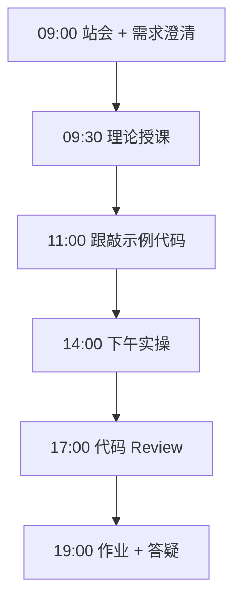
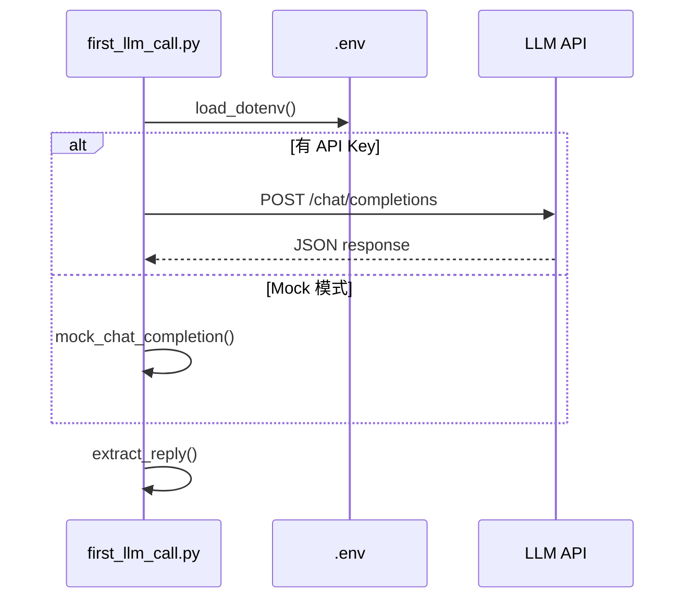

# Day 12：网络请求与 API — 首次 LLM 调用

> **阶段**：第一阶段:Python编程基础 | **Epic**：NEXUS-E1 | **预计学时**：6-8 小时

## 旁白解读：今日上下文

> 🎬 **模拟站会 09:00** — 智链科技 Nexus 项目组

**林悦**：文档扫描只是预处理，用户真正需要的是「问问题得回答」。今天能打通大模型 API 吗？

**陈工**：今天 first_llm_call.py，用 requests 发 POST。密钥放 `.env`，python-dotenv 加载，**绝对不要** commit 到 GitLab。

**小王**：课堂上没 API Key 怎么办？

**陈工**：Mock 模式。检测 key 为空或是占位符 `sk-your` 就走本地假响应，结构与真实 API 一致。先 Mock 跑通逻辑，再换真 key。

**安全专员**：生产环境密钥走 Vault 或 K8s Secret，`.env` 只是本地开发。MR 里如果看到 sk- 开头的内容直接打回。

**架构老张**：这个调用函数 Day 14 会塞进 CLI 助手，Day 15 改成 FastAPI 端点。响应解析要健壮，API 格式变了不能崩。


**今日在 NexusAgent 主线中的位置**：platform/nexus_agent/llm/openai_client.py 第一版

**今日 Jira 看板**：
- `NEXUS-1201`
- `NEXUS-1202`
- `NEXUS-1203`

---


## 需求文档（产品林悦下发）

**文档编号**：PRD-NEXUS-D12  
**版本**：v1.0  
**优先级**：P0

### 背景

第一阶段:Python编程基础阶段第 12 天教学任务，与 NexusAgent 主线项目对齐。

### User Stories

### NEXUS-1201

**描述**：网络请求与 API — 首次 LLM 调用 相关交付

**验收标准**：
- [ ] 代码可本地运行
- [ ] 通过 `scripts/verify_day.py --day 12`

### NEXUS-1202

**描述**：网络请求与 API — 首次 LLM 调用 相关交付

**验收标准**：
- [ ] 代码可本地运行
- [ ] 通过 `scripts/verify_day.py --day 12`

### NEXUS-1203

**描述**：网络请求与 API — 首次 LLM 调用 相关交付

**验收标准**：
- [ ] 代码可本地运行
- [ ] 通过 `scripts/verify_day.py --day 12`


---


## 今日课表

### 上午 09:00-12:00

- 09:00 站会：文档扫描工具验收，今日接入真实（或 Mock）大模型 API
- 09:30 理论：HTTP 基础、GET/POST、状态码、JSON
- 10:30 理论：requests 库、超时、异常处理
- 11:00 理论：dotenv 环境变量、密钥安全管理

### 下午 14:00-17:30

- 14:00 跟敲 first_llm_call.py，先跑通 Mock 模式
- 15:00 配置 .env，尝试真实 API 调用
- 16:00 解析响应 JSON，提取 choices[0].message.content
- 17:00 讨论：API Key 绝不能提交 Git，.gitignore 配置

### 晚自习 19:00-21:00

- 19:00 作业：封装 chat_once(prompt) 函数，支持重试
- 20:00 阅读通义千问 DashScope HTTP API 文档

---


## 课堂笔记

### 核心知识点速查

| 序号 | 知识点 | 代码位置 |
|------|--------|----------|
| 1 | HTTP 协议与 RESTful API | 见下午实操 |
| 2 | requests.post 发送 JSON 请求 | 见下午实操 |
| 3 | HTTP 状态码与 raise_for_status | 见下午实操 |
| 4 | 请求超时 timeout 参数 | 见下午实操 |
| 5 | JSON 序列化与反序列化 | 见下午实操 |
| 6 | python-dotenv 环境变量管理 | 见下午实操 |
| 7 | API Key 安全与 .gitignore | 见下午实操 |
| 8 | OpenAI Chat Completions 请求/响应结构 | 见下午实操 |
| 9 | Mock 模式离线开发与测试 | 见下午实操 |

### 今日流程图



### 架构示意图（当日目标）



---


## 实操代码清单

- `code/first_llm_call.py`
- `code/.env.example`

请按顺序创建并运行。每段代码均可直接复制到对应文件执行。

---

## 实验手册（分时段操作表）

### 实验步骤 1：09:30-10:30 理论

| 时间 | 动作 | 预期结果 | 失败处理 |
|------|------|----------|----------|
| +0min | 打开课件本节 | 看到需求与验收标准 | 检查是否拉取最新 `develop` 分支 |
| +10min | 创建/打开当日 `code/` 文件 | 文件路径与清单一致 | 对照「实操代码清单」 |
| +30min | 粘贴并运行第一个脚本 | 终端有正常输出无 Traceback | 见下方「排错手册」 |
| +60min | 完成全部文件并自测 | `python3` 运行通过 | 使用 `scripts/verify_day.py --day 12` |
| +90min | 提交 Git 并建 MR | MR 关联 Jira NEXUS-1201 | 按附录 Git 示例操作 |


### 实验步骤 2：10:30-12:00 跟敲

| 时间 | 动作 | 预期结果 | 失败处理 |
|------|------|----------|----------|
| +0min | 打开课件本节 | 看到需求与验收标准 | 检查是否拉取最新 `develop` 分支 |
| +10min | 创建/打开当日 `code/` 文件 | 文件路径与清单一致 | 对照「实操代码清单」 |
| +30min | 粘贴并运行第一个脚本 | 终端有正常输出无 Traceback | 见下方「排错手册」 |
| +60min | 完成全部文件并自测 | `python3` 运行通过 | 使用 `scripts/verify_day.py --day 12` |
| +90min | 提交 Git 并建 MR | MR 关联 Jira NEXUS-1201 | 按附录 Git 示例操作 |


### 实验步骤 3：14:00-15:30 实操

| 时间 | 动作 | 预期结果 | 失败处理 |
|------|------|----------|----------|
| +0min | 打开课件本节 | 看到需求与验收标准 | 检查是否拉取最新 `develop` 分支 |
| +10min | 创建/打开当日 `code/` 文件 | 文件路径与清单一致 | 对照「实操代码清单」 |
| +30min | 粘贴并运行第一个脚本 | 终端有正常输出无 Traceback | 见下方「排错手册」 |
| +60min | 完成全部文件并自测 | `python3` 运行通过 | 使用 `scripts/verify_day.py --day 12` |
| +90min | 提交 Git 并建 MR | MR 关联 Jira NEXUS-1201 | 按附录 Git 示例操作 |


### 实验步骤 4：15:30-17:00 联调

| 时间 | 动作 | 预期结果 | 失败处理 |
|------|------|----------|----------|
| +0min | 打开课件本节 | 看到需求与验收标准 | 检查是否拉取最新 `develop` 分支 |
| +10min | 创建/打开当日 `code/` 文件 | 文件路径与清单一致 | 对照「实操代码清单」 |
| +30min | 粘贴并运行第一个脚本 | 终端有正常输出无 Traceback | 见下方「排错手册」 |
| +60min | 完成全部文件并自测 | `python3` 运行通过 | 使用 `scripts/verify_day.py --day 12` |
| +90min | 提交 Git 并建 MR | MR 关联 Jira NEXUS-1201 | 按附录 Git 示例操作 |


### 实验步骤 5：19:00-20:30 作业

| 时间 | 动作 | 预期结果 | 失败处理 |
|------|------|----------|----------|
| +0min | 打开课件本节 | 看到需求与验收标准 | 检查是否拉取最新 `develop` 分支 |
| +10min | 创建/打开当日 `code/` 文件 | 文件路径与清单一致 | 对照「实操代码清单」 |
| +30min | 粘贴并运行第一个脚本 | 终端有正常输出无 Traceback | 见下方「排错手册」 |
| +60min | 完成全部文件并自测 | `python3` 运行通过 | 使用 `scripts/verify_day.py --day 12` |
| +90min | 提交 Git 并建 MR | MR 关联 Jira NEXUS-1201 | 按附录 Git 示例操作 |


### 排错手册（Day 12）

1. **`command not found: python3`** → 安装 Python 3.10+ 或使用 `py -3`（Windows）
2. **`ModuleNotFoundError`** → 确认当前目录、是否激活 venv、`pip install -r requirements.txt`（若当日有）
3. **`SyntaxError: invalid syntax`** → 检查上一行是否缺括号、引号是否中文
4. **`UnicodeDecodeError`** → 文件保存为 UTF-8，终端 `export PYTHONIOENCODING=utf-8`
5. **API 相关（Day12+）** → 检查 `.env` 中 Key，无 Key 时使用课件 MOCK 模式

---


## 逐步跟敲指南（完整源码与解析）

> 以下代码与 `code/` 目录完全一致，可直接复制。每段附行级说明。

### 文件：`code/first_llm_call.py`

**操作步骤**：
1. 在 `courseware/day-12/code/` 下创建文件 `first_llm_call.py`
2. 完整粘贴下方代码
3. 在终端执行：`cd courseware/day-12/code && python3 first_llm_call.py`（若为包内模块则按课件说明）

```python
#!/usr/bin/env python3
"""
Day 12 示例：首次 LLM API 调用 —— requests + python-dotenv

演示如何通过 HTTP 调用大模型 API。支持：
  1. 真实 API（配置 .env 中的 API_KEY）
  2. Mock 模式（无密钥时自动降级，课堂可离线演示）
"""
from __future__ import annotations

import json
import os
import sys
from typing import Any

# 第三方库：pip install requests python-dotenv
try:
    import requests
    from dotenv import load_dotenv
except ImportError:
    print("请先安装依赖: pip install requests python-dotenv", file=sys.stderr)
    sys.exit(1)

# 加载 .env 文件（若存在）到环境变量
load_dotenv()

# ---------- 配置区 ----------
OPENAI_API_KEY = os.getenv("OPENAI_API_KEY", "")
OPENAI_BASE_URL = os.getenv("OPENAI_BASE_URL", "https://api.openai.com/v1")
DEFAULT_MODEL = os.getenv("LLM_MODEL", "gpt-4o-mini")
TIMEOUT_SECONDS = 30


def is_mock_mode() -> bool:
    """判断是否使用 Mock 模式（未配置有效 API Key）。"""
    key = OPENAI_API_KEY.strip()
    return not key or key.startswith("sk-your") or key == "mock"


def mock_chat_completion(messages: list[dict[str, str]], model: str) -> dict[str, Any]:
    """
    Mock 响应，结构与 OpenAI Chat Completions API 一致。
    课堂无网络/无密钥时可正常运行。
    """
    last_user = next(
        (m["content"] for m in reversed(messages) if m["role"] == "user"),
        "（空）",
    )
    return {
        "id": "chatcmpl-mock-day12",
        "object": "chat.completion",
        "model": model,
        "choices": [
            {
                "index": 0,
                "message": {
                    "role": "assistant",
                    "content": (
                        f"[Mock 模式] 你好！我收到了你的消息：「{last_user}」\n"
                        f"配置真实 OPENAI_API_KEY 后即可调用线上模型。"
                    ),
                },
                "finish_reason": "stop",
            }
        ],
        "usage": {
            "prompt_tokens": 20,
            "completion_tokens": 30,
            "total_tokens": 50,
        },
    }


def call_openai_chat(
    messages: list[dict[str, str]],
    model: str = DEFAULT_MODEL,
    temperature: float = 0.7,
) -> dict[str, Any]:
    """
    调用 OpenAI 兼容 Chat Completions API。

    Args:
        messages: [{"role": "user", "content": "..."}]
        model: 模型名称
        temperature: 采样温度 0-2

    Returns:
        API 响应 JSON 字典

    Raises:
        requests.HTTPError: HTTP 状态码非 2xx
        requests.Timeout: 请求超时
    """
    if is_mock_mode():
        print(">>> [提示] 当前为 Mock 模式，未配置有效 API Key", file=sys.stderr)
        return mock_chat_completion(messages, model)

    url = f"{OPENAI_BASE_URL.rstrip('/')}/chat/completions"
    headers = {
        "Authorization": f"Bearer {OPENAI_API_KEY}",
        "Content-Type": "application/json",
    }
    payload = {
        "model": model,
        "messages": messages,
        "temperature": temperature,
    }

    # POST 请求，设置超时防止挂起
    response = requests.post(
        url,
        headers=headers,
        json=payload,
        timeout=TIMEOUT_SECONDS,
    )
    # 4xx/5xx 时抛出异常，附带响应体便于调试
    response.raise_for_status()
    return response.json()


def extract_reply(response: dict[str, Any]) -> str:
    """从 API 响应中提取助手回复文本。"""
    try:
        return response["choices"][0]["message"]["content"]
    except (KeyError, IndexError) as e:
        raise ValueError(f"无法解析 API 响应: {response}") from e


def print_usage(response: dict[str, Any]) -> None:
    """打印 Token 用量，企业场景需做成本核算。"""
    usage = response.get("usage", {})
    if usage:
        print(
            f"  [Token] prompt={usage.get('prompt_tokens', '?')} "
            f"completion={usage.get('completion_tokens', '?')} "
            f"total={usage.get('total_tokens', '?')}"
        )


def main() -> None:
    """交互式单次问答演示。"""
    print("=" * 50)
    print("Day 12: 首次 LLM API 调用")
    print(f"模型: {DEFAULT_MODEL}  |  Mock: {is_mock_mode()}")
    print("=" * 50)

    user_input = input("\n请输入问题（直接回车使用默认）: ").strip()
    if not user_input:
        user_input = "用三句话介绍什么是 NexusAgent 智能体平台。"

    messages = [
        {"role": "system", "content": "你是智链科技 Nexus 项目的 AI 助手，回答简洁专业。"},
        {"role": "user", "content": user_input},
    ]

    print("\n正在请求 API...")
    try:
        resp = call_openai_chat(messages)
        reply = extract_reply(resp)
        print("\n助手回复:")
        print("-" * 40)
        print(reply)
        print("-" * 40)
        print_usage(resp)
    except requests.HTTPError as e:
        print(f"HTTP 错误: {e}", file=sys.stderr)
        if e.response is not None:
            print(e.response.text[:500], file=sys.stderr)
        sys.exit(1)
    except requests.Timeout:
        print(f"请求超时（>{TIMEOUT_SECONDS}s）", file=sys.stderr)
        sys.exit(1)


if __name__ == "__main__":
    main()

```

**解析要点（`first_llm_call.py`）**：

- 共 **176** 行，请逐行阅读注释中的中文说明

- 运行前确认 Python 版本 ≥ 3.10：`python3 --version`

- 若报错，先检查缩进是否为 4 空格，勿混用 Tab

- 企业 Review 清单：命名是否清晰、是否有异常处理、是否可复用

---

### 文件：`code/.env.example`

**操作步骤**：
1. 在 `courseware/day-12/code/` 下创建文件 `.env.example`
2. 完整粘贴下方代码
3. 在终端执行：`cd courseware/day-12/code && python3 .env.example.py`（若为包内模块则按课件说明）

```python
# Day 12 环境变量配置示例
# 复制为 .env 并填入真实密钥: cp .env.example .env

# OpenAI 或兼容 API（DeepSeek、通义兼容模式等）
OPENAI_API_KEY=sk-your-key-here
OPENAI_BASE_URL=https://api.openai.com/v1

# 默认模型
LLM_MODEL=gpt-4o-mini

```

**解析要点（`.env.example`）**：

- 共 **9** 行，请逐行阅读注释中的中文说明

- 运行前确认 Python 版本 ≥ 3.10：`python3 --version`

- 若报错，先检查缩进是否为 4 空格，勿混用 Tab

- 企业 Review 清单：命名是否清晰、是否有异常处理、是否可复用

---


### 深度讲解 1：HTTP 协议与 RESTful API

在企业级 Python 开发与大模型应用工程中，**HTTP 协议与 RESTful API** 是学员必须牢固掌握的基本功。智链科技 Nexus 项目组在 Day 12 的代码评审中，特别强调以下几点：

1. **为什么学**：HTTP 协议与 RESTful API 直接服务于后续 NexusAgent 平台的 `NEXUS-E1` 模块。没有扎实的 HTTP 协议与 RESTful API，Day 19 之后调用 API、解析 JSON、编写 Agent 工具函数时会出现大量低级错误。

2. **常见坑**：
   - 忽略输入类型校验，导致运行时 `TypeError`
   - 编码问题（Windows 默认 GBK vs UTF-8）
   - 复制粘贴时缩进错乱（Python 对缩进敏感）

3. **企业实践**：在 SmartLink 的 GitLab 仓库中，所有与 HTTP 协议与 RESTful API 相关的代码必须经过 Ruff 静态检查；变量命名使用 `snake_case`，常量使用 `UPPER_SNAKE_CASE`。

4. **与主线项目的关系**：今日代码位于 `courseware/day-12/code/`，部分模块将逐步合并到 `platform/nexus_agent/`。请养成「每日代码皆可运行、皆可测试」的习惯。

5. **扩展阅读建议**：完成今日作业后，可阅读 `docs/project-master-plan.md` 中关于 NEXUS-E1 的章节，建立全局视角。

**课堂互动题**：请用 3 句话向非技术同事解释「HTTP 协议与 RESTful API」是什么。写在作业 MR 的评论里，讲师会抽查点评。

**实操检查清单**：
- [ ] 能不看课件复述 HTTP 协议与 RESTful API 的定义
- [ ] 能独立写出相关代码并运行
- [ ] 能向同学讲解一处容易写错的地方


### 深度讲解 2：requests.post 发送 JSON 请求

在企业级 Python 开发与大模型应用工程中，**requests.post 发送 JSON 请求** 是学员必须牢固掌握的基本功。智链科技 Nexus 项目组在 Day 12 的代码评审中，特别强调以下几点：

1. **为什么学**：requests.post 发送 JSON 请求 直接服务于后续 NexusAgent 平台的 `NEXUS-E1` 模块。没有扎实的 requests.post 发送 JSON 请求，Day 19 之后调用 API、解析 JSON、编写 Agent 工具函数时会出现大量低级错误。

2. **常见坑**：
   - 忽略输入类型校验，导致运行时 `TypeError`
   - 编码问题（Windows 默认 GBK vs UTF-8）
   - 复制粘贴时缩进错乱（Python 对缩进敏感）

3. **企业实践**：在 SmartLink 的 GitLab 仓库中，所有与 requests.post 发送 JSON 请求 相关的代码必须经过 Ruff 静态检查；变量命名使用 `snake_case`，常量使用 `UPPER_SNAKE_CASE`。

4. **与主线项目的关系**：今日代码位于 `courseware/day-12/code/`，部分模块将逐步合并到 `platform/nexus_agent/`。请养成「每日代码皆可运行、皆可测试」的习惯。

5. **扩展阅读建议**：完成今日作业后，可阅读 `docs/project-master-plan.md` 中关于 NEXUS-E1 的章节，建立全局视角。

**课堂互动题**：请用 3 句话向非技术同事解释「requests.post 发送 JSON 请求」是什么。写在作业 MR 的评论里，讲师会抽查点评。

**实操检查清单**：
- [ ] 能不看课件复述 requests.post 发送 JSON 请求 的定义
- [ ] 能独立写出相关代码并运行
- [ ] 能向同学讲解一处容易写错的地方


### 深度讲解 3：HTTP 状态码与 raise_for_status

在企业级 Python 开发与大模型应用工程中，**HTTP 状态码与 raise_for_status** 是学员必须牢固掌握的基本功。智链科技 Nexus 项目组在 Day 12 的代码评审中，特别强调以下几点：

1. **为什么学**：HTTP 状态码与 raise_for_status 直接服务于后续 NexusAgent 平台的 `NEXUS-E1` 模块。没有扎实的 HTTP 状态码与 raise_for_status，Day 19 之后调用 API、解析 JSON、编写 Agent 工具函数时会出现大量低级错误。

2. **常见坑**：
   - 忽略输入类型校验，导致运行时 `TypeError`
   - 编码问题（Windows 默认 GBK vs UTF-8）
   - 复制粘贴时缩进错乱（Python 对缩进敏感）

3. **企业实践**：在 SmartLink 的 GitLab 仓库中，所有与 HTTP 状态码与 raise_for_status 相关的代码必须经过 Ruff 静态检查；变量命名使用 `snake_case`，常量使用 `UPPER_SNAKE_CASE`。

4. **与主线项目的关系**：今日代码位于 `courseware/day-12/code/`，部分模块将逐步合并到 `platform/nexus_agent/`。请养成「每日代码皆可运行、皆可测试」的习惯。

5. **扩展阅读建议**：完成今日作业后，可阅读 `docs/project-master-plan.md` 中关于 NEXUS-E1 的章节，建立全局视角。

**课堂互动题**：请用 3 句话向非技术同事解释「HTTP 状态码与 raise_for_status」是什么。写在作业 MR 的评论里，讲师会抽查点评。

**实操检查清单**：
- [ ] 能不看课件复述 HTTP 状态码与 raise_for_status 的定义
- [ ] 能独立写出相关代码并运行
- [ ] 能向同学讲解一处容易写错的地方


### 深度讲解 4：请求超时 timeout 参数

在企业级 Python 开发与大模型应用工程中，**请求超时 timeout 参数** 是学员必须牢固掌握的基本功。智链科技 Nexus 项目组在 Day 12 的代码评审中，特别强调以下几点：

1. **为什么学**：请求超时 timeout 参数 直接服务于后续 NexusAgent 平台的 `NEXUS-E1` 模块。没有扎实的 请求超时 timeout 参数，Day 19 之后调用 API、解析 JSON、编写 Agent 工具函数时会出现大量低级错误。

2. **常见坑**：
   - 忽略输入类型校验，导致运行时 `TypeError`
   - 编码问题（Windows 默认 GBK vs UTF-8）
   - 复制粘贴时缩进错乱（Python 对缩进敏感）

3. **企业实践**：在 SmartLink 的 GitLab 仓库中，所有与 请求超时 timeout 参数 相关的代码必须经过 Ruff 静态检查；变量命名使用 `snake_case`，常量使用 `UPPER_SNAKE_CASE`。

4. **与主线项目的关系**：今日代码位于 `courseware/day-12/code/`，部分模块将逐步合并到 `platform/nexus_agent/`。请养成「每日代码皆可运行、皆可测试」的习惯。

5. **扩展阅读建议**：完成今日作业后，可阅读 `docs/project-master-plan.md` 中关于 NEXUS-E1 的章节，建立全局视角。

**课堂互动题**：请用 3 句话向非技术同事解释「请求超时 timeout 参数」是什么。写在作业 MR 的评论里，讲师会抽查点评。

**实操检查清单**：
- [ ] 能不看课件复述 请求超时 timeout 参数 的定义
- [ ] 能独立写出相关代码并运行
- [ ] 能向同学讲解一处容易写错的地方


### 深度讲解 5：JSON 序列化与反序列化

在企业级 Python 开发与大模型应用工程中，**JSON 序列化与反序列化** 是学员必须牢固掌握的基本功。智链科技 Nexus 项目组在 Day 12 的代码评审中，特别强调以下几点：

1. **为什么学**：JSON 序列化与反序列化 直接服务于后续 NexusAgent 平台的 `NEXUS-E1` 模块。没有扎实的 JSON 序列化与反序列化，Day 19 之后调用 API、解析 JSON、编写 Agent 工具函数时会出现大量低级错误。

2. **常见坑**：
   - 忽略输入类型校验，导致运行时 `TypeError`
   - 编码问题（Windows 默认 GBK vs UTF-8）
   - 复制粘贴时缩进错乱（Python 对缩进敏感）

3. **企业实践**：在 SmartLink 的 GitLab 仓库中，所有与 JSON 序列化与反序列化 相关的代码必须经过 Ruff 静态检查；变量命名使用 `snake_case`，常量使用 `UPPER_SNAKE_CASE`。

4. **与主线项目的关系**：今日代码位于 `courseware/day-12/code/`，部分模块将逐步合并到 `platform/nexus_agent/`。请养成「每日代码皆可运行、皆可测试」的习惯。

5. **扩展阅读建议**：完成今日作业后，可阅读 `docs/project-master-plan.md` 中关于 NEXUS-E1 的章节，建立全局视角。

**课堂互动题**：请用 3 句话向非技术同事解释「JSON 序列化与反序列化」是什么。写在作业 MR 的评论里，讲师会抽查点评。

**实操检查清单**：
- [ ] 能不看课件复述 JSON 序列化与反序列化 的定义
- [ ] 能独立写出相关代码并运行
- [ ] 能向同学讲解一处容易写错的地方


### 深度讲解 6：python-dotenv 环境变量管理

在企业级 Python 开发与大模型应用工程中，**python-dotenv 环境变量管理** 是学员必须牢固掌握的基本功。智链科技 Nexus 项目组在 Day 12 的代码评审中，特别强调以下几点：

1. **为什么学**：python-dotenv 环境变量管理 直接服务于后续 NexusAgent 平台的 `NEXUS-E1` 模块。没有扎实的 python-dotenv 环境变量管理，Day 19 之后调用 API、解析 JSON、编写 Agent 工具函数时会出现大量低级错误。

2. **常见坑**：
   - 忽略输入类型校验，导致运行时 `TypeError`
   - 编码问题（Windows 默认 GBK vs UTF-8）
   - 复制粘贴时缩进错乱（Python 对缩进敏感）

3. **企业实践**：在 SmartLink 的 GitLab 仓库中，所有与 python-dotenv 环境变量管理 相关的代码必须经过 Ruff 静态检查；变量命名使用 `snake_case`，常量使用 `UPPER_SNAKE_CASE`。

4. **与主线项目的关系**：今日代码位于 `courseware/day-12/code/`，部分模块将逐步合并到 `platform/nexus_agent/`。请养成「每日代码皆可运行、皆可测试」的习惯。

5. **扩展阅读建议**：完成今日作业后，可阅读 `docs/project-master-plan.md` 中关于 NEXUS-E1 的章节，建立全局视角。

**课堂互动题**：请用 3 句话向非技术同事解释「python-dotenv 环境变量管理」是什么。写在作业 MR 的评论里，讲师会抽查点评。

**实操检查清单**：
- [ ] 能不看课件复述 python-dotenv 环境变量管理 的定义
- [ ] 能独立写出相关代码并运行
- [ ] 能向同学讲解一处容易写错的地方


### 深度讲解 7：API Key 安全与 .gitignore

在企业级 Python 开发与大模型应用工程中，**API Key 安全与 .gitignore** 是学员必须牢固掌握的基本功。智链科技 Nexus 项目组在 Day 12 的代码评审中，特别强调以下几点：

1. **为什么学**：API Key 安全与 .gitignore 直接服务于后续 NexusAgent 平台的 `NEXUS-E1` 模块。没有扎实的 API Key 安全与 .gitignore，Day 19 之后调用 API、解析 JSON、编写 Agent 工具函数时会出现大量低级错误。

2. **常见坑**：
   - 忽略输入类型校验，导致运行时 `TypeError`
   - 编码问题（Windows 默认 GBK vs UTF-8）
   - 复制粘贴时缩进错乱（Python 对缩进敏感）

3. **企业实践**：在 SmartLink 的 GitLab 仓库中，所有与 API Key 安全与 .gitignore 相关的代码必须经过 Ruff 静态检查；变量命名使用 `snake_case`，常量使用 `UPPER_SNAKE_CASE`。

4. **与主线项目的关系**：今日代码位于 `courseware/day-12/code/`，部分模块将逐步合并到 `platform/nexus_agent/`。请养成「每日代码皆可运行、皆可测试」的习惯。

5. **扩展阅读建议**：完成今日作业后，可阅读 `docs/project-master-plan.md` 中关于 NEXUS-E1 的章节，建立全局视角。

**课堂互动题**：请用 3 句话向非技术同事解释「API Key 安全与 .gitignore」是什么。写在作业 MR 的评论里，讲师会抽查点评。

**实操检查清单**：
- [ ] 能不看课件复述 API Key 安全与 .gitignore 的定义
- [ ] 能独立写出相关代码并运行
- [ ] 能向同学讲解一处容易写错的地方


### 深度讲解 8：OpenAI Chat Completions 请求/响应结构

在企业级 Python 开发与大模型应用工程中，**OpenAI Chat Completions 请求/响应结构** 是学员必须牢固掌握的基本功。智链科技 Nexus 项目组在 Day 12 的代码评审中，特别强调以下几点：

1. **为什么学**：OpenAI Chat Completions 请求/响应结构 直接服务于后续 NexusAgent 平台的 `NEXUS-E1` 模块。没有扎实的 OpenAI Chat Completions 请求/响应结构，Day 19 之后调用 API、解析 JSON、编写 Agent 工具函数时会出现大量低级错误。

2. **常见坑**：
   - 忽略输入类型校验，导致运行时 `TypeError`
   - 编码问题（Windows 默认 GBK vs UTF-8）
   - 复制粘贴时缩进错乱（Python 对缩进敏感）

3. **企业实践**：在 SmartLink 的 GitLab 仓库中，所有与 OpenAI Chat Completions 请求/响应结构 相关的代码必须经过 Ruff 静态检查；变量命名使用 `snake_case`，常量使用 `UPPER_SNAKE_CASE`。

4. **与主线项目的关系**：今日代码位于 `courseware/day-12/code/`，部分模块将逐步合并到 `platform/nexus_agent/`。请养成「每日代码皆可运行、皆可测试」的习惯。

5. **扩展阅读建议**：完成今日作业后，可阅读 `docs/project-master-plan.md` 中关于 NEXUS-E1 的章节，建立全局视角。

**课堂互动题**：请用 3 句话向非技术同事解释「OpenAI Chat Completions 请求/响应结构」是什么。写在作业 MR 的评论里，讲师会抽查点评。

**实操检查清单**：
- [ ] 能不看课件复述 OpenAI Chat Completions 请求/响应结构 的定义
- [ ] 能独立写出相关代码并运行
- [ ] 能向同学讲解一处容易写错的地方


### 深度讲解 9：Mock 模式离线开发与测试

在企业级 Python 开发与大模型应用工程中，**Mock 模式离线开发与测试** 是学员必须牢固掌握的基本功。智链科技 Nexus 项目组在 Day 12 的代码评审中，特别强调以下几点：

1. **为什么学**：Mock 模式离线开发与测试 直接服务于后续 NexusAgent 平台的 `NEXUS-E1` 模块。没有扎实的 Mock 模式离线开发与测试，Day 19 之后调用 API、解析 JSON、编写 Agent 工具函数时会出现大量低级错误。

2. **常见坑**：
   - 忽略输入类型校验，导致运行时 `TypeError`
   - 编码问题（Windows 默认 GBK vs UTF-8）
   - 复制粘贴时缩进错乱（Python 对缩进敏感）

3. **企业实践**：在 SmartLink 的 GitLab 仓库中，所有与 Mock 模式离线开发与测试 相关的代码必须经过 Ruff 静态检查；变量命名使用 `snake_case`，常量使用 `UPPER_SNAKE_CASE`。

4. **与主线项目的关系**：今日代码位于 `courseware/day-12/code/`，部分模块将逐步合并到 `platform/nexus_agent/`。请养成「每日代码皆可运行、皆可测试」的习惯。

5. **扩展阅读建议**：完成今日作业后，可阅读 `docs/project-master-plan.md` 中关于 NEXUS-E1 的章节，建立全局视角。

**课堂互动题**：请用 3 句话向非技术同事解释「Mock 模式离线开发与测试」是什么。写在作业 MR 的评论里，讲师会抽查点评。

**实操检查清单**：
- [ ] 能不看课件复述 Mock 模式离线开发与测试 的定义
- [ ] 能独立写出相关代码并运行
- [ ] 能向同学讲解一处容易写错的地方


## 阶段复盘锚点（第一阶段:Python编程基础）

今天是 **第一阶段:Python编程基础** 的第 **12** 个学习日。请回顾：

- 昨天学了什么？今天如何承接？
- 今天的内容在 70 天路线图中的坐标？
- 如果我是 Tech Lead，会如何 Review 今日代码？

**陈工寄语**：慢即是快。企业里没人关心你一天学了多少个语法点，只关心你写的脚本能不能在服务器上稳定跑 7×24 小时。今天把地基打牢，后面 Agent 编排、RAG 检索才不会塌。

**林悦补充**：产品侧只验收「用户能感知到的价值」。今日交付虽然简单，但「个人信息卡片」本质是后续「用户画像 Agent」的数据采集原型——字段设计请认真思考。

**代码量统计（累计）**：完成今日后，个人仓库累计约 **16800** 行（含注释与测试），全营目标 10 万行。

**明日预告**：请提前阅读 `courseware/day-13/README.md` 开头的旁白，了解上下文。


## 常见问题 FAQ（讲师答疑实录）


**Q1：学习「HTTP 协议与 RESTful API」时最常问的问题是什么？**

A：学员常问「这在大模型开发里到底用在哪里」。直接回答：在 NexusAgent 的 `NEXUS-E1` 中，HTTP 协议与 RESTful API 用于支撑「网络请求与 API — 首次 LLM 调用」这一交付。建议你打开 `platform/` 对照看未来模块如何引用今日写法。另一个常见问题是「要不要背语法」——不需要背，但要能写出可运行代码，并能在报错时读懂 Traceback。

**追问**：如果线上报错与 HTTP 协议与 RESTful API 相关，如何排查？  
**答**：① 复现 ② 最小化输入 ③ 打印中间变量 ④ 查 GitLab 历史 diff ⑤ 在 Jira 建 Bug 单附上日志。


**Q2：学习「requests.post 发送 JSON 请求」时最常问的问题是什么？**

A：学员常问「这在大模型开发里到底用在哪里」。直接回答：在 NexusAgent 的 `NEXUS-E1` 中，requests.post 发送 JSON 请求 用于支撑「网络请求与 API — 首次 LLM 调用」这一交付。建议你打开 `platform/` 对照看未来模块如何引用今日写法。另一个常见问题是「要不要背语法」——不需要背，但要能写出可运行代码，并能在报错时读懂 Traceback。

**追问**：如果线上报错与 requests.post 发送 JSON 请求 相关，如何排查？  
**答**：① 复现 ② 最小化输入 ③ 打印中间变量 ④ 查 GitLab 历史 diff ⑤ 在 Jira 建 Bug 单附上日志。


**Q3：学习「HTTP 状态码与 raise_for_status」时最常问的问题是什么？**

A：学员常问「这在大模型开发里到底用在哪里」。直接回答：在 NexusAgent 的 `NEXUS-E1` 中，HTTP 状态码与 raise_for_status 用于支撑「网络请求与 API — 首次 LLM 调用」这一交付。建议你打开 `platform/` 对照看未来模块如何引用今日写法。另一个常见问题是「要不要背语法」——不需要背，但要能写出可运行代码，并能在报错时读懂 Traceback。

**追问**：如果线上报错与 HTTP 状态码与 raise_for_status 相关，如何排查？  
**答**：① 复现 ② 最小化输入 ③ 打印中间变量 ④ 查 GitLab 历史 diff ⑤ 在 Jira 建 Bug 单附上日志。


**Q4：学习「请求超时 timeout 参数」时最常问的问题是什么？**

A：学员常问「这在大模型开发里到底用在哪里」。直接回答：在 NexusAgent 的 `NEXUS-E1` 中，请求超时 timeout 参数 用于支撑「网络请求与 API — 首次 LLM 调用」这一交付。建议你打开 `platform/` 对照看未来模块如何引用今日写法。另一个常见问题是「要不要背语法」——不需要背，但要能写出可运行代码，并能在报错时读懂 Traceback。

**追问**：如果线上报错与 请求超时 timeout 参数 相关，如何排查？  
**答**：① 复现 ② 最小化输入 ③ 打印中间变量 ④ 查 GitLab 历史 diff ⑤ 在 Jira 建 Bug 单附上日志。


**Q5：学习「JSON 序列化与反序列化」时最常问的问题是什么？**

A：学员常问「这在大模型开发里到底用在哪里」。直接回答：在 NexusAgent 的 `NEXUS-E1` 中，JSON 序列化与反序列化 用于支撑「网络请求与 API — 首次 LLM 调用」这一交付。建议你打开 `platform/` 对照看未来模块如何引用今日写法。另一个常见问题是「要不要背语法」——不需要背，但要能写出可运行代码，并能在报错时读懂 Traceback。

**追问**：如果线上报错与 JSON 序列化与反序列化 相关，如何排查？  
**答**：① 复现 ② 最小化输入 ③ 打印中间变量 ④ 查 GitLab 历史 diff ⑤ 在 Jira 建 Bug 单附上日志。


**Q6：学习「python-dotenv 环境变量管理」时最常问的问题是什么？**

A：学员常问「这在大模型开发里到底用在哪里」。直接回答：在 NexusAgent 的 `NEXUS-E1` 中，python-dotenv 环境变量管理 用于支撑「网络请求与 API — 首次 LLM 调用」这一交付。建议你打开 `platform/` 对照看未来模块如何引用今日写法。另一个常见问题是「要不要背语法」——不需要背，但要能写出可运行代码，并能在报错时读懂 Traceback。

**追问**：如果线上报错与 python-dotenv 环境变量管理 相关，如何排查？  
**答**：① 复现 ② 最小化输入 ③ 打印中间变量 ④ 查 GitLab 历史 diff ⑤ 在 Jira 建 Bug 单附上日志。


**Q7：学习「API Key 安全与 .gitignore」时最常问的问题是什么？**

A：学员常问「这在大模型开发里到底用在哪里」。直接回答：在 NexusAgent 的 `NEXUS-E1` 中，API Key 安全与 .gitignore 用于支撑「网络请求与 API — 首次 LLM 调用」这一交付。建议你打开 `platform/` 对照看未来模块如何引用今日写法。另一个常见问题是「要不要背语法」——不需要背，但要能写出可运行代码，并能在报错时读懂 Traceback。

**追问**：如果线上报错与 API Key 安全与 .gitignore 相关，如何排查？  
**答**：① 复现 ② 最小化输入 ③ 打印中间变量 ④ 查 GitLab 历史 diff ⑤ 在 Jira 建 Bug 单附上日志。


**Q8：学习「OpenAI Chat Completions 请求/响应结构」时最常问的问题是什么？**

A：学员常问「这在大模型开发里到底用在哪里」。直接回答：在 NexusAgent 的 `NEXUS-E1` 中，OpenAI Chat Completions 请求/响应结构 用于支撑「网络请求与 API — 首次 LLM 调用」这一交付。建议你打开 `platform/` 对照看未来模块如何引用今日写法。另一个常见问题是「要不要背语法」——不需要背，但要能写出可运行代码，并能在报错时读懂 Traceback。

**追问**：如果线上报错与 OpenAI Chat Completions 请求/响应结构 相关，如何排查？  
**答**：① 复现 ② 最小化输入 ③ 打印中间变量 ④ 查 GitLab 历史 diff ⑤ 在 Jira 建 Bug 单附上日志。


**Q9：学习「Mock 模式离线开发与测试」时最常问的问题是什么？**

A：学员常问「这在大模型开发里到底用在哪里」。直接回答：在 NexusAgent 的 `NEXUS-E1` 中，Mock 模式离线开发与测试 用于支撑「网络请求与 API — 首次 LLM 调用」这一交付。建议你打开 `platform/` 对照看未来模块如何引用今日写法。另一个常见问题是「要不要背语法」——不需要背，但要能写出可运行代码，并能在报错时读懂 Traceback。

**追问**：如果线上报错与 Mock 模式离线开发与测试 相关，如何排查？  
**答**：① 复现 ② 最小化输入 ③ 打印中间变量 ④ 查 GitLab 历史 diff ⑤ 在 Jira 建 Bug 单附上日志。


## 面试押题（与今日知识点挂钩）

以下题目会出现在 Day 67-69 模拟面试中，建议今日就开始积累答案：

1. **HTTP 协议与 RESTful API**：请结合 NexusAgent 项目举例说明你在哪一天、哪段代码里用到了它？
2. **requests.post 发送 JSON 请求**：请结合 NexusAgent 项目举例说明你在哪一天、哪段代码里用到了它？
3. **HTTP 状态码与 raise_for_status**：请结合 NexusAgent 项目举例说明你在哪一天、哪段代码里用到了它？
4. **请求超时 timeout 参数**：请结合 NexusAgent 项目举例说明你在哪一天、哪段代码里用到了它？
5. **JSON 序列化与反序列化**：请结合 NexusAgent 项目举例说明你在哪一天、哪段代码里用到了它？
6. **python-dotenv 环境变量管理**：请结合 NexusAgent 项目举例说明你在哪一天、哪段代码里用到了它？

**参考答案思路**：采用 STAR 法则（情境-任务-行动-结果），引用 `courseware/day-12/code/` 中的具体文件名与函数名。

---


## Code Review 检查表（陈工版）

合并 MR 前自查：

- [ ] 所有新增 `.py` 文件顶部有模块说明 docstring
- [ ] 无硬编码密钥（API Key 走环境变量）
- [ ] 函数长度 < 50 行，过长则拆分
- [ ] 异常有明确提示，禁止裸 `except:`
- [ ] 提交信息符合 `feat(day-12): ...`
- [ ] README 或注释说明如何运行
- [ ] 与 Jira Story 验收标准逐条对应

**今日重点审查项**：网络请求与 API — 首次 LLM 调用 相关逻辑是否可读、可测、可扩展至 `platform/nexus_agent/`。

---


## 课后作业

### 作业说明

在 `homework/chat_client.py` 中：

1. 封装 `chat_once(prompt: str, system: str = "") -> str`
2. HTTP 5xx 或超时时自动重试 3 次，间隔 2 秒
3. 将每次调用的 usage 追加写入 `usage.log`（JSON Lines 格式）
4. 命令行：`python chat_client.py "你的问题"`


### 提交要求

1. 代码提交到分支 `feature/day-12-homework`
2. GitLab MR 标题：`[Day-12] homework: 课后作业`
3. 在 MR 描述中附上运行截图或终端输出

### 评分标准（满分 100）

| 项 | 分值 |
|----|------|
| 功能完整 | 40 |
| 代码规范与注释 | 30 |
| 异常处理 | 15 |
| MR 与 Jira 关联 | 15 |

---

## 作业参考答案

> ⚠️ 请先独立完成再对照答案

```python
import time, json
from first_llm_call import call_openai_chat, extract_reply

def chat_once(prompt, system="", retries=3):
    messages = []
    if system:
        messages.append({"role": "system", "content": system})
    messages.append({"role": "user", "content": prompt})
    for attempt in range(retries):
        try:
            resp = call_openai_chat(messages)
            with open("usage.log", "a") as f:
                f.write(json.dumps(resp.get("usage", {})) + "\n")
            return extract_reply(resp)
        except Exception as e:
            if attempt == retries - 1:
                raise
            time.sleep(2)
```


---


## 附录：Git 提交示例

```bash
git checkout develop
git pull origin develop
git checkout -b feature/day-12-网络请求与-api-
# 完成代码后
git add courseware/day-12/
git commit -m "feat(day-12): 网络请求与 API — 首次 LLM 调用"
git push -u origin feature/day-12-网络请求与-api-
```

---

*课件版本 Day-12-v1.0 | 智链科技培训中心*
