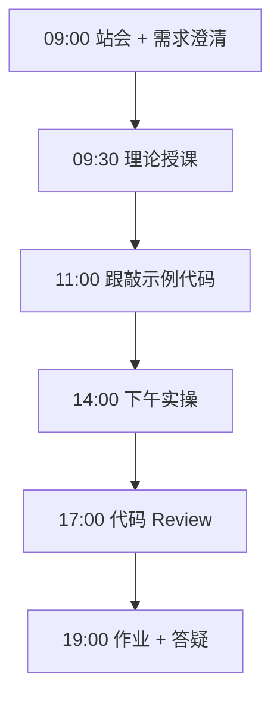

# Day 13：装饰器与异步 — 重试装饰器与 asyncio

> **阶段**：第一阶段:Python编程基础 | **Epic**：NEXUS-E1 | **预计学时**：6-8 小时

## 旁白解读：今日上下文

> 🎬 **模拟站会 09:00** — 智链科技 Nexus 项目组

**陈工**：昨天 API 一超时就崩，生产环境不行。今天写 `@retry` 装饰器——指数退避、随机 jitter，限流 429 时自动等一等再试。

**小王**：装饰器本质是什么？

**陈工**：高阶函数语法糖。`@retry(...)` 等于 `func = retry(...)(func)`。`functools.wraps` 保留原函数名字，不然日志里全是 wrapper。

**架构老张**：下午讲 async。FastAPI 路由默认 async，Day 15 会大量用。今天先理解 `await asyncio.sleep` 和 `time.sleep` 的区别——一个让出控制权，一个阻塞线程。

**林悦**：多模型对比时能并行问三个 API 吗？

**陈工**：`asyncio.gather` 并行，耗时从 3 秒变 1 秒。但要注意 API 并发限额，企业里要加 semaphore 限流，毕业设计阶段再细讲。

**测试小李**：我会测 retry 次数边界：第 max_attempts 次仍失败是否正确抛异常。


**今日在 NexusAgent 主线中的位置**：platform 所有 LLM 客户端将统一 @retry

**今日 Jira 看板**：
- `NEXUS-1301`
- `NEXUS-1302`
- `NEXUS-1303`

---


## 需求文档（产品林悦下发）

**文档编号**：PRD-NEXUS-D13  
**版本**：v1.0  
**优先级**：P0

### 背景

第一阶段:Python编程基础阶段第 13 天教学任务，与 NexusAgent 主线项目对齐。

### User Stories

### NEXUS-1301

**描述**：装饰器与异步 — 重试装饰器与 asyncio 相关交付

**验收标准**：
- [ ] 代码可本地运行
- [ ] 通过 `scripts/verify_day.py --day 13`

### NEXUS-1302

**描述**：装饰器与异步 — 重试装饰器与 asyncio 相关交付

**验收标准**：
- [ ] 代码可本地运行
- [ ] 通过 `scripts/verify_day.py --day 13`

### NEXUS-1303

**描述**：装饰器与异步 — 重试装饰器与 asyncio 相关交付

**验收标准**：
- [ ] 代码可本地运行
- [ ] 通过 `scripts/verify_day.py --day 13`


---


## 今日课表

### 上午 09:00-12:00

- 09:00 站会：API 调用已通，今日加「弹性」——重试与异步
- 09:30 理论：函数是一等公民、闭包、装饰器语法 @
- 10:30 理论：functools.wraps、带参数的装饰器工厂
- 11:00 跟敲 retry_decorator.py

### 下午 14:00-17:30

- 14:00 指数退避与 jitter 讲解，演示 unstable_api_call
- 15:00 asyncio 基础：async def、await、asyncio.run
- 16:00 串行 vs 并行：gather 性能对比
- 17:00 将 @retry 套到 first_llm_call 上

### 晚自习 19:00-21:00

- 19:00 作业：实现 @timing 装饰器，打印函数耗时
- 20:00 预习 FastAPI 异步路由（Day 15 铺垫）

---


## 课堂笔记

### 核心知识点速查

| 序号 | 知识点 | 代码位置 |
|------|--------|----------|
| 1 | 装饰器 decorator 与 @ 语法糖 | 见下午实操 |
| 2 | 闭包与装饰器工厂 | 见下午实操 |
| 3 | functools.wraps 保留元信息 | 见下午实操 |
| 4 | 指数退避 exponential backoff | 见下午实操 |
| 5 | 随机 jitter 避免惊群 | 见下午实操 |
| 6 | async def 定义协程 | 见下午实操 |
| 7 | await 挂起与让出控制权 | 见下午实操 |
| 8 | asyncio.run 事件循环入口 | 见下午实操 |
| 9 | asyncio.gather 并发执行 | 见下午实操 |
| 10 | 同步 vs 异步 IO 模型 | 见下午实操 |

### 今日流程图



### 架构示意图（当日目标）

```mermaid
flowchart TB
    CALL[API 调用] --> RETRY[@retry 装饰器]
    RETRY -->|失败| WAIT[指数退避等待]
    WAIT --> RETRY
    RETRY -->|成功| RESULT[返回结果]
    subgraph async [异步并发]
        T1[fetch OpenAI]
        T2[fetch Qwen]
        T3[fetch DeepSeek]
    end
    GATHER[asyncio.gather] --> T1 & T2 & T3

```

---


## 实操代码清单

- `code/retry_decorator.py`
- `code/async_demo.py`
- `code/robust_llm_demo.py`

请按顺序创建并运行。每段代码均可直接复制到对应文件执行。

---

## 实验手册（分时段操作表）

### 实验步骤 1：09:30-10:30 理论

| 时间 | 动作 | 预期结果 | 失败处理 |
|------|------|----------|----------|
| +0min | 打开课件本节 | 看到需求与验收标准 | 检查是否拉取最新 `develop` 分支 |
| +10min | 创建/打开当日 `code/` 文件 | 文件路径与清单一致 | 对照「实操代码清单」 |
| +30min | 粘贴并运行第一个脚本 | 终端有正常输出无 Traceback | 见下方「排错手册」 |
| +60min | 完成全部文件并自测 | `python3` 运行通过 | 使用 `scripts/verify_day.py --day 13` |
| +90min | 提交 Git 并建 MR | MR 关联 Jira NEXUS-1301 | 按附录 Git 示例操作 |


### 实验步骤 2：10:30-12:00 跟敲

| 时间 | 动作 | 预期结果 | 失败处理 |
|------|------|----------|----------|
| +0min | 打开课件本节 | 看到需求与验收标准 | 检查是否拉取最新 `develop` 分支 |
| +10min | 创建/打开当日 `code/` 文件 | 文件路径与清单一致 | 对照「实操代码清单」 |
| +30min | 粘贴并运行第一个脚本 | 终端有正常输出无 Traceback | 见下方「排错手册」 |
| +60min | 完成全部文件并自测 | `python3` 运行通过 | 使用 `scripts/verify_day.py --day 13` |
| +90min | 提交 Git 并建 MR | MR 关联 Jira NEXUS-1301 | 按附录 Git 示例操作 |


### 实验步骤 3：14:00-15:30 实操

| 时间 | 动作 | 预期结果 | 失败处理 |
|------|------|----------|----------|
| +0min | 打开课件本节 | 看到需求与验收标准 | 检查是否拉取最新 `develop` 分支 |
| +10min | 创建/打开当日 `code/` 文件 | 文件路径与清单一致 | 对照「实操代码清单」 |
| +30min | 粘贴并运行第一个脚本 | 终端有正常输出无 Traceback | 见下方「排错手册」 |
| +60min | 完成全部文件并自测 | `python3` 运行通过 | 使用 `scripts/verify_day.py --day 13` |
| +90min | 提交 Git 并建 MR | MR 关联 Jira NEXUS-1301 | 按附录 Git 示例操作 |


### 实验步骤 4：15:30-17:00 联调

| 时间 | 动作 | 预期结果 | 失败处理 |
|------|------|----------|----------|
| +0min | 打开课件本节 | 看到需求与验收标准 | 检查是否拉取最新 `develop` 分支 |
| +10min | 创建/打开当日 `code/` 文件 | 文件路径与清单一致 | 对照「实操代码清单」 |
| +30min | 粘贴并运行第一个脚本 | 终端有正常输出无 Traceback | 见下方「排错手册」 |
| +60min | 完成全部文件并自测 | `python3` 运行通过 | 使用 `scripts/verify_day.py --day 13` |
| +90min | 提交 Git 并建 MR | MR 关联 Jira NEXUS-1301 | 按附录 Git 示例操作 |


### 实验步骤 5：19:00-20:30 作业

| 时间 | 动作 | 预期结果 | 失败处理 |
|------|------|----------|----------|
| +0min | 打开课件本节 | 看到需求与验收标准 | 检查是否拉取最新 `develop` 分支 |
| +10min | 创建/打开当日 `code/` 文件 | 文件路径与清单一致 | 对照「实操代码清单」 |
| +30min | 粘贴并运行第一个脚本 | 终端有正常输出无 Traceback | 见下方「排错手册」 |
| +60min | 完成全部文件并自测 | `python3` 运行通过 | 使用 `scripts/verify_day.py --day 13` |
| +90min | 提交 Git 并建 MR | MR 关联 Jira NEXUS-1301 | 按附录 Git 示例操作 |


### 排错手册（Day 13）

1. **`command not found: python3`** → 安装 Python 3.10+ 或使用 `py -3`（Windows）
2. **`ModuleNotFoundError`** → 确认当前目录、是否激活 venv、`pip install -r requirements.txt`（若当日有）
3. **`SyntaxError: invalid syntax`** → 检查上一行是否缺括号、引号是否中文
4. **`UnicodeDecodeError`** → 文件保存为 UTF-8，终端 `export PYTHONIOENCODING=utf-8`
5. **API 相关（Day12+）** → 检查 `.env` 中 Key，无 Key 时使用课件 MOCK 模式

---


## 逐步跟敲指南（完整源码与解析）

> 以下代码与 `code/` 目录完全一致，可直接复制。每段附行级说明。

### 文件：`code/retry_decorator.py`

**操作步骤**：
1. 在 `courseware/day-13/code/` 下创建文件 `retry_decorator.py`
2. 完整粘贴下方代码
3. 在终端执行：`cd courseware/day-13/code && python3 retry_decorator.py`（若为包内模块则按课件说明）

```python
#!/usr/bin/env python3
"""
Day 13 示例：重试装饰器 —— 企业级 API 调用的弹性保障

网络抖动、限流 429、服务端 5xx 时，自动重试是生产代码标配。
本模块用装饰器实现可配置的重试逻辑，Day 12 的 API 调用可直接套用。
"""
from __future__ import annotations

import functools
import random
import time
from typing import Any, Callable, TypeVar, ParamSpec

P = ParamSpec("P")
R = TypeVar("R")


def retry(
    max_attempts: int = 3,
    delay: float = 1.0,
    backoff: float = 2.0,
    jitter: bool = True,
    exceptions: tuple[type[Exception], ...] = (Exception,),
) -> Callable[[Callable[P, R]], Callable[P, R]]:
    """
    重试装饰器工厂。

    Args:
        max_attempts: 最大尝试次数（含首次）
        delay: 首次重试前等待秒数
        backoff: 指数退避倍数，第 n 次等待 delay * backoff^(n-1)
        jitter: 是否加随机抖动，避免惊群效应
        exceptions: 触发重试的异常类型元组

    Example:
        @retry(max_attempts=3, exceptions=(requests.HTTPError, requests.Timeout))
        def call_api():
            ...
    """

    def decorator(func: Callable[P, R]) -> Callable[P, R]:
        @functools.wraps(func)  # 保留原函数元信息 __name__, __doc__
        def wrapper(*args: P.args, **kwargs: P.kwargs) -> R:
            last_exc: Exception | None = None
            current_delay = delay

            for attempt in range(1, max_attempts + 1):
                try:
                    return func(*args, **kwargs)
                except exceptions as e:
                    last_exc = e
                    if attempt == max_attempts:
                        break
                    # 计算等待时间
                    wait = current_delay
                    if jitter:
                        wait *= 0.5 + random.random()  # 0.5x ~ 1.5x
                    print(
                        f"[retry] {func.__name__} 第 {attempt} 次失败: {e}，"
                        f"{wait:.1f}s 后重试..."
                    )
                    time.sleep(wait)
                    current_delay *= backoff

            assert last_exc is not None
            raise last_exc

        return wrapper

    return decorator


# ---------- 演示：模拟不稳定的 API ----------
class RateLimitError(Exception):
    """模拟 429 限流。"""


_call_count = 0


@retry(max_attempts=4, delay=0.5, exceptions=(RateLimitError,))
def unstable_api_call(query: str) -> str:
    """
    模拟前两次调用失败、第三次成功的 API。
    被 @retry 装饰后，调用方无感知重试。
    """
    global _call_count
    _call_count += 1
    print(f"  -> unstable_api_call 第 {_call_count} 次执行, query={query!r}")
    if _call_count < 3:
        raise RateLimitError(f"模拟限流，当前第 {_call_count} 次")
    return f"成功响应: {query}"


def demo_retry() -> None:
    global _call_count
    _call_count = 0
    print("=== 重试装饰器演示 ===")
    result = unstable_api_call("NexusAgent")
    print(f"最终结果: {result}")
    print(f"总调用次数: {_call_count}")


if __name__ == "__main__":
    demo_retry()

```

**解析要点（`retry_decorator.py`）**：

- 共 **106** 行，请逐行阅读注释中的中文说明

- 运行前确认 Python 版本 ≥ 3.10：`python3 --version`

- 若报错，先检查缩进是否为 4 空格，勿混用 Tab

- 企业 Review 清单：命名是否清晰、是否有异常处理、是否可复用

---

### 文件：`code/async_demo.py`

**操作步骤**：
1. 在 `courseware/day-13/code/` 下创建文件 `async_demo.py`
2. 完整粘贴下方代码
3. 在终端执行：`cd courseware/day-13/code && python3 async_demo.py`（若为包内模块则按课件说明）

```python
#!/usr/bin/env python3
"""
Day 13 示例：asyncio 异步编程入门

FastAPI（Day 15+）基于 async/await。今日掌握协程、并发调用多个 API 的基础。
"""
from __future__ import annotations

import asyncio
import time
from typing import Any


async def fetch_data(source: str, delay: float) -> dict[str, Any]:
    """
    模拟异步 IO：等待 delay 秒后返回数据。
    await 会挂起当前协程，让事件循环执行其他任务。
    """
    print(f"[{source}] 开始请求...")
    await asyncio.sleep(delay)  # 非阻塞等待，模拟网络 IO
    print(f"[{source}] 完成 ({delay}s)")
    return {"source": source, "data": f"{source} 的响应内容"}


async def fetch_sequential() -> list[dict]:
    """串行调用：总耗时 = 各 delay 之和。"""
    print("\n--- 串行调用 ---")
    t0 = time.perf_counter()
    results = []
    for name, delay in [("OpenAI", 1.0), ("Qwen", 1.0), ("DeepSeek", 1.0)]:
        results.append(await fetch_data(name, delay))
    elapsed = time.perf_counter() - t0
    print(f"串行总耗时: {elapsed:.2f}s")
    return results


async def fetch_parallel() -> list[dict]:
    """并行调用：asyncio.gather 并发执行，总耗时 ≈ 最长 delay。"""
    print("\n--- 并行调用 (gather) ---")
    t0 = time.perf_counter()
    tasks = [
        fetch_data("OpenAI", 1.0),
        fetch_data("Qwen", 1.0),
        fetch_data("DeepSeek", 1.0),
    ]
    results = await asyncio.gather(*tasks)
    elapsed = time.perf_counter() - t0
    print(f"并行总耗时: {elapsed:.2f}s")
    return results


async def async_retry_demo() -> None:
    """异步版重试逻辑（理解即可，Day 15 会结合 aiohttp）。"""
    max_attempts = 3
    for attempt in range(1, max_attempts + 1):
        try:
            await fetch_data("flaky_api", 0.3)
            break
        except Exception:
            if attempt == max_attempts:
                raise
            await asyncio.sleep(0.5 * attempt)


def run_async_main() -> None:
    """
    同步入口调用异步主函数的标准写法。
    asyncio.run() 创建事件循环并运行顶层协程。
    """
    print("=" * 50)
    print("Day 13: asyncio 异步演示")
    print("=" * 50)

    async def main() -> None:
        await fetch_sequential()
        await fetch_parallel()
        await async_retry_demo()

    asyncio.run(main())


if __name__ == "__main__":
    run_async_main()

```

**解析要点（`async_demo.py`）**：

- 共 **83** 行，请逐行阅读注释中的中文说明

- 运行前确认 Python 版本 ≥ 3.10：`python3 --version`

- 若报错，先检查缩进是否为 4 空格，勿混用 Tab

- 企业 Review 清单：命名是否清晰、是否有异常处理、是否可复用

---

### 文件：`code/robust_llm_demo.py`

**操作步骤**：
1. 在 `courseware/day-13/code/` 下创建文件 `robust_llm_demo.py`
2. 完整粘贴下方代码
3. 在终端执行：`cd courseware/day-13/code && python3 robust_llm_demo.py`（若为包内模块则按课件说明）

```python
#!/usr/bin/env python3
"""
Day 13 综合：将 retry 装饰器应用于 Day 12 API 调用（同步版）
"""
from __future__ import annotations

import sys
from pathlib import Path

# 允许从同级目录导入 Day 12 模块
sys.path.insert(0, str(Path(__file__).resolve().parent))

from retry_decorator import retry

try:
    import requests
    from first_llm_call import call_openai_chat, extract_reply
except ImportError:
    print("请确保 first_llm_call.py 在同目录")
    sys.exit(1)


@retry(max_attempts=3, delay=2.0, exceptions=(requests.RequestException,))
def robust_chat(prompt: str) -> str:
    """带重试的单轮对话封装。"""
    messages = [{"role": "user", "content": prompt}]
    resp = call_openai_chat(messages)
    return extract_reply(resp)


if __name__ == "__main__":
    reply = robust_chat("async 和 sync 有什么区别？用一句话回答。")
    print(reply)

```

**解析要点（`robust_llm_demo.py`）**：

- 共 **33** 行，请逐行阅读注释中的中文说明

- 运行前确认 Python 版本 ≥ 3.10：`python3 --version`

- 若报错，先检查缩进是否为 4 空格，勿混用 Tab

- 企业 Review 清单：命名是否清晰、是否有异常处理、是否可复用

---


### 深度讲解 1：装饰器 decorator 与 @ 语法糖

在企业级 Python 开发与大模型应用工程中，**装饰器 decorator 与 @ 语法糖** 是学员必须牢固掌握的基本功。智链科技 Nexus 项目组在 Day 13 的代码评审中，特别强调以下几点：

1. **为什么学**：装饰器 decorator 与 @ 语法糖 直接服务于后续 NexusAgent 平台的 `NEXUS-E1` 模块。没有扎实的 装饰器 decorator 与 @ 语法糖，Day 20 之后调用 API、解析 JSON、编写 Agent 工具函数时会出现大量低级错误。

2. **常见坑**：
   - 忽略输入类型校验，导致运行时 `TypeError`
   - 编码问题（Windows 默认 GBK vs UTF-8）
   - 复制粘贴时缩进错乱（Python 对缩进敏感）

3. **企业实践**：在 SmartLink 的 GitLab 仓库中，所有与 装饰器 decorator 与 @ 语法糖 相关的代码必须经过 Ruff 静态检查；变量命名使用 `snake_case`，常量使用 `UPPER_SNAKE_CASE`。

4. **与主线项目的关系**：今日代码位于 `courseware/day-13/code/`，部分模块将逐步合并到 `platform/nexus_agent/`。请养成「每日代码皆可运行、皆可测试」的习惯。

5. **扩展阅读建议**：完成今日作业后，可阅读 `docs/project-master-plan.md` 中关于 NEXUS-E1 的章节，建立全局视角。

**课堂互动题**：请用 3 句话向非技术同事解释「装饰器 decorator 与 @ 语法糖」是什么。写在作业 MR 的评论里，讲师会抽查点评。

**实操检查清单**：
- [ ] 能不看课件复述 装饰器 decorator 与 @ 语法糖 的定义
- [ ] 能独立写出相关代码并运行
- [ ] 能向同学讲解一处容易写错的地方


### 深度讲解 2：闭包与装饰器工厂

在企业级 Python 开发与大模型应用工程中，**闭包与装饰器工厂** 是学员必须牢固掌握的基本功。智链科技 Nexus 项目组在 Day 13 的代码评审中，特别强调以下几点：

1. **为什么学**：闭包与装饰器工厂 直接服务于后续 NexusAgent 平台的 `NEXUS-E1` 模块。没有扎实的 闭包与装饰器工厂，Day 20 之后调用 API、解析 JSON、编写 Agent 工具函数时会出现大量低级错误。

2. **常见坑**：
   - 忽略输入类型校验，导致运行时 `TypeError`
   - 编码问题（Windows 默认 GBK vs UTF-8）
   - 复制粘贴时缩进错乱（Python 对缩进敏感）

3. **企业实践**：在 SmartLink 的 GitLab 仓库中，所有与 闭包与装饰器工厂 相关的代码必须经过 Ruff 静态检查；变量命名使用 `snake_case`，常量使用 `UPPER_SNAKE_CASE`。

4. **与主线项目的关系**：今日代码位于 `courseware/day-13/code/`，部分模块将逐步合并到 `platform/nexus_agent/`。请养成「每日代码皆可运行、皆可测试」的习惯。

5. **扩展阅读建议**：完成今日作业后，可阅读 `docs/project-master-plan.md` 中关于 NEXUS-E1 的章节，建立全局视角。

**课堂互动题**：请用 3 句话向非技术同事解释「闭包与装饰器工厂」是什么。写在作业 MR 的评论里，讲师会抽查点评。

**实操检查清单**：
- [ ] 能不看课件复述 闭包与装饰器工厂 的定义
- [ ] 能独立写出相关代码并运行
- [ ] 能向同学讲解一处容易写错的地方


### 深度讲解 3：functools.wraps 保留元信息

在企业级 Python 开发与大模型应用工程中，**functools.wraps 保留元信息** 是学员必须牢固掌握的基本功。智链科技 Nexus 项目组在 Day 13 的代码评审中，特别强调以下几点：

1. **为什么学**：functools.wraps 保留元信息 直接服务于后续 NexusAgent 平台的 `NEXUS-E1` 模块。没有扎实的 functools.wraps 保留元信息，Day 20 之后调用 API、解析 JSON、编写 Agent 工具函数时会出现大量低级错误。

2. **常见坑**：
   - 忽略输入类型校验，导致运行时 `TypeError`
   - 编码问题（Windows 默认 GBK vs UTF-8）
   - 复制粘贴时缩进错乱（Python 对缩进敏感）

3. **企业实践**：在 SmartLink 的 GitLab 仓库中，所有与 functools.wraps 保留元信息 相关的代码必须经过 Ruff 静态检查；变量命名使用 `snake_case`，常量使用 `UPPER_SNAKE_CASE`。

4. **与主线项目的关系**：今日代码位于 `courseware/day-13/code/`，部分模块将逐步合并到 `platform/nexus_agent/`。请养成「每日代码皆可运行、皆可测试」的习惯。

5. **扩展阅读建议**：完成今日作业后，可阅读 `docs/project-master-plan.md` 中关于 NEXUS-E1 的章节，建立全局视角。

**课堂互动题**：请用 3 句话向非技术同事解释「functools.wraps 保留元信息」是什么。写在作业 MR 的评论里，讲师会抽查点评。

**实操检查清单**：
- [ ] 能不看课件复述 functools.wraps 保留元信息 的定义
- [ ] 能独立写出相关代码并运行
- [ ] 能向同学讲解一处容易写错的地方


### 深度讲解 4：指数退避 exponential backoff

在企业级 Python 开发与大模型应用工程中，**指数退避 exponential backoff** 是学员必须牢固掌握的基本功。智链科技 Nexus 项目组在 Day 13 的代码评审中，特别强调以下几点：

1. **为什么学**：指数退避 exponential backoff 直接服务于后续 NexusAgent 平台的 `NEXUS-E1` 模块。没有扎实的 指数退避 exponential backoff，Day 20 之后调用 API、解析 JSON、编写 Agent 工具函数时会出现大量低级错误。

2. **常见坑**：
   - 忽略输入类型校验，导致运行时 `TypeError`
   - 编码问题（Windows 默认 GBK vs UTF-8）
   - 复制粘贴时缩进错乱（Python 对缩进敏感）

3. **企业实践**：在 SmartLink 的 GitLab 仓库中，所有与 指数退避 exponential backoff 相关的代码必须经过 Ruff 静态检查；变量命名使用 `snake_case`，常量使用 `UPPER_SNAKE_CASE`。

4. **与主线项目的关系**：今日代码位于 `courseware/day-13/code/`，部分模块将逐步合并到 `platform/nexus_agent/`。请养成「每日代码皆可运行、皆可测试」的习惯。

5. **扩展阅读建议**：完成今日作业后，可阅读 `docs/project-master-plan.md` 中关于 NEXUS-E1 的章节，建立全局视角。

**课堂互动题**：请用 3 句话向非技术同事解释「指数退避 exponential backoff」是什么。写在作业 MR 的评论里，讲师会抽查点评。

**实操检查清单**：
- [ ] 能不看课件复述 指数退避 exponential backoff 的定义
- [ ] 能独立写出相关代码并运行
- [ ] 能向同学讲解一处容易写错的地方


### 深度讲解 5：随机 jitter 避免惊群

在企业级 Python 开发与大模型应用工程中，**随机 jitter 避免惊群** 是学员必须牢固掌握的基本功。智链科技 Nexus 项目组在 Day 13 的代码评审中，特别强调以下几点：

1. **为什么学**：随机 jitter 避免惊群 直接服务于后续 NexusAgent 平台的 `NEXUS-E1` 模块。没有扎实的 随机 jitter 避免惊群，Day 20 之后调用 API、解析 JSON、编写 Agent 工具函数时会出现大量低级错误。

2. **常见坑**：
   - 忽略输入类型校验，导致运行时 `TypeError`
   - 编码问题（Windows 默认 GBK vs UTF-8）
   - 复制粘贴时缩进错乱（Python 对缩进敏感）

3. **企业实践**：在 SmartLink 的 GitLab 仓库中，所有与 随机 jitter 避免惊群 相关的代码必须经过 Ruff 静态检查；变量命名使用 `snake_case`，常量使用 `UPPER_SNAKE_CASE`。

4. **与主线项目的关系**：今日代码位于 `courseware/day-13/code/`，部分模块将逐步合并到 `platform/nexus_agent/`。请养成「每日代码皆可运行、皆可测试」的习惯。

5. **扩展阅读建议**：完成今日作业后，可阅读 `docs/project-master-plan.md` 中关于 NEXUS-E1 的章节，建立全局视角。

**课堂互动题**：请用 3 句话向非技术同事解释「随机 jitter 避免惊群」是什么。写在作业 MR 的评论里，讲师会抽查点评。

**实操检查清单**：
- [ ] 能不看课件复述 随机 jitter 避免惊群 的定义
- [ ] 能独立写出相关代码并运行
- [ ] 能向同学讲解一处容易写错的地方


### 深度讲解 6：async def 定义协程

在企业级 Python 开发与大模型应用工程中，**async def 定义协程** 是学员必须牢固掌握的基本功。智链科技 Nexus 项目组在 Day 13 的代码评审中，特别强调以下几点：

1. **为什么学**：async def 定义协程 直接服务于后续 NexusAgent 平台的 `NEXUS-E1` 模块。没有扎实的 async def 定义协程，Day 20 之后调用 API、解析 JSON、编写 Agent 工具函数时会出现大量低级错误。

2. **常见坑**：
   - 忽略输入类型校验，导致运行时 `TypeError`
   - 编码问题（Windows 默认 GBK vs UTF-8）
   - 复制粘贴时缩进错乱（Python 对缩进敏感）

3. **企业实践**：在 SmartLink 的 GitLab 仓库中，所有与 async def 定义协程 相关的代码必须经过 Ruff 静态检查；变量命名使用 `snake_case`，常量使用 `UPPER_SNAKE_CASE`。

4. **与主线项目的关系**：今日代码位于 `courseware/day-13/code/`，部分模块将逐步合并到 `platform/nexus_agent/`。请养成「每日代码皆可运行、皆可测试」的习惯。

5. **扩展阅读建议**：完成今日作业后，可阅读 `docs/project-master-plan.md` 中关于 NEXUS-E1 的章节，建立全局视角。

**课堂互动题**：请用 3 句话向非技术同事解释「async def 定义协程」是什么。写在作业 MR 的评论里，讲师会抽查点评。

**实操检查清单**：
- [ ] 能不看课件复述 async def 定义协程 的定义
- [ ] 能独立写出相关代码并运行
- [ ] 能向同学讲解一处容易写错的地方


### 深度讲解 7：await 挂起与让出控制权

在企业级 Python 开发与大模型应用工程中，**await 挂起与让出控制权** 是学员必须牢固掌握的基本功。智链科技 Nexus 项目组在 Day 13 的代码评审中，特别强调以下几点：

1. **为什么学**：await 挂起与让出控制权 直接服务于后续 NexusAgent 平台的 `NEXUS-E1` 模块。没有扎实的 await 挂起与让出控制权，Day 20 之后调用 API、解析 JSON、编写 Agent 工具函数时会出现大量低级错误。

2. **常见坑**：
   - 忽略输入类型校验，导致运行时 `TypeError`
   - 编码问题（Windows 默认 GBK vs UTF-8）
   - 复制粘贴时缩进错乱（Python 对缩进敏感）

3. **企业实践**：在 SmartLink 的 GitLab 仓库中，所有与 await 挂起与让出控制权 相关的代码必须经过 Ruff 静态检查；变量命名使用 `snake_case`，常量使用 `UPPER_SNAKE_CASE`。

4. **与主线项目的关系**：今日代码位于 `courseware/day-13/code/`，部分模块将逐步合并到 `platform/nexus_agent/`。请养成「每日代码皆可运行、皆可测试」的习惯。

5. **扩展阅读建议**：完成今日作业后，可阅读 `docs/project-master-plan.md` 中关于 NEXUS-E1 的章节，建立全局视角。

**课堂互动题**：请用 3 句话向非技术同事解释「await 挂起与让出控制权」是什么。写在作业 MR 的评论里，讲师会抽查点评。

**实操检查清单**：
- [ ] 能不看课件复述 await 挂起与让出控制权 的定义
- [ ] 能独立写出相关代码并运行
- [ ] 能向同学讲解一处容易写错的地方


### 深度讲解 8：asyncio.run 事件循环入口

在企业级 Python 开发与大模型应用工程中，**asyncio.run 事件循环入口** 是学员必须牢固掌握的基本功。智链科技 Nexus 项目组在 Day 13 的代码评审中，特别强调以下几点：

1. **为什么学**：asyncio.run 事件循环入口 直接服务于后续 NexusAgent 平台的 `NEXUS-E1` 模块。没有扎实的 asyncio.run 事件循环入口，Day 20 之后调用 API、解析 JSON、编写 Agent 工具函数时会出现大量低级错误。

2. **常见坑**：
   - 忽略输入类型校验，导致运行时 `TypeError`
   - 编码问题（Windows 默认 GBK vs UTF-8）
   - 复制粘贴时缩进错乱（Python 对缩进敏感）

3. **企业实践**：在 SmartLink 的 GitLab 仓库中，所有与 asyncio.run 事件循环入口 相关的代码必须经过 Ruff 静态检查；变量命名使用 `snake_case`，常量使用 `UPPER_SNAKE_CASE`。

4. **与主线项目的关系**：今日代码位于 `courseware/day-13/code/`，部分模块将逐步合并到 `platform/nexus_agent/`。请养成「每日代码皆可运行、皆可测试」的习惯。

5. **扩展阅读建议**：完成今日作业后，可阅读 `docs/project-master-plan.md` 中关于 NEXUS-E1 的章节，建立全局视角。

**课堂互动题**：请用 3 句话向非技术同事解释「asyncio.run 事件循环入口」是什么。写在作业 MR 的评论里，讲师会抽查点评。

**实操检查清单**：
- [ ] 能不看课件复述 asyncio.run 事件循环入口 的定义
- [ ] 能独立写出相关代码并运行
- [ ] 能向同学讲解一处容易写错的地方


### 深度讲解 9：asyncio.gather 并发执行

在企业级 Python 开发与大模型应用工程中，**asyncio.gather 并发执行** 是学员必须牢固掌握的基本功。智链科技 Nexus 项目组在 Day 13 的代码评审中，特别强调以下几点：

1. **为什么学**：asyncio.gather 并发执行 直接服务于后续 NexusAgent 平台的 `NEXUS-E1` 模块。没有扎实的 asyncio.gather 并发执行，Day 20 之后调用 API、解析 JSON、编写 Agent 工具函数时会出现大量低级错误。

2. **常见坑**：
   - 忽略输入类型校验，导致运行时 `TypeError`
   - 编码问题（Windows 默认 GBK vs UTF-8）
   - 复制粘贴时缩进错乱（Python 对缩进敏感）

3. **企业实践**：在 SmartLink 的 GitLab 仓库中，所有与 asyncio.gather 并发执行 相关的代码必须经过 Ruff 静态检查；变量命名使用 `snake_case`，常量使用 `UPPER_SNAKE_CASE`。

4. **与主线项目的关系**：今日代码位于 `courseware/day-13/code/`，部分模块将逐步合并到 `platform/nexus_agent/`。请养成「每日代码皆可运行、皆可测试」的习惯。

5. **扩展阅读建议**：完成今日作业后，可阅读 `docs/project-master-plan.md` 中关于 NEXUS-E1 的章节，建立全局视角。

**课堂互动题**：请用 3 句话向非技术同事解释「asyncio.gather 并发执行」是什么。写在作业 MR 的评论里，讲师会抽查点评。

**实操检查清单**：
- [ ] 能不看课件复述 asyncio.gather 并发执行 的定义
- [ ] 能独立写出相关代码并运行
- [ ] 能向同学讲解一处容易写错的地方


### 深度讲解 10：同步 vs 异步 IO 模型

在企业级 Python 开发与大模型应用工程中，**同步 vs 异步 IO 模型** 是学员必须牢固掌握的基本功。智链科技 Nexus 项目组在 Day 13 的代码评审中，特别强调以下几点：

1. **为什么学**：同步 vs 异步 IO 模型 直接服务于后续 NexusAgent 平台的 `NEXUS-E1` 模块。没有扎实的 同步 vs 异步 IO 模型，Day 20 之后调用 API、解析 JSON、编写 Agent 工具函数时会出现大量低级错误。

2. **常见坑**：
   - 忽略输入类型校验，导致运行时 `TypeError`
   - 编码问题（Windows 默认 GBK vs UTF-8）
   - 复制粘贴时缩进错乱（Python 对缩进敏感）

3. **企业实践**：在 SmartLink 的 GitLab 仓库中，所有与 同步 vs 异步 IO 模型 相关的代码必须经过 Ruff 静态检查；变量命名使用 `snake_case`，常量使用 `UPPER_SNAKE_CASE`。

4. **与主线项目的关系**：今日代码位于 `courseware/day-13/code/`，部分模块将逐步合并到 `platform/nexus_agent/`。请养成「每日代码皆可运行、皆可测试」的习惯。

5. **扩展阅读建议**：完成今日作业后，可阅读 `docs/project-master-plan.md` 中关于 NEXUS-E1 的章节，建立全局视角。

**课堂互动题**：请用 3 句话向非技术同事解释「同步 vs 异步 IO 模型」是什么。写在作业 MR 的评论里，讲师会抽查点评。

**实操检查清单**：
- [ ] 能不看课件复述 同步 vs 异步 IO 模型 的定义
- [ ] 能独立写出相关代码并运行
- [ ] 能向同学讲解一处容易写错的地方


## 阶段复盘锚点（第一阶段:Python编程基础）

今天是 **第一阶段:Python编程基础** 的第 **13** 个学习日。请回顾：

- 昨天学了什么？今天如何承接？
- 今天的内容在 70 天路线图中的坐标？
- 如果我是 Tech Lead，会如何 Review 今日代码？

**陈工寄语**：慢即是快。企业里没人关心你一天学了多少个语法点，只关心你写的脚本能不能在服务器上稳定跑 7×24 小时。今天把地基打牢，后面 Agent 编排、RAG 检索才不会塌。

**林悦补充**：产品侧只验收「用户能感知到的价值」。今日交付虽然简单，但「个人信息卡片」本质是后续「用户画像 Agent」的数据采集原型——字段设计请认真思考。

**代码量统计（累计）**：完成今日后，个人仓库累计约 **18200** 行（含注释与测试），全营目标 10 万行。

**明日预告**：请提前阅读 `courseware/day-14/README.md` 开头的旁白，了解上下文。


## 常见问题 FAQ（讲师答疑实录）


**Q1：学习「装饰器 decorator 与 @ 语法糖」时最常问的问题是什么？**

A：学员常问「这在大模型开发里到底用在哪里」。直接回答：在 NexusAgent 的 `NEXUS-E1` 中，装饰器 decorator 与 @ 语法糖 用于支撑「装饰器与异步 — 重试装饰器与 asyncio」这一交付。建议你打开 `platform/` 对照看未来模块如何引用今日写法。另一个常见问题是「要不要背语法」——不需要背，但要能写出可运行代码，并能在报错时读懂 Traceback。

**追问**：如果线上报错与 装饰器 decorator 与 @ 语法糖 相关，如何排查？  
**答**：① 复现 ② 最小化输入 ③ 打印中间变量 ④ 查 GitLab 历史 diff ⑤ 在 Jira 建 Bug 单附上日志。


**Q2：学习「闭包与装饰器工厂」时最常问的问题是什么？**

A：学员常问「这在大模型开发里到底用在哪里」。直接回答：在 NexusAgent 的 `NEXUS-E1` 中，闭包与装饰器工厂 用于支撑「装饰器与异步 — 重试装饰器与 asyncio」这一交付。建议你打开 `platform/` 对照看未来模块如何引用今日写法。另一个常见问题是「要不要背语法」——不需要背，但要能写出可运行代码，并能在报错时读懂 Traceback。

**追问**：如果线上报错与 闭包与装饰器工厂 相关，如何排查？  
**答**：① 复现 ② 最小化输入 ③ 打印中间变量 ④ 查 GitLab 历史 diff ⑤ 在 Jira 建 Bug 单附上日志。


**Q3：学习「functools.wraps 保留元信息」时最常问的问题是什么？**

A：学员常问「这在大模型开发里到底用在哪里」。直接回答：在 NexusAgent 的 `NEXUS-E1` 中，functools.wraps 保留元信息 用于支撑「装饰器与异步 — 重试装饰器与 asyncio」这一交付。建议你打开 `platform/` 对照看未来模块如何引用今日写法。另一个常见问题是「要不要背语法」——不需要背，但要能写出可运行代码，并能在报错时读懂 Traceback。

**追问**：如果线上报错与 functools.wraps 保留元信息 相关，如何排查？  
**答**：① 复现 ② 最小化输入 ③ 打印中间变量 ④ 查 GitLab 历史 diff ⑤ 在 Jira 建 Bug 单附上日志。


**Q4：学习「指数退避 exponential backoff」时最常问的问题是什么？**

A：学员常问「这在大模型开发里到底用在哪里」。直接回答：在 NexusAgent 的 `NEXUS-E1` 中，指数退避 exponential backoff 用于支撑「装饰器与异步 — 重试装饰器与 asyncio」这一交付。建议你打开 `platform/` 对照看未来模块如何引用今日写法。另一个常见问题是「要不要背语法」——不需要背，但要能写出可运行代码，并能在报错时读懂 Traceback。

**追问**：如果线上报错与 指数退避 exponential backoff 相关，如何排查？  
**答**：① 复现 ② 最小化输入 ③ 打印中间变量 ④ 查 GitLab 历史 diff ⑤ 在 Jira 建 Bug 单附上日志。


**Q5：学习「随机 jitter 避免惊群」时最常问的问题是什么？**

A：学员常问「这在大模型开发里到底用在哪里」。直接回答：在 NexusAgent 的 `NEXUS-E1` 中，随机 jitter 避免惊群 用于支撑「装饰器与异步 — 重试装饰器与 asyncio」这一交付。建议你打开 `platform/` 对照看未来模块如何引用今日写法。另一个常见问题是「要不要背语法」——不需要背，但要能写出可运行代码，并能在报错时读懂 Traceback。

**追问**：如果线上报错与 随机 jitter 避免惊群 相关，如何排查？  
**答**：① 复现 ② 最小化输入 ③ 打印中间变量 ④ 查 GitLab 历史 diff ⑤ 在 Jira 建 Bug 单附上日志。


**Q6：学习「async def 定义协程」时最常问的问题是什么？**

A：学员常问「这在大模型开发里到底用在哪里」。直接回答：在 NexusAgent 的 `NEXUS-E1` 中，async def 定义协程 用于支撑「装饰器与异步 — 重试装饰器与 asyncio」这一交付。建议你打开 `platform/` 对照看未来模块如何引用今日写法。另一个常见问题是「要不要背语法」——不需要背，但要能写出可运行代码，并能在报错时读懂 Traceback。

**追问**：如果线上报错与 async def 定义协程 相关，如何排查？  
**答**：① 复现 ② 最小化输入 ③ 打印中间变量 ④ 查 GitLab 历史 diff ⑤ 在 Jira 建 Bug 单附上日志。


**Q7：学习「await 挂起与让出控制权」时最常问的问题是什么？**

A：学员常问「这在大模型开发里到底用在哪里」。直接回答：在 NexusAgent 的 `NEXUS-E1` 中，await 挂起与让出控制权 用于支撑「装饰器与异步 — 重试装饰器与 asyncio」这一交付。建议你打开 `platform/` 对照看未来模块如何引用今日写法。另一个常见问题是「要不要背语法」——不需要背，但要能写出可运行代码，并能在报错时读懂 Traceback。

**追问**：如果线上报错与 await 挂起与让出控制权 相关，如何排查？  
**答**：① 复现 ② 最小化输入 ③ 打印中间变量 ④ 查 GitLab 历史 diff ⑤ 在 Jira 建 Bug 单附上日志。


**Q8：学习「asyncio.run 事件循环入口」时最常问的问题是什么？**

A：学员常问「这在大模型开发里到底用在哪里」。直接回答：在 NexusAgent 的 `NEXUS-E1` 中，asyncio.run 事件循环入口 用于支撑「装饰器与异步 — 重试装饰器与 asyncio」这一交付。建议你打开 `platform/` 对照看未来模块如何引用今日写法。另一个常见问题是「要不要背语法」——不需要背，但要能写出可运行代码，并能在报错时读懂 Traceback。

**追问**：如果线上报错与 asyncio.run 事件循环入口 相关，如何排查？  
**答**：① 复现 ② 最小化输入 ③ 打印中间变量 ④ 查 GitLab 历史 diff ⑤ 在 Jira 建 Bug 单附上日志。


**Q9：学习「asyncio.gather 并发执行」时最常问的问题是什么？**

A：学员常问「这在大模型开发里到底用在哪里」。直接回答：在 NexusAgent 的 `NEXUS-E1` 中，asyncio.gather 并发执行 用于支撑「装饰器与异步 — 重试装饰器与 asyncio」这一交付。建议你打开 `platform/` 对照看未来模块如何引用今日写法。另一个常见问题是「要不要背语法」——不需要背，但要能写出可运行代码，并能在报错时读懂 Traceback。

**追问**：如果线上报错与 asyncio.gather 并发执行 相关，如何排查？  
**答**：① 复现 ② 最小化输入 ③ 打印中间变量 ④ 查 GitLab 历史 diff ⑤ 在 Jira 建 Bug 单附上日志。


**Q10：学习「同步 vs 异步 IO 模型」时最常问的问题是什么？**

A：学员常问「这在大模型开发里到底用在哪里」。直接回答：在 NexusAgent 的 `NEXUS-E1` 中，同步 vs 异步 IO 模型 用于支撑「装饰器与异步 — 重试装饰器与 asyncio」这一交付。建议你打开 `platform/` 对照看未来模块如何引用今日写法。另一个常见问题是「要不要背语法」——不需要背，但要能写出可运行代码，并能在报错时读懂 Traceback。

**追问**：如果线上报错与 同步 vs 异步 IO 模型 相关，如何排查？  
**答**：① 复现 ② 最小化输入 ③ 打印中间变量 ④ 查 GitLab 历史 diff ⑤ 在 Jira 建 Bug 单附上日志。


## 面试押题（与今日知识点挂钩）

以下题目会出现在 Day 67-69 模拟面试中，建议今日就开始积累答案：

1. **装饰器 decorator 与 @ 语法糖**：请结合 NexusAgent 项目举例说明你在哪一天、哪段代码里用到了它？
2. **闭包与装饰器工厂**：请结合 NexusAgent 项目举例说明你在哪一天、哪段代码里用到了它？
3. **functools.wraps 保留元信息**：请结合 NexusAgent 项目举例说明你在哪一天、哪段代码里用到了它？
4. **指数退避 exponential backoff**：请结合 NexusAgent 项目举例说明你在哪一天、哪段代码里用到了它？
5. **随机 jitter 避免惊群**：请结合 NexusAgent 项目举例说明你在哪一天、哪段代码里用到了它？
6. **async def 定义协程**：请结合 NexusAgent 项目举例说明你在哪一天、哪段代码里用到了它？

**参考答案思路**：采用 STAR 法则（情境-任务-行动-结果），引用 `courseware/day-13/code/` 中的具体文件名与函数名。

---


## Code Review 检查表（陈工版）

合并 MR 前自查：

- [ ] 所有新增 `.py` 文件顶部有模块说明 docstring
- [ ] 无硬编码密钥（API Key 走环境变量）
- [ ] 函数长度 < 50 行，过长则拆分
- [ ] 异常有明确提示，禁止裸 `except:`
- [ ] 提交信息符合 `feat(day-13): ...`
- [ ] README 或注释说明如何运行
- [ ] 与 Jira Story 验收标准逐条对应

**今日重点审查项**：装饰器与异步 — 重试装饰器与 asyncio 相关逻辑是否可读、可测、可扩展至 `platform/nexus_agent/`。

---


## 课后作业

### 作业说明

1. 实现 `@timing` 装饰器：记录函数每次执行耗时，写入 `timing.log`
2. 实现 `@cache_result(ttl=60)` 装饰器：60 秒内相同参数返回缓存
3. 用 `asyncio.gather` 并发调用 3 次 `fetch_data`，对比串行耗时


### 提交要求

1. 代码提交到分支 `feature/day-13-homework`
2. GitLab MR 标题：`[Day-13] homework: 课后作业`
3. 在 MR 描述中附上运行截图或终端输出

### 评分标准（满分 100）

| 项 | 分值 |
|----|------|
| 功能完整 | 40 |
| 代码规范与注释 | 30 |
| 异常处理 | 15 |
| MR 与 Jira 关联 | 15 |

---

## 作业参考答案

> ⚠️ 请先独立完成再对照答案

```python
import time, functools

def timing(func):
    @functools.wraps(func)
    def wrapper(*args, **kwargs):
        t0 = time.perf_counter()
        result = func(*args, **kwargs)
        elapsed = time.perf_counter() - t0
        with open("timing.log", "a") as f:
            f.write(f"{func.__name__}: {elapsed:.4f}s\n")
        return result
    return wrapper
```


---


## 附录：Git 提交示例

```bash
git checkout develop
git pull origin develop
git checkout -b feature/day-13-装饰器与异步-—-重
# 完成代码后
git add courseware/day-13/
git commit -m "feat(day-13): 装饰器与异步 — 重试装饰器与 asyncio"
git push -u origin feature/day-13-装饰器与异步-—-重
```

---

*课件版本 Day-13-v1.0 | 智链科技培训中心*
