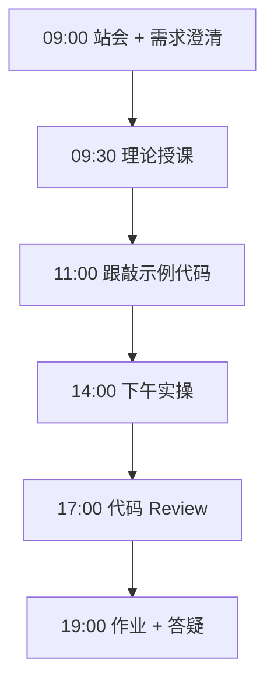
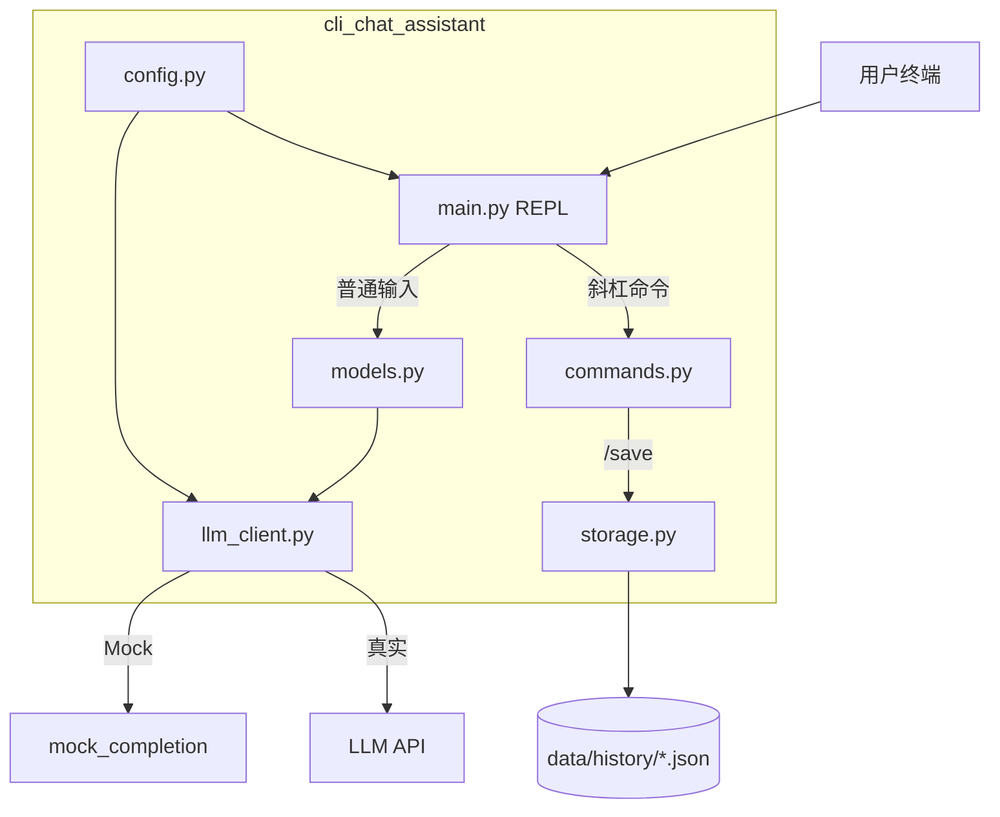

# Day 14：阶段项目一：CLI 多轮对话助手

> **阶段**：第一阶段:Python编程基础 | **Epic**：NEXUS-E1 | **预计学时**：6-8 小时

## 旁白解读：今日上下文

> 🎬 **模拟站会 09:00** — 智链科技 Nexus 项目组

**林悦（产品经理）**：两周了，今天交付第一阶段里程碑——**命令行多轮对话 AI 助手**。验收标准：能连续聊、能清空、能保存、能退出。

**陈工（Tech Lead）**：模块拆清楚：`config` 管配置，`models` 管消息，`llm_client` 管 API，`storage` 管持久化，`commands` 管斜杠指令，`main` 跑 REPL 主循环。这是 platform/nexus_agent 的微缩版。

**小王（后端）**：没 API Key 的学员怎么办？

**陈工**：`mock_mode` 自动检测，Mock 回复也要走完整流程——加消息、构建 history、保存 JSON。逻辑通了再换真 key。

**测试小李**：我列了测试用例：空输入跳过、/clear 后 message_count 为 0、/save 后文件存在且可解析、API 失败时用户消息回滚。

**架构老张**：下午 17:00 代码冻结，19:00 每组 5 分钟演示。MR 标题 `[Day-14] feat: CLI 多轮对话助手 v0.1`，关联 Jira NEXUS-1401~1404。

**林悦**：恭喜大家完成第一阶段！明天开始 FastAPI，把这个助手搬上 Web。


**今日在 NexusAgent 主线中的位置**：NexusAgent v0.1 CLI 版本正式交付

**今日 Jira 看板**：
- `NEXUS-1401`
- `NEXUS-1402`
- `NEXUS-1403`
- `NEXUS-1404`

---


## 需求文档（产品林悦下发）

**文档编号**：PRD-NEXUS-D14  
**版本**：v1.0  
**优先级**：P0

### 背景

第一阶段:Python编程基础阶段第 14 天教学任务，与 NexusAgent 主线项目对齐。

### User Stories

### NEXUS-1401

**描述**：阶段项目一：CLI 多轮对话助手 相关交付

**验收标准**：
- [ ] 代码可本地运行
- [ ] 通过 `scripts/verify_day.py --day 14`

### NEXUS-1402

**描述**：阶段项目一：CLI 多轮对话助手 相关交付

**验收标准**：
- [ ] 代码可本地运行
- [ ] 通过 `scripts/verify_day.py --day 14`

### NEXUS-1403

**描述**：阶段项目一：CLI 多轮对话助手 相关交付

**验收标准**：
- [ ] 代码可本地运行
- [ ] 通过 `scripts/verify_day.py --day 14`

### NEXUS-1404

**描述**：阶段项目一：CLI 多轮对话助手 相关交付

**验收标准**：
- [ ] 代码可本地运行
- [ ] 通过 `scripts/verify_day.py --day 14`


---


## 今日课表

### 上午 09:00-12:00

- 09:00 站会：第一阶段复盘，宣布项目一立项
- 09:30 需求评审：多轮对话、/clear /save /exit、Mock 模式
- 10:30 架构设计：config / models / llm_client / storage / commands 模块划分
- 11:00 搭建 cli_chat_assistant 包骨架

### 下午 14:00-17:30

- 14:00 实现主循环 run_chat_loop 与斜杠命令分发
- 15:00 接入 Day 12 LLM 调用，支持 Mock 降级
- 16:00 实现会话 JSON 持久化 /save
- 17:00 端到端测试：多轮对话 → /save → /clear → /exit

### 晚自习 19:00-21:00

- 19:00 项目答辩准备：演示脚本、README、MR 提交
- 20:00 庆祝第一阶段完成，预习 Day 15 FastAPI 入门

---


## 课堂笔记

### 核心知识点速查

| 序号 | 知识点 | 代码位置 |
|------|--------|----------|
| 1 | REPL 主循环 read-eval-print loop | 见下午实操 |
| 2 | 斜杠命令解析与分发 | 见下午实操 |
| 3 | ChatSession 多轮上下文管理 | 见下午实操 |
| 4 | build_api_messages 构建 LLM 请求 | 见下午实操 |
| 5 | JSON 会话持久化 save/load | 见下午实操 |
| 6 | Mock 模式开发与演示 | 见下午实操 |
| 7 | 模块化包结构设计 | 见下午实操 |
| 8 | API 失败时状态回滚 | 见下午实操 |
| 9 | 配置集中管理 AppConfig | 见下午实操 |
| 10 | 阶段项目 MVP 交付流程 | 见下午实操 |

### 今日流程图



### 架构示意图（当日目标）



---


## 实操代码清单

- `code/cli_chat_assistant/__init__.py`
- `code/cli_chat_assistant/config.py`
- `code/cli_chat_assistant/models.py`
- `code/cli_chat_assistant/llm_client.py`
- `code/cli_chat_assistant/storage.py`
- `code/cli_chat_assistant/commands.py`
- `code/cli_chat_assistant/main.py`
- `code/run_cli.py`
- `code/.env.example`
- `code/requirements.txt`

请按顺序创建并运行。每段代码均可直接复制到对应文件执行。

---

## 实验手册（分时段操作表）

### 实验步骤 1：09:30-10:30 理论

| 时间 | 动作 | 预期结果 | 失败处理 |
|------|------|----------|----------|
| +0min | 打开课件本节 | 看到需求与验收标准 | 检查是否拉取最新 `develop` 分支 |
| +10min | 创建/打开当日 `code/` 文件 | 文件路径与清单一致 | 对照「实操代码清单」 |
| +30min | 粘贴并运行第一个脚本 | 终端有正常输出无 Traceback | 见下方「排错手册」 |
| +60min | 完成全部文件并自测 | `python3` 运行通过 | 使用 `scripts/verify_day.py --day 14` |
| +90min | 提交 Git 并建 MR | MR 关联 Jira NEXUS-1401 | 按附录 Git 示例操作 |


### 实验步骤 2：10:30-12:00 跟敲

| 时间 | 动作 | 预期结果 | 失败处理 |
|------|------|----------|----------|
| +0min | 打开课件本节 | 看到需求与验收标准 | 检查是否拉取最新 `develop` 分支 |
| +10min | 创建/打开当日 `code/` 文件 | 文件路径与清单一致 | 对照「实操代码清单」 |
| +30min | 粘贴并运行第一个脚本 | 终端有正常输出无 Traceback | 见下方「排错手册」 |
| +60min | 完成全部文件并自测 | `python3` 运行通过 | 使用 `scripts/verify_day.py --day 14` |
| +90min | 提交 Git 并建 MR | MR 关联 Jira NEXUS-1401 | 按附录 Git 示例操作 |


### 实验步骤 3：14:00-15:30 实操

| 时间 | 动作 | 预期结果 | 失败处理 |
|------|------|----------|----------|
| +0min | 打开课件本节 | 看到需求与验收标准 | 检查是否拉取最新 `develop` 分支 |
| +10min | 创建/打开当日 `code/` 文件 | 文件路径与清单一致 | 对照「实操代码清单」 |
| +30min | 粘贴并运行第一个脚本 | 终端有正常输出无 Traceback | 见下方「排错手册」 |
| +60min | 完成全部文件并自测 | `python3` 运行通过 | 使用 `scripts/verify_day.py --day 14` |
| +90min | 提交 Git 并建 MR | MR 关联 Jira NEXUS-1401 | 按附录 Git 示例操作 |


### 实验步骤 4：15:30-17:00 联调

| 时间 | 动作 | 预期结果 | 失败处理 |
|------|------|----------|----------|
| +0min | 打开课件本节 | 看到需求与验收标准 | 检查是否拉取最新 `develop` 分支 |
| +10min | 创建/打开当日 `code/` 文件 | 文件路径与清单一致 | 对照「实操代码清单」 |
| +30min | 粘贴并运行第一个脚本 | 终端有正常输出无 Traceback | 见下方「排错手册」 |
| +60min | 完成全部文件并自测 | `python3` 运行通过 | 使用 `scripts/verify_day.py --day 14` |
| +90min | 提交 Git 并建 MR | MR 关联 Jira NEXUS-1401 | 按附录 Git 示例操作 |


### 实验步骤 5：19:00-20:30 作业

| 时间 | 动作 | 预期结果 | 失败处理 |
|------|------|----------|----------|
| +0min | 打开课件本节 | 看到需求与验收标准 | 检查是否拉取最新 `develop` 分支 |
| +10min | 创建/打开当日 `code/` 文件 | 文件路径与清单一致 | 对照「实操代码清单」 |
| +30min | 粘贴并运行第一个脚本 | 终端有正常输出无 Traceback | 见下方「排错手册」 |
| +60min | 完成全部文件并自测 | `python3` 运行通过 | 使用 `scripts/verify_day.py --day 14` |
| +90min | 提交 Git 并建 MR | MR 关联 Jira NEXUS-1401 | 按附录 Git 示例操作 |


### 排错手册（Day 14）

1. **`command not found: python3`** → 安装 Python 3.10+ 或使用 `py -3`（Windows）
2. **`ModuleNotFoundError`** → 确认当前目录、是否激活 venv、`pip install -r requirements.txt`（若当日有）
3. **`SyntaxError: invalid syntax`** → 检查上一行是否缺括号、引号是否中文
4. **`UnicodeDecodeError`** → 文件保存为 UTF-8，终端 `export PYTHONIOENCODING=utf-8`
5. **API 相关（Day12+）** → 检查 `.env` 中 Key，无 Key 时使用课件 MOCK 模式

---


## 逐步跟敲指南（完整源码与解析）

> 以下代码与 `code/` 目录完全一致，可直接复制。每段附行级说明。

### 文件：`code/cli_chat_assistant/__init__.py`

**操作步骤**：
1. 在 `courseware/day-14/code/` 下创建文件 `cli_chat_assistant/__init__.py`
2. 完整粘贴下方代码
3. 在终端执行：`cd courseware/day-14/code && python3 __init__.py`（若为包内模块则按课件说明）

```python
"""
cli_chat_assistant — 阶段项目一：多轮对话 CLI 助手

智链科技 NexusAgent 训练营 Day 14 毕业项目（第一阶段）
功能：多轮对话、/clear /save /exit 指令、历史持久化、Mock/真实 API
"""
__version__ = "0.1.0"

```

**解析要点（`cli_chat_assistant/__init__.py`）**：

- 共 **7** 行，请逐行阅读注释中的中文说明

- 运行前确认 Python 版本 ≥ 3.10：`python3 --version`

- 若报错，先检查缩进是否为 4 空格，勿混用 Tab

- 企业 Review 清单：命名是否清晰、是否有异常处理、是否可复用

---

### 文件：`code/cli_chat_assistant/config.py`

**操作步骤**：
1. 在 `courseware/day-14/code/` 下创建文件 `cli_chat_assistant/config.py`
2. 完整粘贴下方代码
3. 在终端执行：`cd courseware/day-14/code && python3 config.py`（若为包内模块则按课件说明）

```python
"""cli_chat_assistant 配置模块 —— 集中管理环境变量与默认值。"""
from __future__ import annotations

import os
from dataclasses import dataclass, field
from pathlib import Path

from dotenv import load_dotenv

# 加载项目根目录或当前目录的 .env
load_dotenv()


@dataclass
class AppConfig:
    """
    应用配置数据类。
    所有魔法字符串集中在此，便于测试与部署时覆盖。
    """

    # LLM 相关
    api_key: str = field(default_factory=lambda: os.getenv("OPENAI_API_KEY", ""))
    base_url: str = field(default_factory=lambda: os.getenv("OPENAI_BASE_URL", "https://api.openai.com/v1"))
    model: str = field(default_factory=lambda: os.getenv("LLM_MODEL", "gpt-4o-mini"))
    system_prompt: str = "你是智链科技 NexusAgent 平台的 AI 助手，回答简洁、专业、友好。"
    timeout: int = 30
    mock_mode: bool = False

    # 存储相关
    history_dir: Path = field(default_factory=lambda: Path("data/history"))
    default_save_name: str = "session.json"

    def __post_init__(self) -> None:
        """根据 api_key 自动判断是否 Mock 模式。"""
        key = self.api_key.strip()
        if not key or key.startswith("sk-your") or key == "mock":
            self.mock_mode = True
        self.history_dir.mkdir(parents=True, exist_ok=True)


def get_config() -> AppConfig:
    """获取全局配置单例（简化版，未用真正的单例模式）。"""
    return AppConfig()

```

**解析要点（`cli_chat_assistant/config.py`）**：

- 共 **43** 行，请逐行阅读注释中的中文说明

- 运行前确认 Python 版本 ≥ 3.10：`python3 --version`

- 若报错，先检查缩进是否为 4 空格，勿混用 Tab

- 企业 Review 清单：命名是否清晰、是否有异常处理、是否可复用

---

### 文件：`code/cli_chat_assistant/models.py`

**操作步骤**：
1. 在 `courseware/day-14/code/` 下创建文件 `cli_chat_assistant/models.py`
2. 完整粘贴下方代码
3. 在终端执行：`cd courseware/day-14/code && python3 models.py`（若为包内模块则按课件说明）

```python
"""cli_chat_assistant 领域模型 —— 消息与对话会话。"""
from __future__ import annotations

from dataclasses import dataclass, field
from datetime import datetime
from enum import Enum
from typing import Any


class Role(str, Enum):
    """消息角色，与 OpenAI API 对齐。"""

    SYSTEM = "system"
    USER = "user"
    ASSISTANT = "assistant"


@dataclass
class Message:
    """单条对话消息。"""

    role: Role
    content: str
    timestamp: datetime = field(default_factory=datetime.now)

    def to_api_dict(self) -> dict[str, str]:
        """转换为 LLM API 所需的 {role, content} 格式。"""
        return {"role": self.role.value, "content": self.content}

    def to_storage_dict(self) -> dict[str, Any]:
        """转换为可 JSON 序列化的完整字典。"""
        return {
            "role": self.role.value,
            "content": self.content,
            "timestamp": self.timestamp.isoformat(),
        }

    @classmethod
    def from_storage_dict(cls, data: dict[str, Any]) -> Message:
        """从持久化数据恢复 Message 对象。"""
        ts = data.get("timestamp")
        timestamp = datetime.fromisoformat(ts) if isinstance(ts, str) else datetime.now()
        return cls(role=Role(data["role"]), content=data["content"], timestamp=timestamp)

    def preview(self, max_len: int = 60) -> str:
        """生成简短预览，用于历史列表。"""
        text = self.content.replace("\n", " ")
        return text if len(text) <= max_len else text[: max_len - 3] + "..."


@dataclass
class ChatSession:
    """
    一次完整的对话会话，包含系统提示词与多轮消息历史。
  Day 8 ChatMessage 的升级版，增加了会话级管理。
    """

    session_id: str
    messages: list[Message] = field(default_factory=list)
    system_prompt: str = ""
    created_at: datetime = field(default_factory=datetime.now)

    def add_user(self, content: str) -> Message:
        """添加用户消息并返回。"""
        msg = Message(role=Role.USER, content=content)
        self.messages.append(msg)
        return msg

    def add_assistant(self, content: str) -> Message:
        """添加助手回复并返回。"""
        msg = Message(role=Role.ASSISTANT, content=content)
        self.messages.append(msg)
        return msg

    def clear(self) -> int:
        """清空对话历史（保留 system），返回清除条数。"""
        count = len(self.messages)
        self.messages.clear()
        return count

    def build_api_messages(self) -> list[dict[str, str]]:
        """
        构建发送给 LLM API 的 messages 数组。
        格式: [system, user, assistant, user, assistant, ...]
        """
        result: list[dict[str, str]] = []
        if self.system_prompt:
            result.append({"role": "system", "content": self.system_prompt})
        for msg in self.messages:
            result.append(msg.to_api_dict())
        return result

    def message_count(self) -> int:
        """返回当前消息条数。"""
        return len(self.messages)

    def last_exchange_preview(self) -> str:
        """返回最近一轮问答的预览文本。"""
        if not self.messages:
            return "（空会话）"
        last = self.messages[-1]
        return f"[{last.role.value}] {last.preview()}"

```

**解析要点（`cli_chat_assistant/models.py`）**：

- 共 **102** 行，请逐行阅读注释中的中文说明

- 运行前确认 Python 版本 ≥ 3.10：`python3 --version`

- 若报错，先检查缩进是否为 4 空格，勿混用 Tab

- 企业 Review 清单：命名是否清晰、是否有异常处理、是否可复用

---

### 文件：`code/cli_chat_assistant/llm_client.py`

**操作步骤**：
1. 在 `courseware/day-14/code/` 下创建文件 `cli_chat_assistant/llm_client.py`
2. 完整粘贴下方代码
3. 在终端执行：`cd courseware/day-14/code && python3 llm_client.py`（若为包内模块则按课件说明）

```python
"""cli_chat_assistant LLM 客户端 —— 封装 API 调用与 Mock。"""
from __future__ import annotations

from typing import Any

import requests

from cli_chat_assistant.config import AppConfig


def mock_completion(messages: list[dict[str, str]], model: str) -> dict[str, Any]:
    """
    Mock 模式响应，无需真实 API Key 即可演示完整 CLI 流程。
    会根据用户最后一条消息生成模板回复。
    """
    last_user = ""
    for m in reversed(messages):
        if m["role"] == "user":
            last_user = m["content"]
            break

    # 简单关键词回复，增加演示趣味性
    if "你好" in last_user or "hello" in last_user.lower():
        reply = "你好！我是 NexusAgent CLI 助手，有什么可以帮您？"
    elif "rag" in last_user.lower() or "检索" in last_user:
        reply = "RAG（检索增强生成）通过向量检索相关知识再生成回答，是 Day 25+ 的核心内容。"
    elif "/help" in last_user:
        reply = "输入普通文本即可对话。内置命令: /clear /save /exit /help"
    else:
        reply = (
            f"[Mock/{model}] 收到您的消息（{len(last_user)} 字）：\n"
            f"「{last_user[:80]}{'...' if len(last_user) > 80 else ''}」\n"
            f"配置 OPENAI_API_KEY 后可获得真实 AI 回复。"
        )

    return {
        "choices": [{"message": {"role": "assistant", "content": reply}}],
        "usage": {"prompt_tokens": 10, "completion_tokens": 20, "total_tokens": 30},
        "model": model,
    }


def chat_completion(messages: list[dict[str, str]], config: AppConfig) -> str:
    """
    发送多轮对话请求，返回助手回复文本。

    Args:
        messages: OpenAI 格式的消息列表
        config: 应用配置

    Returns:
        助手回复的纯文本

    Raises:
        requests.RequestException: 网络或 HTTP 错误
    """
    if config.mock_mode:
        resp = mock_completion(messages, config.model)
        return resp["choices"][0]["message"]["content"]

    url = f"{config.base_url.rstrip('/')}/chat/completions"
    headers = {
        "Authorization": f"Bearer {config.api_key}",
        "Content-Type": "application/json",
    }
    payload = {
        "model": config.model,
        "messages": messages,
        "temperature": 0.7,
    }

    response = requests.post(url, headers=headers, json=payload, timeout=config.timeout)
    response.raise_for_status()
    data = response.json()
    return data["choices"][0]["message"]["content"]

```

**解析要点（`cli_chat_assistant/llm_client.py`）**：

- 共 **75** 行，请逐行阅读注释中的中文说明

- 运行前确认 Python 版本 ≥ 3.10：`python3 --version`

- 若报错，先检查缩进是否为 4 空格，勿混用 Tab

- 企业 Review 清单：命名是否清晰、是否有异常处理、是否可复用

---

### 文件：`code/cli_chat_assistant/storage.py`

**操作步骤**：
1. 在 `courseware/day-14/code/` 下创建文件 `cli_chat_assistant/storage.py`
2. 完整粘贴下方代码
3. 在终端执行：`cd courseware/day-14/code && python3 storage.py`（若为包内模块则按课件说明）

```python
"""cli_chat_assistant 持久化 —— 会话保存与加载。"""
from __future__ import annotations

import json
from datetime import datetime
from pathlib import Path
from typing import Any

from cli_chat_assistant.models import ChatSession, Message


def session_to_dict(session: ChatSession) -> dict[str, Any]:
    """将会话对象序列化为可 JSON 存储的字典。"""
    return {
        "session_id": session.session_id,
        "system_prompt": session.system_prompt,
        "created_at": session.created_at.isoformat(),
        "messages": [m.to_storage_dict() for m in session.messages],
    }


def session_from_dict(data: dict[str, Any]) -> ChatSession:
    """从字典恢复 ChatSession 对象。"""
    created = data.get("created_at")
    created_at = datetime.fromisoformat(created) if isinstance(created, str) else datetime.now()
    session = ChatSession(
        session_id=data["session_id"],
        system_prompt=data.get("system_prompt", ""),
        created_at=created_at,
    )
    for msg_data in data.get("messages", []):
        session.messages.append(Message.from_storage_dict(msg_data))
    return session


def save_session(session: ChatSession, path: Path) -> None:
    """
    保存会话到 JSON 文件。

    文件格式 UTF-8，缩进 2 空格，便于人工查看与 Git diff。
    """
    path.parent.mkdir(parents=True, exist_ok=True)
    payload = session_to_dict(session)
    path.write_text(json.dumps(payload, ensure_ascii=False, indent=2), encoding="utf-8")


def load_session(path: Path) -> ChatSession:
    """从 JSON 文件加载会话，文件不存在时抛出 FileNotFoundError。"""
    if not path.exists():
        raise FileNotFoundError(f"会话文件不存在: {path}")
    data = json.loads(path.read_text(encoding="utf-8"))
    return session_from_dict(data)


def list_saved_sessions(history_dir: Path) -> list[Path]:
    """列出历史目录下所有 .json 会话文件。"""
    if not history_dir.exists():
        return []
    return sorted(history_dir.glob("*.json"))

```

**解析要点（`cli_chat_assistant/storage.py`）**：

- 共 **59** 行，请逐行阅读注释中的中文说明

- 运行前确认 Python 版本 ≥ 3.10：`python3 --version`

- 若报错，先检查缩进是否为 4 空格，勿混用 Tab

- 企业 Review 清单：命名是否清晰、是否有异常处理、是否可复用

---

### 文件：`code/cli_chat_assistant/commands.py`

**操作步骤**：
1. 在 `courseware/day-14/code/` 下创建文件 `cli_chat_assistant/commands.py`
2. 完整粘贴下方代码
3. 在终端执行：`cd courseware/day-14/code && python3 commands.py`（若为包内模块则按课件说明）

```python
"""cli_chat_assistant 内置斜杠命令处理。"""
from __future__ import annotations

from pathlib import Path

from cli_chat_assistant.config import AppConfig
from cli_chat_assistant.models import ChatSession
from cli_chat_assistant.storage import list_saved_sessions, save_session

# 所有支持的斜杠命令
BUILTIN_COMMANDS = ("/clear", "/save", "/exit", "/help", "/history")


def is_command(text: str) -> bool:
    """判断输入是否为斜杠命令。"""
    return text.strip().startswith("/")


def handle_command(text: str, session: ChatSession, config: AppConfig) -> tuple[bool, str]:
    """
    处理斜杠命令。

    Returns:
        (should_exit, message)
        - should_exit: True 表示应退出主循环
        - message: 反馈给用户的文本（空串表示无需额外输出）
    """
    cmd = text.strip().lower()
    parts = cmd.split(maxsplit=1)
    command = parts[0]
    arg = parts[1] if len(parts) > 1 else ""

    if command == "/exit":
        return True, "再见！感谢使用 NexusAgent CLI 助手。"

    if command == "/clear":
        count = session.clear()
        return False, f"已清空 {count} 条对话记录（系统提示词保留）。"

    if command == "/save":
        # /save 或 /save my_session.json
        filename = arg.strip() if arg else config.default_save_name
        if not filename.endswith(".json"):
            filename += ".json"
        path = config.history_dir / filename
        save_session(session, path)
        return False, f"会话已保存至 {path}（共 {session.message_count()} 条消息）。"

    if command == "/history":
        lines = [f"--- 当前会话 {session.session_id} ---"]
        for i, msg in enumerate(session.messages, 1):
            lines.append(f"  {i}. [{msg.role.value}] {msg.preview(50)}")
        if not session.messages:
            lines.append("  （暂无消息）")
        saved = list_saved_sessions(config.history_dir)
        if saved:
            lines.append(f"\n已保存文件 ({len(saved)} 个):")
            for p in saved[-5:]:
                lines.append(f"  - {p.name}")
        return False, "\n".join(lines)

    if command == "/help":
        help_text = """
可用命令:
  /clear          清空当前对话历史
  /save [文件名]   保存会话到 data/history/
  /history        查看当前会话消息列表
  /help           显示此帮助
  /exit           退出程序

直接输入文字即可与 AI 对话。
"""
        return False, help_text.strip()

    return False, f"未知命令: {command}，输入 /help 查看帮助。"

```

**解析要点（`cli_chat_assistant/commands.py`）**：

- 共 **75** 行，请逐行阅读注释中的中文说明

- 运行前确认 Python 版本 ≥ 3.10：`python3 --version`

- 若报错，先检查缩进是否为 4 空格，勿混用 Tab

- 企业 Review 清单：命名是否清晰、是否有异常处理、是否可复用

---

### 文件：`code/cli_chat_assistant/main.py`

**操作步骤**：
1. 在 `courseware/day-14/code/` 下创建文件 `cli_chat_assistant/main.py`
2. 完整粘贴下方代码
3. 在终端执行：`cd courseware/day-14/code && python3 main.py`（若为包内模块则按课件说明）

```python
#!/usr/bin/env python3
"""
cli_chat_assistant 主入口 —— 多轮对话 REPL

运行方式（在 code/ 目录下）:
    python -m cli_chat_assistant

或:
    python cli_chat_assistant/main.py
"""
from __future__ import annotations

import sys
import uuid
from datetime import datetime

from cli_chat_assistant.commands import handle_command, is_command
from cli_chat_assistant.config import get_config
from cli_chat_assistant.llm_client import chat_completion
from cli_chat_assistant.models import ChatSession


def print_banner(config) -> None:
    """打印启动横幅与模式提示。"""
    mode = "Mock 模式（无 API Key）" if config.mock_mode else f"在线模式 ({config.model})"
    print("=" * 56)
    print("  NexusAgent CLI 助手  |  阶段项目一  |  Day 14")
    print("  智链科技 SmartLink Tech")
    print("=" * 56)
    print(f"  会话模式: {mode}")
    print("  输入 /help 查看命令，/exit 退出")
    print("=" * 56)


def create_session(config) -> ChatSession:
    """创建新会话，生成唯一 session_id。"""
    sid = f"sess-{datetime.now():%Y%m%d}-{uuid.uuid4().hex[:8]}"
    return ChatSession(
        session_id=sid,
        system_prompt=config.system_prompt,
    )


def read_user_input() -> str | None:
    """
    读取用户输入，处理 EOF（Ctrl+D） gracefully。
    Returns None 表示用户请求退出。
    """
    try:
        return input("\n你> ").strip()
    except (EOFError, KeyboardInterrupt):
        print("\n")
        return None


def run_chat_loop() -> int:
    """主对话循环，返回进程退出码。"""
    config = get_config()
    session = create_session(config)
    print_banner(config)

    while True:
        user_text = read_user_input()

        # EOF / Ctrl+C 视为退出
        if user_text is None:
            print("再见！")
            return 0

        if not user_text:
            continue

        # ---------- 斜杠命令分支 ----------
        if is_command(user_text):
            should_exit, msg = handle_command(user_text, session, config)
            if msg:
                print(msg)
            if should_exit:
                return 0
            continue

        # ---------- 普通对话分支 ----------
        session.add_user(user_text)
        api_messages = session.build_api_messages()

        print("助手> ", end="", flush=True)
        try:
            reply = chat_completion(api_messages, config)
            print(reply)
            session.add_assistant(reply)
        except Exception as e:
            # 请求失败时回滚刚添加的用户消息，保持历史一致
            session.messages.pop()
            print(f"\n[错误] API 调用失败: {e}", file=sys.stderr)
            print("请检查网络与 API Key 配置，或稍后重试。", file=sys.stderr)

    return 0


def main() -> int:
    """程序入口。"""
    return run_chat_loop()


if __name__ == "__main__":
    raise SystemExit(main())

```

**解析要点（`cli_chat_assistant/main.py`）**：

- 共 **106** 行，请逐行阅读注释中的中文说明

- 运行前确认 Python 版本 ≥ 3.10：`python3 --version`

- 若报错，先检查缩进是否为 4 空格，勿混用 Tab

- 企业 Review 清单：命名是否清晰、是否有异常处理、是否可复用

---

### 文件：`code/run_cli.py`

**操作步骤**：
1. 在 `courseware/day-14/code/` 下创建文件 `run_cli.py`
2. 完整粘贴下方代码
3. 在终端执行：`cd courseware/day-14/code && python3 run_cli.py`（若为包内模块则按课件说明）

```python
#!/usr/bin/env python3
"""Day 14 快速启动脚本。"""
import sys
from pathlib import Path

# 将 code/ 加入 path，确保包可导入
sys.path.insert(0, str(Path(__file__).resolve().parent))

from cli_chat_assistant.main import main

if __name__ == "__main__":
    raise SystemExit(main())

```

**解析要点（`run_cli.py`）**：

- 共 **12** 行，请逐行阅读注释中的中文说明

- 运行前确认 Python 版本 ≥ 3.10：`python3 --version`

- 若报错，先检查缩进是否为 4 空格，勿混用 Tab

- 企业 Review 清单：命名是否清晰、是否有异常处理、是否可复用

---

### 文件：`code/.env.example`

**操作步骤**：
1. 在 `courseware/day-14/code/` 下创建文件 `.env.example`
2. 完整粘贴下方代码
3. 在终端执行：`cd courseware/day-14/code && python3 .env.example.py`（若为包内模块则按课件说明）

```python
# Day 14 CLI 助手环境变量
OPENAI_API_KEY=sk-your-key-here
OPENAI_BASE_URL=https://api.openai.com/v1
LLM_MODEL=gpt-4o-mini

```

**解析要点（`.env.example`）**：

- 共 **4** 行，请逐行阅读注释中的中文说明

- 运行前确认 Python 版本 ≥ 3.10：`python3 --version`

- 若报错，先检查缩进是否为 4 空格，勿混用 Tab

- 企业 Review 清单：命名是否清晰、是否有异常处理、是否可复用

---

### 文件：`code/requirements.txt`

**操作步骤**：
1. 在 `courseware/day-14/code/` 下创建文件 `requirements.txt`
2. 完整粘贴下方代码
3. 在终端执行：`cd courseware/day-14/code && python3 requirements.txt.py`（若为包内模块则按课件说明）

```python
# Day 14 依赖
requests>=2.28.0
python-dotenv>=1.0.0

```

**解析要点（`requirements.txt`）**：

- 共 **3** 行，请逐行阅读注释中的中文说明

- 运行前确认 Python 版本 ≥ 3.10：`python3 --version`

- 若报错，先检查缩进是否为 4 空格，勿混用 Tab

- 企业 Review 清单：命名是否清晰、是否有异常处理、是否可复用

---


### 深度讲解 1：REPL 主循环 read-eval-print loop

在企业级 Python 开发与大模型应用工程中，**REPL 主循环 read-eval-print loop** 是学员必须牢固掌握的基本功。智链科技 Nexus 项目组在 Day 14 的代码评审中，特别强调以下几点：

1. **为什么学**：REPL 主循环 read-eval-print loop 直接服务于后续 NexusAgent 平台的 `NEXUS-E1` 模块。没有扎实的 REPL 主循环 read-eval-print loop，Day 21 之后调用 API、解析 JSON、编写 Agent 工具函数时会出现大量低级错误。

2. **常见坑**：
   - 忽略输入类型校验，导致运行时 `TypeError`
   - 编码问题（Windows 默认 GBK vs UTF-8）
   - 复制粘贴时缩进错乱（Python 对缩进敏感）

3. **企业实践**：在 SmartLink 的 GitLab 仓库中，所有与 REPL 主循环 read-eval-print loop 相关的代码必须经过 Ruff 静态检查；变量命名使用 `snake_case`，常量使用 `UPPER_SNAKE_CASE`。

4. **与主线项目的关系**：今日代码位于 `courseware/day-14/code/`，部分模块将逐步合并到 `platform/nexus_agent/`。请养成「每日代码皆可运行、皆可测试」的习惯。

5. **扩展阅读建议**：完成今日作业后，可阅读 `docs/project-master-plan.md` 中关于 NEXUS-E1 的章节，建立全局视角。

**课堂互动题**：请用 3 句话向非技术同事解释「REPL 主循环 read-eval-print loop」是什么。写在作业 MR 的评论里，讲师会抽查点评。

**实操检查清单**：
- [ ] 能不看课件复述 REPL 主循环 read-eval-print loop 的定义
- [ ] 能独立写出相关代码并运行
- [ ] 能向同学讲解一处容易写错的地方


### 深度讲解 2：斜杠命令解析与分发

在企业级 Python 开发与大模型应用工程中，**斜杠命令解析与分发** 是学员必须牢固掌握的基本功。智链科技 Nexus 项目组在 Day 14 的代码评审中，特别强调以下几点：

1. **为什么学**：斜杠命令解析与分发 直接服务于后续 NexusAgent 平台的 `NEXUS-E1` 模块。没有扎实的 斜杠命令解析与分发，Day 21 之后调用 API、解析 JSON、编写 Agent 工具函数时会出现大量低级错误。

2. **常见坑**：
   - 忽略输入类型校验，导致运行时 `TypeError`
   - 编码问题（Windows 默认 GBK vs UTF-8）
   - 复制粘贴时缩进错乱（Python 对缩进敏感）

3. **企业实践**：在 SmartLink 的 GitLab 仓库中，所有与 斜杠命令解析与分发 相关的代码必须经过 Ruff 静态检查；变量命名使用 `snake_case`，常量使用 `UPPER_SNAKE_CASE`。

4. **与主线项目的关系**：今日代码位于 `courseware/day-14/code/`，部分模块将逐步合并到 `platform/nexus_agent/`。请养成「每日代码皆可运行、皆可测试」的习惯。

5. **扩展阅读建议**：完成今日作业后，可阅读 `docs/project-master-plan.md` 中关于 NEXUS-E1 的章节，建立全局视角。

**课堂互动题**：请用 3 句话向非技术同事解释「斜杠命令解析与分发」是什么。写在作业 MR 的评论里，讲师会抽查点评。

**实操检查清单**：
- [ ] 能不看课件复述 斜杠命令解析与分发 的定义
- [ ] 能独立写出相关代码并运行
- [ ] 能向同学讲解一处容易写错的地方


### 深度讲解 3：ChatSession 多轮上下文管理

在企业级 Python 开发与大模型应用工程中，**ChatSession 多轮上下文管理** 是学员必须牢固掌握的基本功。智链科技 Nexus 项目组在 Day 14 的代码评审中，特别强调以下几点：

1. **为什么学**：ChatSession 多轮上下文管理 直接服务于后续 NexusAgent 平台的 `NEXUS-E1` 模块。没有扎实的 ChatSession 多轮上下文管理，Day 21 之后调用 API、解析 JSON、编写 Agent 工具函数时会出现大量低级错误。

2. **常见坑**：
   - 忽略输入类型校验，导致运行时 `TypeError`
   - 编码问题（Windows 默认 GBK vs UTF-8）
   - 复制粘贴时缩进错乱（Python 对缩进敏感）

3. **企业实践**：在 SmartLink 的 GitLab 仓库中，所有与 ChatSession 多轮上下文管理 相关的代码必须经过 Ruff 静态检查；变量命名使用 `snake_case`，常量使用 `UPPER_SNAKE_CASE`。

4. **与主线项目的关系**：今日代码位于 `courseware/day-14/code/`，部分模块将逐步合并到 `platform/nexus_agent/`。请养成「每日代码皆可运行、皆可测试」的习惯。

5. **扩展阅读建议**：完成今日作业后，可阅读 `docs/project-master-plan.md` 中关于 NEXUS-E1 的章节，建立全局视角。

**课堂互动题**：请用 3 句话向非技术同事解释「ChatSession 多轮上下文管理」是什么。写在作业 MR 的评论里，讲师会抽查点评。

**实操检查清单**：
- [ ] 能不看课件复述 ChatSession 多轮上下文管理 的定义
- [ ] 能独立写出相关代码并运行
- [ ] 能向同学讲解一处容易写错的地方


### 深度讲解 4：build_api_messages 构建 LLM 请求

在企业级 Python 开发与大模型应用工程中，**build_api_messages 构建 LLM 请求** 是学员必须牢固掌握的基本功。智链科技 Nexus 项目组在 Day 14 的代码评审中，特别强调以下几点：

1. **为什么学**：build_api_messages 构建 LLM 请求 直接服务于后续 NexusAgent 平台的 `NEXUS-E1` 模块。没有扎实的 build_api_messages 构建 LLM 请求，Day 21 之后调用 API、解析 JSON、编写 Agent 工具函数时会出现大量低级错误。

2. **常见坑**：
   - 忽略输入类型校验，导致运行时 `TypeError`
   - 编码问题（Windows 默认 GBK vs UTF-8）
   - 复制粘贴时缩进错乱（Python 对缩进敏感）

3. **企业实践**：在 SmartLink 的 GitLab 仓库中，所有与 build_api_messages 构建 LLM 请求 相关的代码必须经过 Ruff 静态检查；变量命名使用 `snake_case`，常量使用 `UPPER_SNAKE_CASE`。

4. **与主线项目的关系**：今日代码位于 `courseware/day-14/code/`，部分模块将逐步合并到 `platform/nexus_agent/`。请养成「每日代码皆可运行、皆可测试」的习惯。

5. **扩展阅读建议**：完成今日作业后，可阅读 `docs/project-master-plan.md` 中关于 NEXUS-E1 的章节，建立全局视角。

**课堂互动题**：请用 3 句话向非技术同事解释「build_api_messages 构建 LLM 请求」是什么。写在作业 MR 的评论里，讲师会抽查点评。

**实操检查清单**：
- [ ] 能不看课件复述 build_api_messages 构建 LLM 请求 的定义
- [ ] 能独立写出相关代码并运行
- [ ] 能向同学讲解一处容易写错的地方


### 深度讲解 5：JSON 会话持久化 save/load

在企业级 Python 开发与大模型应用工程中，**JSON 会话持久化 save/load** 是学员必须牢固掌握的基本功。智链科技 Nexus 项目组在 Day 14 的代码评审中，特别强调以下几点：

1. **为什么学**：JSON 会话持久化 save/load 直接服务于后续 NexusAgent 平台的 `NEXUS-E1` 模块。没有扎实的 JSON 会话持久化 save/load，Day 21 之后调用 API、解析 JSON、编写 Agent 工具函数时会出现大量低级错误。

2. **常见坑**：
   - 忽略输入类型校验，导致运行时 `TypeError`
   - 编码问题（Windows 默认 GBK vs UTF-8）
   - 复制粘贴时缩进错乱（Python 对缩进敏感）

3. **企业实践**：在 SmartLink 的 GitLab 仓库中，所有与 JSON 会话持久化 save/load 相关的代码必须经过 Ruff 静态检查；变量命名使用 `snake_case`，常量使用 `UPPER_SNAKE_CASE`。

4. **与主线项目的关系**：今日代码位于 `courseware/day-14/code/`，部分模块将逐步合并到 `platform/nexus_agent/`。请养成「每日代码皆可运行、皆可测试」的习惯。

5. **扩展阅读建议**：完成今日作业后，可阅读 `docs/project-master-plan.md` 中关于 NEXUS-E1 的章节，建立全局视角。

**课堂互动题**：请用 3 句话向非技术同事解释「JSON 会话持久化 save/load」是什么。写在作业 MR 的评论里，讲师会抽查点评。

**实操检查清单**：
- [ ] 能不看课件复述 JSON 会话持久化 save/load 的定义
- [ ] 能独立写出相关代码并运行
- [ ] 能向同学讲解一处容易写错的地方


### 深度讲解 6：Mock 模式开发与演示

在企业级 Python 开发与大模型应用工程中，**Mock 模式开发与演示** 是学员必须牢固掌握的基本功。智链科技 Nexus 项目组在 Day 14 的代码评审中，特别强调以下几点：

1. **为什么学**：Mock 模式开发与演示 直接服务于后续 NexusAgent 平台的 `NEXUS-E1` 模块。没有扎实的 Mock 模式开发与演示，Day 21 之后调用 API、解析 JSON、编写 Agent 工具函数时会出现大量低级错误。

2. **常见坑**：
   - 忽略输入类型校验，导致运行时 `TypeError`
   - 编码问题（Windows 默认 GBK vs UTF-8）
   - 复制粘贴时缩进错乱（Python 对缩进敏感）

3. **企业实践**：在 SmartLink 的 GitLab 仓库中，所有与 Mock 模式开发与演示 相关的代码必须经过 Ruff 静态检查；变量命名使用 `snake_case`，常量使用 `UPPER_SNAKE_CASE`。

4. **与主线项目的关系**：今日代码位于 `courseware/day-14/code/`，部分模块将逐步合并到 `platform/nexus_agent/`。请养成「每日代码皆可运行、皆可测试」的习惯。

5. **扩展阅读建议**：完成今日作业后，可阅读 `docs/project-master-plan.md` 中关于 NEXUS-E1 的章节，建立全局视角。

**课堂互动题**：请用 3 句话向非技术同事解释「Mock 模式开发与演示」是什么。写在作业 MR 的评论里，讲师会抽查点评。

**实操检查清单**：
- [ ] 能不看课件复述 Mock 模式开发与演示 的定义
- [ ] 能独立写出相关代码并运行
- [ ] 能向同学讲解一处容易写错的地方


### 深度讲解 7：模块化包结构设计

在企业级 Python 开发与大模型应用工程中，**模块化包结构设计** 是学员必须牢固掌握的基本功。智链科技 Nexus 项目组在 Day 14 的代码评审中，特别强调以下几点：

1. **为什么学**：模块化包结构设计 直接服务于后续 NexusAgent 平台的 `NEXUS-E1` 模块。没有扎实的 模块化包结构设计，Day 21 之后调用 API、解析 JSON、编写 Agent 工具函数时会出现大量低级错误。

2. **常见坑**：
   - 忽略输入类型校验，导致运行时 `TypeError`
   - 编码问题（Windows 默认 GBK vs UTF-8）
   - 复制粘贴时缩进错乱（Python 对缩进敏感）

3. **企业实践**：在 SmartLink 的 GitLab 仓库中，所有与 模块化包结构设计 相关的代码必须经过 Ruff 静态检查；变量命名使用 `snake_case`，常量使用 `UPPER_SNAKE_CASE`。

4. **与主线项目的关系**：今日代码位于 `courseware/day-14/code/`，部分模块将逐步合并到 `platform/nexus_agent/`。请养成「每日代码皆可运行、皆可测试」的习惯。

5. **扩展阅读建议**：完成今日作业后，可阅读 `docs/project-master-plan.md` 中关于 NEXUS-E1 的章节，建立全局视角。

**课堂互动题**：请用 3 句话向非技术同事解释「模块化包结构设计」是什么。写在作业 MR 的评论里，讲师会抽查点评。

**实操检查清单**：
- [ ] 能不看课件复述 模块化包结构设计 的定义
- [ ] 能独立写出相关代码并运行
- [ ] 能向同学讲解一处容易写错的地方


### 深度讲解 8：API 失败时状态回滚

在企业级 Python 开发与大模型应用工程中，**API 失败时状态回滚** 是学员必须牢固掌握的基本功。智链科技 Nexus 项目组在 Day 14 的代码评审中，特别强调以下几点：

1. **为什么学**：API 失败时状态回滚 直接服务于后续 NexusAgent 平台的 `NEXUS-E1` 模块。没有扎实的 API 失败时状态回滚，Day 21 之后调用 API、解析 JSON、编写 Agent 工具函数时会出现大量低级错误。

2. **常见坑**：
   - 忽略输入类型校验，导致运行时 `TypeError`
   - 编码问题（Windows 默认 GBK vs UTF-8）
   - 复制粘贴时缩进错乱（Python 对缩进敏感）

3. **企业实践**：在 SmartLink 的 GitLab 仓库中，所有与 API 失败时状态回滚 相关的代码必须经过 Ruff 静态检查；变量命名使用 `snake_case`，常量使用 `UPPER_SNAKE_CASE`。

4. **与主线项目的关系**：今日代码位于 `courseware/day-14/code/`，部分模块将逐步合并到 `platform/nexus_agent/`。请养成「每日代码皆可运行、皆可测试」的习惯。

5. **扩展阅读建议**：完成今日作业后，可阅读 `docs/project-master-plan.md` 中关于 NEXUS-E1 的章节，建立全局视角。

**课堂互动题**：请用 3 句话向非技术同事解释「API 失败时状态回滚」是什么。写在作业 MR 的评论里，讲师会抽查点评。

**实操检查清单**：
- [ ] 能不看课件复述 API 失败时状态回滚 的定义
- [ ] 能独立写出相关代码并运行
- [ ] 能向同学讲解一处容易写错的地方


### 深度讲解 9：配置集中管理 AppConfig

在企业级 Python 开发与大模型应用工程中，**配置集中管理 AppConfig** 是学员必须牢固掌握的基本功。智链科技 Nexus 项目组在 Day 14 的代码评审中，特别强调以下几点：

1. **为什么学**：配置集中管理 AppConfig 直接服务于后续 NexusAgent 平台的 `NEXUS-E1` 模块。没有扎实的 配置集中管理 AppConfig，Day 21 之后调用 API、解析 JSON、编写 Agent 工具函数时会出现大量低级错误。

2. **常见坑**：
   - 忽略输入类型校验，导致运行时 `TypeError`
   - 编码问题（Windows 默认 GBK vs UTF-8）
   - 复制粘贴时缩进错乱（Python 对缩进敏感）

3. **企业实践**：在 SmartLink 的 GitLab 仓库中，所有与 配置集中管理 AppConfig 相关的代码必须经过 Ruff 静态检查；变量命名使用 `snake_case`，常量使用 `UPPER_SNAKE_CASE`。

4. **与主线项目的关系**：今日代码位于 `courseware/day-14/code/`，部分模块将逐步合并到 `platform/nexus_agent/`。请养成「每日代码皆可运行、皆可测试」的习惯。

5. **扩展阅读建议**：完成今日作业后，可阅读 `docs/project-master-plan.md` 中关于 NEXUS-E1 的章节，建立全局视角。

**课堂互动题**：请用 3 句话向非技术同事解释「配置集中管理 AppConfig」是什么。写在作业 MR 的评论里，讲师会抽查点评。

**实操检查清单**：
- [ ] 能不看课件复述 配置集中管理 AppConfig 的定义
- [ ] 能独立写出相关代码并运行
- [ ] 能向同学讲解一处容易写错的地方


### 深度讲解 10：阶段项目 MVP 交付流程

在企业级 Python 开发与大模型应用工程中，**阶段项目 MVP 交付流程** 是学员必须牢固掌握的基本功。智链科技 Nexus 项目组在 Day 14 的代码评审中，特别强调以下几点：

1. **为什么学**：阶段项目 MVP 交付流程 直接服务于后续 NexusAgent 平台的 `NEXUS-E1` 模块。没有扎实的 阶段项目 MVP 交付流程，Day 21 之后调用 API、解析 JSON、编写 Agent 工具函数时会出现大量低级错误。

2. **常见坑**：
   - 忽略输入类型校验，导致运行时 `TypeError`
   - 编码问题（Windows 默认 GBK vs UTF-8）
   - 复制粘贴时缩进错乱（Python 对缩进敏感）

3. **企业实践**：在 SmartLink 的 GitLab 仓库中，所有与 阶段项目 MVP 交付流程 相关的代码必须经过 Ruff 静态检查；变量命名使用 `snake_case`，常量使用 `UPPER_SNAKE_CASE`。

4. **与主线项目的关系**：今日代码位于 `courseware/day-14/code/`，部分模块将逐步合并到 `platform/nexus_agent/`。请养成「每日代码皆可运行、皆可测试」的习惯。

5. **扩展阅读建议**：完成今日作业后，可阅读 `docs/project-master-plan.md` 中关于 NEXUS-E1 的章节，建立全局视角。

**课堂互动题**：请用 3 句话向非技术同事解释「阶段项目 MVP 交付流程」是什么。写在作业 MR 的评论里，讲师会抽查点评。

**实操检查清单**：
- [ ] 能不看课件复述 阶段项目 MVP 交付流程 的定义
- [ ] 能独立写出相关代码并运行
- [ ] 能向同学讲解一处容易写错的地方


## 阶段复盘锚点（第一阶段:Python编程基础）

今天是 **第一阶段:Python编程基础** 的第 **14** 个学习日。请回顾：

- 昨天学了什么？今天如何承接？
- 今天的内容在 70 天路线图中的坐标？
- 如果我是 Tech Lead，会如何 Review 今日代码？

**陈工寄语**：慢即是快。企业里没人关心你一天学了多少个语法点，只关心你写的脚本能不能在服务器上稳定跑 7×24 小时。今天把地基打牢，后面 Agent 编排、RAG 检索才不会塌。

**林悦补充**：产品侧只验收「用户能感知到的价值」。今日交付虽然简单，但「个人信息卡片」本质是后续「用户画像 Agent」的数据采集原型——字段设计请认真思考。

**代码量统计（累计）**：完成今日后，个人仓库累计约 **19600** 行（含注释与测试），全营目标 10 万行。

**明日预告**：请提前阅读 `courseware/day-15/README.md` 开头的旁白，了解上下文。


## 常见问题 FAQ（讲师答疑实录）


**Q1：学习「REPL 主循环 read-eval-print loop」时最常问的问题是什么？**

A：学员常问「这在大模型开发里到底用在哪里」。直接回答：在 NexusAgent 的 `NEXUS-E1` 中，REPL 主循环 read-eval-print loop 用于支撑「阶段项目一：CLI 多轮对话助手」这一交付。建议你打开 `platform/` 对照看未来模块如何引用今日写法。另一个常见问题是「要不要背语法」——不需要背，但要能写出可运行代码，并能在报错时读懂 Traceback。

**追问**：如果线上报错与 REPL 主循环 read-eval-print loop 相关，如何排查？  
**答**：① 复现 ② 最小化输入 ③ 打印中间变量 ④ 查 GitLab 历史 diff ⑤ 在 Jira 建 Bug 单附上日志。


**Q2：学习「斜杠命令解析与分发」时最常问的问题是什么？**

A：学员常问「这在大模型开发里到底用在哪里」。直接回答：在 NexusAgent 的 `NEXUS-E1` 中，斜杠命令解析与分发 用于支撑「阶段项目一：CLI 多轮对话助手」这一交付。建议你打开 `platform/` 对照看未来模块如何引用今日写法。另一个常见问题是「要不要背语法」——不需要背，但要能写出可运行代码，并能在报错时读懂 Traceback。

**追问**：如果线上报错与 斜杠命令解析与分发 相关，如何排查？  
**答**：① 复现 ② 最小化输入 ③ 打印中间变量 ④ 查 GitLab 历史 diff ⑤ 在 Jira 建 Bug 单附上日志。


**Q3：学习「ChatSession 多轮上下文管理」时最常问的问题是什么？**

A：学员常问「这在大模型开发里到底用在哪里」。直接回答：在 NexusAgent 的 `NEXUS-E1` 中，ChatSession 多轮上下文管理 用于支撑「阶段项目一：CLI 多轮对话助手」这一交付。建议你打开 `platform/` 对照看未来模块如何引用今日写法。另一个常见问题是「要不要背语法」——不需要背，但要能写出可运行代码，并能在报错时读懂 Traceback。

**追问**：如果线上报错与 ChatSession 多轮上下文管理 相关，如何排查？  
**答**：① 复现 ② 最小化输入 ③ 打印中间变量 ④ 查 GitLab 历史 diff ⑤ 在 Jira 建 Bug 单附上日志。


**Q4：学习「build_api_messages 构建 LLM 请求」时最常问的问题是什么？**

A：学员常问「这在大模型开发里到底用在哪里」。直接回答：在 NexusAgent 的 `NEXUS-E1` 中，build_api_messages 构建 LLM 请求 用于支撑「阶段项目一：CLI 多轮对话助手」这一交付。建议你打开 `platform/` 对照看未来模块如何引用今日写法。另一个常见问题是「要不要背语法」——不需要背，但要能写出可运行代码，并能在报错时读懂 Traceback。

**追问**：如果线上报错与 build_api_messages 构建 LLM 请求 相关，如何排查？  
**答**：① 复现 ② 最小化输入 ③ 打印中间变量 ④ 查 GitLab 历史 diff ⑤ 在 Jira 建 Bug 单附上日志。


**Q5：学习「JSON 会话持久化 save/load」时最常问的问题是什么？**

A：学员常问「这在大模型开发里到底用在哪里」。直接回答：在 NexusAgent 的 `NEXUS-E1` 中，JSON 会话持久化 save/load 用于支撑「阶段项目一：CLI 多轮对话助手」这一交付。建议你打开 `platform/` 对照看未来模块如何引用今日写法。另一个常见问题是「要不要背语法」——不需要背，但要能写出可运行代码，并能在报错时读懂 Traceback。

**追问**：如果线上报错与 JSON 会话持久化 save/load 相关，如何排查？  
**答**：① 复现 ② 最小化输入 ③ 打印中间变量 ④ 查 GitLab 历史 diff ⑤ 在 Jira 建 Bug 单附上日志。


**Q6：学习「Mock 模式开发与演示」时最常问的问题是什么？**

A：学员常问「这在大模型开发里到底用在哪里」。直接回答：在 NexusAgent 的 `NEXUS-E1` 中，Mock 模式开发与演示 用于支撑「阶段项目一：CLI 多轮对话助手」这一交付。建议你打开 `platform/` 对照看未来模块如何引用今日写法。另一个常见问题是「要不要背语法」——不需要背，但要能写出可运行代码，并能在报错时读懂 Traceback。

**追问**：如果线上报错与 Mock 模式开发与演示 相关，如何排查？  
**答**：① 复现 ② 最小化输入 ③ 打印中间变量 ④ 查 GitLab 历史 diff ⑤ 在 Jira 建 Bug 单附上日志。


**Q7：学习「模块化包结构设计」时最常问的问题是什么？**

A：学员常问「这在大模型开发里到底用在哪里」。直接回答：在 NexusAgent 的 `NEXUS-E1` 中，模块化包结构设计 用于支撑「阶段项目一：CLI 多轮对话助手」这一交付。建议你打开 `platform/` 对照看未来模块如何引用今日写法。另一个常见问题是「要不要背语法」——不需要背，但要能写出可运行代码，并能在报错时读懂 Traceback。

**追问**：如果线上报错与 模块化包结构设计 相关，如何排查？  
**答**：① 复现 ② 最小化输入 ③ 打印中间变量 ④ 查 GitLab 历史 diff ⑤ 在 Jira 建 Bug 单附上日志。


**Q8：学习「API 失败时状态回滚」时最常问的问题是什么？**

A：学员常问「这在大模型开发里到底用在哪里」。直接回答：在 NexusAgent 的 `NEXUS-E1` 中，API 失败时状态回滚 用于支撑「阶段项目一：CLI 多轮对话助手」这一交付。建议你打开 `platform/` 对照看未来模块如何引用今日写法。另一个常见问题是「要不要背语法」——不需要背，但要能写出可运行代码，并能在报错时读懂 Traceback。

**追问**：如果线上报错与 API 失败时状态回滚 相关，如何排查？  
**答**：① 复现 ② 最小化输入 ③ 打印中间变量 ④ 查 GitLab 历史 diff ⑤ 在 Jira 建 Bug 单附上日志。


**Q9：学习「配置集中管理 AppConfig」时最常问的问题是什么？**

A：学员常问「这在大模型开发里到底用在哪里」。直接回答：在 NexusAgent 的 `NEXUS-E1` 中，配置集中管理 AppConfig 用于支撑「阶段项目一：CLI 多轮对话助手」这一交付。建议你打开 `platform/` 对照看未来模块如何引用今日写法。另一个常见问题是「要不要背语法」——不需要背，但要能写出可运行代码，并能在报错时读懂 Traceback。

**追问**：如果线上报错与 配置集中管理 AppConfig 相关，如何排查？  
**答**：① 复现 ② 最小化输入 ③ 打印中间变量 ④ 查 GitLab 历史 diff ⑤ 在 Jira 建 Bug 单附上日志。


**Q10：学习「阶段项目 MVP 交付流程」时最常问的问题是什么？**

A：学员常问「这在大模型开发里到底用在哪里」。直接回答：在 NexusAgent 的 `NEXUS-E1` 中，阶段项目 MVP 交付流程 用于支撑「阶段项目一：CLI 多轮对话助手」这一交付。建议你打开 `platform/` 对照看未来模块如何引用今日写法。另一个常见问题是「要不要背语法」——不需要背，但要能写出可运行代码，并能在报错时读懂 Traceback。

**追问**：如果线上报错与 阶段项目 MVP 交付流程 相关，如何排查？  
**答**：① 复现 ② 最小化输入 ③ 打印中间变量 ④ 查 GitLab 历史 diff ⑤ 在 Jira 建 Bug 单附上日志。


## 面试押题（与今日知识点挂钩）

以下题目会出现在 Day 67-69 模拟面试中，建议今日就开始积累答案：

1. **REPL 主循环 read-eval-print loop**：请结合 NexusAgent 项目举例说明你在哪一天、哪段代码里用到了它？
2. **斜杠命令解析与分发**：请结合 NexusAgent 项目举例说明你在哪一天、哪段代码里用到了它？
3. **ChatSession 多轮上下文管理**：请结合 NexusAgent 项目举例说明你在哪一天、哪段代码里用到了它？
4. **build_api_messages 构建 LLM 请求**：请结合 NexusAgent 项目举例说明你在哪一天、哪段代码里用到了它？
5. **JSON 会话持久化 save/load**：请结合 NexusAgent 项目举例说明你在哪一天、哪段代码里用到了它？
6. **Mock 模式开发与演示**：请结合 NexusAgent 项目举例说明你在哪一天、哪段代码里用到了它？

**参考答案思路**：采用 STAR 法则（情境-任务-行动-结果），引用 `courseware/day-14/code/` 中的具体文件名与函数名。

---


## Code Review 检查表（陈工版）

合并 MR 前自查：

- [ ] 所有新增 `.py` 文件顶部有模块说明 docstring
- [ ] 无硬编码密钥（API Key 走环境变量）
- [ ] 函数长度 < 50 行，过长则拆分
- [ ] 异常有明确提示，禁止裸 `except:`
- [ ] 提交信息符合 `feat(day-14): ...`
- [ ] README 或注释说明如何运行
- [ ] 与 Jira Story 验收标准逐条对应

**今日重点审查项**：阶段项目一：CLI 多轮对话助手 相关逻辑是否可读、可测、可扩展至 `platform/nexus_agent/`。

---


## 课后作业

### 作业说明

在项目一基础上扩展（选做 2 项以上）：

1. `/load <文件名>` 命令：从 data/history/ 加载历史会话
2. 流式输出：逐字打印助手回复（模拟 stream，可用 time.sleep）
3. `/model <name>` 命令：运行时切换模型
4. 编写 `tests/test_commands.py` 测试 /clear 和 /save 逻辑
5. 撰写项目 README：安装、配置、使用说明、架构图


### 提交要求

1. 代码提交到分支 `feature/day-14-homework`
2. GitLab MR 标题：`[Day-14] homework: 课后作业`
3. 在 MR 描述中附上运行截图或终端输出

### 评分标准（满分 100）

| 项 | 分值 |
|----|------|
| 功能完整 | 40 |
| 代码规范与注释 | 30 |
| 异常处理 | 15 |
| MR 与 Jira 关联 | 15 |

---

## 作业参考答案

> ⚠️ 请先独立完成再对照答案

```python
# commands.py 添加 /load
from cli_chat_assistant.storage import load_session

if command == "/load":
    filename = arg or config.default_save_name
    if not filename.endswith(".json"):
        filename += ".json"
    path = config.history_dir / filename
    loaded = load_session(path)
    session.messages = loaded.messages
    session.session_id = loaded.session_id
    return False, f"已加载 {path}，共 {session.message_count()} 条消息"
```


---


## 附录：Git 提交示例

```bash
git checkout develop
git pull origin develop
git checkout -b feature/day-14-阶段项目一：cli-
# 完成代码后
git add courseware/day-14/
git commit -m "feat(day-14): 阶段项目一：CLI 多轮对话助手"
git push -u origin feature/day-14-阶段项目一：cli-
```

---

*课件版本 Day-14-v1.0 | 智链科技培训中心*
