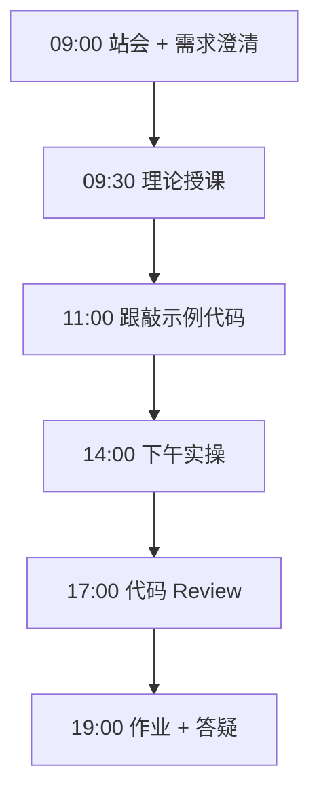
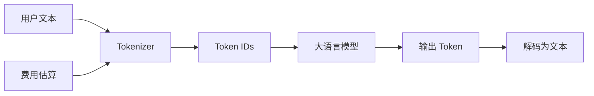

# Day 15：LLM原理科普

> **阶段**：Phase 2：大模型基础与Prompt工程 | **Epic**：NEXUS-E2 | **预计学时**：6-8 小时

## 旁白解读：今日上下文

> 🎬 **模拟站会 09:00** — 智链科技 Nexus 项目组

林悦：「陈工，市场部要做 AI 功能，老板问一天大概花多少钱，我们答不上来。」
陈工：「先别慌。Day 15 开始，你们要学会用 token 说话——不懂 token，后面 Prompt 优化、RAG 切片、API 限流全是盲人摸象。」
你作为 Nexus 组新人，今天的任务是写出一个 **token 计数与费用估算脚本**，这是后续所有 LLM 功能的成本基线。

**今日在 NexusAgent 主线中的位置**：为 NexusAgent v0.2 API 层建立成本意识

**今日 Jira 看板**：
- `NEXUS-151`
- `NEXUS-152`
- `NEXUS-153`

---


## 需求文档（产品林悦下发）

**文档编号**：PRD-NEXUS-D15  
**版本**：v1.0  
**优先级**：P0

### 背景

Phase 2：大模型基础与Prompt工程阶段第 15 天教学任务，与 NexusAgent 主线项目对齐。

### User Stories

### NEXUS-151

**描述**：LLM原理科普 相关交付

**验收标准**：
- [ ] 代码可本地运行
- [ ] 通过 `scripts/verify_day.py --day 15`

### NEXUS-152

**描述**：LLM原理科普 相关交付

**验收标准**：
- [ ] 代码可本地运行
- [ ] 通过 `scripts/verify_day.py --day 15`

### NEXUS-153

**描述**：LLM原理科普 相关交付

**验收标准**：
- [ ] 代码可本地运行
- [ ] 通过 `scripts/verify_day.py --day 15`


---


## 今日课表

### 上午 09:00-12:00

- 站会：回顾 Day 1-14 CLI 助手，引出「为什么要懂大模型原理」
- 理论：Transformer 直觉、预训练/微调/SFT、Token 与上下文窗口
- 演示：GPT 类模型输入输出流程（文本 → Token → 概率 → 文本）

### 下午 14:00-17:30

- 跟敲 tiktoken_cost.py：安装 tiktoken，统计中英文混合文本 token 数
- 对比 DeepSeek / GPT-4o-mini / Qwen 定价表，估算单次对话成本
- 讨论：企业项目如何做 API 费用预算与限流

### 晚自习 19:00-21:00

- 阅读 OpenAI Tokenizer 文档
- 作业：统计自己 Day 1-14 全部代码文件的 token 总量
- 预习：Chat Completions API 请求体结构

---


## 课堂笔记

### 核心知识点速查

| 序号 | 知识点 | 代码位置 |
|------|--------|----------|
| 1 | Token 与分词 | 见下午实操 |
| 2 | 上下文窗口 | 见下午实操 |
| 3 | API 按量计费 | 见下午实操 |
| 4 | tiktoken 使用 | 见下午实操 |
| 5 | 模型定价对比 | 见下午实操 |

### 今日流程图



### 架构示意图（当日目标）



---


## 实操代码清单

- `code/tiktoken_cost.py`

请按顺序创建并运行。每段代码均可直接复制到对应文件执行。

---

## 实验手册（分时段操作表）

### 实验步骤 1：09:30-10:30 理论

| 时间 | 动作 | 预期结果 | 失败处理 |
|------|------|----------|----------|
| +0min | 打开课件本节 | 看到需求与验收标准 | 检查是否拉取最新 `develop` 分支 |
| +10min | 创建/打开当日 `code/` 文件 | 文件路径与清单一致 | 对照「实操代码清单」 |
| +30min | 粘贴并运行第一个脚本 | 终端有正常输出无 Traceback | 见下方「排错手册」 |
| +60min | 完成全部文件并自测 | `python3` 运行通过 | 使用 `scripts/verify_day.py --day 15` |
| +90min | 提交 Git 并建 MR | MR 关联 Jira NEXUS-151 | 按附录 Git 示例操作 |


### 实验步骤 2：10:30-12:00 跟敲

| 时间 | 动作 | 预期结果 | 失败处理 |
|------|------|----------|----------|
| +0min | 打开课件本节 | 看到需求与验收标准 | 检查是否拉取最新 `develop` 分支 |
| +10min | 创建/打开当日 `code/` 文件 | 文件路径与清单一致 | 对照「实操代码清单」 |
| +30min | 粘贴并运行第一个脚本 | 终端有正常输出无 Traceback | 见下方「排错手册」 |
| +60min | 完成全部文件并自测 | `python3` 运行通过 | 使用 `scripts/verify_day.py --day 15` |
| +90min | 提交 Git 并建 MR | MR 关联 Jira NEXUS-151 | 按附录 Git 示例操作 |


### 实验步骤 3：14:00-15:30 实操

| 时间 | 动作 | 预期结果 | 失败处理 |
|------|------|----------|----------|
| +0min | 打开课件本节 | 看到需求与验收标准 | 检查是否拉取最新 `develop` 分支 |
| +10min | 创建/打开当日 `code/` 文件 | 文件路径与清单一致 | 对照「实操代码清单」 |
| +30min | 粘贴并运行第一个脚本 | 终端有正常输出无 Traceback | 见下方「排错手册」 |
| +60min | 完成全部文件并自测 | `python3` 运行通过 | 使用 `scripts/verify_day.py --day 15` |
| +90min | 提交 Git 并建 MR | MR 关联 Jira NEXUS-151 | 按附录 Git 示例操作 |


### 实验步骤 4：15:30-17:00 联调

| 时间 | 动作 | 预期结果 | 失败处理 |
|------|------|----------|----------|
| +0min | 打开课件本节 | 看到需求与验收标准 | 检查是否拉取最新 `develop` 分支 |
| +10min | 创建/打开当日 `code/` 文件 | 文件路径与清单一致 | 对照「实操代码清单」 |
| +30min | 粘贴并运行第一个脚本 | 终端有正常输出无 Traceback | 见下方「排错手册」 |
| +60min | 完成全部文件并自测 | `python3` 运行通过 | 使用 `scripts/verify_day.py --day 15` |
| +90min | 提交 Git 并建 MR | MR 关联 Jira NEXUS-151 | 按附录 Git 示例操作 |


### 实验步骤 5：19:00-20:30 作业

| 时间 | 动作 | 预期结果 | 失败处理 |
|------|------|----------|----------|
| +0min | 打开课件本节 | 看到需求与验收标准 | 检查是否拉取最新 `develop` 分支 |
| +10min | 创建/打开当日 `code/` 文件 | 文件路径与清单一致 | 对照「实操代码清单」 |
| +30min | 粘贴并运行第一个脚本 | 终端有正常输出无 Traceback | 见下方「排错手册」 |
| +60min | 完成全部文件并自测 | `python3` 运行通过 | 使用 `scripts/verify_day.py --day 15` |
| +90min | 提交 Git 并建 MR | MR 关联 Jira NEXUS-151 | 按附录 Git 示例操作 |


### 排错手册（Day 15）

1. **`command not found: python3`** → 安装 Python 3.10+ 或使用 `py -3`（Windows）
2. **`ModuleNotFoundError`** → 确认当前目录、是否激活 venv、`pip install -r requirements.txt`（若当日有）
3. **`SyntaxError: invalid syntax`** → 检查上一行是否缺括号、引号是否中文
4. **`UnicodeDecodeError`** → 文件保存为 UTF-8，终端 `export PYTHONIOENCODING=utf-8`
5. **API 相关（Day12+）** → 检查 `.env` 中 Key，无 Key 时使用课件 MOCK 模式

---


## 逐步跟敲指南（完整源码与解析）

> 以下代码与 `code/` 目录完全一致，可直接复制。每段附行级说明。

### 文件：`code/tiktoken_cost.py`

**操作步骤**：
1. 在 `courseware/day-15/code/` 下创建文件 `tiktoken_cost.py`
2. 完整粘贴下方代码
3. 在终端执行：`cd courseware/day-15/code && python3 tiktoken_cost.py`（若为包内模块则按课件说明）

```python
#!/usr/bin/env python3
"""
Day 15 实操：Token 计数与 API 费用估算
演示 tiktoken 分词原理，并估算不同模型的调用成本。
无 API Key 时可纯本地运行（仅做 token 统计）。
"""
from __future__ import annotations

import os
from dataclasses import dataclass


@dataclass
class ModelPricing:
    """模型定价表（每百万 token，单位：人民币元，教学用近似值）。"""

    name: str
    input_per_million: float
    output_per_million: float


# 常见模型定价（教学演示，请以厂商官网为准）
PRICING_TABLE: list[ModelPricing] = [
    ModelPricing("deepseek-chat", 1.0, 2.0),
    ModelPricing("gpt-4o-mini", 1.1, 4.4),
    ModelPricing("qwen-plus", 0.8, 2.0),
]


def count_tokens_simple(text: str) -> int:
    """
    简易 token 估算：中文约 1.5 字/token，英文约 4 字符/token。
    生产环境请使用 tiktoken 或厂商 tokenizer。
    """
    chinese_chars = sum(1 for c in text if "\u4e00" <= c <= "\u9fff")
    other_chars = len(text) - chinese_chars
    return int(chinese_chars / 1.5 + other_chars / 4) + 1


def count_tokens_tiktoken(text: str, model: str = "cl100k_base") -> int | None:
    """使用 tiktoken 精确计数；未安装时返回 None。"""
    try:
        import tiktoken  # type: ignore

        try:
            enc = tiktoken.encoding_for_model(model)
        except KeyError:
            enc = tiktoken.get_encoding("cl100k_base")
        return len(enc.encode(text))
    except ImportError:
        return None


def estimate_cost(
    input_tokens: int,
    output_tokens: int,
    pricing: ModelPricing,
) -> dict[str, float]:
    """根据 token 数估算单次调用费用（元）。"""
    input_cost = input_tokens / 1_000_000 * pricing.input_per_million
    output_cost = output_tokens / 1_000_000 * pricing.output_per_million
    return {
        "input_cost": round(input_cost, 6),
        "output_cost": round(output_cost, 6),
        "total_cost": round(input_cost + output_cost, 6),
    }


def demo_conversation_cost() -> None:
    """模拟一段多轮对话的 token 与费用。"""
    system_prompt = "你是智链科技 Nexus 项目的 AI 助手，回答简洁专业。"
    user_messages = [
        "什么是大语言模型？用三句话解释。",
        "它和传统搜索引擎有什么区别？",
        "我们项目里 Day 15 为什么要学 token 计数？",
    ]

    print("=" * 60)
    print("Day 15 — Token 计数与费用估算演示")
    print("=" * 60)

    total_input = count_tokens_tiktoken(system_prompt) or count_tokens_simple(system_prompt)
    print(f"\n[System] tokens ≈ {total_input}")

    for i, msg in enumerate(user_messages, 1):
        tokens = count_tokens_tiktoken(msg) or count_tokens_simple(msg)
        total_input += tokens
        # 假设模型回复约为用户输入的 2 倍 token
        assumed_reply_tokens = tokens * 2
        print(f"\n[User {i}] {msg[:40]}...")
        print(f"  用户 tokens ≈ {tokens}，假设回复 tokens ≈ {assumed_reply_tokens}")

    assumed_output = total_input  # 简化：输出总量约等于输入
    print(f"\n累计输入 tokens ≈ {total_input}")
    print(f"累计输出 tokens（估算）≈ {assumed_output}")

    print("\n--- 各模型费用估算（单次多轮对话）---")
    for p in PRICING_TABLE:
        cost = estimate_cost(total_input, assumed_output, p)
        print(
            f"  {p.name:20s}  输入 ¥{cost['input_cost']:.4f}  "
            f"输出 ¥{cost['output_cost']:.4f}  合计 ¥{cost['total_cost']:.4f}"
        )

    print("\n提示：设置环境变量 DEEPSEEK_API_KEY 后可对接真实 API 做对比验证。")
    if os.getenv("DEEPSEEK_API_KEY"):
        print("  检测到 DEEPSEEK_API_KEY，可在作业中扩展真实调用统计。")
    else:
        print("  当前为纯本地演示模式（无需 API Key）。")


if __name__ == "__main__":
    demo_conversation_cost()

```

**解析要点（`tiktoken_cost.py`）**：

- 共 **113** 行，请逐行阅读注释中的中文说明

- 运行前确认 Python 版本 ≥ 3.10：`python3 --version`

- 若报错，先检查缩进是否为 4 空格，勿混用 Tab

- 企业 Review 清单：命名是否清晰、是否有异常处理、是否可复用

---


### 深度讲解 1：Token 与分词

在企业级 Python 开发与大模型应用工程中，**Token 与分词** 是学员必须牢固掌握的基本功。智链科技 Nexus 项目组在 Day 15 的代码评审中，特别强调以下几点：

1. **为什么学**：Token 与分词 直接服务于后续 NexusAgent 平台的 `NEXUS-E2` 模块。没有扎实的 Token 与分词，Day 22 之后调用 API、解析 JSON、编写 Agent 工具函数时会出现大量低级错误。

2. **常见坑**：
   - 忽略输入类型校验，导致运行时 `TypeError`
   - 编码问题（Windows 默认 GBK vs UTF-8）
   - 复制粘贴时缩进错乱（Python 对缩进敏感）

3. **企业实践**：在 SmartLink 的 GitLab 仓库中，所有与 Token 与分词 相关的代码必须经过 Ruff 静态检查；变量命名使用 `snake_case`，常量使用 `UPPER_SNAKE_CASE`。

4. **与主线项目的关系**：今日代码位于 `courseware/day-15/code/`，部分模块将逐步合并到 `platform/nexus_agent/`。请养成「每日代码皆可运行、皆可测试」的习惯。

5. **扩展阅读建议**：完成今日作业后，可阅读 `docs/project-master-plan.md` 中关于 NEXUS-E2 的章节，建立全局视角。

**课堂互动题**：请用 3 句话向非技术同事解释「Token 与分词」是什么。写在作业 MR 的评论里，讲师会抽查点评。

**实操检查清单**：
- [ ] 能不看课件复述 Token 与分词 的定义
- [ ] 能独立写出相关代码并运行
- [ ] 能向同学讲解一处容易写错的地方


### 深度讲解 2：上下文窗口

在企业级 Python 开发与大模型应用工程中，**上下文窗口** 是学员必须牢固掌握的基本功。智链科技 Nexus 项目组在 Day 15 的代码评审中，特别强调以下几点：

1. **为什么学**：上下文窗口 直接服务于后续 NexusAgent 平台的 `NEXUS-E2` 模块。没有扎实的 上下文窗口，Day 22 之后调用 API、解析 JSON、编写 Agent 工具函数时会出现大量低级错误。

2. **常见坑**：
   - 忽略输入类型校验，导致运行时 `TypeError`
   - 编码问题（Windows 默认 GBK vs UTF-8）
   - 复制粘贴时缩进错乱（Python 对缩进敏感）

3. **企业实践**：在 SmartLink 的 GitLab 仓库中，所有与 上下文窗口 相关的代码必须经过 Ruff 静态检查；变量命名使用 `snake_case`，常量使用 `UPPER_SNAKE_CASE`。

4. **与主线项目的关系**：今日代码位于 `courseware/day-15/code/`，部分模块将逐步合并到 `platform/nexus_agent/`。请养成「每日代码皆可运行、皆可测试」的习惯。

5. **扩展阅读建议**：完成今日作业后，可阅读 `docs/project-master-plan.md` 中关于 NEXUS-E2 的章节，建立全局视角。

**课堂互动题**：请用 3 句话向非技术同事解释「上下文窗口」是什么。写在作业 MR 的评论里，讲师会抽查点评。

**实操检查清单**：
- [ ] 能不看课件复述 上下文窗口 的定义
- [ ] 能独立写出相关代码并运行
- [ ] 能向同学讲解一处容易写错的地方


### 深度讲解 3：API 按量计费

在企业级 Python 开发与大模型应用工程中，**API 按量计费** 是学员必须牢固掌握的基本功。智链科技 Nexus 项目组在 Day 15 的代码评审中，特别强调以下几点：

1. **为什么学**：API 按量计费 直接服务于后续 NexusAgent 平台的 `NEXUS-E2` 模块。没有扎实的 API 按量计费，Day 22 之后调用 API、解析 JSON、编写 Agent 工具函数时会出现大量低级错误。

2. **常见坑**：
   - 忽略输入类型校验，导致运行时 `TypeError`
   - 编码问题（Windows 默认 GBK vs UTF-8）
   - 复制粘贴时缩进错乱（Python 对缩进敏感）

3. **企业实践**：在 SmartLink 的 GitLab 仓库中，所有与 API 按量计费 相关的代码必须经过 Ruff 静态检查；变量命名使用 `snake_case`，常量使用 `UPPER_SNAKE_CASE`。

4. **与主线项目的关系**：今日代码位于 `courseware/day-15/code/`，部分模块将逐步合并到 `platform/nexus_agent/`。请养成「每日代码皆可运行、皆可测试」的习惯。

5. **扩展阅读建议**：完成今日作业后，可阅读 `docs/project-master-plan.md` 中关于 NEXUS-E2 的章节，建立全局视角。

**课堂互动题**：请用 3 句话向非技术同事解释「API 按量计费」是什么。写在作业 MR 的评论里，讲师会抽查点评。

**实操检查清单**：
- [ ] 能不看课件复述 API 按量计费 的定义
- [ ] 能独立写出相关代码并运行
- [ ] 能向同学讲解一处容易写错的地方


### 深度讲解 4：tiktoken 使用

在企业级 Python 开发与大模型应用工程中，**tiktoken 使用** 是学员必须牢固掌握的基本功。智链科技 Nexus 项目组在 Day 15 的代码评审中，特别强调以下几点：

1. **为什么学**：tiktoken 使用 直接服务于后续 NexusAgent 平台的 `NEXUS-E2` 模块。没有扎实的 tiktoken 使用，Day 22 之后调用 API、解析 JSON、编写 Agent 工具函数时会出现大量低级错误。

2. **常见坑**：
   - 忽略输入类型校验，导致运行时 `TypeError`
   - 编码问题（Windows 默认 GBK vs UTF-8）
   - 复制粘贴时缩进错乱（Python 对缩进敏感）

3. **企业实践**：在 SmartLink 的 GitLab 仓库中，所有与 tiktoken 使用 相关的代码必须经过 Ruff 静态检查；变量命名使用 `snake_case`，常量使用 `UPPER_SNAKE_CASE`。

4. **与主线项目的关系**：今日代码位于 `courseware/day-15/code/`，部分模块将逐步合并到 `platform/nexus_agent/`。请养成「每日代码皆可运行、皆可测试」的习惯。

5. **扩展阅读建议**：完成今日作业后，可阅读 `docs/project-master-plan.md` 中关于 NEXUS-E2 的章节，建立全局视角。

**课堂互动题**：请用 3 句话向非技术同事解释「tiktoken 使用」是什么。写在作业 MR 的评论里，讲师会抽查点评。

**实操检查清单**：
- [ ] 能不看课件复述 tiktoken 使用 的定义
- [ ] 能独立写出相关代码并运行
- [ ] 能向同学讲解一处容易写错的地方


### 深度讲解 5：模型定价对比

在企业级 Python 开发与大模型应用工程中，**模型定价对比** 是学员必须牢固掌握的基本功。智链科技 Nexus 项目组在 Day 15 的代码评审中，特别强调以下几点：

1. **为什么学**：模型定价对比 直接服务于后续 NexusAgent 平台的 `NEXUS-E2` 模块。没有扎实的 模型定价对比，Day 22 之后调用 API、解析 JSON、编写 Agent 工具函数时会出现大量低级错误。

2. **常见坑**：
   - 忽略输入类型校验，导致运行时 `TypeError`
   - 编码问题（Windows 默认 GBK vs UTF-8）
   - 复制粘贴时缩进错乱（Python 对缩进敏感）

3. **企业实践**：在 SmartLink 的 GitLab 仓库中，所有与 模型定价对比 相关的代码必须经过 Ruff 静态检查；变量命名使用 `snake_case`，常量使用 `UPPER_SNAKE_CASE`。

4. **与主线项目的关系**：今日代码位于 `courseware/day-15/code/`，部分模块将逐步合并到 `platform/nexus_agent/`。请养成「每日代码皆可运行、皆可测试」的习惯。

5. **扩展阅读建议**：完成今日作业后，可阅读 `docs/project-master-plan.md` 中关于 NEXUS-E2 的章节，建立全局视角。

**课堂互动题**：请用 3 句话向非技术同事解释「模型定价对比」是什么。写在作业 MR 的评论里，讲师会抽查点评。

**实操检查清单**：
- [ ] 能不看课件复述 模型定价对比 的定义
- [ ] 能独立写出相关代码并运行
- [ ] 能向同学讲解一处容易写错的地方


## 阶段复盘锚点（Phase 2：大模型基础与Prompt工程）

今天是 **Phase 2：大模型基础与Prompt工程** 的第 **5** 个学习日。请回顾：

- 昨天学了什么？今天如何承接？
- 今天的内容在 70 天路线图中的坐标？
- 如果我是 Tech Lead，会如何 Review 今日代码？

**陈工寄语**：慢即是快。企业里没人关心你一天学了多少个语法点，只关心你写的脚本能不能在服务器上稳定跑 7×24 小时。今天把地基打牢，后面 Agent 编排、RAG 检索才不会塌。

**林悦补充**：产品侧只验收「用户能感知到的价值」。今日交付虽然简单，但「个人信息卡片」本质是后续「用户画像 Agent」的数据采集原型——字段设计请认真思考。

**代码量统计（累计）**：完成今日后，个人仓库累计约 **21000** 行（含注释与测试），全营目标 10 万行。

**明日预告**：请提前阅读 `courseware/day-16/README.md` 开头的旁白，了解上下文。


## 常见问题 FAQ（讲师答疑实录）


**Q1：学习「Token 与分词」时最常问的问题是什么？**

A：学员常问「这在大模型开发里到底用在哪里」。直接回答：在 NexusAgent 的 `NEXUS-E2` 中，Token 与分词 用于支撑「LLM原理科普」这一交付。建议你打开 `platform/` 对照看未来模块如何引用今日写法。另一个常见问题是「要不要背语法」——不需要背，但要能写出可运行代码，并能在报错时读懂 Traceback。

**追问**：如果线上报错与 Token 与分词 相关，如何排查？  
**答**：① 复现 ② 最小化输入 ③ 打印中间变量 ④ 查 GitLab 历史 diff ⑤ 在 Jira 建 Bug 单附上日志。


**Q2：学习「上下文窗口」时最常问的问题是什么？**

A：学员常问「这在大模型开发里到底用在哪里」。直接回答：在 NexusAgent 的 `NEXUS-E2` 中，上下文窗口 用于支撑「LLM原理科普」这一交付。建议你打开 `platform/` 对照看未来模块如何引用今日写法。另一个常见问题是「要不要背语法」——不需要背，但要能写出可运行代码，并能在报错时读懂 Traceback。

**追问**：如果线上报错与 上下文窗口 相关，如何排查？  
**答**：① 复现 ② 最小化输入 ③ 打印中间变量 ④ 查 GitLab 历史 diff ⑤ 在 Jira 建 Bug 单附上日志。


**Q3：学习「API 按量计费」时最常问的问题是什么？**

A：学员常问「这在大模型开发里到底用在哪里」。直接回答：在 NexusAgent 的 `NEXUS-E2` 中，API 按量计费 用于支撑「LLM原理科普」这一交付。建议你打开 `platform/` 对照看未来模块如何引用今日写法。另一个常见问题是「要不要背语法」——不需要背，但要能写出可运行代码，并能在报错时读懂 Traceback。

**追问**：如果线上报错与 API 按量计费 相关，如何排查？  
**答**：① 复现 ② 最小化输入 ③ 打印中间变量 ④ 查 GitLab 历史 diff ⑤ 在 Jira 建 Bug 单附上日志。


**Q4：学习「tiktoken 使用」时最常问的问题是什么？**

A：学员常问「这在大模型开发里到底用在哪里」。直接回答：在 NexusAgent 的 `NEXUS-E2` 中，tiktoken 使用 用于支撑「LLM原理科普」这一交付。建议你打开 `platform/` 对照看未来模块如何引用今日写法。另一个常见问题是「要不要背语法」——不需要背，但要能写出可运行代码，并能在报错时读懂 Traceback。

**追问**：如果线上报错与 tiktoken 使用 相关，如何排查？  
**答**：① 复现 ② 最小化输入 ③ 打印中间变量 ④ 查 GitLab 历史 diff ⑤ 在 Jira 建 Bug 单附上日志。


**Q5：学习「模型定价对比」时最常问的问题是什么？**

A：学员常问「这在大模型开发里到底用在哪里」。直接回答：在 NexusAgent 的 `NEXUS-E2` 中，模型定价对比 用于支撑「LLM原理科普」这一交付。建议你打开 `platform/` 对照看未来模块如何引用今日写法。另一个常见问题是「要不要背语法」——不需要背，但要能写出可运行代码，并能在报错时读懂 Traceback。

**追问**：如果线上报错与 模型定价对比 相关，如何排查？  
**答**：① 复现 ② 最小化输入 ③ 打印中间变量 ④ 查 GitLab 历史 diff ⑤ 在 Jira 建 Bug 单附上日志。


## 面试押题（与今日知识点挂钩）

以下题目会出现在 Day 67-69 模拟面试中，建议今日就开始积累答案：

1. **Token 与分词**：请结合 NexusAgent 项目举例说明你在哪一天、哪段代码里用到了它？
2. **上下文窗口**：请结合 NexusAgent 项目举例说明你在哪一天、哪段代码里用到了它？
3. **API 按量计费**：请结合 NexusAgent 项目举例说明你在哪一天、哪段代码里用到了它？
4. **tiktoken 使用**：请结合 NexusAgent 项目举例说明你在哪一天、哪段代码里用到了它？
5. **模型定价对比**：请结合 NexusAgent 项目举例说明你在哪一天、哪段代码里用到了它？

**参考答案思路**：采用 STAR 法则（情境-任务-行动-结果），引用 `courseware/day-15/code/` 中的具体文件名与函数名。

---


## Code Review 检查表（陈工版）

合并 MR 前自查：

- [ ] 所有新增 `.py` 文件顶部有模块说明 docstring
- [ ] 无硬编码密钥（API Key 走环境变量）
- [ ] 函数长度 < 50 行，过长则拆分
- [ ] 异常有明确提示，禁止裸 `except:`
- [ ] 提交信息符合 `feat(day-15): ...`
- [ ] README 或注释说明如何运行
- [ ] 与 Jira Story 验收标准逐条对应

**今日重点审查项**：LLM原理科普 相关逻辑是否可读、可测、可扩展至 `platform/nexus_agent/`。

---


## 课后作业

### 作业说明

扩展 tiktoken_cost.py：读取指定目录下所有 .py 文件，输出总 token 数与各文件排行 Top 5，并估算调用 DeepSeek 一次全量「代码审查」的费用。

### 提交要求

1. 代码提交到分支 `feature/day-15-homework`
2. GitLab MR 标题：`[Day-15] homework: 课后作业`
3. 在 MR 描述中附上运行截图或终端输出

### 评分标准（满分 100）

| 项 | 分值 |
|----|------|
| 功能完整 | 40 |
| 代码规范与注释 | 30 |
| 异常处理 | 15 |
| MR 与 Jira 关联 | 15 |

---

## 作业参考答案

> ⚠️ 请先独立完成再对照答案

使用 `Path.rglob('*.py')` 遍历；`tiktoken.get_encoding('cl100k_base')` 编码每文件内容；费用 = tokens/1e6 * 单价。注意跳过 venv 目录。

---


## 附录：Git 提交示例

```bash
git checkout develop
git pull origin develop
git checkout -b feature/day-15-llm原理科普
# 完成代码后
git add courseware/day-15/
git commit -m "feat(day-15): LLM原理科普"
git push -u origin feature/day-15-llm原理科普
```

---

*课件版本 Day-15-v1.0 | 智链科技培训中心*
