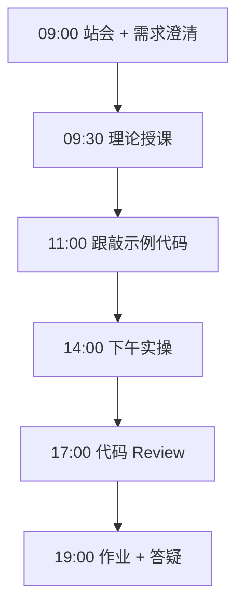
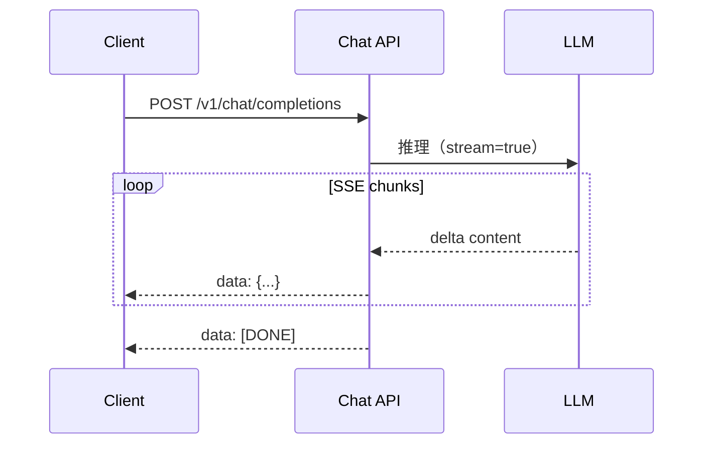

# Day 16：API参数与流式输出

> **阶段**：Phase 2：大模型基础与Prompt工程 | **Epic**：NEXUS-E2 | **预计学时**：6-8 小时

## 旁白解读：今日上下文

> 🎬 **模拟站会 09:00** — 智链科技 Nexus 项目组

陈工打开 Postman：「同一个问题，temperature 从 0 调到 1.2，答案能从『标准说明书』变成『创意文案』。API 参数就是你们调模型的旋钮。」
今天你们要亲手感受 **参数实验 + 流式输出**，这是 Day 24 Web 聊天打字机效果的底层机制。

**今日在 NexusAgent 主线中的位置**：NexusAgent 对话服务将默认 stream=true

**今日 Jira 看板**：
- `NEXUS-161`
- `NEXUS-162`

---


## 需求文档（产品林悦下发）

**文档编号**：PRD-NEXUS-D16  
**版本**：v1.0  
**优先级**：P0

### 背景

Phase 2：大模型基础与Prompt工程阶段第 16 天教学任务，与 NexusAgent 主线项目对齐。

### User Stories

### NEXUS-161

**描述**：API参数与流式输出 相关交付

**验收标准**：
- [ ] 代码可本地运行
- [ ] 通过 `scripts/verify_day.py --day 16`

### NEXUS-162

**描述**：API参数与流式输出 相关交付

**验收标准**：
- [ ] 代码可本地运行
- [ ] 通过 `scripts/verify_day.py --day 16`


---


## 今日课表

### 上午 09:00-12:00

- 复习 Day 15 token 概念，讲解 Chat Completions API 端点与鉴权
- 参数详解：temperature、top_p、max_tokens、presence/frequency_penalty
- 流式输出原理：SSE、chunk 解析、前端打字机效果

### 下午 14:00-17:30

- 跟敲 param_experiment.py：固定 prompt，对比 5 组参数输出差异
- 跟敲 stream_output.py：实现终端流式打印
- 配置 DEEPSEEK_API_KEY，对比 MOCK 与真实 API 行为

### 晚自习 19:00-21:00

- 阅读 DeepSeek API 文档参数说明
- 实验：temperature=0 时多次调用是否完全一致
- 预习：System / User / Assistant 消息角色

---


## 课堂笔记

### 核心知识点速查

| 序号 | 知识点 | 代码位置 |
|------|--------|----------|
| 1 | Chat Completions API | 见下午实操 |
| 2 | temperature/top_p | 见下午实操 |
| 3 | max_tokens 截断 | 见下午实操 |
| 4 | SSE 流式 | 见下午实操 |
| 5 | urllib 调用 API | 见下午实操 |

### 今日流程图



### 架构示意图（当日目标）



---


## 实操代码清单

- `code/param_experiment.py`
- `code/stream_output.py`

请按顺序创建并运行。每段代码均可直接复制到对应文件执行。

---

## 实验手册（分时段操作表）

### 实验步骤 1：09:30-10:30 理论

| 时间 | 动作 | 预期结果 | 失败处理 |
|------|------|----------|----------|
| +0min | 打开课件本节 | 看到需求与验收标准 | 检查是否拉取最新 `develop` 分支 |
| +10min | 创建/打开当日 `code/` 文件 | 文件路径与清单一致 | 对照「实操代码清单」 |
| +30min | 粘贴并运行第一个脚本 | 终端有正常输出无 Traceback | 见下方「排错手册」 |
| +60min | 完成全部文件并自测 | `python3` 运行通过 | 使用 `scripts/verify_day.py --day 16` |
| +90min | 提交 Git 并建 MR | MR 关联 Jira NEXUS-161 | 按附录 Git 示例操作 |


### 实验步骤 2：10:30-12:00 跟敲

| 时间 | 动作 | 预期结果 | 失败处理 |
|------|------|----------|----------|
| +0min | 打开课件本节 | 看到需求与验收标准 | 检查是否拉取最新 `develop` 分支 |
| +10min | 创建/打开当日 `code/` 文件 | 文件路径与清单一致 | 对照「实操代码清单」 |
| +30min | 粘贴并运行第一个脚本 | 终端有正常输出无 Traceback | 见下方「排错手册」 |
| +60min | 完成全部文件并自测 | `python3` 运行通过 | 使用 `scripts/verify_day.py --day 16` |
| +90min | 提交 Git 并建 MR | MR 关联 Jira NEXUS-161 | 按附录 Git 示例操作 |


### 实验步骤 3：14:00-15:30 实操

| 时间 | 动作 | 预期结果 | 失败处理 |
|------|------|----------|----------|
| +0min | 打开课件本节 | 看到需求与验收标准 | 检查是否拉取最新 `develop` 分支 |
| +10min | 创建/打开当日 `code/` 文件 | 文件路径与清单一致 | 对照「实操代码清单」 |
| +30min | 粘贴并运行第一个脚本 | 终端有正常输出无 Traceback | 见下方「排错手册」 |
| +60min | 完成全部文件并自测 | `python3` 运行通过 | 使用 `scripts/verify_day.py --day 16` |
| +90min | 提交 Git 并建 MR | MR 关联 Jira NEXUS-161 | 按附录 Git 示例操作 |


### 实验步骤 4：15:30-17:00 联调

| 时间 | 动作 | 预期结果 | 失败处理 |
|------|------|----------|----------|
| +0min | 打开课件本节 | 看到需求与验收标准 | 检查是否拉取最新 `develop` 分支 |
| +10min | 创建/打开当日 `code/` 文件 | 文件路径与清单一致 | 对照「实操代码清单」 |
| +30min | 粘贴并运行第一个脚本 | 终端有正常输出无 Traceback | 见下方「排错手册」 |
| +60min | 完成全部文件并自测 | `python3` 运行通过 | 使用 `scripts/verify_day.py --day 16` |
| +90min | 提交 Git 并建 MR | MR 关联 Jira NEXUS-161 | 按附录 Git 示例操作 |


### 实验步骤 5：19:00-20:30 作业

| 时间 | 动作 | 预期结果 | 失败处理 |
|------|------|----------|----------|
| +0min | 打开课件本节 | 看到需求与验收标准 | 检查是否拉取最新 `develop` 分支 |
| +10min | 创建/打开当日 `code/` 文件 | 文件路径与清单一致 | 对照「实操代码清单」 |
| +30min | 粘贴并运行第一个脚本 | 终端有正常输出无 Traceback | 见下方「排错手册」 |
| +60min | 完成全部文件并自测 | `python3` 运行通过 | 使用 `scripts/verify_day.py --day 16` |
| +90min | 提交 Git 并建 MR | MR 关联 Jira NEXUS-161 | 按附录 Git 示例操作 |


### 排错手册（Day 16）

1. **`command not found: python3`** → 安装 Python 3.10+ 或使用 `py -3`（Windows）
2. **`ModuleNotFoundError`** → 确认当前目录、是否激活 venv、`pip install -r requirements.txt`（若当日有）
3. **`SyntaxError: invalid syntax`** → 检查上一行是否缺括号、引号是否中文
4. **`UnicodeDecodeError`** → 文件保存为 UTF-8，终端 `export PYTHONIOENCODING=utf-8`
5. **API 相关（Day12+）** → 检查 `.env` 中 Key，无 Key 时使用课件 MOCK 模式

---


## 逐步跟敲指南（完整源码与解析）

> 以下代码与 `code/` 目录完全一致，可直接复制。每段附行级说明。

### 文件：`code/param_experiment.py`

**操作步骤**：
1. 在 `courseware/day-16/code/` 下创建文件 `param_experiment.py`
2. 完整粘贴下方代码
3. 在终端执行：`cd courseware/day-16/code && python3 param_experiment.py`（若为包内模块则按课件说明）

```python
#!/usr/bin/env python3
"""
Day 16 实操：大模型 API 参数实验
对比 temperature、top_p、max_tokens 对输出风格的影响。
支持 MOCK 模式（无 API Key 时自动启用）。
"""
from __future__ import annotations

import json
import os
import urllib.error
import urllib.request

API_BASE = os.getenv("DEEPSEEK_API_BASE", "https://api.deepseek.com")
API_KEY = os.getenv("DEEPSEEK_API_KEY", "")
MODEL = os.getenv("DEEPSEEK_MODEL", "deepseek-chat")

PROMPT = "用一句话介绍智链科技的 NexusAgent 平台。"


def call_chat(
    prompt: str,
    temperature: float = 0.7,
    top_p: float = 1.0,
    max_tokens: int = 256,
) -> str:
    """调用 Chat Completions API；无 Key 时返回模拟结果。"""
    if not API_KEY:
        return (
            f"[MOCK] temp={temperature} top_p={top_p} max_tokens={max_tokens} → "
            f"NexusAgent 是企业级多 Agent 协作平台，支持知识问答与工具调用。"
        )

    payload = {
        "model": MODEL,
        "messages": [{"role": "user", "content": prompt}],
        "temperature": temperature,
        "top_p": top_p,
        "max_tokens": max_tokens,
    }
    req = urllib.request.Request(
        f"{API_BASE}/v1/chat/completions",
        data=json.dumps(payload).encode("utf-8"),
        headers={
            "Content-Type": "application/json",
            "Authorization": f"Bearer {API_KEY}",
        },
        method="POST",
    )
    try:
        with urllib.request.urlopen(req, timeout=30) as resp:
            data = json.loads(resp.read().decode("utf-8"))
        return data["choices"][0]["message"]["content"].strip()
    except (urllib.error.URLError, KeyError, json.JSONDecodeError) as exc:
        return f"[ERROR] API 调用失败: {exc}"


def run_experiments() -> None:
    """依次测试不同参数组合。"""
    experiments = [
        {"temperature": 0.0, "top_p": 1.0, "max_tokens": 64, "label": "确定性（temp=0）"},
        {"temperature": 0.7, "top_p": 1.0, "max_tokens": 128, "label": "默认创意（temp=0.7）"},
        {"temperature": 1.2, "top_p": 1.0, "max_tokens": 128, "label": "高随机（temp=1.2）"},
        {"temperature": 0.7, "top_p": 0.3, "max_tokens": 128, "label": "核采样收紧（top_p=0.3）"},
        {"temperature": 0.7, "top_p": 1.0, "max_tokens": 20, "label": "截断（max_tokens=20）"},
    ]

    print("=" * 60)
    print("Day 16 — API 参数实验")
    print("=" * 60)
    print(f"Prompt: {PROMPT}\n")

    for exp in experiments:
        print(f"--- {exp['label']} ---")
        result = call_chat(
            PROMPT,
            temperature=exp["temperature"],
            top_p=exp["top_p"],
            max_tokens=exp["max_tokens"],
        )
        print(result)
        print()


if __name__ == "__main__":
    run_experiments()

```

**解析要点（`param_experiment.py`）**：

- 共 **86** 行，请逐行阅读注释中的中文说明

- 运行前确认 Python 版本 ≥ 3.10：`python3 --version`

- 若报错，先检查缩进是否为 4 空格，勿混用 Tab

- 企业 Review 清单：命名是否清晰、是否有异常处理、是否可复用

---

### 文件：`code/stream_output.py`

**操作步骤**：
1. 在 `courseware/day-16/code/` 下创建文件 `stream_output.py`
2. 完整粘贴下方代码
3. 在终端执行：`cd courseware/day-16/code && python3 stream_output.py`（若为包内模块则按课件说明）

```python
#!/usr/bin/env python3
"""
Day 16 实操：流式输出（Streaming）
演示 SSE 风格逐 token 打印，模拟 ChatGPT 打字机效果。
"""
from __future__ import annotations

import json
import os
import sys
import time
import urllib.error
import urllib.request

API_BASE = os.getenv("DEEPSEEK_API_BASE", "https://api.deepseek.com")
API_KEY = os.getenv("DEEPSEEK_API_KEY", "")
MODEL = os.getenv("DEEPSEEK_MODEL", "deepseek-chat")


def mock_stream(text: str, delay: float = 0.03) -> None:
    """无 API 时的模拟流式输出。"""
    for ch in text:
        sys.stdout.write(ch)
        sys.stdout.flush()
        time.sleep(delay)
    print()


def stream_chat(prompt: str) -> None:
    """流式调用 Chat API 并实时打印。"""
    if not API_KEY:
        mock_stream(
            "【MOCK 流式】NexusAgent 平台通过 REST API 与 SSE "
            "为前端提供实时对话能力，是 Day 22-24 的前置基础。"
        )
        return

    payload = {
        "model": MODEL,
        "messages": [{"role": "user", "content": prompt}],
        "stream": True,
        "temperature": 0.7,
    }
    req = urllib.request.Request(
        f"{API_BASE}/v1/chat/completions",
        data=json.dumps(payload).encode("utf-8"),
        headers={
            "Content-Type": "application/json",
            "Authorization": f"Bearer {API_KEY}",
        },
        method="POST",
    )

    print("助手: ", end="", flush=True)
    try:
        with urllib.request.urlopen(req, timeout=60) as resp:
            for raw_line in resp:
                line = raw_line.decode("utf-8").strip()
                if not line or not line.startswith("data: "):
                    continue
                data_str = line[6:]
                if data_str == "[DONE]":
                    break
                try:
                    chunk = json.loads(data_str)
                    delta = chunk["choices"][0].get("delta", {})
                    content = delta.get("content", "")
                    if content:
                        sys.stdout.write(content)
                        sys.stdout.flush()
                except (json.JSONDecodeError, KeyError, IndexError):
                    continue
        print()
    except urllib.error.URLError as exc:
        print(f"\n[ERROR] 流式请求失败: {exc}")


def main() -> None:
    prompt = "用三句话解释什么是 Server-Sent Events（SSE）。"
    print("=" * 60)
    print("Day 16 — 流式输出演示")
    print("=" * 60)
    print(f"用户: {prompt}\n")
    stream_chat(prompt)


if __name__ == "__main__":
    main()

```

**解析要点（`stream_output.py`）**：

- 共 **88** 行，请逐行阅读注释中的中文说明

- 运行前确认 Python 版本 ≥ 3.10：`python3 --version`

- 若报错，先检查缩进是否为 4 空格，勿混用 Tab

- 企业 Review 清单：命名是否清晰、是否有异常处理、是否可复用

---


### 深度讲解 1：Chat Completions API

在企业级 Python 开发与大模型应用工程中，**Chat Completions API** 是学员必须牢固掌握的基本功。智链科技 Nexus 项目组在 Day 16 的代码评审中，特别强调以下几点：

1. **为什么学**：Chat Completions API 直接服务于后续 NexusAgent 平台的 `NEXUS-E2` 模块。没有扎实的 Chat Completions API，Day 23 之后调用 API、解析 JSON、编写 Agent 工具函数时会出现大量低级错误。

2. **常见坑**：
   - 忽略输入类型校验，导致运行时 `TypeError`
   - 编码问题（Windows 默认 GBK vs UTF-8）
   - 复制粘贴时缩进错乱（Python 对缩进敏感）

3. **企业实践**：在 SmartLink 的 GitLab 仓库中，所有与 Chat Completions API 相关的代码必须经过 Ruff 静态检查；变量命名使用 `snake_case`，常量使用 `UPPER_SNAKE_CASE`。

4. **与主线项目的关系**：今日代码位于 `courseware/day-16/code/`，部分模块将逐步合并到 `platform/nexus_agent/`。请养成「每日代码皆可运行、皆可测试」的习惯。

5. **扩展阅读建议**：完成今日作业后，可阅读 `docs/project-master-plan.md` 中关于 NEXUS-E2 的章节，建立全局视角。

**课堂互动题**：请用 3 句话向非技术同事解释「Chat Completions API」是什么。写在作业 MR 的评论里，讲师会抽查点评。

**实操检查清单**：
- [ ] 能不看课件复述 Chat Completions API 的定义
- [ ] 能独立写出相关代码并运行
- [ ] 能向同学讲解一处容易写错的地方


### 深度讲解 2：temperature/top_p

在企业级 Python 开发与大模型应用工程中，**temperature/top_p** 是学员必须牢固掌握的基本功。智链科技 Nexus 项目组在 Day 16 的代码评审中，特别强调以下几点：

1. **为什么学**：temperature/top_p 直接服务于后续 NexusAgent 平台的 `NEXUS-E2` 模块。没有扎实的 temperature/top_p，Day 23 之后调用 API、解析 JSON、编写 Agent 工具函数时会出现大量低级错误。

2. **常见坑**：
   - 忽略输入类型校验，导致运行时 `TypeError`
   - 编码问题（Windows 默认 GBK vs UTF-8）
   - 复制粘贴时缩进错乱（Python 对缩进敏感）

3. **企业实践**：在 SmartLink 的 GitLab 仓库中，所有与 temperature/top_p 相关的代码必须经过 Ruff 静态检查；变量命名使用 `snake_case`，常量使用 `UPPER_SNAKE_CASE`。

4. **与主线项目的关系**：今日代码位于 `courseware/day-16/code/`，部分模块将逐步合并到 `platform/nexus_agent/`。请养成「每日代码皆可运行、皆可测试」的习惯。

5. **扩展阅读建议**：完成今日作业后，可阅读 `docs/project-master-plan.md` 中关于 NEXUS-E2 的章节，建立全局视角。

**课堂互动题**：请用 3 句话向非技术同事解释「temperature/top_p」是什么。写在作业 MR 的评论里，讲师会抽查点评。

**实操检查清单**：
- [ ] 能不看课件复述 temperature/top_p 的定义
- [ ] 能独立写出相关代码并运行
- [ ] 能向同学讲解一处容易写错的地方


### 深度讲解 3：max_tokens 截断

在企业级 Python 开发与大模型应用工程中，**max_tokens 截断** 是学员必须牢固掌握的基本功。智链科技 Nexus 项目组在 Day 16 的代码评审中，特别强调以下几点：

1. **为什么学**：max_tokens 截断 直接服务于后续 NexusAgent 平台的 `NEXUS-E2` 模块。没有扎实的 max_tokens 截断，Day 23 之后调用 API、解析 JSON、编写 Agent 工具函数时会出现大量低级错误。

2. **常见坑**：
   - 忽略输入类型校验，导致运行时 `TypeError`
   - 编码问题（Windows 默认 GBK vs UTF-8）
   - 复制粘贴时缩进错乱（Python 对缩进敏感）

3. **企业实践**：在 SmartLink 的 GitLab 仓库中，所有与 max_tokens 截断 相关的代码必须经过 Ruff 静态检查；变量命名使用 `snake_case`，常量使用 `UPPER_SNAKE_CASE`。

4. **与主线项目的关系**：今日代码位于 `courseware/day-16/code/`，部分模块将逐步合并到 `platform/nexus_agent/`。请养成「每日代码皆可运行、皆可测试」的习惯。

5. **扩展阅读建议**：完成今日作业后，可阅读 `docs/project-master-plan.md` 中关于 NEXUS-E2 的章节，建立全局视角。

**课堂互动题**：请用 3 句话向非技术同事解释「max_tokens 截断」是什么。写在作业 MR 的评论里，讲师会抽查点评。

**实操检查清单**：
- [ ] 能不看课件复述 max_tokens 截断 的定义
- [ ] 能独立写出相关代码并运行
- [ ] 能向同学讲解一处容易写错的地方


### 深度讲解 4：SSE 流式

在企业级 Python 开发与大模型应用工程中，**SSE 流式** 是学员必须牢固掌握的基本功。智链科技 Nexus 项目组在 Day 16 的代码评审中，特别强调以下几点：

1. **为什么学**：SSE 流式 直接服务于后续 NexusAgent 平台的 `NEXUS-E2` 模块。没有扎实的 SSE 流式，Day 23 之后调用 API、解析 JSON、编写 Agent 工具函数时会出现大量低级错误。

2. **常见坑**：
   - 忽略输入类型校验，导致运行时 `TypeError`
   - 编码问题（Windows 默认 GBK vs UTF-8）
   - 复制粘贴时缩进错乱（Python 对缩进敏感）

3. **企业实践**：在 SmartLink 的 GitLab 仓库中，所有与 SSE 流式 相关的代码必须经过 Ruff 静态检查；变量命名使用 `snake_case`，常量使用 `UPPER_SNAKE_CASE`。

4. **与主线项目的关系**：今日代码位于 `courseware/day-16/code/`，部分模块将逐步合并到 `platform/nexus_agent/`。请养成「每日代码皆可运行、皆可测试」的习惯。

5. **扩展阅读建议**：完成今日作业后，可阅读 `docs/project-master-plan.md` 中关于 NEXUS-E2 的章节，建立全局视角。

**课堂互动题**：请用 3 句话向非技术同事解释「SSE 流式」是什么。写在作业 MR 的评论里，讲师会抽查点评。

**实操检查清单**：
- [ ] 能不看课件复述 SSE 流式 的定义
- [ ] 能独立写出相关代码并运行
- [ ] 能向同学讲解一处容易写错的地方


### 深度讲解 5：urllib 调用 API

在企业级 Python 开发与大模型应用工程中，**urllib 调用 API** 是学员必须牢固掌握的基本功。智链科技 Nexus 项目组在 Day 16 的代码评审中，特别强调以下几点：

1. **为什么学**：urllib 调用 API 直接服务于后续 NexusAgent 平台的 `NEXUS-E2` 模块。没有扎实的 urllib 调用 API，Day 23 之后调用 API、解析 JSON、编写 Agent 工具函数时会出现大量低级错误。

2. **常见坑**：
   - 忽略输入类型校验，导致运行时 `TypeError`
   - 编码问题（Windows 默认 GBK vs UTF-8）
   - 复制粘贴时缩进错乱（Python 对缩进敏感）

3. **企业实践**：在 SmartLink 的 GitLab 仓库中，所有与 urllib 调用 API 相关的代码必须经过 Ruff 静态检查；变量命名使用 `snake_case`，常量使用 `UPPER_SNAKE_CASE`。

4. **与主线项目的关系**：今日代码位于 `courseware/day-16/code/`，部分模块将逐步合并到 `platform/nexus_agent/`。请养成「每日代码皆可运行、皆可测试」的习惯。

5. **扩展阅读建议**：完成今日作业后，可阅读 `docs/project-master-plan.md` 中关于 NEXUS-E2 的章节，建立全局视角。

**课堂互动题**：请用 3 句话向非技术同事解释「urllib 调用 API」是什么。写在作业 MR 的评论里，讲师会抽查点评。

**实操检查清单**：
- [ ] 能不看课件复述 urllib 调用 API 的定义
- [ ] 能独立写出相关代码并运行
- [ ] 能向同学讲解一处容易写错的地方


## 阶段复盘锚点（Phase 2：大模型基础与Prompt工程）

今天是 **Phase 2：大模型基础与Prompt工程** 的第 **6** 个学习日。请回顾：

- 昨天学了什么？今天如何承接？
- 今天的内容在 70 天路线图中的坐标？
- 如果我是 Tech Lead，会如何 Review 今日代码？

**陈工寄语**：慢即是快。企业里没人关心你一天学了多少个语法点，只关心你写的脚本能不能在服务器上稳定跑 7×24 小时。今天把地基打牢，后面 Agent 编排、RAG 检索才不会塌。

**林悦补充**：产品侧只验收「用户能感知到的价值」。今日交付虽然简单，但「个人信息卡片」本质是后续「用户画像 Agent」的数据采集原型——字段设计请认真思考。

**代码量统计（累计）**：完成今日后，个人仓库累计约 **22400** 行（含注释与测试），全营目标 10 万行。

**明日预告**：请提前阅读 `courseware/day-17/README.md` 开头的旁白，了解上下文。


## 常见问题 FAQ（讲师答疑实录）


**Q1：学习「Chat Completions API」时最常问的问题是什么？**

A：学员常问「这在大模型开发里到底用在哪里」。直接回答：在 NexusAgent 的 `NEXUS-E2` 中，Chat Completions API 用于支撑「API参数与流式输出」这一交付。建议你打开 `platform/` 对照看未来模块如何引用今日写法。另一个常见问题是「要不要背语法」——不需要背，但要能写出可运行代码，并能在报错时读懂 Traceback。

**追问**：如果线上报错与 Chat Completions API 相关，如何排查？  
**答**：① 复现 ② 最小化输入 ③ 打印中间变量 ④ 查 GitLab 历史 diff ⑤ 在 Jira 建 Bug 单附上日志。


**Q2：学习「temperature/top_p」时最常问的问题是什么？**

A：学员常问「这在大模型开发里到底用在哪里」。直接回答：在 NexusAgent 的 `NEXUS-E2` 中，temperature/top_p 用于支撑「API参数与流式输出」这一交付。建议你打开 `platform/` 对照看未来模块如何引用今日写法。另一个常见问题是「要不要背语法」——不需要背，但要能写出可运行代码，并能在报错时读懂 Traceback。

**追问**：如果线上报错与 temperature/top_p 相关，如何排查？  
**答**：① 复现 ② 最小化输入 ③ 打印中间变量 ④ 查 GitLab 历史 diff ⑤ 在 Jira 建 Bug 单附上日志。


**Q3：学习「max_tokens 截断」时最常问的问题是什么？**

A：学员常问「这在大模型开发里到底用在哪里」。直接回答：在 NexusAgent 的 `NEXUS-E2` 中，max_tokens 截断 用于支撑「API参数与流式输出」这一交付。建议你打开 `platform/` 对照看未来模块如何引用今日写法。另一个常见问题是「要不要背语法」——不需要背，但要能写出可运行代码，并能在报错时读懂 Traceback。

**追问**：如果线上报错与 max_tokens 截断 相关，如何排查？  
**答**：① 复现 ② 最小化输入 ③ 打印中间变量 ④ 查 GitLab 历史 diff ⑤ 在 Jira 建 Bug 单附上日志。


**Q4：学习「SSE 流式」时最常问的问题是什么？**

A：学员常问「这在大模型开发里到底用在哪里」。直接回答：在 NexusAgent 的 `NEXUS-E2` 中，SSE 流式 用于支撑「API参数与流式输出」这一交付。建议你打开 `platform/` 对照看未来模块如何引用今日写法。另一个常见问题是「要不要背语法」——不需要背，但要能写出可运行代码，并能在报错时读懂 Traceback。

**追问**：如果线上报错与 SSE 流式 相关，如何排查？  
**答**：① 复现 ② 最小化输入 ③ 打印中间变量 ④ 查 GitLab 历史 diff ⑤ 在 Jira 建 Bug 单附上日志。


**Q5：学习「urllib 调用 API」时最常问的问题是什么？**

A：学员常问「这在大模型开发里到底用在哪里」。直接回答：在 NexusAgent 的 `NEXUS-E2` 中，urllib 调用 API 用于支撑「API参数与流式输出」这一交付。建议你打开 `platform/` 对照看未来模块如何引用今日写法。另一个常见问题是「要不要背语法」——不需要背，但要能写出可运行代码，并能在报错时读懂 Traceback。

**追问**：如果线上报错与 urllib 调用 API 相关，如何排查？  
**答**：① 复现 ② 最小化输入 ③ 打印中间变量 ④ 查 GitLab 历史 diff ⑤ 在 Jira 建 Bug 单附上日志。


## 面试押题（与今日知识点挂钩）

以下题目会出现在 Day 67-69 模拟面试中，建议今日就开始积累答案：

1. **Chat Completions API**：请结合 NexusAgent 项目举例说明你在哪一天、哪段代码里用到了它？
2. **temperature/top_p**：请结合 NexusAgent 项目举例说明你在哪一天、哪段代码里用到了它？
3. **max_tokens 截断**：请结合 NexusAgent 项目举例说明你在哪一天、哪段代码里用到了它？
4. **SSE 流式**：请结合 NexusAgent 项目举例说明你在哪一天、哪段代码里用到了它？
5. **urllib 调用 API**：请结合 NexusAgent 项目举例说明你在哪一天、哪段代码里用到了它？

**参考答案思路**：采用 STAR 法则（情境-任务-行动-结果），引用 `courseware/day-16/code/` 中的具体文件名与函数名。

---


## Code Review 检查表（陈工版）

合并 MR 前自查：

- [ ] 所有新增 `.py` 文件顶部有模块说明 docstring
- [ ] 无硬编码密钥（API Key 走环境变量）
- [ ] 函数长度 < 50 行，过长则拆分
- [ ] 异常有明确提示，禁止裸 `except:`
- [ ] 提交信息符合 `feat(day-16): ...`
- [ ] README 或注释说明如何运行
- [ ] 与 Jira Story 验收标准逐条对应

**今日重点审查项**：API参数与流式输出 相关逻辑是否可读、可测、可扩展至 `platform/nexus_agent/`。

---


## 课后作业

### 作业说明

合并两个脚本为 api_playground.py：支持命令行参数 `--temp`、`--stream`，用户输入 prompt 后按配置调用 API 并输出结果与耗时。

### 提交要求

1. 代码提交到分支 `feature/day-16-homework`
2. GitLab MR 标题：`[Day-16] homework: 课后作业`
3. 在 MR 描述中附上运行截图或终端输出

### 评分标准（满分 100）

| 项 | 分值 |
|----|------|
| 功能完整 | 40 |
| 代码规范与注释 | 30 |
| 异常处理 | 15 |
| MR 与 Jira 关联 | 15 |

---

## 作业参考答案

> ⚠️ 请先独立完成再对照答案

使用 `argparse`；`time.perf_counter()` 计时；流式模式逐 chunk 打印并累计 token 估算。

---


## 附录：Git 提交示例

```bash
git checkout develop
git pull origin develop
git checkout -b feature/day-16-api参数与流式输出
# 完成代码后
git add courseware/day-16/
git commit -m "feat(day-16): API参数与流式输出"
git push -u origin feature/day-16-api参数与流式输出
```

---

*课件版本 Day-16-v1.0 | 智链科技培训中心*
