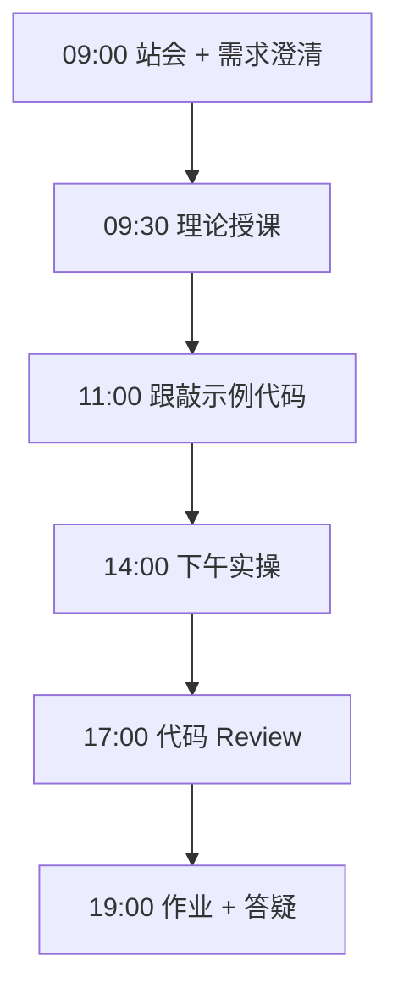
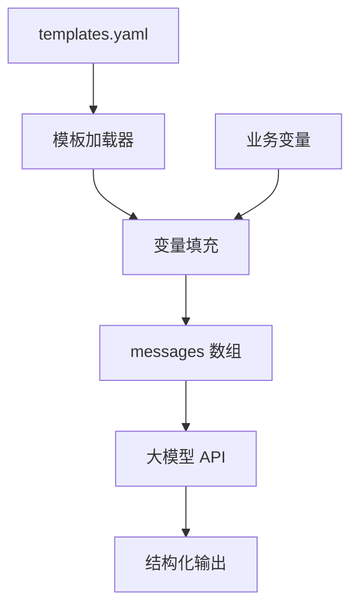

# Day 17：Prompt基础与模板

> **阶段**：Phase 2：大模型基础与Prompt工程 | **Epic**：NEXUS-E2 | **预计学时**：6-8 小时

## 旁白解读：今日上下文

> 🎬 **模拟站会 09:00** — 智链科技 Nexus 项目组

林悦发来 10 份业务需求：「客服、销售、研发各有一套话术，能不能统一成可配置模板？」
陈工：「Prompt 工程的第一课——**把魔法字符串变成可维护模板**。今天这 10 个场景，就是 NexusAgent 提示词中心的雏形。」

**今日在 NexusAgent 主线中的位置**：platform/nexus_agent/prompts/ 将存放企业模板库

**今日 Jira 看板**：
- `NEXUS-171`
- `NEXUS-172`
- `NEXUS-173`

---


## 需求文档（产品林悦下发）

**文档编号**：PRD-NEXUS-D17  
**版本**：v1.0  
**优先级**：P0

### 背景

Phase 2：大模型基础与Prompt工程阶段第 17 天教学任务，与 NexusAgent 主线项目对齐。

### User Stories

### NEXUS-171

**描述**：Prompt基础与模板 相关交付

**验收标准**：
- [ ] 代码可本地运行
- [ ] 通过 `scripts/verify_day.py --day 17`

### NEXUS-172

**描述**：Prompt基础与模板 相关交付

**验收标准**：
- [ ] 代码可本地运行
- [ ] 通过 `scripts/verify_day.py --day 17`

### NEXUS-173

**描述**：Prompt基础与模板 相关交付

**验收标准**：
- [ ] 代码可本地运行
- [ ] 通过 `scripts/verify_day.py --day 17`


---


## 今日课表

### 上午 09:00-12:00

- Prompt 结构：System / User / Assistant 分工
- 技巧：角色设定、任务描述、输出格式、Few-shot 示例
- 企业场景：翻译、摘要、邮件、代码解释等 10 类高频需求

### 下午 14:00-17:30

- 跟敲 prompt_templates.py：实现 10 个可填充模板
- 逐个场景运行 DEMO_VARIABLES 演示
- 讨论：模板 vs 硬编码 prompt 的可维护性

### 晚自习 19:00-21:00

- 为智链科技写 3 个真实业务 Prompt 模板
- 对比：有/无 System 提示的输出差异
- 预习：JSON 结构化输出

---


## 课堂笔记

### 核心知识点速查

| 序号 | 知识点 | 代码位置 |
|------|--------|----------|
| 1 | System Prompt | 见下午实操 |
| 2 | 模板变量填充 | 见下午实操 |
| 3 | Few-shot | 见下午实操 |
| 4 | 场景化 Prompt | 见下午实操 |
| 5 | 可维护性 | 见下午实操 |

### 今日流程图



### 架构示意图（当日目标）



---


## 实操代码清单

- `code/prompt_templates.py`

请按顺序创建并运行。每段代码均可直接复制到对应文件执行。

---

## 实验手册（分时段操作表）

### 实验步骤 1：09:30-10:30 理论

| 时间 | 动作 | 预期结果 | 失败处理 |
|------|------|----------|----------|
| +0min | 打开课件本节 | 看到需求与验收标准 | 检查是否拉取最新 `develop` 分支 |
| +10min | 创建/打开当日 `code/` 文件 | 文件路径与清单一致 | 对照「实操代码清单」 |
| +30min | 粘贴并运行第一个脚本 | 终端有正常输出无 Traceback | 见下方「排错手册」 |
| +60min | 完成全部文件并自测 | `python3` 运行通过 | 使用 `scripts/verify_day.py --day 17` |
| +90min | 提交 Git 并建 MR | MR 关联 Jira NEXUS-171 | 按附录 Git 示例操作 |


### 实验步骤 2：10:30-12:00 跟敲

| 时间 | 动作 | 预期结果 | 失败处理 |
|------|------|----------|----------|
| +0min | 打开课件本节 | 看到需求与验收标准 | 检查是否拉取最新 `develop` 分支 |
| +10min | 创建/打开当日 `code/` 文件 | 文件路径与清单一致 | 对照「实操代码清单」 |
| +30min | 粘贴并运行第一个脚本 | 终端有正常输出无 Traceback | 见下方「排错手册」 |
| +60min | 完成全部文件并自测 | `python3` 运行通过 | 使用 `scripts/verify_day.py --day 17` |
| +90min | 提交 Git 并建 MR | MR 关联 Jira NEXUS-171 | 按附录 Git 示例操作 |


### 实验步骤 3：14:00-15:30 实操

| 时间 | 动作 | 预期结果 | 失败处理 |
|------|------|----------|----------|
| +0min | 打开课件本节 | 看到需求与验收标准 | 检查是否拉取最新 `develop` 分支 |
| +10min | 创建/打开当日 `code/` 文件 | 文件路径与清单一致 | 对照「实操代码清单」 |
| +30min | 粘贴并运行第一个脚本 | 终端有正常输出无 Traceback | 见下方「排错手册」 |
| +60min | 完成全部文件并自测 | `python3` 运行通过 | 使用 `scripts/verify_day.py --day 17` |
| +90min | 提交 Git 并建 MR | MR 关联 Jira NEXUS-171 | 按附录 Git 示例操作 |


### 实验步骤 4：15:30-17:00 联调

| 时间 | 动作 | 预期结果 | 失败处理 |
|------|------|----------|----------|
| +0min | 打开课件本节 | 看到需求与验收标准 | 检查是否拉取最新 `develop` 分支 |
| +10min | 创建/打开当日 `code/` 文件 | 文件路径与清单一致 | 对照「实操代码清单」 |
| +30min | 粘贴并运行第一个脚本 | 终端有正常输出无 Traceback | 见下方「排错手册」 |
| +60min | 完成全部文件并自测 | `python3` 运行通过 | 使用 `scripts/verify_day.py --day 17` |
| +90min | 提交 Git 并建 MR | MR 关联 Jira NEXUS-171 | 按附录 Git 示例操作 |


### 实验步骤 5：19:00-20:30 作业

| 时间 | 动作 | 预期结果 | 失败处理 |
|------|------|----------|----------|
| +0min | 打开课件本节 | 看到需求与验收标准 | 检查是否拉取最新 `develop` 分支 |
| +10min | 创建/打开当日 `code/` 文件 | 文件路径与清单一致 | 对照「实操代码清单」 |
| +30min | 粘贴并运行第一个脚本 | 终端有正常输出无 Traceback | 见下方「排错手册」 |
| +60min | 完成全部文件并自测 | `python3` 运行通过 | 使用 `scripts/verify_day.py --day 17` |
| +90min | 提交 Git 并建 MR | MR 关联 Jira NEXUS-171 | 按附录 Git 示例操作 |


### 排错手册（Day 17）

1. **`command not found: python3`** → 安装 Python 3.10+ 或使用 `py -3`（Windows）
2. **`ModuleNotFoundError`** → 确认当前目录、是否激活 venv、`pip install -r requirements.txt`（若当日有）
3. **`SyntaxError: invalid syntax`** → 检查上一行是否缺括号、引号是否中文
4. **`UnicodeDecodeError`** → 文件保存为 UTF-8，终端 `export PYTHONIOENCODING=utf-8`
5. **API 相关（Day12+）** → 检查 `.env` 中 Key，无 Key 时使用课件 MOCK 模式

---


## 逐步跟敲指南（完整源码与解析）

> 以下代码与 `code/` 目录完全一致，可直接复制。每段附行级说明。

### 文件：`code/prompt_templates.py`

**操作步骤**：
1. 在 `courseware/day-17/code/` 下创建文件 `prompt_templates.py`
2. 完整粘贴下方代码
3. 在终端执行：`cd courseware/day-17/code && python3 prompt_templates.py`（若为包内模块则按课件说明）

```python
#!/usr/bin/env python3
"""
Day 17 实操：Prompt 模板库（10 个企业场景）
每个场景包含 system / user 模板与变量占位符，可直接填充后调用 API。
"""
from __future__ import annotations

import json
import os
import urllib.error
import urllib.request
from typing import Any

API_BASE = os.getenv("DEEPSEEK_API_BASE", "https://api.deepseek.com")
API_KEY = os.getenv("DEEPSEEK_API_KEY", "")
MODEL = os.getenv("DEEPSEEK_MODEL", "deepseek-chat")

# 10 个场景模板：键为场景名，值为 system + user 模板
PROMPT_SCENARIOS: dict[str, dict[str, str]] = {
    "翻译": {
        "system": "你是专业翻译，保留术语准确性，输出仅含译文。",
        "user": "将以下{source_lang}文本翻译为{target_lang}：\n{text}",
    },
    "摘要": {
        "system": "你是企业文档分析师，输出结构化摘要：背景、要点、行动项。",
        "user": "请摘要以下会议纪要（不超过{max_words}字）：\n{content}",
    },
    "代码解释": {
        "system": "你是资深 Python 工程师，用初学者能懂的语言解释代码。",
        "user": "解释以下代码的功能与潜在问题：\n```python\n{code}\n```",
    },
    "邮件撰写": {
        "system": "你是商务沟通专家，语气{tone}，格式规范。",
        "user": "给{recipient}写一封关于{topic}的邮件，要点：{points}",
    },
    "角色扮演": {
        "system": "你扮演{role}，回答需符合该角色专业知识与口吻。",
        "user": "{question}",
    },
    "数据分析": {
        "system": "你是数据分析师，给出洞察与可视化建议，不编造数据。",
        "user": "数据集描述：{dataset_desc}\n问题：{question}",
    },
    "头脑风暴": {
        "system": "你是产品创新顾问，输出{count}个可执行创意，编号列出。",
        "user": "为{product}在{scenario}场景头脑风暴新功能。",
    },
    "纠错": {
        "system": "你是文字编辑，修正语法与逻辑错误，并说明修改理由。",
        "user": "请纠错：\n{text}",
    },
    "格式转换": {
        "system": "你是格式转换工具，严格按目标格式输出，不加多余说明。",
        "user": "将以下{source_format}转为{target_format}：\n{content}",
    },
    "教学辅导": {
        "system": "你是耐心导师，用例子与类比讲解，最后出一道练习题。",
        "user": "学员水平：{level}。请教我：{topic}",
    },
}


def fill_template(template: str, variables: dict[str, Any]) -> str:
    """安全填充模板变量。"""
    return template.format(**variables)


def build_messages(scenario: str, variables: dict[str, Any]) -> list[dict[str, str]]:
    """根据场景名与变量构建 messages 列表。"""
    if scenario not in PROMPT_SCENARIOS:
        raise ValueError(f"未知场景: {scenario}，可选: {list(PROMPT_SCENARIOS)}")
    tpl = PROMPT_SCENARIOS[scenario]
    return [
        {"role": "system", "content": fill_template(tpl["system"], variables)},
        {"role": "user", "content": fill_template(tpl["user"], variables)},
    ]


def call_llm(messages: list[dict[str, str]]) -> str:
    """调用大模型；无 Key 时返回 MOCK 摘要。"""
    user_preview = messages[-1]["content"][:80].replace("\n", " ")
    if not API_KEY:
        return f"[MOCK/{messages[0]['content'][:12]}...] 已收到: {user_preview}..."

    payload = {"model": MODEL, "messages": messages, "temperature": 0.7}
    req = urllib.request.Request(
        f"{API_BASE}/v1/chat/completions",
        data=json.dumps(payload).encode("utf-8"),
        headers={"Content-Type": "application/json", "Authorization": f"Bearer {API_KEY}"},
        method="POST",
    )
    try:
        with urllib.request.urlopen(req, timeout=30) as resp:
            data = json.loads(resp.read().decode("utf-8"))
        return data["choices"][0]["message"]["content"].strip()
    except (urllib.error.URLError, KeyError) as exc:
        return f"[ERROR] {exc}"


# 每个场景的演示变量
DEMO_VARIABLES: dict[str, dict[str, Any]] = {
    "翻译": {"source_lang": "中文", "target_lang": "英文", "text": "智链科技推出 NexusAgent 智能体平台。"},
    "摘要": {"max_words": "150", "content": "周会讨论 Q2 上线 Web 聊天与 RAG 排期，陈工负责架构评审。"},
    "代码解释": {"code": "def add(a, b):\n    return a + b"},
    "邮件撰写": {"tone": "正式", "recipient": "客户张总", "topic": "项目进度", "points": "已完成 API 联调"},
    "角色扮演": {"role": "数据库 DBA", "question": "SQLite 和 PostgreSQL 怎么选型？"},
    "数据分析": {"dataset_desc": "销售 CSV，字段：日期/区域/金额", "question": "哪个区域增长最快？"},
    "头脑风暴": {"count": "5", "product": "NexusAgent", "scenario": "客服"},
    "纠错": {"text": "我们公司昨天开会讨论了关于AI的项目，效果还不错。"},
    "格式转换": {"source_format": "JSON", "target_format": "Markdown 表格", "content": '{"name":"Nexus","version":1}'},
    "教学辅导": {"level": "零基础", "topic": "什么是 Prompt？"},
}


def run_all_scenarios() -> None:
    """依次运行 10 个场景演示。"""
    print("=" * 60)
    print("Day 17 — Prompt 模板库（10 场景）")
    print("=" * 60)
    for i, name in enumerate(PROMPT_SCENARIOS, 1):
        print(f"\n[{i}/10] 场景：{name}")
        messages = build_messages(name, DEMO_VARIABLES[name])
        print(f"  System: {messages[0]['content'][:50]}...")
        result = call_llm(messages)
        print(f"  输出: {result[:200]}{'...' if len(result) > 200 else ''}")


if __name__ == "__main__":
    run_all_scenarios()

```

**解析要点（`prompt_templates.py`）**：

- 共 **129** 行，请逐行阅读注释中的中文说明

- 运行前确认 Python 版本 ≥ 3.10：`python3 --version`

- 若报错，先检查缩进是否为 4 空格，勿混用 Tab

- 企业 Review 清单：命名是否清晰、是否有异常处理、是否可复用

---


### 深度讲解 1：System Prompt

在企业级 Python 开发与大模型应用工程中，**System Prompt** 是学员必须牢固掌握的基本功。智链科技 Nexus 项目组在 Day 17 的代码评审中，特别强调以下几点：

1. **为什么学**：System Prompt 直接服务于后续 NexusAgent 平台的 `NEXUS-E2` 模块。没有扎实的 System Prompt，Day 24 之后调用 API、解析 JSON、编写 Agent 工具函数时会出现大量低级错误。

2. **常见坑**：
   - 忽略输入类型校验，导致运行时 `TypeError`
   - 编码问题（Windows 默认 GBK vs UTF-8）
   - 复制粘贴时缩进错乱（Python 对缩进敏感）

3. **企业实践**：在 SmartLink 的 GitLab 仓库中，所有与 System Prompt 相关的代码必须经过 Ruff 静态检查；变量命名使用 `snake_case`，常量使用 `UPPER_SNAKE_CASE`。

4. **与主线项目的关系**：今日代码位于 `courseware/day-17/code/`，部分模块将逐步合并到 `platform/nexus_agent/`。请养成「每日代码皆可运行、皆可测试」的习惯。

5. **扩展阅读建议**：完成今日作业后，可阅读 `docs/project-master-plan.md` 中关于 NEXUS-E2 的章节，建立全局视角。

**课堂互动题**：请用 3 句话向非技术同事解释「System Prompt」是什么。写在作业 MR 的评论里，讲师会抽查点评。

**实操检查清单**：
- [ ] 能不看课件复述 System Prompt 的定义
- [ ] 能独立写出相关代码并运行
- [ ] 能向同学讲解一处容易写错的地方


### 深度讲解 2：模板变量填充

在企业级 Python 开发与大模型应用工程中，**模板变量填充** 是学员必须牢固掌握的基本功。智链科技 Nexus 项目组在 Day 17 的代码评审中，特别强调以下几点：

1. **为什么学**：模板变量填充 直接服务于后续 NexusAgent 平台的 `NEXUS-E2` 模块。没有扎实的 模板变量填充，Day 24 之后调用 API、解析 JSON、编写 Agent 工具函数时会出现大量低级错误。

2. **常见坑**：
   - 忽略输入类型校验，导致运行时 `TypeError`
   - 编码问题（Windows 默认 GBK vs UTF-8）
   - 复制粘贴时缩进错乱（Python 对缩进敏感）

3. **企业实践**：在 SmartLink 的 GitLab 仓库中，所有与 模板变量填充 相关的代码必须经过 Ruff 静态检查；变量命名使用 `snake_case`，常量使用 `UPPER_SNAKE_CASE`。

4. **与主线项目的关系**：今日代码位于 `courseware/day-17/code/`，部分模块将逐步合并到 `platform/nexus_agent/`。请养成「每日代码皆可运行、皆可测试」的习惯。

5. **扩展阅读建议**：完成今日作业后，可阅读 `docs/project-master-plan.md` 中关于 NEXUS-E2 的章节，建立全局视角。

**课堂互动题**：请用 3 句话向非技术同事解释「模板变量填充」是什么。写在作业 MR 的评论里，讲师会抽查点评。

**实操检查清单**：
- [ ] 能不看课件复述 模板变量填充 的定义
- [ ] 能独立写出相关代码并运行
- [ ] 能向同学讲解一处容易写错的地方


### 深度讲解 3：Few-shot

在企业级 Python 开发与大模型应用工程中，**Few-shot** 是学员必须牢固掌握的基本功。智链科技 Nexus 项目组在 Day 17 的代码评审中，特别强调以下几点：

1. **为什么学**：Few-shot 直接服务于后续 NexusAgent 平台的 `NEXUS-E2` 模块。没有扎实的 Few-shot，Day 24 之后调用 API、解析 JSON、编写 Agent 工具函数时会出现大量低级错误。

2. **常见坑**：
   - 忽略输入类型校验，导致运行时 `TypeError`
   - 编码问题（Windows 默认 GBK vs UTF-8）
   - 复制粘贴时缩进错乱（Python 对缩进敏感）

3. **企业实践**：在 SmartLink 的 GitLab 仓库中，所有与 Few-shot 相关的代码必须经过 Ruff 静态检查；变量命名使用 `snake_case`，常量使用 `UPPER_SNAKE_CASE`。

4. **与主线项目的关系**：今日代码位于 `courseware/day-17/code/`，部分模块将逐步合并到 `platform/nexus_agent/`。请养成「每日代码皆可运行、皆可测试」的习惯。

5. **扩展阅读建议**：完成今日作业后，可阅读 `docs/project-master-plan.md` 中关于 NEXUS-E2 的章节，建立全局视角。

**课堂互动题**：请用 3 句话向非技术同事解释「Few-shot」是什么。写在作业 MR 的评论里，讲师会抽查点评。

**实操检查清单**：
- [ ] 能不看课件复述 Few-shot 的定义
- [ ] 能独立写出相关代码并运行
- [ ] 能向同学讲解一处容易写错的地方


### 深度讲解 4：场景化 Prompt

在企业级 Python 开发与大模型应用工程中，**场景化 Prompt** 是学员必须牢固掌握的基本功。智链科技 Nexus 项目组在 Day 17 的代码评审中，特别强调以下几点：

1. **为什么学**：场景化 Prompt 直接服务于后续 NexusAgent 平台的 `NEXUS-E2` 模块。没有扎实的 场景化 Prompt，Day 24 之后调用 API、解析 JSON、编写 Agent 工具函数时会出现大量低级错误。

2. **常见坑**：
   - 忽略输入类型校验，导致运行时 `TypeError`
   - 编码问题（Windows 默认 GBK vs UTF-8）
   - 复制粘贴时缩进错乱（Python 对缩进敏感）

3. **企业实践**：在 SmartLink 的 GitLab 仓库中，所有与 场景化 Prompt 相关的代码必须经过 Ruff 静态检查；变量命名使用 `snake_case`，常量使用 `UPPER_SNAKE_CASE`。

4. **与主线项目的关系**：今日代码位于 `courseware/day-17/code/`，部分模块将逐步合并到 `platform/nexus_agent/`。请养成「每日代码皆可运行、皆可测试」的习惯。

5. **扩展阅读建议**：完成今日作业后，可阅读 `docs/project-master-plan.md` 中关于 NEXUS-E2 的章节，建立全局视角。

**课堂互动题**：请用 3 句话向非技术同事解释「场景化 Prompt」是什么。写在作业 MR 的评论里，讲师会抽查点评。

**实操检查清单**：
- [ ] 能不看课件复述 场景化 Prompt 的定义
- [ ] 能独立写出相关代码并运行
- [ ] 能向同学讲解一处容易写错的地方


### 深度讲解 5：可维护性

在企业级 Python 开发与大模型应用工程中，**可维护性** 是学员必须牢固掌握的基本功。智链科技 Nexus 项目组在 Day 17 的代码评审中，特别强调以下几点：

1. **为什么学**：可维护性 直接服务于后续 NexusAgent 平台的 `NEXUS-E2` 模块。没有扎实的 可维护性，Day 24 之后调用 API、解析 JSON、编写 Agent 工具函数时会出现大量低级错误。

2. **常见坑**：
   - 忽略输入类型校验，导致运行时 `TypeError`
   - 编码问题（Windows 默认 GBK vs UTF-8）
   - 复制粘贴时缩进错乱（Python 对缩进敏感）

3. **企业实践**：在 SmartLink 的 GitLab 仓库中，所有与 可维护性 相关的代码必须经过 Ruff 静态检查；变量命名使用 `snake_case`，常量使用 `UPPER_SNAKE_CASE`。

4. **与主线项目的关系**：今日代码位于 `courseware/day-17/code/`，部分模块将逐步合并到 `platform/nexus_agent/`。请养成「每日代码皆可运行、皆可测试」的习惯。

5. **扩展阅读建议**：完成今日作业后，可阅读 `docs/project-master-plan.md` 中关于 NEXUS-E2 的章节，建立全局视角。

**课堂互动题**：请用 3 句话向非技术同事解释「可维护性」是什么。写在作业 MR 的评论里，讲师会抽查点评。

**实操检查清单**：
- [ ] 能不看课件复述 可维护性 的定义
- [ ] 能独立写出相关代码并运行
- [ ] 能向同学讲解一处容易写错的地方


## 阶段复盘锚点（Phase 2：大模型基础与Prompt工程）

今天是 **Phase 2：大模型基础与Prompt工程** 的第 **7** 个学习日。请回顾：

- 昨天学了什么？今天如何承接？
- 今天的内容在 70 天路线图中的坐标？
- 如果我是 Tech Lead，会如何 Review 今日代码？

**陈工寄语**：慢即是快。企业里没人关心你一天学了多少个语法点，只关心你写的脚本能不能在服务器上稳定跑 7×24 小时。今天把地基打牢，后面 Agent 编排、RAG 检索才不会塌。

**林悦补充**：产品侧只验收「用户能感知到的价值」。今日交付虽然简单，但「个人信息卡片」本质是后续「用户画像 Agent」的数据采集原型——字段设计请认真思考。

**代码量统计（累计）**：完成今日后，个人仓库累计约 **23800** 行（含注释与测试），全营目标 10 万行。

**明日预告**：请提前阅读 `courseware/day-18/README.md` 开头的旁白，了解上下文。


## 常见问题 FAQ（讲师答疑实录）


**Q1：学习「System Prompt」时最常问的问题是什么？**

A：学员常问「这在大模型开发里到底用在哪里」。直接回答：在 NexusAgent 的 `NEXUS-E2` 中，System Prompt 用于支撑「Prompt基础与模板」这一交付。建议你打开 `platform/` 对照看未来模块如何引用今日写法。另一个常见问题是「要不要背语法」——不需要背，但要能写出可运行代码，并能在报错时读懂 Traceback。

**追问**：如果线上报错与 System Prompt 相关，如何排查？  
**答**：① 复现 ② 最小化输入 ③ 打印中间变量 ④ 查 GitLab 历史 diff ⑤ 在 Jira 建 Bug 单附上日志。


**Q2：学习「模板变量填充」时最常问的问题是什么？**

A：学员常问「这在大模型开发里到底用在哪里」。直接回答：在 NexusAgent 的 `NEXUS-E2` 中，模板变量填充 用于支撑「Prompt基础与模板」这一交付。建议你打开 `platform/` 对照看未来模块如何引用今日写法。另一个常见问题是「要不要背语法」——不需要背，但要能写出可运行代码，并能在报错时读懂 Traceback。

**追问**：如果线上报错与 模板变量填充 相关，如何排查？  
**答**：① 复现 ② 最小化输入 ③ 打印中间变量 ④ 查 GitLab 历史 diff ⑤ 在 Jira 建 Bug 单附上日志。


**Q3：学习「Few-shot」时最常问的问题是什么？**

A：学员常问「这在大模型开发里到底用在哪里」。直接回答：在 NexusAgent 的 `NEXUS-E2` 中，Few-shot 用于支撑「Prompt基础与模板」这一交付。建议你打开 `platform/` 对照看未来模块如何引用今日写法。另一个常见问题是「要不要背语法」——不需要背，但要能写出可运行代码，并能在报错时读懂 Traceback。

**追问**：如果线上报错与 Few-shot 相关，如何排查？  
**答**：① 复现 ② 最小化输入 ③ 打印中间变量 ④ 查 GitLab 历史 diff ⑤ 在 Jira 建 Bug 单附上日志。


**Q4：学习「场景化 Prompt」时最常问的问题是什么？**

A：学员常问「这在大模型开发里到底用在哪里」。直接回答：在 NexusAgent 的 `NEXUS-E2` 中，场景化 Prompt 用于支撑「Prompt基础与模板」这一交付。建议你打开 `platform/` 对照看未来模块如何引用今日写法。另一个常见问题是「要不要背语法」——不需要背，但要能写出可运行代码，并能在报错时读懂 Traceback。

**追问**：如果线上报错与 场景化 Prompt 相关，如何排查？  
**答**：① 复现 ② 最小化输入 ③ 打印中间变量 ④ 查 GitLab 历史 diff ⑤ 在 Jira 建 Bug 单附上日志。


**Q5：学习「可维护性」时最常问的问题是什么？**

A：学员常问「这在大模型开发里到底用在哪里」。直接回答：在 NexusAgent 的 `NEXUS-E2` 中，可维护性 用于支撑「Prompt基础与模板」这一交付。建议你打开 `platform/` 对照看未来模块如何引用今日写法。另一个常见问题是「要不要背语法」——不需要背，但要能写出可运行代码，并能在报错时读懂 Traceback。

**追问**：如果线上报错与 可维护性 相关，如何排查？  
**答**：① 复现 ② 最小化输入 ③ 打印中间变量 ④ 查 GitLab 历史 diff ⑤ 在 Jira 建 Bug 单附上日志。


## 面试押题（与今日知识点挂钩）

以下题目会出现在 Day 67-69 模拟面试中，建议今日就开始积累答案：

1. **System Prompt**：请结合 NexusAgent 项目举例说明你在哪一天、哪段代码里用到了它？
2. **模板变量填充**：请结合 NexusAgent 项目举例说明你在哪一天、哪段代码里用到了它？
3. **Few-shot**：请结合 NexusAgent 项目举例说明你在哪一天、哪段代码里用到了它？
4. **场景化 Prompt**：请结合 NexusAgent 项目举例说明你在哪一天、哪段代码里用到了它？
5. **可维护性**：请结合 NexusAgent 项目举例说明你在哪一天、哪段代码里用到了它？

**参考答案思路**：采用 STAR 法则（情境-任务-行动-结果），引用 `courseware/day-17/code/` 中的具体文件名与函数名。

---


## Code Review 检查表（陈工版）

合并 MR 前自查：

- [ ] 所有新增 `.py` 文件顶部有模块说明 docstring
- [ ] 无硬编码密钥（API Key 走环境变量）
- [ ] 函数长度 < 50 行，过长则拆分
- [ ] 异常有明确提示，禁止裸 `except:`
- [ ] 提交信息符合 `feat(day-17): ...`
- [ ] README 或注释说明如何运行
- [ ] 与 Jira Story 验收标准逐条对应

**今日重点审查项**：Prompt基础与模板 相关逻辑是否可读、可测、可扩展至 `platform/nexus_agent/`。

---


## 课后作业

### 作业说明

在 prompt_templates.py 基础上新增第 11 个场景「工单分类」，并支持从 YAML 文件加载模板（templates.yaml），实现热更新无需改代码。

### 提交要求

1. 代码提交到分支 `feature/day-17-homework`
2. GitLab MR 标题：`[Day-17] homework: 课后作业`
3. 在 MR 描述中附上运行截图或终端输出

### 评分标准（满分 100）

| 项 | 分值 |
|----|------|
| 功能完整 | 40 |
| 代码规范与注释 | 30 |
| 异常处理 | 15 |
| MR 与 Jira 关联 | 15 |

---

## 作业参考答案

> ⚠️ 请先独立完成再对照答案

`yaml.safe_load` 读取模板；`build_messages` 优先从 YAML 查找。工单分类 system 提示需列出类别清单。

---


## 附录：Git 提交示例

```bash
git checkout develop
git pull origin develop
git checkout -b feature/day-17-prompt基础与模
# 完成代码后
git add courseware/day-17/
git commit -m "feat(day-17): Prompt基础与模板"
git push -u origin feature/day-17-prompt基础与模
```

---

*课件版本 Day-17-v1.0 | 智链科技培训中心*
