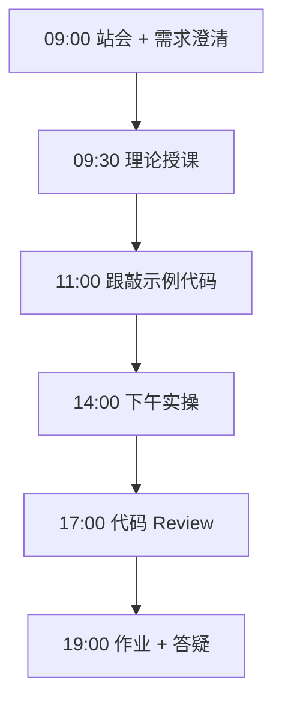
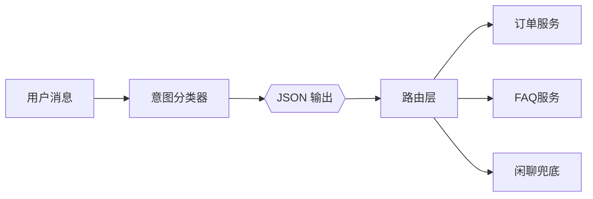

# Day 18：Prompt进阶与JSON输出

> **阶段**：Phase 2：大模型基础与Prompt工程 | **Epic**：NEXUS-E2 | **预计学时**：6-8 小时

## 旁白解读：今日上下文

> 🎬 **模拟站会 09:00** — 智链科技 Nexus 项目组

客服主管反馈：「AI 不能只回一段话，得告诉系统该走哪个工单流程。」
今天你们要做出 **可机器解析的意图分类器**——这是 NexusAgent 路由 Agent 的第一块积木。

**今日在 NexusAgent 主线中的位置**：NexusAgent 消息路由将消费 intent JSON

**今日 Jira 看板**：
- `NEXUS-181`
- `NEXUS-182`

---


## 需求文档（产品林悦下发）

**文档编号**：PRD-NEXUS-D18  
**版本**：v1.0  
**优先级**：P0

### 背景

Phase 2：大模型基础与Prompt工程阶段第 18 天教学任务，与 NexusAgent 主线项目对齐。

### User Stories

### NEXUS-181

**描述**：Prompt进阶与JSON输出 相关交付

**验收标准**：
- [ ] 代码可本地运行
- [ ] 通过 `scripts/verify_day.py --day 18`

### NEXUS-182

**描述**：Prompt进阶与JSON输出 相关交付

**验收标准**：
- [ ] 代码可本地运行
- [ ] 通过 `scripts/verify_day.py --day 18`


---


## 今日课表

### 上午 09:00-12:00

- 结构化输出：为什么 Agent 需要 JSON
- response_format / JSON mode 用法
- 解析容错：正则提取、markdown 代码块剥离

### 下午 14:00-17:30

- 跟敲 intent_classifier.py：6 类客服意图分类
- 测试边界 case：闲聊、多意图混合、英文输入
- 对比 temperature=0 vs 0.7 对 JSON 稳定性的影响

### 晚自习 19:00-21:00

- 扩展：从用户消息中抽取实体（订单号、城市）
- 阅读 JSON Schema 入门
- 预习：Function Calling 协议

---


## 课堂笔记

### 核心知识点速查

| 序号 | 知识点 | 代码位置 |
|------|--------|----------|
| 1 | JSON 结构化输出 | 见下午实操 |
| 2 | 意图分类 | 见下午实操 |
| 3 | response_format | 见下午实操 |
| 4 | 解析容错 | 见下午实操 |
| 5 | temperature=0 确定性 | 见下午实操 |

### 今日流程图



### 架构示意图（当日目标）



---


## 实操代码清单

- `code/intent_classifier.py`

请按顺序创建并运行。每段代码均可直接复制到对应文件执行。

---

## 实验手册（分时段操作表）

### 实验步骤 1：09:30-10:30 理论

| 时间 | 动作 | 预期结果 | 失败处理 |
|------|------|----------|----------|
| +0min | 打开课件本节 | 看到需求与验收标准 | 检查是否拉取最新 `develop` 分支 |
| +10min | 创建/打开当日 `code/` 文件 | 文件路径与清单一致 | 对照「实操代码清单」 |
| +30min | 粘贴并运行第一个脚本 | 终端有正常输出无 Traceback | 见下方「排错手册」 |
| +60min | 完成全部文件并自测 | `python3` 运行通过 | 使用 `scripts/verify_day.py --day 18` |
| +90min | 提交 Git 并建 MR | MR 关联 Jira NEXUS-181 | 按附录 Git 示例操作 |


### 实验步骤 2：10:30-12:00 跟敲

| 时间 | 动作 | 预期结果 | 失败处理 |
|------|------|----------|----------|
| +0min | 打开课件本节 | 看到需求与验收标准 | 检查是否拉取最新 `develop` 分支 |
| +10min | 创建/打开当日 `code/` 文件 | 文件路径与清单一致 | 对照「实操代码清单」 |
| +30min | 粘贴并运行第一个脚本 | 终端有正常输出无 Traceback | 见下方「排错手册」 |
| +60min | 完成全部文件并自测 | `python3` 运行通过 | 使用 `scripts/verify_day.py --day 18` |
| +90min | 提交 Git 并建 MR | MR 关联 Jira NEXUS-181 | 按附录 Git 示例操作 |


### 实验步骤 3：14:00-15:30 实操

| 时间 | 动作 | 预期结果 | 失败处理 |
|------|------|----------|----------|
| +0min | 打开课件本节 | 看到需求与验收标准 | 检查是否拉取最新 `develop` 分支 |
| +10min | 创建/打开当日 `code/` 文件 | 文件路径与清单一致 | 对照「实操代码清单」 |
| +30min | 粘贴并运行第一个脚本 | 终端有正常输出无 Traceback | 见下方「排错手册」 |
| +60min | 完成全部文件并自测 | `python3` 运行通过 | 使用 `scripts/verify_day.py --day 18` |
| +90min | 提交 Git 并建 MR | MR 关联 Jira NEXUS-181 | 按附录 Git 示例操作 |


### 实验步骤 4：15:30-17:00 联调

| 时间 | 动作 | 预期结果 | 失败处理 |
|------|------|----------|----------|
| +0min | 打开课件本节 | 看到需求与验收标准 | 检查是否拉取最新 `develop` 分支 |
| +10min | 创建/打开当日 `code/` 文件 | 文件路径与清单一致 | 对照「实操代码清单」 |
| +30min | 粘贴并运行第一个脚本 | 终端有正常输出无 Traceback | 见下方「排错手册」 |
| +60min | 完成全部文件并自测 | `python3` 运行通过 | 使用 `scripts/verify_day.py --day 18` |
| +90min | 提交 Git 并建 MR | MR 关联 Jira NEXUS-181 | 按附录 Git 示例操作 |


### 实验步骤 5：19:00-20:30 作业

| 时间 | 动作 | 预期结果 | 失败处理 |
|------|------|----------|----------|
| +0min | 打开课件本节 | 看到需求与验收标准 | 检查是否拉取最新 `develop` 分支 |
| +10min | 创建/打开当日 `code/` 文件 | 文件路径与清单一致 | 对照「实操代码清单」 |
| +30min | 粘贴并运行第一个脚本 | 终端有正常输出无 Traceback | 见下方「排错手册」 |
| +60min | 完成全部文件并自测 | `python3` 运行通过 | 使用 `scripts/verify_day.py --day 18` |
| +90min | 提交 Git 并建 MR | MR 关联 Jira NEXUS-181 | 按附录 Git 示例操作 |


### 排错手册（Day 18）

1. **`command not found: python3`** → 安装 Python 3.10+ 或使用 `py -3`（Windows）
2. **`ModuleNotFoundError`** → 确认当前目录、是否激活 venv、`pip install -r requirements.txt`（若当日有）
3. **`SyntaxError: invalid syntax`** → 检查上一行是否缺括号、引号是否中文
4. **`UnicodeDecodeError`** → 文件保存为 UTF-8，终端 `export PYTHONIOENCODING=utf-8`
5. **API 相关（Day12+）** → 检查 `.env` 中 Key，无 Key 时使用课件 MOCK 模式

---


## 逐步跟敲指南（完整源码与解析）

> 以下代码与 `code/` 目录完全一致，可直接复制。每段附行级说明。

### 文件：`code/intent_classifier.py`

**操作步骤**：
1. 在 `courseware/day-18/code/` 下创建文件 `intent_classifier.py`
2. 完整粘贴下方代码
3. 在终端执行：`cd courseware/day-18/code && python3 intent_classifier.py`（若为包内模块则按课件说明）

```python
#!/usr/bin/env python3
"""
Day 18 实操：意图分类器（JSON 结构化输出）
将用户输入分类为预定义意图，强制模型返回可解析 JSON。
"""
from __future__ import annotations

import json
import os
import re
import urllib.error
import urllib.request
from typing import Any

API_BASE = os.getenv("DEEPSEEK_API_BASE", "https://api.deepseek.com")
API_KEY = os.getenv("DEEPSEEK_API_KEY", "")
MODEL = os.getenv("DEEPSEEK_MODEL", "deepseek-chat")

# 智链客服场景意图标签
INTENTS = [
    "查询订单",
    "退换货",
    "产品咨询",
    "技术支持",
    "投诉建议",
    "闲聊",
]

SYSTEM_PROMPT = f"""你是智链科技客服意图分类器。
请将用户消息分类为以下意图之一：{", ".join(INTENTS)}。
必须仅输出 JSON，格式：
{{"intent": "意图名", "confidence": 0.0-1.0, "entities": {{"key": "value"}}, "reason": "一句话理由"}}
不要输出 markdown 代码块或其他文字。"""


def extract_json(text: str) -> dict[str, Any]:
    """从模型回复中提取 JSON（兼容多余前后缀）。"""
    text = text.strip()
    # 去除 ```json ... ``` 包裹
    if "```" in text:
        match = re.search(r"```(?:json)?\s*(\{.*?\})\s*```", text, re.DOTALL)
        if match:
            text = match.group(1)
    start, end = text.find("{"), text.rfind("}")
    if start >= 0 and end > start:
        text = text[start : end + 1]
    return json.loads(text)


def mock_classify(user_text: str) -> dict[str, Any]:
    """规则 MOCK 分类，便于无 API 时演示。"""
    rules = [
        ("订单", "查询订单"),
        ("退货", "退换货"),
        ("换货", "退换货"),
        ("价格", "产品咨询"),
        ("功能", "产品咨询"),
        ("报错", "技术支持"),
        ("bug", "技术支持"),
        ("投诉", "投诉建议"),
    ]
    intent = "闲聊"
    for kw, label in rules:
        if kw in user_text:
            intent = label
            break
    return {
        "intent": intent,
        "confidence": 0.85 if intent != "闲聊" else 0.6,
        "entities": {},
        "reason": f"MOCK 规则匹配: {user_text[:20]}",
    }


def classify_intent(user_text: str) -> dict[str, Any]:
    """调用 LLM 进行意图分类，返回解析后的 dict。"""
    if not API_KEY:
        return mock_classify(user_text)

    payload = {
        "model": MODEL,
        "messages": [
            {"role": "system", "content": SYSTEM_PROMPT},
            {"role": "user", "content": user_text},
        ],
        "temperature": 0.0,
        "response_format": {"type": "json_object"},
    }
    req = urllib.request.Request(
        f"{API_BASE}/v1/chat/completions",
        data=json.dumps(payload).encode("utf-8"),
        headers={"Content-Type": "application/json", "Authorization": f"Bearer {API_KEY}"},
        method="POST",
    )
    try:
        with urllib.request.urlopen(req, timeout=30) as resp:
            data = json.loads(resp.read().decode("utf-8"))
        raw = data["choices"][0]["message"]["content"]
        return extract_json(raw)
    except (urllib.error.URLError, json.JSONDecodeError, KeyError) as exc:
        return {"intent": "未知", "confidence": 0.0, "entities": {}, "reason": str(exc)}


def demo() -> None:
    samples = [
        "帮我查一下订单 20240315001 的物流",
        "这个产品支持私有化部署吗？多少钱？",
        "上传文档后一直转圈，是不是坏了？",
        "你们客服态度太差了，我要投诉！",
        "今天天气不错啊",
    ]
    print("=" * 60)
    print("Day 18 — 意图分类器（JSON 输出）")
    print("=" * 60)
    for text in samples:
        result = classify_intent(text)
        print(f"\n用户: {text}")
        print(f"分类: {json.dumps(result, ensure_ascii=False, indent=2)}")


if __name__ == "__main__":
    demo()

```

**解析要点（`intent_classifier.py`）**：

- 共 **122** 行，请逐行阅读注释中的中文说明

- 运行前确认 Python 版本 ≥ 3.10：`python3 --version`

- 若报错，先检查缩进是否为 4 空格，勿混用 Tab

- 企业 Review 清单：命名是否清晰、是否有异常处理、是否可复用

---


### 深度讲解 1：JSON 结构化输出

在企业级 Python 开发与大模型应用工程中，**JSON 结构化输出** 是学员必须牢固掌握的基本功。智链科技 Nexus 项目组在 Day 18 的代码评审中，特别强调以下几点：

1. **为什么学**：JSON 结构化输出 直接服务于后续 NexusAgent 平台的 `NEXUS-E2` 模块。没有扎实的 JSON 结构化输出，Day 25 之后调用 API、解析 JSON、编写 Agent 工具函数时会出现大量低级错误。

2. **常见坑**：
   - 忽略输入类型校验，导致运行时 `TypeError`
   - 编码问题（Windows 默认 GBK vs UTF-8）
   - 复制粘贴时缩进错乱（Python 对缩进敏感）

3. **企业实践**：在 SmartLink 的 GitLab 仓库中，所有与 JSON 结构化输出 相关的代码必须经过 Ruff 静态检查；变量命名使用 `snake_case`，常量使用 `UPPER_SNAKE_CASE`。

4. **与主线项目的关系**：今日代码位于 `courseware/day-18/code/`，部分模块将逐步合并到 `platform/nexus_agent/`。请养成「每日代码皆可运行、皆可测试」的习惯。

5. **扩展阅读建议**：完成今日作业后，可阅读 `docs/project-master-plan.md` 中关于 NEXUS-E2 的章节，建立全局视角。

**课堂互动题**：请用 3 句话向非技术同事解释「JSON 结构化输出」是什么。写在作业 MR 的评论里，讲师会抽查点评。

**实操检查清单**：
- [ ] 能不看课件复述 JSON 结构化输出 的定义
- [ ] 能独立写出相关代码并运行
- [ ] 能向同学讲解一处容易写错的地方


### 深度讲解 2：意图分类

在企业级 Python 开发与大模型应用工程中，**意图分类** 是学员必须牢固掌握的基本功。智链科技 Nexus 项目组在 Day 18 的代码评审中，特别强调以下几点：

1. **为什么学**：意图分类 直接服务于后续 NexusAgent 平台的 `NEXUS-E2` 模块。没有扎实的 意图分类，Day 25 之后调用 API、解析 JSON、编写 Agent 工具函数时会出现大量低级错误。

2. **常见坑**：
   - 忽略输入类型校验，导致运行时 `TypeError`
   - 编码问题（Windows 默认 GBK vs UTF-8）
   - 复制粘贴时缩进错乱（Python 对缩进敏感）

3. **企业实践**：在 SmartLink 的 GitLab 仓库中，所有与 意图分类 相关的代码必须经过 Ruff 静态检查；变量命名使用 `snake_case`，常量使用 `UPPER_SNAKE_CASE`。

4. **与主线项目的关系**：今日代码位于 `courseware/day-18/code/`，部分模块将逐步合并到 `platform/nexus_agent/`。请养成「每日代码皆可运行、皆可测试」的习惯。

5. **扩展阅读建议**：完成今日作业后，可阅读 `docs/project-master-plan.md` 中关于 NEXUS-E2 的章节，建立全局视角。

**课堂互动题**：请用 3 句话向非技术同事解释「意图分类」是什么。写在作业 MR 的评论里，讲师会抽查点评。

**实操检查清单**：
- [ ] 能不看课件复述 意图分类 的定义
- [ ] 能独立写出相关代码并运行
- [ ] 能向同学讲解一处容易写错的地方


### 深度讲解 3：response_format

在企业级 Python 开发与大模型应用工程中，**response_format** 是学员必须牢固掌握的基本功。智链科技 Nexus 项目组在 Day 18 的代码评审中，特别强调以下几点：

1. **为什么学**：response_format 直接服务于后续 NexusAgent 平台的 `NEXUS-E2` 模块。没有扎实的 response_format，Day 25 之后调用 API、解析 JSON、编写 Agent 工具函数时会出现大量低级错误。

2. **常见坑**：
   - 忽略输入类型校验，导致运行时 `TypeError`
   - 编码问题（Windows 默认 GBK vs UTF-8）
   - 复制粘贴时缩进错乱（Python 对缩进敏感）

3. **企业实践**：在 SmartLink 的 GitLab 仓库中，所有与 response_format 相关的代码必须经过 Ruff 静态检查；变量命名使用 `snake_case`，常量使用 `UPPER_SNAKE_CASE`。

4. **与主线项目的关系**：今日代码位于 `courseware/day-18/code/`，部分模块将逐步合并到 `platform/nexus_agent/`。请养成「每日代码皆可运行、皆可测试」的习惯。

5. **扩展阅读建议**：完成今日作业后，可阅读 `docs/project-master-plan.md` 中关于 NEXUS-E2 的章节，建立全局视角。

**课堂互动题**：请用 3 句话向非技术同事解释「response_format」是什么。写在作业 MR 的评论里，讲师会抽查点评。

**实操检查清单**：
- [ ] 能不看课件复述 response_format 的定义
- [ ] 能独立写出相关代码并运行
- [ ] 能向同学讲解一处容易写错的地方


### 深度讲解 4：解析容错

在企业级 Python 开发与大模型应用工程中，**解析容错** 是学员必须牢固掌握的基本功。智链科技 Nexus 项目组在 Day 18 的代码评审中，特别强调以下几点：

1. **为什么学**：解析容错 直接服务于后续 NexusAgent 平台的 `NEXUS-E2` 模块。没有扎实的 解析容错，Day 25 之后调用 API、解析 JSON、编写 Agent 工具函数时会出现大量低级错误。

2. **常见坑**：
   - 忽略输入类型校验，导致运行时 `TypeError`
   - 编码问题（Windows 默认 GBK vs UTF-8）
   - 复制粘贴时缩进错乱（Python 对缩进敏感）

3. **企业实践**：在 SmartLink 的 GitLab 仓库中，所有与 解析容错 相关的代码必须经过 Ruff 静态检查；变量命名使用 `snake_case`，常量使用 `UPPER_SNAKE_CASE`。

4. **与主线项目的关系**：今日代码位于 `courseware/day-18/code/`，部分模块将逐步合并到 `platform/nexus_agent/`。请养成「每日代码皆可运行、皆可测试」的习惯。

5. **扩展阅读建议**：完成今日作业后，可阅读 `docs/project-master-plan.md` 中关于 NEXUS-E2 的章节，建立全局视角。

**课堂互动题**：请用 3 句话向非技术同事解释「解析容错」是什么。写在作业 MR 的评论里，讲师会抽查点评。

**实操检查清单**：
- [ ] 能不看课件复述 解析容错 的定义
- [ ] 能独立写出相关代码并运行
- [ ] 能向同学讲解一处容易写错的地方


### 深度讲解 5：temperature=0 确定性

在企业级 Python 开发与大模型应用工程中，**temperature=0 确定性** 是学员必须牢固掌握的基本功。智链科技 Nexus 项目组在 Day 18 的代码评审中，特别强调以下几点：

1. **为什么学**：temperature=0 确定性 直接服务于后续 NexusAgent 平台的 `NEXUS-E2` 模块。没有扎实的 temperature=0 确定性，Day 25 之后调用 API、解析 JSON、编写 Agent 工具函数时会出现大量低级错误。

2. **常见坑**：
   - 忽略输入类型校验，导致运行时 `TypeError`
   - 编码问题（Windows 默认 GBK vs UTF-8）
   - 复制粘贴时缩进错乱（Python 对缩进敏感）

3. **企业实践**：在 SmartLink 的 GitLab 仓库中，所有与 temperature=0 确定性 相关的代码必须经过 Ruff 静态检查；变量命名使用 `snake_case`，常量使用 `UPPER_SNAKE_CASE`。

4. **与主线项目的关系**：今日代码位于 `courseware/day-18/code/`，部分模块将逐步合并到 `platform/nexus_agent/`。请养成「每日代码皆可运行、皆可测试」的习惯。

5. **扩展阅读建议**：完成今日作业后，可阅读 `docs/project-master-plan.md` 中关于 NEXUS-E2 的章节，建立全局视角。

**课堂互动题**：请用 3 句话向非技术同事解释「temperature=0 确定性」是什么。写在作业 MR 的评论里，讲师会抽查点评。

**实操检查清单**：
- [ ] 能不看课件复述 temperature=0 确定性 的定义
- [ ] 能独立写出相关代码并运行
- [ ] 能向同学讲解一处容易写错的地方


## 阶段复盘锚点（Phase 2：大模型基础与Prompt工程）

今天是 **Phase 2：大模型基础与Prompt工程** 的第 **8** 个学习日。请回顾：

- 昨天学了什么？今天如何承接？
- 今天的内容在 70 天路线图中的坐标？
- 如果我是 Tech Lead，会如何 Review 今日代码？

**陈工寄语**：慢即是快。企业里没人关心你一天学了多少个语法点，只关心你写的脚本能不能在服务器上稳定跑 7×24 小时。今天把地基打牢，后面 Agent 编排、RAG 检索才不会塌。

**林悦补充**：产品侧只验收「用户能感知到的价值」。今日交付虽然简单，但「个人信息卡片」本质是后续「用户画像 Agent」的数据采集原型——字段设计请认真思考。

**代码量统计（累计）**：完成今日后，个人仓库累计约 **25200** 行（含注释与测试），全营目标 10 万行。

**明日预告**：请提前阅读 `courseware/day-19/README.md` 开头的旁白，了解上下文。


## 常见问题 FAQ（讲师答疑实录）


**Q1：学习「JSON 结构化输出」时最常问的问题是什么？**

A：学员常问「这在大模型开发里到底用在哪里」。直接回答：在 NexusAgent 的 `NEXUS-E2` 中，JSON 结构化输出 用于支撑「Prompt进阶与JSON输出」这一交付。建议你打开 `platform/` 对照看未来模块如何引用今日写法。另一个常见问题是「要不要背语法」——不需要背，但要能写出可运行代码，并能在报错时读懂 Traceback。

**追问**：如果线上报错与 JSON 结构化输出 相关，如何排查？  
**答**：① 复现 ② 最小化输入 ③ 打印中间变量 ④ 查 GitLab 历史 diff ⑤ 在 Jira 建 Bug 单附上日志。


**Q2：学习「意图分类」时最常问的问题是什么？**

A：学员常问「这在大模型开发里到底用在哪里」。直接回答：在 NexusAgent 的 `NEXUS-E2` 中，意图分类 用于支撑「Prompt进阶与JSON输出」这一交付。建议你打开 `platform/` 对照看未来模块如何引用今日写法。另一个常见问题是「要不要背语法」——不需要背，但要能写出可运行代码，并能在报错时读懂 Traceback。

**追问**：如果线上报错与 意图分类 相关，如何排查？  
**答**：① 复现 ② 最小化输入 ③ 打印中间变量 ④ 查 GitLab 历史 diff ⑤ 在 Jira 建 Bug 单附上日志。


**Q3：学习「response_format」时最常问的问题是什么？**

A：学员常问「这在大模型开发里到底用在哪里」。直接回答：在 NexusAgent 的 `NEXUS-E2` 中，response_format 用于支撑「Prompt进阶与JSON输出」这一交付。建议你打开 `platform/` 对照看未来模块如何引用今日写法。另一个常见问题是「要不要背语法」——不需要背，但要能写出可运行代码，并能在报错时读懂 Traceback。

**追问**：如果线上报错与 response_format 相关，如何排查？  
**答**：① 复现 ② 最小化输入 ③ 打印中间变量 ④ 查 GitLab 历史 diff ⑤ 在 Jira 建 Bug 单附上日志。


**Q4：学习「解析容错」时最常问的问题是什么？**

A：学员常问「这在大模型开发里到底用在哪里」。直接回答：在 NexusAgent 的 `NEXUS-E2` 中，解析容错 用于支撑「Prompt进阶与JSON输出」这一交付。建议你打开 `platform/` 对照看未来模块如何引用今日写法。另一个常见问题是「要不要背语法」——不需要背，但要能写出可运行代码，并能在报错时读懂 Traceback。

**追问**：如果线上报错与 解析容错 相关，如何排查？  
**答**：① 复现 ② 最小化输入 ③ 打印中间变量 ④ 查 GitLab 历史 diff ⑤ 在 Jira 建 Bug 单附上日志。


**Q5：学习「temperature=0 确定性」时最常问的问题是什么？**

A：学员常问「这在大模型开发里到底用在哪里」。直接回答：在 NexusAgent 的 `NEXUS-E2` 中，temperature=0 确定性 用于支撑「Prompt进阶与JSON输出」这一交付。建议你打开 `platform/` 对照看未来模块如何引用今日写法。另一个常见问题是「要不要背语法」——不需要背，但要能写出可运行代码，并能在报错时读懂 Traceback。

**追问**：如果线上报错与 temperature=0 确定性 相关，如何排查？  
**答**：① 复现 ② 最小化输入 ③ 打印中间变量 ④ 查 GitLab 历史 diff ⑤ 在 Jira 建 Bug 单附上日志。


## 面试押题（与今日知识点挂钩）

以下题目会出现在 Day 67-69 模拟面试中，建议今日就开始积累答案：

1. **JSON 结构化输出**：请结合 NexusAgent 项目举例说明你在哪一天、哪段代码里用到了它？
2. **意图分类**：请结合 NexusAgent 项目举例说明你在哪一天、哪段代码里用到了它？
3. **response_format**：请结合 NexusAgent 项目举例说明你在哪一天、哪段代码里用到了它？
4. **解析容错**：请结合 NexusAgent 项目举例说明你在哪一天、哪段代码里用到了它？
5. **temperature=0 确定性**：请结合 NexusAgent 项目举例说明你在哪一天、哪段代码里用到了它？

**参考答案思路**：采用 STAR 法则（情境-任务-行动-结果），引用 `courseware/day-18/code/` 中的具体文件名与函数名。

---


## Code Review 检查表（陈工版）

合并 MR 前自查：

- [ ] 所有新增 `.py` 文件顶部有模块说明 docstring
- [ ] 无硬编码密钥（API Key 走环境变量）
- [ ] 函数长度 < 50 行，过长则拆分
- [ ] 异常有明确提示，禁止裸 `except:`
- [ ] 提交信息符合 `feat(day-18): ...`
- [ ] README 或注释说明如何运行
- [ ] 与 Jira Story 验收标准逐条对应

**今日重点审查项**：Prompt进阶与JSON输出 相关逻辑是否可读、可测、可扩展至 `platform/nexus_agent/`。

---


## 课后作业

### 作业说明

升级意图分类器：输出增加 `sub_intent` 字段；对「查询订单 12345 并投诉物流慢」实现多意图拆分（返回 intents 数组）。

### 提交要求

1. 代码提交到分支 `feature/day-18-homework`
2. GitLab MR 标题：`[Day-18] homework: 课后作业`
3. 在 MR 描述中附上运行截图或终端输出

### 评分标准（满分 100）

| 项 | 分值 |
|----|------|
| 功能完整 | 40 |
| 代码规范与注释 | 30 |
| 异常处理 | 15 |
| MR 与 Jira 关联 | 15 |

---

## 作业参考答案

> ⚠️ 请先独立完成再对照答案

修改 SYSTEM_PROMPT 要求 JSON 数组；`extract_json` 兼容 list 根节点；MOCK 模式用正则抽订单号。

---


## 附录：Git 提交示例

```bash
git checkout develop
git pull origin develop
git checkout -b feature/day-18-prompt进阶与j
# 完成代码后
git add courseware/day-18/
git commit -m "feat(day-18): Prompt进阶与JSON输出"
git push -u origin feature/day-18-prompt进阶与j
```

---

*课件版本 Day-18-v1.0 | 智链科技培训中心*
