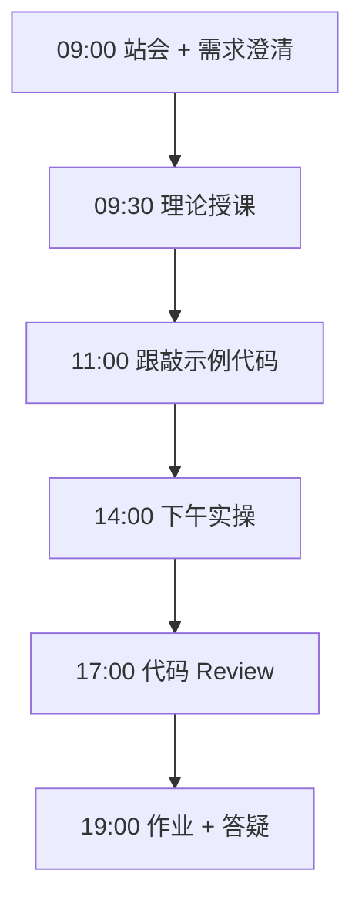
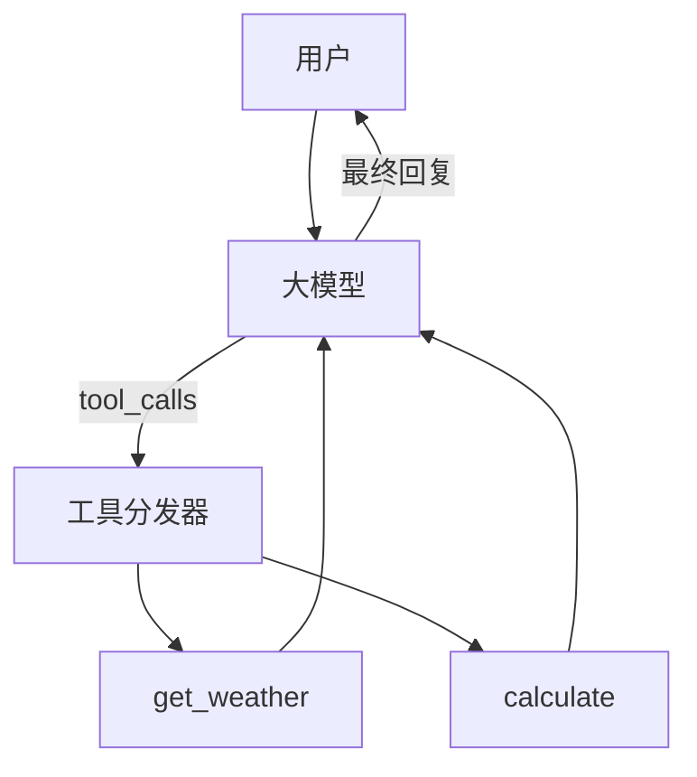

# Day 19：Function Calling工具调用

> **阶段**：Phase 2：大模型基础与Prompt工程 | **Epic**：NEXUS-E2 | **预计学时**：6-8 小时

## 旁白解读：今日上下文

> 🎬 **模拟站会 09:00** — 智链科技 Nexus 项目组

陈工：「模型不会查天气，但你可以教它**什么时候该调用你的函数**。Function Calling 是 Agent 的『手』。」
今天不碰任何框架，纯手写工具循环——搞懂了这个，LangChain 的 AgentExecutor 就只是语法糖。

**今日在 NexusAgent 主线中的位置**：NexusAgent 工具注册中心 TOOL_REGISTRY 原型

**今日 Jira 看板**：
- `NEXUS-191`
- `NEXUS-192`
- `NEXUS-193`

---


## 需求文档（产品林悦下发）

**文档编号**：PRD-NEXUS-D19  
**版本**：v1.0  
**优先级**：P0

### 背景

Phase 2：大模型基础与Prompt工程阶段第 19 天教学任务，与 NexusAgent 主线项目对齐。

### User Stories

### NEXUS-191

**描述**：Function Calling工具调用 相关交付

**验收标准**：
- [ ] 代码可本地运行
- [ ] 通过 `scripts/verify_day.py --day 19`

### NEXUS-192

**描述**：Function Calling工具调用 相关交付

**验收标准**：
- [ ] 代码可本地运行
- [ ] 通过 `scripts/verify_day.py --day 19`

### NEXUS-193

**描述**：Function Calling工具调用 相关交付

**验收标准**：
- [ ] 代码可本地运行
- [ ] 通过 `scripts/verify_day.py --day 19`


---


## 今日课表

### 上午 09:00-12:00

- Function Calling 协议：tools 定义、tool_calls、tool 角色消息
- 手写 vs 框架：理解底层循环再学 LangChain
- 工具设计原则：描述清晰、参数 JSON Schema、幂等性

### 下午 14:00-17:30

- 跟敲 tool_assistant.py：天气查询 + 计算器两个工具
- 实现 dispatch_tool 与多轮 tool_calls 循环
- MOCK 模式验证无 API 时也能演示

### 晚自习 19:00-21:00

- 新增第三个工具：get_current_time
- 阅读 OpenAI Function Calling 官方示例
- 预习：Embedding 与向量检索

---


## 课堂笔记

### 核心知识点速查

| 序号 | 知识点 | 代码位置 |
|------|--------|----------|
| 1 | Function Calling | 见下午实操 |
| 2 | JSON Schema 工具定义 | 见下午实操 |
| 3 | tool_calls 循环 | 见下午实操 |
| 4 | 工具注册表 | 见下午实操 |
| 5 | 无框架实现 | 见下午实操 |

### 今日流程图



### 架构示意图（当日目标）



---


## 实操代码清单

- `code/tool_assistant.py`

请按顺序创建并运行。每段代码均可直接复制到对应文件执行。

---

## 实验手册（分时段操作表）

### 实验步骤 1：09:30-10:30 理论

| 时间 | 动作 | 预期结果 | 失败处理 |
|------|------|----------|----------|
| +0min | 打开课件本节 | 看到需求与验收标准 | 检查是否拉取最新 `develop` 分支 |
| +10min | 创建/打开当日 `code/` 文件 | 文件路径与清单一致 | 对照「实操代码清单」 |
| +30min | 粘贴并运行第一个脚本 | 终端有正常输出无 Traceback | 见下方「排错手册」 |
| +60min | 完成全部文件并自测 | `python3` 运行通过 | 使用 `scripts/verify_day.py --day 19` |
| +90min | 提交 Git 并建 MR | MR 关联 Jira NEXUS-191 | 按附录 Git 示例操作 |


### 实验步骤 2：10:30-12:00 跟敲

| 时间 | 动作 | 预期结果 | 失败处理 |
|------|------|----------|----------|
| +0min | 打开课件本节 | 看到需求与验收标准 | 检查是否拉取最新 `develop` 分支 |
| +10min | 创建/打开当日 `code/` 文件 | 文件路径与清单一致 | 对照「实操代码清单」 |
| +30min | 粘贴并运行第一个脚本 | 终端有正常输出无 Traceback | 见下方「排错手册」 |
| +60min | 完成全部文件并自测 | `python3` 运行通过 | 使用 `scripts/verify_day.py --day 19` |
| +90min | 提交 Git 并建 MR | MR 关联 Jira NEXUS-191 | 按附录 Git 示例操作 |


### 实验步骤 3：14:00-15:30 实操

| 时间 | 动作 | 预期结果 | 失败处理 |
|------|------|----------|----------|
| +0min | 打开课件本节 | 看到需求与验收标准 | 检查是否拉取最新 `develop` 分支 |
| +10min | 创建/打开当日 `code/` 文件 | 文件路径与清单一致 | 对照「实操代码清单」 |
| +30min | 粘贴并运行第一个脚本 | 终端有正常输出无 Traceback | 见下方「排错手册」 |
| +60min | 完成全部文件并自测 | `python3` 运行通过 | 使用 `scripts/verify_day.py --day 19` |
| +90min | 提交 Git 并建 MR | MR 关联 Jira NEXUS-191 | 按附录 Git 示例操作 |


### 实验步骤 4：15:30-17:00 联调

| 时间 | 动作 | 预期结果 | 失败处理 |
|------|------|----------|----------|
| +0min | 打开课件本节 | 看到需求与验收标准 | 检查是否拉取最新 `develop` 分支 |
| +10min | 创建/打开当日 `code/` 文件 | 文件路径与清单一致 | 对照「实操代码清单」 |
| +30min | 粘贴并运行第一个脚本 | 终端有正常输出无 Traceback | 见下方「排错手册」 |
| +60min | 完成全部文件并自测 | `python3` 运行通过 | 使用 `scripts/verify_day.py --day 19` |
| +90min | 提交 Git 并建 MR | MR 关联 Jira NEXUS-191 | 按附录 Git 示例操作 |


### 实验步骤 5：19:00-20:30 作业

| 时间 | 动作 | 预期结果 | 失败处理 |
|------|------|----------|----------|
| +0min | 打开课件本节 | 看到需求与验收标准 | 检查是否拉取最新 `develop` 分支 |
| +10min | 创建/打开当日 `code/` 文件 | 文件路径与清单一致 | 对照「实操代码清单」 |
| +30min | 粘贴并运行第一个脚本 | 终端有正常输出无 Traceback | 见下方「排错手册」 |
| +60min | 完成全部文件并自测 | `python3` 运行通过 | 使用 `scripts/verify_day.py --day 19` |
| +90min | 提交 Git 并建 MR | MR 关联 Jira NEXUS-191 | 按附录 Git 示例操作 |


### 排错手册（Day 19）

1. **`command not found: python3`** → 安装 Python 3.10+ 或使用 `py -3`（Windows）
2. **`ModuleNotFoundError`** → 确认当前目录、是否激活 venv、`pip install -r requirements.txt`（若当日有）
3. **`SyntaxError: invalid syntax`** → 检查上一行是否缺括号、引号是否中文
4. **`UnicodeDecodeError`** → 文件保存为 UTF-8，终端 `export PYTHONIOENCODING=utf-8`
5. **API 相关（Day12+）** → 检查 `.env` 中 Key，无 Key 时使用课件 MOCK 模式

---


## 逐步跟敲指南（完整源码与解析）

> 以下代码与 `code/` 目录完全一致，可直接复制。每段附行级说明。

### 文件：`code/tool_assistant.py`

**操作步骤**：
1. 在 `courseware/day-19/code/` 下创建文件 `tool_assistant.py`
2. 完整粘贴下方代码
3. 在终端执行：`cd courseware/day-19/code && python3 tool_assistant.py`（若为包内模块则按课件说明）

```python
#!/usr/bin/env python3
"""
Day 19 实操：Function Calling 工具助手（无框架）
手写工具注册、参数解析与多轮 tool_calls 循环。
内置工具：get_weather（模拟）、calculate（安全 eval）。
"""
from __future__ import annotations

import json
import math
import os
import re
import urllib.error
import urllib.request
from typing import Any, Callable

API_BASE = os.getenv("DEEPSEEK_API_BASE", "https://api.deepseek.com")
API_KEY = os.getenv("DEEPSEEK_API_KEY", "")
MODEL = os.getenv("DEEPSEEK_MODEL", "deepseek-chat")

# ---------- 工具实现 ----------


def get_weather(city: str) -> dict[str, Any]:
    """模拟天气查询（教学用固定数据）。"""
    db = {
        "北京": {"temp": 28, "condition": "晴", "humidity": 35},
        "上海": {"temp": 32, "condition": "多云", "humidity": 70},
        "深圳": {"temp": 30, "condition": "阵雨", "humidity": 80},
    }
    info = db.get(city, {"temp": 25, "condition": "未知", "humidity": 50})
    return {"city": city, **info, "source": "mock_weather_api"}


def calculate(expression: str) -> dict[str, Any]:
    """
    安全计算数学表达式。
    仅允许数字、运算符与 math 模块常用函数。
    """
    allowed_names = {k: getattr(math, k) for k in dir(math) if not k.startswith("_")}
    allowed_names.update({"abs": abs, "round": round})
    # 白名单字符检查
    if not re.match(r"^[\d\s+\-*/().,a-zA-Z_]+$", expression):
        return {"error": "表达式含非法字符", "expression": expression}
    try:
        result = eval(expression, {"__builtins__": {}}, allowed_names)  # noqa: S307
        return {"expression": expression, "result": result}
    except Exception as exc:  # noqa: BLE001
        return {"error": str(exc), "expression": expression}


# 工具 JSON Schema（OpenAI 兼容格式）
TOOLS = [
    {
        "type": "function",
        "function": {
            "name": "get_weather",
            "description": "查询指定城市的当前天气",
            "parameters": {
                "type": "object",
                "properties": {"city": {"type": "string", "description": "城市名，如北京"}},
                "required": ["city"],
            },
        },
    },
    {
        "type": "function",
        "function": {
            "name": "calculate",
            "description": "计算数学表达式，支持 sqrt、sin 等",
            "parameters": {
                "type": "object",
                "properties": {
                    "expression": {"type": "string", "description": "数学表达式，如 2**10 + sqrt(16)"}
                },
                "required": ["expression"],
            },
        },
    },
]

TOOL_REGISTRY: dict[str, Callable[..., dict[str, Any]]] = {
    "get_weather": get_weather,
    "calculate": calculate,
}


def dispatch_tool(name: str, arguments: dict[str, Any]) -> str:
    """根据工具名调用并返回 JSON 字符串。"""
    fn = TOOL_REGISTRY.get(name)
    if not fn:
        return json.dumps({"error": f"未知工具: {name}"}, ensure_ascii=False)
    return json.dumps(fn(**arguments), ensure_ascii=False)


def mock_agent(user_query: str) -> str:
    """无 API 时的规则路由演示。"""
    if "天气" in user_query:
        city = "北京" if "北京" in user_query else "上海"
        return f"{city}天气：{json.dumps(get_weather(city), ensure_ascii=False)}"
    if any(op in user_query for op in ["计算", "+", "*", "sqrt"]):
        expr = re.search(r"[\d.+*/()-]+", user_query)
        if expr:
            return f"计算结果：{json.dumps(calculate(expr.group()), ensure_ascii=False)}"
    return "【MOCK】我可以查天气或做计算，请明确您的需求。"


def run_tool_loop(user_query: str, max_rounds: int = 5) -> str:
    """多轮 tool_calls 循环直至模型给出最终回复。"""
    if not API_KEY:
        return mock_agent(user_query)

    messages: list[dict[str, Any]] = [
        {"role": "system", "content": "你是 Nexus 助手，可调用工具回答问题。"},
        {"role": "user", "content": user_query},
    ]

    for _ in range(max_rounds):
        payload = {"model": MODEL, "messages": messages, "tools": TOOLS, "tool_choice": "auto"}
        req = urllib.request.Request(
            f"{API_BASE}/v1/chat/completions",
            data=json.dumps(payload).encode("utf-8"),
            headers={"Content-Type": "application/json", "Authorization": f"Bearer {API_KEY}"},
            method="POST",
        )
        with urllib.request.urlopen(req, timeout=60) as resp:
            data = json.loads(resp.read().decode("utf-8"))

        msg = data["choices"][0]["message"]
        messages.append(msg)

        tool_calls = msg.get("tool_calls")
        if not tool_calls:
            return msg.get("content", "")

        for tc in tool_calls:
            fn = tc["function"]
            args = json.loads(fn["arguments"])
            result = dispatch_tool(fn["name"], args)
            messages.append(
                {
                    "role": "tool",
                    "tool_call_id": tc["id"],
                    "content": result,
                }
            )

    return "超过最大工具调用轮次。"


def main() -> None:
    queries = [
        "北京今天天气怎么样？",
        "帮我算一下 sqrt(144) + 2**10",
    ]
    print("=" * 60)
    print("Day 19 — Function Calling 工具助手")
    print("=" * 60)
    for q in queries:
        print(f"\n用户: {q}")
        print(f"助手: {run_tool_loop(q)}")


if __name__ == "__main__":
    main()

```

**解析要点（`tool_assistant.py`）**：

- 共 **165** 行，请逐行阅读注释中的中文说明

- 运行前确认 Python 版本 ≥ 3.10：`python3 --version`

- 若报错，先检查缩进是否为 4 空格，勿混用 Tab

- 企业 Review 清单：命名是否清晰、是否有异常处理、是否可复用

---


### 深度讲解 1：Function Calling

在企业级 Python 开发与大模型应用工程中，**Function Calling** 是学员必须牢固掌握的基本功。智链科技 Nexus 项目组在 Day 19 的代码评审中，特别强调以下几点：

1. **为什么学**：Function Calling 直接服务于后续 NexusAgent 平台的 `NEXUS-E2` 模块。没有扎实的 Function Calling，Day 26 之后调用 API、解析 JSON、编写 Agent 工具函数时会出现大量低级错误。

2. **常见坑**：
   - 忽略输入类型校验，导致运行时 `TypeError`
   - 编码问题（Windows 默认 GBK vs UTF-8）
   - 复制粘贴时缩进错乱（Python 对缩进敏感）

3. **企业实践**：在 SmartLink 的 GitLab 仓库中，所有与 Function Calling 相关的代码必须经过 Ruff 静态检查；变量命名使用 `snake_case`，常量使用 `UPPER_SNAKE_CASE`。

4. **与主线项目的关系**：今日代码位于 `courseware/day-19/code/`，部分模块将逐步合并到 `platform/nexus_agent/`。请养成「每日代码皆可运行、皆可测试」的习惯。

5. **扩展阅读建议**：完成今日作业后，可阅读 `docs/project-master-plan.md` 中关于 NEXUS-E2 的章节，建立全局视角。

**课堂互动题**：请用 3 句话向非技术同事解释「Function Calling」是什么。写在作业 MR 的评论里，讲师会抽查点评。

**实操检查清单**：
- [ ] 能不看课件复述 Function Calling 的定义
- [ ] 能独立写出相关代码并运行
- [ ] 能向同学讲解一处容易写错的地方


### 深度讲解 2：JSON Schema 工具定义

在企业级 Python 开发与大模型应用工程中，**JSON Schema 工具定义** 是学员必须牢固掌握的基本功。智链科技 Nexus 项目组在 Day 19 的代码评审中，特别强调以下几点：

1. **为什么学**：JSON Schema 工具定义 直接服务于后续 NexusAgent 平台的 `NEXUS-E2` 模块。没有扎实的 JSON Schema 工具定义，Day 26 之后调用 API、解析 JSON、编写 Agent 工具函数时会出现大量低级错误。

2. **常见坑**：
   - 忽略输入类型校验，导致运行时 `TypeError`
   - 编码问题（Windows 默认 GBK vs UTF-8）
   - 复制粘贴时缩进错乱（Python 对缩进敏感）

3. **企业实践**：在 SmartLink 的 GitLab 仓库中，所有与 JSON Schema 工具定义 相关的代码必须经过 Ruff 静态检查；变量命名使用 `snake_case`，常量使用 `UPPER_SNAKE_CASE`。

4. **与主线项目的关系**：今日代码位于 `courseware/day-19/code/`，部分模块将逐步合并到 `platform/nexus_agent/`。请养成「每日代码皆可运行、皆可测试」的习惯。

5. **扩展阅读建议**：完成今日作业后，可阅读 `docs/project-master-plan.md` 中关于 NEXUS-E2 的章节，建立全局视角。

**课堂互动题**：请用 3 句话向非技术同事解释「JSON Schema 工具定义」是什么。写在作业 MR 的评论里，讲师会抽查点评。

**实操检查清单**：
- [ ] 能不看课件复述 JSON Schema 工具定义 的定义
- [ ] 能独立写出相关代码并运行
- [ ] 能向同学讲解一处容易写错的地方


### 深度讲解 3：tool_calls 循环

在企业级 Python 开发与大模型应用工程中，**tool_calls 循环** 是学员必须牢固掌握的基本功。智链科技 Nexus 项目组在 Day 19 的代码评审中，特别强调以下几点：

1. **为什么学**：tool_calls 循环 直接服务于后续 NexusAgent 平台的 `NEXUS-E2` 模块。没有扎实的 tool_calls 循环，Day 26 之后调用 API、解析 JSON、编写 Agent 工具函数时会出现大量低级错误。

2. **常见坑**：
   - 忽略输入类型校验，导致运行时 `TypeError`
   - 编码问题（Windows 默认 GBK vs UTF-8）
   - 复制粘贴时缩进错乱（Python 对缩进敏感）

3. **企业实践**：在 SmartLink 的 GitLab 仓库中，所有与 tool_calls 循环 相关的代码必须经过 Ruff 静态检查；变量命名使用 `snake_case`，常量使用 `UPPER_SNAKE_CASE`。

4. **与主线项目的关系**：今日代码位于 `courseware/day-19/code/`，部分模块将逐步合并到 `platform/nexus_agent/`。请养成「每日代码皆可运行、皆可测试」的习惯。

5. **扩展阅读建议**：完成今日作业后，可阅读 `docs/project-master-plan.md` 中关于 NEXUS-E2 的章节，建立全局视角。

**课堂互动题**：请用 3 句话向非技术同事解释「tool_calls 循环」是什么。写在作业 MR 的评论里，讲师会抽查点评。

**实操检查清单**：
- [ ] 能不看课件复述 tool_calls 循环 的定义
- [ ] 能独立写出相关代码并运行
- [ ] 能向同学讲解一处容易写错的地方


### 深度讲解 4：工具注册表

在企业级 Python 开发与大模型应用工程中，**工具注册表** 是学员必须牢固掌握的基本功。智链科技 Nexus 项目组在 Day 19 的代码评审中，特别强调以下几点：

1. **为什么学**：工具注册表 直接服务于后续 NexusAgent 平台的 `NEXUS-E2` 模块。没有扎实的 工具注册表，Day 26 之后调用 API、解析 JSON、编写 Agent 工具函数时会出现大量低级错误。

2. **常见坑**：
   - 忽略输入类型校验，导致运行时 `TypeError`
   - 编码问题（Windows 默认 GBK vs UTF-8）
   - 复制粘贴时缩进错乱（Python 对缩进敏感）

3. **企业实践**：在 SmartLink 的 GitLab 仓库中，所有与 工具注册表 相关的代码必须经过 Ruff 静态检查；变量命名使用 `snake_case`，常量使用 `UPPER_SNAKE_CASE`。

4. **与主线项目的关系**：今日代码位于 `courseware/day-19/code/`，部分模块将逐步合并到 `platform/nexus_agent/`。请养成「每日代码皆可运行、皆可测试」的习惯。

5. **扩展阅读建议**：完成今日作业后，可阅读 `docs/project-master-plan.md` 中关于 NEXUS-E2 的章节，建立全局视角。

**课堂互动题**：请用 3 句话向非技术同事解释「工具注册表」是什么。写在作业 MR 的评论里，讲师会抽查点评。

**实操检查清单**：
- [ ] 能不看课件复述 工具注册表 的定义
- [ ] 能独立写出相关代码并运行
- [ ] 能向同学讲解一处容易写错的地方


### 深度讲解 5：无框架实现

在企业级 Python 开发与大模型应用工程中，**无框架实现** 是学员必须牢固掌握的基本功。智链科技 Nexus 项目组在 Day 19 的代码评审中，特别强调以下几点：

1. **为什么学**：无框架实现 直接服务于后续 NexusAgent 平台的 `NEXUS-E2` 模块。没有扎实的 无框架实现，Day 26 之后调用 API、解析 JSON、编写 Agent 工具函数时会出现大量低级错误。

2. **常见坑**：
   - 忽略输入类型校验，导致运行时 `TypeError`
   - 编码问题（Windows 默认 GBK vs UTF-8）
   - 复制粘贴时缩进错乱（Python 对缩进敏感）

3. **企业实践**：在 SmartLink 的 GitLab 仓库中，所有与 无框架实现 相关的代码必须经过 Ruff 静态检查；变量命名使用 `snake_case`，常量使用 `UPPER_SNAKE_CASE`。

4. **与主线项目的关系**：今日代码位于 `courseware/day-19/code/`，部分模块将逐步合并到 `platform/nexus_agent/`。请养成「每日代码皆可运行、皆可测试」的习惯。

5. **扩展阅读建议**：完成今日作业后，可阅读 `docs/project-master-plan.md` 中关于 NEXUS-E2 的章节，建立全局视角。

**课堂互动题**：请用 3 句话向非技术同事解释「无框架实现」是什么。写在作业 MR 的评论里，讲师会抽查点评。

**实操检查清单**：
- [ ] 能不看课件复述 无框架实现 的定义
- [ ] 能独立写出相关代码并运行
- [ ] 能向同学讲解一处容易写错的地方


## 阶段复盘锚点（Phase 2：大模型基础与Prompt工程）

今天是 **Phase 2：大模型基础与Prompt工程** 的第 **9** 个学习日。请回顾：

- 昨天学了什么？今天如何承接？
- 今天的内容在 70 天路线图中的坐标？
- 如果我是 Tech Lead，会如何 Review 今日代码？

**陈工寄语**：慢即是快。企业里没人关心你一天学了多少个语法点，只关心你写的脚本能不能在服务器上稳定跑 7×24 小时。今天把地基打牢，后面 Agent 编排、RAG 检索才不会塌。

**林悦补充**：产品侧只验收「用户能感知到的价值」。今日交付虽然简单，但「个人信息卡片」本质是后续「用户画像 Agent」的数据采集原型——字段设计请认真思考。

**代码量统计（累计）**：完成今日后，个人仓库累计约 **26600** 行（含注释与测试），全营目标 10 万行。

**明日预告**：请提前阅读 `courseware/day-20/README.md` 开头的旁白，了解上下文。


## 常见问题 FAQ（讲师答疑实录）


**Q1：学习「Function Calling」时最常问的问题是什么？**

A：学员常问「这在大模型开发里到底用在哪里」。直接回答：在 NexusAgent 的 `NEXUS-E2` 中，Function Calling 用于支撑「Function Calling工具调用」这一交付。建议你打开 `platform/` 对照看未来模块如何引用今日写法。另一个常见问题是「要不要背语法」——不需要背，但要能写出可运行代码，并能在报错时读懂 Traceback。

**追问**：如果线上报错与 Function Calling 相关，如何排查？  
**答**：① 复现 ② 最小化输入 ③ 打印中间变量 ④ 查 GitLab 历史 diff ⑤ 在 Jira 建 Bug 单附上日志。


**Q2：学习「JSON Schema 工具定义」时最常问的问题是什么？**

A：学员常问「这在大模型开发里到底用在哪里」。直接回答：在 NexusAgent 的 `NEXUS-E2` 中，JSON Schema 工具定义 用于支撑「Function Calling工具调用」这一交付。建议你打开 `platform/` 对照看未来模块如何引用今日写法。另一个常见问题是「要不要背语法」——不需要背，但要能写出可运行代码，并能在报错时读懂 Traceback。

**追问**：如果线上报错与 JSON Schema 工具定义 相关，如何排查？  
**答**：① 复现 ② 最小化输入 ③ 打印中间变量 ④ 查 GitLab 历史 diff ⑤ 在 Jira 建 Bug 单附上日志。


**Q3：学习「tool_calls 循环」时最常问的问题是什么？**

A：学员常问「这在大模型开发里到底用在哪里」。直接回答：在 NexusAgent 的 `NEXUS-E2` 中，tool_calls 循环 用于支撑「Function Calling工具调用」这一交付。建议你打开 `platform/` 对照看未来模块如何引用今日写法。另一个常见问题是「要不要背语法」——不需要背，但要能写出可运行代码，并能在报错时读懂 Traceback。

**追问**：如果线上报错与 tool_calls 循环 相关，如何排查？  
**答**：① 复现 ② 最小化输入 ③ 打印中间变量 ④ 查 GitLab 历史 diff ⑤ 在 Jira 建 Bug 单附上日志。


**Q4：学习「工具注册表」时最常问的问题是什么？**

A：学员常问「这在大模型开发里到底用在哪里」。直接回答：在 NexusAgent 的 `NEXUS-E2` 中，工具注册表 用于支撑「Function Calling工具调用」这一交付。建议你打开 `platform/` 对照看未来模块如何引用今日写法。另一个常见问题是「要不要背语法」——不需要背，但要能写出可运行代码，并能在报错时读懂 Traceback。

**追问**：如果线上报错与 工具注册表 相关，如何排查？  
**答**：① 复现 ② 最小化输入 ③ 打印中间变量 ④ 查 GitLab 历史 diff ⑤ 在 Jira 建 Bug 单附上日志。


**Q5：学习「无框架实现」时最常问的问题是什么？**

A：学员常问「这在大模型开发里到底用在哪里」。直接回答：在 NexusAgent 的 `NEXUS-E2` 中，无框架实现 用于支撑「Function Calling工具调用」这一交付。建议你打开 `platform/` 对照看未来模块如何引用今日写法。另一个常见问题是「要不要背语法」——不需要背，但要能写出可运行代码，并能在报错时读懂 Traceback。

**追问**：如果线上报错与 无框架实现 相关，如何排查？  
**答**：① 复现 ② 最小化输入 ③ 打印中间变量 ④ 查 GitLab 历史 diff ⑤ 在 Jira 建 Bug 单附上日志。


## 面试押题（与今日知识点挂钩）

以下题目会出现在 Day 67-69 模拟面试中，建议今日就开始积累答案：

1. **Function Calling**：请结合 NexusAgent 项目举例说明你在哪一天、哪段代码里用到了它？
2. **JSON Schema 工具定义**：请结合 NexusAgent 项目举例说明你在哪一天、哪段代码里用到了它？
3. **tool_calls 循环**：请结合 NexusAgent 项目举例说明你在哪一天、哪段代码里用到了它？
4. **工具注册表**：请结合 NexusAgent 项目举例说明你在哪一天、哪段代码里用到了它？
5. **无框架实现**：请结合 NexusAgent 项目举例说明你在哪一天、哪段代码里用到了它？

**参考答案思路**：采用 STAR 法则（情境-任务-行动-结果），引用 `courseware/day-19/code/` 中的具体文件名与函数名。

---


## Code Review 检查表（陈工版）

合并 MR 前自查：

- [ ] 所有新增 `.py` 文件顶部有模块说明 docstring
- [ ] 无硬编码密钥（API Key 走环境变量）
- [ ] 函数长度 < 50 行，过长则拆分
- [ ] 异常有明确提示，禁止裸 `except:`
- [ ] 提交信息符合 `feat(day-19): ...`
- [ ] README 或注释说明如何运行
- [ ] 与 Jira Story 验收标准逐条对应

**今日重点审查项**：Function Calling工具调用 相关逻辑是否可读、可测、可扩展至 `platform/nexus_agent/`。

---


## 课后作业

### 作业说明

为 tool_assistant.py 增加 `search_faq(query)` 工具（内置 5 条 FAQ），并支持模型在一次对话中链式调用多个工具（如先查天气再计算温差）。

### 提交要求

1. 代码提交到分支 `feature/day-19-homework`
2. GitLab MR 标题：`[Day-19] homework: 课后作业`
3. 在 MR 描述中附上运行截图或终端输出

### 评分标准（满分 100）

| 项 | 分值 |
|----|------|
| 功能完整 | 40 |
| 代码规范与注释 | 30 |
| 异常处理 | 15 |
| MR 与 Jira 关联 | 15 |

---

## 作业参考答案

> ⚠️ 请先独立完成再对照答案

在 TOOLS 列表追加 schema；TOOL_REGISTRY 注册实现；多轮 loop 已支持链式，重点写好工具 description。

---


## 附录：Git 提交示例

```bash
git checkout develop
git pull origin develop
git checkout -b feature/day-19-function-c
# 完成代码后
git add courseware/day-19/
git commit -m "feat(day-19): Function Calling工具调用"
git push -u origin feature/day-19-function-c
```

---

*课件版本 Day-19-v1.0 | 智链科技培训中心*
