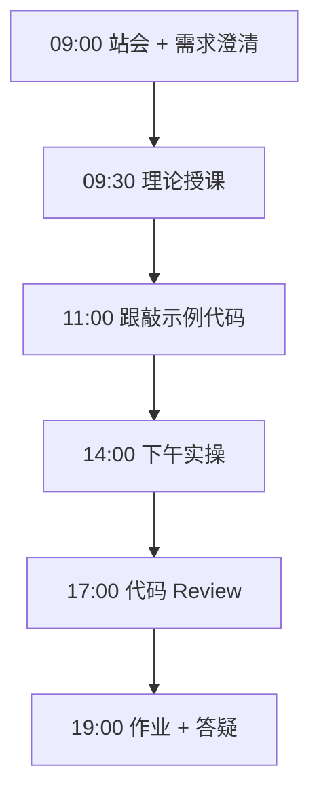
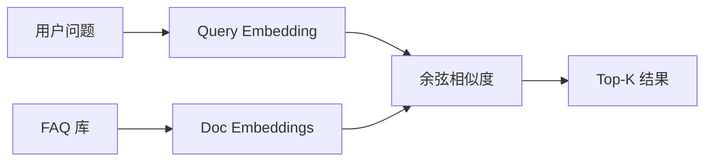

# Day 20：Embedding与语义检索

> **阶段**：Phase 2：大模型基础与Prompt工程 | **Epic**：NEXUS-E2 | **预计学时**：6-8 小时

## 旁白解读：今日上下文

> 🎬 **模拟站会 09:00** — 智链科技 Nexus 项目组

林悦：「用户不会照着 FAQ 原文提问，语义搜索得找『意思相近』的答案。」
Embedding 是 RAG 的燃料。今天先用 5 条 FAQ 跑通检索闭环，Day 25 起就上真向量库。

**今日在 NexusAgent 主线中的位置**：为 NexusAgent RAG 模块铺垫

**今日 Jira 看板**：
- `NEXUS-201`
- `NEXUS-202`

---


## 需求文档（产品林悦下发）

**文档编号**：PRD-NEXUS-D20  
**版本**：v1.0  
**优先级**：P0

### 背景

Phase 2：大模型基础与Prompt工程阶段第 20 天教学任务，与 NexusAgent 主线项目对齐。

### User Stories

### NEXUS-201

**描述**：Embedding与语义检索 相关交付

**验收标准**：
- [ ] 代码可本地运行
- [ ] 通过 `scripts/verify_day.py --day 20`

### NEXUS-202

**描述**：Embedding与语义检索 相关交付

**验收标准**：
- [ ] 代码可本地运行
- [ ] 通过 `scripts/verify_day.py --day 20`


---


## 今日课表

### 上午 09:00-12:00

- 词向量直觉：从 one-hot 到稠密向量
- Embedding API 用法与维度
- 余弦相似度与 Top-K 检索

### 下午 14:00-17:30

- 跟敲 similarity_matcher.py：FAQ 语义匹配
- 对比词袋 fallback 与真实 Embedding 效果
- 讨论：RAG 中 chunk 大小与检索质量

### 晚自习 19:00-21:00

- 尝试不同 query 表述的检索排名变化
- 阅读 Chroma 文档简介
- 预习：周测综合集成

---


## 课堂笔记

### 核心知识点速查

| 序号 | 知识点 | 代码位置 |
|------|--------|----------|
| 1 | 文本 Embedding | 见下午实操 |
| 2 | 余弦相似度 | 见下午实操 |
| 3 | Top-K 检索 | 见下午实操 |
| 4 | 词袋 fallback | 见下午实操 |
| 5 | FAQ 语义匹配 | 见下午实操 |

### 今日流程图



### 架构示意图（当日目标）



---


## 实操代码清单

- `code/similarity_matcher.py`

请按顺序创建并运行。每段代码均可直接复制到对应文件执行。

---

## 实验手册（分时段操作表）

### 实验步骤 1：09:30-10:30 理论

| 时间 | 动作 | 预期结果 | 失败处理 |
|------|------|----------|----------|
| +0min | 打开课件本节 | 看到需求与验收标准 | 检查是否拉取最新 `develop` 分支 |
| +10min | 创建/打开当日 `code/` 文件 | 文件路径与清单一致 | 对照「实操代码清单」 |
| +30min | 粘贴并运行第一个脚本 | 终端有正常输出无 Traceback | 见下方「排错手册」 |
| +60min | 完成全部文件并自测 | `python3` 运行通过 | 使用 `scripts/verify_day.py --day 20` |
| +90min | 提交 Git 并建 MR | MR 关联 Jira NEXUS-201 | 按附录 Git 示例操作 |


### 实验步骤 2：10:30-12:00 跟敲

| 时间 | 动作 | 预期结果 | 失败处理 |
|------|------|----------|----------|
| +0min | 打开课件本节 | 看到需求与验收标准 | 检查是否拉取最新 `develop` 分支 |
| +10min | 创建/打开当日 `code/` 文件 | 文件路径与清单一致 | 对照「实操代码清单」 |
| +30min | 粘贴并运行第一个脚本 | 终端有正常输出无 Traceback | 见下方「排错手册」 |
| +60min | 完成全部文件并自测 | `python3` 运行通过 | 使用 `scripts/verify_day.py --day 20` |
| +90min | 提交 Git 并建 MR | MR 关联 Jira NEXUS-201 | 按附录 Git 示例操作 |


### 实验步骤 3：14:00-15:30 实操

| 时间 | 动作 | 预期结果 | 失败处理 |
|------|------|----------|----------|
| +0min | 打开课件本节 | 看到需求与验收标准 | 检查是否拉取最新 `develop` 分支 |
| +10min | 创建/打开当日 `code/` 文件 | 文件路径与清单一致 | 对照「实操代码清单」 |
| +30min | 粘贴并运行第一个脚本 | 终端有正常输出无 Traceback | 见下方「排错手册」 |
| +60min | 完成全部文件并自测 | `python3` 运行通过 | 使用 `scripts/verify_day.py --day 20` |
| +90min | 提交 Git 并建 MR | MR 关联 Jira NEXUS-201 | 按附录 Git 示例操作 |


### 实验步骤 4：15:30-17:00 联调

| 时间 | 动作 | 预期结果 | 失败处理 |
|------|------|----------|----------|
| +0min | 打开课件本节 | 看到需求与验收标准 | 检查是否拉取最新 `develop` 分支 |
| +10min | 创建/打开当日 `code/` 文件 | 文件路径与清单一致 | 对照「实操代码清单」 |
| +30min | 粘贴并运行第一个脚本 | 终端有正常输出无 Traceback | 见下方「排错手册」 |
| +60min | 完成全部文件并自测 | `python3` 运行通过 | 使用 `scripts/verify_day.py --day 20` |
| +90min | 提交 Git 并建 MR | MR 关联 Jira NEXUS-201 | 按附录 Git 示例操作 |


### 实验步骤 5：19:00-20:30 作业

| 时间 | 动作 | 预期结果 | 失败处理 |
|------|------|----------|----------|
| +0min | 打开课件本节 | 看到需求与验收标准 | 检查是否拉取最新 `develop` 分支 |
| +10min | 创建/打开当日 `code/` 文件 | 文件路径与清单一致 | 对照「实操代码清单」 |
| +30min | 粘贴并运行第一个脚本 | 终端有正常输出无 Traceback | 见下方「排错手册」 |
| +60min | 完成全部文件并自测 | `python3` 运行通过 | 使用 `scripts/verify_day.py --day 20` |
| +90min | 提交 Git 并建 MR | MR 关联 Jira NEXUS-201 | 按附录 Git 示例操作 |


### 排错手册（Day 20）

1. **`command not found: python3`** → 安装 Python 3.10+ 或使用 `py -3`（Windows）
2. **`ModuleNotFoundError`** → 确认当前目录、是否激活 venv、`pip install -r requirements.txt`（若当日有）
3. **`SyntaxError: invalid syntax`** → 检查上一行是否缺括号、引号是否中文
4. **`UnicodeDecodeError`** → 文件保存为 UTF-8，终端 `export PYTHONIOENCODING=utf-8`
5. **API 相关（Day12+）** → 检查 `.env` 中 Key，无 Key 时使用课件 MOCK 模式

---


## 逐步跟敲指南（完整源码与解析）

> 以下代码与 `code/` 目录完全一致，可直接复制。每段附行级说明。

### 文件：`code/similarity_matcher.py`

**操作步骤**：
1. 在 `courseware/day-20/code/` 下创建文件 `similarity_matcher.py`
2. 完整粘贴下方代码
3. 在终端执行：`cd courseware/day-20/code && python3 similarity_matcher.py`（若为包内模块则按课件说明）

```python
#!/usr/bin/env python3
"""
Day 20 实操：文本 Embedding 与语义相似度匹配
演示向量表示、余弦相似度，以及简单 FAQ 检索。
无 API 时使用 TF-IDF 风格词袋向量作为 fallback。
"""
from __future__ import annotations

import json
import math
import os
import re
import urllib.error
import urllib.request
from collections import Counter
from typing import Any

API_BASE = os.getenv("DEEPSEEK_API_BASE", "https://api.deepseek.com")
API_KEY = os.getenv("DEEPSEEK_API_KEY", "")
EMBED_MODEL = os.getenv("EMBED_MODEL", "text-embedding-3-small")

FAQ_CORPUS = [
    {"id": "faq-01", "question": "NexusAgent 支持哪些大模型？", "answer": "支持 DeepSeek、Qwen、OpenAI 兼容 API。"},
    {"id": "faq-02", "question": "如何上传企业知识库文档？", "answer": "Day 25 起支持 PDF/Word 上传并向量化。"},
    {"id": "faq-03", "question": "是否支持私有化部署？", "answer": "支持 Docker 私有化，Day 56 详解。"},
    {"id": "faq-04", "question": "API 调用如何计费？", "answer": "按 token 计费，可在控制台查看用量。"},
    {"id": "faq-05", "question": "能否对接飞书机器人？", "answer": "Day 45 将讲解 Webhook 与飞书集成。"},
]


def tokenize(text: str) -> list[str]:
    """简单分词：中文按字、英文按单词。"""
    chars = re.findall(r"[\u4e00-\u9fff]", text)
    words = re.findall(r"[a-zA-Z0-9]+", text.lower())
    return chars + words


def bag_of_words_vector(text: str, vocab: dict[str, int]) -> list[float]:
    """词袋向量（教学 fallback）。"""
    counts = Counter(tokenize(text))
    return [float(counts.get(w, 0)) for w in vocab]


def cosine_similarity(a: list[float], b: list[float]) -> float:
    """计算余弦相似度。"""
    dot = sum(x * y for x, y in zip(a, b))
    norm_a = math.sqrt(sum(x * x for x in a))
    norm_b = math.sqrt(sum(x * x for x in b))
    if norm_a == 0 or norm_b == 0:
        return 0.0
    return dot / (norm_a * norm_b)


def build_vocab(texts: list[str]) -> dict[str, int]:
    """构建词表。"""
    vocab: dict[str, int] = {}
    for t in texts:
        for tok in set(tokenize(t)):
            if tok not in vocab:
                vocab[tok] = len(vocab)
    return vocab


def get_embedding_api(text: str) -> list[float] | None:
    """调用 Embedding API；失败返回 None。"""
    if not API_KEY:
        return None
    payload = {"model": EMBED_MODEL, "input": text}
    req = urllib.request.Request(
        f"{API_BASE}/v1/embeddings",
        data=json.dumps(payload).encode("utf-8"),
        headers={"Content-Type": "application/json", "Authorization": f"Bearer {API_KEY}"},
        method="POST",
    )
    try:
        with urllib.request.urlopen(req, timeout=30) as resp:
            data = json.loads(resp.read().decode("utf-8"))
        return data["data"][0]["embedding"]
    except (urllib.error.URLError, KeyError, json.JSONDecodeError):
        return None


def embed_texts(texts: list[str]) -> list[list[float]]:
    """批量向量化；优先 API，否则词袋。"""
    api_vecs = [get_embedding_api(t) for t in texts]
    if all(v is not None for v in api_vecs):
        return api_vecs  # type: ignore[list-item]

    print("  [INFO] 使用本地词袋向量（未配置 API 或 Embedding 不可用）")
    vocab = build_vocab(texts)
    return [bag_of_words_vector(t, vocab) for t in texts]


def search_faq(query: str, top_k: int = 3) -> list[dict[str, Any]]:
    """语义检索 FAQ，返回 top_k 条。"""
    questions = [item["question"] for item in FAQ_CORPUS]
    all_texts = questions + [query]
    vectors = embed_texts(all_texts)
    query_vec = vectors[-1]
    doc_vecs = vectors[:-1]

    scored = []
    for item, vec in zip(FAQ_CORPUS, doc_vecs):
        score = cosine_similarity(query_vec, vec)
        scored.append({**item, "score": round(score, 4)})
    scored.sort(key=lambda x: x["score"], reverse=True)
    return scored[:top_k]


def main() -> None:
    queries = [
        "你们平台能接什么模型？",
        "怎么把公司文档放进去？",
        "本地服务器能装吗？",
    ]
    print("=" * 60)
    print("Day 20 — Embedding 语义相似度匹配")
    print("=" * 60)
    for q in queries:
        print(f"\n查询: {q}")
        results = search_faq(q)
        for r in results:
            print(f"  [{r['score']:.4f}] {r['question']}")
            print(f"         → {r['answer']}")


if __name__ == "__main__":
    main()

```

**解析要点（`similarity_matcher.py`）**：

- 共 **128** 行，请逐行阅读注释中的中文说明

- 运行前确认 Python 版本 ≥ 3.10：`python3 --version`

- 若报错，先检查缩进是否为 4 空格，勿混用 Tab

- 企业 Review 清单：命名是否清晰、是否有异常处理、是否可复用

---


### 深度讲解 1：文本 Embedding

在企业级 Python 开发与大模型应用工程中，**文本 Embedding** 是学员必须牢固掌握的基本功。智链科技 Nexus 项目组在 Day 20 的代码评审中，特别强调以下几点：

1. **为什么学**：文本 Embedding 直接服务于后续 NexusAgent 平台的 `NEXUS-E2` 模块。没有扎实的 文本 Embedding，Day 27 之后调用 API、解析 JSON、编写 Agent 工具函数时会出现大量低级错误。

2. **常见坑**：
   - 忽略输入类型校验，导致运行时 `TypeError`
   - 编码问题（Windows 默认 GBK vs UTF-8）
   - 复制粘贴时缩进错乱（Python 对缩进敏感）

3. **企业实践**：在 SmartLink 的 GitLab 仓库中，所有与 文本 Embedding 相关的代码必须经过 Ruff 静态检查；变量命名使用 `snake_case`，常量使用 `UPPER_SNAKE_CASE`。

4. **与主线项目的关系**：今日代码位于 `courseware/day-20/code/`，部分模块将逐步合并到 `platform/nexus_agent/`。请养成「每日代码皆可运行、皆可测试」的习惯。

5. **扩展阅读建议**：完成今日作业后，可阅读 `docs/project-master-plan.md` 中关于 NEXUS-E2 的章节，建立全局视角。

**课堂互动题**：请用 3 句话向非技术同事解释「文本 Embedding」是什么。写在作业 MR 的评论里，讲师会抽查点评。

**实操检查清单**：
- [ ] 能不看课件复述 文本 Embedding 的定义
- [ ] 能独立写出相关代码并运行
- [ ] 能向同学讲解一处容易写错的地方


### 深度讲解 2：余弦相似度

在企业级 Python 开发与大模型应用工程中，**余弦相似度** 是学员必须牢固掌握的基本功。智链科技 Nexus 项目组在 Day 20 的代码评审中，特别强调以下几点：

1. **为什么学**：余弦相似度 直接服务于后续 NexusAgent 平台的 `NEXUS-E2` 模块。没有扎实的 余弦相似度，Day 27 之后调用 API、解析 JSON、编写 Agent 工具函数时会出现大量低级错误。

2. **常见坑**：
   - 忽略输入类型校验，导致运行时 `TypeError`
   - 编码问题（Windows 默认 GBK vs UTF-8）
   - 复制粘贴时缩进错乱（Python 对缩进敏感）

3. **企业实践**：在 SmartLink 的 GitLab 仓库中，所有与 余弦相似度 相关的代码必须经过 Ruff 静态检查；变量命名使用 `snake_case`，常量使用 `UPPER_SNAKE_CASE`。

4. **与主线项目的关系**：今日代码位于 `courseware/day-20/code/`，部分模块将逐步合并到 `platform/nexus_agent/`。请养成「每日代码皆可运行、皆可测试」的习惯。

5. **扩展阅读建议**：完成今日作业后，可阅读 `docs/project-master-plan.md` 中关于 NEXUS-E2 的章节，建立全局视角。

**课堂互动题**：请用 3 句话向非技术同事解释「余弦相似度」是什么。写在作业 MR 的评论里，讲师会抽查点评。

**实操检查清单**：
- [ ] 能不看课件复述 余弦相似度 的定义
- [ ] 能独立写出相关代码并运行
- [ ] 能向同学讲解一处容易写错的地方


### 深度讲解 3：Top-K 检索

在企业级 Python 开发与大模型应用工程中，**Top-K 检索** 是学员必须牢固掌握的基本功。智链科技 Nexus 项目组在 Day 20 的代码评审中，特别强调以下几点：

1. **为什么学**：Top-K 检索 直接服务于后续 NexusAgent 平台的 `NEXUS-E2` 模块。没有扎实的 Top-K 检索，Day 27 之后调用 API、解析 JSON、编写 Agent 工具函数时会出现大量低级错误。

2. **常见坑**：
   - 忽略输入类型校验，导致运行时 `TypeError`
   - 编码问题（Windows 默认 GBK vs UTF-8）
   - 复制粘贴时缩进错乱（Python 对缩进敏感）

3. **企业实践**：在 SmartLink 的 GitLab 仓库中，所有与 Top-K 检索 相关的代码必须经过 Ruff 静态检查；变量命名使用 `snake_case`，常量使用 `UPPER_SNAKE_CASE`。

4. **与主线项目的关系**：今日代码位于 `courseware/day-20/code/`，部分模块将逐步合并到 `platform/nexus_agent/`。请养成「每日代码皆可运行、皆可测试」的习惯。

5. **扩展阅读建议**：完成今日作业后，可阅读 `docs/project-master-plan.md` 中关于 NEXUS-E2 的章节，建立全局视角。

**课堂互动题**：请用 3 句话向非技术同事解释「Top-K 检索」是什么。写在作业 MR 的评论里，讲师会抽查点评。

**实操检查清单**：
- [ ] 能不看课件复述 Top-K 检索 的定义
- [ ] 能独立写出相关代码并运行
- [ ] 能向同学讲解一处容易写错的地方


### 深度讲解 4：词袋 fallback

在企业级 Python 开发与大模型应用工程中，**词袋 fallback** 是学员必须牢固掌握的基本功。智链科技 Nexus 项目组在 Day 20 的代码评审中，特别强调以下几点：

1. **为什么学**：词袋 fallback 直接服务于后续 NexusAgent 平台的 `NEXUS-E2` 模块。没有扎实的 词袋 fallback，Day 27 之后调用 API、解析 JSON、编写 Agent 工具函数时会出现大量低级错误。

2. **常见坑**：
   - 忽略输入类型校验，导致运行时 `TypeError`
   - 编码问题（Windows 默认 GBK vs UTF-8）
   - 复制粘贴时缩进错乱（Python 对缩进敏感）

3. **企业实践**：在 SmartLink 的 GitLab 仓库中，所有与 词袋 fallback 相关的代码必须经过 Ruff 静态检查；变量命名使用 `snake_case`，常量使用 `UPPER_SNAKE_CASE`。

4. **与主线项目的关系**：今日代码位于 `courseware/day-20/code/`，部分模块将逐步合并到 `platform/nexus_agent/`。请养成「每日代码皆可运行、皆可测试」的习惯。

5. **扩展阅读建议**：完成今日作业后，可阅读 `docs/project-master-plan.md` 中关于 NEXUS-E2 的章节，建立全局视角。

**课堂互动题**：请用 3 句话向非技术同事解释「词袋 fallback」是什么。写在作业 MR 的评论里，讲师会抽查点评。

**实操检查清单**：
- [ ] 能不看课件复述 词袋 fallback 的定义
- [ ] 能独立写出相关代码并运行
- [ ] 能向同学讲解一处容易写错的地方


### 深度讲解 5：FAQ 语义匹配

在企业级 Python 开发与大模型应用工程中，**FAQ 语义匹配** 是学员必须牢固掌握的基本功。智链科技 Nexus 项目组在 Day 20 的代码评审中，特别强调以下几点：

1. **为什么学**：FAQ 语义匹配 直接服务于后续 NexusAgent 平台的 `NEXUS-E2` 模块。没有扎实的 FAQ 语义匹配，Day 27 之后调用 API、解析 JSON、编写 Agent 工具函数时会出现大量低级错误。

2. **常见坑**：
   - 忽略输入类型校验，导致运行时 `TypeError`
   - 编码问题（Windows 默认 GBK vs UTF-8）
   - 复制粘贴时缩进错乱（Python 对缩进敏感）

3. **企业实践**：在 SmartLink 的 GitLab 仓库中，所有与 FAQ 语义匹配 相关的代码必须经过 Ruff 静态检查；变量命名使用 `snake_case`，常量使用 `UPPER_SNAKE_CASE`。

4. **与主线项目的关系**：今日代码位于 `courseware/day-20/code/`，部分模块将逐步合并到 `platform/nexus_agent/`。请养成「每日代码皆可运行、皆可测试」的习惯。

5. **扩展阅读建议**：完成今日作业后，可阅读 `docs/project-master-plan.md` 中关于 NEXUS-E2 的章节，建立全局视角。

**课堂互动题**：请用 3 句话向非技术同事解释「FAQ 语义匹配」是什么。写在作业 MR 的评论里，讲师会抽查点评。

**实操检查清单**：
- [ ] 能不看课件复述 FAQ 语义匹配 的定义
- [ ] 能独立写出相关代码并运行
- [ ] 能向同学讲解一处容易写错的地方


## 阶段复盘锚点（Phase 2：大模型基础与Prompt工程）

今天是 **Phase 2：大模型基础与Prompt工程** 的第 **10** 个学习日。请回顾：

- 昨天学了什么？今天如何承接？
- 今天的内容在 70 天路线图中的坐标？
- 如果我是 Tech Lead，会如何 Review 今日代码？

**陈工寄语**：慢即是快。企业里没人关心你一天学了多少个语法点，只关心你写的脚本能不能在服务器上稳定跑 7×24 小时。今天把地基打牢，后面 Agent 编排、RAG 检索才不会塌。

**林悦补充**：产品侧只验收「用户能感知到的价值」。今日交付虽然简单，但「个人信息卡片」本质是后续「用户画像 Agent」的数据采集原型——字段设计请认真思考。

**代码量统计（累计）**：完成今日后，个人仓库累计约 **28000** 行（含注释与测试），全营目标 10 万行。

**明日预告**：请提前阅读 `courseware/day-21/README.md` 开头的旁白，了解上下文。


## 常见问题 FAQ（讲师答疑实录）


**Q1：学习「文本 Embedding」时最常问的问题是什么？**

A：学员常问「这在大模型开发里到底用在哪里」。直接回答：在 NexusAgent 的 `NEXUS-E2` 中，文本 Embedding 用于支撑「Embedding与语义检索」这一交付。建议你打开 `platform/` 对照看未来模块如何引用今日写法。另一个常见问题是「要不要背语法」——不需要背，但要能写出可运行代码，并能在报错时读懂 Traceback。

**追问**：如果线上报错与 文本 Embedding 相关，如何排查？  
**答**：① 复现 ② 最小化输入 ③ 打印中间变量 ④ 查 GitLab 历史 diff ⑤ 在 Jira 建 Bug 单附上日志。


**Q2：学习「余弦相似度」时最常问的问题是什么？**

A：学员常问「这在大模型开发里到底用在哪里」。直接回答：在 NexusAgent 的 `NEXUS-E2` 中，余弦相似度 用于支撑「Embedding与语义检索」这一交付。建议你打开 `platform/` 对照看未来模块如何引用今日写法。另一个常见问题是「要不要背语法」——不需要背，但要能写出可运行代码，并能在报错时读懂 Traceback。

**追问**：如果线上报错与 余弦相似度 相关，如何排查？  
**答**：① 复现 ② 最小化输入 ③ 打印中间变量 ④ 查 GitLab 历史 diff ⑤ 在 Jira 建 Bug 单附上日志。


**Q3：学习「Top-K 检索」时最常问的问题是什么？**

A：学员常问「这在大模型开发里到底用在哪里」。直接回答：在 NexusAgent 的 `NEXUS-E2` 中，Top-K 检索 用于支撑「Embedding与语义检索」这一交付。建议你打开 `platform/` 对照看未来模块如何引用今日写法。另一个常见问题是「要不要背语法」——不需要背，但要能写出可运行代码，并能在报错时读懂 Traceback。

**追问**：如果线上报错与 Top-K 检索 相关，如何排查？  
**答**：① 复现 ② 最小化输入 ③ 打印中间变量 ④ 查 GitLab 历史 diff ⑤ 在 Jira 建 Bug 单附上日志。


**Q4：学习「词袋 fallback」时最常问的问题是什么？**

A：学员常问「这在大模型开发里到底用在哪里」。直接回答：在 NexusAgent 的 `NEXUS-E2` 中，词袋 fallback 用于支撑「Embedding与语义检索」这一交付。建议你打开 `platform/` 对照看未来模块如何引用今日写法。另一个常见问题是「要不要背语法」——不需要背，但要能写出可运行代码，并能在报错时读懂 Traceback。

**追问**：如果线上报错与 词袋 fallback 相关，如何排查？  
**答**：① 复现 ② 最小化输入 ③ 打印中间变量 ④ 查 GitLab 历史 diff ⑤ 在 Jira 建 Bug 单附上日志。


**Q5：学习「FAQ 语义匹配」时最常问的问题是什么？**

A：学员常问「这在大模型开发里到底用在哪里」。直接回答：在 NexusAgent 的 `NEXUS-E2` 中，FAQ 语义匹配 用于支撑「Embedding与语义检索」这一交付。建议你打开 `platform/` 对照看未来模块如何引用今日写法。另一个常见问题是「要不要背语法」——不需要背，但要能写出可运行代码，并能在报错时读懂 Traceback。

**追问**：如果线上报错与 FAQ 语义匹配 相关，如何排查？  
**答**：① 复现 ② 最小化输入 ③ 打印中间变量 ④ 查 GitLab 历史 diff ⑤ 在 Jira 建 Bug 单附上日志。


## 面试押题（与今日知识点挂钩）

以下题目会出现在 Day 67-69 模拟面试中，建议今日就开始积累答案：

1. **文本 Embedding**：请结合 NexusAgent 项目举例说明你在哪一天、哪段代码里用到了它？
2. **余弦相似度**：请结合 NexusAgent 项目举例说明你在哪一天、哪段代码里用到了它？
3. **Top-K 检索**：请结合 NexusAgent 项目举例说明你在哪一天、哪段代码里用到了它？
4. **词袋 fallback**：请结合 NexusAgent 项目举例说明你在哪一天、哪段代码里用到了它？
5. **FAQ 语义匹配**：请结合 NexusAgent 项目举例说明你在哪一天、哪段代码里用到了它？

**参考答案思路**：采用 STAR 法则（情境-任务-行动-结果），引用 `courseware/day-20/code/` 中的具体文件名与函数名。

---


## Code Review 检查表（陈工版）

合并 MR 前自查：

- [ ] 所有新增 `.py` 文件顶部有模块说明 docstring
- [ ] 无硬编码密钥（API Key 走环境变量）
- [ ] 函数长度 < 50 行，过长则拆分
- [ ] 异常有明确提示，禁止裸 `except:`
- [ ] 提交信息符合 `feat(day-20): ...`
- [ ] README 或注释说明如何运行
- [ ] 与 Jira Story 验收标准逐条对应

**今日重点审查项**：Embedding与语义检索 相关逻辑是否可读、可测、可扩展至 `platform/nexus_agent/`。

---


## 课后作业

### 作业说明

扩展 FAQ 库至 20 条，实现混合检索：语义相似度 0.7 + 关键词匹配 0.3 加权排序，并输出可解释的匹配理由。

### 提交要求

1. 代码提交到分支 `feature/day-20-homework`
2. GitLab MR 标题：`[Day-20] homework: 课后作业`
3. 在 MR 描述中附上运行截图或终端输出

### 评分标准（满分 100）

| 项 | 分值 |
|----|------|
| 功能完整 | 40 |
| 代码规范与注释 | 30 |
| 异常处理 | 15 |
| MR 与 Jira 关联 | 15 |

---

## 作业参考答案

> ⚠️ 请先独立完成再对照答案

`final_score = 0.7 * cosine + 0.3 * keyword_overlap`；理由字段说明两项得分。

---


## 附录：Git 提交示例

```bash
git checkout develop
git pull origin develop
git checkout -b feature/day-20-embedding与
# 完成代码后
git add courseware/day-20/
git commit -m "feat(day-20): Embedding与语义检索"
git push -u origin feature/day-20-embedding与
```

---

*课件版本 Day-20-v1.0 | 智链科技培训中心*
