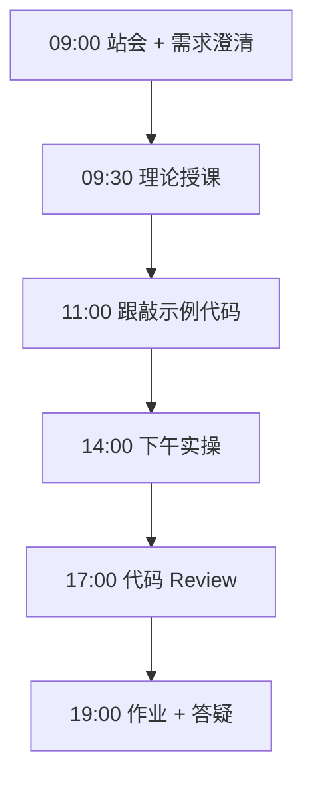
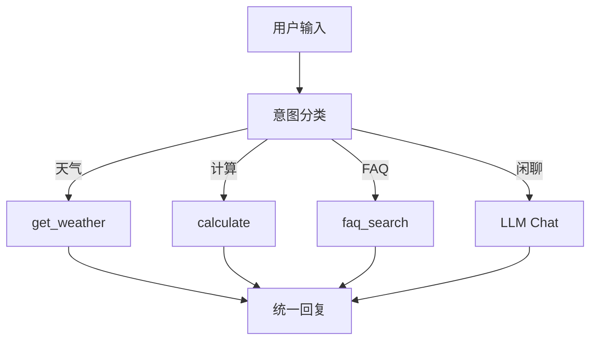

# Day 21：周测综合实战

> **阶段**：Phase 2：大模型基础与Prompt工程 | **Epic**：NEXUS-E2 | **预计学时**：6-8 小时

## 旁白解读：今日上下文

> 🎬 **模拟站会 09:00** — 智链科技 Nexus 项目组

陈工宣布周测：「把这周学的串成一条链路。能跑、能演示、能讲清楚意图怎么走，就算过关。」
今天是 **CLI 版 Nexus 助手 MVP**，也是下周 Web 化的逻辑原型。

**今日在 NexusAgent 主线中的位置**：integrated_chat_tools 逻辑将迁移至 nexus_agent/core/router.py

**今日 Jira 看板**：
- `NEXUS-211`
- `NEXUS-212`

---


## 需求文档（产品林悦下发）

**文档编号**：PRD-NEXUS-D21  
**版本**：v1.0  
**优先级**：P0

### 背景

Phase 2：大模型基础与Prompt工程阶段第 21 天教学任务，与 NexusAgent 主线项目对齐。

### User Stories

### NEXUS-211

**描述**：周测综合实战 相关交付

**验收标准**：
- [ ] 代码可本地运行
- [ ] 通过 `scripts/verify_day.py --day 21`

### NEXUS-212

**描述**：周测综合实战 相关交付

**验收标准**：
- [ ] 代码可本地运行
- [ ] 通过 `scripts/verify_day.py --day 21`


---


## 今日课表

### 上午 09:00-12:00

- 周测说明：整合 Day 15-20 能力
- 架构串讲：意图分类 → 工具/FAQ/闲聊 三分支
- 代码 Review 规范与自测清单

### 下午 14:00-17:30

- 跟敲 integrated_chat_tools.py：REPL 综合助手
- 自测：天气、计算、FAQ、闲聊四条路径
- 结对 Review：互相找 bug

### 晚自习 19:00-21:00

- 周测答辩准备：3 分钟演示自己的助手
- 整理本周笔记与踩坑清单
- 预习：HTML/CSS/JS 基础

---


## 课堂笔记

### 核心知识点速查

| 序号 | 知识点 | 代码位置 |
|------|--------|----------|
| 1 | 能力集成 | 见下午实操 |
| 2 | 意图路由 | 见下午实操 |
| 3 | REPL 交互 | 见下午实操 |
| 4 | 周测验收 | 见下午实操 |
| 5 | 模块组合 | 见下午实操 |

### 今日流程图



### 架构示意图（当日目标）



---


## 实操代码清单

- `code/integrated_chat_tools.py`

请按顺序创建并运行。每段代码均可直接复制到对应文件执行。

---

## 实验手册（分时段操作表）

### 实验步骤 1：09:30-10:30 理论

| 时间 | 动作 | 预期结果 | 失败处理 |
|------|------|----------|----------|
| +0min | 打开课件本节 | 看到需求与验收标准 | 检查是否拉取最新 `develop` 分支 |
| +10min | 创建/打开当日 `code/` 文件 | 文件路径与清单一致 | 对照「实操代码清单」 |
| +30min | 粘贴并运行第一个脚本 | 终端有正常输出无 Traceback | 见下方「排错手册」 |
| +60min | 完成全部文件并自测 | `python3` 运行通过 | 使用 `scripts/verify_day.py --day 21` |
| +90min | 提交 Git 并建 MR | MR 关联 Jira NEXUS-211 | 按附录 Git 示例操作 |


### 实验步骤 2：10:30-12:00 跟敲

| 时间 | 动作 | 预期结果 | 失败处理 |
|------|------|----------|----------|
| +0min | 打开课件本节 | 看到需求与验收标准 | 检查是否拉取最新 `develop` 分支 |
| +10min | 创建/打开当日 `code/` 文件 | 文件路径与清单一致 | 对照「实操代码清单」 |
| +30min | 粘贴并运行第一个脚本 | 终端有正常输出无 Traceback | 见下方「排错手册」 |
| +60min | 完成全部文件并自测 | `python3` 运行通过 | 使用 `scripts/verify_day.py --day 21` |
| +90min | 提交 Git 并建 MR | MR 关联 Jira NEXUS-211 | 按附录 Git 示例操作 |


### 实验步骤 3：14:00-15:30 实操

| 时间 | 动作 | 预期结果 | 失败处理 |
|------|------|----------|----------|
| +0min | 打开课件本节 | 看到需求与验收标准 | 检查是否拉取最新 `develop` 分支 |
| +10min | 创建/打开当日 `code/` 文件 | 文件路径与清单一致 | 对照「实操代码清单」 |
| +30min | 粘贴并运行第一个脚本 | 终端有正常输出无 Traceback | 见下方「排错手册」 |
| +60min | 完成全部文件并自测 | `python3` 运行通过 | 使用 `scripts/verify_day.py --day 21` |
| +90min | 提交 Git 并建 MR | MR 关联 Jira NEXUS-211 | 按附录 Git 示例操作 |


### 实验步骤 4：15:30-17:00 联调

| 时间 | 动作 | 预期结果 | 失败处理 |
|------|------|----------|----------|
| +0min | 打开课件本节 | 看到需求与验收标准 | 检查是否拉取最新 `develop` 分支 |
| +10min | 创建/打开当日 `code/` 文件 | 文件路径与清单一致 | 对照「实操代码清单」 |
| +30min | 粘贴并运行第一个脚本 | 终端有正常输出无 Traceback | 见下方「排错手册」 |
| +60min | 完成全部文件并自测 | `python3` 运行通过 | 使用 `scripts/verify_day.py --day 21` |
| +90min | 提交 Git 并建 MR | MR 关联 Jira NEXUS-211 | 按附录 Git 示例操作 |


### 实验步骤 5：19:00-20:30 作业

| 时间 | 动作 | 预期结果 | 失败处理 |
|------|------|----------|----------|
| +0min | 打开课件本节 | 看到需求与验收标准 | 检查是否拉取最新 `develop` 分支 |
| +10min | 创建/打开当日 `code/` 文件 | 文件路径与清单一致 | 对照「实操代码清单」 |
| +30min | 粘贴并运行第一个脚本 | 终端有正常输出无 Traceback | 见下方「排错手册」 |
| +60min | 完成全部文件并自测 | `python3` 运行通过 | 使用 `scripts/verify_day.py --day 21` |
| +90min | 提交 Git 并建 MR | MR 关联 Jira NEXUS-211 | 按附录 Git 示例操作 |


### 排错手册（Day 21）

1. **`command not found: python3`** → 安装 Python 3.10+ 或使用 `py -3`（Windows）
2. **`ModuleNotFoundError`** → 确认当前目录、是否激活 venv、`pip install -r requirements.txt`（若当日有）
3. **`SyntaxError: invalid syntax`** → 检查上一行是否缺括号、引号是否中文
4. **`UnicodeDecodeError`** → 文件保存为 UTF-8，终端 `export PYTHONIOENCODING=utf-8`
5. **API 相关（Day12+）** → 检查 `.env` 中 Key，无 Key 时使用课件 MOCK 模式

---


## 逐步跟敲指南（完整源码与解析）

> 以下代码与 `code/` 目录完全一致，可直接复制。每段附行级说明。

### 文件：`code/integrated_chat_tools.py`

**操作步骤**：
1. 在 `courseware/day-21/code/` 下创建文件 `integrated_chat_tools.py`
2. 完整粘贴下方代码
3. 在终端执行：`cd courseware/day-21/code && python3 integrated_chat_tools.py`（若为包内模块则按课件说明）

```python
#!/usr/bin/env python3
"""
Day 21 周测综合：集成对话 + 意图分类 + 工具调用 + FAQ 检索
模拟 NexusAgent v0.2 前的核心推理链路（单文件可运行）。
"""
from __future__ import annotations

import json
import math
import os
import re
import urllib.error
import urllib.request
from typing import Any

API_BASE = os.getenv("DEEPSEEK_API_BASE", "https://api.deepseek.com")
API_KEY = os.getenv("DEEPSEEK_API_KEY", "")
MODEL = os.getenv("DEEPSEEK_MODEL", "deepseek-chat")

FAQ = [
    "NexusAgent 是企业级智能体平台",
    "支持 RAG 知识库与多 Agent 编排",
    "第二阶段将交付 Web 聊天界面",
]

INTENTS = ["查天气", "做计算", "查FAQ", "闲聊"]


def tokenize(text: str) -> list[str]:
    return re.findall(r"[\u4e00-\u9fff]|[a-zA-Z0-9]+", text)


def faq_search(query: str) -> str:
    """简易 FAQ 检索。"""
    q_tokens = set(tokenize(query.lower()))
    best, best_score = FAQ[0], 0.0
    for doc in FAQ:
        d_tokens = set(tokenize(doc.lower()))
        inter = len(q_tokens & d_tokens)
        score = inter / max(len(q_tokens | d_tokens), 1)
        if score > best_score:
            best_score, best = score, doc
    return best


def get_weather(city: str) -> str:
    return json.dumps({"city": city, "temp": 26, "condition": "晴"}, ensure_ascii=False)


def calculate(expr: str) -> str:
    try:
        result = eval(expr, {"__builtins__": {}}, {"sqrt": math.sqrt})  # noqa: S307
        return str(result)
    except Exception as exc:  # noqa: BLE001
        return f"计算错误: {exc}"


def classify_intent(text: str) -> str:
    """规则意图分类（周测综合演示）。"""
    if "天气" in text:
        return "查天气"
    if re.search(r"[\d+\-*/]", text) or "计算" in text or "算" in text:
        return "做计算"
    if any(k in text for k in ["Nexus", "平台", "RAG", "Agent", "什么"]):
        return "查FAQ"
    return "闲聊"


def chat_llm(prompt: str) -> str:
    if not API_KEY:
        return f"【MOCK 闲聊回复】收到：{prompt[:50]}"
    payload = {
        "model": MODEL,
        "messages": [{"role": "user", "content": prompt}],
        "temperature": 0.7,
    }
    req = urllib.request.Request(
        f"{API_BASE}/v1/chat/completions",
        data=json.dumps(payload).encode("utf-8"),
        headers={"Content-Type": "application/json", "Authorization": f"Bearer {API_KEY}"},
        method="POST",
    )
    try:
        with urllib.request.urlopen(req, timeout=30) as resp:
            data = json.loads(resp.read().decode("utf-8"))
        return data["choices"][0]["message"]["content"].strip()
    except urllib.error.URLError as exc:
        return f"API 错误: {exc}"


def handle_message(user_input: str) -> str:
    """统一消息处理入口。"""
    intent = classify_intent(user_input)
    print(f"  [意图] {intent}")

    if intent == "查天气":
        city = "北京" if "北京" in user_input else "上海"
        return f"天气信息: {get_weather(city)}"
    if intent == "做计算":
        expr = re.search(r"[\d.+*/()-sqrt]+", user_input.replace(" ", ""))
        if expr:
            return f"结果: {calculate(expr.group())}"
        return "请提供数学表达式"
    if intent == "查FAQ":
        return f"FAQ 命中: {faq_search(user_input)}"
    return chat_llm(user_input)


def repl() -> None:
    """交互式 REPL。"""
    print("=" * 60)
    print("Day 21 — 周测综合助手（输入 quit 退出）")
    print("=" * 60)
    print("试试: 北京天气 / 计算 2**10 / NexusAgent 是什么 / 你好")

    while True:
        try:
            user_input = input("\n你: ").strip()
        except (EOFError, KeyboardInterrupt):
            print("\n再见！")
            break
        if not user_input:
            continue
        if user_input.lower() in {"quit", "exit", "q"}:
            print("再见！")
            break
        reply = handle_message(user_input)
        print(f"助手: {reply}")


if __name__ == "__main__":
    repl()

```

**解析要点（`integrated_chat_tools.py`）**：

- 共 **132** 行，请逐行阅读注释中的中文说明

- 运行前确认 Python 版本 ≥ 3.10：`python3 --version`

- 若报错，先检查缩进是否为 4 空格，勿混用 Tab

- 企业 Review 清单：命名是否清晰、是否有异常处理、是否可复用

---


### 深度讲解 1：能力集成

在企业级 Python 开发与大模型应用工程中，**能力集成** 是学员必须牢固掌握的基本功。智链科技 Nexus 项目组在 Day 21 的代码评审中，特别强调以下几点：

1. **为什么学**：能力集成 直接服务于后续 NexusAgent 平台的 `NEXUS-E2` 模块。没有扎实的 能力集成，Day 28 之后调用 API、解析 JSON、编写 Agent 工具函数时会出现大量低级错误。

2. **常见坑**：
   - 忽略输入类型校验，导致运行时 `TypeError`
   - 编码问题（Windows 默认 GBK vs UTF-8）
   - 复制粘贴时缩进错乱（Python 对缩进敏感）

3. **企业实践**：在 SmartLink 的 GitLab 仓库中，所有与 能力集成 相关的代码必须经过 Ruff 静态检查；变量命名使用 `snake_case`，常量使用 `UPPER_SNAKE_CASE`。

4. **与主线项目的关系**：今日代码位于 `courseware/day-21/code/`，部分模块将逐步合并到 `platform/nexus_agent/`。请养成「每日代码皆可运行、皆可测试」的习惯。

5. **扩展阅读建议**：完成今日作业后，可阅读 `docs/project-master-plan.md` 中关于 NEXUS-E2 的章节，建立全局视角。

**课堂互动题**：请用 3 句话向非技术同事解释「能力集成」是什么。写在作业 MR 的评论里，讲师会抽查点评。

**实操检查清单**：
- [ ] 能不看课件复述 能力集成 的定义
- [ ] 能独立写出相关代码并运行
- [ ] 能向同学讲解一处容易写错的地方


### 深度讲解 2：意图路由

在企业级 Python 开发与大模型应用工程中，**意图路由** 是学员必须牢固掌握的基本功。智链科技 Nexus 项目组在 Day 21 的代码评审中，特别强调以下几点：

1. **为什么学**：意图路由 直接服务于后续 NexusAgent 平台的 `NEXUS-E2` 模块。没有扎实的 意图路由，Day 28 之后调用 API、解析 JSON、编写 Agent 工具函数时会出现大量低级错误。

2. **常见坑**：
   - 忽略输入类型校验，导致运行时 `TypeError`
   - 编码问题（Windows 默认 GBK vs UTF-8）
   - 复制粘贴时缩进错乱（Python 对缩进敏感）

3. **企业实践**：在 SmartLink 的 GitLab 仓库中，所有与 意图路由 相关的代码必须经过 Ruff 静态检查；变量命名使用 `snake_case`，常量使用 `UPPER_SNAKE_CASE`。

4. **与主线项目的关系**：今日代码位于 `courseware/day-21/code/`，部分模块将逐步合并到 `platform/nexus_agent/`。请养成「每日代码皆可运行、皆可测试」的习惯。

5. **扩展阅读建议**：完成今日作业后，可阅读 `docs/project-master-plan.md` 中关于 NEXUS-E2 的章节，建立全局视角。

**课堂互动题**：请用 3 句话向非技术同事解释「意图路由」是什么。写在作业 MR 的评论里，讲师会抽查点评。

**实操检查清单**：
- [ ] 能不看课件复述 意图路由 的定义
- [ ] 能独立写出相关代码并运行
- [ ] 能向同学讲解一处容易写错的地方


### 深度讲解 3：REPL 交互

在企业级 Python 开发与大模型应用工程中，**REPL 交互** 是学员必须牢固掌握的基本功。智链科技 Nexus 项目组在 Day 21 的代码评审中，特别强调以下几点：

1. **为什么学**：REPL 交互 直接服务于后续 NexusAgent 平台的 `NEXUS-E2` 模块。没有扎实的 REPL 交互，Day 28 之后调用 API、解析 JSON、编写 Agent 工具函数时会出现大量低级错误。

2. **常见坑**：
   - 忽略输入类型校验，导致运行时 `TypeError`
   - 编码问题（Windows 默认 GBK vs UTF-8）
   - 复制粘贴时缩进错乱（Python 对缩进敏感）

3. **企业实践**：在 SmartLink 的 GitLab 仓库中，所有与 REPL 交互 相关的代码必须经过 Ruff 静态检查；变量命名使用 `snake_case`，常量使用 `UPPER_SNAKE_CASE`。

4. **与主线项目的关系**：今日代码位于 `courseware/day-21/code/`，部分模块将逐步合并到 `platform/nexus_agent/`。请养成「每日代码皆可运行、皆可测试」的习惯。

5. **扩展阅读建议**：完成今日作业后，可阅读 `docs/project-master-plan.md` 中关于 NEXUS-E2 的章节，建立全局视角。

**课堂互动题**：请用 3 句话向非技术同事解释「REPL 交互」是什么。写在作业 MR 的评论里，讲师会抽查点评。

**实操检查清单**：
- [ ] 能不看课件复述 REPL 交互 的定义
- [ ] 能独立写出相关代码并运行
- [ ] 能向同学讲解一处容易写错的地方


### 深度讲解 4：周测验收

在企业级 Python 开发与大模型应用工程中，**周测验收** 是学员必须牢固掌握的基本功。智链科技 Nexus 项目组在 Day 21 的代码评审中，特别强调以下几点：

1. **为什么学**：周测验收 直接服务于后续 NexusAgent 平台的 `NEXUS-E2` 模块。没有扎实的 周测验收，Day 28 之后调用 API、解析 JSON、编写 Agent 工具函数时会出现大量低级错误。

2. **常见坑**：
   - 忽略输入类型校验，导致运行时 `TypeError`
   - 编码问题（Windows 默认 GBK vs UTF-8）
   - 复制粘贴时缩进错乱（Python 对缩进敏感）

3. **企业实践**：在 SmartLink 的 GitLab 仓库中，所有与 周测验收 相关的代码必须经过 Ruff 静态检查；变量命名使用 `snake_case`，常量使用 `UPPER_SNAKE_CASE`。

4. **与主线项目的关系**：今日代码位于 `courseware/day-21/code/`，部分模块将逐步合并到 `platform/nexus_agent/`。请养成「每日代码皆可运行、皆可测试」的习惯。

5. **扩展阅读建议**：完成今日作业后，可阅读 `docs/project-master-plan.md` 中关于 NEXUS-E2 的章节，建立全局视角。

**课堂互动题**：请用 3 句话向非技术同事解释「周测验收」是什么。写在作业 MR 的评论里，讲师会抽查点评。

**实操检查清单**：
- [ ] 能不看课件复述 周测验收 的定义
- [ ] 能独立写出相关代码并运行
- [ ] 能向同学讲解一处容易写错的地方


### 深度讲解 5：模块组合

在企业级 Python 开发与大模型应用工程中，**模块组合** 是学员必须牢固掌握的基本功。智链科技 Nexus 项目组在 Day 21 的代码评审中，特别强调以下几点：

1. **为什么学**：模块组合 直接服务于后续 NexusAgent 平台的 `NEXUS-E2` 模块。没有扎实的 模块组合，Day 28 之后调用 API、解析 JSON、编写 Agent 工具函数时会出现大量低级错误。

2. **常见坑**：
   - 忽略输入类型校验，导致运行时 `TypeError`
   - 编码问题（Windows 默认 GBK vs UTF-8）
   - 复制粘贴时缩进错乱（Python 对缩进敏感）

3. **企业实践**：在 SmartLink 的 GitLab 仓库中，所有与 模块组合 相关的代码必须经过 Ruff 静态检查；变量命名使用 `snake_case`，常量使用 `UPPER_SNAKE_CASE`。

4. **与主线项目的关系**：今日代码位于 `courseware/day-21/code/`，部分模块将逐步合并到 `platform/nexus_agent/`。请养成「每日代码皆可运行、皆可测试」的习惯。

5. **扩展阅读建议**：完成今日作业后，可阅读 `docs/project-master-plan.md` 中关于 NEXUS-E2 的章节，建立全局视角。

**课堂互动题**：请用 3 句话向非技术同事解释「模块组合」是什么。写在作业 MR 的评论里，讲师会抽查点评。

**实操检查清单**：
- [ ] 能不看课件复述 模块组合 的定义
- [ ] 能独立写出相关代码并运行
- [ ] 能向同学讲解一处容易写错的地方


## 阶段复盘锚点（Phase 2：大模型基础与Prompt工程）

今天是 **Phase 2：大模型基础与Prompt工程** 的第 **1** 个学习日。请回顾：

- 昨天学了什么？今天如何承接？
- 今天的内容在 70 天路线图中的坐标？
- 如果我是 Tech Lead，会如何 Review 今日代码？

**陈工寄语**：慢即是快。企业里没人关心你一天学了多少个语法点，只关心你写的脚本能不能在服务器上稳定跑 7×24 小时。今天把地基打牢，后面 Agent 编排、RAG 检索才不会塌。

**林悦补充**：产品侧只验收「用户能感知到的价值」。今日交付虽然简单，但「个人信息卡片」本质是后续「用户画像 Agent」的数据采集原型——字段设计请认真思考。

**代码量统计（累计）**：完成今日后，个人仓库累计约 **29400** 行（含注释与测试），全营目标 10 万行。

**明日预告**：请提前阅读 `courseware/day-22/README.md` 开头的旁白，了解上下文。


## 常见问题 FAQ（讲师答疑实录）


**Q1：学习「能力集成」时最常问的问题是什么？**

A：学员常问「这在大模型开发里到底用在哪里」。直接回答：在 NexusAgent 的 `NEXUS-E2` 中，能力集成 用于支撑「周测综合实战」这一交付。建议你打开 `platform/` 对照看未来模块如何引用今日写法。另一个常见问题是「要不要背语法」——不需要背，但要能写出可运行代码，并能在报错时读懂 Traceback。

**追问**：如果线上报错与 能力集成 相关，如何排查？  
**答**：① 复现 ② 最小化输入 ③ 打印中间变量 ④ 查 GitLab 历史 diff ⑤ 在 Jira 建 Bug 单附上日志。


**Q2：学习「意图路由」时最常问的问题是什么？**

A：学员常问「这在大模型开发里到底用在哪里」。直接回答：在 NexusAgent 的 `NEXUS-E2` 中，意图路由 用于支撑「周测综合实战」这一交付。建议你打开 `platform/` 对照看未来模块如何引用今日写法。另一个常见问题是「要不要背语法」——不需要背，但要能写出可运行代码，并能在报错时读懂 Traceback。

**追问**：如果线上报错与 意图路由 相关，如何排查？  
**答**：① 复现 ② 最小化输入 ③ 打印中间变量 ④ 查 GitLab 历史 diff ⑤ 在 Jira 建 Bug 单附上日志。


**Q3：学习「REPL 交互」时最常问的问题是什么？**

A：学员常问「这在大模型开发里到底用在哪里」。直接回答：在 NexusAgent 的 `NEXUS-E2` 中，REPL 交互 用于支撑「周测综合实战」这一交付。建议你打开 `platform/` 对照看未来模块如何引用今日写法。另一个常见问题是「要不要背语法」——不需要背，但要能写出可运行代码，并能在报错时读懂 Traceback。

**追问**：如果线上报错与 REPL 交互 相关，如何排查？  
**答**：① 复现 ② 最小化输入 ③ 打印中间变量 ④ 查 GitLab 历史 diff ⑤ 在 Jira 建 Bug 单附上日志。


**Q4：学习「周测验收」时最常问的问题是什么？**

A：学员常问「这在大模型开发里到底用在哪里」。直接回答：在 NexusAgent 的 `NEXUS-E2` 中，周测验收 用于支撑「周测综合实战」这一交付。建议你打开 `platform/` 对照看未来模块如何引用今日写法。另一个常见问题是「要不要背语法」——不需要背，但要能写出可运行代码，并能在报错时读懂 Traceback。

**追问**：如果线上报错与 周测验收 相关，如何排查？  
**答**：① 复现 ② 最小化输入 ③ 打印中间变量 ④ 查 GitLab 历史 diff ⑤ 在 Jira 建 Bug 单附上日志。


**Q5：学习「模块组合」时最常问的问题是什么？**

A：学员常问「这在大模型开发里到底用在哪里」。直接回答：在 NexusAgent 的 `NEXUS-E2` 中，模块组合 用于支撑「周测综合实战」这一交付。建议你打开 `platform/` 对照看未来模块如何引用今日写法。另一个常见问题是「要不要背语法」——不需要背，但要能写出可运行代码，并能在报错时读懂 Traceback。

**追问**：如果线上报错与 模块组合 相关，如何排查？  
**答**：① 复现 ② 最小化输入 ③ 打印中间变量 ④ 查 GitLab 历史 diff ⑤ 在 Jira 建 Bug 单附上日志。


## 面试押题（与今日知识点挂钩）

以下题目会出现在 Day 67-69 模拟面试中，建议今日就开始积累答案：

1. **能力集成**：请结合 NexusAgent 项目举例说明你在哪一天、哪段代码里用到了它？
2. **意图路由**：请结合 NexusAgent 项目举例说明你在哪一天、哪段代码里用到了它？
3. **REPL 交互**：请结合 NexusAgent 项目举例说明你在哪一天、哪段代码里用到了它？
4. **周测验收**：请结合 NexusAgent 项目举例说明你在哪一天、哪段代码里用到了它？
5. **模块组合**：请结合 NexusAgent 项目举例说明你在哪一天、哪段代码里用到了它？

**参考答案思路**：采用 STAR 法则（情境-任务-行动-结果），引用 `courseware/day-21/code/` 中的具体文件名与函数名。

---


## Code Review 检查表（陈工版）

合并 MR 前自查：

- [ ] 所有新增 `.py` 文件顶部有模块说明 docstring
- [ ] 无硬编码密钥（API Key 走环境变量）
- [ ] 函数长度 < 50 行，过长则拆分
- [ ] 异常有明确提示，禁止裸 `except:`
- [ ] 提交信息符合 `feat(day-21): ...`
- [ ] README 或注释说明如何运行
- [ ] 与 Jira Story 验收标准逐条对应

**今日重点审查项**：周测综合实战 相关逻辑是否可读、可测、可扩展至 `platform/nexus_agent/`。

---


## 课后作业

### 作业说明

在周测助手基础上增加对话历史（内存中保存最近 10 轮），闲聊分支将历史一并送入 LLM；并增加 `/help` 指令列出能力清单。

### 提交要求

1. 代码提交到分支 `feature/day-21-homework`
2. GitLab MR 标题：`[Day-21] homework: 课后作业`
3. 在 MR 描述中附上运行截图或终端输出

### 评分标准（满分 100）

| 项 | 分值 |
|----|------|
| 功能完整 | 40 |
| 代码规范与注释 | 30 |
| 异常处理 | 15 |
| MR 与 Jira 关联 | 15 |

---

## 作业参考答案

> ⚠️ 请先独立完成再对照答案

维护 `history: list[dict]`；`chat_llm` 传入完整 messages；`/help` 在 REPL 入口判断。

---


## 附录：Git 提交示例

```bash
git checkout develop
git pull origin develop
git checkout -b feature/day-21-周测综合实战
# 完成代码后
git add courseware/day-21/
git commit -m "feat(day-21): 周测综合实战"
git push -u origin feature/day-21-周测综合实战
```

---

*课件版本 Day-21-v1.0 | 智链科技培训中心*
