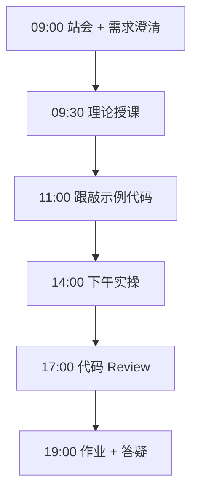
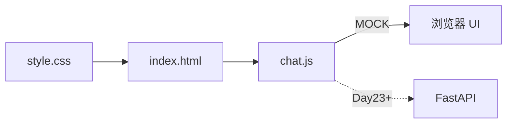

# Day 22：前端速成与静态聊天

> **阶段**：Phase 2：大模型基础与Prompt工程 | **Epic**：NEXUS-E2 | **预计学时**：6-8 小时

## 旁白解读：今日上下文

> 🎬 **模拟站会 09:00** — 智链科技 Nexus 项目组

林悦：「老板要看『像 ChatGPT 的界面』，不要黑框框终端。」
零基础也能在一天内搭出 **能点的聊天页**。今天先 MOCK，明天接真 API。

**今日在 NexusAgent 主线中的位置**：platform/frontend/ 目录结构预演

**今日 Jira 看板**：
- `NEXUS-221`
- `NEXUS-222`

---


## 需求文档（产品林悦下发）

**文档编号**：PRD-NEXUS-D22  
**版本**：v1.0  
**优先级**：P0

### 背景

Phase 2：大模型基础与Prompt工程阶段第 22 天教学任务，与 NexusAgent 主线项目对齐。

### User Stories

### NEXUS-221

**描述**：前端速成与静态聊天 相关交付

**验收标准**：
- [ ] 代码可本地运行
- [ ] 通过 `scripts/verify_day.py --day 22`

### NEXUS-222

**描述**：前端速成与静态聊天 相关交付

**验收标准**：
- [ ] 代码可本地运行
- [ ] 通过 `scripts/verify_day.py --day 22`


---


## 今日课表

### 上午 09:00-12:00

- HTML/CSS/JS 极速回顾：DOM、事件、fetch
- 聊天 UI 设计：消息气泡、滚动、输入框
- 前后端分离概念：静态页 + API

### 下午 14:00-17:30

- 搭建 frontend/index.html + style.css + chat.js
- 实现 MOCK 模式本地聊天演示
- 浏览器调试：Network 面板、Console 错误排查

### 晚自习 19:00-21:00

- 美化 UI：适配手机宽度
- 预习：FastAPI 入门
- 尝试用 Live Server 打开页面

---


## 课堂笔记

### 核心知识点速查

| 序号 | 知识点 | 代码位置 |
|------|--------|----------|
| 1 | HTML 结构 | 见下午实操 |
| 2 | CSS Flex 布局 | 见下午实操 |
| 3 | DOM 操作 | 见下午实操 |
| 4 | fetch API | 见下午实操 |
| 5 | MOCK 前端 | 见下午实操 |

### 今日流程图



### 架构示意图（当日目标）



---


## 实操代码清单

- `code/frontend/index.html`
- `code/frontend/style.css`
- `code/frontend/chat.js`

请按顺序创建并运行。每段代码均可直接复制到对应文件执行。

---

## 实验手册（分时段操作表）

### 实验步骤 1：09:30-10:30 理论

| 时间 | 动作 | 预期结果 | 失败处理 |
|------|------|----------|----------|
| +0min | 打开课件本节 | 看到需求与验收标准 | 检查是否拉取最新 `develop` 分支 |
| +10min | 创建/打开当日 `code/` 文件 | 文件路径与清单一致 | 对照「实操代码清单」 |
| +30min | 粘贴并运行第一个脚本 | 终端有正常输出无 Traceback | 见下方「排错手册」 |
| +60min | 完成全部文件并自测 | `python3` 运行通过 | 使用 `scripts/verify_day.py --day 22` |
| +90min | 提交 Git 并建 MR | MR 关联 Jira NEXUS-221 | 按附录 Git 示例操作 |


### 实验步骤 2：10:30-12:00 跟敲

| 时间 | 动作 | 预期结果 | 失败处理 |
|------|------|----------|----------|
| +0min | 打开课件本节 | 看到需求与验收标准 | 检查是否拉取最新 `develop` 分支 |
| +10min | 创建/打开当日 `code/` 文件 | 文件路径与清单一致 | 对照「实操代码清单」 |
| +30min | 粘贴并运行第一个脚本 | 终端有正常输出无 Traceback | 见下方「排错手册」 |
| +60min | 完成全部文件并自测 | `python3` 运行通过 | 使用 `scripts/verify_day.py --day 22` |
| +90min | 提交 Git 并建 MR | MR 关联 Jira NEXUS-221 | 按附录 Git 示例操作 |


### 实验步骤 3：14:00-15:30 实操

| 时间 | 动作 | 预期结果 | 失败处理 |
|------|------|----------|----------|
| +0min | 打开课件本节 | 看到需求与验收标准 | 检查是否拉取最新 `develop` 分支 |
| +10min | 创建/打开当日 `code/` 文件 | 文件路径与清单一致 | 对照「实操代码清单」 |
| +30min | 粘贴并运行第一个脚本 | 终端有正常输出无 Traceback | 见下方「排错手册」 |
| +60min | 完成全部文件并自测 | `python3` 运行通过 | 使用 `scripts/verify_day.py --day 22` |
| +90min | 提交 Git 并建 MR | MR 关联 Jira NEXUS-221 | 按附录 Git 示例操作 |


### 实验步骤 4：15:30-17:00 联调

| 时间 | 动作 | 预期结果 | 失败处理 |
|------|------|----------|----------|
| +0min | 打开课件本节 | 看到需求与验收标准 | 检查是否拉取最新 `develop` 分支 |
| +10min | 创建/打开当日 `code/` 文件 | 文件路径与清单一致 | 对照「实操代码清单」 |
| +30min | 粘贴并运行第一个脚本 | 终端有正常输出无 Traceback | 见下方「排错手册」 |
| +60min | 完成全部文件并自测 | `python3` 运行通过 | 使用 `scripts/verify_day.py --day 22` |
| +90min | 提交 Git 并建 MR | MR 关联 Jira NEXUS-221 | 按附录 Git 示例操作 |


### 实验步骤 5：19:00-20:30 作业

| 时间 | 动作 | 预期结果 | 失败处理 |
|------|------|----------|----------|
| +0min | 打开课件本节 | 看到需求与验收标准 | 检查是否拉取最新 `develop` 分支 |
| +10min | 创建/打开当日 `code/` 文件 | 文件路径与清单一致 | 对照「实操代码清单」 |
| +30min | 粘贴并运行第一个脚本 | 终端有正常输出无 Traceback | 见下方「排错手册」 |
| +60min | 完成全部文件并自测 | `python3` 运行通过 | 使用 `scripts/verify_day.py --day 22` |
| +90min | 提交 Git 并建 MR | MR 关联 Jira NEXUS-221 | 按附录 Git 示例操作 |


### 排错手册（Day 22）

1. **`command not found: python3`** → 安装 Python 3.10+ 或使用 `py -3`（Windows）
2. **`ModuleNotFoundError`** → 确认当前目录、是否激活 venv、`pip install -r requirements.txt`（若当日有）
3. **`SyntaxError: invalid syntax`** → 检查上一行是否缺括号、引号是否中文
4. **`UnicodeDecodeError`** → 文件保存为 UTF-8，终端 `export PYTHONIOENCODING=utf-8`
5. **API 相关（Day12+）** → 检查 `.env` 中 Key，无 Key 时使用课件 MOCK 模式

---


## 逐步跟敲指南（完整源码与解析）

> 以下代码与 `code/` 目录完全一致，可直接复制。每段附行级说明。

### 文件：`code/frontend/index.html`

**操作步骤**：
1. 在 `courseware/day-22/code/` 下创建文件 `frontend/index.html`
2. 完整粘贴下方代码
3. 在终端执行：`cd courseware/day-22/code && python3 index.html.py`（若为包内模块则按课件说明）

```python
<!DOCTYPE html>
<html lang="zh-CN">
<head>
  <meta charset="UTF-8" />
  <meta name="viewport" content="width=device-width, initial-scale=1.0" />
  <title>NexusAgent 聊天 — Day 22</title>
  <link rel="stylesheet" href="style.css" />
</head>
<body>
  <div class="app">
    <header class="header">
      <h1>🤖 NexusAgent</h1>
      <p class="subtitle">智链科技 · Day 22 静态聊天原型</p>
    </header>
    <main id="chat-window" class="chat-window" aria-live="polite">
      <div class="message bot">
        <div class="bubble">你好！我是 Nexus 助手，有什么可以帮你？</div>
      </div>
    </main>
    <footer class="input-area">
      <input id="user-input" type="text" placeholder="输入消息，按 Enter 发送..." autocomplete="off" />
      <button id="send-btn" type="button">发送</button>
    </footer>
  </div>
  <script src="chat.js"></script>
</body>
</html>

```

**解析要点（`frontend/index.html`）**：

- 共 **27** 行，请逐行阅读注释中的中文说明

- 运行前确认 Python 版本 ≥ 3.10：`python3 --version`

- 若报错，先检查缩进是否为 4 空格，勿混用 Tab

- 企业 Review 清单：命名是否清晰、是否有异常处理、是否可复用

---

### 文件：`code/frontend/style.css`

**操作步骤**：
1. 在 `courseware/day-22/code/` 下创建文件 `frontend/style.css`
2. 完整粘贴下方代码
3. 在终端执行：`cd courseware/day-22/code && python3 style.css.py`（若为包内模块则按课件说明）

```python
/* Day 22 — NexusAgent 聊天界面样式 */
* { box-sizing: border-box; margin: 0; padding: 0; }
body {
  font-family: "Segoe UI", "PingFang SC", "Microsoft YaHei", sans-serif;
  background: linear-gradient(135deg, #0f172a 0%, #1e293b 100%);
  min-height: 100vh; color: #e2e8f0;
}
.app { max-width: 720px; margin: 0 auto; height: 100vh; display: flex; flex-direction: column; padding: 16px; }
.header { text-align: center; padding: 12px 0 20px; }
.header h1 { font-size: 1.5rem; }
.subtitle { font-size: 0.85rem; color: #94a3b8; margin-top: 4px; }
.chat-window {
  flex: 1; overflow-y: auto; padding: 12px;
  background: rgba(15, 23, 42, 0.6); border-radius: 12px; border: 1px solid #334155;
}
.message { display: flex; margin-bottom: 12px; }
.message.user { justify-content: flex-end; }
.message.bot { justify-content: flex-start; }
.bubble {
  max-width: 80%; padding: 10px 14px; border-radius: 16px;
  line-height: 1.5; font-size: 0.95rem; white-space: pre-wrap; word-break: break-word;
}
.user .bubble { background: #3b82f6; color: #fff; border-bottom-right-radius: 4px; }
.bot .bubble { background: #334155; color: #f1f5f9; border-bottom-left-radius: 4px; }
.input-area { display: flex; gap: 8px; margin-top: 12px; }
#user-input {
  flex: 1; padding: 12px 16px; border-radius: 24px; border: 1px solid #475569;
  background: #1e293b; color: #f8fafc; font-size: 1rem; outline: none;
}
#user-input:focus { border-color: #3b82f6; }
#send-btn {
  padding: 12px 24px; border: none; border-radius: 24px;
  background: #3b82f6; color: #fff; font-size: 1rem; cursor: pointer;
}
#send-btn:hover { background: #2563eb; }
#send-btn:disabled { opacity: 0.5; cursor: not-allowed; }
.typing::after { content: "▋"; animation: blink 0.8s infinite; }
@keyframes blink { 50% { opacity: 0; } }

```

**解析要点（`frontend/style.css`）**：

- 共 **38** 行，请逐行阅读注释中的中文说明

- 运行前确认 Python 版本 ≥ 3.10：`python3 --version`

- 若报错，先检查缩进是否为 4 空格，勿混用 Tab

- 企业 Review 清单：命名是否清晰、是否有异常处理、是否可复用

---

### 文件：`code/frontend/chat.js`

**操作步骤**：
1. 在 `courseware/day-22/code/` 下创建文件 `frontend/chat.js`
2. 完整粘贴下方代码
3. 在终端执行：`cd courseware/day-22/code && python3 chat.js.py`（若为包内模块则按课件说明）

```python
/**
 * Day 22 — 静态聊天前端（MOCK 模式）
 * Day 23+ 将把 API_BASE 指向 FastAPI 后端。
 */
const API_BASE = window.NEXUS_API_BASE || "";

const chatWindow = document.getElementById("chat-window");
const userInput = document.getElementById("user-input");
const sendBtn = document.getElementById("send-btn");

function appendMessage(role, text) {
  const div = document.createElement("div");
  div.className = `message ${role}`;
  const bubble = document.createElement("div");
  bubble.className = "bubble";
  bubble.textContent = text;
  div.appendChild(bubble);
  chatWindow.appendChild(div);
  chatWindow.scrollTop = chatWindow.scrollHeight;
  return bubble;
}

function mockReply(text) {
  if (text.includes("天气")) return "【MOCK】北京晴，26°C。";
  if (/[\d+\-*/]/.test(text)) return "【MOCK】计算功能将在后端接入。";
  if (text.includes("Nexus") || text.includes("平台"))
    return "【MOCK】NexusAgent 是智链科技的企业级智能体协作平台。";
  return `【MOCK】收到：「${text}」。Day 23 将对接真实 API。`;
}

async function fetchReply(text) {
  if (!API_BASE) return mockReply(text);
  const resp = await fetch(`${API_BASE}/api/chat`, {
    method: "POST",
    headers: { "Content-Type": "application/json" },
    body: JSON.stringify({ message: text }),
  });
  if (!resp.ok) throw new Error(`HTTP ${resp.status}`);
  const data = await resp.json();
  return data.reply || data.content || "（空回复）";
}

async function sendMessage() {
  const text = userInput.value.trim();
  if (!text) return;
  userInput.value = "";
  sendBtn.disabled = true;
  appendMessage("user", text);
  const botBubble = appendMessage("bot", "");
  botBubble.classList.add("typing");
  try {
    const reply = await fetchReply(text);
    botBubble.classList.remove("typing");
    botBubble.textContent = reply;
  } catch (err) {
    botBubble.classList.remove("typing");
    botBubble.textContent = `请求失败: ${err.message}`;
  } finally {
    sendBtn.disabled = false;
    userInput.focus();
  }
}

sendBtn.addEventListener("click", sendMessage);
userInput.addEventListener("keydown", (e) => {
  if (e.key === "Enter" && !e.shiftKey) { e.preventDefault(); sendMessage(); }
});
userInput.focus();

```

**解析要点（`frontend/chat.js`）**：

- 共 **68** 行，请逐行阅读注释中的中文说明

- 运行前确认 Python 版本 ≥ 3.10：`python3 --version`

- 若报错，先检查缩进是否为 4 空格，勿混用 Tab

- 企业 Review 清单：命名是否清晰、是否有异常处理、是否可复用

---


### 深度讲解 1：HTML 结构

在企业级 Python 开发与大模型应用工程中，**HTML 结构** 是学员必须牢固掌握的基本功。智链科技 Nexus 项目组在 Day 22 的代码评审中，特别强调以下几点：

1. **为什么学**：HTML 结构 直接服务于后续 NexusAgent 平台的 `NEXUS-E2` 模块。没有扎实的 HTML 结构，Day 29 之后调用 API、解析 JSON、编写 Agent 工具函数时会出现大量低级错误。

2. **常见坑**：
   - 忽略输入类型校验，导致运行时 `TypeError`
   - 编码问题（Windows 默认 GBK vs UTF-8）
   - 复制粘贴时缩进错乱（Python 对缩进敏感）

3. **企业实践**：在 SmartLink 的 GitLab 仓库中，所有与 HTML 结构 相关的代码必须经过 Ruff 静态检查；变量命名使用 `snake_case`，常量使用 `UPPER_SNAKE_CASE`。

4. **与主线项目的关系**：今日代码位于 `courseware/day-22/code/`，部分模块将逐步合并到 `platform/nexus_agent/`。请养成「每日代码皆可运行、皆可测试」的习惯。

5. **扩展阅读建议**：完成今日作业后，可阅读 `docs/project-master-plan.md` 中关于 NEXUS-E2 的章节，建立全局视角。

**课堂互动题**：请用 3 句话向非技术同事解释「HTML 结构」是什么。写在作业 MR 的评论里，讲师会抽查点评。

**实操检查清单**：
- [ ] 能不看课件复述 HTML 结构 的定义
- [ ] 能独立写出相关代码并运行
- [ ] 能向同学讲解一处容易写错的地方


### 深度讲解 2：CSS Flex 布局

在企业级 Python 开发与大模型应用工程中，**CSS Flex 布局** 是学员必须牢固掌握的基本功。智链科技 Nexus 项目组在 Day 22 的代码评审中，特别强调以下几点：

1. **为什么学**：CSS Flex 布局 直接服务于后续 NexusAgent 平台的 `NEXUS-E2` 模块。没有扎实的 CSS Flex 布局，Day 29 之后调用 API、解析 JSON、编写 Agent 工具函数时会出现大量低级错误。

2. **常见坑**：
   - 忽略输入类型校验，导致运行时 `TypeError`
   - 编码问题（Windows 默认 GBK vs UTF-8）
   - 复制粘贴时缩进错乱（Python 对缩进敏感）

3. **企业实践**：在 SmartLink 的 GitLab 仓库中，所有与 CSS Flex 布局 相关的代码必须经过 Ruff 静态检查；变量命名使用 `snake_case`，常量使用 `UPPER_SNAKE_CASE`。

4. **与主线项目的关系**：今日代码位于 `courseware/day-22/code/`，部分模块将逐步合并到 `platform/nexus_agent/`。请养成「每日代码皆可运行、皆可测试」的习惯。

5. **扩展阅读建议**：完成今日作业后，可阅读 `docs/project-master-plan.md` 中关于 NEXUS-E2 的章节，建立全局视角。

**课堂互动题**：请用 3 句话向非技术同事解释「CSS Flex 布局」是什么。写在作业 MR 的评论里，讲师会抽查点评。

**实操检查清单**：
- [ ] 能不看课件复述 CSS Flex 布局 的定义
- [ ] 能独立写出相关代码并运行
- [ ] 能向同学讲解一处容易写错的地方


### 深度讲解 3：DOM 操作

在企业级 Python 开发与大模型应用工程中，**DOM 操作** 是学员必须牢固掌握的基本功。智链科技 Nexus 项目组在 Day 22 的代码评审中，特别强调以下几点：

1. **为什么学**：DOM 操作 直接服务于后续 NexusAgent 平台的 `NEXUS-E2` 模块。没有扎实的 DOM 操作，Day 29 之后调用 API、解析 JSON、编写 Agent 工具函数时会出现大量低级错误。

2. **常见坑**：
   - 忽略输入类型校验，导致运行时 `TypeError`
   - 编码问题（Windows 默认 GBK vs UTF-8）
   - 复制粘贴时缩进错乱（Python 对缩进敏感）

3. **企业实践**：在 SmartLink 的 GitLab 仓库中，所有与 DOM 操作 相关的代码必须经过 Ruff 静态检查；变量命名使用 `snake_case`，常量使用 `UPPER_SNAKE_CASE`。

4. **与主线项目的关系**：今日代码位于 `courseware/day-22/code/`，部分模块将逐步合并到 `platform/nexus_agent/`。请养成「每日代码皆可运行、皆可测试」的习惯。

5. **扩展阅读建议**：完成今日作业后，可阅读 `docs/project-master-plan.md` 中关于 NEXUS-E2 的章节，建立全局视角。

**课堂互动题**：请用 3 句话向非技术同事解释「DOM 操作」是什么。写在作业 MR 的评论里，讲师会抽查点评。

**实操检查清单**：
- [ ] 能不看课件复述 DOM 操作 的定义
- [ ] 能独立写出相关代码并运行
- [ ] 能向同学讲解一处容易写错的地方


### 深度讲解 4：fetch API

在企业级 Python 开发与大模型应用工程中，**fetch API** 是学员必须牢固掌握的基本功。智链科技 Nexus 项目组在 Day 22 的代码评审中，特别强调以下几点：

1. **为什么学**：fetch API 直接服务于后续 NexusAgent 平台的 `NEXUS-E2` 模块。没有扎实的 fetch API，Day 29 之后调用 API、解析 JSON、编写 Agent 工具函数时会出现大量低级错误。

2. **常见坑**：
   - 忽略输入类型校验，导致运行时 `TypeError`
   - 编码问题（Windows 默认 GBK vs UTF-8）
   - 复制粘贴时缩进错乱（Python 对缩进敏感）

3. **企业实践**：在 SmartLink 的 GitLab 仓库中，所有与 fetch API 相关的代码必须经过 Ruff 静态检查；变量命名使用 `snake_case`，常量使用 `UPPER_SNAKE_CASE`。

4. **与主线项目的关系**：今日代码位于 `courseware/day-22/code/`，部分模块将逐步合并到 `platform/nexus_agent/`。请养成「每日代码皆可运行、皆可测试」的习惯。

5. **扩展阅读建议**：完成今日作业后，可阅读 `docs/project-master-plan.md` 中关于 NEXUS-E2 的章节，建立全局视角。

**课堂互动题**：请用 3 句话向非技术同事解释「fetch API」是什么。写在作业 MR 的评论里，讲师会抽查点评。

**实操检查清单**：
- [ ] 能不看课件复述 fetch API 的定义
- [ ] 能独立写出相关代码并运行
- [ ] 能向同学讲解一处容易写错的地方


### 深度讲解 5：MOCK 前端

在企业级 Python 开发与大模型应用工程中，**MOCK 前端** 是学员必须牢固掌握的基本功。智链科技 Nexus 项目组在 Day 22 的代码评审中，特别强调以下几点：

1. **为什么学**：MOCK 前端 直接服务于后续 NexusAgent 平台的 `NEXUS-E2` 模块。没有扎实的 MOCK 前端，Day 29 之后调用 API、解析 JSON、编写 Agent 工具函数时会出现大量低级错误。

2. **常见坑**：
   - 忽略输入类型校验，导致运行时 `TypeError`
   - 编码问题（Windows 默认 GBK vs UTF-8）
   - 复制粘贴时缩进错乱（Python 对缩进敏感）

3. **企业实践**：在 SmartLink 的 GitLab 仓库中，所有与 MOCK 前端 相关的代码必须经过 Ruff 静态检查；变量命名使用 `snake_case`，常量使用 `UPPER_SNAKE_CASE`。

4. **与主线项目的关系**：今日代码位于 `courseware/day-22/code/`，部分模块将逐步合并到 `platform/nexus_agent/`。请养成「每日代码皆可运行、皆可测试」的习惯。

5. **扩展阅读建议**：完成今日作业后，可阅读 `docs/project-master-plan.md` 中关于 NEXUS-E2 的章节，建立全局视角。

**课堂互动题**：请用 3 句话向非技术同事解释「MOCK 前端」是什么。写在作业 MR 的评论里，讲师会抽查点评。

**实操检查清单**：
- [ ] 能不看课件复述 MOCK 前端 的定义
- [ ] 能独立写出相关代码并运行
- [ ] 能向同学讲解一处容易写错的地方


## 阶段复盘锚点（Phase 2：大模型基础与Prompt工程）

今天是 **Phase 2：大模型基础与Prompt工程** 的第 **2** 个学习日。请回顾：

- 昨天学了什么？今天如何承接？
- 今天的内容在 70 天路线图中的坐标？
- 如果我是 Tech Lead，会如何 Review 今日代码？

**陈工寄语**：慢即是快。企业里没人关心你一天学了多少个语法点，只关心你写的脚本能不能在服务器上稳定跑 7×24 小时。今天把地基打牢，后面 Agent 编排、RAG 检索才不会塌。

**林悦补充**：产品侧只验收「用户能感知到的价值」。今日交付虽然简单，但「个人信息卡片」本质是后续「用户画像 Agent」的数据采集原型——字段设计请认真思考。

**代码量统计（累计）**：完成今日后，个人仓库累计约 **30800** 行（含注释与测试），全营目标 10 万行。

**明日预告**：请提前阅读 `courseware/day-23/README.md` 开头的旁白，了解上下文。


## 常见问题 FAQ（讲师答疑实录）


**Q1：学习「HTML 结构」时最常问的问题是什么？**

A：学员常问「这在大模型开发里到底用在哪里」。直接回答：在 NexusAgent 的 `NEXUS-E2` 中，HTML 结构 用于支撑「前端速成与静态聊天」这一交付。建议你打开 `platform/` 对照看未来模块如何引用今日写法。另一个常见问题是「要不要背语法」——不需要背，但要能写出可运行代码，并能在报错时读懂 Traceback。

**追问**：如果线上报错与 HTML 结构 相关，如何排查？  
**答**：① 复现 ② 最小化输入 ③ 打印中间变量 ④ 查 GitLab 历史 diff ⑤ 在 Jira 建 Bug 单附上日志。


**Q2：学习「CSS Flex 布局」时最常问的问题是什么？**

A：学员常问「这在大模型开发里到底用在哪里」。直接回答：在 NexusAgent 的 `NEXUS-E2` 中，CSS Flex 布局 用于支撑「前端速成与静态聊天」这一交付。建议你打开 `platform/` 对照看未来模块如何引用今日写法。另一个常见问题是「要不要背语法」——不需要背，但要能写出可运行代码，并能在报错时读懂 Traceback。

**追问**：如果线上报错与 CSS Flex 布局 相关，如何排查？  
**答**：① 复现 ② 最小化输入 ③ 打印中间变量 ④ 查 GitLab 历史 diff ⑤ 在 Jira 建 Bug 单附上日志。


**Q3：学习「DOM 操作」时最常问的问题是什么？**

A：学员常问「这在大模型开发里到底用在哪里」。直接回答：在 NexusAgent 的 `NEXUS-E2` 中，DOM 操作 用于支撑「前端速成与静态聊天」这一交付。建议你打开 `platform/` 对照看未来模块如何引用今日写法。另一个常见问题是「要不要背语法」——不需要背，但要能写出可运行代码，并能在报错时读懂 Traceback。

**追问**：如果线上报错与 DOM 操作 相关，如何排查？  
**答**：① 复现 ② 最小化输入 ③ 打印中间变量 ④ 查 GitLab 历史 diff ⑤ 在 Jira 建 Bug 单附上日志。


**Q4：学习「fetch API」时最常问的问题是什么？**

A：学员常问「这在大模型开发里到底用在哪里」。直接回答：在 NexusAgent 的 `NEXUS-E2` 中，fetch API 用于支撑「前端速成与静态聊天」这一交付。建议你打开 `platform/` 对照看未来模块如何引用今日写法。另一个常见问题是「要不要背语法」——不需要背，但要能写出可运行代码，并能在报错时读懂 Traceback。

**追问**：如果线上报错与 fetch API 相关，如何排查？  
**答**：① 复现 ② 最小化输入 ③ 打印中间变量 ④ 查 GitLab 历史 diff ⑤ 在 Jira 建 Bug 单附上日志。


**Q5：学习「MOCK 前端」时最常问的问题是什么？**

A：学员常问「这在大模型开发里到底用在哪里」。直接回答：在 NexusAgent 的 `NEXUS-E2` 中，MOCK 前端 用于支撑「前端速成与静态聊天」这一交付。建议你打开 `platform/` 对照看未来模块如何引用今日写法。另一个常见问题是「要不要背语法」——不需要背，但要能写出可运行代码，并能在报错时读懂 Traceback。

**追问**：如果线上报错与 MOCK 前端 相关，如何排查？  
**答**：① 复现 ② 最小化输入 ③ 打印中间变量 ④ 查 GitLab 历史 diff ⑤ 在 Jira 建 Bug 单附上日志。


## 面试押题（与今日知识点挂钩）

以下题目会出现在 Day 67-69 模拟面试中，建议今日就开始积累答案：

1. **HTML 结构**：请结合 NexusAgent 项目举例说明你在哪一天、哪段代码里用到了它？
2. **CSS Flex 布局**：请结合 NexusAgent 项目举例说明你在哪一天、哪段代码里用到了它？
3. **DOM 操作**：请结合 NexusAgent 项目举例说明你在哪一天、哪段代码里用到了它？
4. **fetch API**：请结合 NexusAgent 项目举例说明你在哪一天、哪段代码里用到了它？
5. **MOCK 前端**：请结合 NexusAgent 项目举例说明你在哪一天、哪段代码里用到了它？

**参考答案思路**：采用 STAR 法则（情境-任务-行动-结果），引用 `courseware/day-22/code/` 中的具体文件名与函数名。

---


## Code Review 检查表（陈工版）

合并 MR 前自查：

- [ ] 所有新增 `.py` 文件顶部有模块说明 docstring
- [ ] 无硬编码密钥（API Key 走环境变量）
- [ ] 函数长度 < 50 行，过长则拆分
- [ ] 异常有明确提示，禁止裸 `except:`
- [ ] 提交信息符合 `feat(day-22): ...`
- [ ] README 或注释说明如何运行
- [ ] 与 Jira Story 验收标准逐条对应

**今日重点审查项**：前端速成与静态聊天 相关逻辑是否可读、可测、可扩展至 `platform/nexus_agent/`。

---


## 课后作业

### 作业说明

为聊天界面增加 Markdown 简单渲染（粗体/代码块）和「清空对话」按钮；消息列表支持 Enter 发送、Shift+Enter 换行。

### 提交要求

1. 代码提交到分支 `feature/day-22-homework`
2. GitLab MR 标题：`[Day-22] homework: 课后作业`
3. 在 MR 描述中附上运行截图或终端输出

### 评分标准（满分 100）

| 项 | 分值 |
|----|------|
| 功能完整 | 40 |
| 代码规范与注释 | 30 |
| 异常处理 | 15 |
| MR 与 Jira 关联 | 15 |

---

## 作业参考答案

> ⚠️ 请先独立完成再对照答案

`text.replace(/\*\*(.+?)\*\*/g, '<strong>$1</strong>')` 简易渲染；清空即 `chatWindow.innerHTML = ''` 并恢复欢迎语。

---


## 附录：Git 提交示例

```bash
git checkout develop
git pull origin develop
git checkout -b feature/day-22-前端速成与静态聊天
# 完成代码后
git add courseware/day-22/
git commit -m "feat(day-22): 前端速成与静态聊天"
git push -u origin feature/day-22-前端速成与静态聊天
```

---

*课件版本 Day-22-v1.0 | 智链科技培训中心*
