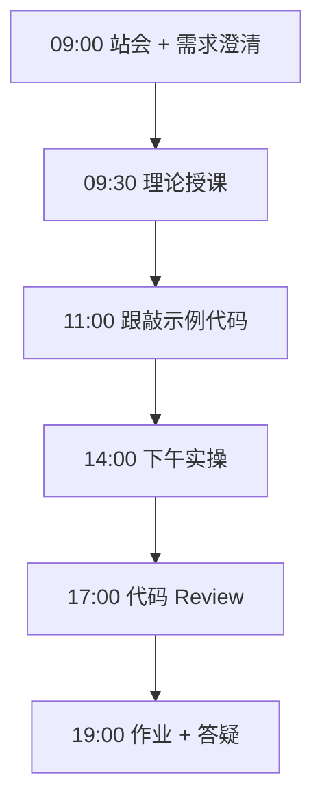

# Day 23：FastAPI后端（上）

> **阶段**：Phase 2：大模型基础与Prompt工程 | **Epic**：NEXUS-E2 | **预计学时**：6-8 小时

## 旁白解读：今日上下文

> 🎬 **模拟站会 09:00** — 智链科技 Nexus 项目组

陈工：「Python 后端首选 FastAPI——类型提示、自动文档、异步支持，企业里很常见。」
今天把 Day 21 的聊天逻辑搬上 HTTP，**前后端第一次握手**。

**今日在 NexusAgent 主线中的位置**：platform/nexus_agent/api/ 将基于今日结构扩展

**今日 Jira 看板**：
- `NEXUS-231`
- `NEXUS-232`

---


## 需求文档（产品林悦下发）

**文档编号**：PRD-NEXUS-D23  
**版本**：v1.0  
**优先级**：P0

### 背景

Phase 2：大模型基础与Prompt工程阶段第 23 天教学任务，与 NexusAgent 主线项目对齐。

### User Stories

### NEXUS-231

**描述**：FastAPI后端（上） 相关交付

**验收标准**：
- [ ] 代码可本地运行
- [ ] 通过 `scripts/verify_day.py --day 23`

### NEXUS-232

**描述**：FastAPI后端（上） 相关交付

**验收标准**：
- [ ] 代码可本地运行
- [ ] 通过 `scripts/verify_day.py --day 23`


---


## 今日课表

### 上午 09:00-12:00

- FastAPI 极速入门：路由、Pydantic、自动文档
- CORS 跨域配置原因与写法
- uvicorn 启动与热重载

### 下午 14:00-17:30

- 跟敲 api/chat_api.py：POST /api/chat
- 对接 Day 22 前端：设置 window.NEXUS_API_BASE
- Swagger UI 测试接口：/docs

### 晚自习 19:00-21:00

- 增加 GET /health 监控端点
- 阅读 FastAPI 依赖注入章节
- 预习：SQLite 与 SSE

---


## 课堂笔记

### 核心知识点速查

| 序号 | 知识点 | 代码位置 |
|------|--------|----------|
| 1 | FastAPI 路由 | 见下午实操 |
| 2 | Pydantic 模型 | 见下午实操 |
| 3 | CORS | 见下午实操 |
| 4 | uvicorn | 见下午实操 |
| 5 | OpenAPI 文档 | 见下午实操 |

### 今日流程图



### 架构示意图（当日目标）

```mermaid
flowchart LR
    FE[Day22 前端] -->|POST /api/chat| FA[FastAPI]
    FA --> LLM[DeepSeek API]
    FA --> SW[Swagger /docs]
    FA --> HL[/health]
```

---


## 实操代码清单

- `code/api/chat_api.py`
- `code/api/__init__.py`

请按顺序创建并运行。每段代码均可直接复制到对应文件执行。

---

## 实验手册（分时段操作表）

### 实验步骤 1：09:30-10:30 理论

| 时间 | 动作 | 预期结果 | 失败处理 |
|------|------|----------|----------|
| +0min | 打开课件本节 | 看到需求与验收标准 | 检查是否拉取最新 `develop` 分支 |
| +10min | 创建/打开当日 `code/` 文件 | 文件路径与清单一致 | 对照「实操代码清单」 |
| +30min | 粘贴并运行第一个脚本 | 终端有正常输出无 Traceback | 见下方「排错手册」 |
| +60min | 完成全部文件并自测 | `python3` 运行通过 | 使用 `scripts/verify_day.py --day 23` |
| +90min | 提交 Git 并建 MR | MR 关联 Jira NEXUS-231 | 按附录 Git 示例操作 |


### 实验步骤 2：10:30-12:00 跟敲

| 时间 | 动作 | 预期结果 | 失败处理 |
|------|------|----------|----------|
| +0min | 打开课件本节 | 看到需求与验收标准 | 检查是否拉取最新 `develop` 分支 |
| +10min | 创建/打开当日 `code/` 文件 | 文件路径与清单一致 | 对照「实操代码清单」 |
| +30min | 粘贴并运行第一个脚本 | 终端有正常输出无 Traceback | 见下方「排错手册」 |
| +60min | 完成全部文件并自测 | `python3` 运行通过 | 使用 `scripts/verify_day.py --day 23` |
| +90min | 提交 Git 并建 MR | MR 关联 Jira NEXUS-231 | 按附录 Git 示例操作 |


### 实验步骤 3：14:00-15:30 实操

| 时间 | 动作 | 预期结果 | 失败处理 |
|------|------|----------|----------|
| +0min | 打开课件本节 | 看到需求与验收标准 | 检查是否拉取最新 `develop` 分支 |
| +10min | 创建/打开当日 `code/` 文件 | 文件路径与清单一致 | 对照「实操代码清单」 |
| +30min | 粘贴并运行第一个脚本 | 终端有正常输出无 Traceback | 见下方「排错手册」 |
| +60min | 完成全部文件并自测 | `python3` 运行通过 | 使用 `scripts/verify_day.py --day 23` |
| +90min | 提交 Git 并建 MR | MR 关联 Jira NEXUS-231 | 按附录 Git 示例操作 |


### 实验步骤 4：15:30-17:00 联调

| 时间 | 动作 | 预期结果 | 失败处理 |
|------|------|----------|----------|
| +0min | 打开课件本节 | 看到需求与验收标准 | 检查是否拉取最新 `develop` 分支 |
| +10min | 创建/打开当日 `code/` 文件 | 文件路径与清单一致 | 对照「实操代码清单」 |
| +30min | 粘贴并运行第一个脚本 | 终端有正常输出无 Traceback | 见下方「排错手册」 |
| +60min | 完成全部文件并自测 | `python3` 运行通过 | 使用 `scripts/verify_day.py --day 23` |
| +90min | 提交 Git 并建 MR | MR 关联 Jira NEXUS-231 | 按附录 Git 示例操作 |


### 实验步骤 5：19:00-20:30 作业

| 时间 | 动作 | 预期结果 | 失败处理 |
|------|------|----------|----------|
| +0min | 打开课件本节 | 看到需求与验收标准 | 检查是否拉取最新 `develop` 分支 |
| +10min | 创建/打开当日 `code/` 文件 | 文件路径与清单一致 | 对照「实操代码清单」 |
| +30min | 粘贴并运行第一个脚本 | 终端有正常输出无 Traceback | 见下方「排错手册」 |
| +60min | 完成全部文件并自测 | `python3` 运行通过 | 使用 `scripts/verify_day.py --day 23` |
| +90min | 提交 Git 并建 MR | MR 关联 Jira NEXUS-231 | 按附录 Git 示例操作 |


### 排错手册（Day 23）

1. **`command not found: python3`** → 安装 Python 3.10+ 或使用 `py -3`（Windows）
2. **`ModuleNotFoundError`** → 确认当前目录、是否激活 venv、`pip install -r requirements.txt`（若当日有）
3. **`SyntaxError: invalid syntax`** → 检查上一行是否缺括号、引号是否中文
4. **`UnicodeDecodeError`** → 文件保存为 UTF-8，终端 `export PYTHONIOENCODING=utf-8`
5. **API 相关（Day12+）** → 检查 `.env` 中 Key，无 Key 时使用课件 MOCK 模式

---


## 逐步跟敲指南（完整源码与解析）

> 以下代码与 `code/` 目录完全一致，可直接复制。每段附行级说明。

### 文件：`code/api/chat_api.py`

**操作步骤**：
1. 在 `courseware/day-23/code/` 下创建文件 `api/chat_api.py`
2. 完整粘贴下方代码
3. 在终端执行：`cd courseware/day-23/code && python3 chat_api.py`（若为包内模块则按课件说明）

```python
#!/usr/bin/env python3
"""
Day 23 实操：FastAPI 聊天 API（上半）
提供 REST 端点 /api/chat，支持 CORS，可对接 Day 22 前端。
运行: uvicorn api.chat_api:app --reload --port 8000
"""
from __future__ import annotations

import json
import os
import urllib.error
import urllib.request

from fastapi import FastAPI
from fastapi.middleware.cors import CORSMiddleware
from pydantic import BaseModel, Field

API_BASE = os.getenv("DEEPSEEK_API_BASE", "https://api.deepseek.com")
API_KEY = os.getenv("DEEPSEEK_API_KEY", "")
MODEL = os.getenv("DEEPSEEK_MODEL", "deepseek-chat")

app = FastAPI(title="NexusAgent Chat API", version="0.2.0")
app.add_middleware(
    CORSMiddleware,
    allow_origins=["*"], allow_credentials=True, allow_methods=["*"], allow_headers=["*"],
)


class ChatRequest(BaseModel):
    message: str = Field(..., min_length=1, max_length=4000)
    session_id: str | None = None


class ChatResponse(BaseModel):
    reply: str
    session_id: str | None = None
    model: str = MODEL


def call_llm(prompt: str) -> str:
    if not API_KEY:
        return f"【MOCK FastAPI】已收到: {prompt[:100]}"
    payload = {"model": MODEL, "messages": [{"role": "user", "content": prompt}], "temperature": 0.7}
    req = urllib.request.Request(
        f"{API_BASE}/v1/chat/completions",
        data=json.dumps(payload).encode("utf-8"),
        headers={"Content-Type": "application/json", "Authorization": f"Bearer {API_KEY}"},
        method="POST",
    )
    try:
        with urllib.request.urlopen(req, timeout=30) as resp:
            data = json.loads(resp.read().decode("utf-8"))
        return data["choices"][0]["message"]["content"].strip()
    except (urllib.error.URLError, KeyError, json.JSONDecodeError) as exc:
        return f"LLM 调用失败: {exc}"


@app.get("/health")
def health() -> dict[str, str]:
    return {"status": "ok", "service": "nexus-chat-api"}


@app.post("/api/chat", response_model=ChatResponse)
def chat(req: ChatRequest) -> ChatResponse:
    reply = call_llm(req.message)
    return ChatResponse(reply=reply, session_id=req.session_id)


if __name__ == "__main__":
    import uvicorn
    uvicorn.run("api.chat_api:app", host="0.0.0.0", port=8000, reload=True)

```

**解析要点（`api/chat_api.py`）**：

- 共 **71** 行，请逐行阅读注释中的中文说明

- 运行前确认 Python 版本 ≥ 3.10：`python3 --version`

- 若报错，先检查缩进是否为 4 空格，勿混用 Tab

- 企业 Review 清单：命名是否清晰、是否有异常处理、是否可复用

---

### 文件：`code/api/__init__.py`

**操作步骤**：
1. 在 `courseware/day-23/code/` 下创建文件 `api/__init__.py`
2. 完整粘贴下方代码
3. 在终端执行：`cd courseware/day-23/code && python3 __init__.py`（若为包内模块则按课件说明）

```python
"""NexusAgent API 包。"""

```

**解析要点（`api/__init__.py`）**：

- 共 **1** 行，请逐行阅读注释中的中文说明

- 运行前确认 Python 版本 ≥ 3.10：`python3 --version`

- 若报错，先检查缩进是否为 4 空格，勿混用 Tab

- 企业 Review 清单：命名是否清晰、是否有异常处理、是否可复用

---


### 深度讲解 1：FastAPI 路由

在企业级 Python 开发与大模型应用工程中，**FastAPI 路由** 是学员必须牢固掌握的基本功。智链科技 Nexus 项目组在 Day 23 的代码评审中，特别强调以下几点：

1. **为什么学**：FastAPI 路由 直接服务于后续 NexusAgent 平台的 `NEXUS-E2` 模块。没有扎实的 FastAPI 路由，Day 30 之后调用 API、解析 JSON、编写 Agent 工具函数时会出现大量低级错误。

2. **常见坑**：
   - 忽略输入类型校验，导致运行时 `TypeError`
   - 编码问题（Windows 默认 GBK vs UTF-8）
   - 复制粘贴时缩进错乱（Python 对缩进敏感）

3. **企业实践**：在 SmartLink 的 GitLab 仓库中，所有与 FastAPI 路由 相关的代码必须经过 Ruff 静态检查；变量命名使用 `snake_case`，常量使用 `UPPER_SNAKE_CASE`。

4. **与主线项目的关系**：今日代码位于 `courseware/day-23/code/`，部分模块将逐步合并到 `platform/nexus_agent/`。请养成「每日代码皆可运行、皆可测试」的习惯。

5. **扩展阅读建议**：完成今日作业后，可阅读 `docs/project-master-plan.md` 中关于 NEXUS-E2 的章节，建立全局视角。

**课堂互动题**：请用 3 句话向非技术同事解释「FastAPI 路由」是什么。写在作业 MR 的评论里，讲师会抽查点评。

**实操检查清单**：
- [ ] 能不看课件复述 FastAPI 路由 的定义
- [ ] 能独立写出相关代码并运行
- [ ] 能向同学讲解一处容易写错的地方


### 深度讲解 2：Pydantic 模型

在企业级 Python 开发与大模型应用工程中，**Pydantic 模型** 是学员必须牢固掌握的基本功。智链科技 Nexus 项目组在 Day 23 的代码评审中，特别强调以下几点：

1. **为什么学**：Pydantic 模型 直接服务于后续 NexusAgent 平台的 `NEXUS-E2` 模块。没有扎实的 Pydantic 模型，Day 30 之后调用 API、解析 JSON、编写 Agent 工具函数时会出现大量低级错误。

2. **常见坑**：
   - 忽略输入类型校验，导致运行时 `TypeError`
   - 编码问题（Windows 默认 GBK vs UTF-8）
   - 复制粘贴时缩进错乱（Python 对缩进敏感）

3. **企业实践**：在 SmartLink 的 GitLab 仓库中，所有与 Pydantic 模型 相关的代码必须经过 Ruff 静态检查；变量命名使用 `snake_case`，常量使用 `UPPER_SNAKE_CASE`。

4. **与主线项目的关系**：今日代码位于 `courseware/day-23/code/`，部分模块将逐步合并到 `platform/nexus_agent/`。请养成「每日代码皆可运行、皆可测试」的习惯。

5. **扩展阅读建议**：完成今日作业后，可阅读 `docs/project-master-plan.md` 中关于 NEXUS-E2 的章节，建立全局视角。

**课堂互动题**：请用 3 句话向非技术同事解释「Pydantic 模型」是什么。写在作业 MR 的评论里，讲师会抽查点评。

**实操检查清单**：
- [ ] 能不看课件复述 Pydantic 模型 的定义
- [ ] 能独立写出相关代码并运行
- [ ] 能向同学讲解一处容易写错的地方


### 深度讲解 3：CORS

在企业级 Python 开发与大模型应用工程中，**CORS** 是学员必须牢固掌握的基本功。智链科技 Nexus 项目组在 Day 23 的代码评审中，特别强调以下几点：

1. **为什么学**：CORS 直接服务于后续 NexusAgent 平台的 `NEXUS-E2` 模块。没有扎实的 CORS，Day 30 之后调用 API、解析 JSON、编写 Agent 工具函数时会出现大量低级错误。

2. **常见坑**：
   - 忽略输入类型校验，导致运行时 `TypeError`
   - 编码问题（Windows 默认 GBK vs UTF-8）
   - 复制粘贴时缩进错乱（Python 对缩进敏感）

3. **企业实践**：在 SmartLink 的 GitLab 仓库中，所有与 CORS 相关的代码必须经过 Ruff 静态检查；变量命名使用 `snake_case`，常量使用 `UPPER_SNAKE_CASE`。

4. **与主线项目的关系**：今日代码位于 `courseware/day-23/code/`，部分模块将逐步合并到 `platform/nexus_agent/`。请养成「每日代码皆可运行、皆可测试」的习惯。

5. **扩展阅读建议**：完成今日作业后，可阅读 `docs/project-master-plan.md` 中关于 NEXUS-E2 的章节，建立全局视角。

**课堂互动题**：请用 3 句话向非技术同事解释「CORS」是什么。写在作业 MR 的评论里，讲师会抽查点评。

**实操检查清单**：
- [ ] 能不看课件复述 CORS 的定义
- [ ] 能独立写出相关代码并运行
- [ ] 能向同学讲解一处容易写错的地方


### 深度讲解 4：uvicorn

在企业级 Python 开发与大模型应用工程中，**uvicorn** 是学员必须牢固掌握的基本功。智链科技 Nexus 项目组在 Day 23 的代码评审中，特别强调以下几点：

1. **为什么学**：uvicorn 直接服务于后续 NexusAgent 平台的 `NEXUS-E2` 模块。没有扎实的 uvicorn，Day 30 之后调用 API、解析 JSON、编写 Agent 工具函数时会出现大量低级错误。

2. **常见坑**：
   - 忽略输入类型校验，导致运行时 `TypeError`
   - 编码问题（Windows 默认 GBK vs UTF-8）
   - 复制粘贴时缩进错乱（Python 对缩进敏感）

3. **企业实践**：在 SmartLink 的 GitLab 仓库中，所有与 uvicorn 相关的代码必须经过 Ruff 静态检查；变量命名使用 `snake_case`，常量使用 `UPPER_SNAKE_CASE`。

4. **与主线项目的关系**：今日代码位于 `courseware/day-23/code/`，部分模块将逐步合并到 `platform/nexus_agent/`。请养成「每日代码皆可运行、皆可测试」的习惯。

5. **扩展阅读建议**：完成今日作业后，可阅读 `docs/project-master-plan.md` 中关于 NEXUS-E2 的章节，建立全局视角。

**课堂互动题**：请用 3 句话向非技术同事解释「uvicorn」是什么。写在作业 MR 的评论里，讲师会抽查点评。

**实操检查清单**：
- [ ] 能不看课件复述 uvicorn 的定义
- [ ] 能独立写出相关代码并运行
- [ ] 能向同学讲解一处容易写错的地方


### 深度讲解 5：OpenAPI 文档

在企业级 Python 开发与大模型应用工程中，**OpenAPI 文档** 是学员必须牢固掌握的基本功。智链科技 Nexus 项目组在 Day 23 的代码评审中，特别强调以下几点：

1. **为什么学**：OpenAPI 文档 直接服务于后续 NexusAgent 平台的 `NEXUS-E2` 模块。没有扎实的 OpenAPI 文档，Day 30 之后调用 API、解析 JSON、编写 Agent 工具函数时会出现大量低级错误。

2. **常见坑**：
   - 忽略输入类型校验，导致运行时 `TypeError`
   - 编码问题（Windows 默认 GBK vs UTF-8）
   - 复制粘贴时缩进错乱（Python 对缩进敏感）

3. **企业实践**：在 SmartLink 的 GitLab 仓库中，所有与 OpenAPI 文档 相关的代码必须经过 Ruff 静态检查；变量命名使用 `snake_case`，常量使用 `UPPER_SNAKE_CASE`。

4. **与主线项目的关系**：今日代码位于 `courseware/day-23/code/`，部分模块将逐步合并到 `platform/nexus_agent/`。请养成「每日代码皆可运行、皆可测试」的习惯。

5. **扩展阅读建议**：完成今日作业后，可阅读 `docs/project-master-plan.md` 中关于 NEXUS-E2 的章节，建立全局视角。

**课堂互动题**：请用 3 句话向非技术同事解释「OpenAPI 文档」是什么。写在作业 MR 的评论里，讲师会抽查点评。

**实操检查清单**：
- [ ] 能不看课件复述 OpenAPI 文档 的定义
- [ ] 能独立写出相关代码并运行
- [ ] 能向同学讲解一处容易写错的地方


## 阶段复盘锚点（Phase 2：大模型基础与Prompt工程）

今天是 **Phase 2：大模型基础与Prompt工程** 的第 **3** 个学习日。请回顾：

- 昨天学了什么？今天如何承接？
- 今天的内容在 70 天路线图中的坐标？
- 如果我是 Tech Lead，会如何 Review 今日代码？

**陈工寄语**：慢即是快。企业里没人关心你一天学了多少个语法点，只关心你写的脚本能不能在服务器上稳定跑 7×24 小时。今天把地基打牢，后面 Agent 编排、RAG 检索才不会塌。

**林悦补充**：产品侧只验收「用户能感知到的价值」。今日交付虽然简单，但「个人信息卡片」本质是后续「用户画像 Agent」的数据采集原型——字段设计请认真思考。

**代码量统计（累计）**：完成今日后，个人仓库累计约 **32200** 行（含注释与测试），全营目标 10 万行。

**明日预告**：请提前阅读 `courseware/day-24/README.md` 开头的旁白，了解上下文。


## 常见问题 FAQ（讲师答疑实录）


**Q1：学习「FastAPI 路由」时最常问的问题是什么？**

A：学员常问「这在大模型开发里到底用在哪里」。直接回答：在 NexusAgent 的 `NEXUS-E2` 中，FastAPI 路由 用于支撑「FastAPI后端（上）」这一交付。建议你打开 `platform/` 对照看未来模块如何引用今日写法。另一个常见问题是「要不要背语法」——不需要背，但要能写出可运行代码，并能在报错时读懂 Traceback。

**追问**：如果线上报错与 FastAPI 路由 相关，如何排查？  
**答**：① 复现 ② 最小化输入 ③ 打印中间变量 ④ 查 GitLab 历史 diff ⑤ 在 Jira 建 Bug 单附上日志。


**Q2：学习「Pydantic 模型」时最常问的问题是什么？**

A：学员常问「这在大模型开发里到底用在哪里」。直接回答：在 NexusAgent 的 `NEXUS-E2` 中，Pydantic 模型 用于支撑「FastAPI后端（上）」这一交付。建议你打开 `platform/` 对照看未来模块如何引用今日写法。另一个常见问题是「要不要背语法」——不需要背，但要能写出可运行代码，并能在报错时读懂 Traceback。

**追问**：如果线上报错与 Pydantic 模型 相关，如何排查？  
**答**：① 复现 ② 最小化输入 ③ 打印中间变量 ④ 查 GitLab 历史 diff ⑤ 在 Jira 建 Bug 单附上日志。


**Q3：学习「CORS」时最常问的问题是什么？**

A：学员常问「这在大模型开发里到底用在哪里」。直接回答：在 NexusAgent 的 `NEXUS-E2` 中，CORS 用于支撑「FastAPI后端（上）」这一交付。建议你打开 `platform/` 对照看未来模块如何引用今日写法。另一个常见问题是「要不要背语法」——不需要背，但要能写出可运行代码，并能在报错时读懂 Traceback。

**追问**：如果线上报错与 CORS 相关，如何排查？  
**答**：① 复现 ② 最小化输入 ③ 打印中间变量 ④ 查 GitLab 历史 diff ⑤ 在 Jira 建 Bug 单附上日志。


**Q4：学习「uvicorn」时最常问的问题是什么？**

A：学员常问「这在大模型开发里到底用在哪里」。直接回答：在 NexusAgent 的 `NEXUS-E2` 中，uvicorn 用于支撑「FastAPI后端（上）」这一交付。建议你打开 `platform/` 对照看未来模块如何引用今日写法。另一个常见问题是「要不要背语法」——不需要背，但要能写出可运行代码，并能在报错时读懂 Traceback。

**追问**：如果线上报错与 uvicorn 相关，如何排查？  
**答**：① 复现 ② 最小化输入 ③ 打印中间变量 ④ 查 GitLab 历史 diff ⑤ 在 Jira 建 Bug 单附上日志。


**Q5：学习「OpenAPI 文档」时最常问的问题是什么？**

A：学员常问「这在大模型开发里到底用在哪里」。直接回答：在 NexusAgent 的 `NEXUS-E2` 中，OpenAPI 文档 用于支撑「FastAPI后端（上）」这一交付。建议你打开 `platform/` 对照看未来模块如何引用今日写法。另一个常见问题是「要不要背语法」——不需要背，但要能写出可运行代码，并能在报错时读懂 Traceback。

**追问**：如果线上报错与 OpenAPI 文档 相关，如何排查？  
**答**：① 复现 ② 最小化输入 ③ 打印中间变量 ④ 查 GitLab 历史 diff ⑤ 在 Jira 建 Bug 单附上日志。


## 面试押题（与今日知识点挂钩）

以下题目会出现在 Day 67-69 模拟面试中，建议今日就开始积累答案：

1. **FastAPI 路由**：请结合 NexusAgent 项目举例说明你在哪一天、哪段代码里用到了它？
2. **Pydantic 模型**：请结合 NexusAgent 项目举例说明你在哪一天、哪段代码里用到了它？
3. **CORS**：请结合 NexusAgent 项目举例说明你在哪一天、哪段代码里用到了它？
4. **uvicorn**：请结合 NexusAgent 项目举例说明你在哪一天、哪段代码里用到了它？
5. **OpenAPI 文档**：请结合 NexusAgent 项目举例说明你在哪一天、哪段代码里用到了它？

**参考答案思路**：采用 STAR 法则（情境-任务-行动-结果），引用 `courseware/day-23/code/` 中的具体文件名与函数名。

---


## Code Review 检查表（陈工版）

合并 MR 前自查：

- [ ] 所有新增 `.py` 文件顶部有模块说明 docstring
- [ ] 无硬编码密钥（API Key 走环境变量）
- [ ] 函数长度 < 50 行，过长则拆分
- [ ] 异常有明确提示，禁止裸 `except:`
- [ ] 提交信息符合 `feat(day-23): ...`
- [ ] README 或注释说明如何运行
- [ ] 与 Jira Story 验收标准逐条对应

**今日重点审查项**：FastAPI后端（上） 相关逻辑是否可读、可测、可扩展至 `platform/nexus_agent/`。

---


## 课后作业

### 作业说明

为 chat_api 增加请求日志中间件（打印 method/path/耗时），并新增 `/api/models` 返回当前配置的 model 名称与是否 MOCK 模式。

### 提交要求

1. 代码提交到分支 `feature/day-23-homework`
2. GitLab MR 标题：`[Day-23] homework: 课后作业`
3. 在 MR 描述中附上运行截图或终端输出

### 评分标准（满分 100）

| 项 | 分值 |
|----|------|
| 功能完整 | 40 |
| 代码规范与注释 | 30 |
| 异常处理 | 15 |
| MR 与 Jira 关联 | 15 |

---

## 作业参考答案

> ⚠️ 请先独立完成再对照答案

`@app.middleware('http')` 记录 `time.perf_counter()`；`/api/models` 读取环境变量返回 JSON。

---


## 附录：Git 提交示例

```bash
git checkout develop
git pull origin develop
git checkout -b feature/day-23-fastapi后端（
# 完成代码后
git add courseware/day-23/
git commit -m "feat(day-23): FastAPI后端（上）"
git push -u origin feature/day-23-fastapi后端（
```

---

*课件版本 Day-23-v1.0 | 智链科技培训中心*
