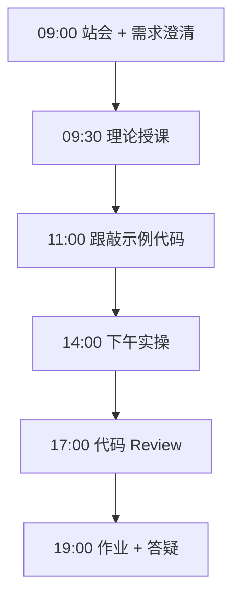
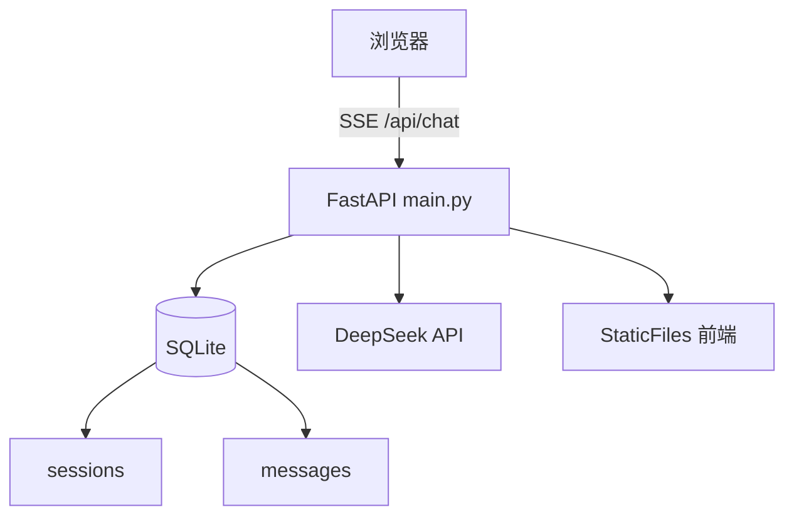

# Day 24：FastAPI后端（下）与数据库

> **阶段**：Phase 2：大模型基础与Prompt工程 | **Epic**：NEXUS-E2 | **预计学时**：6-8 小时

## 旁白解读：今日上下文

> 🎬 **模拟站会 09:00** — 智链科技 Nexus 项目组

林悦在演示会上打开浏览器：「多轮对话、流式打字、刷新不丢历史——这就是 v0.2。」
陈工补充：「SSE + SQLite，生产环境会换 Redis + PostgreSQL，但**原理今天就要搞懂**。」
第二阶段收官之日，你们交付了 **完整 Web Chat MVP**。

**今日在 NexusAgent 主线中的位置**：NexusAgent v0.2 正式交付：Web Chat + SSE + SQLite

**今日 Jira 看板**：
- `NEXUS-241`
- `NEXUS-242`
- `NEXUS-243`

---


## 需求文档（产品林悦下发）

**文档编号**：PRD-NEXUS-D24  
**版本**：v1.0  
**优先级**：P0

### 背景

Phase 2：大模型基础与Prompt工程阶段第 24 天教学任务，与 NexusAgent 主线项目对齐。

### User Stories

### NEXUS-241

**描述**：FastAPI后端（下）与数据库 相关交付

**验收标准**：
- [ ] 代码可本地运行
- [ ] 通过 `scripts/verify_day.py --day 24`

### NEXUS-242

**描述**：FastAPI后端（下）与数据库 相关交付

**验收标准**：
- [ ] 代码可本地运行
- [ ] 通过 `scripts/verify_day.py --day 24`

### NEXUS-243

**描述**：FastAPI后端（下）与数据库 相关交付

**验收标准**：
- [ ] 代码可本地运行
- [ ] 通过 `scripts/verify_day.py --day 24`


---


## 今日课表

### 上午 09:00-12:00

- SQLite 会话表设计：sessions + messages
- SSE 流式响应：StreamingResponse 与前端 EventSource/fetch reader
- 静态文件托管：StaticFiles

### 下午 14:00-17:30

- 跟敲 api/database.py + api/main.py
- 升级 frontend/chat.js 支持 SSE 流式
- 端到端演示：多轮对话 + 刷新页面 session 保持

### 晚自习 19:00-21:00

- 第二阶段复盘：从 token 到 Web Chat 全链路
- 整理 MR，合并 feature/day-24 分支
- 预习 Day 25 RAG 文档上传

---


## 课堂笔记

### 核心知识点速查

| 序号 | 知识点 | 代码位置 |
|------|--------|----------|
| 1 | SQLite 持久化 | 见下午实操 |
| 2 | SSE 流式响应 | 见下午实操 |
| 3 | 会话管理 | 见下午实操 |
| 4 | StaticFiles 托管 | 见下午实操 |
| 5 | 全栈联调 | 见下午实操 |

### 今日流程图



### 架构示意图（当日目标）



---


## 实操代码清单

- `code/api/database.py`
- `code/api/main.py`
- `code/frontend/index.html`
- `code/frontend/style.css`
- `code/frontend/chat.js`
- `code/api/__init__.py`
- `code/requirements.txt`

请按顺序创建并运行。每段代码均可直接复制到对应文件执行。

---

## 实验手册（分时段操作表）

### 实验步骤 1：09:30-10:30 理论

| 时间 | 动作 | 预期结果 | 失败处理 |
|------|------|----------|----------|
| +0min | 打开课件本节 | 看到需求与验收标准 | 检查是否拉取最新 `develop` 分支 |
| +10min | 创建/打开当日 `code/` 文件 | 文件路径与清单一致 | 对照「实操代码清单」 |
| +30min | 粘贴并运行第一个脚本 | 终端有正常输出无 Traceback | 见下方「排错手册」 |
| +60min | 完成全部文件并自测 | `python3` 运行通过 | 使用 `scripts/verify_day.py --day 24` |
| +90min | 提交 Git 并建 MR | MR 关联 Jira NEXUS-241 | 按附录 Git 示例操作 |


### 实验步骤 2：10:30-12:00 跟敲

| 时间 | 动作 | 预期结果 | 失败处理 |
|------|------|----------|----------|
| +0min | 打开课件本节 | 看到需求与验收标准 | 检查是否拉取最新 `develop` 分支 |
| +10min | 创建/打开当日 `code/` 文件 | 文件路径与清单一致 | 对照「实操代码清单」 |
| +30min | 粘贴并运行第一个脚本 | 终端有正常输出无 Traceback | 见下方「排错手册」 |
| +60min | 完成全部文件并自测 | `python3` 运行通过 | 使用 `scripts/verify_day.py --day 24` |
| +90min | 提交 Git 并建 MR | MR 关联 Jira NEXUS-241 | 按附录 Git 示例操作 |


### 实验步骤 3：14:00-15:30 实操

| 时间 | 动作 | 预期结果 | 失败处理 |
|------|------|----------|----------|
| +0min | 打开课件本节 | 看到需求与验收标准 | 检查是否拉取最新 `develop` 分支 |
| +10min | 创建/打开当日 `code/` 文件 | 文件路径与清单一致 | 对照「实操代码清单」 |
| +30min | 粘贴并运行第一个脚本 | 终端有正常输出无 Traceback | 见下方「排错手册」 |
| +60min | 完成全部文件并自测 | `python3` 运行通过 | 使用 `scripts/verify_day.py --day 24` |
| +90min | 提交 Git 并建 MR | MR 关联 Jira NEXUS-241 | 按附录 Git 示例操作 |


### 实验步骤 4：15:30-17:00 联调

| 时间 | 动作 | 预期结果 | 失败处理 |
|------|------|----------|----------|
| +0min | 打开课件本节 | 看到需求与验收标准 | 检查是否拉取最新 `develop` 分支 |
| +10min | 创建/打开当日 `code/` 文件 | 文件路径与清单一致 | 对照「实操代码清单」 |
| +30min | 粘贴并运行第一个脚本 | 终端有正常输出无 Traceback | 见下方「排错手册」 |
| +60min | 完成全部文件并自测 | `python3` 运行通过 | 使用 `scripts/verify_day.py --day 24` |
| +90min | 提交 Git 并建 MR | MR 关联 Jira NEXUS-241 | 按附录 Git 示例操作 |


### 实验步骤 5：19:00-20:30 作业

| 时间 | 动作 | 预期结果 | 失败处理 |
|------|------|----------|----------|
| +0min | 打开课件本节 | 看到需求与验收标准 | 检查是否拉取最新 `develop` 分支 |
| +10min | 创建/打开当日 `code/` 文件 | 文件路径与清单一致 | 对照「实操代码清单」 |
| +30min | 粘贴并运行第一个脚本 | 终端有正常输出无 Traceback | 见下方「排错手册」 |
| +60min | 完成全部文件并自测 | `python3` 运行通过 | 使用 `scripts/verify_day.py --day 24` |
| +90min | 提交 Git 并建 MR | MR 关联 Jira NEXUS-241 | 按附录 Git 示例操作 |


### 排错手册（Day 24）

1. **`command not found: python3`** → 安装 Python 3.10+ 或使用 `py -3`（Windows）
2. **`ModuleNotFoundError`** → 确认当前目录、是否激活 venv、`pip install -r requirements.txt`（若当日有）
3. **`SyntaxError: invalid syntax`** → 检查上一行是否缺括号、引号是否中文
4. **`UnicodeDecodeError`** → 文件保存为 UTF-8，终端 `export PYTHONIOENCODING=utf-8`
5. **API 相关（Day12+）** → 检查 `.env` 中 Key，无 Key 时使用课件 MOCK 模式

---


## 逐步跟敲指南（完整源码与解析）

> 以下代码与 `code/` 目录完全一致，可直接复制。每段附行级说明。

### 文件：`code/api/database.py`

**操作步骤**：
1. 在 `courseware/day-24/code/` 下创建文件 `api/database.py`
2. 完整粘贴下方代码
3. 在终端执行：`cd courseware/day-24/code && python3 database.py`（若为包内模块则按课件说明）

```python
"""
Day 24 数据库层：SQLite 会话与消息持久化。
"""
from __future__ import annotations

import sqlite3
import uuid
from contextlib import contextmanager
from datetime import datetime, timezone
from pathlib import Path
from typing import Any, Generator

DB_PATH = Path(__file__).resolve().parent.parent / "data" / "nexus_chat.db"


def _utc_now() -> str:
    return datetime.now(timezone.utc).isoformat()


@contextmanager
def get_conn() -> Generator[sqlite3.Connection, None, None]:
    DB_PATH.parent.mkdir(parents=True, exist_ok=True)
    conn = sqlite3.connect(DB_PATH)
    conn.row_factory = sqlite3.Row
    try:
        yield conn
        conn.commit()
    finally:
        conn.close()


def init_db() -> None:
    with get_conn() as conn:
        conn.executescript("""
            CREATE TABLE IF NOT EXISTS sessions (
                id TEXT PRIMARY KEY, title TEXT NOT NULL DEFAULT '新对话',
                created_at TEXT NOT NULL, updated_at TEXT NOT NULL
            );
            CREATE TABLE IF NOT EXISTS messages (
                id INTEGER PRIMARY KEY AUTOINCREMENT, session_id TEXT NOT NULL,
                role TEXT NOT NULL, content TEXT NOT NULL, created_at TEXT NOT NULL,
                FOREIGN KEY (session_id) REFERENCES sessions(id)
            );
            CREATE INDEX IF NOT EXISTS idx_messages_session ON messages(session_id);
        """)


def create_session(title: str = "新对话") -> str:
    session_id = str(uuid.uuid4())
    now = _utc_now()
    with get_conn() as conn:
        conn.execute(
            "INSERT INTO sessions (id, title, created_at, updated_at) VALUES (?, ?, ?, ?)",
            (session_id, title, now, now),
        )
    return session_id


def add_message(session_id: str, role: str, content: str) -> int:
    now = _utc_now()
    with get_conn() as conn:
        cur = conn.execute(
            "INSERT INTO messages (session_id, role, content, created_at) VALUES (?, ?, ?, ?)",
            (session_id, role, content, now),
        )
        conn.execute("UPDATE sessions SET updated_at = ? WHERE id = ?", (now, session_id))
        return int(cur.lastrowid)


def get_messages(session_id: str, limit: int = 50) -> list[dict[str, Any]]:
    with get_conn() as conn:
        rows = conn.execute(
            "SELECT role, content, created_at FROM messages WHERE session_id = ? ORDER BY id ASC LIMIT ?",
            (session_id, limit),
        ).fetchall()
    return [dict(r) for r in rows]


def list_sessions(limit: int = 20) -> list[dict[str, Any]]:
    with get_conn() as conn:
        rows = conn.execute(
            "SELECT id, title, created_at, updated_at FROM sessions ORDER BY updated_at DESC LIMIT ?",
            (limit,),
        ).fetchall()
    return [dict(r) for r in rows]

```

**解析要点（`api/database.py`）**：

- 共 **85** 行，请逐行阅读注释中的中文说明

- 运行前确认 Python 版本 ≥ 3.10：`python3 --version`

- 若报错，先检查缩进是否为 4 空格，勿混用 Tab

- 企业 Review 清单：命名是否清晰、是否有异常处理、是否可复用

---

### 文件：`code/api/main.py`

**操作步骤**：
1. 在 `courseware/day-24/code/` 下创建文件 `api/main.py`
2. 完整粘贴下方代码
3. 在终端执行：`cd courseware/day-24/code && python3 main.py`（若为包内模块则按课件说明）

```python
#!/usr/bin/env python3
"""
Day 24 实操：FastAPI 完整 Web Chat（下半）
特性：SSE 流式输出、SQLite 会话持久化、静态前端托管。
运行: python -m api.main  或  python api/main.py
"""
from __future__ import annotations

import json
import os
import sys
import time
import urllib.error
import urllib.request
from pathlib import Path
from typing import AsyncGenerator

from fastapi import FastAPI
from fastapi.middleware.cors import CORSMiddleware
from fastapi.responses import StreamingResponse
from fastapi.staticfiles import StaticFiles
from pydantic import BaseModel, Field

sys.path.insert(0, str(Path(__file__).resolve().parent.parent))
from api.database import add_message, create_session, get_messages, init_db, list_sessions

API_BASE = os.getenv("DEEPSEEK_API_BASE", "https://api.deepseek.com")
API_KEY = os.getenv("DEEPSEEK_API_KEY", "")
MODEL = os.getenv("DEEPSEEK_MODEL", "deepseek-chat")

ROOT = Path(__file__).resolve().parent.parent
FRONTEND_DIR = ROOT / "frontend"

app = FastAPI(title="NexusAgent Web Chat", version="0.2.1")
app.add_middleware(CORSMiddleware, allow_origins=["*"], allow_methods=["*"], allow_headers=["*"])


class ChatRequest(BaseModel):
    message: str = Field(..., min_length=1)
    session_id: str | None = None
    stream: bool = False


@app.on_event("startup")
def on_startup() -> None:
    init_db()


@app.get("/health")
def health() -> dict[str, str]:
    return {"status": "ok", "version": "0.2.1"}


@app.get("/api/sessions")
def api_list_sessions() -> list[dict]:
    return list_sessions()


@app.get("/api/sessions/{session_id}/messages")
def api_get_messages(session_id: str) -> list[dict]:
    return get_messages(session_id)


def _build_llm_messages(session_id: str, user_msg: str) -> list[dict[str, str]]:
    history = get_messages(session_id, limit=20)
    messages = [{"role": "system", "content": "你是智链科技 NexusAgent 助手，回答简洁专业。"}]
    for m in history:
        messages.append({"role": m["role"], "content": m["content"]})
    messages.append({"role": "user", "content": user_msg})
    return messages


def _stream_llm(messages: list[dict[str, str]]) -> list[str]:
    if not API_KEY:
        return list(f"【MOCK SSE】{messages[-1]['content'][:80]} 的回复已写入数据库。")
    payload = {"model": MODEL, "messages": messages, "stream": True, "temperature": 0.7}
    req = urllib.request.Request(
        f"{API_BASE}/v1/chat/completions",
        data=json.dumps(payload).encode("utf-8"),
        headers={"Content-Type": "application/json", "Authorization": f"Bearer {API_KEY}"},
        method="POST",
    )
    tokens: list[str] = []
    try:
        with urllib.request.urlopen(req, timeout=60) as resp:
            for raw_line in resp:
                line = raw_line.decode("utf-8").strip()
                if not line.startswith("data: "):
                    continue
                data_str = line[6:]
                if data_str == "[DONE]":
                    break
                chunk = json.loads(data_str)
                content = chunk["choices"][0].get("delta", {}).get("content", "")
                if content:
                    tokens.append(content)
    except (urllib.error.URLError, json.JSONDecodeError, KeyError) as exc:
        tokens = [f"流式调用失败: {exc}"]
    return tokens


async def sse_generator(session_id: str, user_msg: str) -> AsyncGenerator[str, None]:
    add_message(session_id, "user", user_msg)
    messages = _build_llm_messages(session_id, user_msg)
    messages = messages[:-1]
    messages.append({"role": "user", "content": user_msg})

    full_reply: list[str] = []
    for token in _stream_llm(messages):
        full_reply.append(token)
        payload = json.dumps({"token": token, "session_id": session_id}, ensure_ascii=False)
        yield f"data: {payload}\n\n"
        time.sleep(0.01)

    reply_text = "".join(full_reply)
    add_message(session_id, "assistant", reply_text)
    yield f"data: {json.dumps({'done': True, 'reply': reply_text}, ensure_ascii=False)}\n\n"


@app.post("/api/chat")
async def api_chat(req: ChatRequest) -> StreamingResponse | dict:
    session_id = req.session_id or create_session(title=req.message[:20])
    if req.stream:
        return StreamingResponse(
            sse_generator(session_id, req.message),
            media_type="text/event-stream",
            headers={"Cache-Control": "no-cache", "X-Accel-Buffering": "no"},
        )
    add_message(session_id, "user", req.message)
    tokens = _stream_llm(_build_llm_messages(session_id, req.message))
    reply = "".join(tokens)
    add_message(session_id, "assistant", reply)
    return {"reply": reply, "session_id": session_id}


if FRONTEND_DIR.exists():
    app.mount("/", StaticFiles(directory=str(FRONTEND_DIR), html=True), name="frontend")


if __name__ == "__main__":
    import uvicorn
    print("启动 NexusAgent Web Chat → http://127.0.0.1:8000")
    uvicorn.run(app, host="0.0.0.0", port=8000)

```

**解析要点（`api/main.py`）**：

- 共 **143** 行，请逐行阅读注释中的中文说明

- 运行前确认 Python 版本 ≥ 3.10：`python3 --version`

- 若报错，先检查缩进是否为 4 空格，勿混用 Tab

- 企业 Review 清单：命名是否清晰、是否有异常处理、是否可复用

---

### 文件：`code/frontend/index.html`

**操作步骤**：
1. 在 `courseware/day-24/code/` 下创建文件 `frontend/index.html`
2. 完整粘贴下方代码
3. 在终端执行：`cd courseware/day-24/code && python3 index.html.py`（若为包内模块则按课件说明）

```python
<!DOCTYPE html>
<html lang="zh-CN">
<head>
  <meta charset="UTF-8" />
  <meta name="viewport" content="width=device-width, initial-scale=1.0" />
  <title>NexusAgent 聊天 — Day 22</title>
  <link rel="stylesheet" href="style.css" />
</head>
<body>
  <div class="app">
    <header class="header">
      <h1>🤖 NexusAgent</h1>
      <p class="subtitle">智链科技 · Day 22 静态聊天原型</p>
    </header>
    <main id="chat-window" class="chat-window" aria-live="polite">
      <div class="message bot">
        <div class="bubble">你好！我是 Nexus 助手，有什么可以帮你？</div>
      </div>
    </main>
    <footer class="input-area">
      <input id="user-input" type="text" placeholder="输入消息，按 Enter 发送..." autocomplete="off" />
      <button id="send-btn" type="button">发送</button>
    </footer>
  </div>
  <script src="chat.js"></script>
</body>
</html>

```

**解析要点（`frontend/index.html`）**：

- 共 **27** 行，请逐行阅读注释中的中文说明

- 运行前确认 Python 版本 ≥ 3.10：`python3 --version`

- 若报错，先检查缩进是否为 4 空格，勿混用 Tab

- 企业 Review 清单：命名是否清晰、是否有异常处理、是否可复用

---

### 文件：`code/frontend/style.css`

**操作步骤**：
1. 在 `courseware/day-24/code/` 下创建文件 `frontend/style.css`
2. 完整粘贴下方代码
3. 在终端执行：`cd courseware/day-24/code && python3 style.css.py`（若为包内模块则按课件说明）

```python
/* Day 22 — NexusAgent 聊天界面样式 */
* { box-sizing: border-box; margin: 0; padding: 0; }
body {
  font-family: "Segoe UI", "PingFang SC", "Microsoft YaHei", sans-serif;
  background: linear-gradient(135deg, #0f172a 0%, #1e293b 100%);
  min-height: 100vh; color: #e2e8f0;
}
.app { max-width: 720px; margin: 0 auto; height: 100vh; display: flex; flex-direction: column; padding: 16px; }
.header { text-align: center; padding: 12px 0 20px; }
.header h1 { font-size: 1.5rem; }
.subtitle { font-size: 0.85rem; color: #94a3b8; margin-top: 4px; }
.chat-window {
  flex: 1; overflow-y: auto; padding: 12px;
  background: rgba(15, 23, 42, 0.6); border-radius: 12px; border: 1px solid #334155;
}
.message { display: flex; margin-bottom: 12px; }
.message.user { justify-content: flex-end; }
.message.bot { justify-content: flex-start; }
.bubble {
  max-width: 80%; padding: 10px 14px; border-radius: 16px;
  line-height: 1.5; font-size: 0.95rem; white-space: pre-wrap; word-break: break-word;
}
.user .bubble { background: #3b82f6; color: #fff; border-bottom-right-radius: 4px; }
.bot .bubble { background: #334155; color: #f1f5f9; border-bottom-left-radius: 4px; }
.input-area { display: flex; gap: 8px; margin-top: 12px; }
#user-input {
  flex: 1; padding: 12px 16px; border-radius: 24px; border: 1px solid #475569;
  background: #1e293b; color: #f8fafc; font-size: 1rem; outline: none;
}
#user-input:focus { border-color: #3b82f6; }
#send-btn {
  padding: 12px 24px; border: none; border-radius: 24px;
  background: #3b82f6; color: #fff; font-size: 1rem; cursor: pointer;
}
#send-btn:hover { background: #2563eb; }
#send-btn:disabled { opacity: 0.5; cursor: not-allowed; }
.typing::after { content: "▋"; animation: blink 0.8s infinite; }
@keyframes blink { 50% { opacity: 0; } }

```

**解析要点（`frontend/style.css`）**：

- 共 **38** 行，请逐行阅读注释中的中文说明

- 运行前确认 Python 版本 ≥ 3.10：`python3 --version`

- 若报错，先检查缩进是否为 4 空格，勿混用 Tab

- 企业 Review 清单：命名是否清晰、是否有异常处理、是否可复用

---

### 文件：`code/frontend/chat.js`

**操作步骤**：
1. 在 `courseware/day-24/code/` 下创建文件 `frontend/chat.js`
2. 完整粘贴下方代码
3. 在终端执行：`cd courseware/day-24/code && python3 chat.js.py`（若为包内模块则按课件说明）

```python
/**
 * Day 24 — 对接 SSE 流式 API 的前端增强版
 */
const API_BASE = window.NEXUS_API_BASE || "";
const chatWindow = document.getElementById("chat-window");
const userInput = document.getElementById("user-input");
const sendBtn = document.getElementById("send-btn");
let sessionId = localStorage.getItem("nexus_session_id") || null;

function appendMessage(role, text) {
  const div = document.createElement("div");
  div.className = `message ${role}`;
  const bubble = document.createElement("div");
  bubble.className = "bubble";
  bubble.textContent = text;
  div.appendChild(bubble);
  chatWindow.appendChild(div);
  chatWindow.scrollTop = chatWindow.scrollHeight;
  return bubble;
}

async function sendMessage() {
  const text = userInput.value.trim();
  if (!text) return;
  userInput.value = "";
  sendBtn.disabled = true;
  appendMessage("user", text);
  const botBubble = appendMessage("bot", "");
  botBubble.classList.add("typing");
  try {
    const resp = await fetch(`${API_BASE}/api/chat`, {
      method: "POST",
      headers: { "Content-Type": "application/json" },
      body: JSON.stringify({ message: text, session_id: sessionId, stream: true }),
    });
    if (!resp.ok) throw new Error(`HTTP ${resp.status}`);
    const reader = resp.body.getReader();
    const decoder = new TextDecoder();
    let buffer = "";
    botBubble.textContent = "";
    botBubble.classList.remove("typing");
    while (true) {
      const { done, value } = await reader.read();
      if (done) break;
      buffer += decoder.decode(value, { stream: true });
      const lines = buffer.split("\n");
      buffer = lines.pop() || "";
      for (const line of lines) {
        if (!line.startsWith("data: ")) continue;
        const data = JSON.parse(line.slice(6));
        if (data.token) {
          botBubble.textContent += data.token;
          chatWindow.scrollTop = chatWindow.scrollHeight;
        }
        if (data.session_id) {
          sessionId = data.session_id;
          localStorage.setItem("nexus_session_id", sessionId);
        }
      }
    }
  } catch (err) {
    botBubble.classList.remove("typing");
    botBubble.textContent = `请求失败: ${err.message}`;
  } finally {
    sendBtn.disabled = false;
    userInput.focus();
  }
}

sendBtn.addEventListener("click", sendMessage);
userInput.addEventListener("keydown", (e) => {
  if (e.key === "Enter" && !e.shiftKey) { e.preventDefault(); sendMessage(); }
});
userInput.focus();

```

**解析要点（`frontend/chat.js`）**：

- 共 **74** 行，请逐行阅读注释中的中文说明

- 运行前确认 Python 版本 ≥ 3.10：`python3 --version`

- 若报错，先检查缩进是否为 4 空格，勿混用 Tab

- 企业 Review 清单：命名是否清晰、是否有异常处理、是否可复用

---

### 文件：`code/api/__init__.py`

**操作步骤**：
1. 在 `courseware/day-24/code/` 下创建文件 `api/__init__.py`
2. 完整粘贴下方代码
3. 在终端执行：`cd courseware/day-24/code && python3 __init__.py`（若为包内模块则按课件说明）

```python
"""NexusAgent API 包。"""

```

**解析要点（`api/__init__.py`）**：

- 共 **1** 行，请逐行阅读注释中的中文说明

- 运行前确认 Python 版本 ≥ 3.10：`python3 --version`

- 若报错，先检查缩进是否为 4 空格，勿混用 Tab

- 企业 Review 清单：命名是否清晰、是否有异常处理、是否可复用

---

### 文件：`code/requirements.txt`

**操作步骤**：
1. 在 `courseware/day-24/code/` 下创建文件 `requirements.txt`
2. 完整粘贴下方代码
3. 在终端执行：`cd courseware/day-24/code && python3 requirements.txt.py`（若为包内模块则按课件说明）

```python
fastapi>=0.110.0
uvicorn[standard]>=0.27.0
pydantic>=2.0.0

```

**解析要点（`requirements.txt`）**：

- 共 **3** 行，请逐行阅读注释中的中文说明

- 运行前确认 Python 版本 ≥ 3.10：`python3 --version`

- 若报错，先检查缩进是否为 4 空格，勿混用 Tab

- 企业 Review 清单：命名是否清晰、是否有异常处理、是否可复用

---


### 深度讲解 1：SQLite 持久化

在企业级 Python 开发与大模型应用工程中，**SQLite 持久化** 是学员必须牢固掌握的基本功。智链科技 Nexus 项目组在 Day 24 的代码评审中，特别强调以下几点：

1. **为什么学**：SQLite 持久化 直接服务于后续 NexusAgent 平台的 `NEXUS-E2` 模块。没有扎实的 SQLite 持久化，Day 31 之后调用 API、解析 JSON、编写 Agent 工具函数时会出现大量低级错误。

2. **常见坑**：
   - 忽略输入类型校验，导致运行时 `TypeError`
   - 编码问题（Windows 默认 GBK vs UTF-8）
   - 复制粘贴时缩进错乱（Python 对缩进敏感）

3. **企业实践**：在 SmartLink 的 GitLab 仓库中，所有与 SQLite 持久化 相关的代码必须经过 Ruff 静态检查；变量命名使用 `snake_case`，常量使用 `UPPER_SNAKE_CASE`。

4. **与主线项目的关系**：今日代码位于 `courseware/day-24/code/`，部分模块将逐步合并到 `platform/nexus_agent/`。请养成「每日代码皆可运行、皆可测试」的习惯。

5. **扩展阅读建议**：完成今日作业后，可阅读 `docs/project-master-plan.md` 中关于 NEXUS-E2 的章节，建立全局视角。

**课堂互动题**：请用 3 句话向非技术同事解释「SQLite 持久化」是什么。写在作业 MR 的评论里，讲师会抽查点评。

**实操检查清单**：
- [ ] 能不看课件复述 SQLite 持久化 的定义
- [ ] 能独立写出相关代码并运行
- [ ] 能向同学讲解一处容易写错的地方


### 深度讲解 2：SSE 流式响应

在企业级 Python 开发与大模型应用工程中，**SSE 流式响应** 是学员必须牢固掌握的基本功。智链科技 Nexus 项目组在 Day 24 的代码评审中，特别强调以下几点：

1. **为什么学**：SSE 流式响应 直接服务于后续 NexusAgent 平台的 `NEXUS-E2` 模块。没有扎实的 SSE 流式响应，Day 31 之后调用 API、解析 JSON、编写 Agent 工具函数时会出现大量低级错误。

2. **常见坑**：
   - 忽略输入类型校验，导致运行时 `TypeError`
   - 编码问题（Windows 默认 GBK vs UTF-8）
   - 复制粘贴时缩进错乱（Python 对缩进敏感）

3. **企业实践**：在 SmartLink 的 GitLab 仓库中，所有与 SSE 流式响应 相关的代码必须经过 Ruff 静态检查；变量命名使用 `snake_case`，常量使用 `UPPER_SNAKE_CASE`。

4. **与主线项目的关系**：今日代码位于 `courseware/day-24/code/`，部分模块将逐步合并到 `platform/nexus_agent/`。请养成「每日代码皆可运行、皆可测试」的习惯。

5. **扩展阅读建议**：完成今日作业后，可阅读 `docs/project-master-plan.md` 中关于 NEXUS-E2 的章节，建立全局视角。

**课堂互动题**：请用 3 句话向非技术同事解释「SSE 流式响应」是什么。写在作业 MR 的评论里，讲师会抽查点评。

**实操检查清单**：
- [ ] 能不看课件复述 SSE 流式响应 的定义
- [ ] 能独立写出相关代码并运行
- [ ] 能向同学讲解一处容易写错的地方


### 深度讲解 3：会话管理

在企业级 Python 开发与大模型应用工程中，**会话管理** 是学员必须牢固掌握的基本功。智链科技 Nexus 项目组在 Day 24 的代码评审中，特别强调以下几点：

1. **为什么学**：会话管理 直接服务于后续 NexusAgent 平台的 `NEXUS-E2` 模块。没有扎实的 会话管理，Day 31 之后调用 API、解析 JSON、编写 Agent 工具函数时会出现大量低级错误。

2. **常见坑**：
   - 忽略输入类型校验，导致运行时 `TypeError`
   - 编码问题（Windows 默认 GBK vs UTF-8）
   - 复制粘贴时缩进错乱（Python 对缩进敏感）

3. **企业实践**：在 SmartLink 的 GitLab 仓库中，所有与 会话管理 相关的代码必须经过 Ruff 静态检查；变量命名使用 `snake_case`，常量使用 `UPPER_SNAKE_CASE`。

4. **与主线项目的关系**：今日代码位于 `courseware/day-24/code/`，部分模块将逐步合并到 `platform/nexus_agent/`。请养成「每日代码皆可运行、皆可测试」的习惯。

5. **扩展阅读建议**：完成今日作业后，可阅读 `docs/project-master-plan.md` 中关于 NEXUS-E2 的章节，建立全局视角。

**课堂互动题**：请用 3 句话向非技术同事解释「会话管理」是什么。写在作业 MR 的评论里，讲师会抽查点评。

**实操检查清单**：
- [ ] 能不看课件复述 会话管理 的定义
- [ ] 能独立写出相关代码并运行
- [ ] 能向同学讲解一处容易写错的地方


### 深度讲解 4：StaticFiles 托管

在企业级 Python 开发与大模型应用工程中，**StaticFiles 托管** 是学员必须牢固掌握的基本功。智链科技 Nexus 项目组在 Day 24 的代码评审中，特别强调以下几点：

1. **为什么学**：StaticFiles 托管 直接服务于后续 NexusAgent 平台的 `NEXUS-E2` 模块。没有扎实的 StaticFiles 托管，Day 31 之后调用 API、解析 JSON、编写 Agent 工具函数时会出现大量低级错误。

2. **常见坑**：
   - 忽略输入类型校验，导致运行时 `TypeError`
   - 编码问题（Windows 默认 GBK vs UTF-8）
   - 复制粘贴时缩进错乱（Python 对缩进敏感）

3. **企业实践**：在 SmartLink 的 GitLab 仓库中，所有与 StaticFiles 托管 相关的代码必须经过 Ruff 静态检查；变量命名使用 `snake_case`，常量使用 `UPPER_SNAKE_CASE`。

4. **与主线项目的关系**：今日代码位于 `courseware/day-24/code/`，部分模块将逐步合并到 `platform/nexus_agent/`。请养成「每日代码皆可运行、皆可测试」的习惯。

5. **扩展阅读建议**：完成今日作业后，可阅读 `docs/project-master-plan.md` 中关于 NEXUS-E2 的章节，建立全局视角。

**课堂互动题**：请用 3 句话向非技术同事解释「StaticFiles 托管」是什么。写在作业 MR 的评论里，讲师会抽查点评。

**实操检查清单**：
- [ ] 能不看课件复述 StaticFiles 托管 的定义
- [ ] 能独立写出相关代码并运行
- [ ] 能向同学讲解一处容易写错的地方


### 深度讲解 5：全栈联调

在企业级 Python 开发与大模型应用工程中，**全栈联调** 是学员必须牢固掌握的基本功。智链科技 Nexus 项目组在 Day 24 的代码评审中，特别强调以下几点：

1. **为什么学**：全栈联调 直接服务于后续 NexusAgent 平台的 `NEXUS-E2` 模块。没有扎实的 全栈联调，Day 31 之后调用 API、解析 JSON、编写 Agent 工具函数时会出现大量低级错误。

2. **常见坑**：
   - 忽略输入类型校验，导致运行时 `TypeError`
   - 编码问题（Windows 默认 GBK vs UTF-8）
   - 复制粘贴时缩进错乱（Python 对缩进敏感）

3. **企业实践**：在 SmartLink 的 GitLab 仓库中，所有与 全栈联调 相关的代码必须经过 Ruff 静态检查；变量命名使用 `snake_case`，常量使用 `UPPER_SNAKE_CASE`。

4. **与主线项目的关系**：今日代码位于 `courseware/day-24/code/`，部分模块将逐步合并到 `platform/nexus_agent/`。请养成「每日代码皆可运行、皆可测试」的习惯。

5. **扩展阅读建议**：完成今日作业后，可阅读 `docs/project-master-plan.md` 中关于 NEXUS-E2 的章节，建立全局视角。

**课堂互动题**：请用 3 句话向非技术同事解释「全栈联调」是什么。写在作业 MR 的评论里，讲师会抽查点评。

**实操检查清单**：
- [ ] 能不看课件复述 全栈联调 的定义
- [ ] 能独立写出相关代码并运行
- [ ] 能向同学讲解一处容易写错的地方


## 阶段复盘锚点（Phase 2：大模型基础与Prompt工程）

今天是 **Phase 2：大模型基础与Prompt工程** 的第 **4** 个学习日。请回顾：

- 昨天学了什么？今天如何承接？
- 今天的内容在 70 天路线图中的坐标？
- 如果我是 Tech Lead，会如何 Review 今日代码？

**陈工寄语**：慢即是快。企业里没人关心你一天学了多少个语法点，只关心你写的脚本能不能在服务器上稳定跑 7×24 小时。今天把地基打牢，后面 Agent 编排、RAG 检索才不会塌。

**林悦补充**：产品侧只验收「用户能感知到的价值」。今日交付虽然简单，但「个人信息卡片」本质是后续「用户画像 Agent」的数据采集原型——字段设计请认真思考。

**代码量统计（累计）**：完成今日后，个人仓库累计约 **33600** 行（含注释与测试），全营目标 10 万行。

**明日预告**：请提前阅读 `courseware/day-25/README.md` 开头的旁白，了解上下文。


## 常见问题 FAQ（讲师答疑实录）


**Q1：学习「SQLite 持久化」时最常问的问题是什么？**

A：学员常问「这在大模型开发里到底用在哪里」。直接回答：在 NexusAgent 的 `NEXUS-E2` 中，SQLite 持久化 用于支撑「FastAPI后端（下）与数据库」这一交付。建议你打开 `platform/` 对照看未来模块如何引用今日写法。另一个常见问题是「要不要背语法」——不需要背，但要能写出可运行代码，并能在报错时读懂 Traceback。

**追问**：如果线上报错与 SQLite 持久化 相关，如何排查？  
**答**：① 复现 ② 最小化输入 ③ 打印中间变量 ④ 查 GitLab 历史 diff ⑤ 在 Jira 建 Bug 单附上日志。


**Q2：学习「SSE 流式响应」时最常问的问题是什么？**

A：学员常问「这在大模型开发里到底用在哪里」。直接回答：在 NexusAgent 的 `NEXUS-E2` 中，SSE 流式响应 用于支撑「FastAPI后端（下）与数据库」这一交付。建议你打开 `platform/` 对照看未来模块如何引用今日写法。另一个常见问题是「要不要背语法」——不需要背，但要能写出可运行代码，并能在报错时读懂 Traceback。

**追问**：如果线上报错与 SSE 流式响应 相关，如何排查？  
**答**：① 复现 ② 最小化输入 ③ 打印中间变量 ④ 查 GitLab 历史 diff ⑤ 在 Jira 建 Bug 单附上日志。


**Q3：学习「会话管理」时最常问的问题是什么？**

A：学员常问「这在大模型开发里到底用在哪里」。直接回答：在 NexusAgent 的 `NEXUS-E2` 中，会话管理 用于支撑「FastAPI后端（下）与数据库」这一交付。建议你打开 `platform/` 对照看未来模块如何引用今日写法。另一个常见问题是「要不要背语法」——不需要背，但要能写出可运行代码，并能在报错时读懂 Traceback。

**追问**：如果线上报错与 会话管理 相关，如何排查？  
**答**：① 复现 ② 最小化输入 ③ 打印中间变量 ④ 查 GitLab 历史 diff ⑤ 在 Jira 建 Bug 单附上日志。


**Q4：学习「StaticFiles 托管」时最常问的问题是什么？**

A：学员常问「这在大模型开发里到底用在哪里」。直接回答：在 NexusAgent 的 `NEXUS-E2` 中，StaticFiles 托管 用于支撑「FastAPI后端（下）与数据库」这一交付。建议你打开 `platform/` 对照看未来模块如何引用今日写法。另一个常见问题是「要不要背语法」——不需要背，但要能写出可运行代码，并能在报错时读懂 Traceback。

**追问**：如果线上报错与 StaticFiles 托管 相关，如何排查？  
**答**：① 复现 ② 最小化输入 ③ 打印中间变量 ④ 查 GitLab 历史 diff ⑤ 在 Jira 建 Bug 单附上日志。


**Q5：学习「全栈联调」时最常问的问题是什么？**

A：学员常问「这在大模型开发里到底用在哪里」。直接回答：在 NexusAgent 的 `NEXUS-E2` 中，全栈联调 用于支撑「FastAPI后端（下）与数据库」这一交付。建议你打开 `platform/` 对照看未来模块如何引用今日写法。另一个常见问题是「要不要背语法」——不需要背，但要能写出可运行代码，并能在报错时读懂 Traceback。

**追问**：如果线上报错与 全栈联调 相关，如何排查？  
**答**：① 复现 ② 最小化输入 ③ 打印中间变量 ④ 查 GitLab 历史 diff ⑤ 在 Jira 建 Bug 单附上日志。


## 面试押题（与今日知识点挂钩）

以下题目会出现在 Day 67-69 模拟面试中，建议今日就开始积累答案：

1. **SQLite 持久化**：请结合 NexusAgent 项目举例说明你在哪一天、哪段代码里用到了它？
2. **SSE 流式响应**：请结合 NexusAgent 项目举例说明你在哪一天、哪段代码里用到了它？
3. **会话管理**：请结合 NexusAgent 项目举例说明你在哪一天、哪段代码里用到了它？
4. **StaticFiles 托管**：请结合 NexusAgent 项目举例说明你在哪一天、哪段代码里用到了它？
5. **全栈联调**：请结合 NexusAgent 项目举例说明你在哪一天、哪段代码里用到了它？

**参考答案思路**：采用 STAR 法则（情境-任务-行动-结果），引用 `courseware/day-24/code/` 中的具体文件名与函数名。

---


## Code Review 检查表（陈工版）

合并 MR 前自查：

- [ ] 所有新增 `.py` 文件顶部有模块说明 docstring
- [ ] 无硬编码密钥（API Key 走环境变量）
- [ ] 函数长度 < 50 行，过长则拆分
- [ ] 异常有明确提示，禁止裸 `except:`
- [ ] 提交信息符合 `feat(day-24): ...`
- [ ] README 或注释说明如何运行
- [ ] 与 Jira Story 验收标准逐条对应

**今日重点审查项**：FastAPI后端（下）与数据库 相关逻辑是否可读、可测、可扩展至 `platform/nexus_agent/`。

---


## 课后作业

### 作业说明

为 Web Chat 增加会话列表侧边栏：GET /api/sessions 展示历史会话，点击可加载 GET /api/sessions/{id}/messages 并继续对话。

### 提交要求

1. 代码提交到分支 `feature/day-24-homework`
2. GitLab MR 标题：`[Day-24] homework: 课后作业`
3. 在 MR 描述中附上运行截图或终端输出

### 评分标准（满分 100）

| 项 | 分值 |
|----|------|
| 功能完整 | 40 |
| 代码规范与注释 | 30 |
| 异常处理 | 15 |
| MR 与 Jira 关联 | 15 |

---

## 作业参考答案

> ⚠️ 请先独立完成再对照答案

前端增加 sidebar DOM；`list_sessions()` 已有；加载历史后设置 `sessionId` 并渲染 messages。

---


## 附录：Git 提交示例

```bash
git checkout develop
git pull origin develop
git checkout -b feature/day-24-fastapi后端（
# 完成代码后
git add courseware/day-24/
git commit -m "feat(day-24): FastAPI后端（下）与数据库"
git push -u origin feature/day-24-fastapi后端（
```

---

*课件版本 Day-24-v1.0 | 智链科技培训中心*
