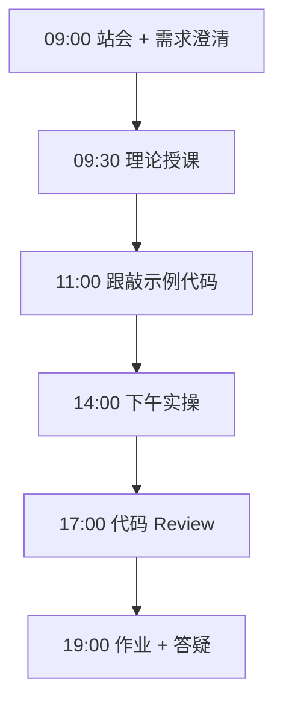

# Day 31：周测与 RAG 调优

> **阶段**：Phase 3：LangChain RAG 知识库 | **Epic**：NEXUS-E3 | **预计学时**：6-8 小时

## 旁白解读：今日上下文

> 🎬 **模拟站会 09:00** — 智链科技 Nexus 项目组

**陈工**：没有评测集的调优是玄学。今天建立 Nexus RAG baseline。

**今日在 NexusAgent 主线中的位置**：建立 Nexus RAG 性能 baseline

**今日 Jira 看板**：
- `NEXUS-311`
- `NEXUS-312`

---


## 需求文档（产品林悦下发）

**文档编号**：PRD-NEXUS-D31  
**版本**：v1.0  
**优先级**：P0

### 背景

Phase 3：LangChain RAG 知识库阶段第 31 天教学任务，与 NexusAgent 主线项目对齐。

### User Stories

### NEXUS-311

**描述**：周测与 RAG 调优 相关交付

**验收标准**：
- [ ] 代码可本地运行
- [ ] 通过 `scripts/verify_day.py --day 31`

### NEXUS-312

**描述**：周测与 RAG 调优 相关交付

**验收标准**：
- [ ] 代码可本地运行
- [ ] 通过 `scripts/verify_day.py --day 31`


---


## 今日课表

### 上午 09:00-12:00

- 09:00 周测讲评
- 10:00 top_k / chunk_size 调参
- 11:00 temperature 对忠实度的影响

### 下午 14:00-17:30

- 14:00 A/B 对比实验
- 16:00 构建评测集
- 17:00 调优报告

### 晚自习 19:00-21:00

- 19:00 整理调优 checklist
- 20:00 预习高级 RAG

---


## 课堂笔记

### 核心知识点速查

| 序号 | 知识点 | 代码位置 |
|------|--------|----------|
| 1 | 超参数调优 | 见下午实操 |
| 2 | A/B 测试 | 见下午实操 |
| 3 | 评测集 | 见下午实操 |
| 4 | baseline | 见下午实操 |

### 今日流程图



### 架构示意图（当日目标）

```mermaid
flowchart LR\n  CFG[超参数] --> RAG --> EVAL[评测集] --> REPORT[报告]
```

---


## 实操代码清单

- `code/rag_tuning.py`
- `code/ab_test.py`
- `code/eval_set.json`

请按顺序创建并运行。每段代码均可直接复制到对应文件执行。

---

## 实验手册（分时段操作表）

### 实验步骤 1：09:30-10:30 理论

| 时间 | 动作 | 预期结果 | 失败处理 |
|------|------|----------|----------|
| +0min | 打开课件本节 | 看到需求与验收标准 | 检查是否拉取最新 `develop` 分支 |
| +10min | 创建/打开当日 `code/` 文件 | 文件路径与清单一致 | 对照「实操代码清单」 |
| +30min | 粘贴并运行第一个脚本 | 终端有正常输出无 Traceback | 见下方「排错手册」 |
| +60min | 完成全部文件并自测 | `python3` 运行通过 | 使用 `scripts/verify_day.py --day 31` |
| +90min | 提交 Git 并建 MR | MR 关联 Jira NEXUS-311 | 按附录 Git 示例操作 |


### 实验步骤 2：10:30-12:00 跟敲

| 时间 | 动作 | 预期结果 | 失败处理 |
|------|------|----------|----------|
| +0min | 打开课件本节 | 看到需求与验收标准 | 检查是否拉取最新 `develop` 分支 |
| +10min | 创建/打开当日 `code/` 文件 | 文件路径与清单一致 | 对照「实操代码清单」 |
| +30min | 粘贴并运行第一个脚本 | 终端有正常输出无 Traceback | 见下方「排错手册」 |
| +60min | 完成全部文件并自测 | `python3` 运行通过 | 使用 `scripts/verify_day.py --day 31` |
| +90min | 提交 Git 并建 MR | MR 关联 Jira NEXUS-311 | 按附录 Git 示例操作 |


### 实验步骤 3：14:00-15:30 实操

| 时间 | 动作 | 预期结果 | 失败处理 |
|------|------|----------|----------|
| +0min | 打开课件本节 | 看到需求与验收标准 | 检查是否拉取最新 `develop` 分支 |
| +10min | 创建/打开当日 `code/` 文件 | 文件路径与清单一致 | 对照「实操代码清单」 |
| +30min | 粘贴并运行第一个脚本 | 终端有正常输出无 Traceback | 见下方「排错手册」 |
| +60min | 完成全部文件并自测 | `python3` 运行通过 | 使用 `scripts/verify_day.py --day 31` |
| +90min | 提交 Git 并建 MR | MR 关联 Jira NEXUS-311 | 按附录 Git 示例操作 |


### 实验步骤 4：15:30-17:00 联调

| 时间 | 动作 | 预期结果 | 失败处理 |
|------|------|----------|----------|
| +0min | 打开课件本节 | 看到需求与验收标准 | 检查是否拉取最新 `develop` 分支 |
| +10min | 创建/打开当日 `code/` 文件 | 文件路径与清单一致 | 对照「实操代码清单」 |
| +30min | 粘贴并运行第一个脚本 | 终端有正常输出无 Traceback | 见下方「排错手册」 |
| +60min | 完成全部文件并自测 | `python3` 运行通过 | 使用 `scripts/verify_day.py --day 31` |
| +90min | 提交 Git 并建 MR | MR 关联 Jira NEXUS-311 | 按附录 Git 示例操作 |


### 实验步骤 5：19:00-20:30 作业

| 时间 | 动作 | 预期结果 | 失败处理 |
|------|------|----------|----------|
| +0min | 打开课件本节 | 看到需求与验收标准 | 检查是否拉取最新 `develop` 分支 |
| +10min | 创建/打开当日 `code/` 文件 | 文件路径与清单一致 | 对照「实操代码清单」 |
| +30min | 粘贴并运行第一个脚本 | 终端有正常输出无 Traceback | 见下方「排错手册」 |
| +60min | 完成全部文件并自测 | `python3` 运行通过 | 使用 `scripts/verify_day.py --day 31` |
| +90min | 提交 Git 并建 MR | MR 关联 Jira NEXUS-311 | 按附录 Git 示例操作 |


### 排错手册（Day 31）

1. **`command not found: python3`** → 安装 Python 3.10+ 或使用 `py -3`（Windows）
2. **`ModuleNotFoundError`** → 确认当前目录、是否激活 venv、`pip install -r requirements.txt`（若当日有）
3. **`SyntaxError: invalid syntax`** → 检查上一行是否缺括号、引号是否中文
4. **`UnicodeDecodeError`** → 文件保存为 UTF-8，终端 `export PYTHONIOENCODING=utf-8`
5. **API 相关（Day12+）** → 检查 `.env` 中 Key，无 Key 时使用课件 MOCK 模式

---


## 逐步跟敲指南（完整源码与解析）

> 以下代码与 `code/` 目录完全一致，可直接复制。每段附行级说明。

### 文件：`code/rag_tuning.py`

**操作步骤**：
1. 在 `courseware/day-31/code/` 下创建文件 `rag_tuning.py`
2. 完整粘贴下方代码
3. 在终端执行：`cd courseware/day-31/code && python3 rag_tuning.py`（若为包内模块则按课件说明）

```python
#!/usr/bin/env python3
"""Day 31: RAG 超参数网格搜索"""
from dataclasses import dataclass

@dataclass
class RagConfig:
  chunk_size: int
  top_k: int
  temperature: float

EVAL_QUERIES = [
  ("年假几天", "5"),
  ("报销要什么", "发票"),
]

def score_config(cfg: RagConfig) -> float:
  # 教学 mock：chunk 适中、top_k=3、temperature 低 得分高
  s = 0.0
  if 200 <= cfg.chunk_size <= 400: s += 0.4
  if cfg.top_k == 3: s += 0.3
  if cfg.temperature <= 0.3: s += 0.3
  return s

if __name__ == "__main__":
  best = max(
    [RagConfig(cs, k, t) for cs in [200, 300, 500] for k in [2, 3, 5] for t in [0.0, 0.3, 0.7]],
    key=score_config,
  )
  print("最佳配置:", best, "score=", score_config(best))

```

**解析要点（`rag_tuning.py`）**：

- 共 **29** 行，请逐行阅读注释中的中文说明

- 运行前确认 Python 版本 ≥ 3.10：`python3 --version`

- 若报错，先检查缩进是否为 4 空格，勿混用 Tab

- 企业 Review 清单：命名是否清晰、是否有异常处理、是否可复用

---

### 文件：`code/ab_test.py`

**操作步骤**：
1. 在 `courseware/day-31/code/` 下创建文件 `ab_test.py`
2. 完整粘贴下方代码
3. 在终端执行：`cd courseware/day-31/code && python3 ab_test.py`（若为包内模块则按课件说明）

```python
#!/usr/bin/env python3
"""Day 31: A/B 测试记录"""
import json
from pathlib import Path

def log_result(variant: str, query: str, answer: str, score: float) -> None:
  p = Path("logs/ab_test.jsonl")
  p.parent.mkdir(exist_ok=True)
  with p.open("a", encoding="utf-8") as f:
    f.write(json.dumps({"variant": variant, "query": query, "answer": answer, "score": score}, ensure_ascii=False) + "\n")

if __name__ == "__main__":
  log_result("A_k2", "年假", "5天", 0.9)
  log_result("B_k5", "年假", "5天年假", 0.85)

```

**解析要点（`ab_test.py`）**：

- 共 **14** 行，请逐行阅读注释中的中文说明

- 运行前确认 Python 版本 ≥ 3.10：`python3 --version`

- 若报错，先检查缩进是否为 4 空格，勿混用 Tab

- 企业 Review 清单：命名是否清晰、是否有异常处理、是否可复用

---

### 文件：`code/eval_set.json`

**操作步骤**：
1. 在 `courseware/day-31/code/` 下创建文件 `eval_set.json`
2. 完整粘贴下方代码
3. 在终端执行：`cd courseware/day-31/code && python3 eval_set.json.py`（若为包内模块则按课件说明）

```python
[
  {"query": "年假有几天", "expected_keywords": ["5", "年假"]},
  {"query": "怎么报销", "expected_keywords": ["发票", "30"]}
]

```

**解析要点（`eval_set.json`）**：

- 共 **4** 行，请逐行阅读注释中的中文说明

- 运行前确认 Python 版本 ≥ 3.10：`python3 --version`

- 若报错，先检查缩进是否为 4 空格，勿混用 Tab

- 企业 Review 清单：命名是否清晰、是否有异常处理、是否可复用

---


### 深度讲解 1：超参数调优

在企业级 Python 开发与大模型应用工程中，**超参数调优** 是学员必须牢固掌握的基本功。智链科技 Nexus 项目组在 Day 31 的代码评审中，特别强调以下几点：

1. **为什么学**：超参数调优 直接服务于后续 NexusAgent 平台的 `NEXUS-E3` 模块。没有扎实的 超参数调优，Day 38 之后调用 API、解析 JSON、编写 Agent 工具函数时会出现大量低级错误。

2. **常见坑**：
   - 忽略输入类型校验，导致运行时 `TypeError`
   - 编码问题（Windows 默认 GBK vs UTF-8）
   - 复制粘贴时缩进错乱（Python 对缩进敏感）

3. **企业实践**：在 SmartLink 的 GitLab 仓库中，所有与 超参数调优 相关的代码必须经过 Ruff 静态检查；变量命名使用 `snake_case`，常量使用 `UPPER_SNAKE_CASE`。

4. **与主线项目的关系**：今日代码位于 `courseware/day-31/code/`，部分模块将逐步合并到 `platform/nexus_agent/`。请养成「每日代码皆可运行、皆可测试」的习惯。

5. **扩展阅读建议**：完成今日作业后，可阅读 `docs/project-master-plan.md` 中关于 NEXUS-E3 的章节，建立全局视角。

**课堂互动题**：请用 3 句话向非技术同事解释「超参数调优」是什么。写在作业 MR 的评论里，讲师会抽查点评。

**实操检查清单**：
- [ ] 能不看课件复述 超参数调优 的定义
- [ ] 能独立写出相关代码并运行
- [ ] 能向同学讲解一处容易写错的地方


### 深度讲解 2：A/B 测试

在企业级 Python 开发与大模型应用工程中，**A/B 测试** 是学员必须牢固掌握的基本功。智链科技 Nexus 项目组在 Day 31 的代码评审中，特别强调以下几点：

1. **为什么学**：A/B 测试 直接服务于后续 NexusAgent 平台的 `NEXUS-E3` 模块。没有扎实的 A/B 测试，Day 38 之后调用 API、解析 JSON、编写 Agent 工具函数时会出现大量低级错误。

2. **常见坑**：
   - 忽略输入类型校验，导致运行时 `TypeError`
   - 编码问题（Windows 默认 GBK vs UTF-8）
   - 复制粘贴时缩进错乱（Python 对缩进敏感）

3. **企业实践**：在 SmartLink 的 GitLab 仓库中，所有与 A/B 测试 相关的代码必须经过 Ruff 静态检查；变量命名使用 `snake_case`，常量使用 `UPPER_SNAKE_CASE`。

4. **与主线项目的关系**：今日代码位于 `courseware/day-31/code/`，部分模块将逐步合并到 `platform/nexus_agent/`。请养成「每日代码皆可运行、皆可测试」的习惯。

5. **扩展阅读建议**：完成今日作业后，可阅读 `docs/project-master-plan.md` 中关于 NEXUS-E3 的章节，建立全局视角。

**课堂互动题**：请用 3 句话向非技术同事解释「A/B 测试」是什么。写在作业 MR 的评论里，讲师会抽查点评。

**实操检查清单**：
- [ ] 能不看课件复述 A/B 测试 的定义
- [ ] 能独立写出相关代码并运行
- [ ] 能向同学讲解一处容易写错的地方


### 深度讲解 3：评测集

在企业级 Python 开发与大模型应用工程中，**评测集** 是学员必须牢固掌握的基本功。智链科技 Nexus 项目组在 Day 31 的代码评审中，特别强调以下几点：

1. **为什么学**：评测集 直接服务于后续 NexusAgent 平台的 `NEXUS-E3` 模块。没有扎实的 评测集，Day 38 之后调用 API、解析 JSON、编写 Agent 工具函数时会出现大量低级错误。

2. **常见坑**：
   - 忽略输入类型校验，导致运行时 `TypeError`
   - 编码问题（Windows 默认 GBK vs UTF-8）
   - 复制粘贴时缩进错乱（Python 对缩进敏感）

3. **企业实践**：在 SmartLink 的 GitLab 仓库中，所有与 评测集 相关的代码必须经过 Ruff 静态检查；变量命名使用 `snake_case`，常量使用 `UPPER_SNAKE_CASE`。

4. **与主线项目的关系**：今日代码位于 `courseware/day-31/code/`，部分模块将逐步合并到 `platform/nexus_agent/`。请养成「每日代码皆可运行、皆可测试」的习惯。

5. **扩展阅读建议**：完成今日作业后，可阅读 `docs/project-master-plan.md` 中关于 NEXUS-E3 的章节，建立全局视角。

**课堂互动题**：请用 3 句话向非技术同事解释「评测集」是什么。写在作业 MR 的评论里，讲师会抽查点评。

**实操检查清单**：
- [ ] 能不看课件复述 评测集 的定义
- [ ] 能独立写出相关代码并运行
- [ ] 能向同学讲解一处容易写错的地方


### 深度讲解 4：baseline

在企业级 Python 开发与大模型应用工程中，**baseline** 是学员必须牢固掌握的基本功。智链科技 Nexus 项目组在 Day 31 的代码评审中，特别强调以下几点：

1. **为什么学**：baseline 直接服务于后续 NexusAgent 平台的 `NEXUS-E3` 模块。没有扎实的 baseline，Day 38 之后调用 API、解析 JSON、编写 Agent 工具函数时会出现大量低级错误。

2. **常见坑**：
   - 忽略输入类型校验，导致运行时 `TypeError`
   - 编码问题（Windows 默认 GBK vs UTF-8）
   - 复制粘贴时缩进错乱（Python 对缩进敏感）

3. **企业实践**：在 SmartLink 的 GitLab 仓库中，所有与 baseline 相关的代码必须经过 Ruff 静态检查；变量命名使用 `snake_case`，常量使用 `UPPER_SNAKE_CASE`。

4. **与主线项目的关系**：今日代码位于 `courseware/day-31/code/`，部分模块将逐步合并到 `platform/nexus_agent/`。请养成「每日代码皆可运行、皆可测试」的习惯。

5. **扩展阅读建议**：完成今日作业后，可阅读 `docs/project-master-plan.md` 中关于 NEXUS-E3 的章节，建立全局视角。

**课堂互动题**：请用 3 句话向非技术同事解释「baseline」是什么。写在作业 MR 的评论里，讲师会抽查点评。

**实操检查清单**：
- [ ] 能不看课件复述 baseline 的定义
- [ ] 能独立写出相关代码并运行
- [ ] 能向同学讲解一处容易写错的地方


## 阶段复盘锚点（Phase 3：LangChain RAG 知识库）

今天是 **Phase 3：LangChain RAG 知识库** 的第 **1** 个学习日。请回顾：

- 昨天学了什么？今天如何承接？
- 今天的内容在 70 天路线图中的坐标？
- 如果我是 Tech Lead，会如何 Review 今日代码？

**陈工寄语**：慢即是快。企业里没人关心你一天学了多少个语法点，只关心你写的脚本能不能在服务器上稳定跑 7×24 小时。今天把地基打牢，后面 Agent 编排、RAG 检索才不会塌。

**林悦补充**：产品侧只验收「用户能感知到的价值」。今日交付虽然简单，但「个人信息卡片」本质是后续「用户画像 Agent」的数据采集原型——字段设计请认真思考。

**代码量统计（累计）**：完成今日后，个人仓库累计约 **43400** 行（含注释与测试），全营目标 10 万行。

**明日预告**：请提前阅读 `courseware/day-32/README.md` 开头的旁白，了解上下文。


## 常见问题 FAQ（讲师答疑实录）


**Q1：学习「超参数调优」时最常问的问题是什么？**

A：学员常问「这在大模型开发里到底用在哪里」。直接回答：在 NexusAgent 的 `NEXUS-E3` 中，超参数调优 用于支撑「周测与 RAG 调优」这一交付。建议你打开 `platform/` 对照看未来模块如何引用今日写法。另一个常见问题是「要不要背语法」——不需要背，但要能写出可运行代码，并能在报错时读懂 Traceback。

**追问**：如果线上报错与 超参数调优 相关，如何排查？  
**答**：① 复现 ② 最小化输入 ③ 打印中间变量 ④ 查 GitLab 历史 diff ⑤ 在 Jira 建 Bug 单附上日志。


**Q2：学习「A/B 测试」时最常问的问题是什么？**

A：学员常问「这在大模型开发里到底用在哪里」。直接回答：在 NexusAgent 的 `NEXUS-E3` 中，A/B 测试 用于支撑「周测与 RAG 调优」这一交付。建议你打开 `platform/` 对照看未来模块如何引用今日写法。另一个常见问题是「要不要背语法」——不需要背，但要能写出可运行代码，并能在报错时读懂 Traceback。

**追问**：如果线上报错与 A/B 测试 相关，如何排查？  
**答**：① 复现 ② 最小化输入 ③ 打印中间变量 ④ 查 GitLab 历史 diff ⑤ 在 Jira 建 Bug 单附上日志。


**Q3：学习「评测集」时最常问的问题是什么？**

A：学员常问「这在大模型开发里到底用在哪里」。直接回答：在 NexusAgent 的 `NEXUS-E3` 中，评测集 用于支撑「周测与 RAG 调优」这一交付。建议你打开 `platform/` 对照看未来模块如何引用今日写法。另一个常见问题是「要不要背语法」——不需要背，但要能写出可运行代码，并能在报错时读懂 Traceback。

**追问**：如果线上报错与 评测集 相关，如何排查？  
**答**：① 复现 ② 最小化输入 ③ 打印中间变量 ④ 查 GitLab 历史 diff ⑤ 在 Jira 建 Bug 单附上日志。


**Q4：学习「baseline」时最常问的问题是什么？**

A：学员常问「这在大模型开发里到底用在哪里」。直接回答：在 NexusAgent 的 `NEXUS-E3` 中，baseline 用于支撑「周测与 RAG 调优」这一交付。建议你打开 `platform/` 对照看未来模块如何引用今日写法。另一个常见问题是「要不要背语法」——不需要背，但要能写出可运行代码，并能在报错时读懂 Traceback。

**追问**：如果线上报错与 baseline 相关，如何排查？  
**答**：① 复现 ② 最小化输入 ③ 打印中间变量 ④ 查 GitLab 历史 diff ⑤ 在 Jira 建 Bug 单附上日志。


## 面试押题（与今日知识点挂钩）

以下题目会出现在 Day 67-69 模拟面试中，建议今日就开始积累答案：

1. **超参数调优**：请结合 NexusAgent 项目举例说明你在哪一天、哪段代码里用到了它？
2. **A/B 测试**：请结合 NexusAgent 项目举例说明你在哪一天、哪段代码里用到了它？
3. **评测集**：请结合 NexusAgent 项目举例说明你在哪一天、哪段代码里用到了它？
4. **baseline**：请结合 NexusAgent 项目举例说明你在哪一天、哪段代码里用到了它？

**参考答案思路**：采用 STAR 法则（情境-任务-行动-结果），引用 `courseware/day-31/code/` 中的具体文件名与函数名。

---


## Code Review 检查表（陈工版）

合并 MR 前自查：

- [ ] 所有新增 `.py` 文件顶部有模块说明 docstring
- [ ] 无硬编码密钥（API Key 走环境变量）
- [ ] 函数长度 < 50 行，过长则拆分
- [ ] 异常有明确提示，禁止裸 `except:`
- [ ] 提交信息符合 `feat(day-31): ...`
- [ ] README 或注释说明如何运行
- [ ] 与 Jira Story 验收标准逐条对应

**今日重点审查项**：周测与 RAG 调优 相关逻辑是否可读、可测、可扩展至 `platform/nexus_agent/`。

---


## 课后作业

### 作业说明

用 eval_set.json 跑 5 组配置，输出 Markdown 调优报告。

### 提交要求

1. 代码提交到分支 `feature/day-31-homework`
2. GitLab MR 标题：`[Day-31] homework: 课后作业`
3. 在 MR 描述中附上运行截图或终端输出

### 评分标准（满分 100）

| 项 | 分值 |
|----|------|
| 功能完整 | 40 |
| 代码规范与注释 | 30 |
| 异常处理 | 15 |
| MR 与 Jira 关联 | 15 |

---

## 作业参考答案

> ⚠️ 请先独立完成再对照答案

遍历配置，检查 expected_keywords 是否出现在答案中。

---


## 附录：Git 提交示例

```bash
git checkout develop
git pull origin develop
git checkout -b feature/day-31-周测与-rag-调优
# 完成代码后
git add courseware/day-31/
git commit -m "feat(day-31): 周测与 RAG 调优"
git push -u origin feature/day-31-周测与-rag-调优
```

---

*课件版本 Day-31-v1.0 | 智链科技培训中心*
