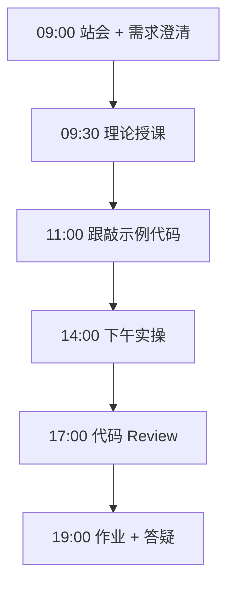

# Day 35：LlamaIndex

> **阶段**：Phase 3：LangChain RAG 知识库 | **Epic**：NEXUS-E3 | **预计学时**：6-8 小时

## 旁白解读：今日上下文

> 🎬 **模拟站会 09:00** — 智链科技 Nexus 项目组

**陈工**：不是二选一，Nexus 检索层可抽象，上层换框架。

**今日在 NexusAgent 主线中的位置**：评估 Nexus 检索层框架抽象可行性

**今日 Jira 看板**：
- `NEXUS-351`
- `NEXUS-352`

---


## 需求文档（产品林悦下发）

**文档编号**：PRD-NEXUS-D35  
**版本**：v1.0  
**优先级**：P0

### 背景

Phase 3：LangChain RAG 知识库阶段第 35 天教学任务，与 NexusAgent 主线项目对齐。

### User Stories

### NEXUS-351

**描述**：LlamaIndex 相关交付

**验收标准**：
- [ ] 代码可本地运行
- [ ] 通过 `scripts/verify_day.py --day 35`

### NEXUS-352

**描述**：LlamaIndex 相关交付

**验收标准**：
- [ ] 代码可本地运行
- [ ] 通过 `scripts/verify_day.py --day 35`


---


## 今日课表

### 上午 09:00-12:00

- 09:00 LlamaIndex vs LangChain
- 10:00 VectorStoreIndex
- 11:00 QueryEngine

### 下午 14:00-17:30

- 14:00 文档索引构建
- 16:00 对比 LangChain RAG
- 17:00 选型讨论

### 晚自习 19:00-21:00

- 19:00 作业：LlamaIndex 索引
- 20:00 预习企业知识库项目

---


## 课堂笔记

### 核心知识点速查

| 序号 | 知识点 | 代码位置 |
|------|--------|----------|
| 1 | LlamaIndex | 见下午实操 |
| 2 | VectorStoreIndex | 见下午实操 |
| 3 | QueryEngine | 见下午实操 |
| 4 | 框架选型 | 见下午实操 |

### 今日流程图



### 架构示意图（当日目标）

```mermaid
flowchart LR\n  DOCS --> INDEX[LlamaIndex] --> ENGINE[QueryEngine] --> ANS
```

---


## 实操代码清单

- `code/llamaindex_basics.py`
- `code/index_query.py`
- `code/compare_frameworks.md`

请按顺序创建并运行。每段代码均可直接复制到对应文件执行。

---

## 实验手册（分时段操作表）

### 实验步骤 1：09:30-10:30 理论

| 时间 | 动作 | 预期结果 | 失败处理 |
|------|------|----------|----------|
| +0min | 打开课件本节 | 看到需求与验收标准 | 检查是否拉取最新 `develop` 分支 |
| +10min | 创建/打开当日 `code/` 文件 | 文件路径与清单一致 | 对照「实操代码清单」 |
| +30min | 粘贴并运行第一个脚本 | 终端有正常输出无 Traceback | 见下方「排错手册」 |
| +60min | 完成全部文件并自测 | `python3` 运行通过 | 使用 `scripts/verify_day.py --day 35` |
| +90min | 提交 Git 并建 MR | MR 关联 Jira NEXUS-351 | 按附录 Git 示例操作 |


### 实验步骤 2：10:30-12:00 跟敲

| 时间 | 动作 | 预期结果 | 失败处理 |
|------|------|----------|----------|
| +0min | 打开课件本节 | 看到需求与验收标准 | 检查是否拉取最新 `develop` 分支 |
| +10min | 创建/打开当日 `code/` 文件 | 文件路径与清单一致 | 对照「实操代码清单」 |
| +30min | 粘贴并运行第一个脚本 | 终端有正常输出无 Traceback | 见下方「排错手册」 |
| +60min | 完成全部文件并自测 | `python3` 运行通过 | 使用 `scripts/verify_day.py --day 35` |
| +90min | 提交 Git 并建 MR | MR 关联 Jira NEXUS-351 | 按附录 Git 示例操作 |


### 实验步骤 3：14:00-15:30 实操

| 时间 | 动作 | 预期结果 | 失败处理 |
|------|------|----------|----------|
| +0min | 打开课件本节 | 看到需求与验收标准 | 检查是否拉取最新 `develop` 分支 |
| +10min | 创建/打开当日 `code/` 文件 | 文件路径与清单一致 | 对照「实操代码清单」 |
| +30min | 粘贴并运行第一个脚本 | 终端有正常输出无 Traceback | 见下方「排错手册」 |
| +60min | 完成全部文件并自测 | `python3` 运行通过 | 使用 `scripts/verify_day.py --day 35` |
| +90min | 提交 Git 并建 MR | MR 关联 Jira NEXUS-351 | 按附录 Git 示例操作 |


### 实验步骤 4：15:30-17:00 联调

| 时间 | 动作 | 预期结果 | 失败处理 |
|------|------|----------|----------|
| +0min | 打开课件本节 | 看到需求与验收标准 | 检查是否拉取最新 `develop` 分支 |
| +10min | 创建/打开当日 `code/` 文件 | 文件路径与清单一致 | 对照「实操代码清单」 |
| +30min | 粘贴并运行第一个脚本 | 终端有正常输出无 Traceback | 见下方「排错手册」 |
| +60min | 完成全部文件并自测 | `python3` 运行通过 | 使用 `scripts/verify_day.py --day 35` |
| +90min | 提交 Git 并建 MR | MR 关联 Jira NEXUS-351 | 按附录 Git 示例操作 |


### 实验步骤 5：19:00-20:30 作业

| 时间 | 动作 | 预期结果 | 失败处理 |
|------|------|----------|----------|
| +0min | 打开课件本节 | 看到需求与验收标准 | 检查是否拉取最新 `develop` 分支 |
| +10min | 创建/打开当日 `code/` 文件 | 文件路径与清单一致 | 对照「实操代码清单」 |
| +30min | 粘贴并运行第一个脚本 | 终端有正常输出无 Traceback | 见下方「排错手册」 |
| +60min | 完成全部文件并自测 | `python3` 运行通过 | 使用 `scripts/verify_day.py --day 35` |
| +90min | 提交 Git 并建 MR | MR 关联 Jira NEXUS-351 | 按附录 Git 示例操作 |


### 排错手册（Day 35）

1. **`command not found: python3`** → 安装 Python 3.10+ 或使用 `py -3`（Windows）
2. **`ModuleNotFoundError`** → 确认当前目录、是否激活 venv、`pip install -r requirements.txt`（若当日有）
3. **`SyntaxError: invalid syntax`** → 检查上一行是否缺括号、引号是否中文
4. **`UnicodeDecodeError`** → 文件保存为 UTF-8，终端 `export PYTHONIOENCODING=utf-8`
5. **API 相关（Day12+）** → 检查 `.env` 中 Key，无 Key 时使用课件 MOCK 模式

---


## 逐步跟敲指南（完整源码与解析）

> 以下代码与 `code/` 目录完全一致，可直接复制。每段附行级说明。

### 文件：`code/llamaindex_basics.py`

**操作步骤**：
1. 在 `courseware/day-35/code/` 下创建文件 `llamaindex_basics.py`
2. 完整粘贴下方代码
3. 在终端执行：`cd courseware/day-35/code && python3 llamaindex_basics.py`（若为包内模块则按课件说明）

```python
#!/usr/bin/env python3
"""Day 35: LlamaIndex 基础索引（可选依赖）"""
from pathlib import Path

def mock_index(texts: list[str]) -> dict:
  # 无 llama-index 时的教学占位
  return {f"doc_{i}": t for i, t in enumerate(texts)}

def query(index: dict, q: str) -> str:
  for k, v in index.items():
    if any(c in v for c in q):
      return v
  return "未找到相关文档"

if __name__ == "__main__":
  idx = mock_index(["年假5天", "报销需发票"])
  print(query(idx, "年假"))

```

**解析要点（`llamaindex_basics.py`）**：

- 共 **17** 行，请逐行阅读注释中的中文说明

- 运行前确认 Python 版本 ≥ 3.10：`python3 --version`

- 若报错，先检查缩进是否为 4 空格，勿混用 Tab

- 企业 Review 清单：命名是否清晰、是否有异常处理、是否可复用

---

### 文件：`code/index_query.py`

**操作步骤**：
1. 在 `courseware/day-35/code/` 下创建文件 `index_query.py`
2. 完整粘贴下方代码
3. 在终端执行：`cd courseware/day-35/code && python3 index_query.py`（若为包内模块则按课件说明）

```python
#!/usr/bin/env python3
"""Day 35: LlamaIndex QueryEngine 概念"""
try:
  from llama_index.core import VectorStoreIndex, Document
  HAS_LLAMA = True
except ImportError:
  HAS_LLAMA = False

def build_engine(texts: list[str]):
  if not HAS_LLAMA:
    from llamaindex_basics import mock_index, query
    idx = mock_index(texts)
    return lambda q: query(idx, q)
  docs = [Document(text=t) for t in texts]
  index = VectorStoreIndex.from_documents(docs)
  return index.as_query_engine()

if __name__ == "__main__":
  engine = build_engine(["Nexus 支持 RAG", "Agent 编排用 LangGraph"])
  print(engine("RAG 用什么？"))

```

**解析要点（`index_query.py`）**：

- 共 **20** 行，请逐行阅读注释中的中文说明

- 运行前确认 Python 版本 ≥ 3.10：`python3 --version`

- 若报错，先检查缩进是否为 4 空格，勿混用 Tab

- 企业 Review 清单：命名是否清晰、是否有异常处理、是否可复用

---

### 文件：`code/compare_frameworks.md`

**操作步骤**：
1. 在 `courseware/day-35/code/` 下创建文件 `compare_frameworks.md`
2. 完整粘贴下方代码
3. 在终端执行：`cd courseware/day-35/code && python3 compare_frameworks.md.py`（若为包内模块则按课件说明）

```python
# LangChain vs LlamaIndex

| 维度 | LangChain | LlamaIndex |
|------|-----------|------------|
| 定位 | 通用 LLM 编排 | 数据索引与检索 |
| RAG | 链式组合灵活 | 索引 API 简洁 |
| 选型 | Agent + 多工具 | 重度知识库场景 |

```

**解析要点（`compare_frameworks.md`）**：

- 共 **7** 行，请逐行阅读注释中的中文说明

- 运行前确认 Python 版本 ≥ 3.10：`python3 --version`

- 若报错，先检查缩进是否为 4 空格，勿混用 Tab

- 企业 Review 清单：命名是否清晰、是否有异常处理、是否可复用

---


### 深度讲解 1：LlamaIndex

在企业级 Python 开发与大模型应用工程中，**LlamaIndex** 是学员必须牢固掌握的基本功。智链科技 Nexus 项目组在 Day 35 的代码评审中，特别强调以下几点：

1. **为什么学**：LlamaIndex 直接服务于后续 NexusAgent 平台的 `NEXUS-E3` 模块。没有扎实的 LlamaIndex，Day 42 之后调用 API、解析 JSON、编写 Agent 工具函数时会出现大量低级错误。

2. **常见坑**：
   - 忽略输入类型校验，导致运行时 `TypeError`
   - 编码问题（Windows 默认 GBK vs UTF-8）
   - 复制粘贴时缩进错乱（Python 对缩进敏感）

3. **企业实践**：在 SmartLink 的 GitLab 仓库中，所有与 LlamaIndex 相关的代码必须经过 Ruff 静态检查；变量命名使用 `snake_case`，常量使用 `UPPER_SNAKE_CASE`。

4. **与主线项目的关系**：今日代码位于 `courseware/day-35/code/`，部分模块将逐步合并到 `platform/nexus_agent/`。请养成「每日代码皆可运行、皆可测试」的习惯。

5. **扩展阅读建议**：完成今日作业后，可阅读 `docs/project-master-plan.md` 中关于 NEXUS-E3 的章节，建立全局视角。

**课堂互动题**：请用 3 句话向非技术同事解释「LlamaIndex」是什么。写在作业 MR 的评论里，讲师会抽查点评。

**实操检查清单**：
- [ ] 能不看课件复述 LlamaIndex 的定义
- [ ] 能独立写出相关代码并运行
- [ ] 能向同学讲解一处容易写错的地方


### 深度讲解 2：VectorStoreIndex

在企业级 Python 开发与大模型应用工程中，**VectorStoreIndex** 是学员必须牢固掌握的基本功。智链科技 Nexus 项目组在 Day 35 的代码评审中，特别强调以下几点：

1. **为什么学**：VectorStoreIndex 直接服务于后续 NexusAgent 平台的 `NEXUS-E3` 模块。没有扎实的 VectorStoreIndex，Day 42 之后调用 API、解析 JSON、编写 Agent 工具函数时会出现大量低级错误。

2. **常见坑**：
   - 忽略输入类型校验，导致运行时 `TypeError`
   - 编码问题（Windows 默认 GBK vs UTF-8）
   - 复制粘贴时缩进错乱（Python 对缩进敏感）

3. **企业实践**：在 SmartLink 的 GitLab 仓库中，所有与 VectorStoreIndex 相关的代码必须经过 Ruff 静态检查；变量命名使用 `snake_case`，常量使用 `UPPER_SNAKE_CASE`。

4. **与主线项目的关系**：今日代码位于 `courseware/day-35/code/`，部分模块将逐步合并到 `platform/nexus_agent/`。请养成「每日代码皆可运行、皆可测试」的习惯。

5. **扩展阅读建议**：完成今日作业后，可阅读 `docs/project-master-plan.md` 中关于 NEXUS-E3 的章节，建立全局视角。

**课堂互动题**：请用 3 句话向非技术同事解释「VectorStoreIndex」是什么。写在作业 MR 的评论里，讲师会抽查点评。

**实操检查清单**：
- [ ] 能不看课件复述 VectorStoreIndex 的定义
- [ ] 能独立写出相关代码并运行
- [ ] 能向同学讲解一处容易写错的地方


### 深度讲解 3：QueryEngine

在企业级 Python 开发与大模型应用工程中，**QueryEngine** 是学员必须牢固掌握的基本功。智链科技 Nexus 项目组在 Day 35 的代码评审中，特别强调以下几点：

1. **为什么学**：QueryEngine 直接服务于后续 NexusAgent 平台的 `NEXUS-E3` 模块。没有扎实的 QueryEngine，Day 42 之后调用 API、解析 JSON、编写 Agent 工具函数时会出现大量低级错误。

2. **常见坑**：
   - 忽略输入类型校验，导致运行时 `TypeError`
   - 编码问题（Windows 默认 GBK vs UTF-8）
   - 复制粘贴时缩进错乱（Python 对缩进敏感）

3. **企业实践**：在 SmartLink 的 GitLab 仓库中，所有与 QueryEngine 相关的代码必须经过 Ruff 静态检查；变量命名使用 `snake_case`，常量使用 `UPPER_SNAKE_CASE`。

4. **与主线项目的关系**：今日代码位于 `courseware/day-35/code/`，部分模块将逐步合并到 `platform/nexus_agent/`。请养成「每日代码皆可运行、皆可测试」的习惯。

5. **扩展阅读建议**：完成今日作业后，可阅读 `docs/project-master-plan.md` 中关于 NEXUS-E3 的章节，建立全局视角。

**课堂互动题**：请用 3 句话向非技术同事解释「QueryEngine」是什么。写在作业 MR 的评论里，讲师会抽查点评。

**实操检查清单**：
- [ ] 能不看课件复述 QueryEngine 的定义
- [ ] 能独立写出相关代码并运行
- [ ] 能向同学讲解一处容易写错的地方


### 深度讲解 4：框架选型

在企业级 Python 开发与大模型应用工程中，**框架选型** 是学员必须牢固掌握的基本功。智链科技 Nexus 项目组在 Day 35 的代码评审中，特别强调以下几点：

1. **为什么学**：框架选型 直接服务于后续 NexusAgent 平台的 `NEXUS-E3` 模块。没有扎实的 框架选型，Day 42 之后调用 API、解析 JSON、编写 Agent 工具函数时会出现大量低级错误。

2. **常见坑**：
   - 忽略输入类型校验，导致运行时 `TypeError`
   - 编码问题（Windows 默认 GBK vs UTF-8）
   - 复制粘贴时缩进错乱（Python 对缩进敏感）

3. **企业实践**：在 SmartLink 的 GitLab 仓库中，所有与 框架选型 相关的代码必须经过 Ruff 静态检查；变量命名使用 `snake_case`，常量使用 `UPPER_SNAKE_CASE`。

4. **与主线项目的关系**：今日代码位于 `courseware/day-35/code/`，部分模块将逐步合并到 `platform/nexus_agent/`。请养成「每日代码皆可运行、皆可测试」的习惯。

5. **扩展阅读建议**：完成今日作业后，可阅读 `docs/project-master-plan.md` 中关于 NEXUS-E3 的章节，建立全局视角。

**课堂互动题**：请用 3 句话向非技术同事解释「框架选型」是什么。写在作业 MR 的评论里，讲师会抽查点评。

**实操检查清单**：
- [ ] 能不看课件复述 框架选型 的定义
- [ ] 能独立写出相关代码并运行
- [ ] 能向同学讲解一处容易写错的地方


## 阶段复盘锚点（Phase 3：LangChain RAG 知识库）

今天是 **Phase 3：LangChain RAG 知识库** 的第 **5** 个学习日。请回顾：

- 昨天学了什么？今天如何承接？
- 今天的内容在 70 天路线图中的坐标？
- 如果我是 Tech Lead，会如何 Review 今日代码？

**陈工寄语**：慢即是快。企业里没人关心你一天学了多少个语法点，只关心你写的脚本能不能在服务器上稳定跑 7×24 小时。今天把地基打牢，后面 Agent 编排、RAG 检索才不会塌。

**林悦补充**：产品侧只验收「用户能感知到的价值」。今日交付虽然简单，但「个人信息卡片」本质是后续「用户画像 Agent」的数据采集原型——字段设计请认真思考。

**代码量统计（累计）**：完成今日后，个人仓库累计约 **49000** 行（含注释与测试），全营目标 10 万行。

**明日预告**：请提前阅读 `courseware/day-36/README.md` 开头的旁白，了解上下文。


## 常见问题 FAQ（讲师答疑实录）


**Q1：学习「LlamaIndex」时最常问的问题是什么？**

A：学员常问「这在大模型开发里到底用在哪里」。直接回答：在 NexusAgent 的 `NEXUS-E3` 中，LlamaIndex 用于支撑「LlamaIndex」这一交付。建议你打开 `platform/` 对照看未来模块如何引用今日写法。另一个常见问题是「要不要背语法」——不需要背，但要能写出可运行代码，并能在报错时读懂 Traceback。

**追问**：如果线上报错与 LlamaIndex 相关，如何排查？  
**答**：① 复现 ② 最小化输入 ③ 打印中间变量 ④ 查 GitLab 历史 diff ⑤ 在 Jira 建 Bug 单附上日志。


**Q2：学习「VectorStoreIndex」时最常问的问题是什么？**

A：学员常问「这在大模型开发里到底用在哪里」。直接回答：在 NexusAgent 的 `NEXUS-E3` 中，VectorStoreIndex 用于支撑「LlamaIndex」这一交付。建议你打开 `platform/` 对照看未来模块如何引用今日写法。另一个常见问题是「要不要背语法」——不需要背，但要能写出可运行代码，并能在报错时读懂 Traceback。

**追问**：如果线上报错与 VectorStoreIndex 相关，如何排查？  
**答**：① 复现 ② 最小化输入 ③ 打印中间变量 ④ 查 GitLab 历史 diff ⑤ 在 Jira 建 Bug 单附上日志。


**Q3：学习「QueryEngine」时最常问的问题是什么？**

A：学员常问「这在大模型开发里到底用在哪里」。直接回答：在 NexusAgent 的 `NEXUS-E3` 中，QueryEngine 用于支撑「LlamaIndex」这一交付。建议你打开 `platform/` 对照看未来模块如何引用今日写法。另一个常见问题是「要不要背语法」——不需要背，但要能写出可运行代码，并能在报错时读懂 Traceback。

**追问**：如果线上报错与 QueryEngine 相关，如何排查？  
**答**：① 复现 ② 最小化输入 ③ 打印中间变量 ④ 查 GitLab 历史 diff ⑤ 在 Jira 建 Bug 单附上日志。


**Q4：学习「框架选型」时最常问的问题是什么？**

A：学员常问「这在大模型开发里到底用在哪里」。直接回答：在 NexusAgent 的 `NEXUS-E3` 中，框架选型 用于支撑「LlamaIndex」这一交付。建议你打开 `platform/` 对照看未来模块如何引用今日写法。另一个常见问题是「要不要背语法」——不需要背，但要能写出可运行代码，并能在报错时读懂 Traceback。

**追问**：如果线上报错与 框架选型 相关，如何排查？  
**答**：① 复现 ② 最小化输入 ③ 打印中间变量 ④ 查 GitLab 历史 diff ⑤ 在 Jira 建 Bug 单附上日志。


## 面试押题（与今日知识点挂钩）

以下题目会出现在 Day 67-69 模拟面试中，建议今日就开始积累答案：

1. **LlamaIndex**：请结合 NexusAgent 项目举例说明你在哪一天、哪段代码里用到了它？
2. **VectorStoreIndex**：请结合 NexusAgent 项目举例说明你在哪一天、哪段代码里用到了它？
3. **QueryEngine**：请结合 NexusAgent 项目举例说明你在哪一天、哪段代码里用到了它？
4. **框架选型**：请结合 NexusAgent 项目举例说明你在哪一天、哪段代码里用到了它？

**参考答案思路**：采用 STAR 法则（情境-任务-行动-结果），引用 `courseware/day-35/code/` 中的具体文件名与函数名。

---


## Code Review 检查表（陈工版）

合并 MR 前自查：

- [ ] 所有新增 `.py` 文件顶部有模块说明 docstring
- [ ] 无硬编码密钥（API Key 走环境变量）
- [ ] 函数长度 < 50 行，过长则拆分
- [ ] 异常有明确提示，禁止裸 `except:`
- [ ] 提交信息符合 `feat(day-35): ...`
- [ ] README 或注释说明如何运行
- [ ] 与 Jira Story 验收标准逐条对应

**今日重点审查项**：LlamaIndex 相关逻辑是否可读、可测、可扩展至 `platform/nexus_agent/`。

---


## 课后作业

### 作业说明

用 LlamaIndex 或 mock 实现 handbook 索引，对比与 LangChain RAG 延迟。

### 提交要求

1. 代码提交到分支 `feature/day-35-homework`
2. GitLab MR 标题：`[Day-35] homework: 课后作业`
3. 在 MR 描述中附上运行截图或终端输出

### 评分标准（满分 100）

| 项 | 分值 |
|----|------|
| 功能完整 | 40 |
| 代码规范与注释 | 30 |
| 异常处理 | 15 |
| MR 与 Jira 关联 | 15 |

---

## 作业参考答案

> ⚠️ 请先独立完成再对照答案

time.perf_counter() 计时 invoke。

---


## 附录：Git 提交示例

```bash
git checkout develop
git pull origin develop
git checkout -b feature/day-35-llamaindex
# 完成代码后
git add courseware/day-35/
git commit -m "feat(day-35): LlamaIndex"
git push -u origin feature/day-35-llamaindex
```

---

*课件版本 Day-35-v1.0 | 智链科技培训中心*
