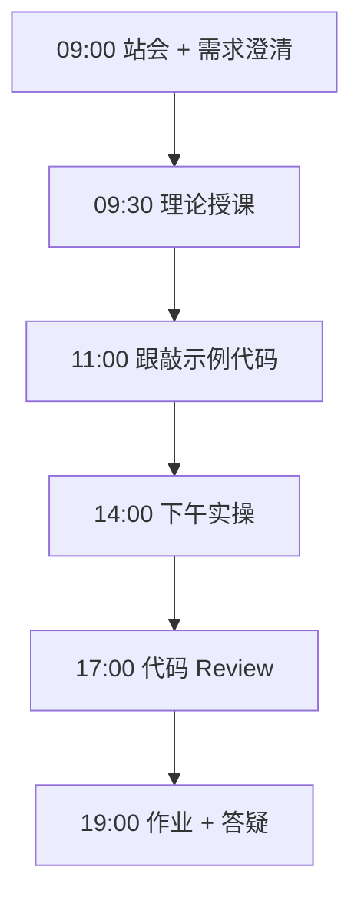

# Day 36：企业知识库项目（上）

> **阶段**：Phase 3：LangChain RAG 知识库 | **Epic**：NEXUS-E3 | **预计学时**：6-8 小时

## 旁白解读：今日上下文

> 🎬 **模拟站会 09:00** — 智链科技 Nexus 项目组

**林悦**：这是 v0.3 里程碑交付。**陈工**：先打通 ingest，明天接 API。

**今日在 NexusAgent 主线中的位置**：NexusAgent v0.3 企业知识库 MVP

**今日 Jira 看板**：
- `NEXUS-361`
- `NEXUS-362`
- `NEXUS-363`

---


## 需求文档（产品林悦下发）

**文档编号**：PRD-NEXUS-D36  
**版本**：v1.0  
**优先级**：P0

### 背景

Phase 3：LangChain RAG 知识库阶段第 36 天教学任务，与 NexusAgent 主线项目对齐。

### User Stories

### NEXUS-361

**描述**：企业知识库项目（上） 相关交付

**验收标准**：
- [ ] 代码可本地运行
- [ ] 通过 `scripts/verify_day.py --day 36`

### NEXUS-362

**描述**：企业知识库项目（上） 相关交付

**验收标准**：
- [ ] 代码可本地运行
- [ ] 通过 `scripts/verify_day.py --day 36`

### NEXUS-363

**描述**：企业知识库项目（上） 相关交付

**验收标准**：
- [ ] 代码可本地运行
- [ ] 通过 `scripts/verify_day.py --day 36`


---


## 今日课表

### 上午 09:00-12:00

- 09:00 项目需求评审
- 10:00 架构设计：ingest/retriever/api
- 11:00 环境搭建

### 下午 14:00-17:30

- 14:00 实现 config + ingest
- 16:00 文档上传与切分
- 17:00 向量入库验证

### 晚自习 19:00-21:00

- 19:00 继续 retriever
- 20:00 联调准备

---


## 课堂笔记

### 核心知识点速查

| 序号 | 知识点 | 代码位置 |
|------|--------|----------|
| 1 | 项目架构 | 见下午实操 |
| 2 | 文档入库 | 见下午实操 |
| 3 | Chroma 持久化 | 见下午实操 |
| 4 | 模块化设计 | 见下午实操 |

### 今日流程图



### 架构示意图（当日目标）

```mermaid
flowchart TD\n  UPLOAD[上传] --> INGEST --> CHROMA[(Chroma)]\n  CHROMA --> RET[Retriever]
```

---


## 实操代码清单

- `code/enterprise_kb/config.py`
- `code/enterprise_kb/ingest.py`
- `code/enterprise_kb/retriever.py`
- `code/enterprise_kb/api.py`

请按顺序创建并运行。每段代码均可直接复制到对应文件执行。

---

## 实验手册（分时段操作表）

### 实验步骤 1：09:30-10:30 理论

| 时间 | 动作 | 预期结果 | 失败处理 |
|------|------|----------|----------|
| +0min | 打开课件本节 | 看到需求与验收标准 | 检查是否拉取最新 `develop` 分支 |
| +10min | 创建/打开当日 `code/` 文件 | 文件路径与清单一致 | 对照「实操代码清单」 |
| +30min | 粘贴并运行第一个脚本 | 终端有正常输出无 Traceback | 见下方「排错手册」 |
| +60min | 完成全部文件并自测 | `python3` 运行通过 | 使用 `scripts/verify_day.py --day 36` |
| +90min | 提交 Git 并建 MR | MR 关联 Jira NEXUS-361 | 按附录 Git 示例操作 |


### 实验步骤 2：10:30-12:00 跟敲

| 时间 | 动作 | 预期结果 | 失败处理 |
|------|------|----------|----------|
| +0min | 打开课件本节 | 看到需求与验收标准 | 检查是否拉取最新 `develop` 分支 |
| +10min | 创建/打开当日 `code/` 文件 | 文件路径与清单一致 | 对照「实操代码清单」 |
| +30min | 粘贴并运行第一个脚本 | 终端有正常输出无 Traceback | 见下方「排错手册」 |
| +60min | 完成全部文件并自测 | `python3` 运行通过 | 使用 `scripts/verify_day.py --day 36` |
| +90min | 提交 Git 并建 MR | MR 关联 Jira NEXUS-361 | 按附录 Git 示例操作 |


### 实验步骤 3：14:00-15:30 实操

| 时间 | 动作 | 预期结果 | 失败处理 |
|------|------|----------|----------|
| +0min | 打开课件本节 | 看到需求与验收标准 | 检查是否拉取最新 `develop` 分支 |
| +10min | 创建/打开当日 `code/` 文件 | 文件路径与清单一致 | 对照「实操代码清单」 |
| +30min | 粘贴并运行第一个脚本 | 终端有正常输出无 Traceback | 见下方「排错手册」 |
| +60min | 完成全部文件并自测 | `python3` 运行通过 | 使用 `scripts/verify_day.py --day 36` |
| +90min | 提交 Git 并建 MR | MR 关联 Jira NEXUS-361 | 按附录 Git 示例操作 |


### 实验步骤 4：15:30-17:00 联调

| 时间 | 动作 | 预期结果 | 失败处理 |
|------|------|----------|----------|
| +0min | 打开课件本节 | 看到需求与验收标准 | 检查是否拉取最新 `develop` 分支 |
| +10min | 创建/打开当日 `code/` 文件 | 文件路径与清单一致 | 对照「实操代码清单」 |
| +30min | 粘贴并运行第一个脚本 | 终端有正常输出无 Traceback | 见下方「排错手册」 |
| +60min | 完成全部文件并自测 | `python3` 运行通过 | 使用 `scripts/verify_day.py --day 36` |
| +90min | 提交 Git 并建 MR | MR 关联 Jira NEXUS-361 | 按附录 Git 示例操作 |


### 实验步骤 5：19:00-20:30 作业

| 时间 | 动作 | 预期结果 | 失败处理 |
|------|------|----------|----------|
| +0min | 打开课件本节 | 看到需求与验收标准 | 检查是否拉取最新 `develop` 分支 |
| +10min | 创建/打开当日 `code/` 文件 | 文件路径与清单一致 | 对照「实操代码清单」 |
| +30min | 粘贴并运行第一个脚本 | 终端有正常输出无 Traceback | 见下方「排错手册」 |
| +60min | 完成全部文件并自测 | `python3` 运行通过 | 使用 `scripts/verify_day.py --day 36` |
| +90min | 提交 Git 并建 MR | MR 关联 Jira NEXUS-361 | 按附录 Git 示例操作 |


### 排错手册（Day 36）

1. **`command not found: python3`** → 安装 Python 3.10+ 或使用 `py -3`（Windows）
2. **`ModuleNotFoundError`** → 确认当前目录、是否激活 venv、`pip install -r requirements.txt`（若当日有）
3. **`SyntaxError: invalid syntax`** → 检查上一行是否缺括号、引号是否中文
4. **`UnicodeDecodeError`** → 文件保存为 UTF-8，终端 `export PYTHONIOENCODING=utf-8`
5. **API 相关（Day12+）** → 检查 `.env` 中 Key，无 Key 时使用课件 MOCK 模式

---


## 逐步跟敲指南（完整源码与解析）

> 以下代码与 `code/` 目录完全一致，可直接复制。每段附行级说明。

### 文件：`code/enterprise_kb/config.py`

**操作步骤**：
1. 在 `courseware/day-36/code/` 下创建文件 `enterprise_kb/config.py`
2. 完整粘贴下方代码
3. 在终端执行：`cd courseware/day-36/code && python3 config.py`（若为包内模块则按课件说明）

```python
#!/usr/bin/env python3
"""企业知识库项目 — 配置模块"""
import os
from pathlib import Path

# 数据与向量库路径
DATA_DIR = Path(os.getenv("NEXUS_DATA_DIR", "data"))
CHROMA_DIR = DATA_DIR / "chroma_enterprise"
UPLOAD_DIR = DATA_DIR / "uploads"

# 模型配置
LLM_MODEL = os.getenv("DEEPSEEK_MODEL", "deepseek-chat")
EMBED_MODEL = os.getenv("EMBED_MODEL", "text-embedding-3-small")
API_KEY = os.getenv("DEEPSEEK_API_KEY", "")
API_BASE = os.getenv("DEEPSEEK_BASE_URL", "https://api.deepseek.com")

# RAG 超参数
CHUNK_SIZE = 400
CHUNK_OVERLAP = 80
TOP_K = 4

```

**解析要点（`enterprise_kb/config.py`）**：

- 共 **20** 行，请逐行阅读注释中的中文说明

- 运行前确认 Python 版本 ≥ 3.10：`python3 --version`

- 若报错，先检查缩进是否为 4 空格，勿混用 Tab

- 企业 Review 清单：命名是否清晰、是否有异常处理、是否可复用

---

### 文件：`code/enterprise_kb/ingest.py`

**操作步骤**：
1. 在 `courseware/day-36/code/` 下创建文件 `enterprise_kb/ingest.py`
2. 完整粘贴下方代码
3. 在终端执行：`cd courseware/day-36/code && python3 ingest.py`（若为包内模块则按课件说明）

```python
#!/usr/bin/env python3
"""企业知识库 — 文档入库管道"""
from pathlib import Path
from langchain_community.document_loaders import TextLoader, DirectoryLoader
from langchain_text_splitters import RecursiveCharacterTextSplitter
from langchain_chroma import Chroma
from langchain_openai import OpenAIEmbeddings
from config import UPLOAD_DIR, CHROMA_DIR, CHUNK_SIZE, CHUNK_OVERLAP, API_KEY, API_BASE, EMBED_MODEL

def load_documents(src: Path) -> list:
  if src.is_file():
    return TextLoader(str(src), encoding="utf-8").load()
  loader = DirectoryLoader(str(src), glob="**/*.txt", loader_cls=TextLoader, loader_kwargs={"encoding": "utf-8"})
  return loader.load()

def ingest(src: Path) -> int:
  docs = load_documents(src)
  splitter = RecursiveCharacterTextSplitter(chunk_size=CHUNK_SIZE, chunk_overlap=CHUNK_OVERLAP)
  chunks = splitter.split_documents(docs)
  emb = OpenAIEmbeddings(model=EMBED_MODEL, api_key=API_KEY or "mock", base_url=API_BASE)
  Chroma.from_documents(chunks, embedding=emb, persist_directory=str(CHROMA_DIR))
  return len(chunks)

if __name__ == "__main__":
  UPLOAD_DIR.mkdir(parents=True, exist_ok=True)
  sample = UPLOAD_DIR / "policy.txt"
  if not sample.exists():
    sample.write_text("智链科技员工手册：年假5天，报销需发票。", encoding="utf-8")
  print("入库 chunks:", ingest(UPLOAD_DIR))

```

**解析要点（`enterprise_kb/ingest.py`）**：

- 共 **29** 行，请逐行阅读注释中的中文说明

- 运行前确认 Python 版本 ≥ 3.10：`python3 --version`

- 若报错，先检查缩进是否为 4 空格，勿混用 Tab

- 企业 Review 清单：命名是否清晰、是否有异常处理、是否可复用

---

### 文件：`code/enterprise_kb/retriever.py`

**操作步骤**：
1. 在 `courseware/day-36/code/` 下创建文件 `enterprise_kb/retriever.py`
2. 完整粘贴下方代码
3. 在终端执行：`cd courseware/day-36/code && python3 retriever.py`（若为包内模块则按课件说明）

```python
#!/usr/bin/env python3
"""企业知识库 — 检索与问答"""
import os
from langchain_chroma import Chroma
from langchain_openai import OpenAIEmbeddings, ChatOpenAI
from langchain.chains import RetrievalQA
from config import CHROMA_DIR, API_KEY, API_BASE, EMBED_MODEL, LLM_MODEL, TOP_K

def build_qa() -> RetrievalQA:
  emb = OpenAIEmbeddings(model=EMBED_MODEL, api_key=API_KEY or "mock", base_url=API_BASE)
  vs = Chroma(persist_directory=str(CHROMA_DIR), embedding_function=emb)
  retriever = vs.as_retriever(search_kwargs={"k": TOP_K})
  llm = ChatOpenAI(model=LLM_MODEL, api_key=API_KEY or "mock", base_url=API_BASE, temperature=0.1)
  return RetrievalQA.from_chain_type(llm=llm, retriever=retriever, return_source_documents=True)

if __name__ == "__main__":
  qa = build_qa()
  r = qa({"query": "年假有几天？"})
  print(r["result"])

```

**解析要点（`enterprise_kb/retriever.py`）**：

- 共 **19** 行，请逐行阅读注释中的中文说明

- 运行前确认 Python 版本 ≥ 3.10：`python3 --version`

- 若报错，先检查缩进是否为 4 空格，勿混用 Tab

- 企业 Review 清单：命名是否清晰、是否有异常处理、是否可复用

---

### 文件：`code/enterprise_kb/api.py`

**操作步骤**：
1. 在 `courseware/day-36/code/` 下创建文件 `enterprise_kb/api.py`
2. 完整粘贴下方代码
3. 在终端执行：`cd courseware/day-36/code && python3 api.py`（若为包内模块则按课件说明）

```python
#!/usr/bin/env python3
"""企业知识库 — FastAPI 接口"""
from fastapi import FastAPI, UploadFile, File
from pydantic import BaseModel
from pathlib import Path
from ingest import ingest
from retriever import build_qa
from config import UPLOAD_DIR

app = FastAPI(title="Nexus Enterprise KB")
qa_chain = None

class QueryRequest(BaseModel):
  question: str

@app.on_event("startup")
def startup() -> None:
  global qa_chain
  qa_chain = build_qa()

@app.post("/upload")
async def upload(file: UploadFile = File(...)):
  UPLOAD_DIR.mkdir(parents=True, exist_ok=True)
  dest = UPLOAD_DIR / file.filename
  dest.write_bytes(await file.read())
  n = ingest(dest)
  return {"status": "ok", "chunks": n}

@app.post("/query")
def query(req: QueryRequest):
  r = qa_chain({"query": req.question})
  sources = [d.metadata for d in r.get("source_documents", [])]
  return {"answer": r["result"], "sources": sources}

if __name__ == "__main__":
  import uvicorn
  uvicorn.run(app, host="0.0.0.0", port=8000)

```

**解析要点（`enterprise_kb/api.py`）**：

- 共 **37** 行，请逐行阅读注释中的中文说明

- 运行前确认 Python 版本 ≥ 3.10：`python3 --version`

- 若报错，先检查缩进是否为 4 空格，勿混用 Tab

- 企业 Review 清单：命名是否清晰、是否有异常处理、是否可复用

---


### 深度讲解 1：项目架构

在企业级 Python 开发与大模型应用工程中，**项目架构** 是学员必须牢固掌握的基本功。智链科技 Nexus 项目组在 Day 36 的代码评审中，特别强调以下几点：

1. **为什么学**：项目架构 直接服务于后续 NexusAgent 平台的 `NEXUS-E3` 模块。没有扎实的 项目架构，Day 43 之后调用 API、解析 JSON、编写 Agent 工具函数时会出现大量低级错误。

2. **常见坑**：
   - 忽略输入类型校验，导致运行时 `TypeError`
   - 编码问题（Windows 默认 GBK vs UTF-8）
   - 复制粘贴时缩进错乱（Python 对缩进敏感）

3. **企业实践**：在 SmartLink 的 GitLab 仓库中，所有与 项目架构 相关的代码必须经过 Ruff 静态检查；变量命名使用 `snake_case`，常量使用 `UPPER_SNAKE_CASE`。

4. **与主线项目的关系**：今日代码位于 `courseware/day-36/code/`，部分模块将逐步合并到 `platform/nexus_agent/`。请养成「每日代码皆可运行、皆可测试」的习惯。

5. **扩展阅读建议**：完成今日作业后，可阅读 `docs/project-master-plan.md` 中关于 NEXUS-E3 的章节，建立全局视角。

**课堂互动题**：请用 3 句话向非技术同事解释「项目架构」是什么。写在作业 MR 的评论里，讲师会抽查点评。

**实操检查清单**：
- [ ] 能不看课件复述 项目架构 的定义
- [ ] 能独立写出相关代码并运行
- [ ] 能向同学讲解一处容易写错的地方


### 深度讲解 2：文档入库

在企业级 Python 开发与大模型应用工程中，**文档入库** 是学员必须牢固掌握的基本功。智链科技 Nexus 项目组在 Day 36 的代码评审中，特别强调以下几点：

1. **为什么学**：文档入库 直接服务于后续 NexusAgent 平台的 `NEXUS-E3` 模块。没有扎实的 文档入库，Day 43 之后调用 API、解析 JSON、编写 Agent 工具函数时会出现大量低级错误。

2. **常见坑**：
   - 忽略输入类型校验，导致运行时 `TypeError`
   - 编码问题（Windows 默认 GBK vs UTF-8）
   - 复制粘贴时缩进错乱（Python 对缩进敏感）

3. **企业实践**：在 SmartLink 的 GitLab 仓库中，所有与 文档入库 相关的代码必须经过 Ruff 静态检查；变量命名使用 `snake_case`，常量使用 `UPPER_SNAKE_CASE`。

4. **与主线项目的关系**：今日代码位于 `courseware/day-36/code/`，部分模块将逐步合并到 `platform/nexus_agent/`。请养成「每日代码皆可运行、皆可测试」的习惯。

5. **扩展阅读建议**：完成今日作业后，可阅读 `docs/project-master-plan.md` 中关于 NEXUS-E3 的章节，建立全局视角。

**课堂互动题**：请用 3 句话向非技术同事解释「文档入库」是什么。写在作业 MR 的评论里，讲师会抽查点评。

**实操检查清单**：
- [ ] 能不看课件复述 文档入库 的定义
- [ ] 能独立写出相关代码并运行
- [ ] 能向同学讲解一处容易写错的地方


### 深度讲解 3：Chroma 持久化

在企业级 Python 开发与大模型应用工程中，**Chroma 持久化** 是学员必须牢固掌握的基本功。智链科技 Nexus 项目组在 Day 36 的代码评审中，特别强调以下几点：

1. **为什么学**：Chroma 持久化 直接服务于后续 NexusAgent 平台的 `NEXUS-E3` 模块。没有扎实的 Chroma 持久化，Day 43 之后调用 API、解析 JSON、编写 Agent 工具函数时会出现大量低级错误。

2. **常见坑**：
   - 忽略输入类型校验，导致运行时 `TypeError`
   - 编码问题（Windows 默认 GBK vs UTF-8）
   - 复制粘贴时缩进错乱（Python 对缩进敏感）

3. **企业实践**：在 SmartLink 的 GitLab 仓库中，所有与 Chroma 持久化 相关的代码必须经过 Ruff 静态检查；变量命名使用 `snake_case`，常量使用 `UPPER_SNAKE_CASE`。

4. **与主线项目的关系**：今日代码位于 `courseware/day-36/code/`，部分模块将逐步合并到 `platform/nexus_agent/`。请养成「每日代码皆可运行、皆可测试」的习惯。

5. **扩展阅读建议**：完成今日作业后，可阅读 `docs/project-master-plan.md` 中关于 NEXUS-E3 的章节，建立全局视角。

**课堂互动题**：请用 3 句话向非技术同事解释「Chroma 持久化」是什么。写在作业 MR 的评论里，讲师会抽查点评。

**实操检查清单**：
- [ ] 能不看课件复述 Chroma 持久化 的定义
- [ ] 能独立写出相关代码并运行
- [ ] 能向同学讲解一处容易写错的地方


### 深度讲解 4：模块化设计

在企业级 Python 开发与大模型应用工程中，**模块化设计** 是学员必须牢固掌握的基本功。智链科技 Nexus 项目组在 Day 36 的代码评审中，特别强调以下几点：

1. **为什么学**：模块化设计 直接服务于后续 NexusAgent 平台的 `NEXUS-E3` 模块。没有扎实的 模块化设计，Day 43 之后调用 API、解析 JSON、编写 Agent 工具函数时会出现大量低级错误。

2. **常见坑**：
   - 忽略输入类型校验，导致运行时 `TypeError`
   - 编码问题（Windows 默认 GBK vs UTF-8）
   - 复制粘贴时缩进错乱（Python 对缩进敏感）

3. **企业实践**：在 SmartLink 的 GitLab 仓库中，所有与 模块化设计 相关的代码必须经过 Ruff 静态检查；变量命名使用 `snake_case`，常量使用 `UPPER_SNAKE_CASE`。

4. **与主线项目的关系**：今日代码位于 `courseware/day-36/code/`，部分模块将逐步合并到 `platform/nexus_agent/`。请养成「每日代码皆可运行、皆可测试」的习惯。

5. **扩展阅读建议**：完成今日作业后，可阅读 `docs/project-master-plan.md` 中关于 NEXUS-E3 的章节，建立全局视角。

**课堂互动题**：请用 3 句话向非技术同事解释「模块化设计」是什么。写在作业 MR 的评论里，讲师会抽查点评。

**实操检查清单**：
- [ ] 能不看课件复述 模块化设计 的定义
- [ ] 能独立写出相关代码并运行
- [ ] 能向同学讲解一处容易写错的地方


## 阶段复盘锚点（Phase 3：LangChain RAG 知识库）

今天是 **Phase 3：LangChain RAG 知识库** 的第 **6** 个学习日。请回顾：

- 昨天学了什么？今天如何承接？
- 今天的内容在 70 天路线图中的坐标？
- 如果我是 Tech Lead，会如何 Review 今日代码？

**陈工寄语**：慢即是快。企业里没人关心你一天学了多少个语法点，只关心你写的脚本能不能在服务器上稳定跑 7×24 小时。今天把地基打牢，后面 Agent 编排、RAG 检索才不会塌。

**林悦补充**：产品侧只验收「用户能感知到的价值」。今日交付虽然简单，但「个人信息卡片」本质是后续「用户画像 Agent」的数据采集原型——字段设计请认真思考。

**代码量统计（累计）**：完成今日后，个人仓库累计约 **50400** 行（含注释与测试），全营目标 10 万行。

**明日预告**：请提前阅读 `courseware/day-37/README.md` 开头的旁白，了解上下文。


## 常见问题 FAQ（讲师答疑实录）


**Q1：学习「项目架构」时最常问的问题是什么？**

A：学员常问「这在大模型开发里到底用在哪里」。直接回答：在 NexusAgent 的 `NEXUS-E3` 中，项目架构 用于支撑「企业知识库项目（上）」这一交付。建议你打开 `platform/` 对照看未来模块如何引用今日写法。另一个常见问题是「要不要背语法」——不需要背，但要能写出可运行代码，并能在报错时读懂 Traceback。

**追问**：如果线上报错与 项目架构 相关，如何排查？  
**答**：① 复现 ② 最小化输入 ③ 打印中间变量 ④ 查 GitLab 历史 diff ⑤ 在 Jira 建 Bug 单附上日志。


**Q2：学习「文档入库」时最常问的问题是什么？**

A：学员常问「这在大模型开发里到底用在哪里」。直接回答：在 NexusAgent 的 `NEXUS-E3` 中，文档入库 用于支撑「企业知识库项目（上）」这一交付。建议你打开 `platform/` 对照看未来模块如何引用今日写法。另一个常见问题是「要不要背语法」——不需要背，但要能写出可运行代码，并能在报错时读懂 Traceback。

**追问**：如果线上报错与 文档入库 相关，如何排查？  
**答**：① 复现 ② 最小化输入 ③ 打印中间变量 ④ 查 GitLab 历史 diff ⑤ 在 Jira 建 Bug 单附上日志。


**Q3：学习「Chroma 持久化」时最常问的问题是什么？**

A：学员常问「这在大模型开发里到底用在哪里」。直接回答：在 NexusAgent 的 `NEXUS-E3` 中，Chroma 持久化 用于支撑「企业知识库项目（上）」这一交付。建议你打开 `platform/` 对照看未来模块如何引用今日写法。另一个常见问题是「要不要背语法」——不需要背，但要能写出可运行代码，并能在报错时读懂 Traceback。

**追问**：如果线上报错与 Chroma 持久化 相关，如何排查？  
**答**：① 复现 ② 最小化输入 ③ 打印中间变量 ④ 查 GitLab 历史 diff ⑤ 在 Jira 建 Bug 单附上日志。


**Q4：学习「模块化设计」时最常问的问题是什么？**

A：学员常问「这在大模型开发里到底用在哪里」。直接回答：在 NexusAgent 的 `NEXUS-E3` 中，模块化设计 用于支撑「企业知识库项目（上）」这一交付。建议你打开 `platform/` 对照看未来模块如何引用今日写法。另一个常见问题是「要不要背语法」——不需要背，但要能写出可运行代码，并能在报错时读懂 Traceback。

**追问**：如果线上报错与 模块化设计 相关，如何排查？  
**答**：① 复现 ② 最小化输入 ③ 打印中间变量 ④ 查 GitLab 历史 diff ⑤ 在 Jira 建 Bug 单附上日志。


## 面试押题（与今日知识点挂钩）

以下题目会出现在 Day 67-69 模拟面试中，建议今日就开始积累答案：

1. **项目架构**：请结合 NexusAgent 项目举例说明你在哪一天、哪段代码里用到了它？
2. **文档入库**：请结合 NexusAgent 项目举例说明你在哪一天、哪段代码里用到了它？
3. **Chroma 持久化**：请结合 NexusAgent 项目举例说明你在哪一天、哪段代码里用到了它？
4. **模块化设计**：请结合 NexusAgent 项目举例说明你在哪一天、哪段代码里用到了它？

**参考答案思路**：采用 STAR 法则（情境-任务-行动-结果），引用 `courseware/day-36/code/` 中的具体文件名与函数名。

---


## Code Review 检查表（陈工版）

合并 MR 前自查：

- [ ] 所有新增 `.py` 文件顶部有模块说明 docstring
- [ ] 无硬编码密钥（API Key 走环境变量）
- [ ] 函数长度 < 50 行，过长则拆分
- [ ] 异常有明确提示，禁止裸 `except:`
- [ ] 提交信息符合 `feat(day-36): ...`
- [ ] README 或注释说明如何运行
- [ ] 与 Jira Story 验收标准逐条对应

**今日重点审查项**：企业知识库项目（上） 相关逻辑是否可读、可测、可扩展至 `platform/nexus_agent/`。

---


## 课后作业

### 作业说明

完成 ingest.py，支持目录批量导入 txt，输出入库日志。

### 提交要求

1. 代码提交到分支 `feature/day-36-homework`
2. GitLab MR 标题：`[Day-36] homework: 课后作业`
3. 在 MR 描述中附上运行截图或终端输出

### 评分标准（满分 100）

| 项 | 分值 |
|----|------|
| 功能完整 | 40 |
| 代码规范与注释 | 30 |
| 异常处理 | 15 |
| MR 与 Jira 关联 | 15 |

---

## 作业参考答案

> ⚠️ 请先独立完成再对照答案

DirectoryLoader glob='**/*.txt' 遍历 uploads。

---


## 附录：Git 提交示例

```bash
git checkout develop
git pull origin develop
git checkout -b feature/day-36-企业知识库项目（上）
# 完成代码后
git add courseware/day-36/
git commit -m "feat(day-36): 企业知识库项目（上）"
git push -u origin feature/day-36-企业知识库项目（上）
```

---

*课件版本 Day-36-v1.0 | 智链科技培训中心*
