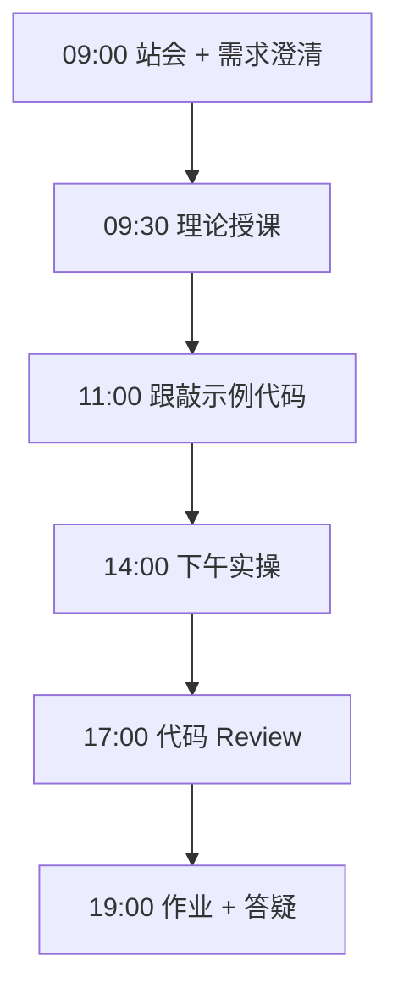

# Day 39：ReAct 手写

> **阶段**：Phase 4：多 Agent 编排 | **Epic**：NEXUS-E4 | **预计学时**：6-8 小时

## 旁白解读：今日上下文

> 🎬 **模拟站会 09:00** — 智链科技 Nexus 项目组

**陈工**：理解 ReAct 比调库重要，今天禁止直接用 AgentExecutor。

**今日在 NexusAgent 主线中的位置**：Nexus Agent 引擎理论基础

**今日 Jira 看板**：
- `NEXUS-391`
- `NEXUS-392`

---


## 需求文档（产品林悦下发）

**文档编号**：PRD-NEXUS-D39  
**版本**：v1.0  
**优先级**：P0

### 背景

Phase 4：多 Agent 编排阶段第 39 天教学任务，与 NexusAgent 主线项目对齐。

### User Stories

### NEXUS-391

**描述**：ReAct 手写 相关交付

**验收标准**：
- [ ] 代码可本地运行
- [ ] 通过 `scripts/verify_day.py --day 39`

### NEXUS-392

**描述**：ReAct 手写 相关交付

**验收标准**：
- [ ] 代码可本地运行
- [ ] 通过 `scripts/verify_day.py --day 39`


---


## 今日课表

### 上午 09:00-12:00

- 09:00 ReAct 论文精读
- 10:00 Thought-Action-Observation 循环
- 11:00 手写 Agent 框架

### 下午 14:00-17:30

- 14:00 实现 search 工具
- 16:00 多轮推理循环
- 17:00 解析 Action 格式

### 晚自习 19:00-21:00

- 19:00 作业：新增 calculator 工具
- 20:00 预习 LangChain Agent

---


## 课堂笔记

### 核心知识点速查

| 序号 | 知识点 | 代码位置 |
|------|--------|----------|
| 1 | ReAct | 见下午实操 |
| 2 | Thought-Action-Observation | 见下午实操 |
| 3 | 工具调用 | 见下午实操 |
| 4 | 推理循环 | 见下午实操 |

### 今日流程图



### 架构示意图（当日目标）

```mermaid
flowchart TD\n  Q --> THOUGHT --> ACTION --> TOOL --> OBS --> THOUGHT
```

---


## 实操代码清单

- `code/react_agent.py`
- `code/tools.py`
- `code/react_prompt.py`

请按顺序创建并运行。每段代码均可直接复制到对应文件执行。

---

## 实验手册（分时段操作表）

### 实验步骤 1：09:30-10:30 理论

| 时间 | 动作 | 预期结果 | 失败处理 |
|------|------|----------|----------|
| +0min | 打开课件本节 | 看到需求与验收标准 | 检查是否拉取最新 `develop` 分支 |
| +10min | 创建/打开当日 `code/` 文件 | 文件路径与清单一致 | 对照「实操代码清单」 |
| +30min | 粘贴并运行第一个脚本 | 终端有正常输出无 Traceback | 见下方「排错手册」 |
| +60min | 完成全部文件并自测 | `python3` 运行通过 | 使用 `scripts/verify_day.py --day 39` |
| +90min | 提交 Git 并建 MR | MR 关联 Jira NEXUS-391 | 按附录 Git 示例操作 |


### 实验步骤 2：10:30-12:00 跟敲

| 时间 | 动作 | 预期结果 | 失败处理 |
|------|------|----------|----------|
| +0min | 打开课件本节 | 看到需求与验收标准 | 检查是否拉取最新 `develop` 分支 |
| +10min | 创建/打开当日 `code/` 文件 | 文件路径与清单一致 | 对照「实操代码清单」 |
| +30min | 粘贴并运行第一个脚本 | 终端有正常输出无 Traceback | 见下方「排错手册」 |
| +60min | 完成全部文件并自测 | `python3` 运行通过 | 使用 `scripts/verify_day.py --day 39` |
| +90min | 提交 Git 并建 MR | MR 关联 Jira NEXUS-391 | 按附录 Git 示例操作 |


### 实验步骤 3：14:00-15:30 实操

| 时间 | 动作 | 预期结果 | 失败处理 |
|------|------|----------|----------|
| +0min | 打开课件本节 | 看到需求与验收标准 | 检查是否拉取最新 `develop` 分支 |
| +10min | 创建/打开当日 `code/` 文件 | 文件路径与清单一致 | 对照「实操代码清单」 |
| +30min | 粘贴并运行第一个脚本 | 终端有正常输出无 Traceback | 见下方「排错手册」 |
| +60min | 完成全部文件并自测 | `python3` 运行通过 | 使用 `scripts/verify_day.py --day 39` |
| +90min | 提交 Git 并建 MR | MR 关联 Jira NEXUS-391 | 按附录 Git 示例操作 |


### 实验步骤 4：15:30-17:00 联调

| 时间 | 动作 | 预期结果 | 失败处理 |
|------|------|----------|----------|
| +0min | 打开课件本节 | 看到需求与验收标准 | 检查是否拉取最新 `develop` 分支 |
| +10min | 创建/打开当日 `code/` 文件 | 文件路径与清单一致 | 对照「实操代码清单」 |
| +30min | 粘贴并运行第一个脚本 | 终端有正常输出无 Traceback | 见下方「排错手册」 |
| +60min | 完成全部文件并自测 | `python3` 运行通过 | 使用 `scripts/verify_day.py --day 39` |
| +90min | 提交 Git 并建 MR | MR 关联 Jira NEXUS-391 | 按附录 Git 示例操作 |


### 实验步骤 5：19:00-20:30 作业

| 时间 | 动作 | 预期结果 | 失败处理 |
|------|------|----------|----------|
| +0min | 打开课件本节 | 看到需求与验收标准 | 检查是否拉取最新 `develop` 分支 |
| +10min | 创建/打开当日 `code/` 文件 | 文件路径与清单一致 | 对照「实操代码清单」 |
| +30min | 粘贴并运行第一个脚本 | 终端有正常输出无 Traceback | 见下方「排错手册」 |
| +60min | 完成全部文件并自测 | `python3` 运行通过 | 使用 `scripts/verify_day.py --day 39` |
| +90min | 提交 Git 并建 MR | MR 关联 Jira NEXUS-391 | 按附录 Git 示例操作 |


### 排错手册（Day 39）

1. **`command not found: python3`** → 安装 Python 3.10+ 或使用 `py -3`（Windows）
2. **`ModuleNotFoundError`** → 确认当前目录、是否激活 venv、`pip install -r requirements.txt`（若当日有）
3. **`SyntaxError: invalid syntax`** → 检查上一行是否缺括号、引号是否中文
4. **`UnicodeDecodeError`** → 文件保存为 UTF-8，终端 `export PYTHONIOENCODING=utf-8`
5. **API 相关（Day12+）** → 检查 `.env` 中 Key，无 Key 时使用课件 MOCK 模式

---


## 逐步跟敲指南（完整源码与解析）

> 以下代码与 `code/` 目录完全一致，可直接复制。每段附行级说明。

### 文件：`code/react_agent.py`

**操作步骤**：
1. 在 `courseware/day-39/code/` 下创建文件 `react_agent.py`
2. 完整粘贴下方代码
3. 在终端执行：`cd courseware/day-39/code && python3 react_agent.py`（若为包内模块则按课件说明）

```python
#!/usr/bin/env python3
"""Day 39: 手写 ReAct Agent"""
import re
from tools import TOOLS

SYSTEM = """你是助手，使用以下格式：
Thought: 思考
Action: 工具名[参数]
Observation: 工具返回
... 最终 Answer: 结论
可用工具: search, calculator
"""

def parse_action(text: str) -> tuple[str, str] | None:
  m = re.search(r"Action:\s*(\w+)\[(.*?)\]", text, re.DOTALL)
  return (m.group(1), m.group(2)) if m else None

def react_loop(question: str, max_steps: int = 5) -> str:
  history = SYSTEM + f"\nQuestion: {question}\n"
  for _ in range(max_steps):
    # 教学 mock：规则生成 Thought/Action
    if "计算" in question or "+" in question:
      thought = "Thought: 需要计算\nAction: calculator[2+3]\n"
    else:
      thought = "Thought: 需要搜索\nAction: search[Nexus RAG]\n"
    history += thought
    action = parse_action(thought)
    if not action:
      break
    name, arg = action
    obs = TOOLS[name](arg)
    history += f"Observation: {obs}\n"
    if "Answer:" in obs:
      return obs
  return history + "Answer: 未能在限定步数内完成"

if __name__ == "__main__":
  print(react_loop("Nexus 用什么做 RAG？"))
  print(react_loop("计算 2+3"))

```

**解析要点（`react_agent.py`）**：

- 共 **39** 行，请逐行阅读注释中的中文说明

- 运行前确认 Python 版本 ≥ 3.10：`python3 --version`

- 若报错，先检查缩进是否为 4 空格，勿混用 Tab

- 企业 Review 清单：命名是否清晰、是否有异常处理、是否可复用

---

### 文件：`code/tools.py`

**操作步骤**：
1. 在 `courseware/day-39/code/` 下创建文件 `tools.py`
2. 完整粘贴下方代码
3. 在终端执行：`cd courseware/day-39/code && python3 tools.py`（若为包内模块则按课件说明）

```python
#!/usr/bin/env python3
"""Day 39: ReAct 工具集"""
import ast
import operator

def search(query: str) -> str:
  # 模拟搜索
  kb = {"Nexus RAG": "Nexus 使用 LangChain + Chroma 实现 RAG。"}
  for k, v in kb.items():
    if k.lower() in query.lower() or query.lower() in k.lower():
      return v
  return "未找到相关信息"

def calculator(expr: str) -> str:
  # 安全计算：仅允许数字与运算符
  allowed = {ast.Add: operator.add, ast.Sub: operator.sub, ast.Mult: operator.mul, ast.Div: operator.truediv}
  def _eval(node):
    if isinstance(node, ast.Num):
      return node.n
    if isinstance(node, ast.BinOp):
      return allowed[type(node.op)](_eval(node.left), _eval(node.right))
    raise ValueError("非法表达式")
  try:
    return str(_eval(ast.parse(expr, mode="eval").body))
  except Exception as e:
    return f"计算错误: {e}"

TOOLS = {"search": search, "calculator": calculator}

```

**解析要点（`tools.py`）**：

- 共 **28** 行，请逐行阅读注释中的中文说明

- 运行前确认 Python 版本 ≥ 3.10：`python3 --version`

- 若报错，先检查缩进是否为 4 空格，勿混用 Tab

- 企业 Review 清单：命名是否清晰、是否有异常处理、是否可复用

---

### 文件：`code/react_prompt.py`

**操作步骤**：
1. 在 `courseware/day-39/code/` 下创建文件 `react_prompt.py`
2. 完整粘贴下方代码
3. 在终端执行：`cd courseware/day-39/code && python3 react_prompt.py`（若为包内模块则按课件说明）

```python
#!/usr/bin/env python3
"""Day 39: ReAct Prompt 模板"""
REACT_TEMPLATE = """
Answer the following question using interleaving Thought, Action, Observation steps.
Question: {question}
{scratchpad}
"""

```

**解析要点（`react_prompt.py`）**：

- 共 **7** 行，请逐行阅读注释中的中文说明

- 运行前确认 Python 版本 ≥ 3.10：`python3 --version`

- 若报错，先检查缩进是否为 4 空格，勿混用 Tab

- 企业 Review 清单：命名是否清晰、是否有异常处理、是否可复用

---


### 深度讲解 1：ReAct

在企业级 Python 开发与大模型应用工程中，**ReAct** 是学员必须牢固掌握的基本功。智链科技 Nexus 项目组在 Day 39 的代码评审中，特别强调以下几点：

1. **为什么学**：ReAct 直接服务于后续 NexusAgent 平台的 `NEXUS-E4` 模块。没有扎实的 ReAct，Day 46 之后调用 API、解析 JSON、编写 Agent 工具函数时会出现大量低级错误。

2. **常见坑**：
   - 忽略输入类型校验，导致运行时 `TypeError`
   - 编码问题（Windows 默认 GBK vs UTF-8）
   - 复制粘贴时缩进错乱（Python 对缩进敏感）

3. **企业实践**：在 SmartLink 的 GitLab 仓库中，所有与 ReAct 相关的代码必须经过 Ruff 静态检查；变量命名使用 `snake_case`，常量使用 `UPPER_SNAKE_CASE`。

4. **与主线项目的关系**：今日代码位于 `courseware/day-39/code/`，部分模块将逐步合并到 `platform/nexus_agent/`。请养成「每日代码皆可运行、皆可测试」的习惯。

5. **扩展阅读建议**：完成今日作业后，可阅读 `docs/project-master-plan.md` 中关于 NEXUS-E4 的章节，建立全局视角。

**课堂互动题**：请用 3 句话向非技术同事解释「ReAct」是什么。写在作业 MR 的评论里，讲师会抽查点评。

**实操检查清单**：
- [ ] 能不看课件复述 ReAct 的定义
- [ ] 能独立写出相关代码并运行
- [ ] 能向同学讲解一处容易写错的地方


### 深度讲解 2：Thought-Action-Observation

在企业级 Python 开发与大模型应用工程中，**Thought-Action-Observation** 是学员必须牢固掌握的基本功。智链科技 Nexus 项目组在 Day 39 的代码评审中，特别强调以下几点：

1. **为什么学**：Thought-Action-Observation 直接服务于后续 NexusAgent 平台的 `NEXUS-E4` 模块。没有扎实的 Thought-Action-Observation，Day 46 之后调用 API、解析 JSON、编写 Agent 工具函数时会出现大量低级错误。

2. **常见坑**：
   - 忽略输入类型校验，导致运行时 `TypeError`
   - 编码问题（Windows 默认 GBK vs UTF-8）
   - 复制粘贴时缩进错乱（Python 对缩进敏感）

3. **企业实践**：在 SmartLink 的 GitLab 仓库中，所有与 Thought-Action-Observation 相关的代码必须经过 Ruff 静态检查；变量命名使用 `snake_case`，常量使用 `UPPER_SNAKE_CASE`。

4. **与主线项目的关系**：今日代码位于 `courseware/day-39/code/`，部分模块将逐步合并到 `platform/nexus_agent/`。请养成「每日代码皆可运行、皆可测试」的习惯。

5. **扩展阅读建议**：完成今日作业后，可阅读 `docs/project-master-plan.md` 中关于 NEXUS-E4 的章节，建立全局视角。

**课堂互动题**：请用 3 句话向非技术同事解释「Thought-Action-Observation」是什么。写在作业 MR 的评论里，讲师会抽查点评。

**实操检查清单**：
- [ ] 能不看课件复述 Thought-Action-Observation 的定义
- [ ] 能独立写出相关代码并运行
- [ ] 能向同学讲解一处容易写错的地方


### 深度讲解 3：工具调用

在企业级 Python 开发与大模型应用工程中，**工具调用** 是学员必须牢固掌握的基本功。智链科技 Nexus 项目组在 Day 39 的代码评审中，特别强调以下几点：

1. **为什么学**：工具调用 直接服务于后续 NexusAgent 平台的 `NEXUS-E4` 模块。没有扎实的 工具调用，Day 46 之后调用 API、解析 JSON、编写 Agent 工具函数时会出现大量低级错误。

2. **常见坑**：
   - 忽略输入类型校验，导致运行时 `TypeError`
   - 编码问题（Windows 默认 GBK vs UTF-8）
   - 复制粘贴时缩进错乱（Python 对缩进敏感）

3. **企业实践**：在 SmartLink 的 GitLab 仓库中，所有与 工具调用 相关的代码必须经过 Ruff 静态检查；变量命名使用 `snake_case`，常量使用 `UPPER_SNAKE_CASE`。

4. **与主线项目的关系**：今日代码位于 `courseware/day-39/code/`，部分模块将逐步合并到 `platform/nexus_agent/`。请养成「每日代码皆可运行、皆可测试」的习惯。

5. **扩展阅读建议**：完成今日作业后，可阅读 `docs/project-master-plan.md` 中关于 NEXUS-E4 的章节，建立全局视角。

**课堂互动题**：请用 3 句话向非技术同事解释「工具调用」是什么。写在作业 MR 的评论里，讲师会抽查点评。

**实操检查清单**：
- [ ] 能不看课件复述 工具调用 的定义
- [ ] 能独立写出相关代码并运行
- [ ] 能向同学讲解一处容易写错的地方


### 深度讲解 4：推理循环

在企业级 Python 开发与大模型应用工程中，**推理循环** 是学员必须牢固掌握的基本功。智链科技 Nexus 项目组在 Day 39 的代码评审中，特别强调以下几点：

1. **为什么学**：推理循环 直接服务于后续 NexusAgent 平台的 `NEXUS-E4` 模块。没有扎实的 推理循环，Day 46 之后调用 API、解析 JSON、编写 Agent 工具函数时会出现大量低级错误。

2. **常见坑**：
   - 忽略输入类型校验，导致运行时 `TypeError`
   - 编码问题（Windows 默认 GBK vs UTF-8）
   - 复制粘贴时缩进错乱（Python 对缩进敏感）

3. **企业实践**：在 SmartLink 的 GitLab 仓库中，所有与 推理循环 相关的代码必须经过 Ruff 静态检查；变量命名使用 `snake_case`，常量使用 `UPPER_SNAKE_CASE`。

4. **与主线项目的关系**：今日代码位于 `courseware/day-39/code/`，部分模块将逐步合并到 `platform/nexus_agent/`。请养成「每日代码皆可运行、皆可测试」的习惯。

5. **扩展阅读建议**：完成今日作业后，可阅读 `docs/project-master-plan.md` 中关于 NEXUS-E4 的章节，建立全局视角。

**课堂互动题**：请用 3 句话向非技术同事解释「推理循环」是什么。写在作业 MR 的评论里，讲师会抽查点评。

**实操检查清单**：
- [ ] 能不看课件复述 推理循环 的定义
- [ ] 能独立写出相关代码并运行
- [ ] 能向同学讲解一处容易写错的地方


## 阶段复盘锚点（Phase 4：多 Agent 编排）

今天是 **Phase 4：多 Agent 编排** 的第 **9** 个学习日。请回顾：

- 昨天学了什么？今天如何承接？
- 今天的内容在 70 天路线图中的坐标？
- 如果我是 Tech Lead，会如何 Review 今日代码？

**陈工寄语**：慢即是快。企业里没人关心你一天学了多少个语法点，只关心你写的脚本能不能在服务器上稳定跑 7×24 小时。今天把地基打牢，后面 Agent 编排、RAG 检索才不会塌。

**林悦补充**：产品侧只验收「用户能感知到的价值」。今日交付虽然简单，但「个人信息卡片」本质是后续「用户画像 Agent」的数据采集原型——字段设计请认真思考。

**代码量统计（累计）**：完成今日后，个人仓库累计约 **54600** 行（含注释与测试），全营目标 10 万行。

**明日预告**：请提前阅读 `courseware/day-40/README.md` 开头的旁白，了解上下文。


## 常见问题 FAQ（讲师答疑实录）


**Q1：学习「ReAct」时最常问的问题是什么？**

A：学员常问「这在大模型开发里到底用在哪里」。直接回答：在 NexusAgent 的 `NEXUS-E4` 中，ReAct 用于支撑「ReAct 手写」这一交付。建议你打开 `platform/` 对照看未来模块如何引用今日写法。另一个常见问题是「要不要背语法」——不需要背，但要能写出可运行代码，并能在报错时读懂 Traceback。

**追问**：如果线上报错与 ReAct 相关，如何排查？  
**答**：① 复现 ② 最小化输入 ③ 打印中间变量 ④ 查 GitLab 历史 diff ⑤ 在 Jira 建 Bug 单附上日志。


**Q2：学习「Thought-Action-Observation」时最常问的问题是什么？**

A：学员常问「这在大模型开发里到底用在哪里」。直接回答：在 NexusAgent 的 `NEXUS-E4` 中，Thought-Action-Observation 用于支撑「ReAct 手写」这一交付。建议你打开 `platform/` 对照看未来模块如何引用今日写法。另一个常见问题是「要不要背语法」——不需要背，但要能写出可运行代码，并能在报错时读懂 Traceback。

**追问**：如果线上报错与 Thought-Action-Observation 相关，如何排查？  
**答**：① 复现 ② 最小化输入 ③ 打印中间变量 ④ 查 GitLab 历史 diff ⑤ 在 Jira 建 Bug 单附上日志。


**Q3：学习「工具调用」时最常问的问题是什么？**

A：学员常问「这在大模型开发里到底用在哪里」。直接回答：在 NexusAgent 的 `NEXUS-E4` 中，工具调用 用于支撑「ReAct 手写」这一交付。建议你打开 `platform/` 对照看未来模块如何引用今日写法。另一个常见问题是「要不要背语法」——不需要背，但要能写出可运行代码，并能在报错时读懂 Traceback。

**追问**：如果线上报错与 工具调用 相关，如何排查？  
**答**：① 复现 ② 最小化输入 ③ 打印中间变量 ④ 查 GitLab 历史 diff ⑤ 在 Jira 建 Bug 单附上日志。


**Q4：学习「推理循环」时最常问的问题是什么？**

A：学员常问「这在大模型开发里到底用在哪里」。直接回答：在 NexusAgent 的 `NEXUS-E4` 中，推理循环 用于支撑「ReAct 手写」这一交付。建议你打开 `platform/` 对照看未来模块如何引用今日写法。另一个常见问题是「要不要背语法」——不需要背，但要能写出可运行代码，并能在报错时读懂 Traceback。

**追问**：如果线上报错与 推理循环 相关，如何排查？  
**答**：① 复现 ② 最小化输入 ③ 打印中间变量 ④ 查 GitLab 历史 diff ⑤ 在 Jira 建 Bug 单附上日志。


## 面试押题（与今日知识点挂钩）

以下题目会出现在 Day 67-69 模拟面试中，建议今日就开始积累答案：

1. **ReAct**：请结合 NexusAgent 项目举例说明你在哪一天、哪段代码里用到了它？
2. **Thought-Action-Observation**：请结合 NexusAgent 项目举例说明你在哪一天、哪段代码里用到了它？
3. **工具调用**：请结合 NexusAgent 项目举例说明你在哪一天、哪段代码里用到了它？
4. **推理循环**：请结合 NexusAgent 项目举例说明你在哪一天、哪段代码里用到了它？

**参考答案思路**：采用 STAR 法则（情境-任务-行动-结果），引用 `courseware/day-39/code/` 中的具体文件名与函数名。

---


## Code Review 检查表（陈工版）

合并 MR 前自查：

- [ ] 所有新增 `.py` 文件顶部有模块说明 docstring
- [ ] 无硬编码密钥（API Key 走环境变量）
- [ ] 函数长度 < 50 行，过长则拆分
- [ ] 异常有明确提示，禁止裸 `except:`
- [ ] 提交信息符合 `feat(day-39): ...`
- [ ] README 或注释说明如何运行
- [ ] 与 Jira Story 验收标准逐条对应

**今日重点审查项**：ReAct 手写 相关逻辑是否可读、可测、可扩展至 `platform/nexus_agent/`。

---


## 课后作业

### 作业说明

扩展 react_agent.py：接入真实 LLM 生成 Thought/Action（替换 mock）。

### 提交要求

1. 代码提交到分支 `feature/day-39-homework`
2. GitLab MR 标题：`[Day-39] homework: 课后作业`
3. 在 MR 描述中附上运行截图或终端输出

### 评分标准（满分 100）

| 项 | 分值 |
|----|------|
| 功能完整 | 40 |
| 代码规范与注释 | 30 |
| 异常处理 | 15 |
| MR 与 Jira 关联 | 15 |

---

## 作业参考答案

> ⚠️ 请先独立完成再对照答案

llm.invoke(history) 解析返回文本中的 Action。

---


## 附录：Git 提交示例

```bash
git checkout develop
git pull origin develop
git checkout -b feature/day-39-react-手写
# 完成代码后
git add courseware/day-39/
git commit -m "feat(day-39): ReAct 手写"
git push -u origin feature/day-39-react-手写
```

---

*课件版本 Day-39-v1.0 | 智链科技培训中心*
