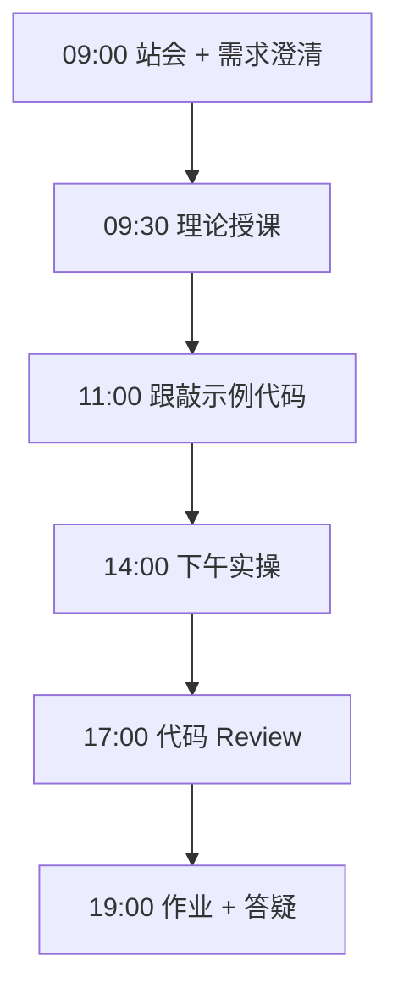

# Day 48：多 Agent 办公助手（上）

> **阶段**：Phase 4：多 Agent 编排 | **Epic**：NEXUS-E4 | **预计学时**：6-8 小时

## 旁白解读：今日上下文

> 🎬 **模拟站会 09:00** — 智链科技 Nexus 项目组

**林悦**：Phase 4 毕业项目 — 办公助手要能写邮件、查政策、排会议。

**今日在 NexusAgent 主线中的位置**：Nexus v0.4 办公自动化 MVP

**今日 Jira 看板**：
- `NEXUS-481`
- `NEXUS-482`
- `NEXUS-483`

---


## 需求文档（产品林悦下发）

**文档编号**：PRD-NEXUS-D48  
**版本**：v1.0  
**优先级**：P0

### 背景

Phase 4：多 Agent 编排阶段第 48 天教学任务，与 NexusAgent 主线项目对齐。

### User Stories

### NEXUS-481

**描述**：多 Agent 办公助手（上） 相关交付

**验收标准**：
- [ ] 代码可本地运行
- [ ] 通过 `scripts/verify_day.py --day 48`

### NEXUS-482

**描述**：多 Agent 办公助手（上） 相关交付

**验收标准**：
- [ ] 代码可本地运行
- [ ] 通过 `scripts/verify_day.py --day 48`

### NEXUS-483

**描述**：多 Agent 办公助手（上） 相关交付

**验收标准**：
- [ ] 代码可本地运行
- [ ] 通过 `scripts/verify_day.py --day 48`


---


## 今日课表

### 上午 09:00-12:00

- 09:00 项目需求：办公自动化
- 10:00 Agent 分工设计
- 11:00 项目脚手架

### 下午 14:00-17:30

- 14:00 实现 Researcher/Writer
- 16:00 Scheduler Agent
- 17:00 单元测试

### 晚自习 19:00-21:00

- 19:00 开始 LangGraph 工作流
- 20:00 联调

---


## 课堂笔记

### 核心知识点速查

| 序号 | 知识点 | 代码位置 |
|------|--------|----------|
| 1 | 多 Agent 架构 | 见下午实操 |
| 2 | 角色分工 | 见下午实操 |
| 3 | 项目脚手架 | 见下午实操 |
| 4 | 单元测试 | 见下午实操 |

### 今日流程图



### 架构示意图（当日目标）

```mermaid
flowchart TD\n  TASK --> SUP[Supervisor]\n  SUP --> R & W & S
```

---


## 实操代码清单

- `code/office_assistant/config.py`
- `code/office_assistant/agents/researcher.py`
- `code/office_assistant/agents/writer.py`
- `code/office_assistant/agents/scheduler.py`
- `code/office_assistant/graph/workflow.py`

请按顺序创建并运行。每段代码均可直接复制到对应文件执行。

---

## 实验手册（分时段操作表）

### 实验步骤 1：09:30-10:30 理论

| 时间 | 动作 | 预期结果 | 失败处理 |
|------|------|----------|----------|
| +0min | 打开课件本节 | 看到需求与验收标准 | 检查是否拉取最新 `develop` 分支 |
| +10min | 创建/打开当日 `code/` 文件 | 文件路径与清单一致 | 对照「实操代码清单」 |
| +30min | 粘贴并运行第一个脚本 | 终端有正常输出无 Traceback | 见下方「排错手册」 |
| +60min | 完成全部文件并自测 | `python3` 运行通过 | 使用 `scripts/verify_day.py --day 48` |
| +90min | 提交 Git 并建 MR | MR 关联 Jira NEXUS-481 | 按附录 Git 示例操作 |


### 实验步骤 2：10:30-12:00 跟敲

| 时间 | 动作 | 预期结果 | 失败处理 |
|------|------|----------|----------|
| +0min | 打开课件本节 | 看到需求与验收标准 | 检查是否拉取最新 `develop` 分支 |
| +10min | 创建/打开当日 `code/` 文件 | 文件路径与清单一致 | 对照「实操代码清单」 |
| +30min | 粘贴并运行第一个脚本 | 终端有正常输出无 Traceback | 见下方「排错手册」 |
| +60min | 完成全部文件并自测 | `python3` 运行通过 | 使用 `scripts/verify_day.py --day 48` |
| +90min | 提交 Git 并建 MR | MR 关联 Jira NEXUS-481 | 按附录 Git 示例操作 |


### 实验步骤 3：14:00-15:30 实操

| 时间 | 动作 | 预期结果 | 失败处理 |
|------|------|----------|----------|
| +0min | 打开课件本节 | 看到需求与验收标准 | 检查是否拉取最新 `develop` 分支 |
| +10min | 创建/打开当日 `code/` 文件 | 文件路径与清单一致 | 对照「实操代码清单」 |
| +30min | 粘贴并运行第一个脚本 | 终端有正常输出无 Traceback | 见下方「排错手册」 |
| +60min | 完成全部文件并自测 | `python3` 运行通过 | 使用 `scripts/verify_day.py --day 48` |
| +90min | 提交 Git 并建 MR | MR 关联 Jira NEXUS-481 | 按附录 Git 示例操作 |


### 实验步骤 4：15:30-17:00 联调

| 时间 | 动作 | 预期结果 | 失败处理 |
|------|------|----------|----------|
| +0min | 打开课件本节 | 看到需求与验收标准 | 检查是否拉取最新 `develop` 分支 |
| +10min | 创建/打开当日 `code/` 文件 | 文件路径与清单一致 | 对照「实操代码清单」 |
| +30min | 粘贴并运行第一个脚本 | 终端有正常输出无 Traceback | 见下方「排错手册」 |
| +60min | 完成全部文件并自测 | `python3` 运行通过 | 使用 `scripts/verify_day.py --day 48` |
| +90min | 提交 Git 并建 MR | MR 关联 Jira NEXUS-481 | 按附录 Git 示例操作 |


### 实验步骤 5：19:00-20:30 作业

| 时间 | 动作 | 预期结果 | 失败处理 |
|------|------|----------|----------|
| +0min | 打开课件本节 | 看到需求与验收标准 | 检查是否拉取最新 `develop` 分支 |
| +10min | 创建/打开当日 `code/` 文件 | 文件路径与清单一致 | 对照「实操代码清单」 |
| +30min | 粘贴并运行第一个脚本 | 终端有正常输出无 Traceback | 见下方「排错手册」 |
| +60min | 完成全部文件并自测 | `python3` 运行通过 | 使用 `scripts/verify_day.py --day 48` |
| +90min | 提交 Git 并建 MR | MR 关联 Jira NEXUS-481 | 按附录 Git 示例操作 |


### 排错手册（Day 48）

1. **`command not found: python3`** → 安装 Python 3.10+ 或使用 `py -3`（Windows）
2. **`ModuleNotFoundError`** → 确认当前目录、是否激活 venv、`pip install -r requirements.txt`（若当日有）
3. **`SyntaxError: invalid syntax`** → 检查上一行是否缺括号、引号是否中文
4. **`UnicodeDecodeError`** → 文件保存为 UTF-8，终端 `export PYTHONIOENCODING=utf-8`
5. **API 相关（Day12+）** → 检查 `.env` 中 Key，无 Key 时使用课件 MOCK 模式

---


## 逐步跟敲指南（完整源码与解析）

> 以下代码与 `code/` 目录完全一致，可直接复制。每段附行级说明。

### 文件：`code/office_assistant/config.py`

**操作步骤**：
1. 在 `courseware/day-48/code/` 下创建文件 `office_assistant/config.py`
2. 完整粘贴下方代码
3. 在终端执行：`cd courseware/day-48/code && python3 config.py`（若为包内模块则按课件说明）

```python
#!/usr/bin/env python3
"""多 Agent 办公助手 — 配置"""
import os
from pathlib import Path

DATA_DIR = Path("data")
LLM_MODEL = os.getenv("DEEPSEEK_MODEL", "deepseek-chat")
API_KEY = os.getenv("DEEPSEEK_API_KEY", "")
API_BASE = os.getenv("DEEPSEEK_BASE_URL", "https://api.deepseek.com")
MAX_ITERATIONS = 8

```

**解析要点（`office_assistant/config.py`）**：

- 共 **10** 行，请逐行阅读注释中的中文说明

- 运行前确认 Python 版本 ≥ 3.10：`python3 --version`

- 若报错，先检查缩进是否为 4 空格，勿混用 Tab

- 企业 Review 清单：命名是否清晰、是否有异常处理、是否可复用

---

### 文件：`code/office_assistant/agents/researcher.py`

**操作步骤**：
1. 在 `courseware/day-48/code/` 下创建文件 `office_assistant/agents/researcher.py`
2. 完整粘贴下方代码
3. 在终端执行：`cd courseware/day-48/code && python3 researcher.py`（若为包内模块则按课件说明）

```python
#!/usr/bin/env python3
"""Researcher Agent — 检索与信息收集"""
from dataclasses import dataclass

@dataclass
class ResearchResult:
  query: str
  findings: list[str]

class ResearcherAgent:
  def run(self, task: str) -> ResearchResult:
    # 模拟检索企业知识库与网络
    findings = [
      f"内部文档: 关于「{task}」的政策摘要",
      f"近期工单: 3 条相关记录",
    ]
    return ResearchResult(query=task, findings=findings)

```

**解析要点（`office_assistant/agents/researcher.py`）**：

- 共 **17** 行，请逐行阅读注释中的中文说明

- 运行前确认 Python 版本 ≥ 3.10：`python3 --version`

- 若报错，先检查缩进是否为 4 空格，勿混用 Tab

- 企业 Review 清单：命名是否清晰、是否有异常处理、是否可复用

---

### 文件：`code/office_assistant/agents/writer.py`

**操作步骤**：
1. 在 `courseware/day-48/code/` 下创建文件 `office_assistant/agents/writer.py`
2. 完整粘贴下方代码
3. 在终端执行：`cd courseware/day-48/code && python3 writer.py`（若为包内模块则按课件说明）

```python
#!/usr/bin/env python3
"""Writer Agent — 文档与邮件撰写"""
from dataclasses import dataclass

@dataclass
class Draft:
  title: str
  body: str

class WriterAgent:
  def run(self, task: str, context: str) -> Draft:
    body = f"根据以下资料撰写:\n{context}\n\n---\n{task} 的回复草稿..."
    return Draft(title=task[:30], body=body)

```

**解析要点（`office_assistant/agents/writer.py`）**：

- 共 **13** 行，请逐行阅读注释中的中文说明

- 运行前确认 Python 版本 ≥ 3.10：`python3 --version`

- 若报错，先检查缩进是否为 4 空格，勿混用 Tab

- 企业 Review 清单：命名是否清晰、是否有异常处理、是否可复用

---

### 文件：`code/office_assistant/agents/scheduler.py`

**操作步骤**：
1. 在 `courseware/day-48/code/` 下创建文件 `office_assistant/agents/scheduler.py`
2. 完整粘贴下方代码
3. 在终端执行：`cd courseware/day-48/code && python3 scheduler.py`（若为包内模块则按课件说明）

```python
#!/usr/bin/env python3
"""Scheduler Agent — 会议与日程安排"""
from dataclasses import dataclass
from datetime import datetime, timedelta

@dataclass
class Meeting:
  title: str
  start: datetime
  duration_min: int

class SchedulerAgent:
  def propose(self, title: str) -> Meeting:
    start = datetime.now() + timedelta(days=1)
    return Meeting(title=title, start=start, duration_min=60)

  def format_invite(self, m: Meeting) -> str:
    return f"会议邀请: {m.title} @ {m.start.isoformat()} ({m.duration_min}min)"

```

**解析要点（`office_assistant/agents/scheduler.py`）**：

- 共 **18** 行，请逐行阅读注释中的中文说明

- 运行前确认 Python 版本 ≥ 3.10：`python3 --version`

- 若报错，先检查缩进是否为 4 空格，勿混用 Tab

- 企业 Review 清单：命名是否清晰、是否有异常处理、是否可复用

---

### 文件：`code/office_assistant/graph/workflow.py`

**操作步骤**：
1. 在 `courseware/day-48/code/` 下创建文件 `office_assistant/graph/workflow.py`
2. 完整粘贴下方代码
3. 在终端执行：`cd courseware/day-48/code && python3 workflow.py`（若为包内模块则按课件说明）

```python
#!/usr/bin/env python3
"""LangGraph 工作流 — Supervisor 调度多 Agent"""
from typing import TypedDict, Literal
from langgraph.graph import StateGraph, END
import sys
from pathlib import Path
sys.path.insert(0, str(Path(__file__).resolve().parent.parent))
from agents.researcher import ResearcherAgent
from agents.writer import WriterAgent
from agents.scheduler import SchedulerAgent

class OfficeState(TypedDict):
  task: str
  route: str
  context: str
  output: str

researcher = ResearcherAgent()
writer = WriterAgent()
scheduler = SchedulerAgent()

def supervisor(state: OfficeState) -> OfficeState:
  t = state["task"]
  if "会议" in t or "日程" in t:
    state["route"] = "scheduler"
  elif "写" in t or "邮件" in t or "报告" in t:
    state["route"] = "writer"
  else:
    state["route"] = "researcher"
  return state

def run_researcher(state: OfficeState) -> OfficeState:
  r = researcher.run(state["task"])
  state["context"] = "\n".join(r.findings)
  state["output"] = state["context"]
  return state

def run_writer(state: OfficeState) -> OfficeState:
  if not state.get("context"):
    run_researcher(state)
  d = writer.run(state["task"], state["context"])
  state["output"] = d.body
  return state

def run_scheduler(state: OfficeState) -> OfficeState:
  m = scheduler.propose(state["task"])
  state["output"] = scheduler.format_invite(m)
  return state

def route(state: OfficeState) -> Literal["researcher", "writer", "scheduler"]:
  return state["route"]

def build_graph():
  g = StateGraph(OfficeState)
  g.add_node("supervisor", supervisor)
  g.add_node("researcher", run_researcher)
  g.add_node("writer", run_writer)
  g.add_node("scheduler", run_scheduler)
  g.set_entry_point("supervisor")
  g.add_conditional_edges("supervisor", route, {
    "researcher": "researcher", "writer": "writer", "scheduler": "scheduler"
  })
  g.add_edge("researcher", END)
  g.add_edge("writer", END)
  g.add_edge("scheduler", END)
  return g.compile()

if __name__ == "__main__":
  app = build_graph()
  for task in ["查询年假政策", "写一封项目周报邮件", "安排下周评审会议"]:
    print(task, "->", app.invoke({"task": task, "route": "", "context": "", "output": ""})["output"][:80])

```

**解析要点（`office_assistant/graph/workflow.py`）**：

- 共 **71** 行，请逐行阅读注释中的中文说明

- 运行前确认 Python 版本 ≥ 3.10：`python3 --version`

- 若报错，先检查缩进是否为 4 空格，勿混用 Tab

- 企业 Review 清单：命名是否清晰、是否有异常处理、是否可复用

---


### 深度讲解 1：多 Agent 架构

在企业级 Python 开发与大模型应用工程中，**多 Agent 架构** 是学员必须牢固掌握的基本功。智链科技 Nexus 项目组在 Day 48 的代码评审中，特别强调以下几点：

1. **为什么学**：多 Agent 架构 直接服务于后续 NexusAgent 平台的 `NEXUS-E4` 模块。没有扎实的 多 Agent 架构，Day 55 之后调用 API、解析 JSON、编写 Agent 工具函数时会出现大量低级错误。

2. **常见坑**：
   - 忽略输入类型校验，导致运行时 `TypeError`
   - 编码问题（Windows 默认 GBK vs UTF-8）
   - 复制粘贴时缩进错乱（Python 对缩进敏感）

3. **企业实践**：在 SmartLink 的 GitLab 仓库中，所有与 多 Agent 架构 相关的代码必须经过 Ruff 静态检查；变量命名使用 `snake_case`，常量使用 `UPPER_SNAKE_CASE`。

4. **与主线项目的关系**：今日代码位于 `courseware/day-48/code/`，部分模块将逐步合并到 `platform/nexus_agent/`。请养成「每日代码皆可运行、皆可测试」的习惯。

5. **扩展阅读建议**：完成今日作业后，可阅读 `docs/project-master-plan.md` 中关于 NEXUS-E4 的章节，建立全局视角。

**课堂互动题**：请用 3 句话向非技术同事解释「多 Agent 架构」是什么。写在作业 MR 的评论里，讲师会抽查点评。

**实操检查清单**：
- [ ] 能不看课件复述 多 Agent 架构 的定义
- [ ] 能独立写出相关代码并运行
- [ ] 能向同学讲解一处容易写错的地方


### 深度讲解 2：角色分工

在企业级 Python 开发与大模型应用工程中，**角色分工** 是学员必须牢固掌握的基本功。智链科技 Nexus 项目组在 Day 48 的代码评审中，特别强调以下几点：

1. **为什么学**：角色分工 直接服务于后续 NexusAgent 平台的 `NEXUS-E4` 模块。没有扎实的 角色分工，Day 55 之后调用 API、解析 JSON、编写 Agent 工具函数时会出现大量低级错误。

2. **常见坑**：
   - 忽略输入类型校验，导致运行时 `TypeError`
   - 编码问题（Windows 默认 GBK vs UTF-8）
   - 复制粘贴时缩进错乱（Python 对缩进敏感）

3. **企业实践**：在 SmartLink 的 GitLab 仓库中，所有与 角色分工 相关的代码必须经过 Ruff 静态检查；变量命名使用 `snake_case`，常量使用 `UPPER_SNAKE_CASE`。

4. **与主线项目的关系**：今日代码位于 `courseware/day-48/code/`，部分模块将逐步合并到 `platform/nexus_agent/`。请养成「每日代码皆可运行、皆可测试」的习惯。

5. **扩展阅读建议**：完成今日作业后，可阅读 `docs/project-master-plan.md` 中关于 NEXUS-E4 的章节，建立全局视角。

**课堂互动题**：请用 3 句话向非技术同事解释「角色分工」是什么。写在作业 MR 的评论里，讲师会抽查点评。

**实操检查清单**：
- [ ] 能不看课件复述 角色分工 的定义
- [ ] 能独立写出相关代码并运行
- [ ] 能向同学讲解一处容易写错的地方


### 深度讲解 3：项目脚手架

在企业级 Python 开发与大模型应用工程中，**项目脚手架** 是学员必须牢固掌握的基本功。智链科技 Nexus 项目组在 Day 48 的代码评审中，特别强调以下几点：

1. **为什么学**：项目脚手架 直接服务于后续 NexusAgent 平台的 `NEXUS-E4` 模块。没有扎实的 项目脚手架，Day 55 之后调用 API、解析 JSON、编写 Agent 工具函数时会出现大量低级错误。

2. **常见坑**：
   - 忽略输入类型校验，导致运行时 `TypeError`
   - 编码问题（Windows 默认 GBK vs UTF-8）
   - 复制粘贴时缩进错乱（Python 对缩进敏感）

3. **企业实践**：在 SmartLink 的 GitLab 仓库中，所有与 项目脚手架 相关的代码必须经过 Ruff 静态检查；变量命名使用 `snake_case`，常量使用 `UPPER_SNAKE_CASE`。

4. **与主线项目的关系**：今日代码位于 `courseware/day-48/code/`，部分模块将逐步合并到 `platform/nexus_agent/`。请养成「每日代码皆可运行、皆可测试」的习惯。

5. **扩展阅读建议**：完成今日作业后，可阅读 `docs/project-master-plan.md` 中关于 NEXUS-E4 的章节，建立全局视角。

**课堂互动题**：请用 3 句话向非技术同事解释「项目脚手架」是什么。写在作业 MR 的评论里，讲师会抽查点评。

**实操检查清单**：
- [ ] 能不看课件复述 项目脚手架 的定义
- [ ] 能独立写出相关代码并运行
- [ ] 能向同学讲解一处容易写错的地方


### 深度讲解 4：单元测试

在企业级 Python 开发与大模型应用工程中，**单元测试** 是学员必须牢固掌握的基本功。智链科技 Nexus 项目组在 Day 48 的代码评审中，特别强调以下几点：

1. **为什么学**：单元测试 直接服务于后续 NexusAgent 平台的 `NEXUS-E4` 模块。没有扎实的 单元测试，Day 55 之后调用 API、解析 JSON、编写 Agent 工具函数时会出现大量低级错误。

2. **常见坑**：
   - 忽略输入类型校验，导致运行时 `TypeError`
   - 编码问题（Windows 默认 GBK vs UTF-8）
   - 复制粘贴时缩进错乱（Python 对缩进敏感）

3. **企业实践**：在 SmartLink 的 GitLab 仓库中，所有与 单元测试 相关的代码必须经过 Ruff 静态检查；变量命名使用 `snake_case`，常量使用 `UPPER_SNAKE_CASE`。

4. **与主线项目的关系**：今日代码位于 `courseware/day-48/code/`，部分模块将逐步合并到 `platform/nexus_agent/`。请养成「每日代码皆可运行、皆可测试」的习惯。

5. **扩展阅读建议**：完成今日作业后，可阅读 `docs/project-master-plan.md` 中关于 NEXUS-E4 的章节，建立全局视角。

**课堂互动题**：请用 3 句话向非技术同事解释「单元测试」是什么。写在作业 MR 的评论里，讲师会抽查点评。

**实操检查清单**：
- [ ] 能不看课件复述 单元测试 的定义
- [ ] 能独立写出相关代码并运行
- [ ] 能向同学讲解一处容易写错的地方


## 阶段复盘锚点（Phase 4：多 Agent 编排）

今天是 **Phase 4：多 Agent 编排** 的第 **8** 个学习日。请回顾：

- 昨天学了什么？今天如何承接？
- 今天的内容在 70 天路线图中的坐标？
- 如果我是 Tech Lead，会如何 Review 今日代码？

**陈工寄语**：慢即是快。企业里没人关心你一天学了多少个语法点，只关心你写的脚本能不能在服务器上稳定跑 7×24 小时。今天把地基打牢，后面 Agent 编排、RAG 检索才不会塌。

**林悦补充**：产品侧只验收「用户能感知到的价值」。今日交付虽然简单，但「个人信息卡片」本质是后续「用户画像 Agent」的数据采集原型——字段设计请认真思考。

**代码量统计（累计）**：完成今日后，个人仓库累计约 **67200** 行（含注释与测试），全营目标 10 万行。

**明日预告**：请提前阅读 `courseware/day-49/README.md` 开头的旁白，了解上下文。


## 常见问题 FAQ（讲师答疑实录）


**Q1：学习「多 Agent 架构」时最常问的问题是什么？**

A：学员常问「这在大模型开发里到底用在哪里」。直接回答：在 NexusAgent 的 `NEXUS-E4` 中，多 Agent 架构 用于支撑「多 Agent 办公助手（上）」这一交付。建议你打开 `platform/` 对照看未来模块如何引用今日写法。另一个常见问题是「要不要背语法」——不需要背，但要能写出可运行代码，并能在报错时读懂 Traceback。

**追问**：如果线上报错与 多 Agent 架构 相关，如何排查？  
**答**：① 复现 ② 最小化输入 ③ 打印中间变量 ④ 查 GitLab 历史 diff ⑤ 在 Jira 建 Bug 单附上日志。


**Q2：学习「角色分工」时最常问的问题是什么？**

A：学员常问「这在大模型开发里到底用在哪里」。直接回答：在 NexusAgent 的 `NEXUS-E4` 中，角色分工 用于支撑「多 Agent 办公助手（上）」这一交付。建议你打开 `platform/` 对照看未来模块如何引用今日写法。另一个常见问题是「要不要背语法」——不需要背，但要能写出可运行代码，并能在报错时读懂 Traceback。

**追问**：如果线上报错与 角色分工 相关，如何排查？  
**答**：① 复现 ② 最小化输入 ③ 打印中间变量 ④ 查 GitLab 历史 diff ⑤ 在 Jira 建 Bug 单附上日志。


**Q3：学习「项目脚手架」时最常问的问题是什么？**

A：学员常问「这在大模型开发里到底用在哪里」。直接回答：在 NexusAgent 的 `NEXUS-E4` 中，项目脚手架 用于支撑「多 Agent 办公助手（上）」这一交付。建议你打开 `platform/` 对照看未来模块如何引用今日写法。另一个常见问题是「要不要背语法」——不需要背，但要能写出可运行代码，并能在报错时读懂 Traceback。

**追问**：如果线上报错与 项目脚手架 相关，如何排查？  
**答**：① 复现 ② 最小化输入 ③ 打印中间变量 ④ 查 GitLab 历史 diff ⑤ 在 Jira 建 Bug 单附上日志。


**Q4：学习「单元测试」时最常问的问题是什么？**

A：学员常问「这在大模型开发里到底用在哪里」。直接回答：在 NexusAgent 的 `NEXUS-E4` 中，单元测试 用于支撑「多 Agent 办公助手（上）」这一交付。建议你打开 `platform/` 对照看未来模块如何引用今日写法。另一个常见问题是「要不要背语法」——不需要背，但要能写出可运行代码，并能在报错时读懂 Traceback。

**追问**：如果线上报错与 单元测试 相关，如何排查？  
**答**：① 复现 ② 最小化输入 ③ 打印中间变量 ④ 查 GitLab 历史 diff ⑤ 在 Jira 建 Bug 单附上日志。


## 面试押题（与今日知识点挂钩）

以下题目会出现在 Day 67-69 模拟面试中，建议今日就开始积累答案：

1. **多 Agent 架构**：请结合 NexusAgent 项目举例说明你在哪一天、哪段代码里用到了它？
2. **角色分工**：请结合 NexusAgent 项目举例说明你在哪一天、哪段代码里用到了它？
3. **项目脚手架**：请结合 NexusAgent 项目举例说明你在哪一天、哪段代码里用到了它？
4. **单元测试**：请结合 NexusAgent 项目举例说明你在哪一天、哪段代码里用到了它？

**参考答案思路**：采用 STAR 法则（情境-任务-行动-结果），引用 `courseware/day-48/code/` 中的具体文件名与函数名。

---


## Code Review 检查表（陈工版）

合并 MR 前自查：

- [ ] 所有新增 `.py` 文件顶部有模块说明 docstring
- [ ] 无硬编码密钥（API Key 走环境变量）
- [ ] 函数长度 < 50 行，过长则拆分
- [ ] 异常有明确提示，禁止裸 `except:`
- [ ] 提交信息符合 `feat(day-48): ...`
- [ ] README 或注释说明如何运行
- [ ] 与 Jira Story 验收标准逐条对应

**今日重点审查项**：多 Agent 办公助手（上） 相关逻辑是否可读、可测、可扩展至 `platform/nexus_agent/`。

---


## 课后作业

### 作业说明

完成三个 Agent 类，各写 2 个单元测试。

### 提交要求

1. 代码提交到分支 `feature/day-48-homework`
2. GitLab MR 标题：`[Day-48] homework: 课后作业`
3. 在 MR 描述中附上运行截图或终端输出

### 评分标准（满分 100）

| 项 | 分值 |
|----|------|
| 功能完整 | 40 |
| 代码规范与注释 | 30 |
| 异常处理 | 15 |
| MR 与 Jira 关联 | 15 |

---

## 作业参考答案

> ⚠️ 请先独立完成再对照答案

pytest 测试 ResearcherAgent.run 返回 findings 非空。

---


## 附录：Git 提交示例

```bash
git checkout develop
git pull origin develop
git checkout -b feature/day-48-多-agent-办公
# 完成代码后
git add courseware/day-48/
git commit -m "feat(day-48): 多 Agent 办公助手（上）"
git push -u origin feature/day-48-多-agent-办公
```

---

*课件版本 Day-48-v1.0 | 智链科技培训中心*
