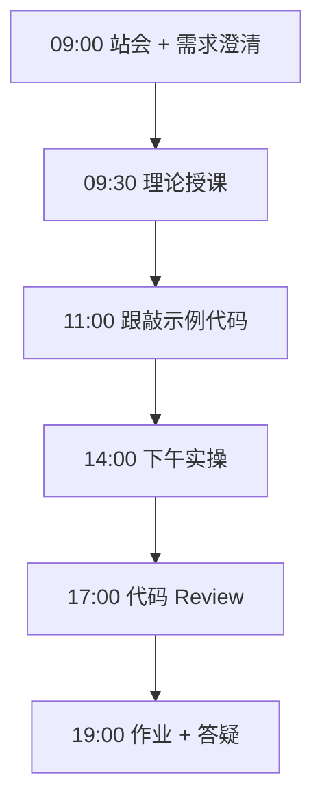
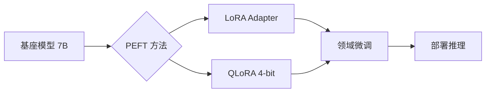

# Day 51：微调理论：LoRA/QLoRA 与参数高效微调

> **阶段**：Phase 5：微调与部署 | **Epic**：NEXUS-E5 | **预计学时**：6-8 小时

## 旁白解读：今日上下文

> 🎬 **模拟站会 09:00** — 智链科技 Nexus 项目组

陈工：「多 Agent 编排跑通了，但通用模型对智链产品术语理解不够。今天开始学微调——不是让你训一个 GPT-4，而是用 LoRA 让 7B 模型'懂行'。」林悦：「产品要求客服回答必须准确引用内部文档，通用 API 幻觉率太高，微调是降本增效的关键路径。」

**今日在 NexusAgent 主线中的位置**：为 NexusAgent 平台接入领域微调模型做准备

**今日 Jira 看板**：
- `NEXUS-501`
- `NEXUS-502`

---


## 需求文档（产品林悦下发）

**文档编号**：PRD-NEXUS-D51  
**版本**：v1.0  
**优先级**：P0

### 背景

Phase 5：微调与部署阶段第 51 天教学任务，与 NexusAgent 主线项目对齐。

### User Stories

### NEXUS-501

**描述**：微调理论：LoRA/QLoRA 与参数高效微调 相关交付

**验收标准**：
- [ ] 代码可本地运行
- [ ] 通过 `scripts/verify_day.py --day 51`

### NEXUS-502

**描述**：微调理论：LoRA/QLoRA 与参数高效微调 相关交付

**验收标准**：
- [ ] 代码可本地运行
- [ ] 通过 `scripts/verify_day.py --day 51`


---


## 今日课表

### 上午 09:00-12:00

- 站会：回顾 Day 50 多 Agent 编排成果，引入模型微调需求
- 理论：全量微调 vs 参数高效微调（PEFT）对比
- 深入 LoRA 低秩分解数学原理与显存估算
- QLoRA 4-bit 量化 + LoRA 的企业选型指南

### 下午 14:00-17:30

- 跟敲 lora_math.py：计算 7B 模型 LoRA 参数量占比
- 运行 compare_methods.py 对比 Full FT / LoRA / QLoRA
- 阅读 peft_overview.md，讨论智链科技场景选型
- 小组讨论：客服知识库该用多大 rank？

### 晚自习 19:00-21:00

- 完成课后作业：为自选场景估算 LoRA 参数量
- 预习 Alpaca 数据格式与 LLaMA-Factory 文档
- 在 Jira 关联 NEXUS-501 Story

---


## 课堂笔记

### 核心知识点速查

| 序号 | 知识点 | 代码位置 |
|------|--------|----------|
| 1 | LoRA 低秩分解 | 见下午实操 |
| 2 | QLoRA 量化微调 | 见下午实操 |
| 3 | PEFT 参数效率 | 见下午实操 |
| 4 | 显存估算 | 见下午实操 |
| 5 | 微调方法选型 | 见下午实操 |

### 今日流程图



### 架构示意图（当日目标）



---


## 实操代码清单

- `code/finetune_theory/lora_math.py`
- `code/finetune_theory/peft_overview.md`
- `code/finetune_theory/compare_methods.py`

请按顺序创建并运行。每段代码均可直接复制到对应文件执行。

---

## 实验手册（分时段操作表）

### 实验步骤 1：09:30-10:30 理论

| 时间 | 动作 | 预期结果 | 失败处理 |
|------|------|----------|----------|
| +0min | 打开课件本节 | 看到需求与验收标准 | 检查是否拉取最新 `develop` 分支 |
| +10min | 创建/打开当日 `code/` 文件 | 文件路径与清单一致 | 对照「实操代码清单」 |
| +30min | 粘贴并运行第一个脚本 | 终端有正常输出无 Traceback | 见下方「排错手册」 |
| +60min | 完成全部文件并自测 | `python3` 运行通过 | 使用 `scripts/verify_day.py --day 51` |
| +90min | 提交 Git 并建 MR | MR 关联 Jira NEXUS-501 | 按附录 Git 示例操作 |


### 实验步骤 2：10:30-12:00 跟敲

| 时间 | 动作 | 预期结果 | 失败处理 |
|------|------|----------|----------|
| +0min | 打开课件本节 | 看到需求与验收标准 | 检查是否拉取最新 `develop` 分支 |
| +10min | 创建/打开当日 `code/` 文件 | 文件路径与清单一致 | 对照「实操代码清单」 |
| +30min | 粘贴并运行第一个脚本 | 终端有正常输出无 Traceback | 见下方「排错手册」 |
| +60min | 完成全部文件并自测 | `python3` 运行通过 | 使用 `scripts/verify_day.py --day 51` |
| +90min | 提交 Git 并建 MR | MR 关联 Jira NEXUS-501 | 按附录 Git 示例操作 |


### 实验步骤 3：14:00-15:30 实操

| 时间 | 动作 | 预期结果 | 失败处理 |
|------|------|----------|----------|
| +0min | 打开课件本节 | 看到需求与验收标准 | 检查是否拉取最新 `develop` 分支 |
| +10min | 创建/打开当日 `code/` 文件 | 文件路径与清单一致 | 对照「实操代码清单」 |
| +30min | 粘贴并运行第一个脚本 | 终端有正常输出无 Traceback | 见下方「排错手册」 |
| +60min | 完成全部文件并自测 | `python3` 运行通过 | 使用 `scripts/verify_day.py --day 51` |
| +90min | 提交 Git 并建 MR | MR 关联 Jira NEXUS-501 | 按附录 Git 示例操作 |


### 实验步骤 4：15:30-17:00 联调

| 时间 | 动作 | 预期结果 | 失败处理 |
|------|------|----------|----------|
| +0min | 打开课件本节 | 看到需求与验收标准 | 检查是否拉取最新 `develop` 分支 |
| +10min | 创建/打开当日 `code/` 文件 | 文件路径与清单一致 | 对照「实操代码清单」 |
| +30min | 粘贴并运行第一个脚本 | 终端有正常输出无 Traceback | 见下方「排错手册」 |
| +60min | 完成全部文件并自测 | `python3` 运行通过 | 使用 `scripts/verify_day.py --day 51` |
| +90min | 提交 Git 并建 MR | MR 关联 Jira NEXUS-501 | 按附录 Git 示例操作 |


### 实验步骤 5：19:00-20:30 作业

| 时间 | 动作 | 预期结果 | 失败处理 |
|------|------|----------|----------|
| +0min | 打开课件本节 | 看到需求与验收标准 | 检查是否拉取最新 `develop` 分支 |
| +10min | 创建/打开当日 `code/` 文件 | 文件路径与清单一致 | 对照「实操代码清单」 |
| +30min | 粘贴并运行第一个脚本 | 终端有正常输出无 Traceback | 见下方「排错手册」 |
| +60min | 完成全部文件并自测 | `python3` 运行通过 | 使用 `scripts/verify_day.py --day 51` |
| +90min | 提交 Git 并建 MR | MR 关联 Jira NEXUS-501 | 按附录 Git 示例操作 |


### 排错手册（Day 51）

1. **`command not found: python3`** → 安装 Python 3.10+ 或使用 `py -3`（Windows）
2. **`ModuleNotFoundError`** → 确认当前目录、是否激活 venv、`pip install -r requirements.txt`（若当日有）
3. **`SyntaxError: invalid syntax`** → 检查上一行是否缺括号、引号是否中文
4. **`UnicodeDecodeError`** → 文件保存为 UTF-8，终端 `export PYTHONIOENCODING=utf-8`
5. **API 相关（Day12+）** → 检查 `.env` 中 Key，无 Key 时使用课件 MOCK 模式

---


## 逐步跟敲指南（完整源码与解析）

> 以下代码与 `code/` 目录完全一致，可直接复制。每段附行级说明。

### 文件：`code/finetune_theory/lora_math.py`

**操作步骤**：
1. 在 `courseware/day-51/code/` 下创建文件 `finetune_theory/lora_math.py`
2. 完整粘贴下方代码
3. 在终端执行：`cd courseware/day-51/code && python3 lora_math.py`（若为包内模块则按课件说明）

```python
#!/usr/bin/env python3
"""
Day 51 — 微调理论：LoRA 低秩分解参数量估算
演示为何 LoRA 能以极少参数实现高效微调
"""
from __future__ import annotations


def lora_param_count(
    in_features: int,
    out_features: int,
    rank: int,
    num_layers: int = 1,
) -> int:
    """
    计算 LoRA 可训练参数量
    每层 LoRA: A(in×r) + B(r×out) = r*(in+out)
    """
    per_layer = rank * (in_features + out_features)
    return per_layer * num_layers


def full_finetune_param_count(num_params_billion: float) -> int:
    """全量微调参数量（单位：个）"""
    return int(num_params_billion * 1e9)


def main() -> None:
    # 以 7B 模型 hidden=4096, 32 层 attention 为例
    hidden = 4096
    layers = 32
    rank = 8

    lora_params = lora_param_count(hidden, hidden, rank, layers * 4)  # Q/K/V/O
    full_params = full_finetune_param_count(7.0)

    ratio = lora_params / full_params * 100
    print(f"全量微调参数量: {full_params:,}")
    print(f"LoRA(r={rank}) 可训练参数: {lora_params:,}")
    print(f"LoRA 占比: {ratio:.4f}%")
    print("\n结论: LoRA 将显存与存储需求降低 2-3 个数量级，适合企业领域适配。")


if __name__ == "__main__":
    main()

```

**解析要点（`finetune_theory/lora_math.py`）**：

- 共 **45** 行，请逐行阅读注释中的中文说明

- 运行前确认 Python 版本 ≥ 3.10：`python3 --version`

- 若报错，先检查缩进是否为 4 空格，勿混用 Tab

- 企业 Review 清单：命名是否清晰、是否有异常处理、是否可复用

---

### 文件：`code/finetune_theory/peft_overview.md`

**操作步骤**：
1. 在 `courseware/day-51/code/` 下创建文件 `finetune_theory/peft_overview.md`
2. 完整粘贴下方代码
3. 在终端执行：`cd courseware/day-51/code && python3 peft_overview.md.py`（若为包内模块则按课件说明）

```python
# 微调方法速查

| 方法 | 可训练参数 | 显存需求 | 适用场景 |
|------|-----------|---------|---------|
| Full FT | 100% | 极高 | 充足算力 + 大数据 |
| LoRA | 0.1%-1% | 中 | 领域适配首选 |
| QLoRA | 0.1%-1% | 低 | 单卡 24G 微调 7B |
| Adapter | 1%-5% | 中 | 多任务切换 |

## 智链科技选型建议
- 客服知识库问答：QLoRA + Qwen2.5-7B
- 代码助手：LoRA + DeepSeek-Coder
- 内部文档摘要：LoRA + 通用基座

```

**解析要点（`finetune_theory/peft_overview.md`）**：

- 共 **13** 行，请逐行阅读注释中的中文说明

- 运行前确认 Python 版本 ≥ 3.10：`python3 --version`

- 若报错，先检查缩进是否为 4 空格，勿混用 Tab

- 企业 Review 清单：命名是否清晰、是否有异常处理、是否可复用

---

### 文件：`code/finetune_theory/compare_methods.py`

**操作步骤**：
1. 在 `courseware/day-51/code/` 下创建文件 `finetune_theory/compare_methods.py`
2. 完整粘贴下方代码
3. 在终端执行：`cd courseware/day-51/code && python3 compare_methods.py`（若为包内模块则按课件说明）

```python
#!/usr/bin/env python3
"""对比不同微调策略的配置差异（教学演示，非真实训练）"""
from dataclasses import dataclass


@dataclass
class FinetuneConfig:
    method: str
    base_model: str
    trainable_ratio: str
    min_vram_gb: int
    recommended_dataset_size: str


PRESETS = [
    FinetuneConfig("Full FT", "Qwen2.5-7B", "100%", 80, "10万+"),
    FinetuneConfig("LoRA", "Qwen2.5-7B", "~0.5%", 24, "5000+"),
    FinetuneConfig("QLoRA", "Qwen2.5-7B", "~0.5%", 16, "3000+"),
]


def print_comparison() -> None:
    print(f"{'方法':<10} {'基座':<14} {'可训练':<8} {'最低显存':<10} {'数据量'}")
    print("-" * 60)
    for p in PRESETS:
        print(f"{p.method:<10} {p.base_model:<14} {p.trainable_ratio:<8} {p.min_vram_gb}GB{'':<6} {p.recommended_dataset_size}")


if __name__ == "__main__":
    print_comparison()

```

**解析要点（`finetune_theory/compare_methods.py`）**：

- 共 **30** 行，请逐行阅读注释中的中文说明

- 运行前确认 Python 版本 ≥ 3.10：`python3 --version`

- 若报错，先检查缩进是否为 4 空格，勿混用 Tab

- 企业 Review 清单：命名是否清晰、是否有异常处理、是否可复用

---


### 深度讲解 1：LoRA 低秩分解

在企业级 Python 开发与大模型应用工程中，**LoRA 低秩分解** 是学员必须牢固掌握的基本功。智链科技 Nexus 项目组在 Day 51 的代码评审中，特别强调以下几点：

1. **为什么学**：LoRA 低秩分解 直接服务于后续 NexusAgent 平台的 `NEXUS-E5` 模块。没有扎实的 LoRA 低秩分解，Day 58 之后调用 API、解析 JSON、编写 Agent 工具函数时会出现大量低级错误。

2. **常见坑**：
   - 忽略输入类型校验，导致运行时 `TypeError`
   - 编码问题（Windows 默认 GBK vs UTF-8）
   - 复制粘贴时缩进错乱（Python 对缩进敏感）

3. **企业实践**：在 SmartLink 的 GitLab 仓库中，所有与 LoRA 低秩分解 相关的代码必须经过 Ruff 静态检查；变量命名使用 `snake_case`，常量使用 `UPPER_SNAKE_CASE`。

4. **与主线项目的关系**：今日代码位于 `courseware/day-51/code/`，部分模块将逐步合并到 `platform/nexus_agent/`。请养成「每日代码皆可运行、皆可测试」的习惯。

5. **扩展阅读建议**：完成今日作业后，可阅读 `docs/project-master-plan.md` 中关于 NEXUS-E5 的章节，建立全局视角。

**课堂互动题**：请用 3 句话向非技术同事解释「LoRA 低秩分解」是什么。写在作业 MR 的评论里，讲师会抽查点评。

**实操检查清单**：
- [ ] 能不看课件复述 LoRA 低秩分解 的定义
- [ ] 能独立写出相关代码并运行
- [ ] 能向同学讲解一处容易写错的地方


### 深度讲解 2：QLoRA 量化微调

在企业级 Python 开发与大模型应用工程中，**QLoRA 量化微调** 是学员必须牢固掌握的基本功。智链科技 Nexus 项目组在 Day 51 的代码评审中，特别强调以下几点：

1. **为什么学**：QLoRA 量化微调 直接服务于后续 NexusAgent 平台的 `NEXUS-E5` 模块。没有扎实的 QLoRA 量化微调，Day 58 之后调用 API、解析 JSON、编写 Agent 工具函数时会出现大量低级错误。

2. **常见坑**：
   - 忽略输入类型校验，导致运行时 `TypeError`
   - 编码问题（Windows 默认 GBK vs UTF-8）
   - 复制粘贴时缩进错乱（Python 对缩进敏感）

3. **企业实践**：在 SmartLink 的 GitLab 仓库中，所有与 QLoRA 量化微调 相关的代码必须经过 Ruff 静态检查；变量命名使用 `snake_case`，常量使用 `UPPER_SNAKE_CASE`。

4. **与主线项目的关系**：今日代码位于 `courseware/day-51/code/`，部分模块将逐步合并到 `platform/nexus_agent/`。请养成「每日代码皆可运行、皆可测试」的习惯。

5. **扩展阅读建议**：完成今日作业后，可阅读 `docs/project-master-plan.md` 中关于 NEXUS-E5 的章节，建立全局视角。

**课堂互动题**：请用 3 句话向非技术同事解释「QLoRA 量化微调」是什么。写在作业 MR 的评论里，讲师会抽查点评。

**实操检查清单**：
- [ ] 能不看课件复述 QLoRA 量化微调 的定义
- [ ] 能独立写出相关代码并运行
- [ ] 能向同学讲解一处容易写错的地方


### 深度讲解 3：PEFT 参数效率

在企业级 Python 开发与大模型应用工程中，**PEFT 参数效率** 是学员必须牢固掌握的基本功。智链科技 Nexus 项目组在 Day 51 的代码评审中，特别强调以下几点：

1. **为什么学**：PEFT 参数效率 直接服务于后续 NexusAgent 平台的 `NEXUS-E5` 模块。没有扎实的 PEFT 参数效率，Day 58 之后调用 API、解析 JSON、编写 Agent 工具函数时会出现大量低级错误。

2. **常见坑**：
   - 忽略输入类型校验，导致运行时 `TypeError`
   - 编码问题（Windows 默认 GBK vs UTF-8）
   - 复制粘贴时缩进错乱（Python 对缩进敏感）

3. **企业实践**：在 SmartLink 的 GitLab 仓库中，所有与 PEFT 参数效率 相关的代码必须经过 Ruff 静态检查；变量命名使用 `snake_case`，常量使用 `UPPER_SNAKE_CASE`。

4. **与主线项目的关系**：今日代码位于 `courseware/day-51/code/`，部分模块将逐步合并到 `platform/nexus_agent/`。请养成「每日代码皆可运行、皆可测试」的习惯。

5. **扩展阅读建议**：完成今日作业后，可阅读 `docs/project-master-plan.md` 中关于 NEXUS-E5 的章节，建立全局视角。

**课堂互动题**：请用 3 句话向非技术同事解释「PEFT 参数效率」是什么。写在作业 MR 的评论里，讲师会抽查点评。

**实操检查清单**：
- [ ] 能不看课件复述 PEFT 参数效率 的定义
- [ ] 能独立写出相关代码并运行
- [ ] 能向同学讲解一处容易写错的地方


### 深度讲解 4：显存估算

在企业级 Python 开发与大模型应用工程中，**显存估算** 是学员必须牢固掌握的基本功。智链科技 Nexus 项目组在 Day 51 的代码评审中，特别强调以下几点：

1. **为什么学**：显存估算 直接服务于后续 NexusAgent 平台的 `NEXUS-E5` 模块。没有扎实的 显存估算，Day 58 之后调用 API、解析 JSON、编写 Agent 工具函数时会出现大量低级错误。

2. **常见坑**：
   - 忽略输入类型校验，导致运行时 `TypeError`
   - 编码问题（Windows 默认 GBK vs UTF-8）
   - 复制粘贴时缩进错乱（Python 对缩进敏感）

3. **企业实践**：在 SmartLink 的 GitLab 仓库中，所有与 显存估算 相关的代码必须经过 Ruff 静态检查；变量命名使用 `snake_case`，常量使用 `UPPER_SNAKE_CASE`。

4. **与主线项目的关系**：今日代码位于 `courseware/day-51/code/`，部分模块将逐步合并到 `platform/nexus_agent/`。请养成「每日代码皆可运行、皆可测试」的习惯。

5. **扩展阅读建议**：完成今日作业后，可阅读 `docs/project-master-plan.md` 中关于 NEXUS-E5 的章节，建立全局视角。

**课堂互动题**：请用 3 句话向非技术同事解释「显存估算」是什么。写在作业 MR 的评论里，讲师会抽查点评。

**实操检查清单**：
- [ ] 能不看课件复述 显存估算 的定义
- [ ] 能独立写出相关代码并运行
- [ ] 能向同学讲解一处容易写错的地方


### 深度讲解 5：微调方法选型

在企业级 Python 开发与大模型应用工程中，**微调方法选型** 是学员必须牢固掌握的基本功。智链科技 Nexus 项目组在 Day 51 的代码评审中，特别强调以下几点：

1. **为什么学**：微调方法选型 直接服务于后续 NexusAgent 平台的 `NEXUS-E5` 模块。没有扎实的 微调方法选型，Day 58 之后调用 API、解析 JSON、编写 Agent 工具函数时会出现大量低级错误。

2. **常见坑**：
   - 忽略输入类型校验，导致运行时 `TypeError`
   - 编码问题（Windows 默认 GBK vs UTF-8）
   - 复制粘贴时缩进错乱（Python 对缩进敏感）

3. **企业实践**：在 SmartLink 的 GitLab 仓库中，所有与 微调方法选型 相关的代码必须经过 Ruff 静态检查；变量命名使用 `snake_case`，常量使用 `UPPER_SNAKE_CASE`。

4. **与主线项目的关系**：今日代码位于 `courseware/day-51/code/`，部分模块将逐步合并到 `platform/nexus_agent/`。请养成「每日代码皆可运行、皆可测试」的习惯。

5. **扩展阅读建议**：完成今日作业后，可阅读 `docs/project-master-plan.md` 中关于 NEXUS-E5 的章节，建立全局视角。

**课堂互动题**：请用 3 句话向非技术同事解释「微调方法选型」是什么。写在作业 MR 的评论里，讲师会抽查点评。

**实操检查清单**：
- [ ] 能不看课件复述 微调方法选型 的定义
- [ ] 能独立写出相关代码并运行
- [ ] 能向同学讲解一处容易写错的地方


## 阶段复盘锚点（Phase 5：微调与部署）

今天是 **Phase 5：微调与部署** 的第 **1** 个学习日。请回顾：

- 昨天学了什么？今天如何承接？
- 今天的内容在 70 天路线图中的坐标？
- 如果我是 Tech Lead，会如何 Review 今日代码？

**陈工寄语**：慢即是快。企业里没人关心你一天学了多少个语法点，只关心你写的脚本能不能在服务器上稳定跑 7×24 小时。今天把地基打牢，后面 Agent 编排、RAG 检索才不会塌。

**林悦补充**：产品侧只验收「用户能感知到的价值」。今日交付虽然简单，但「个人信息卡片」本质是后续「用户画像 Agent」的数据采集原型——字段设计请认真思考。

**代码量统计（累计）**：完成今日后，个人仓库累计约 **71400** 行（含注释与测试），全营目标 10 万行。

**明日预告**：请提前阅读 `courseware/day-52/README.md` 开头的旁白，了解上下文。


## 常见问题 FAQ（讲师答疑实录）


**Q1：学习「LoRA 低秩分解」时最常问的问题是什么？**

A：学员常问「这在大模型开发里到底用在哪里」。直接回答：在 NexusAgent 的 `NEXUS-E5` 中，LoRA 低秩分解 用于支撑「微调理论：LoRA/QLoRA 与参数高效微调」这一交付。建议你打开 `platform/` 对照看未来模块如何引用今日写法。另一个常见问题是「要不要背语法」——不需要背，但要能写出可运行代码，并能在报错时读懂 Traceback。

**追问**：如果线上报错与 LoRA 低秩分解 相关，如何排查？  
**答**：① 复现 ② 最小化输入 ③ 打印中间变量 ④ 查 GitLab 历史 diff ⑤ 在 Jira 建 Bug 单附上日志。


**Q2：学习「QLoRA 量化微调」时最常问的问题是什么？**

A：学员常问「这在大模型开发里到底用在哪里」。直接回答：在 NexusAgent 的 `NEXUS-E5` 中，QLoRA 量化微调 用于支撑「微调理论：LoRA/QLoRA 与参数高效微调」这一交付。建议你打开 `platform/` 对照看未来模块如何引用今日写法。另一个常见问题是「要不要背语法」——不需要背，但要能写出可运行代码，并能在报错时读懂 Traceback。

**追问**：如果线上报错与 QLoRA 量化微调 相关，如何排查？  
**答**：① 复现 ② 最小化输入 ③ 打印中间变量 ④ 查 GitLab 历史 diff ⑤ 在 Jira 建 Bug 单附上日志。


**Q3：学习「PEFT 参数效率」时最常问的问题是什么？**

A：学员常问「这在大模型开发里到底用在哪里」。直接回答：在 NexusAgent 的 `NEXUS-E5` 中，PEFT 参数效率 用于支撑「微调理论：LoRA/QLoRA 与参数高效微调」这一交付。建议你打开 `platform/` 对照看未来模块如何引用今日写法。另一个常见问题是「要不要背语法」——不需要背，但要能写出可运行代码，并能在报错时读懂 Traceback。

**追问**：如果线上报错与 PEFT 参数效率 相关，如何排查？  
**答**：① 复现 ② 最小化输入 ③ 打印中间变量 ④ 查 GitLab 历史 diff ⑤ 在 Jira 建 Bug 单附上日志。


**Q4：学习「显存估算」时最常问的问题是什么？**

A：学员常问「这在大模型开发里到底用在哪里」。直接回答：在 NexusAgent 的 `NEXUS-E5` 中，显存估算 用于支撑「微调理论：LoRA/QLoRA 与参数高效微调」这一交付。建议你打开 `platform/` 对照看未来模块如何引用今日写法。另一个常见问题是「要不要背语法」——不需要背，但要能写出可运行代码，并能在报错时读懂 Traceback。

**追问**：如果线上报错与 显存估算 相关，如何排查？  
**答**：① 复现 ② 最小化输入 ③ 打印中间变量 ④ 查 GitLab 历史 diff ⑤ 在 Jira 建 Bug 单附上日志。


**Q5：学习「微调方法选型」时最常问的问题是什么？**

A：学员常问「这在大模型开发里到底用在哪里」。直接回答：在 NexusAgent 的 `NEXUS-E5` 中，微调方法选型 用于支撑「微调理论：LoRA/QLoRA 与参数高效微调」这一交付。建议你打开 `platform/` 对照看未来模块如何引用今日写法。另一个常见问题是「要不要背语法」——不需要背，但要能写出可运行代码，并能在报错时读懂 Traceback。

**追问**：如果线上报错与 微调方法选型 相关，如何排查？  
**答**：① 复现 ② 最小化输入 ③ 打印中间变量 ④ 查 GitLab 历史 diff ⑤ 在 Jira 建 Bug 单附上日志。


## 面试押题（与今日知识点挂钩）

以下题目会出现在 Day 67-69 模拟面试中，建议今日就开始积累答案：

1. **LoRA 低秩分解**：请结合 NexusAgent 项目举例说明你在哪一天、哪段代码里用到了它？
2. **QLoRA 量化微调**：请结合 NexusAgent 项目举例说明你在哪一天、哪段代码里用到了它？
3. **PEFT 参数效率**：请结合 NexusAgent 项目举例说明你在哪一天、哪段代码里用到了它？
4. **显存估算**：请结合 NexusAgent 项目举例说明你在哪一天、哪段代码里用到了它？
5. **微调方法选型**：请结合 NexusAgent 项目举例说明你在哪一天、哪段代码里用到了它？

**参考答案思路**：采用 STAR 法则（情境-任务-行动-结果），引用 `courseware/day-51/code/` 中的具体文件名与函数名。

---


## Code Review 检查表（陈工版）

合并 MR 前自查：

- [ ] 所有新增 `.py` 文件顶部有模块说明 docstring
- [ ] 无硬编码密钥（API Key 走环境变量）
- [ ] 函数长度 < 50 行，过长则拆分
- [ ] 异常有明确提示，禁止裸 `except:`
- [ ] 提交信息符合 `feat(day-51): ...`
- [ ] README 或注释说明如何运行
- [ ] 与 Jira Story 验收标准逐条对应

**今日重点审查项**：微调理论：LoRA/QLoRA 与参数高效微调 相关逻辑是否可读、可测、可扩展至 `platform/nexus_agent/`。

---


## 课后作业

### 作业说明

选择一种业务场景（客服/代码/文档摘要），用 lora_math.py 计算不同 rank(4/8/16/32) 的可训练参数量，并写 200 字选型理由。

### 提交要求

1. 代码提交到分支 `feature/day-51-homework`
2. GitLab MR 标题：`[Day-51] homework: 课后作业`
3. 在 MR 描述中附上运行截图或终端输出

### 评分标准（满分 100）

| 项 | 分值 |
|----|------|
| 功能完整 | 40 |
| 代码规范与注释 | 30 |
| 异常处理 | 15 |
| MR 与 Jira 关联 | 15 |

---

## 作业参考答案

> ⚠️ 请先独立完成再对照答案

rank=8 时 7B 模型 LoRA 参数约 400 万（0.06%），rank=32 约 1600 万。客服场景推荐 rank=8 + QLoRA，数据量 3000-5000 条即可。

---


## 附录：Git 提交示例

```bash
git checkout develop
git pull origin develop
git checkout -b feature/day-51-微调理论：lora/
# 完成代码后
git add courseware/day-51/
git commit -m "feat(day-51): 微调理论：LoRA/QLoRA 与参数高效微调"
git push -u origin feature/day-51-微调理论：lora/
```

---

*课件版本 Day-51-v1.0 | 智链科技培训中心*
