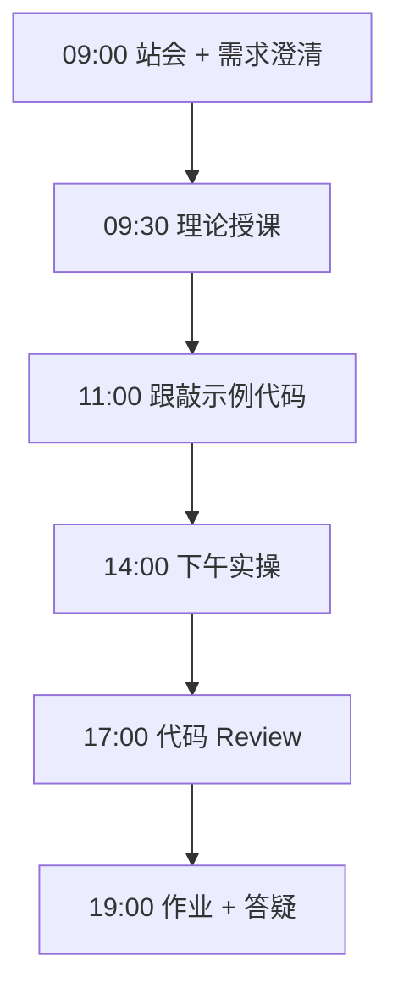
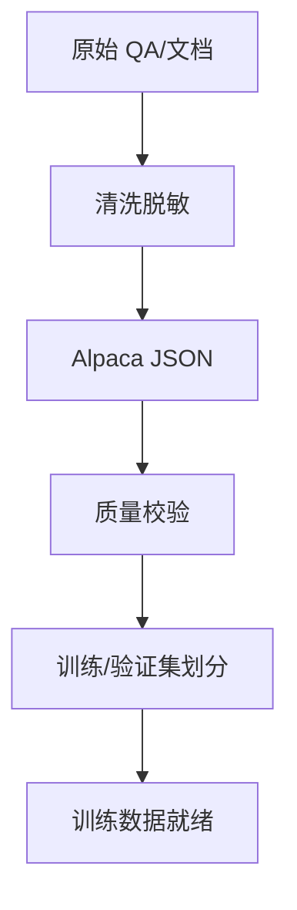

# Day 52：微调数据集：Alpaca 格式与质量校验

> **阶段**：Phase 5：微调与部署 | **Epic**：NEXUS-E5 | **预计学时**：6-8 小时

## 旁白解读：今日上下文

> 🎬 **模拟站会 09:00** — 智链科技 Nexus 项目组

林悦下发 200 条真实客服工单（已脱敏），要求学员转化为训练数据。陈工强调：「垃圾数据进，垃圾模型出。今天重点是数据工程，不是调参。」

**今日在 NexusAgent 主线中的位置**：构建 NexusAgent 客服领域训练语料库

**今日 Jira 看板**：
- `NEXUS-503`
- `NEXUS-504`

---


## 需求文档（产品林悦下发）

**文档编号**：PRD-NEXUS-D52  
**版本**：v1.0  
**优先级**：P0

### 背景

Phase 5：微调与部署阶段第 52 天教学任务，与 NexusAgent 主线项目对齐。

### User Stories

### NEXUS-503

**描述**：微调数据集：Alpaca 格式与质量校验 相关交付

**验收标准**：
- [ ] 代码可本地运行
- [ ] 通过 `scripts/verify_day.py --day 52`

### NEXUS-504

**描述**：微调数据集：Alpaca 格式与质量校验 相关交付

**验收标准**：
- [ ] 代码可本地运行
- [ ] 通过 `scripts/verify_day.py --day 52`


---


## 今日课表

### 上午 09:00-12:00

- 站会：检查 Day 51 作业，讨论 rank 选型结果
- 理论：SFT 监督微调数据格式（Alpaca / ShareGPT）
- 数据质量六维度：准确性、多样性、一致性、安全性、覆盖度、规模
- 智链科技客服 QA 数据标注规范讲解

### 下午 14:00-17:30

- 跟敲 prepare_dataset.py：转换 QA 对为 Alpaca JSON
- 运行 data_quality_report.py 生成质量报告
- 配置 dataset_info.json 供 LLaMA-Factory 读取
- 实操：扩充至 20 条以上领域样本

### 晚自习 19:00-21:00

- 作业：构建至少 30 条智链领域训练样本
- 检查重复率 < 10%，平均输出长度 > 50 字
- 预习 LLaMA-Factory 安装与配置

---


## 课堂笔记

### 核心知识点速查

| 序号 | 知识点 | 代码位置 |
|------|--------|----------|
| 1 | Alpaca 数据格式 | 见下午实操 |
| 2 | SFT 监督微调 | 见下午实操 |
| 3 | 数据质量评估 | 见下午实操 |
| 4 | PII 脱敏 | 见下午实操 |
| 5 | dataset_info 配置 | 见下午实操 |

### 今日流程图



### 架构示意图（当日目标）



---


## 实操代码清单

- `code/dataset/prepare_dataset.py`
- `code/dataset/data_quality_report.py`
- `code/dataset/dataset_info.json`

请按顺序创建并运行。每段代码均可直接复制到对应文件执行。

---

## 实验手册（分时段操作表）

### 实验步骤 1：09:30-10:30 理论

| 时间 | 动作 | 预期结果 | 失败处理 |
|------|------|----------|----------|
| +0min | 打开课件本节 | 看到需求与验收标准 | 检查是否拉取最新 `develop` 分支 |
| +10min | 创建/打开当日 `code/` 文件 | 文件路径与清单一致 | 对照「实操代码清单」 |
| +30min | 粘贴并运行第一个脚本 | 终端有正常输出无 Traceback | 见下方「排错手册」 |
| +60min | 完成全部文件并自测 | `python3` 运行通过 | 使用 `scripts/verify_day.py --day 52` |
| +90min | 提交 Git 并建 MR | MR 关联 Jira NEXUS-503 | 按附录 Git 示例操作 |


### 实验步骤 2：10:30-12:00 跟敲

| 时间 | 动作 | 预期结果 | 失败处理 |
|------|------|----------|----------|
| +0min | 打开课件本节 | 看到需求与验收标准 | 检查是否拉取最新 `develop` 分支 |
| +10min | 创建/打开当日 `code/` 文件 | 文件路径与清单一致 | 对照「实操代码清单」 |
| +30min | 粘贴并运行第一个脚本 | 终端有正常输出无 Traceback | 见下方「排错手册」 |
| +60min | 完成全部文件并自测 | `python3` 运行通过 | 使用 `scripts/verify_day.py --day 52` |
| +90min | 提交 Git 并建 MR | MR 关联 Jira NEXUS-503 | 按附录 Git 示例操作 |


### 实验步骤 3：14:00-15:30 实操

| 时间 | 动作 | 预期结果 | 失败处理 |
|------|------|----------|----------|
| +0min | 打开课件本节 | 看到需求与验收标准 | 检查是否拉取最新 `develop` 分支 |
| +10min | 创建/打开当日 `code/` 文件 | 文件路径与清单一致 | 对照「实操代码清单」 |
| +30min | 粘贴并运行第一个脚本 | 终端有正常输出无 Traceback | 见下方「排错手册」 |
| +60min | 完成全部文件并自测 | `python3` 运行通过 | 使用 `scripts/verify_day.py --day 52` |
| +90min | 提交 Git 并建 MR | MR 关联 Jira NEXUS-503 | 按附录 Git 示例操作 |


### 实验步骤 4：15:30-17:00 联调

| 时间 | 动作 | 预期结果 | 失败处理 |
|------|------|----------|----------|
| +0min | 打开课件本节 | 看到需求与验收标准 | 检查是否拉取最新 `develop` 分支 |
| +10min | 创建/打开当日 `code/` 文件 | 文件路径与清单一致 | 对照「实操代码清单」 |
| +30min | 粘贴并运行第一个脚本 | 终端有正常输出无 Traceback | 见下方「排错手册」 |
| +60min | 完成全部文件并自测 | `python3` 运行通过 | 使用 `scripts/verify_day.py --day 52` |
| +90min | 提交 Git 并建 MR | MR 关联 Jira NEXUS-503 | 按附录 Git 示例操作 |


### 实验步骤 5：19:00-20:30 作业

| 时间 | 动作 | 预期结果 | 失败处理 |
|------|------|----------|----------|
| +0min | 打开课件本节 | 看到需求与验收标准 | 检查是否拉取最新 `develop` 分支 |
| +10min | 创建/打开当日 `code/` 文件 | 文件路径与清单一致 | 对照「实操代码清单」 |
| +30min | 粘贴并运行第一个脚本 | 终端有正常输出无 Traceback | 见下方「排错手册」 |
| +60min | 完成全部文件并自测 | `python3` 运行通过 | 使用 `scripts/verify_day.py --day 52` |
| +90min | 提交 Git 并建 MR | MR 关联 Jira NEXUS-503 | 按附录 Git 示例操作 |


### 排错手册（Day 52）

1. **`command not found: python3`** → 安装 Python 3.10+ 或使用 `py -3`（Windows）
2. **`ModuleNotFoundError`** → 确认当前目录、是否激活 venv、`pip install -r requirements.txt`（若当日有）
3. **`SyntaxError: invalid syntax`** → 检查上一行是否缺括号、引号是否中文
4. **`UnicodeDecodeError`** → 文件保存为 UTF-8，终端 `export PYTHONIOENCODING=utf-8`
5. **API 相关（Day12+）** → 检查 `.env` 中 Key，无 Key 时使用课件 MOCK 模式

---


## 逐步跟敲指南（完整源码与解析）

> 以下代码与 `code/` 目录完全一致，可直接复制。每段附行级说明。

### 文件：`code/dataset/prepare_dataset.py`

**操作步骤**：
1. 在 `courseware/day-52/code/` 下创建文件 `dataset/prepare_dataset.py`
2. 完整粘贴下方代码
3. 在终端执行：`cd courseware/day-52/code && python3 prepare_dataset.py`（若为包内模块则按课件说明）

```python
#!/usr/bin/env python3
"""
Day 52 — 微调数据集准备
将原始 QA 对转换为 LLaMA-Factory 兼容的 Alpaca JSON 格式
"""
from __future__ import annotations

import json
from pathlib import Path
from typing import Any


def build_alpaca_record(
    instruction: str,
    input_text: str,
    output: str,
    system: str = "你是智链科技 NexusAgent 领域助手。",
) -> dict[str, str]:
    """构造单条 Alpaca 格式训练样本"""
    return {
        "instruction": instruction,
        "input": input_text,
        "output": output,
        "system": system,
    }


def validate_record(record: dict[str, Any]) -> list[str]:
    """校验单条记录，返回错误列表（空列表表示通过）"""
    errors: list[str] = []
    for field in ("instruction", "output"):
        if not record.get(field, "").strip():
            errors.append(f"字段 `{field}` 不能为空")
    # 输出长度 sanity check
    if len(record.get("output", "")) < 10:
        errors.append("output 过短，可能缺乏训练价值")
    return errors


def convert_qa_pairs(raw_pairs: list[dict[str, str]], output_path: Path) -> int:
    """批量转换并写入 JSON 文件，返回有效样本数"""
    valid: list[dict[str, str]] = []
    for i, pair in enumerate(raw_pairs):
        rec = build_alpaca_record(
            instruction=pair.get("question", ""),
            input_text=pair.get("context", ""),
            output=pair.get("answer", ""),
        )
        errs = validate_record(rec)
        if errs:
            print(f"[跳过] 样本 {i}: {errs}")
            continue
        valid.append(rec)

    output_path.parent.mkdir(parents=True, exist_ok=True)
    output_path.write_text(json.dumps(valid, ensure_ascii=False, indent=2), encoding="utf-8")
    print(f"已写入 {len(valid)} 条样本 -> {output_path}")
    return len(valid)


# 智链科技客服领域示例数据
SAMPLE_QA = [
    {
        "question": "如何重置 NexusAgent 管理员密码？",
        "context": "管理后台 > 系统设置 > 安全",
        "answer": "登录管理后台，进入「系统设置 > 安全 > 重置密码」，"
        "输入超级管理员邮箱接收验证码后即可重置。若忘记超级管理员账号，请联系运维执行 CLI 重置。",
    },
    {
        "question": "RAG 检索结果为空怎么办？",
        "context": "知识库模块故障排查",
        "answer": "请依次检查：1) 文档是否已完成向量化；2) Chroma 服务是否在线；"
        "3) embedding 模型版本是否与入库时一致；4) 检索 top_k 是否过小。",
    },
]


def main() -> None:
    out = Path("data/nexus_qa_train.json")
    count = convert_qa_pairs(SAMPLE_QA, out)
    assert count >= 2, "至少需要 2 条有效样本"
    print("数据集准备完成，可用于 LLaMA-Factory 训练。")


if __name__ == "__main__":
    main()

```

**解析要点（`dataset/prepare_dataset.py`）**：

- 共 **86** 行，请逐行阅读注释中的中文说明

- 运行前确认 Python 版本 ≥ 3.10：`python3 --version`

- 若报错，先检查缩进是否为 4 空格，勿混用 Tab

- 企业 Review 清单：命名是否清晰、是否有异常处理、是否可复用

---

### 文件：`code/dataset/data_quality_report.py`

**操作步骤**：
1. 在 `courseware/day-52/code/` 下创建文件 `dataset/data_quality_report.py`
2. 完整粘贴下方代码
3. 在终端执行：`cd courseware/day-52/code && python3 data_quality_report.py`（若为包内模块则按课件说明）

```python
#!/usr/bin/env python3
"""数据集质量报告：统计 token 长度分布、重复率"""
import json
from collections import Counter
from pathlib import Path


def analyze_dataset(path: Path) -> None:
    records = json.loads(path.read_text(encoding="utf-8"))
    lengths = [len(r["instruction"]) + len(r.get("input", "")) + len(r["output"]) for r in records]
    outputs = [r["output"] for r in records]
    dup_rate = 1 - len(set(outputs)) / max(len(outputs), 1)

    print(f"样本总数: {len(records)}")
    print(f"平均字符长度: {sum(lengths)/len(lengths):.0f}")
    print(f"最短/最长: {min(lengths)} / {max(lengths)}")
    print(f"输出重复率: {dup_rate:.1%}")
    if dup_rate > 0.1:
        print("⚠️  重复率偏高，建议去重或增广数据")


if __name__ == "__main__":
    analyze_dataset(Path("data/nexus_qa_train.json"))

```

**解析要点（`dataset/data_quality_report.py`）**：

- 共 **23** 行，请逐行阅读注释中的中文说明

- 运行前确认 Python 版本 ≥ 3.10：`python3 --version`

- 若报错，先检查缩进是否为 4 空格，勿混用 Tab

- 企业 Review 清单：命名是否清晰、是否有异常处理、是否可复用

---

### 文件：`code/dataset/dataset_info.json`

**操作步骤**：
1. 在 `courseware/day-52/code/` 下创建文件 `dataset/dataset_info.json`
2. 完整粘贴下方代码
3. 在终端执行：`cd courseware/day-52/code && python3 dataset_info.json.py`（若为包内模块则按课件说明）

```python
{
  "nexus_qa": {
    "file_name": "nexus_qa_train.json",
    "formatting": "alpaca",
    "columns": {
      "prompt": "instruction",
      "query": "input",
      "response": "output",
      "system": "system"
    }
  }
}

```

**解析要点（`dataset/dataset_info.json`）**：

- 共 **12** 行，请逐行阅读注释中的中文说明

- 运行前确认 Python 版本 ≥ 3.10：`python3 --version`

- 若报错，先检查缩进是否为 4 空格，勿混用 Tab

- 企业 Review 清单：命名是否清晰、是否有异常处理、是否可复用

---


### 深度讲解 1：Alpaca 数据格式

在企业级 Python 开发与大模型应用工程中，**Alpaca 数据格式** 是学员必须牢固掌握的基本功。智链科技 Nexus 项目组在 Day 52 的代码评审中，特别强调以下几点：

1. **为什么学**：Alpaca 数据格式 直接服务于后续 NexusAgent 平台的 `NEXUS-E5` 模块。没有扎实的 Alpaca 数据格式，Day 59 之后调用 API、解析 JSON、编写 Agent 工具函数时会出现大量低级错误。

2. **常见坑**：
   - 忽略输入类型校验，导致运行时 `TypeError`
   - 编码问题（Windows 默认 GBK vs UTF-8）
   - 复制粘贴时缩进错乱（Python 对缩进敏感）

3. **企业实践**：在 SmartLink 的 GitLab 仓库中，所有与 Alpaca 数据格式 相关的代码必须经过 Ruff 静态检查；变量命名使用 `snake_case`，常量使用 `UPPER_SNAKE_CASE`。

4. **与主线项目的关系**：今日代码位于 `courseware/day-52/code/`，部分模块将逐步合并到 `platform/nexus_agent/`。请养成「每日代码皆可运行、皆可测试」的习惯。

5. **扩展阅读建议**：完成今日作业后，可阅读 `docs/project-master-plan.md` 中关于 NEXUS-E5 的章节，建立全局视角。

**课堂互动题**：请用 3 句话向非技术同事解释「Alpaca 数据格式」是什么。写在作业 MR 的评论里，讲师会抽查点评。

**实操检查清单**：
- [ ] 能不看课件复述 Alpaca 数据格式 的定义
- [ ] 能独立写出相关代码并运行
- [ ] 能向同学讲解一处容易写错的地方


### 深度讲解 2：SFT 监督微调

在企业级 Python 开发与大模型应用工程中，**SFT 监督微调** 是学员必须牢固掌握的基本功。智链科技 Nexus 项目组在 Day 52 的代码评审中，特别强调以下几点：

1. **为什么学**：SFT 监督微调 直接服务于后续 NexusAgent 平台的 `NEXUS-E5` 模块。没有扎实的 SFT 监督微调，Day 59 之后调用 API、解析 JSON、编写 Agent 工具函数时会出现大量低级错误。

2. **常见坑**：
   - 忽略输入类型校验，导致运行时 `TypeError`
   - 编码问题（Windows 默认 GBK vs UTF-8）
   - 复制粘贴时缩进错乱（Python 对缩进敏感）

3. **企业实践**：在 SmartLink 的 GitLab 仓库中，所有与 SFT 监督微调 相关的代码必须经过 Ruff 静态检查；变量命名使用 `snake_case`，常量使用 `UPPER_SNAKE_CASE`。

4. **与主线项目的关系**：今日代码位于 `courseware/day-52/code/`，部分模块将逐步合并到 `platform/nexus_agent/`。请养成「每日代码皆可运行、皆可测试」的习惯。

5. **扩展阅读建议**：完成今日作业后，可阅读 `docs/project-master-plan.md` 中关于 NEXUS-E5 的章节，建立全局视角。

**课堂互动题**：请用 3 句话向非技术同事解释「SFT 监督微调」是什么。写在作业 MR 的评论里，讲师会抽查点评。

**实操检查清单**：
- [ ] 能不看课件复述 SFT 监督微调 的定义
- [ ] 能独立写出相关代码并运行
- [ ] 能向同学讲解一处容易写错的地方


### 深度讲解 3：数据质量评估

在企业级 Python 开发与大模型应用工程中，**数据质量评估** 是学员必须牢固掌握的基本功。智链科技 Nexus 项目组在 Day 52 的代码评审中，特别强调以下几点：

1. **为什么学**：数据质量评估 直接服务于后续 NexusAgent 平台的 `NEXUS-E5` 模块。没有扎实的 数据质量评估，Day 59 之后调用 API、解析 JSON、编写 Agent 工具函数时会出现大量低级错误。

2. **常见坑**：
   - 忽略输入类型校验，导致运行时 `TypeError`
   - 编码问题（Windows 默认 GBK vs UTF-8）
   - 复制粘贴时缩进错乱（Python 对缩进敏感）

3. **企业实践**：在 SmartLink 的 GitLab 仓库中，所有与 数据质量评估 相关的代码必须经过 Ruff 静态检查；变量命名使用 `snake_case`，常量使用 `UPPER_SNAKE_CASE`。

4. **与主线项目的关系**：今日代码位于 `courseware/day-52/code/`，部分模块将逐步合并到 `platform/nexus_agent/`。请养成「每日代码皆可运行、皆可测试」的习惯。

5. **扩展阅读建议**：完成今日作业后，可阅读 `docs/project-master-plan.md` 中关于 NEXUS-E5 的章节，建立全局视角。

**课堂互动题**：请用 3 句话向非技术同事解释「数据质量评估」是什么。写在作业 MR 的评论里，讲师会抽查点评。

**实操检查清单**：
- [ ] 能不看课件复述 数据质量评估 的定义
- [ ] 能独立写出相关代码并运行
- [ ] 能向同学讲解一处容易写错的地方


### 深度讲解 4：PII 脱敏

在企业级 Python 开发与大模型应用工程中，**PII 脱敏** 是学员必须牢固掌握的基本功。智链科技 Nexus 项目组在 Day 52 的代码评审中，特别强调以下几点：

1. **为什么学**：PII 脱敏 直接服务于后续 NexusAgent 平台的 `NEXUS-E5` 模块。没有扎实的 PII 脱敏，Day 59 之后调用 API、解析 JSON、编写 Agent 工具函数时会出现大量低级错误。

2. **常见坑**：
   - 忽略输入类型校验，导致运行时 `TypeError`
   - 编码问题（Windows 默认 GBK vs UTF-8）
   - 复制粘贴时缩进错乱（Python 对缩进敏感）

3. **企业实践**：在 SmartLink 的 GitLab 仓库中，所有与 PII 脱敏 相关的代码必须经过 Ruff 静态检查；变量命名使用 `snake_case`，常量使用 `UPPER_SNAKE_CASE`。

4. **与主线项目的关系**：今日代码位于 `courseware/day-52/code/`，部分模块将逐步合并到 `platform/nexus_agent/`。请养成「每日代码皆可运行、皆可测试」的习惯。

5. **扩展阅读建议**：完成今日作业后，可阅读 `docs/project-master-plan.md` 中关于 NEXUS-E5 的章节，建立全局视角。

**课堂互动题**：请用 3 句话向非技术同事解释「PII 脱敏」是什么。写在作业 MR 的评论里，讲师会抽查点评。

**实操检查清单**：
- [ ] 能不看课件复述 PII 脱敏 的定义
- [ ] 能独立写出相关代码并运行
- [ ] 能向同学讲解一处容易写错的地方


### 深度讲解 5：dataset_info 配置

在企业级 Python 开发与大模型应用工程中，**dataset_info 配置** 是学员必须牢固掌握的基本功。智链科技 Nexus 项目组在 Day 52 的代码评审中，特别强调以下几点：

1. **为什么学**：dataset_info 配置 直接服务于后续 NexusAgent 平台的 `NEXUS-E5` 模块。没有扎实的 dataset_info 配置，Day 59 之后调用 API、解析 JSON、编写 Agent 工具函数时会出现大量低级错误。

2. **常见坑**：
   - 忽略输入类型校验，导致运行时 `TypeError`
   - 编码问题（Windows 默认 GBK vs UTF-8）
   - 复制粘贴时缩进错乱（Python 对缩进敏感）

3. **企业实践**：在 SmartLink 的 GitLab 仓库中，所有与 dataset_info 配置 相关的代码必须经过 Ruff 静态检查；变量命名使用 `snake_case`，常量使用 `UPPER_SNAKE_CASE`。

4. **与主线项目的关系**：今日代码位于 `courseware/day-52/code/`，部分模块将逐步合并到 `platform/nexus_agent/`。请养成「每日代码皆可运行、皆可测试」的习惯。

5. **扩展阅读建议**：完成今日作业后，可阅读 `docs/project-master-plan.md` 中关于 NEXUS-E5 的章节，建立全局视角。

**课堂互动题**：请用 3 句话向非技术同事解释「dataset_info 配置」是什么。写在作业 MR 的评论里，讲师会抽查点评。

**实操检查清单**：
- [ ] 能不看课件复述 dataset_info 配置 的定义
- [ ] 能独立写出相关代码并运行
- [ ] 能向同学讲解一处容易写错的地方


## 阶段复盘锚点（Phase 5：微调与部署）

今天是 **Phase 5：微调与部署** 的第 **2** 个学习日。请回顾：

- 昨天学了什么？今天如何承接？
- 今天的内容在 70 天路线图中的坐标？
- 如果我是 Tech Lead，会如何 Review 今日代码？

**陈工寄语**：慢即是快。企业里没人关心你一天学了多少个语法点，只关心你写的脚本能不能在服务器上稳定跑 7×24 小时。今天把地基打牢，后面 Agent 编排、RAG 检索才不会塌。

**林悦补充**：产品侧只验收「用户能感知到的价值」。今日交付虽然简单，但「个人信息卡片」本质是后续「用户画像 Agent」的数据采集原型——字段设计请认真思考。

**代码量统计（累计）**：完成今日后，个人仓库累计约 **72800** 行（含注释与测试），全营目标 10 万行。

**明日预告**：请提前阅读 `courseware/day-53/README.md` 开头的旁白，了解上下文。


## 常见问题 FAQ（讲师答疑实录）


**Q1：学习「Alpaca 数据格式」时最常问的问题是什么？**

A：学员常问「这在大模型开发里到底用在哪里」。直接回答：在 NexusAgent 的 `NEXUS-E5` 中，Alpaca 数据格式 用于支撑「微调数据集：Alpaca 格式与质量校验」这一交付。建议你打开 `platform/` 对照看未来模块如何引用今日写法。另一个常见问题是「要不要背语法」——不需要背，但要能写出可运行代码，并能在报错时读懂 Traceback。

**追问**：如果线上报错与 Alpaca 数据格式 相关，如何排查？  
**答**：① 复现 ② 最小化输入 ③ 打印中间变量 ④ 查 GitLab 历史 diff ⑤ 在 Jira 建 Bug 单附上日志。


**Q2：学习「SFT 监督微调」时最常问的问题是什么？**

A：学员常问「这在大模型开发里到底用在哪里」。直接回答：在 NexusAgent 的 `NEXUS-E5` 中，SFT 监督微调 用于支撑「微调数据集：Alpaca 格式与质量校验」这一交付。建议你打开 `platform/` 对照看未来模块如何引用今日写法。另一个常见问题是「要不要背语法」——不需要背，但要能写出可运行代码，并能在报错时读懂 Traceback。

**追问**：如果线上报错与 SFT 监督微调 相关，如何排查？  
**答**：① 复现 ② 最小化输入 ③ 打印中间变量 ④ 查 GitLab 历史 diff ⑤ 在 Jira 建 Bug 单附上日志。


**Q3：学习「数据质量评估」时最常问的问题是什么？**

A：学员常问「这在大模型开发里到底用在哪里」。直接回答：在 NexusAgent 的 `NEXUS-E5` 中，数据质量评估 用于支撑「微调数据集：Alpaca 格式与质量校验」这一交付。建议你打开 `platform/` 对照看未来模块如何引用今日写法。另一个常见问题是「要不要背语法」——不需要背，但要能写出可运行代码，并能在报错时读懂 Traceback。

**追问**：如果线上报错与 数据质量评估 相关，如何排查？  
**答**：① 复现 ② 最小化输入 ③ 打印中间变量 ④ 查 GitLab 历史 diff ⑤ 在 Jira 建 Bug 单附上日志。


**Q4：学习「PII 脱敏」时最常问的问题是什么？**

A：学员常问「这在大模型开发里到底用在哪里」。直接回答：在 NexusAgent 的 `NEXUS-E5` 中，PII 脱敏 用于支撑「微调数据集：Alpaca 格式与质量校验」这一交付。建议你打开 `platform/` 对照看未来模块如何引用今日写法。另一个常见问题是「要不要背语法」——不需要背，但要能写出可运行代码，并能在报错时读懂 Traceback。

**追问**：如果线上报错与 PII 脱敏 相关，如何排查？  
**答**：① 复现 ② 最小化输入 ③ 打印中间变量 ④ 查 GitLab 历史 diff ⑤ 在 Jira 建 Bug 单附上日志。


**Q5：学习「dataset_info 配置」时最常问的问题是什么？**

A：学员常问「这在大模型开发里到底用在哪里」。直接回答：在 NexusAgent 的 `NEXUS-E5` 中，dataset_info 配置 用于支撑「微调数据集：Alpaca 格式与质量校验」这一交付。建议你打开 `platform/` 对照看未来模块如何引用今日写法。另一个常见问题是「要不要背语法」——不需要背，但要能写出可运行代码，并能在报错时读懂 Traceback。

**追问**：如果线上报错与 dataset_info 配置 相关，如何排查？  
**答**：① 复现 ② 最小化输入 ③ 打印中间变量 ④ 查 GitLab 历史 diff ⑤ 在 Jira 建 Bug 单附上日志。


## 面试押题（与今日知识点挂钩）

以下题目会出现在 Day 67-69 模拟面试中，建议今日就开始积累答案：

1. **Alpaca 数据格式**：请结合 NexusAgent 项目举例说明你在哪一天、哪段代码里用到了它？
2. **SFT 监督微调**：请结合 NexusAgent 项目举例说明你在哪一天、哪段代码里用到了它？
3. **数据质量评估**：请结合 NexusAgent 项目举例说明你在哪一天、哪段代码里用到了它？
4. **PII 脱敏**：请结合 NexusAgent 项目举例说明你在哪一天、哪段代码里用到了它？
5. **dataset_info 配置**：请结合 NexusAgent 项目举例说明你在哪一天、哪段代码里用到了它？

**参考答案思路**：采用 STAR 法则（情境-任务-行动-结果），引用 `courseware/day-52/code/` 中的具体文件名与函数名。

---


## Code Review 检查表（陈工版）

合并 MR 前自查：

- [ ] 所有新增 `.py` 文件顶部有模块说明 docstring
- [ ] 无硬编码密钥（API Key 走环境变量）
- [ ] 函数长度 < 50 行，过长则拆分
- [ ] 异常有明确提示，禁止裸 `except:`
- [ ] 提交信息符合 `feat(day-52): ...`
- [ ] README 或注释说明如何运行
- [ ] 与 Jira Story 验收标准逐条对应

**今日重点审查项**：微调数据集：Alpaca 格式与质量校验 相关逻辑是否可读、可测、可扩展至 `platform/nexus_agent/`。

---


## 课后作业

### 作业说明

扩展 nexus_qa_train.json 至 30+ 条样本，覆盖密码重置、RAG 故障、权限管理、API 限流等场景。运行质量报告并截图。

### 提交要求

1. 代码提交到分支 `feature/day-52-homework`
2. GitLab MR 标题：`[Day-52] homework: 课后作业`
3. 在 MR 描述中附上运行截图或终端输出

### 评分标准（满分 100）

| 项 | 分值 |
|----|------|
| 功能完整 | 40 |
| 代码规范与注释 | 30 |
| 异常处理 | 15 |
| MR 与 Jira 关联 | 15 |

---

## 作业参考答案

> ⚠️ 请先独立完成再对照答案

每条样本需含 instruction + output，context 可选。注意 instruction 用用户口吻提问，output 用客服口吻分步骤回答。去重后重复率应 < 10%。

---


## 附录：Git 提交示例

```bash
git checkout develop
git pull origin develop
git checkout -b feature/day-52-微调数据集：alpa
# 完成代码后
git add courseware/day-52/
git commit -m "feat(day-52): 微调数据集：Alpaca 格式与质量校验"
git push -u origin feature/day-52-微调数据集：alpa
```

---

*课件版本 Day-52-v1.0 | 智链科技培训中心*
