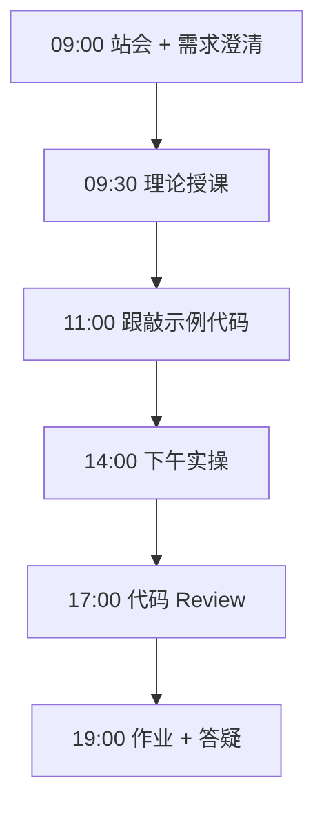
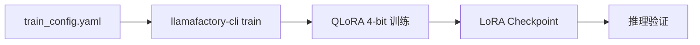

# Day 53：LLaMA-Factory 配置与 QLoRA 训练

> **阶段**：Phase 5：微调与部署 | **Epic**：NEXUS-E5 | **预计学时**：6-8 小时

## 旁白解读：今日上下文

> 🎬 **模拟站会 09:00** — 智链科技 Nexus 项目组

陈工现场演示在单卡 4090 上 30 分钟训完 7B QLoRA。「配置文件比代码重要——写错一个字段，训练直接 OOM。」

**今日在 NexusAgent 主线中的位置**：产出 NexusAgent 领域 LoRA 适配器

**今日 Jira 看板**：
- `NEXUS-505`
- `NEXUS-506`

---


## 需求文档（产品林悦下发）

**文档编号**：PRD-NEXUS-D53  
**版本**：v1.0  
**优先级**：P0

### 背景

Phase 5：微调与部署阶段第 53 天教学任务，与 NexusAgent 主线项目对齐。

### User Stories

### NEXUS-505

**描述**：LLaMA-Factory 配置与 QLoRA 训练 相关交付

**验收标准**：
- [ ] 代码可本地运行
- [ ] 通过 `scripts/verify_day.py --day 53`

### NEXUS-506

**描述**：LLaMA-Factory 配置与 QLoRA 训练 相关交付

**验收标准**：
- [ ] 代码可本地运行
- [ ] 通过 `scripts/verify_day.py --day 53`


---


## 今日课表

### 上午 09:00-12:00

- 站会：检查数据集质量报告
- LLaMA-Factory 架构与 CLI 命令概览
- 解读 train_config.yaml 每个字段含义
- 云 GPU 租用指南（AutoDL / 智星云）

### 下午 14:00-17:30

- 安装 LLaMA-Factory 并验证环境
- 配置 train_config.yaml 指向 nexus_qa 数据集
- 启动 QLoRA 训练（或观看讲师演示）
- 运行 inference_demo.py 验证 Mock 推理

### 晚自习 19:00-21:00

- 记录训练 loss 曲线截图
- 调整 learning_rate / num_epochs 并对比
- 预习模型评估与 LoRA 合并

---


## 课堂笔记

### 核心知识点速查

| 序号 | 知识点 | 代码位置 |
|------|--------|----------|
| 1 | LLaMA-Factory | 见下午实操 |
| 2 | QLoRA 训练配置 | 见下午实操 |
| 3 | 学习率调度 | 见下午实操 |
| 4 | 梯度累积 | 见下午实操 |
| 5 | Loss 监控 | 见下午实操 |

### 今日流程图



### 架构示意图（当日目标）



---


## 实操代码清单

- `code/llama_factory/train_config.yaml`
- `code/llama_factory/run_train.sh`
- `code/llama_factory/inference_demo.py`

请按顺序创建并运行。每段代码均可直接复制到对应文件执行。

---

## 实验手册（分时段操作表）

### 实验步骤 1：09:30-10:30 理论

| 时间 | 动作 | 预期结果 | 失败处理 |
|------|------|----------|----------|
| +0min | 打开课件本节 | 看到需求与验收标准 | 检查是否拉取最新 `develop` 分支 |
| +10min | 创建/打开当日 `code/` 文件 | 文件路径与清单一致 | 对照「实操代码清单」 |
| +30min | 粘贴并运行第一个脚本 | 终端有正常输出无 Traceback | 见下方「排错手册」 |
| +60min | 完成全部文件并自测 | `python3` 运行通过 | 使用 `scripts/verify_day.py --day 53` |
| +90min | 提交 Git 并建 MR | MR 关联 Jira NEXUS-505 | 按附录 Git 示例操作 |


### 实验步骤 2：10:30-12:00 跟敲

| 时间 | 动作 | 预期结果 | 失败处理 |
|------|------|----------|----------|
| +0min | 打开课件本节 | 看到需求与验收标准 | 检查是否拉取最新 `develop` 分支 |
| +10min | 创建/打开当日 `code/` 文件 | 文件路径与清单一致 | 对照「实操代码清单」 |
| +30min | 粘贴并运行第一个脚本 | 终端有正常输出无 Traceback | 见下方「排错手册」 |
| +60min | 完成全部文件并自测 | `python3` 运行通过 | 使用 `scripts/verify_day.py --day 53` |
| +90min | 提交 Git 并建 MR | MR 关联 Jira NEXUS-505 | 按附录 Git 示例操作 |


### 实验步骤 3：14:00-15:30 实操

| 时间 | 动作 | 预期结果 | 失败处理 |
|------|------|----------|----------|
| +0min | 打开课件本节 | 看到需求与验收标准 | 检查是否拉取最新 `develop` 分支 |
| +10min | 创建/打开当日 `code/` 文件 | 文件路径与清单一致 | 对照「实操代码清单」 |
| +30min | 粘贴并运行第一个脚本 | 终端有正常输出无 Traceback | 见下方「排错手册」 |
| +60min | 完成全部文件并自测 | `python3` 运行通过 | 使用 `scripts/verify_day.py --day 53` |
| +90min | 提交 Git 并建 MR | MR 关联 Jira NEXUS-505 | 按附录 Git 示例操作 |


### 实验步骤 4：15:30-17:00 联调

| 时间 | 动作 | 预期结果 | 失败处理 |
|------|------|----------|----------|
| +0min | 打开课件本节 | 看到需求与验收标准 | 检查是否拉取最新 `develop` 分支 |
| +10min | 创建/打开当日 `code/` 文件 | 文件路径与清单一致 | 对照「实操代码清单」 |
| +30min | 粘贴并运行第一个脚本 | 终端有正常输出无 Traceback | 见下方「排错手册」 |
| +60min | 完成全部文件并自测 | `python3` 运行通过 | 使用 `scripts/verify_day.py --day 53` |
| +90min | 提交 Git 并建 MR | MR 关联 Jira NEXUS-505 | 按附录 Git 示例操作 |


### 实验步骤 5：19:00-20:30 作业

| 时间 | 动作 | 预期结果 | 失败处理 |
|------|------|----------|----------|
| +0min | 打开课件本节 | 看到需求与验收标准 | 检查是否拉取最新 `develop` 分支 |
| +10min | 创建/打开当日 `code/` 文件 | 文件路径与清单一致 | 对照「实操代码清单」 |
| +30min | 粘贴并运行第一个脚本 | 终端有正常输出无 Traceback | 见下方「排错手册」 |
| +60min | 完成全部文件并自测 | `python3` 运行通过 | 使用 `scripts/verify_day.py --day 53` |
| +90min | 提交 Git 并建 MR | MR 关联 Jira NEXUS-505 | 按附录 Git 示例操作 |


### 排错手册（Day 53）

1. **`command not found: python3`** → 安装 Python 3.10+ 或使用 `py -3`（Windows）
2. **`ModuleNotFoundError`** → 确认当前目录、是否激活 venv、`pip install -r requirements.txt`（若当日有）
3. **`SyntaxError: invalid syntax`** → 检查上一行是否缺括号、引号是否中文
4. **`UnicodeDecodeError`** → 文件保存为 UTF-8，终端 `export PYTHONIOENCODING=utf-8`
5. **API 相关（Day12+）** → 检查 `.env` 中 Key，无 Key 时使用课件 MOCK 模式

---


## 逐步跟敲指南（完整源码与解析）

> 以下代码与 `code/` 目录完全一致，可直接复制。每段附行级说明。

### 文件：`code/llama_factory/train_config.yaml`

**操作步骤**：
1. 在 `courseware/day-53/code/` 下创建文件 `llama_factory/train_config.yaml`
2. 完整粘贴下方代码
3. 在终端执行：`cd courseware/day-53/code && python3 train_config.yaml.py`（若为包内模块则按课件说明）

```python
# Day 53 — LLaMA-Factory 训练配置（QLoRA）
# 用法: llamafactory-cli train train_config.yaml

### model
model_name_or_path: Qwen/Qwen2.5-7B-Instruct
trust_remote_code: true

### method
stage: sft
do_train: true
finetuning_type: lora
lora_rank: 8
lora_alpha: 16
lora_target: all
quantization_bit: 4  # QLoRA 4-bit

### dataset
dataset: nexus_qa
template: qwen
cutoff_len: 2048
max_samples: 1000
overwrite_cache: true
preprocessing_num_workers: 4

### output
output_dir: ./output/nexus-qwen-lora
logging_steps: 10
save_steps: 100
plot_loss: true
overwrite_output_dir: true

### train
per_device_train_batch_size: 2
gradient_accumulation_steps: 8
learning_rate: 2.0e-4
num_train_epochs: 3.0
lr_scheduler_type: cosine
warmup_ratio: 0.1
bf16: true
ddp_timeout: 180000000

### eval
val_size: 0.1
per_device_eval_batch_size: 1
eval_strategy: steps
eval_steps: 100

```

**解析要点（`llama_factory/train_config.yaml`）**：

- 共 **46** 行，请逐行阅读注释中的中文说明

- 运行前确认 Python 版本 ≥ 3.10：`python3 --version`

- 若报错，先检查缩进是否为 4 空格，勿混用 Tab

- 企业 Review 清单：命名是否清晰、是否有异常处理、是否可复用

---

### 文件：`code/llama_factory/run_train.sh`

**操作步骤**：
1. 在 `courseware/day-53/code/` 下创建文件 `llama_factory/run_train.sh`
2. 完整粘贴下方代码
3. 在终端执行：`cd courseware/day-53/code && python3 run_train.sh.py`（若为包内模块则按课件说明）

```python
#!/bin/bash
# Day 53 — 启动 LLaMA-Factory 微调（需提前安装 llamafactory）
set -euo pipefail

echo "=== NexusAgent 微调训练启动 ==="
export CUDA_VISIBLE_DEVICES=0

# 检查数据文件
if [ ! -f "../dataset/data/nexus_qa_train.json" ]; then
  echo "请先运行 dataset/prepare_dataset.py 生成训练数据"
  exit 1
fi

llamafactory-cli train train_config.yaml

echo "训练完成，LoRA 权重保存在 output/nexus-qwen-lora/"

```

**解析要点（`llama_factory/run_train.sh`）**：

- 共 **16** 行，请逐行阅读注释中的中文说明

- 运行前确认 Python 版本 ≥ 3.10：`python3 --version`

- 若报错，先检查缩进是否为 4 空格，勿混用 Tab

- 企业 Review 清单：命名是否清晰、是否有异常处理、是否可复用

---

### 文件：`code/llama_factory/inference_demo.py`

**操作步骤**：
1. 在 `courseware/day-53/code/` 下创建文件 `llama_factory/inference_demo.py`
2. 完整粘贴下方代码
3. 在终端执行：`cd courseware/day-53/code && python3 inference_demo.py`（若为包内模块则按课件说明）

```python
#!/usr/bin/env python3
"""
Day 53 — 微调后推理演示（Mock 模式，无 GPU 亦可运行）
真实环境请替换为 llamafactory-cli chat 或 vLLM 加载
"""
from __future__ import annotations


def mock_inference(prompt: str, lora_path: str = "output/nexus-qwen-lora") -> str:
    """模拟 LoRA 模型推理，教学环境无显卡时使用"""
    # 生产环境: 加载 base_model + lora_adapter
    responses = {
        "重置密码": "请登录管理后台，进入「系统设置 > 安全」完成重置。",
        "RAG": "请检查文档向量化状态与 Chroma 服务连通性。",
    }
    for key, resp in responses.items():
        if key in prompt:
            return f"[LoRA@{lora_path}] {resp}"
    return f"[LoRA@{lora_path}] 我是 NexusAgent 领域助手，请问有什么可以帮您？"


def main() -> None:
    test_prompts = [
        "如何重置 NexusAgent 管理员密码？",
        "RAG 检索结果为空怎么办？",
        "你好",
    ]
    for p in test_prompts:
        print(f"Q: {p}")
        print(f"A: {mock_inference(p)}\n")


if __name__ == "__main__":
    main()

```

**解析要点（`llama_factory/inference_demo.py`）**：

- 共 **34** 行，请逐行阅读注释中的中文说明

- 运行前确认 Python 版本 ≥ 3.10：`python3 --version`

- 若报错，先检查缩进是否为 4 空格，勿混用 Tab

- 企业 Review 清单：命名是否清晰、是否有异常处理、是否可复用

---


### 深度讲解 1：LLaMA-Factory

在企业级 Python 开发与大模型应用工程中，**LLaMA-Factory** 是学员必须牢固掌握的基本功。智链科技 Nexus 项目组在 Day 53 的代码评审中，特别强调以下几点：

1. **为什么学**：LLaMA-Factory 直接服务于后续 NexusAgent 平台的 `NEXUS-E5` 模块。没有扎实的 LLaMA-Factory，Day 60 之后调用 API、解析 JSON、编写 Agent 工具函数时会出现大量低级错误。

2. **常见坑**：
   - 忽略输入类型校验，导致运行时 `TypeError`
   - 编码问题（Windows 默认 GBK vs UTF-8）
   - 复制粘贴时缩进错乱（Python 对缩进敏感）

3. **企业实践**：在 SmartLink 的 GitLab 仓库中，所有与 LLaMA-Factory 相关的代码必须经过 Ruff 静态检查；变量命名使用 `snake_case`，常量使用 `UPPER_SNAKE_CASE`。

4. **与主线项目的关系**：今日代码位于 `courseware/day-53/code/`，部分模块将逐步合并到 `platform/nexus_agent/`。请养成「每日代码皆可运行、皆可测试」的习惯。

5. **扩展阅读建议**：完成今日作业后，可阅读 `docs/project-master-plan.md` 中关于 NEXUS-E5 的章节，建立全局视角。

**课堂互动题**：请用 3 句话向非技术同事解释「LLaMA-Factory」是什么。写在作业 MR 的评论里，讲师会抽查点评。

**实操检查清单**：
- [ ] 能不看课件复述 LLaMA-Factory 的定义
- [ ] 能独立写出相关代码并运行
- [ ] 能向同学讲解一处容易写错的地方


### 深度讲解 2：QLoRA 训练配置

在企业级 Python 开发与大模型应用工程中，**QLoRA 训练配置** 是学员必须牢固掌握的基本功。智链科技 Nexus 项目组在 Day 53 的代码评审中，特别强调以下几点：

1. **为什么学**：QLoRA 训练配置 直接服务于后续 NexusAgent 平台的 `NEXUS-E5` 模块。没有扎实的 QLoRA 训练配置，Day 60 之后调用 API、解析 JSON、编写 Agent 工具函数时会出现大量低级错误。

2. **常见坑**：
   - 忽略输入类型校验，导致运行时 `TypeError`
   - 编码问题（Windows 默认 GBK vs UTF-8）
   - 复制粘贴时缩进错乱（Python 对缩进敏感）

3. **企业实践**：在 SmartLink 的 GitLab 仓库中，所有与 QLoRA 训练配置 相关的代码必须经过 Ruff 静态检查；变量命名使用 `snake_case`，常量使用 `UPPER_SNAKE_CASE`。

4. **与主线项目的关系**：今日代码位于 `courseware/day-53/code/`，部分模块将逐步合并到 `platform/nexus_agent/`。请养成「每日代码皆可运行、皆可测试」的习惯。

5. **扩展阅读建议**：完成今日作业后，可阅读 `docs/project-master-plan.md` 中关于 NEXUS-E5 的章节，建立全局视角。

**课堂互动题**：请用 3 句话向非技术同事解释「QLoRA 训练配置」是什么。写在作业 MR 的评论里，讲师会抽查点评。

**实操检查清单**：
- [ ] 能不看课件复述 QLoRA 训练配置 的定义
- [ ] 能独立写出相关代码并运行
- [ ] 能向同学讲解一处容易写错的地方


### 深度讲解 3：学习率调度

在企业级 Python 开发与大模型应用工程中，**学习率调度** 是学员必须牢固掌握的基本功。智链科技 Nexus 项目组在 Day 53 的代码评审中，特别强调以下几点：

1. **为什么学**：学习率调度 直接服务于后续 NexusAgent 平台的 `NEXUS-E5` 模块。没有扎实的 学习率调度，Day 60 之后调用 API、解析 JSON、编写 Agent 工具函数时会出现大量低级错误。

2. **常见坑**：
   - 忽略输入类型校验，导致运行时 `TypeError`
   - 编码问题（Windows 默认 GBK vs UTF-8）
   - 复制粘贴时缩进错乱（Python 对缩进敏感）

3. **企业实践**：在 SmartLink 的 GitLab 仓库中，所有与 学习率调度 相关的代码必须经过 Ruff 静态检查；变量命名使用 `snake_case`，常量使用 `UPPER_SNAKE_CASE`。

4. **与主线项目的关系**：今日代码位于 `courseware/day-53/code/`，部分模块将逐步合并到 `platform/nexus_agent/`。请养成「每日代码皆可运行、皆可测试」的习惯。

5. **扩展阅读建议**：完成今日作业后，可阅读 `docs/project-master-plan.md` 中关于 NEXUS-E5 的章节，建立全局视角。

**课堂互动题**：请用 3 句话向非技术同事解释「学习率调度」是什么。写在作业 MR 的评论里，讲师会抽查点评。

**实操检查清单**：
- [ ] 能不看课件复述 学习率调度 的定义
- [ ] 能独立写出相关代码并运行
- [ ] 能向同学讲解一处容易写错的地方


### 深度讲解 4：梯度累积

在企业级 Python 开发与大模型应用工程中，**梯度累积** 是学员必须牢固掌握的基本功。智链科技 Nexus 项目组在 Day 53 的代码评审中，特别强调以下几点：

1. **为什么学**：梯度累积 直接服务于后续 NexusAgent 平台的 `NEXUS-E5` 模块。没有扎实的 梯度累积，Day 60 之后调用 API、解析 JSON、编写 Agent 工具函数时会出现大量低级错误。

2. **常见坑**：
   - 忽略输入类型校验，导致运行时 `TypeError`
   - 编码问题（Windows 默认 GBK vs UTF-8）
   - 复制粘贴时缩进错乱（Python 对缩进敏感）

3. **企业实践**：在 SmartLink 的 GitLab 仓库中，所有与 梯度累积 相关的代码必须经过 Ruff 静态检查；变量命名使用 `snake_case`，常量使用 `UPPER_SNAKE_CASE`。

4. **与主线项目的关系**：今日代码位于 `courseware/day-53/code/`，部分模块将逐步合并到 `platform/nexus_agent/`。请养成「每日代码皆可运行、皆可测试」的习惯。

5. **扩展阅读建议**：完成今日作业后，可阅读 `docs/project-master-plan.md` 中关于 NEXUS-E5 的章节，建立全局视角。

**课堂互动题**：请用 3 句话向非技术同事解释「梯度累积」是什么。写在作业 MR 的评论里，讲师会抽查点评。

**实操检查清单**：
- [ ] 能不看课件复述 梯度累积 的定义
- [ ] 能独立写出相关代码并运行
- [ ] 能向同学讲解一处容易写错的地方


### 深度讲解 5：Loss 监控

在企业级 Python 开发与大模型应用工程中，**Loss 监控** 是学员必须牢固掌握的基本功。智链科技 Nexus 项目组在 Day 53 的代码评审中，特别强调以下几点：

1. **为什么学**：Loss 监控 直接服务于后续 NexusAgent 平台的 `NEXUS-E5` 模块。没有扎实的 Loss 监控，Day 60 之后调用 API、解析 JSON、编写 Agent 工具函数时会出现大量低级错误。

2. **常见坑**：
   - 忽略输入类型校验，导致运行时 `TypeError`
   - 编码问题（Windows 默认 GBK vs UTF-8）
   - 复制粘贴时缩进错乱（Python 对缩进敏感）

3. **企业实践**：在 SmartLink 的 GitLab 仓库中，所有与 Loss 监控 相关的代码必须经过 Ruff 静态检查；变量命名使用 `snake_case`，常量使用 `UPPER_SNAKE_CASE`。

4. **与主线项目的关系**：今日代码位于 `courseware/day-53/code/`，部分模块将逐步合并到 `platform/nexus_agent/`。请养成「每日代码皆可运行、皆可测试」的习惯。

5. **扩展阅读建议**：完成今日作业后，可阅读 `docs/project-master-plan.md` 中关于 NEXUS-E5 的章节，建立全局视角。

**课堂互动题**：请用 3 句话向非技术同事解释「Loss 监控」是什么。写在作业 MR 的评论里，讲师会抽查点评。

**实操检查清单**：
- [ ] 能不看课件复述 Loss 监控 的定义
- [ ] 能独立写出相关代码并运行
- [ ] 能向同学讲解一处容易写错的地方


## 阶段复盘锚点（Phase 5：微调与部署）

今天是 **Phase 5：微调与部署** 的第 **3** 个学习日。请回顾：

- 昨天学了什么？今天如何承接？
- 今天的内容在 70 天路线图中的坐标？
- 如果我是 Tech Lead，会如何 Review 今日代码？

**陈工寄语**：慢即是快。企业里没人关心你一天学了多少个语法点，只关心你写的脚本能不能在服务器上稳定跑 7×24 小时。今天把地基打牢，后面 Agent 编排、RAG 检索才不会塌。

**林悦补充**：产品侧只验收「用户能感知到的价值」。今日交付虽然简单，但「个人信息卡片」本质是后续「用户画像 Agent」的数据采集原型——字段设计请认真思考。

**代码量统计（累计）**：完成今日后，个人仓库累计约 **74200** 行（含注释与测试），全营目标 10 万行。

**明日预告**：请提前阅读 `courseware/day-54/README.md` 开头的旁白，了解上下文。


## 常见问题 FAQ（讲师答疑实录）


**Q1：学习「LLaMA-Factory」时最常问的问题是什么？**

A：学员常问「这在大模型开发里到底用在哪里」。直接回答：在 NexusAgent 的 `NEXUS-E5` 中，LLaMA-Factory 用于支撑「LLaMA-Factory 配置与 QLoRA 训练」这一交付。建议你打开 `platform/` 对照看未来模块如何引用今日写法。另一个常见问题是「要不要背语法」——不需要背，但要能写出可运行代码，并能在报错时读懂 Traceback。

**追问**：如果线上报错与 LLaMA-Factory 相关，如何排查？  
**答**：① 复现 ② 最小化输入 ③ 打印中间变量 ④ 查 GitLab 历史 diff ⑤ 在 Jira 建 Bug 单附上日志。


**Q2：学习「QLoRA 训练配置」时最常问的问题是什么？**

A：学员常问「这在大模型开发里到底用在哪里」。直接回答：在 NexusAgent 的 `NEXUS-E5` 中，QLoRA 训练配置 用于支撑「LLaMA-Factory 配置与 QLoRA 训练」这一交付。建议你打开 `platform/` 对照看未来模块如何引用今日写法。另一个常见问题是「要不要背语法」——不需要背，但要能写出可运行代码，并能在报错时读懂 Traceback。

**追问**：如果线上报错与 QLoRA 训练配置 相关，如何排查？  
**答**：① 复现 ② 最小化输入 ③ 打印中间变量 ④ 查 GitLab 历史 diff ⑤ 在 Jira 建 Bug 单附上日志。


**Q3：学习「学习率调度」时最常问的问题是什么？**

A：学员常问「这在大模型开发里到底用在哪里」。直接回答：在 NexusAgent 的 `NEXUS-E5` 中，学习率调度 用于支撑「LLaMA-Factory 配置与 QLoRA 训练」这一交付。建议你打开 `platform/` 对照看未来模块如何引用今日写法。另一个常见问题是「要不要背语法」——不需要背，但要能写出可运行代码，并能在报错时读懂 Traceback。

**追问**：如果线上报错与 学习率调度 相关，如何排查？  
**答**：① 复现 ② 最小化输入 ③ 打印中间变量 ④ 查 GitLab 历史 diff ⑤ 在 Jira 建 Bug 单附上日志。


**Q4：学习「梯度累积」时最常问的问题是什么？**

A：学员常问「这在大模型开发里到底用在哪里」。直接回答：在 NexusAgent 的 `NEXUS-E5` 中，梯度累积 用于支撑「LLaMA-Factory 配置与 QLoRA 训练」这一交付。建议你打开 `platform/` 对照看未来模块如何引用今日写法。另一个常见问题是「要不要背语法」——不需要背，但要能写出可运行代码，并能在报错时读懂 Traceback。

**追问**：如果线上报错与 梯度累积 相关，如何排查？  
**答**：① 复现 ② 最小化输入 ③ 打印中间变量 ④ 查 GitLab 历史 diff ⑤ 在 Jira 建 Bug 单附上日志。


**Q5：学习「Loss 监控」时最常问的问题是什么？**

A：学员常问「这在大模型开发里到底用在哪里」。直接回答：在 NexusAgent 的 `NEXUS-E5` 中，Loss 监控 用于支撑「LLaMA-Factory 配置与 QLoRA 训练」这一交付。建议你打开 `platform/` 对照看未来模块如何引用今日写法。另一个常见问题是「要不要背语法」——不需要背，但要能写出可运行代码，并能在报错时读懂 Traceback。

**追问**：如果线上报错与 Loss 监控 相关，如何排查？  
**答**：① 复现 ② 最小化输入 ③ 打印中间变量 ④ 查 GitLab 历史 diff ⑤ 在 Jira 建 Bug 单附上日志。


## 面试押题（与今日知识点挂钩）

以下题目会出现在 Day 67-69 模拟面试中，建议今日就开始积累答案：

1. **LLaMA-Factory**：请结合 NexusAgent 项目举例说明你在哪一天、哪段代码里用到了它？
2. **QLoRA 训练配置**：请结合 NexusAgent 项目举例说明你在哪一天、哪段代码里用到了它？
3. **学习率调度**：请结合 NexusAgent 项目举例说明你在哪一天、哪段代码里用到了它？
4. **梯度累积**：请结合 NexusAgent 项目举例说明你在哪一天、哪段代码里用到了它？
5. **Loss 监控**：请结合 NexusAgent 项目举例说明你在哪一天、哪段代码里用到了它？

**参考答案思路**：采用 STAR 法则（情境-任务-行动-结果），引用 `courseware/day-53/code/` 中的具体文件名与函数名。

---


## Code Review 检查表（陈工版）

合并 MR 前自查：

- [ ] 所有新增 `.py` 文件顶部有模块说明 docstring
- [ ] 无硬编码密钥（API Key 走环境变量）
- [ ] 函数长度 < 50 行，过长则拆分
- [ ] 异常有明确提示，禁止裸 `except:`
- [ ] 提交信息符合 `feat(day-53): ...`
- [ ] README 或注释说明如何运行
- [ ] 与 Jira Story 验收标准逐条对应

**今日重点审查项**：LLaMA-Factory 配置与 QLoRA 训练 相关逻辑是否可读、可测、可扩展至 `platform/nexus_agent/`。

---


## 课后作业

### 作业说明

完成 train_config.yaml 配置，在 GPU 环境启动训练（或提交配置 + loss 截图）。修改 lora_rank 从 8 到 16，记录 loss 差异。

### 提交要求

1. 代码提交到分支 `feature/day-53-homework`
2. GitLab MR 标题：`[Day-53] homework: 课后作业`
3. 在 MR 描述中附上运行截图或终端输出

### 评分标准（满分 100）

| 项 | 分值 |
|----|------|
| 功能完整 | 40 |
| 代码规范与注释 | 30 |
| 异常处理 | 15 |
| MR 与 Jira 关联 | 15 |

---

## 作业参考答案

> ⚠️ 请先独立完成再对照答案

rank=16 loss 下降更快但过拟合风险增加。推荐 lr=2e-4, epochs=3, batch_size=2, grad_accum=8。训练完成后 adapter 在 output/nexus-qwen-lora/。

---


## 附录：Git 提交示例

```bash
git checkout develop
git pull origin develop
git checkout -b feature/day-53-llama-fact
# 完成代码后
git add courseware/day-53/
git commit -m "feat(day-53): LLaMA-Factory 配置与 QLoRA 训练"
git push -u origin feature/day-53-llama-fact
```

---

*课件版本 Day-53-v1.0 | 智链科技培训中心*
