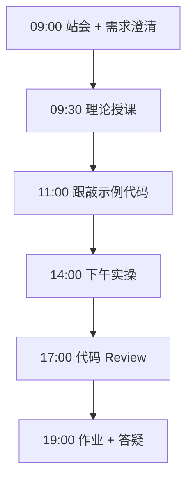
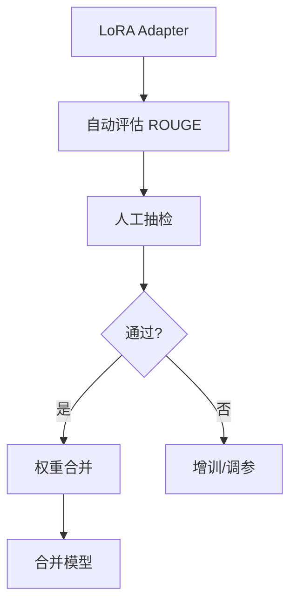

# Day 54：模型评估与 LoRA 权重合并

> **阶段**：Phase 5：微调与部署 | **Epic**：NEXUS-E5 | **预计学时**：6-8 小时

## 旁白解读：今日上下文

> 🎬 **模拟站会 09:00** — 智链科技 Nexus 项目组

林悦验收评估报告：「3 条样本出现幻觉，必须回炉重训。」陈工教合并技巧：「合并后单文件部署更简单，但失去多 adapter 切换灵活性。」

**今日在 NexusAgent 主线中的位置**：NexusAgent 微调模型质量门禁

**今日 Jira 看板**：
- `NEXUS-507`
- `NEXUS-508`

---


## 需求文档（产品林悦下发）

**文档编号**：PRD-NEXUS-D54  
**版本**：v1.0  
**优先级**：P0

### 背景

Phase 5：微调与部署阶段第 54 天教学任务，与 NexusAgent 主线项目对齐。

### User Stories

### NEXUS-507

**描述**：模型评估与 LoRA 权重合并 相关交付

**验收标准**：
- [ ] 代码可本地运行
- [ ] 通过 `scripts/verify_day.py --day 54`

### NEXUS-508

**描述**：模型评估与 LoRA 权重合并 相关交付

**验收标准**：
- [ ] 代码可本地运行
- [ ] 通过 `scripts/verify_day.py --day 54`


---


## 今日课表

### 上午 09:00-12:00

- 站会：分享训练 loss 曲线与遇到的问题
- 理论：自动评估指标 ROUGE / BLEU / 困惑度
- 人工评估方法论：幻觉率、相关性、安全性
- LoRA 合并 vs Adapter 热加载方案对比

### 下午 14:00-17:30

- 运行 run_eval.py 计算 ROUGE-L 分数
- 执行 merge_lora.py 合并权重（dry_run + 实机）
- 完成 eval_checklist.md 上线前检查
- 20 条人工抽检并记录结果

### 晚自习 19:00-21:00

- 整理评估报告（自动 + 人工）
- 决定是否需要增训或调参
- 预习 Ollama / vLLM 推理部署

---


## 课堂笔记

### 核心知识点速查

| 序号 | 知识点 | 代码位置 |
|------|--------|----------|
| 1 | ROUGE-L 评估 | 见下午实操 |
| 2 | 人工抽检 | 见下午实操 |
| 3 | LoRA 权重合并 | 见下午实操 |
| 4 | 幻觉检测 | 见下午实操 |
| 5 | 上线检查清单 | 见下午实操 |

### 今日流程图



### 架构示意图（当日目标）



---


## 实操代码清单

- `code/eval/run_eval.py`
- `code/eval/merge_lora.py`
- `code/eval/eval_checklist.md`

请按顺序创建并运行。每段代码均可直接复制到对应文件执行。

---

## 实验手册（分时段操作表）

### 实验步骤 1：09:30-10:30 理论

| 时间 | 动作 | 预期结果 | 失败处理 |
|------|------|----------|----------|
| +0min | 打开课件本节 | 看到需求与验收标准 | 检查是否拉取最新 `develop` 分支 |
| +10min | 创建/打开当日 `code/` 文件 | 文件路径与清单一致 | 对照「实操代码清单」 |
| +30min | 粘贴并运行第一个脚本 | 终端有正常输出无 Traceback | 见下方「排错手册」 |
| +60min | 完成全部文件并自测 | `python3` 运行通过 | 使用 `scripts/verify_day.py --day 54` |
| +90min | 提交 Git 并建 MR | MR 关联 Jira NEXUS-507 | 按附录 Git 示例操作 |


### 实验步骤 2：10:30-12:00 跟敲

| 时间 | 动作 | 预期结果 | 失败处理 |
|------|------|----------|----------|
| +0min | 打开课件本节 | 看到需求与验收标准 | 检查是否拉取最新 `develop` 分支 |
| +10min | 创建/打开当日 `code/` 文件 | 文件路径与清单一致 | 对照「实操代码清单」 |
| +30min | 粘贴并运行第一个脚本 | 终端有正常输出无 Traceback | 见下方「排错手册」 |
| +60min | 完成全部文件并自测 | `python3` 运行通过 | 使用 `scripts/verify_day.py --day 54` |
| +90min | 提交 Git 并建 MR | MR 关联 Jira NEXUS-507 | 按附录 Git 示例操作 |


### 实验步骤 3：14:00-15:30 实操

| 时间 | 动作 | 预期结果 | 失败处理 |
|------|------|----------|----------|
| +0min | 打开课件本节 | 看到需求与验收标准 | 检查是否拉取最新 `develop` 分支 |
| +10min | 创建/打开当日 `code/` 文件 | 文件路径与清单一致 | 对照「实操代码清单」 |
| +30min | 粘贴并运行第一个脚本 | 终端有正常输出无 Traceback | 见下方「排错手册」 |
| +60min | 完成全部文件并自测 | `python3` 运行通过 | 使用 `scripts/verify_day.py --day 54` |
| +90min | 提交 Git 并建 MR | MR 关联 Jira NEXUS-507 | 按附录 Git 示例操作 |


### 实验步骤 4：15:30-17:00 联调

| 时间 | 动作 | 预期结果 | 失败处理 |
|------|------|----------|----------|
| +0min | 打开课件本节 | 看到需求与验收标准 | 检查是否拉取最新 `develop` 分支 |
| +10min | 创建/打开当日 `code/` 文件 | 文件路径与清单一致 | 对照「实操代码清单」 |
| +30min | 粘贴并运行第一个脚本 | 终端有正常输出无 Traceback | 见下方「排错手册」 |
| +60min | 完成全部文件并自测 | `python3` 运行通过 | 使用 `scripts/verify_day.py --day 54` |
| +90min | 提交 Git 并建 MR | MR 关联 Jira NEXUS-507 | 按附录 Git 示例操作 |


### 实验步骤 5：19:00-20:30 作业

| 时间 | 动作 | 预期结果 | 失败处理 |
|------|------|----------|----------|
| +0min | 打开课件本节 | 看到需求与验收标准 | 检查是否拉取最新 `develop` 分支 |
| +10min | 创建/打开当日 `code/` 文件 | 文件路径与清单一致 | 对照「实操代码清单」 |
| +30min | 粘贴并运行第一个脚本 | 终端有正常输出无 Traceback | 见下方「排错手册」 |
| +60min | 完成全部文件并自测 | `python3` 运行通过 | 使用 `scripts/verify_day.py --day 54` |
| +90min | 提交 Git 并建 MR | MR 关联 Jira NEXUS-507 | 按附录 Git 示例操作 |


### 排错手册（Day 54）

1. **`command not found: python3`** → 安装 Python 3.10+ 或使用 `py -3`（Windows）
2. **`ModuleNotFoundError`** → 确认当前目录、是否激活 venv、`pip install -r requirements.txt`（若当日有）
3. **`SyntaxError: invalid syntax`** → 检查上一行是否缺括号、引号是否中文
4. **`UnicodeDecodeError`** → 文件保存为 UTF-8，终端 `export PYTHONIOENCODING=utf-8`
5. **API 相关（Day12+）** → 检查 `.env` 中 Key，无 Key 时使用课件 MOCK 模式

---


## 逐步跟敲指南（完整源码与解析）

> 以下代码与 `code/` 目录完全一致，可直接复制。每段附行级说明。

### 文件：`code/eval/run_eval.py`

**操作步骤**：
1. 在 `courseware/day-54/code/` 下创建文件 `eval/run_eval.py`
2. 完整粘贴下方代码
3. 在终端执行：`cd courseware/day-54/code && python3 run_eval.py`（若为包内模块则按课件说明）

```python
#!/usr/bin/env python3
"""
Day 54 — 微调模型评估
使用 ROUGE-L 与人工抽检清单评估领域问答质量
"""
from __future__ import annotations

import json
from pathlib import Path


def rouge_l_score(prediction: str, reference: str) -> float:
    """简化版 ROUGE-L F1（基于最长公共子序列）"""
    pred_tokens = prediction.split()
    ref_tokens = reference.split()
    if not pred_tokens or not ref_tokens:
        return 0.0

    m, n = len(pred_tokens), len(ref_tokens)
    dp = [[0] * (n + 1) for _ in range(m + 1)]
    for i in range(1, m + 1):
        for j in range(1, n + 1):
            if pred_tokens[i - 1] == ref_tokens[j - 1]:
                dp[i][j] = dp[i - 1][j - 1] + 1
            else:
                dp[i][j] = max(dp[i - 1][j], dp[i][j - 1])
    lcs = dp[m][n]
    precision = lcs / m
    recall = lcs / n
    if precision + recall == 0:
        return 0.0
    return 2 * precision * recall / (precision + recall)


def evaluate_predictions(predictions: list[dict], threshold: float = 0.3) -> dict:
    """批量评估，返回统计摘要"""
    scores = [rouge_l_score(p["prediction"], p["reference"]) for p in predictions]
    passed = sum(1 for s in scores if s >= threshold)
    return {
        "total": len(scores),
        "avg_rouge_l": sum(scores) / len(scores),
        "pass_rate": passed / len(scores),
        "threshold": threshold,
    }


SAMPLE_EVAL = [
    {"prediction": "登录管理后台进入系统设置安全重置密码", "reference": "登录管理后台，进入系统设置安全重置密码"},
    {"prediction": "检查向量化状态和 Chroma 服务", "reference": "检查文档向量化状态与 Chroma 服务连通性"},
]


def main() -> None:
    result = evaluate_predictions(SAMPLE_EVAL)
    print(json.dumps(result, indent=2, ensure_ascii=False))


if __name__ == "__main__":
    main()

```

**解析要点（`eval/run_eval.py`）**：

- 共 **59** 行，请逐行阅读注释中的中文说明

- 运行前确认 Python 版本 ≥ 3.10：`python3 --version`

- 若报错，先检查缩进是否为 4 空格，勿混用 Tab

- 企业 Review 清单：命名是否清晰、是否有异常处理、是否可复用

---

### 文件：`code/eval/merge_lora.py`

**操作步骤**：
1. 在 `courseware/day-54/code/` 下创建文件 `eval/merge_lora.py`
2. 完整粘贴下方代码
3. 在终端执行：`cd courseware/day-54/code && python3 merge_lora.py`（若为包内模块则按课件说明）

```python
#!/usr/bin/env python3
"""Day 54 — LoRA 权重合并脚本"""
from __future__ import annotations

import subprocess


def merge_lora(base_model: str, adapter_path: str, output_path: str, dry_run: bool = True) -> None:
    cmd = [
        "llamafactory-cli", "export",
        "--model_name_or_path", base_model,
        "--adapter_name_or_path", adapter_path,
        "--template", "qwen",
        "--finetuning_type", "lora",
        "--export_dir", output_path,
    ]
    print(" ".join(cmd))
    if not dry_run:
        subprocess.run(cmd, check=True)


if __name__ == "__main__":
    merge_lora("Qwen/Qwen2.5-7B-Instruct", "output/nexus-qwen-lora", "output/nexus-qwen-merged")

```

**解析要点（`eval/merge_lora.py`）**：

- 共 **23** 行，请逐行阅读注释中的中文说明

- 运行前确认 Python 版本 ≥ 3.10：`python3 --version`

- 若报错，先检查缩进是否为 4 空格，勿混用 Tab

- 企业 Review 清单：命名是否清晰、是否有异常处理、是否可复用

---

### 文件：`code/eval/eval_checklist.md`

**操作步骤**：
1. 在 `courseware/day-54/code/` 下创建文件 `eval/eval_checklist.md`
2. 完整粘贴下方代码
3. 在终端执行：`cd courseware/day-54/code && python3 eval_checklist.md.py`（若为包内模块则按课件说明）

```python
# 微调模型上线前评估清单
- [ ] ROUGE-L >= 0.35
- [ ] 幻觉率抽检 < 5%
- [ ] LoRA 已合并或确认 adapter 热加载

```

**解析要点（`eval/eval_checklist.md`）**：

- 共 **4** 行，请逐行阅读注释中的中文说明

- 运行前确认 Python 版本 ≥ 3.10：`python3 --version`

- 若报错，先检查缩进是否为 4 空格，勿混用 Tab

- 企业 Review 清单：命名是否清晰、是否有异常处理、是否可复用

---


### 深度讲解 1：ROUGE-L 评估

在企业级 Python 开发与大模型应用工程中，**ROUGE-L 评估** 是学员必须牢固掌握的基本功。智链科技 Nexus 项目组在 Day 54 的代码评审中，特别强调以下几点：

1. **为什么学**：ROUGE-L 评估 直接服务于后续 NexusAgent 平台的 `NEXUS-E5` 模块。没有扎实的 ROUGE-L 评估，Day 61 之后调用 API、解析 JSON、编写 Agent 工具函数时会出现大量低级错误。

2. **常见坑**：
   - 忽略输入类型校验，导致运行时 `TypeError`
   - 编码问题（Windows 默认 GBK vs UTF-8）
   - 复制粘贴时缩进错乱（Python 对缩进敏感）

3. **企业实践**：在 SmartLink 的 GitLab 仓库中，所有与 ROUGE-L 评估 相关的代码必须经过 Ruff 静态检查；变量命名使用 `snake_case`，常量使用 `UPPER_SNAKE_CASE`。

4. **与主线项目的关系**：今日代码位于 `courseware/day-54/code/`，部分模块将逐步合并到 `platform/nexus_agent/`。请养成「每日代码皆可运行、皆可测试」的习惯。

5. **扩展阅读建议**：完成今日作业后，可阅读 `docs/project-master-plan.md` 中关于 NEXUS-E5 的章节，建立全局视角。

**课堂互动题**：请用 3 句话向非技术同事解释「ROUGE-L 评估」是什么。写在作业 MR 的评论里，讲师会抽查点评。

**实操检查清单**：
- [ ] 能不看课件复述 ROUGE-L 评估 的定义
- [ ] 能独立写出相关代码并运行
- [ ] 能向同学讲解一处容易写错的地方


### 深度讲解 2：人工抽检

在企业级 Python 开发与大模型应用工程中，**人工抽检** 是学员必须牢固掌握的基本功。智链科技 Nexus 项目组在 Day 54 的代码评审中，特别强调以下几点：

1. **为什么学**：人工抽检 直接服务于后续 NexusAgent 平台的 `NEXUS-E5` 模块。没有扎实的 人工抽检，Day 61 之后调用 API、解析 JSON、编写 Agent 工具函数时会出现大量低级错误。

2. **常见坑**：
   - 忽略输入类型校验，导致运行时 `TypeError`
   - 编码问题（Windows 默认 GBK vs UTF-8）
   - 复制粘贴时缩进错乱（Python 对缩进敏感）

3. **企业实践**：在 SmartLink 的 GitLab 仓库中，所有与 人工抽检 相关的代码必须经过 Ruff 静态检查；变量命名使用 `snake_case`，常量使用 `UPPER_SNAKE_CASE`。

4. **与主线项目的关系**：今日代码位于 `courseware/day-54/code/`，部分模块将逐步合并到 `platform/nexus_agent/`。请养成「每日代码皆可运行、皆可测试」的习惯。

5. **扩展阅读建议**：完成今日作业后，可阅读 `docs/project-master-plan.md` 中关于 NEXUS-E5 的章节，建立全局视角。

**课堂互动题**：请用 3 句话向非技术同事解释「人工抽检」是什么。写在作业 MR 的评论里，讲师会抽查点评。

**实操检查清单**：
- [ ] 能不看课件复述 人工抽检 的定义
- [ ] 能独立写出相关代码并运行
- [ ] 能向同学讲解一处容易写错的地方


### 深度讲解 3：LoRA 权重合并

在企业级 Python 开发与大模型应用工程中，**LoRA 权重合并** 是学员必须牢固掌握的基本功。智链科技 Nexus 项目组在 Day 54 的代码评审中，特别强调以下几点：

1. **为什么学**：LoRA 权重合并 直接服务于后续 NexusAgent 平台的 `NEXUS-E5` 模块。没有扎实的 LoRA 权重合并，Day 61 之后调用 API、解析 JSON、编写 Agent 工具函数时会出现大量低级错误。

2. **常见坑**：
   - 忽略输入类型校验，导致运行时 `TypeError`
   - 编码问题（Windows 默认 GBK vs UTF-8）
   - 复制粘贴时缩进错乱（Python 对缩进敏感）

3. **企业实践**：在 SmartLink 的 GitLab 仓库中，所有与 LoRA 权重合并 相关的代码必须经过 Ruff 静态检查；变量命名使用 `snake_case`，常量使用 `UPPER_SNAKE_CASE`。

4. **与主线项目的关系**：今日代码位于 `courseware/day-54/code/`，部分模块将逐步合并到 `platform/nexus_agent/`。请养成「每日代码皆可运行、皆可测试」的习惯。

5. **扩展阅读建议**：完成今日作业后，可阅读 `docs/project-master-plan.md` 中关于 NEXUS-E5 的章节，建立全局视角。

**课堂互动题**：请用 3 句话向非技术同事解释「LoRA 权重合并」是什么。写在作业 MR 的评论里，讲师会抽查点评。

**实操检查清单**：
- [ ] 能不看课件复述 LoRA 权重合并 的定义
- [ ] 能独立写出相关代码并运行
- [ ] 能向同学讲解一处容易写错的地方


### 深度讲解 4：幻觉检测

在企业级 Python 开发与大模型应用工程中，**幻觉检测** 是学员必须牢固掌握的基本功。智链科技 Nexus 项目组在 Day 54 的代码评审中，特别强调以下几点：

1. **为什么学**：幻觉检测 直接服务于后续 NexusAgent 平台的 `NEXUS-E5` 模块。没有扎实的 幻觉检测，Day 61 之后调用 API、解析 JSON、编写 Agent 工具函数时会出现大量低级错误。

2. **常见坑**：
   - 忽略输入类型校验，导致运行时 `TypeError`
   - 编码问题（Windows 默认 GBK vs UTF-8）
   - 复制粘贴时缩进错乱（Python 对缩进敏感）

3. **企业实践**：在 SmartLink 的 GitLab 仓库中，所有与 幻觉检测 相关的代码必须经过 Ruff 静态检查；变量命名使用 `snake_case`，常量使用 `UPPER_SNAKE_CASE`。

4. **与主线项目的关系**：今日代码位于 `courseware/day-54/code/`，部分模块将逐步合并到 `platform/nexus_agent/`。请养成「每日代码皆可运行、皆可测试」的习惯。

5. **扩展阅读建议**：完成今日作业后，可阅读 `docs/project-master-plan.md` 中关于 NEXUS-E5 的章节，建立全局视角。

**课堂互动题**：请用 3 句话向非技术同事解释「幻觉检测」是什么。写在作业 MR 的评论里，讲师会抽查点评。

**实操检查清单**：
- [ ] 能不看课件复述 幻觉检测 的定义
- [ ] 能独立写出相关代码并运行
- [ ] 能向同学讲解一处容易写错的地方


### 深度讲解 5：上线检查清单

在企业级 Python 开发与大模型应用工程中，**上线检查清单** 是学员必须牢固掌握的基本功。智链科技 Nexus 项目组在 Day 54 的代码评审中，特别强调以下几点：

1. **为什么学**：上线检查清单 直接服务于后续 NexusAgent 平台的 `NEXUS-E5` 模块。没有扎实的 上线检查清单，Day 61 之后调用 API、解析 JSON、编写 Agent 工具函数时会出现大量低级错误。

2. **常见坑**：
   - 忽略输入类型校验，导致运行时 `TypeError`
   - 编码问题（Windows 默认 GBK vs UTF-8）
   - 复制粘贴时缩进错乱（Python 对缩进敏感）

3. **企业实践**：在 SmartLink 的 GitLab 仓库中，所有与 上线检查清单 相关的代码必须经过 Ruff 静态检查；变量命名使用 `snake_case`，常量使用 `UPPER_SNAKE_CASE`。

4. **与主线项目的关系**：今日代码位于 `courseware/day-54/code/`，部分模块将逐步合并到 `platform/nexus_agent/`。请养成「每日代码皆可运行、皆可测试」的习惯。

5. **扩展阅读建议**：完成今日作业后，可阅读 `docs/project-master-plan.md` 中关于 NEXUS-E5 的章节，建立全局视角。

**课堂互动题**：请用 3 句话向非技术同事解释「上线检查清单」是什么。写在作业 MR 的评论里，讲师会抽查点评。

**实操检查清单**：
- [ ] 能不看课件复述 上线检查清单 的定义
- [ ] 能独立写出相关代码并运行
- [ ] 能向同学讲解一处容易写错的地方


## 阶段复盘锚点（Phase 5：微调与部署）

今天是 **Phase 5：微调与部署** 的第 **4** 个学习日。请回顾：

- 昨天学了什么？今天如何承接？
- 今天的内容在 70 天路线图中的坐标？
- 如果我是 Tech Lead，会如何 Review 今日代码？

**陈工寄语**：慢即是快。企业里没人关心你一天学了多少个语法点，只关心你写的脚本能不能在服务器上稳定跑 7×24 小时。今天把地基打牢，后面 Agent 编排、RAG 检索才不会塌。

**林悦补充**：产品侧只验收「用户能感知到的价值」。今日交付虽然简单，但「个人信息卡片」本质是后续「用户画像 Agent」的数据采集原型——字段设计请认真思考。

**代码量统计（累计）**：完成今日后，个人仓库累计约 **75600** 行（含注释与测试），全营目标 10 万行。

**明日预告**：请提前阅读 `courseware/day-55/README.md` 开头的旁白，了解上下文。


## 常见问题 FAQ（讲师答疑实录）


**Q1：学习「ROUGE-L 评估」时最常问的问题是什么？**

A：学员常问「这在大模型开发里到底用在哪里」。直接回答：在 NexusAgent 的 `NEXUS-E5` 中，ROUGE-L 评估 用于支撑「模型评估与 LoRA 权重合并」这一交付。建议你打开 `platform/` 对照看未来模块如何引用今日写法。另一个常见问题是「要不要背语法」——不需要背，但要能写出可运行代码，并能在报错时读懂 Traceback。

**追问**：如果线上报错与 ROUGE-L 评估 相关，如何排查？  
**答**：① 复现 ② 最小化输入 ③ 打印中间变量 ④ 查 GitLab 历史 diff ⑤ 在 Jira 建 Bug 单附上日志。


**Q2：学习「人工抽检」时最常问的问题是什么？**

A：学员常问「这在大模型开发里到底用在哪里」。直接回答：在 NexusAgent 的 `NEXUS-E5` 中，人工抽检 用于支撑「模型评估与 LoRA 权重合并」这一交付。建议你打开 `platform/` 对照看未来模块如何引用今日写法。另一个常见问题是「要不要背语法」——不需要背，但要能写出可运行代码，并能在报错时读懂 Traceback。

**追问**：如果线上报错与 人工抽检 相关，如何排查？  
**答**：① 复现 ② 最小化输入 ③ 打印中间变量 ④ 查 GitLab 历史 diff ⑤ 在 Jira 建 Bug 单附上日志。


**Q3：学习「LoRA 权重合并」时最常问的问题是什么？**

A：学员常问「这在大模型开发里到底用在哪里」。直接回答：在 NexusAgent 的 `NEXUS-E5` 中，LoRA 权重合并 用于支撑「模型评估与 LoRA 权重合并」这一交付。建议你打开 `platform/` 对照看未来模块如何引用今日写法。另一个常见问题是「要不要背语法」——不需要背，但要能写出可运行代码，并能在报错时读懂 Traceback。

**追问**：如果线上报错与 LoRA 权重合并 相关，如何排查？  
**答**：① 复现 ② 最小化输入 ③ 打印中间变量 ④ 查 GitLab 历史 diff ⑤ 在 Jira 建 Bug 单附上日志。


**Q4：学习「幻觉检测」时最常问的问题是什么？**

A：学员常问「这在大模型开发里到底用在哪里」。直接回答：在 NexusAgent 的 `NEXUS-E5` 中，幻觉检测 用于支撑「模型评估与 LoRA 权重合并」这一交付。建议你打开 `platform/` 对照看未来模块如何引用今日写法。另一个常见问题是「要不要背语法」——不需要背，但要能写出可运行代码，并能在报错时读懂 Traceback。

**追问**：如果线上报错与 幻觉检测 相关，如何排查？  
**答**：① 复现 ② 最小化输入 ③ 打印中间变量 ④ 查 GitLab 历史 diff ⑤ 在 Jira 建 Bug 单附上日志。


**Q5：学习「上线检查清单」时最常问的问题是什么？**

A：学员常问「这在大模型开发里到底用在哪里」。直接回答：在 NexusAgent 的 `NEXUS-E5` 中，上线检查清单 用于支撑「模型评估与 LoRA 权重合并」这一交付。建议你打开 `platform/` 对照看未来模块如何引用今日写法。另一个常见问题是「要不要背语法」——不需要背，但要能写出可运行代码，并能在报错时读懂 Traceback。

**追问**：如果线上报错与 上线检查清单 相关，如何排查？  
**答**：① 复现 ② 最小化输入 ③ 打印中间变量 ④ 查 GitLab 历史 diff ⑤ 在 Jira 建 Bug 单附上日志。


## 面试押题（与今日知识点挂钩）

以下题目会出现在 Day 67-69 模拟面试中，建议今日就开始积累答案：

1. **ROUGE-L 评估**：请结合 NexusAgent 项目举例说明你在哪一天、哪段代码里用到了它？
2. **人工抽检**：请结合 NexusAgent 项目举例说明你在哪一天、哪段代码里用到了它？
3. **LoRA 权重合并**：请结合 NexusAgent 项目举例说明你在哪一天、哪段代码里用到了它？
4. **幻觉检测**：请结合 NexusAgent 项目举例说明你在哪一天、哪段代码里用到了它？
5. **上线检查清单**：请结合 NexusAgent 项目举例说明你在哪一天、哪段代码里用到了它？

**参考答案思路**：采用 STAR 法则（情境-任务-行动-结果），引用 `courseware/day-54/code/` 中的具体文件名与函数名。

---


## Code Review 检查表（陈工版）

合并 MR 前自查：

- [ ] 所有新增 `.py` 文件顶部有模块说明 docstring
- [ ] 无硬编码密钥（API Key 走环境变量）
- [ ] 函数长度 < 50 行，过长则拆分
- [ ] 异常有明确提示，禁止裸 `except:`
- [ ] 提交信息符合 `feat(day-54): ...`
- [ ] README 或注释说明如何运行
- [ ] 与 Jira Story 验收标准逐条对应

**今日重点审查项**：模型评估与 LoRA 权重合并 相关逻辑是否可读、可测、可扩展至 `platform/nexus_agent/`。

---


## 课后作业

### 作业说明

对微调模型完成 20 条人工评估，填写 eval_checklist.md。运行 run_eval.py 并提交 JSON 结果。尝试 merge_lora（dry_run=False）。

### 提交要求

1. 代码提交到分支 `feature/day-54-homework`
2. GitLab MR 标题：`[Day-54] homework: 课后作业`
3. 在 MR 描述中附上运行截图或终端输出

### 评分标准（满分 100）

| 项 | 分值 |
|----|------|
| 功能完整 | 40 |
| 代码规范与注释 | 30 |
| 异常处理 | 15 |
| MR 与 Jira 关联 | 15 |

---

## 作业参考答案

> ⚠️ 请先独立完成再对照答案

ROUGE-L > 0.35 为及格线。合并命令：llamafactory-cli export --finetuning_type lora。合并后模型约 14GB（7B fp16）。

---


## 附录：Git 提交示例

```bash
git checkout develop
git pull origin develop
git checkout -b feature/day-54-模型评估与-lora
# 完成代码后
git add courseware/day-54/
git commit -m "feat(day-54): 模型评估与 LoRA 权重合并"
git push -u origin feature/day-54-模型评估与-lora
```

---

*课件版本 Day-54-v1.0 | 智链科技培训中心*
