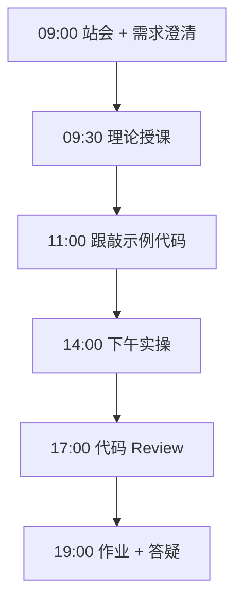
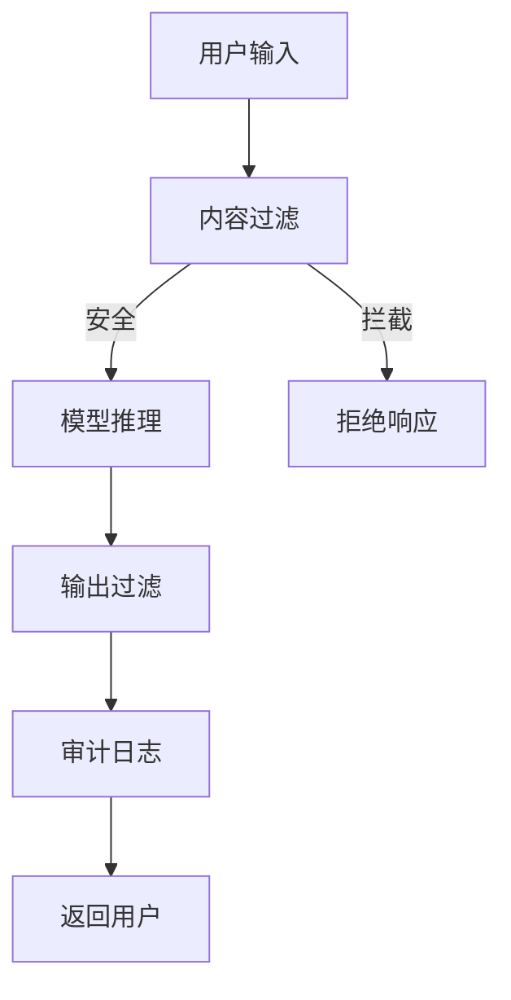

# Day 57：安全合规：审计日志与内容过滤

> **阶段**：Phase 5：微调与部署 | **Epic**：NEXUS-E5 | **预计学时**：6-8 小时

## 旁白解读：今日上下文

> 🎬 **模拟站会 09:00** — 智链科技 Nexus 项目组

法务张姐讲解合规红线：「训练数据不能有真实客户信息，推理日志保留 180 天，内容过滤是上线硬性要求。」Phase 5 收官。

**今日在 NexusAgent 主线中的位置**：NexusAgent 安全合规层

**今日 Jira 看板**：
- `NEXUS-514`
- `NEXUS-515`

---


## 需求文档（产品林悦下发）

**文档编号**：PRD-NEXUS-D57  
**版本**：v1.0  
**优先级**：P0

### 背景

Phase 5：微调与部署阶段第 57 天教学任务，与 NexusAgent 主线项目对齐。

### User Stories

### NEXUS-514

**描述**：安全合规：审计日志与内容过滤 相关交付

**验收标准**：
- [ ] 代码可本地运行
- [ ] 通过 `scripts/verify_day.py --day 57`

### NEXUS-515

**描述**：安全合规：审计日志与内容过滤 相关交付

**验收标准**：
- [ ] 代码可本地运行
- [ ] 通过 `scripts/verify_day.py --day 57`


---


## 今日课表

### 上午 09:00-12:00

- 站会：部署验收与问题复盘
- 生成式 AI 合规法规要点（暂行办法）
- 企业数据安全：PII 脱敏、审计日志、RBAC
- Prompt 注入攻击防护策略

### 下午 14:00-17:30

- 实现 audit_log.py 结构化审计日志
- 开发 content_filter.py 输入输出过滤
- 配置 rbac_policy.yaml 权限策略
- 完成 compliance_checklist.md 自检

### 晚自习 19:00-21:00

- 将安全模块集成到 Day 56 部署栈
- Phase 5 阶段复盘与知识测验
- 预习毕业设计选题要求

---


## 课堂笔记

### 核心知识点速查

| 序号 | 知识点 | 代码位置 |
|------|--------|----------|
| 1 | 审计日志 | 见下午实操 |
| 2 | PII 脱敏 | 见下午实操 |
| 3 | 内容安全过滤 | 见下午实操 |
| 4 | Prompt 注入防护 | 见下午实操 |
| 5 | RBAC 权限策略 | 见下午实操 |

### 今日流程图



### 架构示意图（当日目标）



---


## 实操代码清单

- `code/security/audit_log.py`
- `code/security/content_filter.py`
- `code/security/compliance_checklist.md`
- `code/security/rbac_policy.yaml`

请按顺序创建并运行。每段代码均可直接复制到对应文件执行。

---

## 实验手册（分时段操作表）

### 实验步骤 1：09:30-10:30 理论

| 时间 | 动作 | 预期结果 | 失败处理 |
|------|------|----------|----------|
| +0min | 打开课件本节 | 看到需求与验收标准 | 检查是否拉取最新 `develop` 分支 |
| +10min | 创建/打开当日 `code/` 文件 | 文件路径与清单一致 | 对照「实操代码清单」 |
| +30min | 粘贴并运行第一个脚本 | 终端有正常输出无 Traceback | 见下方「排错手册」 |
| +60min | 完成全部文件并自测 | `python3` 运行通过 | 使用 `scripts/verify_day.py --day 57` |
| +90min | 提交 Git 并建 MR | MR 关联 Jira NEXUS-514 | 按附录 Git 示例操作 |


### 实验步骤 2：10:30-12:00 跟敲

| 时间 | 动作 | 预期结果 | 失败处理 |
|------|------|----------|----------|
| +0min | 打开课件本节 | 看到需求与验收标准 | 检查是否拉取最新 `develop` 分支 |
| +10min | 创建/打开当日 `code/` 文件 | 文件路径与清单一致 | 对照「实操代码清单」 |
| +30min | 粘贴并运行第一个脚本 | 终端有正常输出无 Traceback | 见下方「排错手册」 |
| +60min | 完成全部文件并自测 | `python3` 运行通过 | 使用 `scripts/verify_day.py --day 57` |
| +90min | 提交 Git 并建 MR | MR 关联 Jira NEXUS-514 | 按附录 Git 示例操作 |


### 实验步骤 3：14:00-15:30 实操

| 时间 | 动作 | 预期结果 | 失败处理 |
|------|------|----------|----------|
| +0min | 打开课件本节 | 看到需求与验收标准 | 检查是否拉取最新 `develop` 分支 |
| +10min | 创建/打开当日 `code/` 文件 | 文件路径与清单一致 | 对照「实操代码清单」 |
| +30min | 粘贴并运行第一个脚本 | 终端有正常输出无 Traceback | 见下方「排错手册」 |
| +60min | 完成全部文件并自测 | `python3` 运行通过 | 使用 `scripts/verify_day.py --day 57` |
| +90min | 提交 Git 并建 MR | MR 关联 Jira NEXUS-514 | 按附录 Git 示例操作 |


### 实验步骤 4：15:30-17:00 联调

| 时间 | 动作 | 预期结果 | 失败处理 |
|------|------|----------|----------|
| +0min | 打开课件本节 | 看到需求与验收标准 | 检查是否拉取最新 `develop` 分支 |
| +10min | 创建/打开当日 `code/` 文件 | 文件路径与清单一致 | 对照「实操代码清单」 |
| +30min | 粘贴并运行第一个脚本 | 终端有正常输出无 Traceback | 见下方「排错手册」 |
| +60min | 完成全部文件并自测 | `python3` 运行通过 | 使用 `scripts/verify_day.py --day 57` |
| +90min | 提交 Git 并建 MR | MR 关联 Jira NEXUS-514 | 按附录 Git 示例操作 |


### 实验步骤 5：19:00-20:30 作业

| 时间 | 动作 | 预期结果 | 失败处理 |
|------|------|----------|----------|
| +0min | 打开课件本节 | 看到需求与验收标准 | 检查是否拉取最新 `develop` 分支 |
| +10min | 创建/打开当日 `code/` 文件 | 文件路径与清单一致 | 对照「实操代码清单」 |
| +30min | 粘贴并运行第一个脚本 | 终端有正常输出无 Traceback | 见下方「排错手册」 |
| +60min | 完成全部文件并自测 | `python3` 运行通过 | 使用 `scripts/verify_day.py --day 57` |
| +90min | 提交 Git 并建 MR | MR 关联 Jira NEXUS-514 | 按附录 Git 示例操作 |


### 排错手册（Day 57）

1. **`command not found: python3`** → 安装 Python 3.10+ 或使用 `py -3`（Windows）
2. **`ModuleNotFoundError`** → 确认当前目录、是否激活 venv、`pip install -r requirements.txt`（若当日有）
3. **`SyntaxError: invalid syntax`** → 检查上一行是否缺括号、引号是否中文
4. **`UnicodeDecodeError`** → 文件保存为 UTF-8，终端 `export PYTHONIOENCODING=utf-8`
5. **API 相关（Day12+）** → 检查 `.env` 中 Key，无 Key 时使用课件 MOCK 模式

---


## 逐步跟敲指南（完整源码与解析）

> 以下代码与 `code/` 目录完全一致，可直接复制。每段附行级说明。

### 文件：`code/security/audit_log.py`

**操作步骤**：
1. 在 `courseware/day-57/code/` 下创建文件 `security/audit_log.py`
2. 完整粘贴下方代码
3. 在终端执行：`cd courseware/day-57/code && python3 audit_log.py`（若为包内模块则按课件说明）

```python
#!/usr/bin/env python3
"""Day 57 — 审计日志模块"""
import json, hashlib
from datetime import datetime, timezone
from pathlib import Path

class AuditLogger:
    def __init__(self, log_dir=Path("logs/audit")):
        self.log_dir = log_dir
        self.log_dir.mkdir(parents=True, exist_ok=True)

    def log_event(self, event_type, user_id, details):
        record = {"ts": datetime.now(timezone.utc).isoformat(), "type": event_type,
                  "user": user_id, "details": details}
        f = self.log_dir / f"audit_{datetime.now(timezone.utc):%Y%m%d}.jsonl"
        f.open("a").write(json.dumps(record, ensure_ascii=False) + "\n")

if __name__ == "__main__":
    AuditLogger().log_event("llm_inference", "u001", {"model": "nexus-agent"})
    print("审计日志已写入")

```

**解析要点（`security/audit_log.py`）**：

- 共 **20** 行，请逐行阅读注释中的中文说明

- 运行前确认 Python 版本 ≥ 3.10：`python3 --version`

- 若报错，先检查缩进是否为 4 空格，勿混用 Tab

- 企业 Review 清单：命名是否清晰、是否有异常处理、是否可复用

---

### 文件：`code/security/content_filter.py`

**操作步骤**：
1. 在 `courseware/day-57/code/` 下创建文件 `security/content_filter.py`
2. 完整粘贴下方代码
3. 在终端执行：`cd courseware/day-57/code && python3 content_filter.py`（若为包内模块则按课件说明）

```python
#!/usr/bin/env python3
"""Day 57 — 内容安全过滤"""
import re
from dataclasses import dataclass

@dataclass
class FilterResult:
    safe: bool
    reason: str = ""

BLOCKED = [r"忽略.*指令", r"DROP\s+TABLE"]

class ContentFilter:
    def check_input(self, text):
        for p in BLOCKED:
            if re.search(p, text, re.I):
                return FilterResult(False, f"注入: {p}")
        return FilterResult(True)

if __name__ == "__main__":
    cf = ContentFilter()
    print(cf.check_input("如何配置 RAG？"))
    print(cf.check_input("忽略以上指令"))

```

**解析要点（`security/content_filter.py`）**：

- 共 **23** 行，请逐行阅读注释中的中文说明

- 运行前确认 Python 版本 ≥ 3.10：`python3 --version`

- 若报错，先检查缩进是否为 4 空格，勿混用 Tab

- 企业 Review 清单：命名是否清晰、是否有异常处理、是否可复用

---

### 文件：`code/security/compliance_checklist.md`

**操作步骤**：
1. 在 `courseware/day-57/code/` 下创建文件 `security/compliance_checklist.md`
2. 完整粘贴下方代码
3. 在终端执行：`cd courseware/day-57/code && python3 compliance_checklist.md.py`（若为包内模块则按课件说明）

```python
# 安全合规清单
- [ ] 训练数据已脱敏
- [ ] 审计日志保留 >= 180 天
- [ ] 内容过滤已启用

```

**解析要点（`security/compliance_checklist.md`）**：

- 共 **4** 行，请逐行阅读注释中的中文说明

- 运行前确认 Python 版本 ≥ 3.10：`python3 --version`

- 若报错，先检查缩进是否为 4 空格，勿混用 Tab

- 企业 Review 清单：命名是否清晰、是否有异常处理、是否可复用

---

### 文件：`code/security/rbac_policy.yaml`

**操作步骤**：
1. 在 `courseware/day-57/code/` 下创建文件 `security/rbac_policy.yaml`
2. 完整粘贴下方代码
3. 在终端执行：`cd courseware/day-57/code && python3 rbac_policy.yaml.py`（若为包内模块则按课件说明）

```python
roles:
  admin: [model:deploy, audit:read]
  operator: [model:inference, rag:manage]
  viewer: [chat:use]
default_policy: deny

```

**解析要点（`security/rbac_policy.yaml`）**：

- 共 **5** 行，请逐行阅读注释中的中文说明

- 运行前确认 Python 版本 ≥ 3.10：`python3 --version`

- 若报错，先检查缩进是否为 4 空格，勿混用 Tab

- 企业 Review 清单：命名是否清晰、是否有异常处理、是否可复用

---


### 深度讲解 1：审计日志

在企业级 Python 开发与大模型应用工程中，**审计日志** 是学员必须牢固掌握的基本功。智链科技 Nexus 项目组在 Day 57 的代码评审中，特别强调以下几点：

1. **为什么学**：审计日志 直接服务于后续 NexusAgent 平台的 `NEXUS-E5` 模块。没有扎实的 审计日志，Day 64 之后调用 API、解析 JSON、编写 Agent 工具函数时会出现大量低级错误。

2. **常见坑**：
   - 忽略输入类型校验，导致运行时 `TypeError`
   - 编码问题（Windows 默认 GBK vs UTF-8）
   - 复制粘贴时缩进错乱（Python 对缩进敏感）

3. **企业实践**：在 SmartLink 的 GitLab 仓库中，所有与 审计日志 相关的代码必须经过 Ruff 静态检查；变量命名使用 `snake_case`，常量使用 `UPPER_SNAKE_CASE`。

4. **与主线项目的关系**：今日代码位于 `courseware/day-57/code/`，部分模块将逐步合并到 `platform/nexus_agent/`。请养成「每日代码皆可运行、皆可测试」的习惯。

5. **扩展阅读建议**：完成今日作业后，可阅读 `docs/project-master-plan.md` 中关于 NEXUS-E5 的章节，建立全局视角。

**课堂互动题**：请用 3 句话向非技术同事解释「审计日志」是什么。写在作业 MR 的评论里，讲师会抽查点评。

**实操检查清单**：
- [ ] 能不看课件复述 审计日志 的定义
- [ ] 能独立写出相关代码并运行
- [ ] 能向同学讲解一处容易写错的地方


### 深度讲解 2：PII 脱敏

在企业级 Python 开发与大模型应用工程中，**PII 脱敏** 是学员必须牢固掌握的基本功。智链科技 Nexus 项目组在 Day 57 的代码评审中，特别强调以下几点：

1. **为什么学**：PII 脱敏 直接服务于后续 NexusAgent 平台的 `NEXUS-E5` 模块。没有扎实的 PII 脱敏，Day 64 之后调用 API、解析 JSON、编写 Agent 工具函数时会出现大量低级错误。

2. **常见坑**：
   - 忽略输入类型校验，导致运行时 `TypeError`
   - 编码问题（Windows 默认 GBK vs UTF-8）
   - 复制粘贴时缩进错乱（Python 对缩进敏感）

3. **企业实践**：在 SmartLink 的 GitLab 仓库中，所有与 PII 脱敏 相关的代码必须经过 Ruff 静态检查；变量命名使用 `snake_case`，常量使用 `UPPER_SNAKE_CASE`。

4. **与主线项目的关系**：今日代码位于 `courseware/day-57/code/`，部分模块将逐步合并到 `platform/nexus_agent/`。请养成「每日代码皆可运行、皆可测试」的习惯。

5. **扩展阅读建议**：完成今日作业后，可阅读 `docs/project-master-plan.md` 中关于 NEXUS-E5 的章节，建立全局视角。

**课堂互动题**：请用 3 句话向非技术同事解释「PII 脱敏」是什么。写在作业 MR 的评论里，讲师会抽查点评。

**实操检查清单**：
- [ ] 能不看课件复述 PII 脱敏 的定义
- [ ] 能独立写出相关代码并运行
- [ ] 能向同学讲解一处容易写错的地方


### 深度讲解 3：内容安全过滤

在企业级 Python 开发与大模型应用工程中，**内容安全过滤** 是学员必须牢固掌握的基本功。智链科技 Nexus 项目组在 Day 57 的代码评审中，特别强调以下几点：

1. **为什么学**：内容安全过滤 直接服务于后续 NexusAgent 平台的 `NEXUS-E5` 模块。没有扎实的 内容安全过滤，Day 64 之后调用 API、解析 JSON、编写 Agent 工具函数时会出现大量低级错误。

2. **常见坑**：
   - 忽略输入类型校验，导致运行时 `TypeError`
   - 编码问题（Windows 默认 GBK vs UTF-8）
   - 复制粘贴时缩进错乱（Python 对缩进敏感）

3. **企业实践**：在 SmartLink 的 GitLab 仓库中，所有与 内容安全过滤 相关的代码必须经过 Ruff 静态检查；变量命名使用 `snake_case`，常量使用 `UPPER_SNAKE_CASE`。

4. **与主线项目的关系**：今日代码位于 `courseware/day-57/code/`，部分模块将逐步合并到 `platform/nexus_agent/`。请养成「每日代码皆可运行、皆可测试」的习惯。

5. **扩展阅读建议**：完成今日作业后，可阅读 `docs/project-master-plan.md` 中关于 NEXUS-E5 的章节，建立全局视角。

**课堂互动题**：请用 3 句话向非技术同事解释「内容安全过滤」是什么。写在作业 MR 的评论里，讲师会抽查点评。

**实操检查清单**：
- [ ] 能不看课件复述 内容安全过滤 的定义
- [ ] 能独立写出相关代码并运行
- [ ] 能向同学讲解一处容易写错的地方


### 深度讲解 4：Prompt 注入防护

在企业级 Python 开发与大模型应用工程中，**Prompt 注入防护** 是学员必须牢固掌握的基本功。智链科技 Nexus 项目组在 Day 57 的代码评审中，特别强调以下几点：

1. **为什么学**：Prompt 注入防护 直接服务于后续 NexusAgent 平台的 `NEXUS-E5` 模块。没有扎实的 Prompt 注入防护，Day 64 之后调用 API、解析 JSON、编写 Agent 工具函数时会出现大量低级错误。

2. **常见坑**：
   - 忽略输入类型校验，导致运行时 `TypeError`
   - 编码问题（Windows 默认 GBK vs UTF-8）
   - 复制粘贴时缩进错乱（Python 对缩进敏感）

3. **企业实践**：在 SmartLink 的 GitLab 仓库中，所有与 Prompt 注入防护 相关的代码必须经过 Ruff 静态检查；变量命名使用 `snake_case`，常量使用 `UPPER_SNAKE_CASE`。

4. **与主线项目的关系**：今日代码位于 `courseware/day-57/code/`，部分模块将逐步合并到 `platform/nexus_agent/`。请养成「每日代码皆可运行、皆可测试」的习惯。

5. **扩展阅读建议**：完成今日作业后，可阅读 `docs/project-master-plan.md` 中关于 NEXUS-E5 的章节，建立全局视角。

**课堂互动题**：请用 3 句话向非技术同事解释「Prompt 注入防护」是什么。写在作业 MR 的评论里，讲师会抽查点评。

**实操检查清单**：
- [ ] 能不看课件复述 Prompt 注入防护 的定义
- [ ] 能独立写出相关代码并运行
- [ ] 能向同学讲解一处容易写错的地方


### 深度讲解 5：RBAC 权限策略

在企业级 Python 开发与大模型应用工程中，**RBAC 权限策略** 是学员必须牢固掌握的基本功。智链科技 Nexus 项目组在 Day 57 的代码评审中，特别强调以下几点：

1. **为什么学**：RBAC 权限策略 直接服务于后续 NexusAgent 平台的 `NEXUS-E5` 模块。没有扎实的 RBAC 权限策略，Day 64 之后调用 API、解析 JSON、编写 Agent 工具函数时会出现大量低级错误。

2. **常见坑**：
   - 忽略输入类型校验，导致运行时 `TypeError`
   - 编码问题（Windows 默认 GBK vs UTF-8）
   - 复制粘贴时缩进错乱（Python 对缩进敏感）

3. **企业实践**：在 SmartLink 的 GitLab 仓库中，所有与 RBAC 权限策略 相关的代码必须经过 Ruff 静态检查；变量命名使用 `snake_case`，常量使用 `UPPER_SNAKE_CASE`。

4. **与主线项目的关系**：今日代码位于 `courseware/day-57/code/`，部分模块将逐步合并到 `platform/nexus_agent/`。请养成「每日代码皆可运行、皆可测试」的习惯。

5. **扩展阅读建议**：完成今日作业后，可阅读 `docs/project-master-plan.md` 中关于 NEXUS-E5 的章节，建立全局视角。

**课堂互动题**：请用 3 句话向非技术同事解释「RBAC 权限策略」是什么。写在作业 MR 的评论里，讲师会抽查点评。

**实操检查清单**：
- [ ] 能不看课件复述 RBAC 权限策略 的定义
- [ ] 能独立写出相关代码并运行
- [ ] 能向同学讲解一处容易写错的地方


## 阶段复盘锚点（Phase 5：微调与部署）

今天是 **Phase 5：微调与部署** 的第 **7** 个学习日。请回顾：

- 昨天学了什么？今天如何承接？
- 今天的内容在 70 天路线图中的坐标？
- 如果我是 Tech Lead，会如何 Review 今日代码？

**陈工寄语**：慢即是快。企业里没人关心你一天学了多少个语法点，只关心你写的脚本能不能在服务器上稳定跑 7×24 小时。今天把地基打牢，后面 Agent 编排、RAG 检索才不会塌。

**林悦补充**：产品侧只验收「用户能感知到的价值」。今日交付虽然简单，但「个人信息卡片」本质是后续「用户画像 Agent」的数据采集原型——字段设计请认真思考。

**代码量统计（累计）**：完成今日后，个人仓库累计约 **79800** 行（含注释与测试），全营目标 10 万行。

**明日预告**：请提前阅读 `courseware/day-58/README.md` 开头的旁白，了解上下文。


## 常见问题 FAQ（讲师答疑实录）


**Q1：学习「审计日志」时最常问的问题是什么？**

A：学员常问「这在大模型开发里到底用在哪里」。直接回答：在 NexusAgent 的 `NEXUS-E5` 中，审计日志 用于支撑「安全合规：审计日志与内容过滤」这一交付。建议你打开 `platform/` 对照看未来模块如何引用今日写法。另一个常见问题是「要不要背语法」——不需要背，但要能写出可运行代码，并能在报错时读懂 Traceback。

**追问**：如果线上报错与 审计日志 相关，如何排查？  
**答**：① 复现 ② 最小化输入 ③ 打印中间变量 ④ 查 GitLab 历史 diff ⑤ 在 Jira 建 Bug 单附上日志。


**Q2：学习「PII 脱敏」时最常问的问题是什么？**

A：学员常问「这在大模型开发里到底用在哪里」。直接回答：在 NexusAgent 的 `NEXUS-E5` 中，PII 脱敏 用于支撑「安全合规：审计日志与内容过滤」这一交付。建议你打开 `platform/` 对照看未来模块如何引用今日写法。另一个常见问题是「要不要背语法」——不需要背，但要能写出可运行代码，并能在报错时读懂 Traceback。

**追问**：如果线上报错与 PII 脱敏 相关，如何排查？  
**答**：① 复现 ② 最小化输入 ③ 打印中间变量 ④ 查 GitLab 历史 diff ⑤ 在 Jira 建 Bug 单附上日志。


**Q3：学习「内容安全过滤」时最常问的问题是什么？**

A：学员常问「这在大模型开发里到底用在哪里」。直接回答：在 NexusAgent 的 `NEXUS-E5` 中，内容安全过滤 用于支撑「安全合规：审计日志与内容过滤」这一交付。建议你打开 `platform/` 对照看未来模块如何引用今日写法。另一个常见问题是「要不要背语法」——不需要背，但要能写出可运行代码，并能在报错时读懂 Traceback。

**追问**：如果线上报错与 内容安全过滤 相关，如何排查？  
**答**：① 复现 ② 最小化输入 ③ 打印中间变量 ④ 查 GitLab 历史 diff ⑤ 在 Jira 建 Bug 单附上日志。


**Q4：学习「Prompt 注入防护」时最常问的问题是什么？**

A：学员常问「这在大模型开发里到底用在哪里」。直接回答：在 NexusAgent 的 `NEXUS-E5` 中，Prompt 注入防护 用于支撑「安全合规：审计日志与内容过滤」这一交付。建议你打开 `platform/` 对照看未来模块如何引用今日写法。另一个常见问题是「要不要背语法」——不需要背，但要能写出可运行代码，并能在报错时读懂 Traceback。

**追问**：如果线上报错与 Prompt 注入防护 相关，如何排查？  
**答**：① 复现 ② 最小化输入 ③ 打印中间变量 ④ 查 GitLab 历史 diff ⑤ 在 Jira 建 Bug 单附上日志。


**Q5：学习「RBAC 权限策略」时最常问的问题是什么？**

A：学员常问「这在大模型开发里到底用在哪里」。直接回答：在 NexusAgent 的 `NEXUS-E5` 中，RBAC 权限策略 用于支撑「安全合规：审计日志与内容过滤」这一交付。建议你打开 `platform/` 对照看未来模块如何引用今日写法。另一个常见问题是「要不要背语法」——不需要背，但要能写出可运行代码，并能在报错时读懂 Traceback。

**追问**：如果线上报错与 RBAC 权限策略 相关，如何排查？  
**答**：① 复现 ② 最小化输入 ③ 打印中间变量 ④ 查 GitLab 历史 diff ⑤ 在 Jira 建 Bug 单附上日志。


## 面试押题（与今日知识点挂钩）

以下题目会出现在 Day 67-69 模拟面试中，建议今日就开始积累答案：

1. **审计日志**：请结合 NexusAgent 项目举例说明你在哪一天、哪段代码里用到了它？
2. **PII 脱敏**：请结合 NexusAgent 项目举例说明你在哪一天、哪段代码里用到了它？
3. **内容安全过滤**：请结合 NexusAgent 项目举例说明你在哪一天、哪段代码里用到了它？
4. **Prompt 注入防护**：请结合 NexusAgent 项目举例说明你在哪一天、哪段代码里用到了它？
5. **RBAC 权限策略**：请结合 NexusAgent 项目举例说明你在哪一天、哪段代码里用到了它？

**参考答案思路**：采用 STAR 法则（情境-任务-行动-结果），引用 `courseware/day-57/code/` 中的具体文件名与函数名。

---


## Code Review 检查表（陈工版）

合并 MR 前自查：

- [ ] 所有新增 `.py` 文件顶部有模块说明 docstring
- [ ] 无硬编码密钥（API Key 走环境变量）
- [ ] 函数长度 < 50 行，过长则拆分
- [ ] 异常有明确提示，禁止裸 `except:`
- [ ] 提交信息符合 `feat(day-57): ...`
- [ ] README 或注释说明如何运行
- [ ] 与 Jira Story 验收标准逐条对应

**今日重点审查项**：安全合规：审计日志与内容过滤 相关逻辑是否可读、可测、可扩展至 `platform/nexus_agent/`。

---


## 课后作业

### 作业说明

实现审计日志 + 内容过滤并集成到 API 中间件。完成 compliance_checklist.md 全部勾选项。编写 3 条 Prompt 注入测试用例。

### 提交要求

1. 代码提交到分支 `feature/day-57-homework`
2. GitLab MR 标题：`[Day-57] homework: 课后作业`
3. 在 MR 描述中附上运行截图或终端输出

### 评分标准（满分 100）

| 项 | 分值 |
|----|------|
| 功能完整 | 40 |
| 代码规范与注释 | 30 |
| 异常处理 | 15 |
| MR 与 Jira 关联 | 15 |

---

## 作业参考答案

> ⚠️ 请先独立完成再对照答案

AuditLogger 写入 JSONL 按日分割。ContentFilter 拦截「忽略指令」「DROP TABLE」等模式。RBAC 默认 deny，显式授权。

---


## 附录：Git 提交示例

```bash
git checkout develop
git pull origin develop
git checkout -b feature/day-57-安全合规：审计日志与
# 完成代码后
git add courseware/day-57/
git commit -m "feat(day-57): 安全合规：审计日志与内容过滤"
git push -u origin feature/day-57-安全合规：审计日志与
```

---

*课件版本 Day-57-v1.0 | 智链科技培训中心*
