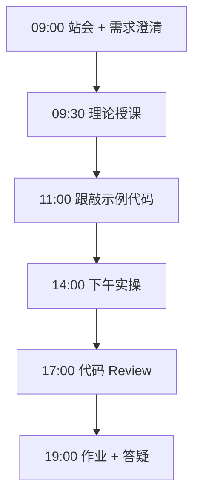
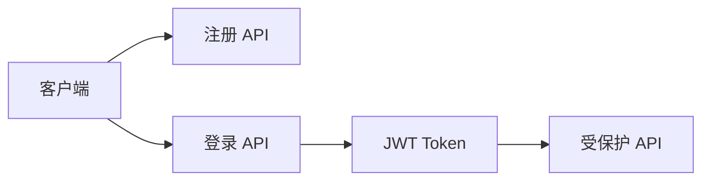

# Day 59：毕业设计开发：用户认证模块

> **阶段**：Phase 6：毕业设计 | **Epic**：NEXUS-E6 | **预计学时**：6-8 小时

## 旁白解读：今日上下文

> 🎬 **模拟站会 09:00** — 智链科技 Nexus 项目组

Day 59 起进入毕业设计冲刺周。陈工：「认证是一切的入口，没有用户体系的项目不算企业级。」

**今日在 NexusAgent 主线中的位置**：毕业项目用户体系

**今日 Jira 看板**：
- `NEXUS-603`

---


## 需求文档（产品林悦下发）

**文档编号**：PRD-NEXUS-D59  
**版本**：v1.0  
**优先级**：P0

### 背景

Phase 6：毕业设计阶段第 59 天教学任务，与 NexusAgent 主线项目对齐。

### User Stories

### NEXUS-603

**描述**：毕业设计开发：用户认证模块 相关交付

**验收标准**：
- [ ] 代码可本地运行
- [ ] 通过 `scripts/verify_day.py --day 59`


---


## 今日课表

### 上午 09:00-12:00

- 站会：选题评审反馈与调整
- JWT 认证原理与 OAuth2 密码模式
- SQLAlchemy ORM 模型设计
- 密码哈希最佳实践（bcrypt）

### 下午 14:00-17:30

- 实现 auth/models.py 用户模型
- 开发 auth/service.py 注册/登录/JWT
- 编写 auth/router.py API 端点
- Postman/curl 测试注册登录流程

### 晚自习 19:00-21:00

- 集成 auth router 到 main.py
- 编写认证模块 README
- 预习 RAG 知识库设计

---


## 课堂笔记

### 核心知识点速查

| 序号 | 知识点 | 代码位置 |
|------|--------|----------|
| 1 | JWT 认证 | 见下午实操 |
| 2 | 密码哈希 | 见下午实操 |
| 3 | 用户注册登录 | 见下午实操 |
| 4 | SQLAlchemy 模型 | 见下午实操 |
| 5 | API 路由设计 | 见下午实操 |

### 今日流程图



### 架构示意图（当日目标）



---


## 实操代码清单

- `code/graduation_project/nexus_capstone/README.md`
- `code/graduation_project/nexus_capstone/requirements.txt`
- `code/graduation_project/nexus_capstone/app/__init__.py`
- `code/graduation_project/nexus_capstone/app/main.py`
- `code/graduation_project/nexus_capstone/docs/PROJECT_PROPOSAL.md`
- `code/graduation_project/nexus_capstone/docker-compose.dev.yml`
- `code/graduation_project/nexus_capstone/app/auth/__init__.py`
- `code/graduation_project/nexus_capstone/app/auth/models.py`
- `code/graduation_project/nexus_capstone/app/auth/service.py`
- `code/graduation_project/nexus_capstone/app/auth/router.py`

请按顺序创建并运行。每段代码均可直接复制到对应文件执行。

---

## 实验手册（分时段操作表）

### 实验步骤 1：09:30-10:30 理论

| 时间 | 动作 | 预期结果 | 失败处理 |
|------|------|----------|----------|
| +0min | 打开课件本节 | 看到需求与验收标准 | 检查是否拉取最新 `develop` 分支 |
| +10min | 创建/打开当日 `code/` 文件 | 文件路径与清单一致 | 对照「实操代码清单」 |
| +30min | 粘贴并运行第一个脚本 | 终端有正常输出无 Traceback | 见下方「排错手册」 |
| +60min | 完成全部文件并自测 | `python3` 运行通过 | 使用 `scripts/verify_day.py --day 59` |
| +90min | 提交 Git 并建 MR | MR 关联 Jira NEXUS-603 | 按附录 Git 示例操作 |


### 实验步骤 2：10:30-12:00 跟敲

| 时间 | 动作 | 预期结果 | 失败处理 |
|------|------|----------|----------|
| +0min | 打开课件本节 | 看到需求与验收标准 | 检查是否拉取最新 `develop` 分支 |
| +10min | 创建/打开当日 `code/` 文件 | 文件路径与清单一致 | 对照「实操代码清单」 |
| +30min | 粘贴并运行第一个脚本 | 终端有正常输出无 Traceback | 见下方「排错手册」 |
| +60min | 完成全部文件并自测 | `python3` 运行通过 | 使用 `scripts/verify_day.py --day 59` |
| +90min | 提交 Git 并建 MR | MR 关联 Jira NEXUS-603 | 按附录 Git 示例操作 |


### 实验步骤 3：14:00-15:30 实操

| 时间 | 动作 | 预期结果 | 失败处理 |
|------|------|----------|----------|
| +0min | 打开课件本节 | 看到需求与验收标准 | 检查是否拉取最新 `develop` 分支 |
| +10min | 创建/打开当日 `code/` 文件 | 文件路径与清单一致 | 对照「实操代码清单」 |
| +30min | 粘贴并运行第一个脚本 | 终端有正常输出无 Traceback | 见下方「排错手册」 |
| +60min | 完成全部文件并自测 | `python3` 运行通过 | 使用 `scripts/verify_day.py --day 59` |
| +90min | 提交 Git 并建 MR | MR 关联 Jira NEXUS-603 | 按附录 Git 示例操作 |


### 实验步骤 4：15:30-17:00 联调

| 时间 | 动作 | 预期结果 | 失败处理 |
|------|------|----------|----------|
| +0min | 打开课件本节 | 看到需求与验收标准 | 检查是否拉取最新 `develop` 分支 |
| +10min | 创建/打开当日 `code/` 文件 | 文件路径与清单一致 | 对照「实操代码清单」 |
| +30min | 粘贴并运行第一个脚本 | 终端有正常输出无 Traceback | 见下方「排错手册」 |
| +60min | 完成全部文件并自测 | `python3` 运行通过 | 使用 `scripts/verify_day.py --day 59` |
| +90min | 提交 Git 并建 MR | MR 关联 Jira NEXUS-603 | 按附录 Git 示例操作 |


### 实验步骤 5：19:00-20:30 作业

| 时间 | 动作 | 预期结果 | 失败处理 |
|------|------|----------|----------|
| +0min | 打开课件本节 | 看到需求与验收标准 | 检查是否拉取最新 `develop` 分支 |
| +10min | 创建/打开当日 `code/` 文件 | 文件路径与清单一致 | 对照「实操代码清单」 |
| +30min | 粘贴并运行第一个脚本 | 终端有正常输出无 Traceback | 见下方「排错手册」 |
| +60min | 完成全部文件并自测 | `python3` 运行通过 | 使用 `scripts/verify_day.py --day 59` |
| +90min | 提交 Git 并建 MR | MR 关联 Jira NEXUS-603 | 按附录 Git 示例操作 |


### 排错手册（Day 59）

1. **`command not found: python3`** → 安装 Python 3.10+ 或使用 `py -3`（Windows）
2. **`ModuleNotFoundError`** → 确认当前目录、是否激活 venv、`pip install -r requirements.txt`（若当日有）
3. **`SyntaxError: invalid syntax`** → 检查上一行是否缺括号、引号是否中文
4. **`UnicodeDecodeError`** → 文件保存为 UTF-8，终端 `export PYTHONIOENCODING=utf-8`
5. **API 相关（Day12+）** → 检查 `.env` 中 Key，无 Key 时使用课件 MOCK 模式

---


## 逐步跟敲指南（完整源码与解析）

> 以下代码与 `code/` 目录完全一致，可直接复制。每段附行级说明。

### 文件：`code/graduation_project/nexus_capstone/README.md`

**操作步骤**：
1. 在 `courseware/day-59/code/` 下创建文件 `graduation_project/nexus_capstone/README.md`
2. 完整粘贴下方代码
3. 在终端执行：`cd courseware/day-59/code && python3 README.md.py`（若为包内模块则按课件说明）

```python
# Nexus Capstone — 毕业设计项目

> 智链科技 NexusAgent 训练营毕业设计脚手架

## 项目简介
基于 70 天所学，构建一个可演示的企业级 AI Agent 应用。

## 技术栈
- FastAPI + SQLAlchemy + Redis
- Chroma 向量检索 + LangGraph Agent 编排
- Docker Compose 一键部署

## 快速启动
```bash
cd graduation_project/nexus_capstone
pip install -r requirements.txt
uvicorn app.main:app --reload
```

## 模块进度
- [ ] 用户认证 (Day 59)
- [ ] 知识库 RAG (Day 60)
- [ ] Agent 编排 (Day 61)
- [ ] API 网关 (Day 62)
- [ ] 前端界面 (Day 63)
- [ ] 测试与优化 (Day 64)

```

**解析要点（`graduation_project/nexus_capstone/README.md`）**：

- 共 **26** 行，请逐行阅读注释中的中文说明

- 运行前确认 Python 版本 ≥ 3.10：`python3 --version`

- 若报错，先检查缩进是否为 4 空格，勿混用 Tab

- 企业 Review 清单：命名是否清晰、是否有异常处理、是否可复用

---

### 文件：`code/graduation_project/nexus_capstone/requirements.txt`

**操作步骤**：
1. 在 `courseware/day-59/code/` 下创建文件 `graduation_project/nexus_capstone/requirements.txt`
2. 完整粘贴下方代码
3. 在终端执行：`cd courseware/day-59/code && python3 requirements.txt.py`（若为包内模块则按课件说明）

```python
fastapi>=0.110.0
uvicorn[standard]>=0.27.0
sqlalchemy>=2.0.0
redis>=5.0.0
httpx>=0.27.0
chromadb>=0.5.0
pydantic>=2.0.0
python-jose[cryptography]>=3.3.0
passlib[bcrypt]>=1.7.4
langgraph>=0.2.0

```

**解析要点（`graduation_project/nexus_capstone/requirements.txt`）**：

- 共 **10** 行，请逐行阅读注释中的中文说明

- 运行前确认 Python 版本 ≥ 3.10：`python3 --version`

- 若报错，先检查缩进是否为 4 空格，勿混用 Tab

- 企业 Review 清单：命名是否清晰、是否有异常处理、是否可复用

---

### 文件：`code/graduation_project/nexus_capstone/app/__init__.py`

**操作步骤**：
1. 在 `courseware/day-59/code/` 下创建文件 `graduation_project/nexus_capstone/app/__init__.py`
2. 完整粘贴下方代码
3. 在终端执行：`cd courseware/day-59/code && python3 __init__.py`（若为包内模块则按课件说明）

```python
"""Nexus Capstone 毕业设计应用包"""

```

**解析要点（`graduation_project/nexus_capstone/app/__init__.py`）**：

- 共 **1** 行，请逐行阅读注释中的中文说明

- 运行前确认 Python 版本 ≥ 3.10：`python3 --version`

- 若报错，先检查缩进是否为 4 空格，勿混用 Tab

- 企业 Review 清单：命名是否清晰、是否有异常处理、是否可复用

---

### 文件：`code/graduation_project/nexus_capstone/app/main.py`

**操作步骤**：
1. 在 `courseware/day-59/code/` 下创建文件 `graduation_project/nexus_capstone/app/main.py`
2. 完整粘贴下方代码
3. 在终端执行：`cd courseware/day-59/code && python3 main.py`（若为包内模块则按课件说明）

```python
#!/usr/bin/env python3
"""
Day 58 — 毕业设计入口：FastAPI 应用骨架
"""
from fastapi import FastAPI
from fastapi.middleware.cors import CORSMiddleware

app = FastAPI(
    title="Nexus Capstone",
    description="智链科技训练营毕业设计 — AI Agent 平台",
    version="1.0.0",
)

app.add_middleware(
    CORSMiddleware,
    allow_origins=["*"],
    allow_methods=["*"],
    allow_headers=["*"],
)


@app.get("/health")
def health_check() -> dict:
    """健康检查端点，部署脚本依赖此接口"""
    return {"status": "ok", "service": "nexus-capstone"}


@app.get("/api/v1/info")
def project_info() -> dict:
    """项目元信息，答辩演示用"""
    return {
        "name": "Nexus Capstone",
        "author": "学员姓名",
        "modules": ["auth", "rag", "agent", "api", "frontend"],
        "status": "scaffold",
    }

```

**解析要点（`graduation_project/nexus_capstone/app/main.py`）**：

- 共 **36** 行，请逐行阅读注释中的中文说明

- 运行前确认 Python 版本 ≥ 3.10：`python3 --version`

- 若报错，先检查缩进是否为 4 空格，勿混用 Tab

- 企业 Review 清单：命名是否清晰、是否有异常处理、是否可复用

---

### 文件：`code/graduation_project/nexus_capstone/docs/PROJECT_PROPOSAL.md`

**操作步骤**：
1. 在 `courseware/day-59/code/` 下创建文件 `graduation_project/nexus_capstone/docs/PROJECT_PROPOSAL.md`
2. 完整粘贴下方代码
3. 在终端执行：`cd courseware/day-59/code && python3 PROJECT_PROPOSAL.md.py`（若为包内模块则按课件说明）

```python
# 毕业设计选题书

## 1. 项目名称
（填写你的项目名称，如：智链客服智能助手）

## 2. 问题背景
描述要解决的企业痛点（参考智链科技真实场景）

## 3. 核心功能
- 功能 1：
- 功能 2：
- 功能 3：

## 4. 技术方案
| 模块 | 技术选型 | 说明 |
|------|---------|------|
| 后端 | FastAPI | REST API |
| 检索 | Chroma | 向量知识库 |
| Agent | LangGraph | 多步推理编排 |
| 部署 | Docker Compose | 生产级交付 |

## 5. 里程碑
| 天数 | 交付物 |
|------|--------|
| Day 59 | 用户认证模块 |
| Day 60 | RAG 知识库 |
| Day 61 | Agent 编排 |
| Day 62 | API 集成 |
| Day 63 | 前端界面 |
| Day 64 | 测试优化 |
| Day 65 | 答辩 PPT |

```

**解析要点（`graduation_project/nexus_capstone/docs/PROJECT_PROPOSAL.md`）**：

- 共 **31** 行，请逐行阅读注释中的中文说明

- 运行前确认 Python 版本 ≥ 3.10：`python3 --version`

- 若报错，先检查缩进是否为 4 空格，勿混用 Tab

- 企业 Review 清单：命名是否清晰、是否有异常处理、是否可复用

---

### 文件：`code/graduation_project/nexus_capstone/docker-compose.dev.yml`

**操作步骤**：
1. 在 `courseware/day-59/code/` 下创建文件 `graduation_project/nexus_capstone/docker-compose.dev.yml`
2. 完整粘贴下方代码
3. 在终端执行：`cd courseware/day-59/code && python3 docker-compose.dev.yml.py`（若为包内模块则按课件说明）

```python
version: "3.9"
services:
  app:
    build: .
    ports: ["8080:8080"]
    environment:
      DATABASE_URL: postgresql://capstone:capstone@db:5432/capstone
      REDIS_URL: redis://redis:6379/0
    depends_on: [db, redis]
  db:
    image: postgres:16-alpine
    environment: {POSTGRES_USER: capstone, POSTGRES_PASSWORD: capstone, POSTGRES_DB: capstone}
  redis:
    image: redis:7-alpine

```

**解析要点（`graduation_project/nexus_capstone/docker-compose.dev.yml`）**：

- 共 **14** 行，请逐行阅读注释中的中文说明

- 运行前确认 Python 版本 ≥ 3.10：`python3 --version`

- 若报错，先检查缩进是否为 4 空格，勿混用 Tab

- 企业 Review 清单：命名是否清晰、是否有异常处理、是否可复用

---

### 文件：`code/graduation_project/nexus_capstone/app/auth/__init__.py`

**操作步骤**：
1. 在 `courseware/day-59/code/` 下创建文件 `graduation_project/nexus_capstone/app/auth/__init__.py`
2. 完整粘贴下方代码
3. 在终端执行：`cd courseware/day-59/code && python3 __init__.py`（若为包内模块则按课件说明）

```python

```

**解析要点（`graduation_project/nexus_capstone/app/auth/__init__.py`）**：

- 共 **0** 行，请逐行阅读注释中的中文说明

- 运行前确认 Python 版本 ≥ 3.10：`python3 --version`

- 若报错，先检查缩进是否为 4 空格，勿混用 Tab

- 企业 Review 清单：命名是否清晰、是否有异常处理、是否可复用

---

### 文件：`code/graduation_project/nexus_capstone/app/auth/models.py`

**操作步骤**：
1. 在 `courseware/day-59/code/` 下创建文件 `graduation_project/nexus_capstone/app/auth/models.py`
2. 完整粘贴下方代码
3. 在终端执行：`cd courseware/day-59/code && python3 models.py`（若为包内模块则按课件说明）

```python
"""Day 59 — 用户数据模型"""
from sqlalchemy import Column, Integer, String, DateTime
from sqlalchemy.orm import declarative_base
from datetime import datetime

Base = declarative_base()


class User(Base):
    __tablename__ = "users"
    id = Column(Integer, primary_key=True)
    username = Column(String(64), unique=True, nullable=False)
    email = Column(String(128), unique=True, nullable=False)
    hashed_password = Column(String(256), nullable=False)
    created_at = Column(DateTime, default=datetime.utcnow)

```

**解析要点（`graduation_project/nexus_capstone/app/auth/models.py`）**：

- 共 **15** 行，请逐行阅读注释中的中文说明

- 运行前确认 Python 版本 ≥ 3.10：`python3 --version`

- 若报错，先检查缩进是否为 4 空格，勿混用 Tab

- 企业 Review 清单：命名是否清晰、是否有异常处理、是否可复用

---

### 文件：`code/graduation_project/nexus_capstone/app/auth/service.py`

**操作步骤**：
1. 在 `courseware/day-59/code/` 下创建文件 `graduation_project/nexus_capstone/app/auth/service.py`
2. 完整粘贴下方代码
3. 在终端执行：`cd courseware/day-59/code && python3 service.py`（若为包内模块则按课件说明）

```python
"""Day 59 — 认证服务：注册、登录、JWT"""
from passlib.context import CryptContext
from jose import jwt
from datetime import datetime, timedelta

pwd_context = CryptContext(schemes=["bcrypt"], deprecated="auto")
SECRET_KEY = "capstone-dev-secret"  # 生产环境从环境变量读取
ALGORITHM = "HS256"


def hash_password(password: str) -> str:
    return pwd_context.hash(password)


def verify_password(plain: str, hashed: str) -> bool:
    return pwd_context.verify(plain, hashed)


def create_access_token(user_id: int, expires_hours: int = 24) -> str:
    payload = {
        "sub": str(user_id),
        "exp": datetime.utcnow() + timedelta(hours=expires_hours),
    }
    return jwt.encode(payload, SECRET_KEY, algorithm=ALGORITHM)

```

**解析要点（`graduation_project/nexus_capstone/app/auth/service.py`）**：

- 共 **24** 行，请逐行阅读注释中的中文说明

- 运行前确认 Python 版本 ≥ 3.10：`python3 --version`

- 若报错，先检查缩进是否为 4 空格，勿混用 Tab

- 企业 Review 清单：命名是否清晰、是否有异常处理、是否可复用

---

### 文件：`code/graduation_project/nexus_capstone/app/auth/router.py`

**操作步骤**：
1. 在 `courseware/day-59/code/` 下创建文件 `graduation_project/nexus_capstone/app/auth/router.py`
2. 完整粘贴下方代码
3. 在终端执行：`cd courseware/day-59/code && python3 router.py`（若为包内模块则按课件说明）

```python
"""Day 59 — 认证 API 路由"""
from fastapi import APIRouter, HTTPException
from pydantic import BaseModel, EmailStr

router = APIRouter(prefix="/api/v1/auth", tags=["认证"])

# 内存存储（教学演示，生产用数据库）
_users_db: dict[str, dict] = {}


class RegisterRequest(BaseModel):
    username: str
    email: EmailStr
    password: str


class LoginRequest(BaseModel):
    username: str
    password: str


@router.post("/register")
def register(req: RegisterRequest) -> dict:
  if req.username in _users_db:
      raise HTTPException(400, "用户名已存在")
  from app.auth.service import hash_password
  _users_db[req.username] = {"email": req.email, "password": hash_password(req.password)}
  return {"message": "注册成功", "username": req.username}


@router.post("/login")
def login(req: LoginRequest) -> dict:
    user = _users_db.get(req.username)
    if not user:
        raise HTTPException(401, "用户不存在")
    from app.auth.service import verify_password, create_access_token
    if not verify_password(req.password, user["password"]):
        raise HTTPException(401, "密码错误")
    return {"access_token": create_access_token(1), "token_type": "bearer"}

```

**解析要点（`graduation_project/nexus_capstone/app/auth/router.py`）**：

- 共 **39** 行，请逐行阅读注释中的中文说明

- 运行前确认 Python 版本 ≥ 3.10：`python3 --version`

- 若报错，先检查缩进是否为 4 空格，勿混用 Tab

- 企业 Review 清单：命名是否清晰、是否有异常处理、是否可复用

---


### 深度讲解 1：JWT 认证

在企业级 Python 开发与大模型应用工程中，**JWT 认证** 是学员必须牢固掌握的基本功。智链科技 Nexus 项目组在 Day 59 的代码评审中，特别强调以下几点：

1. **为什么学**：JWT 认证 直接服务于后续 NexusAgent 平台的 `NEXUS-E6` 模块。没有扎实的 JWT 认证，Day 66 之后调用 API、解析 JSON、编写 Agent 工具函数时会出现大量低级错误。

2. **常见坑**：
   - 忽略输入类型校验，导致运行时 `TypeError`
   - 编码问题（Windows 默认 GBK vs UTF-8）
   - 复制粘贴时缩进错乱（Python 对缩进敏感）

3. **企业实践**：在 SmartLink 的 GitLab 仓库中，所有与 JWT 认证 相关的代码必须经过 Ruff 静态检查；变量命名使用 `snake_case`，常量使用 `UPPER_SNAKE_CASE`。

4. **与主线项目的关系**：今日代码位于 `courseware/day-59/code/`，部分模块将逐步合并到 `platform/nexus_agent/`。请养成「每日代码皆可运行、皆可测试」的习惯。

5. **扩展阅读建议**：完成今日作业后，可阅读 `docs/project-master-plan.md` 中关于 NEXUS-E6 的章节，建立全局视角。

**课堂互动题**：请用 3 句话向非技术同事解释「JWT 认证」是什么。写在作业 MR 的评论里，讲师会抽查点评。

**实操检查清单**：
- [ ] 能不看课件复述 JWT 认证 的定义
- [ ] 能独立写出相关代码并运行
- [ ] 能向同学讲解一处容易写错的地方


### 深度讲解 2：密码哈希

在企业级 Python 开发与大模型应用工程中，**密码哈希** 是学员必须牢固掌握的基本功。智链科技 Nexus 项目组在 Day 59 的代码评审中，特别强调以下几点：

1. **为什么学**：密码哈希 直接服务于后续 NexusAgent 平台的 `NEXUS-E6` 模块。没有扎实的 密码哈希，Day 66 之后调用 API、解析 JSON、编写 Agent 工具函数时会出现大量低级错误。

2. **常见坑**：
   - 忽略输入类型校验，导致运行时 `TypeError`
   - 编码问题（Windows 默认 GBK vs UTF-8）
   - 复制粘贴时缩进错乱（Python 对缩进敏感）

3. **企业实践**：在 SmartLink 的 GitLab 仓库中，所有与 密码哈希 相关的代码必须经过 Ruff 静态检查；变量命名使用 `snake_case`，常量使用 `UPPER_SNAKE_CASE`。

4. **与主线项目的关系**：今日代码位于 `courseware/day-59/code/`，部分模块将逐步合并到 `platform/nexus_agent/`。请养成「每日代码皆可运行、皆可测试」的习惯。

5. **扩展阅读建议**：完成今日作业后，可阅读 `docs/project-master-plan.md` 中关于 NEXUS-E6 的章节，建立全局视角。

**课堂互动题**：请用 3 句话向非技术同事解释「密码哈希」是什么。写在作业 MR 的评论里，讲师会抽查点评。

**实操检查清单**：
- [ ] 能不看课件复述 密码哈希 的定义
- [ ] 能独立写出相关代码并运行
- [ ] 能向同学讲解一处容易写错的地方


### 深度讲解 3：用户注册登录

在企业级 Python 开发与大模型应用工程中，**用户注册登录** 是学员必须牢固掌握的基本功。智链科技 Nexus 项目组在 Day 59 的代码评审中，特别强调以下几点：

1. **为什么学**：用户注册登录 直接服务于后续 NexusAgent 平台的 `NEXUS-E6` 模块。没有扎实的 用户注册登录，Day 66 之后调用 API、解析 JSON、编写 Agent 工具函数时会出现大量低级错误。

2. **常见坑**：
   - 忽略输入类型校验，导致运行时 `TypeError`
   - 编码问题（Windows 默认 GBK vs UTF-8）
   - 复制粘贴时缩进错乱（Python 对缩进敏感）

3. **企业实践**：在 SmartLink 的 GitLab 仓库中，所有与 用户注册登录 相关的代码必须经过 Ruff 静态检查；变量命名使用 `snake_case`，常量使用 `UPPER_SNAKE_CASE`。

4. **与主线项目的关系**：今日代码位于 `courseware/day-59/code/`，部分模块将逐步合并到 `platform/nexus_agent/`。请养成「每日代码皆可运行、皆可测试」的习惯。

5. **扩展阅读建议**：完成今日作业后，可阅读 `docs/project-master-plan.md` 中关于 NEXUS-E6 的章节，建立全局视角。

**课堂互动题**：请用 3 句话向非技术同事解释「用户注册登录」是什么。写在作业 MR 的评论里，讲师会抽查点评。

**实操检查清单**：
- [ ] 能不看课件复述 用户注册登录 的定义
- [ ] 能独立写出相关代码并运行
- [ ] 能向同学讲解一处容易写错的地方


### 深度讲解 4：SQLAlchemy 模型

在企业级 Python 开发与大模型应用工程中，**SQLAlchemy 模型** 是学员必须牢固掌握的基本功。智链科技 Nexus 项目组在 Day 59 的代码评审中，特别强调以下几点：

1. **为什么学**：SQLAlchemy 模型 直接服务于后续 NexusAgent 平台的 `NEXUS-E6` 模块。没有扎实的 SQLAlchemy 模型，Day 66 之后调用 API、解析 JSON、编写 Agent 工具函数时会出现大量低级错误。

2. **常见坑**：
   - 忽略输入类型校验，导致运行时 `TypeError`
   - 编码问题（Windows 默认 GBK vs UTF-8）
   - 复制粘贴时缩进错乱（Python 对缩进敏感）

3. **企业实践**：在 SmartLink 的 GitLab 仓库中，所有与 SQLAlchemy 模型 相关的代码必须经过 Ruff 静态检查；变量命名使用 `snake_case`，常量使用 `UPPER_SNAKE_CASE`。

4. **与主线项目的关系**：今日代码位于 `courseware/day-59/code/`，部分模块将逐步合并到 `platform/nexus_agent/`。请养成「每日代码皆可运行、皆可测试」的习惯。

5. **扩展阅读建议**：完成今日作业后，可阅读 `docs/project-master-plan.md` 中关于 NEXUS-E6 的章节，建立全局视角。

**课堂互动题**：请用 3 句话向非技术同事解释「SQLAlchemy 模型」是什么。写在作业 MR 的评论里，讲师会抽查点评。

**实操检查清单**：
- [ ] 能不看课件复述 SQLAlchemy 模型 的定义
- [ ] 能独立写出相关代码并运行
- [ ] 能向同学讲解一处容易写错的地方


### 深度讲解 5：API 路由设计

在企业级 Python 开发与大模型应用工程中，**API 路由设计** 是学员必须牢固掌握的基本功。智链科技 Nexus 项目组在 Day 59 的代码评审中，特别强调以下几点：

1. **为什么学**：API 路由设计 直接服务于后续 NexusAgent 平台的 `NEXUS-E6` 模块。没有扎实的 API 路由设计，Day 66 之后调用 API、解析 JSON、编写 Agent 工具函数时会出现大量低级错误。

2. **常见坑**：
   - 忽略输入类型校验，导致运行时 `TypeError`
   - 编码问题（Windows 默认 GBK vs UTF-8）
   - 复制粘贴时缩进错乱（Python 对缩进敏感）

3. **企业实践**：在 SmartLink 的 GitLab 仓库中，所有与 API 路由设计 相关的代码必须经过 Ruff 静态检查；变量命名使用 `snake_case`，常量使用 `UPPER_SNAKE_CASE`。

4. **与主线项目的关系**：今日代码位于 `courseware/day-59/code/`，部分模块将逐步合并到 `platform/nexus_agent/`。请养成「每日代码皆可运行、皆可测试」的习惯。

5. **扩展阅读建议**：完成今日作业后，可阅读 `docs/project-master-plan.md` 中关于 NEXUS-E6 的章节，建立全局视角。

**课堂互动题**：请用 3 句话向非技术同事解释「API 路由设计」是什么。写在作业 MR 的评论里，讲师会抽查点评。

**实操检查清单**：
- [ ] 能不看课件复述 API 路由设计 的定义
- [ ] 能独立写出相关代码并运行
- [ ] 能向同学讲解一处容易写错的地方


## 阶段复盘锚点（Phase 6：毕业设计）

今天是 **Phase 6：毕业设计** 的第 **9** 个学习日。请回顾：

- 昨天学了什么？今天如何承接？
- 今天的内容在 70 天路线图中的坐标？
- 如果我是 Tech Lead，会如何 Review 今日代码？

**陈工寄语**：慢即是快。企业里没人关心你一天学了多少个语法点，只关心你写的脚本能不能在服务器上稳定跑 7×24 小时。今天把地基打牢，后面 Agent 编排、RAG 检索才不会塌。

**林悦补充**：产品侧只验收「用户能感知到的价值」。今日交付虽然简单，但「个人信息卡片」本质是后续「用户画像 Agent」的数据采集原型——字段设计请认真思考。

**代码量统计（累计）**：完成今日后，个人仓库累计约 **82600** 行（含注释与测试），全营目标 10 万行。

**明日预告**：请提前阅读 `courseware/day-60/README.md` 开头的旁白，了解上下文。


## 常见问题 FAQ（讲师答疑实录）


**Q1：学习「JWT 认证」时最常问的问题是什么？**

A：学员常问「这在大模型开发里到底用在哪里」。直接回答：在 NexusAgent 的 `NEXUS-E6` 中，JWT 认证 用于支撑「毕业设计开发：用户认证模块」这一交付。建议你打开 `platform/` 对照看未来模块如何引用今日写法。另一个常见问题是「要不要背语法」——不需要背，但要能写出可运行代码，并能在报错时读懂 Traceback。

**追问**：如果线上报错与 JWT 认证 相关，如何排查？  
**答**：① 复现 ② 最小化输入 ③ 打印中间变量 ④ 查 GitLab 历史 diff ⑤ 在 Jira 建 Bug 单附上日志。


**Q2：学习「密码哈希」时最常问的问题是什么？**

A：学员常问「这在大模型开发里到底用在哪里」。直接回答：在 NexusAgent 的 `NEXUS-E6` 中，密码哈希 用于支撑「毕业设计开发：用户认证模块」这一交付。建议你打开 `platform/` 对照看未来模块如何引用今日写法。另一个常见问题是「要不要背语法」——不需要背，但要能写出可运行代码，并能在报错时读懂 Traceback。

**追问**：如果线上报错与 密码哈希 相关，如何排查？  
**答**：① 复现 ② 最小化输入 ③ 打印中间变量 ④ 查 GitLab 历史 diff ⑤ 在 Jira 建 Bug 单附上日志。


**Q3：学习「用户注册登录」时最常问的问题是什么？**

A：学员常问「这在大模型开发里到底用在哪里」。直接回答：在 NexusAgent 的 `NEXUS-E6` 中，用户注册登录 用于支撑「毕业设计开发：用户认证模块」这一交付。建议你打开 `platform/` 对照看未来模块如何引用今日写法。另一个常见问题是「要不要背语法」——不需要背，但要能写出可运行代码，并能在报错时读懂 Traceback。

**追问**：如果线上报错与 用户注册登录 相关，如何排查？  
**答**：① 复现 ② 最小化输入 ③ 打印中间变量 ④ 查 GitLab 历史 diff ⑤ 在 Jira 建 Bug 单附上日志。


**Q4：学习「SQLAlchemy 模型」时最常问的问题是什么？**

A：学员常问「这在大模型开发里到底用在哪里」。直接回答：在 NexusAgent 的 `NEXUS-E6` 中，SQLAlchemy 模型 用于支撑「毕业设计开发：用户认证模块」这一交付。建议你打开 `platform/` 对照看未来模块如何引用今日写法。另一个常见问题是「要不要背语法」——不需要背，但要能写出可运行代码，并能在报错时读懂 Traceback。

**追问**：如果线上报错与 SQLAlchemy 模型 相关，如何排查？  
**答**：① 复现 ② 最小化输入 ③ 打印中间变量 ④ 查 GitLab 历史 diff ⑤ 在 Jira 建 Bug 单附上日志。


**Q5：学习「API 路由设计」时最常问的问题是什么？**

A：学员常问「这在大模型开发里到底用在哪里」。直接回答：在 NexusAgent 的 `NEXUS-E6` 中，API 路由设计 用于支撑「毕业设计开发：用户认证模块」这一交付。建议你打开 `platform/` 对照看未来模块如何引用今日写法。另一个常见问题是「要不要背语法」——不需要背，但要能写出可运行代码，并能在报错时读懂 Traceback。

**追问**：如果线上报错与 API 路由设计 相关，如何排查？  
**答**：① 复现 ② 最小化输入 ③ 打印中间变量 ④ 查 GitLab 历史 diff ⑤ 在 Jira 建 Bug 单附上日志。


## 面试押题（与今日知识点挂钩）

以下题目会出现在 Day 67-69 模拟面试中，建议今日就开始积累答案：

1. **JWT 认证**：请结合 NexusAgent 项目举例说明你在哪一天、哪段代码里用到了它？
2. **密码哈希**：请结合 NexusAgent 项目举例说明你在哪一天、哪段代码里用到了它？
3. **用户注册登录**：请结合 NexusAgent 项目举例说明你在哪一天、哪段代码里用到了它？
4. **SQLAlchemy 模型**：请结合 NexusAgent 项目举例说明你在哪一天、哪段代码里用到了它？
5. **API 路由设计**：请结合 NexusAgent 项目举例说明你在哪一天、哪段代码里用到了它？

**参考答案思路**：采用 STAR 法则（情境-任务-行动-结果），引用 `courseware/day-59/code/` 中的具体文件名与函数名。

---


## Code Review 检查表（陈工版）

合并 MR 前自查：

- [ ] 所有新增 `.py` 文件顶部有模块说明 docstring
- [ ] 无硬编码密钥（API Key 走环境变量）
- [ ] 函数长度 < 50 行，过长则拆分
- [ ] 异常有明确提示，禁止裸 `except:`
- [ ] 提交信息符合 `feat(day-59): ...`
- [ ] README 或注释说明如何运行
- [ ] 与 Jira Story 验收标准逐条对应

**今日重点审查项**：毕业设计开发：用户认证模块 相关逻辑是否可读、可测、可扩展至 `platform/nexus_agent/`。

---


## 课后作业

### 作业说明

完成用户注册、登录、JWT 签发功能。至少 2 个 API 端点可调用。密码必须哈希存储，禁止明文。

### 提交要求

1. 代码提交到分支 `feature/day-59-homework`
2. GitLab MR 标题：`[Day-59] homework: 课后作业`
3. 在 MR 描述中附上运行截图或终端输出

### 评分标准（满分 100）

| 项 | 分值 |
|----|------|
| 功能完整 | 40 |
| 代码规范与注释 | 30 |
| 异常处理 | 15 |
| MR 与 Jira 关联 | 15 |

---

## 作业参考答案

> ⚠️ 请先独立完成再对照答案

POST /api/v1/auth/register + /login。JWT payload 含 sub(user_id) 和 exp。生产环境 SECRET_KEY 从环境变量读取。

---


## 附录：Git 提交示例

```bash
git checkout develop
git pull origin develop
git checkout -b feature/day-59-毕业设计开发：用户认
# 完成代码后
git add courseware/day-59/
git commit -m "feat(day-59): 毕业设计开发：用户认证模块"
git push -u origin feature/day-59-毕业设计开发：用户认
```

---

*课件版本 Day-59-v1.0 | 智链科技培训中心*
