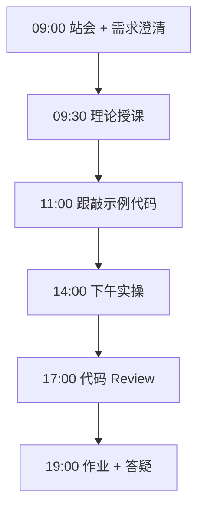

# Day 65：毕业答辩：项目演示与评审

> **阶段**：Phase 6：毕业设计 | **Epic**：NEXUS-E6 | **预计学时**：6-8 小时

## 旁白解读：今日上下文

> 🎬 **模拟站会 09:00** — 智链科技 Nexus 项目组

答辩日。林悦主持：「70 天的学习，15 分钟来证明。放松，你们比想象中准备得更充分。」

**今日在 NexusAgent 主线中的位置**：毕业设计最终交付验收

**今日 Jira 看板**：
- `NEXUS-609`

---


## 需求文档（产品林悦下发）

**文档编号**：PRD-NEXUS-D65  
**版本**：v1.0  
**优先级**：P0

### 背景

Phase 6：毕业设计阶段第 65 天教学任务，与 NexusAgent 主线项目对齐。

### User Stories

### NEXUS-609

**描述**：毕业答辩：项目演示与评审 相关交付

**验收标准**：
- [ ] 代码可本地运行
- [ ] 通过 `scripts/verify_day.py --day 65`


---


## 今日课表

### 上午 09:00-12:00

- 答辩流程说明：10 分钟演示 + 5 分钟 Q&A
- PPT 结构指导：背景 → 方案 → 演示 → 总结
- 演示环境检查清单（网络、GPU、备用录屏）
- 第一批学员答辩（上午场）

### 下午 14:00-17:30

- 第二批学员答辩（下午场）
- 评委点评与改进建议记录
- 互评环节：每组点评另一组项目
- 答辩成绩统计与反馈

### 晚自习 19:00-21:00

- 根据答辩反馈列出改进项
- 整理答辩 PPT 最终版
- 预习简历编写要点

---


## 课堂笔记

### 核心知识点速查

| 序号 | 知识点 | 代码位置 |
|------|--------|----------|
| 1 | 毕业答辩 | 见下午实操 |
| 2 | 项目演示 | 见下午实操 |
| 3 | 技术评审 | 见下午实操 |
| 4 | PPT 制作 | 见下午实操 |
| 5 | Q&A 应对 | 见下午实操 |

### 今日流程图



### 架构示意图（当日目标）


---


## 实操代码清单

- `code/graduation_project/nexus_capstone/docs/DEFENSE_GUIDE.md`
- `code/graduation_project/nexus_capstone/docs/DEFENSE_TEMPLATE.pptx.md`

请按顺序创建并运行。每段代码均可直接复制到对应文件执行。

---

## 实验手册（分时段操作表）

### 实验步骤 1：09:30-10:30 理论

| 时间 | 动作 | 预期结果 | 失败处理 |
|------|------|----------|----------|
| +0min | 打开课件本节 | 看到需求与验收标准 | 检查是否拉取最新 `develop` 分支 |
| +10min | 创建/打开当日 `code/` 文件 | 文件路径与清单一致 | 对照「实操代码清单」 |
| +30min | 粘贴并运行第一个脚本 | 终端有正常输出无 Traceback | 见下方「排错手册」 |
| +60min | 完成全部文件并自测 | `python3` 运行通过 | 使用 `scripts/verify_day.py --day 65` |
| +90min | 提交 Git 并建 MR | MR 关联 Jira NEXUS-609 | 按附录 Git 示例操作 |


### 实验步骤 2：10:30-12:00 跟敲

| 时间 | 动作 | 预期结果 | 失败处理 |
|------|------|----------|----------|
| +0min | 打开课件本节 | 看到需求与验收标准 | 检查是否拉取最新 `develop` 分支 |
| +10min | 创建/打开当日 `code/` 文件 | 文件路径与清单一致 | 对照「实操代码清单」 |
| +30min | 粘贴并运行第一个脚本 | 终端有正常输出无 Traceback | 见下方「排错手册」 |
| +60min | 完成全部文件并自测 | `python3` 运行通过 | 使用 `scripts/verify_day.py --day 65` |
| +90min | 提交 Git 并建 MR | MR 关联 Jira NEXUS-609 | 按附录 Git 示例操作 |


### 实验步骤 3：14:00-15:30 实操

| 时间 | 动作 | 预期结果 | 失败处理 |
|------|------|----------|----------|
| +0min | 打开课件本节 | 看到需求与验收标准 | 检查是否拉取最新 `develop` 分支 |
| +10min | 创建/打开当日 `code/` 文件 | 文件路径与清单一致 | 对照「实操代码清单」 |
| +30min | 粘贴并运行第一个脚本 | 终端有正常输出无 Traceback | 见下方「排错手册」 |
| +60min | 完成全部文件并自测 | `python3` 运行通过 | 使用 `scripts/verify_day.py --day 65` |
| +90min | 提交 Git 并建 MR | MR 关联 Jira NEXUS-609 | 按附录 Git 示例操作 |


### 实验步骤 4：15:30-17:00 联调

| 时间 | 动作 | 预期结果 | 失败处理 |
|------|------|----------|----------|
| +0min | 打开课件本节 | 看到需求与验收标准 | 检查是否拉取最新 `develop` 分支 |
| +10min | 创建/打开当日 `code/` 文件 | 文件路径与清单一致 | 对照「实操代码清单」 |
| +30min | 粘贴并运行第一个脚本 | 终端有正常输出无 Traceback | 见下方「排错手册」 |
| +60min | 完成全部文件并自测 | `python3` 运行通过 | 使用 `scripts/verify_day.py --day 65` |
| +90min | 提交 Git 并建 MR | MR 关联 Jira NEXUS-609 | 按附录 Git 示例操作 |


### 实验步骤 5：19:00-20:30 作业

| 时间 | 动作 | 预期结果 | 失败处理 |
|------|------|----------|----------|
| +0min | 打开课件本节 | 看到需求与验收标准 | 检查是否拉取最新 `develop` 分支 |
| +10min | 创建/打开当日 `code/` 文件 | 文件路径与清单一致 | 对照「实操代码清单」 |
| +30min | 粘贴并运行第一个脚本 | 终端有正常输出无 Traceback | 见下方「排错手册」 |
| +60min | 完成全部文件并自测 | `python3` 运行通过 | 使用 `scripts/verify_day.py --day 65` |
| +90min | 提交 Git 并建 MR | MR 关联 Jira NEXUS-609 | 按附录 Git 示例操作 |


### 排错手册（Day 65）

1. **`command not found: python3`** → 安装 Python 3.10+ 或使用 `py -3`（Windows）
2. **`ModuleNotFoundError`** → 确认当前目录、是否激活 venv、`pip install -r requirements.txt`（若当日有）
3. **`SyntaxError: invalid syntax`** → 检查上一行是否缺括号、引号是否中文
4. **`UnicodeDecodeError`** → 文件保存为 UTF-8，终端 `export PYTHONIOENCODING=utf-8`
5. **API 相关（Day12+）** → 检查 `.env` 中 Key，无 Key 时使用课件 MOCK 模式

---


## 逐步跟敲指南（完整源码与解析）

> 以下代码与 `code/` 目录完全一致，可直接复制。每段附行级说明。

### 文件：`code/graduation_project/nexus_capstone/docs/DEFENSE_GUIDE.md`

**操作步骤**：
1. 在 `courseware/day-65/code/` 下创建文件 `graduation_project/nexus_capstone/docs/DEFENSE_GUIDE.md`
2. 完整粘贴下方代码
3. 在终端执行：`cd courseware/day-65/code && python3 DEFENSE_GUIDE.md.py`（若为包内模块则按课件说明）

```python
# 毕业答辩指南

## 答辩流程（15 分钟/人）
1. **项目介绍**（3 分钟）：背景、目标、技术栈
2. **架构讲解**（2 分钟）：模块划分、数据流
3. **Live Demo**（5 分钟）：注册 → 上传文档 → Agent 对话
4. **Q&A**（5 分钟）：评委提问

## 评分标准（满分 100）
| 维度 | 分值 | 说明 |
|------|------|------|
| 功能完整 | 30 | 核心流程可跑通 |
| 技术深度 | 25 | 架构合理、代码规范 |
| 演示效果 | 20 | 流畅、无重大 bug |
| 文档质量 | 15 | README、API 文档齐全 |
| 答辩表现 | 10 | 表达清晰、回答问题 |

## 演示检查清单
- [ ] 服务已启动，/health 正常
- [ ] 测试账号已注册
- [ ] 知识库文档已上传
- [ ] 3 个演示问题已准备
- [ ] 备用录屏视频已就绪

```

**解析要点（`graduation_project/nexus_capstone/docs/DEFENSE_GUIDE.md`）**：

- 共 **23** 行，请逐行阅读注释中的中文说明

- 运行前确认 Python 版本 ≥ 3.10：`python3 --version`

- 若报错，先检查缩进是否为 4 空格，勿混用 Tab

- 企业 Review 清单：命名是否清晰、是否有异常处理、是否可复用

---

### 文件：`code/graduation_project/nexus_capstone/docs/DEFENSE_TEMPLATE.pptx.md`

**操作步骤**：
1. 在 `courseware/day-65/code/` 下创建文件 `graduation_project/nexus_capstone/docs/DEFENSE_TEMPLATE.pptx.md`
2. 完整粘贴下方代码
3. 在终端执行：`cd courseware/day-65/code && python3 DEFENSE_TEMPLATE.pptx.md.py`（若为包内模块则按课件说明）

```python
# 答辩 PPT 大纲（Markdown 版）

## Slide 1: 封面
- 项目名称、学员姓名、日期

## Slide 2: 问题背景
- 企业痛点（1-2 句话）

## Slide 3: 解决方案
- 核心功能架构图

## Slide 4: 技术栈
- FastAPI / Chroma / LangGraph / Docker

## Slide 5-7: 模块演示
- 认证 / RAG / Agent 各一页截图

## Slide 8: Live Demo
- 演示脚本（逐步操作）

## Slide 9: 成果与数据
- 测试通过率、压测数据、检索准确率

## Slide 10: 总结与展望
- 收获、不足、后续计划

```

**解析要点（`graduation_project/nexus_capstone/docs/DEFENSE_TEMPLATE.pptx.md`）**：

- 共 **25** 行，请逐行阅读注释中的中文说明

- 运行前确认 Python 版本 ≥ 3.10：`python3 --version`

- 若报错，先检查缩进是否为 4 空格，勿混用 Tab

- 企业 Review 清单：命名是否清晰、是否有异常处理、是否可复用

---


### 深度讲解 1：毕业答辩

在企业级 Python 开发与大模型应用工程中，**毕业答辩** 是学员必须牢固掌握的基本功。智链科技 Nexus 项目组在 Day 65 的代码评审中，特别强调以下几点：

1. **为什么学**：毕业答辩 直接服务于后续 NexusAgent 平台的 `NEXUS-E6` 模块。没有扎实的 毕业答辩，Day 72 之后调用 API、解析 JSON、编写 Agent 工具函数时会出现大量低级错误。

2. **常见坑**：
   - 忽略输入类型校验，导致运行时 `TypeError`
   - 编码问题（Windows 默认 GBK vs UTF-8）
   - 复制粘贴时缩进错乱（Python 对缩进敏感）

3. **企业实践**：在 SmartLink 的 GitLab 仓库中，所有与 毕业答辩 相关的代码必须经过 Ruff 静态检查；变量命名使用 `snake_case`，常量使用 `UPPER_SNAKE_CASE`。

4. **与主线项目的关系**：今日代码位于 `courseware/day-65/code/`，部分模块将逐步合并到 `platform/nexus_agent/`。请养成「每日代码皆可运行、皆可测试」的习惯。

5. **扩展阅读建议**：完成今日作业后，可阅读 `docs/project-master-plan.md` 中关于 NEXUS-E6 的章节，建立全局视角。

**课堂互动题**：请用 3 句话向非技术同事解释「毕业答辩」是什么。写在作业 MR 的评论里，讲师会抽查点评。

**实操检查清单**：
- [ ] 能不看课件复述 毕业答辩 的定义
- [ ] 能独立写出相关代码并运行
- [ ] 能向同学讲解一处容易写错的地方


### 深度讲解 2：项目演示

在企业级 Python 开发与大模型应用工程中，**项目演示** 是学员必须牢固掌握的基本功。智链科技 Nexus 项目组在 Day 65 的代码评审中，特别强调以下几点：

1. **为什么学**：项目演示 直接服务于后续 NexusAgent 平台的 `NEXUS-E6` 模块。没有扎实的 项目演示，Day 72 之后调用 API、解析 JSON、编写 Agent 工具函数时会出现大量低级错误。

2. **常见坑**：
   - 忽略输入类型校验，导致运行时 `TypeError`
   - 编码问题（Windows 默认 GBK vs UTF-8）
   - 复制粘贴时缩进错乱（Python 对缩进敏感）

3. **企业实践**：在 SmartLink 的 GitLab 仓库中，所有与 项目演示 相关的代码必须经过 Ruff 静态检查；变量命名使用 `snake_case`，常量使用 `UPPER_SNAKE_CASE`。

4. **与主线项目的关系**：今日代码位于 `courseware/day-65/code/`，部分模块将逐步合并到 `platform/nexus_agent/`。请养成「每日代码皆可运行、皆可测试」的习惯。

5. **扩展阅读建议**：完成今日作业后，可阅读 `docs/project-master-plan.md` 中关于 NEXUS-E6 的章节，建立全局视角。

**课堂互动题**：请用 3 句话向非技术同事解释「项目演示」是什么。写在作业 MR 的评论里，讲师会抽查点评。

**实操检查清单**：
- [ ] 能不看课件复述 项目演示 的定义
- [ ] 能独立写出相关代码并运行
- [ ] 能向同学讲解一处容易写错的地方


### 深度讲解 3：技术评审

在企业级 Python 开发与大模型应用工程中，**技术评审** 是学员必须牢固掌握的基本功。智链科技 Nexus 项目组在 Day 65 的代码评审中，特别强调以下几点：

1. **为什么学**：技术评审 直接服务于后续 NexusAgent 平台的 `NEXUS-E6` 模块。没有扎实的 技术评审，Day 72 之后调用 API、解析 JSON、编写 Agent 工具函数时会出现大量低级错误。

2. **常见坑**：
   - 忽略输入类型校验，导致运行时 `TypeError`
   - 编码问题（Windows 默认 GBK vs UTF-8）
   - 复制粘贴时缩进错乱（Python 对缩进敏感）

3. **企业实践**：在 SmartLink 的 GitLab 仓库中，所有与 技术评审 相关的代码必须经过 Ruff 静态检查；变量命名使用 `snake_case`，常量使用 `UPPER_SNAKE_CASE`。

4. **与主线项目的关系**：今日代码位于 `courseware/day-65/code/`，部分模块将逐步合并到 `platform/nexus_agent/`。请养成「每日代码皆可运行、皆可测试」的习惯。

5. **扩展阅读建议**：完成今日作业后，可阅读 `docs/project-master-plan.md` 中关于 NEXUS-E6 的章节，建立全局视角。

**课堂互动题**：请用 3 句话向非技术同事解释「技术评审」是什么。写在作业 MR 的评论里，讲师会抽查点评。

**实操检查清单**：
- [ ] 能不看课件复述 技术评审 的定义
- [ ] 能独立写出相关代码并运行
- [ ] 能向同学讲解一处容易写错的地方


### 深度讲解 4：PPT 制作

在企业级 Python 开发与大模型应用工程中，**PPT 制作** 是学员必须牢固掌握的基本功。智链科技 Nexus 项目组在 Day 65 的代码评审中，特别强调以下几点：

1. **为什么学**：PPT 制作 直接服务于后续 NexusAgent 平台的 `NEXUS-E6` 模块。没有扎实的 PPT 制作，Day 72 之后调用 API、解析 JSON、编写 Agent 工具函数时会出现大量低级错误。

2. **常见坑**：
   - 忽略输入类型校验，导致运行时 `TypeError`
   - 编码问题（Windows 默认 GBK vs UTF-8）
   - 复制粘贴时缩进错乱（Python 对缩进敏感）

3. **企业实践**：在 SmartLink 的 GitLab 仓库中，所有与 PPT 制作 相关的代码必须经过 Ruff 静态检查；变量命名使用 `snake_case`，常量使用 `UPPER_SNAKE_CASE`。

4. **与主线项目的关系**：今日代码位于 `courseware/day-65/code/`，部分模块将逐步合并到 `platform/nexus_agent/`。请养成「每日代码皆可运行、皆可测试」的习惯。

5. **扩展阅读建议**：完成今日作业后，可阅读 `docs/project-master-plan.md` 中关于 NEXUS-E6 的章节，建立全局视角。

**课堂互动题**：请用 3 句话向非技术同事解释「PPT 制作」是什么。写在作业 MR 的评论里，讲师会抽查点评。

**实操检查清单**：
- [ ] 能不看课件复述 PPT 制作 的定义
- [ ] 能独立写出相关代码并运行
- [ ] 能向同学讲解一处容易写错的地方


### 深度讲解 5：Q&A 应对

在企业级 Python 开发与大模型应用工程中，**Q&A 应对** 是学员必须牢固掌握的基本功。智链科技 Nexus 项目组在 Day 65 的代码评审中，特别强调以下几点：

1. **为什么学**：Q&A 应对 直接服务于后续 NexusAgent 平台的 `NEXUS-E6` 模块。没有扎实的 Q&A 应对，Day 72 之后调用 API、解析 JSON、编写 Agent 工具函数时会出现大量低级错误。

2. **常见坑**：
   - 忽略输入类型校验，导致运行时 `TypeError`
   - 编码问题（Windows 默认 GBK vs UTF-8）
   - 复制粘贴时缩进错乱（Python 对缩进敏感）

3. **企业实践**：在 SmartLink 的 GitLab 仓库中，所有与 Q&A 应对 相关的代码必须经过 Ruff 静态检查；变量命名使用 `snake_case`，常量使用 `UPPER_SNAKE_CASE`。

4. **与主线项目的关系**：今日代码位于 `courseware/day-65/code/`，部分模块将逐步合并到 `platform/nexus_agent/`。请养成「每日代码皆可运行、皆可测试」的习惯。

5. **扩展阅读建议**：完成今日作业后，可阅读 `docs/project-master-plan.md` 中关于 NEXUS-E6 的章节，建立全局视角。

**课堂互动题**：请用 3 句话向非技术同事解释「Q&A 应对」是什么。写在作业 MR 的评论里，讲师会抽查点评。

**实操检查清单**：
- [ ] 能不看课件复述 Q&A 应对 的定义
- [ ] 能独立写出相关代码并运行
- [ ] 能向同学讲解一处容易写错的地方


## 阶段复盘锚点（Phase 6：毕业设计）

今天是 **Phase 6：毕业设计** 的第 **5** 个学习日。请回顾：

- 昨天学了什么？今天如何承接？
- 今天的内容在 70 天路线图中的坐标？
- 如果我是 Tech Lead，会如何 Review 今日代码？

**陈工寄语**：慢即是快。企业里没人关心你一天学了多少个语法点，只关心你写的脚本能不能在服务器上稳定跑 7×24 小时。今天把地基打牢，后面 Agent 编排、RAG 检索才不会塌。

**林悦补充**：产品侧只验收「用户能感知到的价值」。今日交付虽然简单，但「个人信息卡片」本质是后续「用户画像 Agent」的数据采集原型——字段设计请认真思考。

**代码量统计（累计）**：完成今日后，个人仓库累计约 **91000** 行（含注释与测试），全营目标 10 万行。

**明日预告**：请提前阅读 `courseware/day-66/README.md` 开头的旁白，了解上下文。


## 常见问题 FAQ（讲师答疑实录）


**Q1：学习「毕业答辩」时最常问的问题是什么？**

A：学员常问「这在大模型开发里到底用在哪里」。直接回答：在 NexusAgent 的 `NEXUS-E6` 中，毕业答辩 用于支撑「毕业答辩：项目演示与评审」这一交付。建议你打开 `platform/` 对照看未来模块如何引用今日写法。另一个常见问题是「要不要背语法」——不需要背，但要能写出可运行代码，并能在报错时读懂 Traceback。

**追问**：如果线上报错与 毕业答辩 相关，如何排查？  
**答**：① 复现 ② 最小化输入 ③ 打印中间变量 ④ 查 GitLab 历史 diff ⑤ 在 Jira 建 Bug 单附上日志。


**Q2：学习「项目演示」时最常问的问题是什么？**

A：学员常问「这在大模型开发里到底用在哪里」。直接回答：在 NexusAgent 的 `NEXUS-E6` 中，项目演示 用于支撑「毕业答辩：项目演示与评审」这一交付。建议你打开 `platform/` 对照看未来模块如何引用今日写法。另一个常见问题是「要不要背语法」——不需要背，但要能写出可运行代码，并能在报错时读懂 Traceback。

**追问**：如果线上报错与 项目演示 相关，如何排查？  
**答**：① 复现 ② 最小化输入 ③ 打印中间变量 ④ 查 GitLab 历史 diff ⑤ 在 Jira 建 Bug 单附上日志。


**Q3：学习「技术评审」时最常问的问题是什么？**

A：学员常问「这在大模型开发里到底用在哪里」。直接回答：在 NexusAgent 的 `NEXUS-E6` 中，技术评审 用于支撑「毕业答辩：项目演示与评审」这一交付。建议你打开 `platform/` 对照看未来模块如何引用今日写法。另一个常见问题是「要不要背语法」——不需要背，但要能写出可运行代码，并能在报错时读懂 Traceback。

**追问**：如果线上报错与 技术评审 相关，如何排查？  
**答**：① 复现 ② 最小化输入 ③ 打印中间变量 ④ 查 GitLab 历史 diff ⑤ 在 Jira 建 Bug 单附上日志。


**Q4：学习「PPT 制作」时最常问的问题是什么？**

A：学员常问「这在大模型开发里到底用在哪里」。直接回答：在 NexusAgent 的 `NEXUS-E6` 中，PPT 制作 用于支撑「毕业答辩：项目演示与评审」这一交付。建议你打开 `platform/` 对照看未来模块如何引用今日写法。另一个常见问题是「要不要背语法」——不需要背，但要能写出可运行代码，并能在报错时读懂 Traceback。

**追问**：如果线上报错与 PPT 制作 相关，如何排查？  
**答**：① 复现 ② 最小化输入 ③ 打印中间变量 ④ 查 GitLab 历史 diff ⑤ 在 Jira 建 Bug 单附上日志。


**Q5：学习「Q&A 应对」时最常问的问题是什么？**

A：学员常问「这在大模型开发里到底用在哪里」。直接回答：在 NexusAgent 的 `NEXUS-E6` 中，Q&A 应对 用于支撑「毕业答辩：项目演示与评审」这一交付。建议你打开 `platform/` 对照看未来模块如何引用今日写法。另一个常见问题是「要不要背语法」——不需要背，但要能写出可运行代码，并能在报错时读懂 Traceback。

**追问**：如果线上报错与 Q&A 应对 相关，如何排查？  
**答**：① 复现 ② 最小化输入 ③ 打印中间变量 ④ 查 GitLab 历史 diff ⑤ 在 Jira 建 Bug 单附上日志。


## 面试押题（与今日知识点挂钩）

以下题目会出现在 Day 67-69 模拟面试中，建议今日就开始积累答案：

1. **毕业答辩**：请结合 NexusAgent 项目举例说明你在哪一天、哪段代码里用到了它？
2. **项目演示**：请结合 NexusAgent 项目举例说明你在哪一天、哪段代码里用到了它？
3. **技术评审**：请结合 NexusAgent 项目举例说明你在哪一天、哪段代码里用到了它？
4. **PPT 制作**：请结合 NexusAgent 项目举例说明你在哪一天、哪段代码里用到了它？
5. **Q&A 应对**：请结合 NexusAgent 项目举例说明你在哪一天、哪段代码里用到了它？

**参考答案思路**：采用 STAR 法则（情境-任务-行动-结果），引用 `courseware/day-65/code/` 中的具体文件名与函数名。

---


## Code Review 检查表（陈工版）

合并 MR 前自查：

- [ ] 所有新增 `.py` 文件顶部有模块说明 docstring
- [ ] 无硬编码密钥（API Key 走环境变量）
- [ ] 函数长度 < 50 行，过长则拆分
- [ ] 异常有明确提示，禁止裸 `except:`
- [ ] 提交信息符合 `feat(day-65): ...`
- [ ] README 或注释说明如何运行
- [ ] 与 Jira Story 验收标准逐条对应

**今日重点审查项**：毕业答辩：项目演示与评审 相关逻辑是否可读、可测、可扩展至 `platform/nexus_agent/`。

---


## 课后作业

### 作业说明

完成毕业答辩（演示 + Q&A）。提交答辩 PPT 和演示录屏。根据评委反馈列出 3 条改进项。

### 提交要求

1. 代码提交到分支 `feature/day-65-homework`
2. GitLab MR 标题：`[Day-65] homework: 课后作业`
3. 在 MR 描述中附上运行截图或终端输出

### 评分标准（满分 100）

| 项 | 分值 |
|----|------|
| 功能完整 | 40 |
| 代码规范与注释 | 30 |
| 异常处理 | 15 |
| MR 与 Jira 关联 | 15 |

---

## 作业参考答案

> ⚠️ 请先独立完成再对照答案

Demo 脚本：注册账号 → 上传 FAQ 文档 → 提问「如何重置密码」→ 展示 Agent 检索增强回答。PPT 控制在 10 页以内。

---


## 附录：Git 提交示例

```bash
git checkout develop
git pull origin develop
git checkout -b feature/day-65-毕业答辩：项目演示与
# 完成代码后
git add courseware/day-65/
git commit -m "feat(day-65): 毕业答辩：项目演示与评审"
git push -u origin feature/day-65-毕业答辩：项目演示与
```

---

*课件版本 Day-65-v1.0 | 智链科技培训中心*
