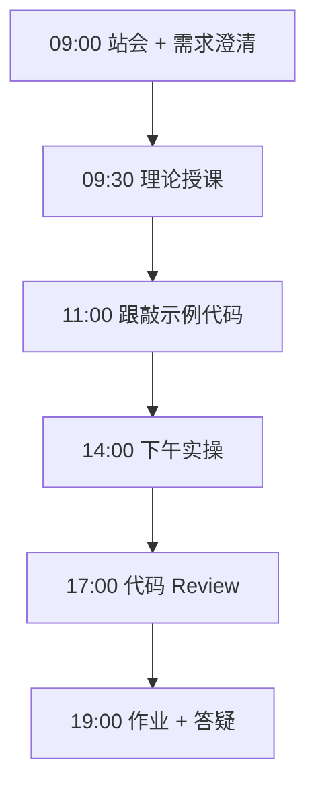
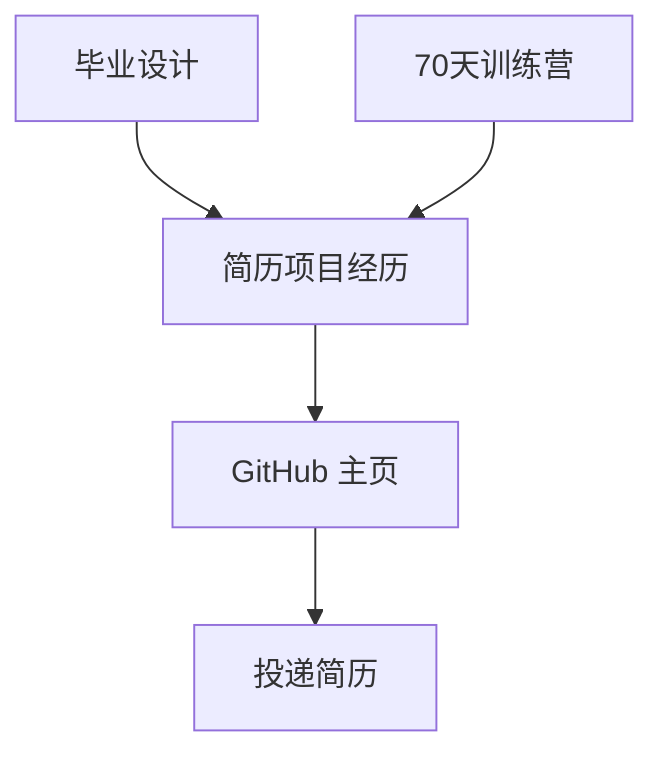

# Day 66：求职简历：AI 工程师简历打造

> **阶段**：Phase 6：毕业设计 | **Epic**：NEXUS-E6 | **预计学时**：6-8 小时

## 旁白解读：今日上下文

> 🎬 **模拟站会 09:00** — 智链科技 Nexus 项目组

HR 刘姐分享：「AI 岗位简历筛选 30 秒一份。项目经历比学历重要，量化数据比形容词重要。」

**今日在 NexusAgent 主线中的位置**：将 NexusAgent 训练营成果转化为求职竞争力

**今日 Jira 看板**：
- `NEXUS-610`

---


## 需求文档（产品林悦下发）

**文档编号**：PRD-NEXUS-D66  
**版本**：v1.0  
**优先级**：P0

### 背景

Phase 6：毕业设计阶段第 66 天教学任务，与 NexusAgent 主线项目对齐。

### User Stories

### NEXUS-610

**描述**：求职简历：AI 工程师简历打造 相关交付

**验收标准**：
- [ ] 代码可本地运行
- [ ] 通过 `scripts/verify_day.py --day 66`


---


## 今日课表

### 上午 09:00-12:00

- AI 工程师简历结构与关键词优化
- 项目经历描述公式：STAR 法则
- 70 天训练营项目如何写进简历
- 简历常见误区：堆砌技术栈、缺乏量化

### 下午 14:00-17:30

- 编写个人技术简历（中文版）
- 将毕业设计包装为「企业级项目经历」
- GitHub 主页优化：Pinned Repos + README
- 同学互审简历并给出修改建议

### 晚自习 19:00-21:00

- 提交简历终稿（PDF）
- 注册 Boss直聘/拉勾/LinkedIn
- 预习技术面试高频题

---


## 课堂笔记

### 核心知识点速查

| 序号 | 知识点 | 代码位置 |
|------|--------|----------|
| 1 | 简历撰写 | 见下午实操 |
| 2 | STAR 法则 | 见下午实操 |
| 3 | 项目经历包装 | 见下午实操 |
| 4 | GitHub 优化 | 见下午实操 |
| 5 | 关键词匹配 | 见下午实操 |

### 今日流程图



### 架构示意图（当日目标）



---


## 实操代码清单

- `code/career/resume_template.md`
- `code/career/github_profile_README.md`
- `code/career/resume_checklist.md`

请按顺序创建并运行。每段代码均可直接复制到对应文件执行。

---

## 实验手册（分时段操作表）

### 实验步骤 1：09:30-10:30 理论

| 时间 | 动作 | 预期结果 | 失败处理 |
|------|------|----------|----------|
| +0min | 打开课件本节 | 看到需求与验收标准 | 检查是否拉取最新 `develop` 分支 |
| +10min | 创建/打开当日 `code/` 文件 | 文件路径与清单一致 | 对照「实操代码清单」 |
| +30min | 粘贴并运行第一个脚本 | 终端有正常输出无 Traceback | 见下方「排错手册」 |
| +60min | 完成全部文件并自测 | `python3` 运行通过 | 使用 `scripts/verify_day.py --day 66` |
| +90min | 提交 Git 并建 MR | MR 关联 Jira NEXUS-610 | 按附录 Git 示例操作 |


### 实验步骤 2：10:30-12:00 跟敲

| 时间 | 动作 | 预期结果 | 失败处理 |
|------|------|----------|----------|
| +0min | 打开课件本节 | 看到需求与验收标准 | 检查是否拉取最新 `develop` 分支 |
| +10min | 创建/打开当日 `code/` 文件 | 文件路径与清单一致 | 对照「实操代码清单」 |
| +30min | 粘贴并运行第一个脚本 | 终端有正常输出无 Traceback | 见下方「排错手册」 |
| +60min | 完成全部文件并自测 | `python3` 运行通过 | 使用 `scripts/verify_day.py --day 66` |
| +90min | 提交 Git 并建 MR | MR 关联 Jira NEXUS-610 | 按附录 Git 示例操作 |


### 实验步骤 3：14:00-15:30 实操

| 时间 | 动作 | 预期结果 | 失败处理 |
|------|------|----------|----------|
| +0min | 打开课件本节 | 看到需求与验收标准 | 检查是否拉取最新 `develop` 分支 |
| +10min | 创建/打开当日 `code/` 文件 | 文件路径与清单一致 | 对照「实操代码清单」 |
| +30min | 粘贴并运行第一个脚本 | 终端有正常输出无 Traceback | 见下方「排错手册」 |
| +60min | 完成全部文件并自测 | `python3` 运行通过 | 使用 `scripts/verify_day.py --day 66` |
| +90min | 提交 Git 并建 MR | MR 关联 Jira NEXUS-610 | 按附录 Git 示例操作 |


### 实验步骤 4：15:30-17:00 联调

| 时间 | 动作 | 预期结果 | 失败处理 |
|------|------|----------|----------|
| +0min | 打开课件本节 | 看到需求与验收标准 | 检查是否拉取最新 `develop` 分支 |
| +10min | 创建/打开当日 `code/` 文件 | 文件路径与清单一致 | 对照「实操代码清单」 |
| +30min | 粘贴并运行第一个脚本 | 终端有正常输出无 Traceback | 见下方「排错手册」 |
| +60min | 完成全部文件并自测 | `python3` 运行通过 | 使用 `scripts/verify_day.py --day 66` |
| +90min | 提交 Git 并建 MR | MR 关联 Jira NEXUS-610 | 按附录 Git 示例操作 |


### 实验步骤 5：19:00-20:30 作业

| 时间 | 动作 | 预期结果 | 失败处理 |
|------|------|----------|----------|
| +0min | 打开课件本节 | 看到需求与验收标准 | 检查是否拉取最新 `develop` 分支 |
| +10min | 创建/打开当日 `code/` 文件 | 文件路径与清单一致 | 对照「实操代码清单」 |
| +30min | 粘贴并运行第一个脚本 | 终端有正常输出无 Traceback | 见下方「排错手册」 |
| +60min | 完成全部文件并自测 | `python3` 运行通过 | 使用 `scripts/verify_day.py --day 66` |
| +90min | 提交 Git 并建 MR | MR 关联 Jira NEXUS-610 | 按附录 Git 示例操作 |


### 排错手册（Day 66）

1. **`command not found: python3`** → 安装 Python 3.10+ 或使用 `py -3`（Windows）
2. **`ModuleNotFoundError`** → 确认当前目录、是否激活 venv、`pip install -r requirements.txt`（若当日有）
3. **`SyntaxError: invalid syntax`** → 检查上一行是否缺括号、引号是否中文
4. **`UnicodeDecodeError`** → 文件保存为 UTF-8，终端 `export PYTHONIOENCODING=utf-8`
5. **API 相关（Day12+）** → 检查 `.env` 中 Key，无 Key 时使用课件 MOCK 模式

---


## 逐步跟敲指南（完整源码与解析）

> 以下代码与 `code/` 目录完全一致，可直接复制。每段附行级说明。

### 文件：`code/career/resume_template.md`

**操作步骤**：
1. 在 `courseware/day-66/code/` 下创建文件 `career/resume_template.md`
2. 完整粘贴下方代码
3. 在终端执行：`cd courseware/day-66/code && python3 resume_template.md.py`（若为包内模块则按课件说明）

```python
# AI 应用开发工程师 — 简历模板

## 个人信息
- 姓名 | 电话 | 邮箱 | GitHub

## 技术栈
Python · FastAPI · LangChain/LangGraph · RAG · Docker · PostgreSQL · Redis · Chroma

## 项目经历

### Nexus Capstone — 企业级 AI Agent 平台（毕业设计）
**时间**：2026.XX - 2026.XX | **角色**：独立开发者
- 基于 FastAPI + LangGraph 构建多模块 AI Agent 平台，支持用户认证、RAG 知识库问答、Agent 工具编排
- 实现混合检索（向量 + 关键词），文档检索 Top-3 命中率达 XX%
- 使用 QLoRA 微调 7B 领域模型，客服问答 ROUGE-L 提升 XX%
- Docker Compose 一键部署全栈（API + vLLM + Chroma + PostgreSQL），P99 延迟 < XXms
- **技术栈**：Python, FastAPI, LangGraph, Chroma, Docker, vLLM, LLaMA-Factory

### NexusAgent 训练营项目（70 天）
- 完成 70 天全栈 AI 工程训练，累计代码 XX 行，涵盖 CLI/API/RAG/Agent/微调/部署
- GitLab 提交 XX 次 MR，通过 Code Review XX 次

## 教育背景
（填写）

## 自我评价
（2-3 句话，突出 AI 工程能力 + 学习能力）

```

**解析要点（`career/resume_template.md`）**：

- 共 **27** 行，请逐行阅读注释中的中文说明

- 运行前确认 Python 版本 ≥ 3.10：`python3 --version`

- 若报错，先检查缩进是否为 4 空格，勿混用 Tab

- 企业 Review 清单：命名是否清晰、是否有异常处理、是否可复用

---

### 文件：`code/career/github_profile_README.md`

**操作步骤**：
1. 在 `courseware/day-66/code/` 下创建文件 `career/github_profile_README.md`
2. 完整粘贴下方代码
3. 在终端执行：`cd courseware/day-66/code && python3 github_profile_README.md.py`（若为包内模块则按课件说明）

```python
# Hi, I'm [Your Name] 👋

## 🚀 AI Application Engineer
Graduate of NexusAgent 70-Day Bootcamp | Building enterprise AI agents

## 🛠 Tech Stack
`Python` `FastAPI` `LangGraph` `RAG` `Docker` `vLLM` `Chroma`

## 📌 Featured Projects
- **[nexus-capstone](link)** — Enterprise AI Agent platform with RAG + fine-tuning
- **[nexus-agent-bootcamp](link)** — 70-day AI engineering bootcamp coursework

## 📊 Bootcamp Stats
- 70 days | XX commits | XX lines of code
- Skills: CLI → API → RAG → Multi-Agent → Fine-tuning → Production Deploy

```

**解析要点（`career/github_profile_README.md`）**：

- 共 **15** 行，请逐行阅读注释中的中文说明

- 运行前确认 Python 版本 ≥ 3.10：`python3 --version`

- 若报错，先检查缩进是否为 4 空格，勿混用 Tab

- 企业 Review 清单：命名是否清晰、是否有异常处理、是否可复用

---

### 文件：`code/career/resume_checklist.md`

**操作步骤**：
1. 在 `courseware/day-66/code/` 下创建文件 `career/resume_checklist.md`
2. 完整粘贴下方代码
3. 在终端执行：`cd courseware/day-66/code && python3 resume_checklist.md.py`（若为包内模块则按课件说明）

```python
# 简历自检清单
- [ ] 一页纸原则（应届生）
- [ ] 每个项目有量化数据（命中率、延迟、代码量）
- [ ] 技术栈与 JD 关键词对齐
- [ ] 无错别字，格式统一
- [ ] GitHub 链接可访问，有代表性项目
- [ ] 毕业设计已写入项目经历

```

**解析要点（`career/resume_checklist.md`）**：

- 共 **7** 行，请逐行阅读注释中的中文说明

- 运行前确认 Python 版本 ≥ 3.10：`python3 --version`

- 若报错，先检查缩进是否为 4 空格，勿混用 Tab

- 企业 Review 清单：命名是否清晰、是否有异常处理、是否可复用

---


### 深度讲解 1：简历撰写

在企业级 Python 开发与大模型应用工程中，**简历撰写** 是学员必须牢固掌握的基本功。智链科技 Nexus 项目组在 Day 66 的代码评审中，特别强调以下几点：

1. **为什么学**：简历撰写 直接服务于后续 NexusAgent 平台的 `NEXUS-E6` 模块。没有扎实的 简历撰写，Day 73 之后调用 API、解析 JSON、编写 Agent 工具函数时会出现大量低级错误。

2. **常见坑**：
   - 忽略输入类型校验，导致运行时 `TypeError`
   - 编码问题（Windows 默认 GBK vs UTF-8）
   - 复制粘贴时缩进错乱（Python 对缩进敏感）

3. **企业实践**：在 SmartLink 的 GitLab 仓库中，所有与 简历撰写 相关的代码必须经过 Ruff 静态检查；变量命名使用 `snake_case`，常量使用 `UPPER_SNAKE_CASE`。

4. **与主线项目的关系**：今日代码位于 `courseware/day-66/code/`，部分模块将逐步合并到 `platform/nexus_agent/`。请养成「每日代码皆可运行、皆可测试」的习惯。

5. **扩展阅读建议**：完成今日作业后，可阅读 `docs/project-master-plan.md` 中关于 NEXUS-E6 的章节，建立全局视角。

**课堂互动题**：请用 3 句话向非技术同事解释「简历撰写」是什么。写在作业 MR 的评论里，讲师会抽查点评。

**实操检查清单**：
- [ ] 能不看课件复述 简历撰写 的定义
- [ ] 能独立写出相关代码并运行
- [ ] 能向同学讲解一处容易写错的地方


### 深度讲解 2：STAR 法则

在企业级 Python 开发与大模型应用工程中，**STAR 法则** 是学员必须牢固掌握的基本功。智链科技 Nexus 项目组在 Day 66 的代码评审中，特别强调以下几点：

1. **为什么学**：STAR 法则 直接服务于后续 NexusAgent 平台的 `NEXUS-E6` 模块。没有扎实的 STAR 法则，Day 73 之后调用 API、解析 JSON、编写 Agent 工具函数时会出现大量低级错误。

2. **常见坑**：
   - 忽略输入类型校验，导致运行时 `TypeError`
   - 编码问题（Windows 默认 GBK vs UTF-8）
   - 复制粘贴时缩进错乱（Python 对缩进敏感）

3. **企业实践**：在 SmartLink 的 GitLab 仓库中，所有与 STAR 法则 相关的代码必须经过 Ruff 静态检查；变量命名使用 `snake_case`，常量使用 `UPPER_SNAKE_CASE`。

4. **与主线项目的关系**：今日代码位于 `courseware/day-66/code/`，部分模块将逐步合并到 `platform/nexus_agent/`。请养成「每日代码皆可运行、皆可测试」的习惯。

5. **扩展阅读建议**：完成今日作业后，可阅读 `docs/project-master-plan.md` 中关于 NEXUS-E6 的章节，建立全局视角。

**课堂互动题**：请用 3 句话向非技术同事解释「STAR 法则」是什么。写在作业 MR 的评论里，讲师会抽查点评。

**实操检查清单**：
- [ ] 能不看课件复述 STAR 法则 的定义
- [ ] 能独立写出相关代码并运行
- [ ] 能向同学讲解一处容易写错的地方


### 深度讲解 3：项目经历包装

在企业级 Python 开发与大模型应用工程中，**项目经历包装** 是学员必须牢固掌握的基本功。智链科技 Nexus 项目组在 Day 66 的代码评审中，特别强调以下几点：

1. **为什么学**：项目经历包装 直接服务于后续 NexusAgent 平台的 `NEXUS-E6` 模块。没有扎实的 项目经历包装，Day 73 之后调用 API、解析 JSON、编写 Agent 工具函数时会出现大量低级错误。

2. **常见坑**：
   - 忽略输入类型校验，导致运行时 `TypeError`
   - 编码问题（Windows 默认 GBK vs UTF-8）
   - 复制粘贴时缩进错乱（Python 对缩进敏感）

3. **企业实践**：在 SmartLink 的 GitLab 仓库中，所有与 项目经历包装 相关的代码必须经过 Ruff 静态检查；变量命名使用 `snake_case`，常量使用 `UPPER_SNAKE_CASE`。

4. **与主线项目的关系**：今日代码位于 `courseware/day-66/code/`，部分模块将逐步合并到 `platform/nexus_agent/`。请养成「每日代码皆可运行、皆可测试」的习惯。

5. **扩展阅读建议**：完成今日作业后，可阅读 `docs/project-master-plan.md` 中关于 NEXUS-E6 的章节，建立全局视角。

**课堂互动题**：请用 3 句话向非技术同事解释「项目经历包装」是什么。写在作业 MR 的评论里，讲师会抽查点评。

**实操检查清单**：
- [ ] 能不看课件复述 项目经历包装 的定义
- [ ] 能独立写出相关代码并运行
- [ ] 能向同学讲解一处容易写错的地方


### 深度讲解 4：GitHub 优化

在企业级 Python 开发与大模型应用工程中，**GitHub 优化** 是学员必须牢固掌握的基本功。智链科技 Nexus 项目组在 Day 66 的代码评审中，特别强调以下几点：

1. **为什么学**：GitHub 优化 直接服务于后续 NexusAgent 平台的 `NEXUS-E6` 模块。没有扎实的 GitHub 优化，Day 73 之后调用 API、解析 JSON、编写 Agent 工具函数时会出现大量低级错误。

2. **常见坑**：
   - 忽略输入类型校验，导致运行时 `TypeError`
   - 编码问题（Windows 默认 GBK vs UTF-8）
   - 复制粘贴时缩进错乱（Python 对缩进敏感）

3. **企业实践**：在 SmartLink 的 GitLab 仓库中，所有与 GitHub 优化 相关的代码必须经过 Ruff 静态检查；变量命名使用 `snake_case`，常量使用 `UPPER_SNAKE_CASE`。

4. **与主线项目的关系**：今日代码位于 `courseware/day-66/code/`，部分模块将逐步合并到 `platform/nexus_agent/`。请养成「每日代码皆可运行、皆可测试」的习惯。

5. **扩展阅读建议**：完成今日作业后，可阅读 `docs/project-master-plan.md` 中关于 NEXUS-E6 的章节，建立全局视角。

**课堂互动题**：请用 3 句话向非技术同事解释「GitHub 优化」是什么。写在作业 MR 的评论里，讲师会抽查点评。

**实操检查清单**：
- [ ] 能不看课件复述 GitHub 优化 的定义
- [ ] 能独立写出相关代码并运行
- [ ] 能向同学讲解一处容易写错的地方


### 深度讲解 5：关键词匹配

在企业级 Python 开发与大模型应用工程中，**关键词匹配** 是学员必须牢固掌握的基本功。智链科技 Nexus 项目组在 Day 66 的代码评审中，特别强调以下几点：

1. **为什么学**：关键词匹配 直接服务于后续 NexusAgent 平台的 `NEXUS-E6` 模块。没有扎实的 关键词匹配，Day 73 之后调用 API、解析 JSON、编写 Agent 工具函数时会出现大量低级错误。

2. **常见坑**：
   - 忽略输入类型校验，导致运行时 `TypeError`
   - 编码问题（Windows 默认 GBK vs UTF-8）
   - 复制粘贴时缩进错乱（Python 对缩进敏感）

3. **企业实践**：在 SmartLink 的 GitLab 仓库中，所有与 关键词匹配 相关的代码必须经过 Ruff 静态检查；变量命名使用 `snake_case`，常量使用 `UPPER_SNAKE_CASE`。

4. **与主线项目的关系**：今日代码位于 `courseware/day-66/code/`，部分模块将逐步合并到 `platform/nexus_agent/`。请养成「每日代码皆可运行、皆可测试」的习惯。

5. **扩展阅读建议**：完成今日作业后，可阅读 `docs/project-master-plan.md` 中关于 NEXUS-E6 的章节，建立全局视角。

**课堂互动题**：请用 3 句话向非技术同事解释「关键词匹配」是什么。写在作业 MR 的评论里，讲师会抽查点评。

**实操检查清单**：
- [ ] 能不看课件复述 关键词匹配 的定义
- [ ] 能独立写出相关代码并运行
- [ ] 能向同学讲解一处容易写错的地方


## 阶段复盘锚点（Phase 6：毕业设计）

今天是 **Phase 6：毕业设计** 的第 **6** 个学习日。请回顾：

- 昨天学了什么？今天如何承接？
- 今天的内容在 70 天路线图中的坐标？
- 如果我是 Tech Lead，会如何 Review 今日代码？

**陈工寄语**：慢即是快。企业里没人关心你一天学了多少个语法点，只关心你写的脚本能不能在服务器上稳定跑 7×24 小时。今天把地基打牢，后面 Agent 编排、RAG 检索才不会塌。

**林悦补充**：产品侧只验收「用户能感知到的价值」。今日交付虽然简单，但「个人信息卡片」本质是后续「用户画像 Agent」的数据采集原型——字段设计请认真思考。

**代码量统计（累计）**：完成今日后，个人仓库累计约 **92400** 行（含注释与测试），全营目标 10 万行。

**明日预告**：请提前阅读 `courseware/day-67/README.md` 开头的旁白，了解上下文。


## 常见问题 FAQ（讲师答疑实录）


**Q1：学习「简历撰写」时最常问的问题是什么？**

A：学员常问「这在大模型开发里到底用在哪里」。直接回答：在 NexusAgent 的 `NEXUS-E6` 中，简历撰写 用于支撑「求职简历：AI 工程师简历打造」这一交付。建议你打开 `platform/` 对照看未来模块如何引用今日写法。另一个常见问题是「要不要背语法」——不需要背，但要能写出可运行代码，并能在报错时读懂 Traceback。

**追问**：如果线上报错与 简历撰写 相关，如何排查？  
**答**：① 复现 ② 最小化输入 ③ 打印中间变量 ④ 查 GitLab 历史 diff ⑤ 在 Jira 建 Bug 单附上日志。


**Q2：学习「STAR 法则」时最常问的问题是什么？**

A：学员常问「这在大模型开发里到底用在哪里」。直接回答：在 NexusAgent 的 `NEXUS-E6` 中，STAR 法则 用于支撑「求职简历：AI 工程师简历打造」这一交付。建议你打开 `platform/` 对照看未来模块如何引用今日写法。另一个常见问题是「要不要背语法」——不需要背，但要能写出可运行代码，并能在报错时读懂 Traceback。

**追问**：如果线上报错与 STAR 法则 相关，如何排查？  
**答**：① 复现 ② 最小化输入 ③ 打印中间变量 ④ 查 GitLab 历史 diff ⑤ 在 Jira 建 Bug 单附上日志。


**Q3：学习「项目经历包装」时最常问的问题是什么？**

A：学员常问「这在大模型开发里到底用在哪里」。直接回答：在 NexusAgent 的 `NEXUS-E6` 中，项目经历包装 用于支撑「求职简历：AI 工程师简历打造」这一交付。建议你打开 `platform/` 对照看未来模块如何引用今日写法。另一个常见问题是「要不要背语法」——不需要背，但要能写出可运行代码，并能在报错时读懂 Traceback。

**追问**：如果线上报错与 项目经历包装 相关，如何排查？  
**答**：① 复现 ② 最小化输入 ③ 打印中间变量 ④ 查 GitLab 历史 diff ⑤ 在 Jira 建 Bug 单附上日志。


**Q4：学习「GitHub 优化」时最常问的问题是什么？**

A：学员常问「这在大模型开发里到底用在哪里」。直接回答：在 NexusAgent 的 `NEXUS-E6` 中，GitHub 优化 用于支撑「求职简历：AI 工程师简历打造」这一交付。建议你打开 `platform/` 对照看未来模块如何引用今日写法。另一个常见问题是「要不要背语法」——不需要背，但要能写出可运行代码，并能在报错时读懂 Traceback。

**追问**：如果线上报错与 GitHub 优化 相关，如何排查？  
**答**：① 复现 ② 最小化输入 ③ 打印中间变量 ④ 查 GitLab 历史 diff ⑤ 在 Jira 建 Bug 单附上日志。


**Q5：学习「关键词匹配」时最常问的问题是什么？**

A：学员常问「这在大模型开发里到底用在哪里」。直接回答：在 NexusAgent 的 `NEXUS-E6` 中，关键词匹配 用于支撑「求职简历：AI 工程师简历打造」这一交付。建议你打开 `platform/` 对照看未来模块如何引用今日写法。另一个常见问题是「要不要背语法」——不需要背，但要能写出可运行代码，并能在报错时读懂 Traceback。

**追问**：如果线上报错与 关键词匹配 相关，如何排查？  
**答**：① 复现 ② 最小化输入 ③ 打印中间变量 ④ 查 GitLab 历史 diff ⑤ 在 Jira 建 Bug 单附上日志。


## 面试押题（与今日知识点挂钩）

以下题目会出现在 Day 67-69 模拟面试中，建议今日就开始积累答案：

1. **简历撰写**：请结合 NexusAgent 项目举例说明你在哪一天、哪段代码里用到了它？
2. **STAR 法则**：请结合 NexusAgent 项目举例说明你在哪一天、哪段代码里用到了它？
3. **项目经历包装**：请结合 NexusAgent 项目举例说明你在哪一天、哪段代码里用到了它？
4. **GitHub 优化**：请结合 NexusAgent 项目举例说明你在哪一天、哪段代码里用到了它？
5. **关键词匹配**：请结合 NexusAgent 项目举例说明你在哪一天、哪段代码里用到了它？

**参考答案思路**：采用 STAR 法则（情境-任务-行动-结果），引用 `courseware/day-66/code/` 中的具体文件名与函数名。

---


## Code Review 检查表（陈工版）

合并 MR 前自查：

- [ ] 所有新增 `.py` 文件顶部有模块说明 docstring
- [ ] 无硬编码密钥（API Key 走环境变量）
- [ ] 函数长度 < 50 行，过长则拆分
- [ ] 异常有明确提示，禁止裸 `except:`
- [ ] 提交信息符合 `feat(day-66): ...`
- [ ] README 或注释说明如何运行
- [ ] 与 Jira Story 验收标准逐条对应

**今日重点审查项**：求职简历：AI 工程师简历打造 相关逻辑是否可读、可测、可扩展至 `platform/nexus_agent/`。

---


## 课后作业

### 作业说明

完成中文技术简历（PDF）和 GitHub Profile README。至少包含毕业设计和训练营两个项目经历，每个项目 3-4 条量化描述。

### 提交要求

1. 代码提交到分支 `feature/day-66-homework`
2. GitLab MR 标题：`[Day-66] homework: 课后作业`
3. 在 MR 描述中附上运行截图或终端输出

### 评分标准（满分 100）

| 项 | 分值 |
|----|------|
| 功能完整 | 40 |
| 代码规范与注释 | 30 |
| 异常处理 | 15 |
| MR 与 Jira 关联 | 15 |

---

## 作业参考答案

> ⚠️ 请先独立完成再对照答案

用 STAR 法则：「基于 FastAPI 构建 Agent 平台（S），解决客服重复问答痛点（T），实现 RAG+微调（A），检索命中率 85%（R）。」

---


## 附录：Git 提交示例

```bash
git checkout develop
git pull origin develop
git checkout -b feature/day-66-求职简历：ai-工程
# 完成代码后
git add courseware/day-66/
git commit -m "feat(day-66): 求职简历：AI 工程师简历打造"
git push -u origin feature/day-66-求职简历：ai-工程
```

---

*课件版本 Day-66-v1.0 | 智链科技培训中心*
