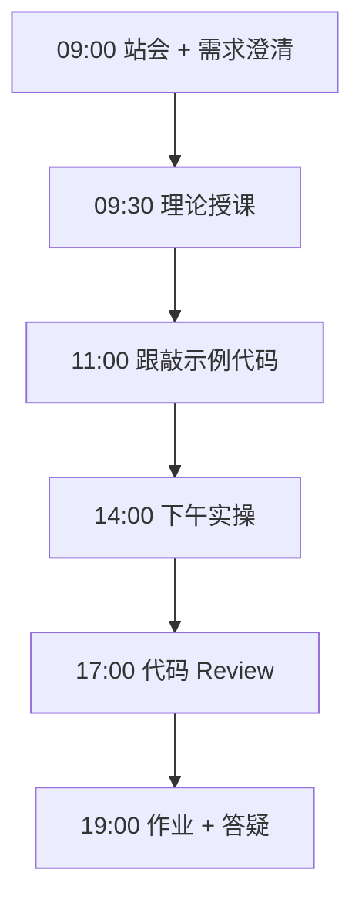
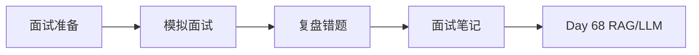

# Day 67：技术面试（一）：Python 与后端基础

> **阶段**：Phase 6：毕业设计 | **Epic**：NEXUS-E6 | **预计学时**：6-8 小时

## 旁白解读：今日上下文

> 🎬 **模拟站会 09:00** — 智链科技 Nexus 项目组

陈工扮演面试官：「不要背答案，要说清楚原理和你的实践经验。训练营的项目就是最好的素材。」

**今日在 NexusAgent 主线中的位置**：NexusAgent 技术栈面试准备

**今日 Jira 看板**：
- `NEXUS-611`

---


## 需求文档（产品林悦下发）

**文档编号**：PRD-NEXUS-D67  
**版本**：v1.0  
**优先级**：P0

### 背景

Phase 6：毕业设计阶段第 67 天教学任务，与 NexusAgent 主线项目对齐。

### User Stories

### NEXUS-611

**描述**：技术面试（一）：Python 与后端基础 相关交付

**验收标准**：
- [ ] 代码可本地运行
- [ ] 通过 `scripts/verify_day.py --day 67`


---


## 今日课表

### 上午 09:00-12:00

- 技术面试流程与考察维度
- Python 高频题：装饰器、生成器、GIL、异步
- FastAPI 面试题：依赖注入、中间件、生命周期
- 数据库面试题：索引、事务、连接池

### 下午 14:00-17:30

- 模拟面试 Round 1：Python 基础（1v1）
- 模拟面试 Round 2：后端 API 设计
- 面试复盘：错题本记录
- 手写代码练习：LRU Cache / 线程安全单例

### 晚自习 19:00-21:00

- 整理 Python 面试题笔记（20 题）
- 完成 3 道 LeetCode Easy
- 预习 RAG/LLM 面试题

---


## 课堂笔记

### 核心知识点速查

| 序号 | 知识点 | 代码位置 |
|------|--------|----------|
| 1 | Python 面试题 | 见下午实操 |
| 2 | 装饰器与生成器 | 见下午实操 |
| 3 | LRU Cache | 见下午实操 |
| 4 | FastAPI 原理 | 见下午实操 |
| 5 | 模拟面试 | 见下午实操 |

### 今日流程图



### 架构示意图（当日目标）



---


## 实操代码清单

- `code/interview/day67_python_basics.py`
- `code/interview/day67_questions.md`

请按顺序创建并运行。每段代码均可直接复制到对应文件执行。

---

## 实验手册（分时段操作表）

### 实验步骤 1：09:30-10:30 理论

| 时间 | 动作 | 预期结果 | 失败处理 |
|------|------|----------|----------|
| +0min | 打开课件本节 | 看到需求与验收标准 | 检查是否拉取最新 `develop` 分支 |
| +10min | 创建/打开当日 `code/` 文件 | 文件路径与清单一致 | 对照「实操代码清单」 |
| +30min | 粘贴并运行第一个脚本 | 终端有正常输出无 Traceback | 见下方「排错手册」 |
| +60min | 完成全部文件并自测 | `python3` 运行通过 | 使用 `scripts/verify_day.py --day 67` |
| +90min | 提交 Git 并建 MR | MR 关联 Jira NEXUS-611 | 按附录 Git 示例操作 |


### 实验步骤 2：10:30-12:00 跟敲

| 时间 | 动作 | 预期结果 | 失败处理 |
|------|------|----------|----------|
| +0min | 打开课件本节 | 看到需求与验收标准 | 检查是否拉取最新 `develop` 分支 |
| +10min | 创建/打开当日 `code/` 文件 | 文件路径与清单一致 | 对照「实操代码清单」 |
| +30min | 粘贴并运行第一个脚本 | 终端有正常输出无 Traceback | 见下方「排错手册」 |
| +60min | 完成全部文件并自测 | `python3` 运行通过 | 使用 `scripts/verify_day.py --day 67` |
| +90min | 提交 Git 并建 MR | MR 关联 Jira NEXUS-611 | 按附录 Git 示例操作 |


### 实验步骤 3：14:00-15:30 实操

| 时间 | 动作 | 预期结果 | 失败处理 |
|------|------|----------|----------|
| +0min | 打开课件本节 | 看到需求与验收标准 | 检查是否拉取最新 `develop` 分支 |
| +10min | 创建/打开当日 `code/` 文件 | 文件路径与清单一致 | 对照「实操代码清单」 |
| +30min | 粘贴并运行第一个脚本 | 终端有正常输出无 Traceback | 见下方「排错手册」 |
| +60min | 完成全部文件并自测 | `python3` 运行通过 | 使用 `scripts/verify_day.py --day 67` |
| +90min | 提交 Git 并建 MR | MR 关联 Jira NEXUS-611 | 按附录 Git 示例操作 |


### 实验步骤 4：15:30-17:00 联调

| 时间 | 动作 | 预期结果 | 失败处理 |
|------|------|----------|----------|
| +0min | 打开课件本节 | 看到需求与验收标准 | 检查是否拉取最新 `develop` 分支 |
| +10min | 创建/打开当日 `code/` 文件 | 文件路径与清单一致 | 对照「实操代码清单」 |
| +30min | 粘贴并运行第一个脚本 | 终端有正常输出无 Traceback | 见下方「排错手册」 |
| +60min | 完成全部文件并自测 | `python3` 运行通过 | 使用 `scripts/verify_day.py --day 67` |
| +90min | 提交 Git 并建 MR | MR 关联 Jira NEXUS-611 | 按附录 Git 示例操作 |


### 实验步骤 5：19:00-20:30 作业

| 时间 | 动作 | 预期结果 | 失败处理 |
|------|------|----------|----------|
| +0min | 打开课件本节 | 看到需求与验收标准 | 检查是否拉取最新 `develop` 分支 |
| +10min | 创建/打开当日 `code/` 文件 | 文件路径与清单一致 | 对照「实操代码清单」 |
| +30min | 粘贴并运行第一个脚本 | 终端有正常输出无 Traceback | 见下方「排错手册」 |
| +60min | 完成全部文件并自测 | `python3` 运行通过 | 使用 `scripts/verify_day.py --day 67` |
| +90min | 提交 Git 并建 MR | MR 关联 Jira NEXUS-611 | 按附录 Git 示例操作 |


### 排错手册（Day 67）

1. **`command not found: python3`** → 安装 Python 3.10+ 或使用 `py -3`（Windows）
2. **`ModuleNotFoundError`** → 确认当前目录、是否激活 venv、`pip install -r requirements.txt`（若当日有）
3. **`SyntaxError: invalid syntax`** → 检查上一行是否缺括号、引号是否中文
4. **`UnicodeDecodeError`** → 文件保存为 UTF-8，终端 `export PYTHONIOENCODING=utf-8`
5. **API 相关（Day12+）** → 检查 `.env` 中 Key，无 Key 时使用课件 MOCK 模式

---


## 逐步跟敲指南（完整源码与解析）

> 以下代码与 `code/` 目录完全一致，可直接复制。每段附行级说明。

### 文件：`code/interview/day67_python_basics.py`

**操作步骤**：
1. 在 `courseware/day-67/code/` 下创建文件 `interview/day67_python_basics.py`
2. 完整粘贴下方代码
3. 在终端执行：`cd courseware/day-67/code && python3 day67_python_basics.py`（若为包内模块则按课件说明）

```python
#!/usr/bin/env python3
"""
Day 67 — Python 面试高频题跟敲
"""
from functools import wraps
from collections import OrderedDict


# --- 1. 装饰器：计时 + 日志 ---
def timed(func):
    @wraps(func)
    def wrapper(*args, **kwargs):
        import time
        start = time.perf_counter()
        result = func(*args, **kwargs)
        print(f"{func.__name__}: {(time.perf_counter()-start)*1000:.1f}ms")
        return result
    return wrapper


# --- 2. 生成器：内存友好的大数据处理 ---
def read_large_file(path: str):
    with open(path) as f:
        for line in f:
            yield line.strip()


# --- 3. LRU Cache 实现（面试手写题）---
class LRUCache:
    def __init__(self, capacity: int):
        self.cache = OrderedDict()
        self.capacity = capacity

    def get(self, key):
        if key not in self.cache:
            return -1
        self.cache.move_to_end(key)
        return self.cache[key]

    def put(self, key, value):
        if key in self.cache:
            self.cache.move_to_end(key)
        self.cache[key] = value
        if len(self.cache) > self.capacity:
            self.cache.popitem(last=False)


# --- 4. 异步 FastAPI 依赖注入示例 ---
@timed
def demo_lru():
    cache = LRUCache(2)
    cache.put(1, "a")
    cache.put(2, "b")
    print(cache.get(1))
    cache.put(3, "c")
    print(cache.get(2))  # -1


if __name__ == "__main__":
    demo_lru()

```

**解析要点（`interview/day67_python_basics.py`）**：

- 共 **60** 行，请逐行阅读注释中的中文说明

- 运行前确认 Python 版本 ≥ 3.10：`python3 --version`

- 若报错，先检查缩进是否为 4 空格，勿混用 Tab

- 企业 Review 清单：命名是否清晰、是否有异常处理、是否可复用

---

### 文件：`code/interview/day67_questions.md`

**操作步骤**：
1. 在 `courseware/day-67/code/` 下创建文件 `interview/day67_questions.md`
2. 完整粘贴下方代码
3. 在终端执行：`cd courseware/day-67/code && python3 day67_questions.md.py`（若为包内模块则按课件说明）

```python
# Day 67 面试题清单

## Python 基础
1. 解释 GIL 及其对多线程的影响
2. 装饰器原理与 @wraps 作用
3. 生成器 vs 迭代器 vs 协程
4. *args 和 **kwargs 使用场景
5. 深拷贝 vs 浅拷贝

## FastAPI / 后端
6. 依赖注入 DI 的优势
7. 中间件执行顺序
8. RESTful API 设计原则
9. JWT 认证流程
10. 数据库连接池为什么必要

## 手写代码
11. 实现 LRU Cache
12. 单例模式（线程安全）
13. 反转链表

```

**解析要点（`interview/day67_questions.md`）**：

- 共 **20** 行，请逐行阅读注释中的中文说明

- 运行前确认 Python 版本 ≥ 3.10：`python3 --version`

- 若报错，先检查缩进是否为 4 空格，勿混用 Tab

- 企业 Review 清单：命名是否清晰、是否有异常处理、是否可复用

---


### 深度讲解 1：Python 面试题

在企业级 Python 开发与大模型应用工程中，**Python 面试题** 是学员必须牢固掌握的基本功。智链科技 Nexus 项目组在 Day 67 的代码评审中，特别强调以下几点：

1. **为什么学**：Python 面试题 直接服务于后续 NexusAgent 平台的 `NEXUS-E6` 模块。没有扎实的 Python 面试题，Day 74 之后调用 API、解析 JSON、编写 Agent 工具函数时会出现大量低级错误。

2. **常见坑**：
   - 忽略输入类型校验，导致运行时 `TypeError`
   - 编码问题（Windows 默认 GBK vs UTF-8）
   - 复制粘贴时缩进错乱（Python 对缩进敏感）

3. **企业实践**：在 SmartLink 的 GitLab 仓库中，所有与 Python 面试题 相关的代码必须经过 Ruff 静态检查；变量命名使用 `snake_case`，常量使用 `UPPER_SNAKE_CASE`。

4. **与主线项目的关系**：今日代码位于 `courseware/day-67/code/`，部分模块将逐步合并到 `platform/nexus_agent/`。请养成「每日代码皆可运行、皆可测试」的习惯。

5. **扩展阅读建议**：完成今日作业后，可阅读 `docs/project-master-plan.md` 中关于 NEXUS-E6 的章节，建立全局视角。

**课堂互动题**：请用 3 句话向非技术同事解释「Python 面试题」是什么。写在作业 MR 的评论里，讲师会抽查点评。

**实操检查清单**：
- [ ] 能不看课件复述 Python 面试题 的定义
- [ ] 能独立写出相关代码并运行
- [ ] 能向同学讲解一处容易写错的地方


### 深度讲解 2：装饰器与生成器

在企业级 Python 开发与大模型应用工程中，**装饰器与生成器** 是学员必须牢固掌握的基本功。智链科技 Nexus 项目组在 Day 67 的代码评审中，特别强调以下几点：

1. **为什么学**：装饰器与生成器 直接服务于后续 NexusAgent 平台的 `NEXUS-E6` 模块。没有扎实的 装饰器与生成器，Day 74 之后调用 API、解析 JSON、编写 Agent 工具函数时会出现大量低级错误。

2. **常见坑**：
   - 忽略输入类型校验，导致运行时 `TypeError`
   - 编码问题（Windows 默认 GBK vs UTF-8）
   - 复制粘贴时缩进错乱（Python 对缩进敏感）

3. **企业实践**：在 SmartLink 的 GitLab 仓库中，所有与 装饰器与生成器 相关的代码必须经过 Ruff 静态检查；变量命名使用 `snake_case`，常量使用 `UPPER_SNAKE_CASE`。

4. **与主线项目的关系**：今日代码位于 `courseware/day-67/code/`，部分模块将逐步合并到 `platform/nexus_agent/`。请养成「每日代码皆可运行、皆可测试」的习惯。

5. **扩展阅读建议**：完成今日作业后，可阅读 `docs/project-master-plan.md` 中关于 NEXUS-E6 的章节，建立全局视角。

**课堂互动题**：请用 3 句话向非技术同事解释「装饰器与生成器」是什么。写在作业 MR 的评论里，讲师会抽查点评。

**实操检查清单**：
- [ ] 能不看课件复述 装饰器与生成器 的定义
- [ ] 能独立写出相关代码并运行
- [ ] 能向同学讲解一处容易写错的地方


### 深度讲解 3：LRU Cache

在企业级 Python 开发与大模型应用工程中，**LRU Cache** 是学员必须牢固掌握的基本功。智链科技 Nexus 项目组在 Day 67 的代码评审中，特别强调以下几点：

1. **为什么学**：LRU Cache 直接服务于后续 NexusAgent 平台的 `NEXUS-E6` 模块。没有扎实的 LRU Cache，Day 74 之后调用 API、解析 JSON、编写 Agent 工具函数时会出现大量低级错误。

2. **常见坑**：
   - 忽略输入类型校验，导致运行时 `TypeError`
   - 编码问题（Windows 默认 GBK vs UTF-8）
   - 复制粘贴时缩进错乱（Python 对缩进敏感）

3. **企业实践**：在 SmartLink 的 GitLab 仓库中，所有与 LRU Cache 相关的代码必须经过 Ruff 静态检查；变量命名使用 `snake_case`，常量使用 `UPPER_SNAKE_CASE`。

4. **与主线项目的关系**：今日代码位于 `courseware/day-67/code/`，部分模块将逐步合并到 `platform/nexus_agent/`。请养成「每日代码皆可运行、皆可测试」的习惯。

5. **扩展阅读建议**：完成今日作业后，可阅读 `docs/project-master-plan.md` 中关于 NEXUS-E6 的章节，建立全局视角。

**课堂互动题**：请用 3 句话向非技术同事解释「LRU Cache」是什么。写在作业 MR 的评论里，讲师会抽查点评。

**实操检查清单**：
- [ ] 能不看课件复述 LRU Cache 的定义
- [ ] 能独立写出相关代码并运行
- [ ] 能向同学讲解一处容易写错的地方


### 深度讲解 4：FastAPI 原理

在企业级 Python 开发与大模型应用工程中，**FastAPI 原理** 是学员必须牢固掌握的基本功。智链科技 Nexus 项目组在 Day 67 的代码评审中，特别强调以下几点：

1. **为什么学**：FastAPI 原理 直接服务于后续 NexusAgent 平台的 `NEXUS-E6` 模块。没有扎实的 FastAPI 原理，Day 74 之后调用 API、解析 JSON、编写 Agent 工具函数时会出现大量低级错误。

2. **常见坑**：
   - 忽略输入类型校验，导致运行时 `TypeError`
   - 编码问题（Windows 默认 GBK vs UTF-8）
   - 复制粘贴时缩进错乱（Python 对缩进敏感）

3. **企业实践**：在 SmartLink 的 GitLab 仓库中，所有与 FastAPI 原理 相关的代码必须经过 Ruff 静态检查；变量命名使用 `snake_case`，常量使用 `UPPER_SNAKE_CASE`。

4. **与主线项目的关系**：今日代码位于 `courseware/day-67/code/`，部分模块将逐步合并到 `platform/nexus_agent/`。请养成「每日代码皆可运行、皆可测试」的习惯。

5. **扩展阅读建议**：完成今日作业后，可阅读 `docs/project-master-plan.md` 中关于 NEXUS-E6 的章节，建立全局视角。

**课堂互动题**：请用 3 句话向非技术同事解释「FastAPI 原理」是什么。写在作业 MR 的评论里，讲师会抽查点评。

**实操检查清单**：
- [ ] 能不看课件复述 FastAPI 原理 的定义
- [ ] 能独立写出相关代码并运行
- [ ] 能向同学讲解一处容易写错的地方


### 深度讲解 5：模拟面试

在企业级 Python 开发与大模型应用工程中，**模拟面试** 是学员必须牢固掌握的基本功。智链科技 Nexus 项目组在 Day 67 的代码评审中，特别强调以下几点：

1. **为什么学**：模拟面试 直接服务于后续 NexusAgent 平台的 `NEXUS-E6` 模块。没有扎实的 模拟面试，Day 74 之后调用 API、解析 JSON、编写 Agent 工具函数时会出现大量低级错误。

2. **常见坑**：
   - 忽略输入类型校验，导致运行时 `TypeError`
   - 编码问题（Windows 默认 GBK vs UTF-8）
   - 复制粘贴时缩进错乱（Python 对缩进敏感）

3. **企业实践**：在 SmartLink 的 GitLab 仓库中，所有与 模拟面试 相关的代码必须经过 Ruff 静态检查；变量命名使用 `snake_case`，常量使用 `UPPER_SNAKE_CASE`。

4. **与主线项目的关系**：今日代码位于 `courseware/day-67/code/`，部分模块将逐步合并到 `platform/nexus_agent/`。请养成「每日代码皆可运行、皆可测试」的习惯。

5. **扩展阅读建议**：完成今日作业后，可阅读 `docs/project-master-plan.md` 中关于 NEXUS-E6 的章节，建立全局视角。

**课堂互动题**：请用 3 句话向非技术同事解释「模拟面试」是什么。写在作业 MR 的评论里，讲师会抽查点评。

**实操检查清单**：
- [ ] 能不看课件复述 模拟面试 的定义
- [ ] 能独立写出相关代码并运行
- [ ] 能向同学讲解一处容易写错的地方


## 阶段复盘锚点（Phase 6：毕业设计）

今天是 **Phase 6：毕业设计** 的第 **7** 个学习日。请回顾：

- 昨天学了什么？今天如何承接？
- 今天的内容在 70 天路线图中的坐标？
- 如果我是 Tech Lead，会如何 Review 今日代码？

**陈工寄语**：慢即是快。企业里没人关心你一天学了多少个语法点，只关心你写的脚本能不能在服务器上稳定跑 7×24 小时。今天把地基打牢，后面 Agent 编排、RAG 检索才不会塌。

**林悦补充**：产品侧只验收「用户能感知到的价值」。今日交付虽然简单，但「个人信息卡片」本质是后续「用户画像 Agent」的数据采集原型——字段设计请认真思考。

**代码量统计（累计）**：完成今日后，个人仓库累计约 **93800** 行（含注释与测试），全营目标 10 万行。

**明日预告**：请提前阅读 `courseware/day-68/README.md` 开头的旁白，了解上下文。


## 常见问题 FAQ（讲师答疑实录）


**Q1：学习「Python 面试题」时最常问的问题是什么？**

A：学员常问「这在大模型开发里到底用在哪里」。直接回答：在 NexusAgent 的 `NEXUS-E6` 中，Python 面试题 用于支撑「技术面试（一）：Python 与后端基础」这一交付。建议你打开 `platform/` 对照看未来模块如何引用今日写法。另一个常见问题是「要不要背语法」——不需要背，但要能写出可运行代码，并能在报错时读懂 Traceback。

**追问**：如果线上报错与 Python 面试题 相关，如何排查？  
**答**：① 复现 ② 最小化输入 ③ 打印中间变量 ④ 查 GitLab 历史 diff ⑤ 在 Jira 建 Bug 单附上日志。


**Q2：学习「装饰器与生成器」时最常问的问题是什么？**

A：学员常问「这在大模型开发里到底用在哪里」。直接回答：在 NexusAgent 的 `NEXUS-E6` 中，装饰器与生成器 用于支撑「技术面试（一）：Python 与后端基础」这一交付。建议你打开 `platform/` 对照看未来模块如何引用今日写法。另一个常见问题是「要不要背语法」——不需要背，但要能写出可运行代码，并能在报错时读懂 Traceback。

**追问**：如果线上报错与 装饰器与生成器 相关，如何排查？  
**答**：① 复现 ② 最小化输入 ③ 打印中间变量 ④ 查 GitLab 历史 diff ⑤ 在 Jira 建 Bug 单附上日志。


**Q3：学习「LRU Cache」时最常问的问题是什么？**

A：学员常问「这在大模型开发里到底用在哪里」。直接回答：在 NexusAgent 的 `NEXUS-E6` 中，LRU Cache 用于支撑「技术面试（一）：Python 与后端基础」这一交付。建议你打开 `platform/` 对照看未来模块如何引用今日写法。另一个常见问题是「要不要背语法」——不需要背，但要能写出可运行代码，并能在报错时读懂 Traceback。

**追问**：如果线上报错与 LRU Cache 相关，如何排查？  
**答**：① 复现 ② 最小化输入 ③ 打印中间变量 ④ 查 GitLab 历史 diff ⑤ 在 Jira 建 Bug 单附上日志。


**Q4：学习「FastAPI 原理」时最常问的问题是什么？**

A：学员常问「这在大模型开发里到底用在哪里」。直接回答：在 NexusAgent 的 `NEXUS-E6` 中，FastAPI 原理 用于支撑「技术面试（一）：Python 与后端基础」这一交付。建议你打开 `platform/` 对照看未来模块如何引用今日写法。另一个常见问题是「要不要背语法」——不需要背，但要能写出可运行代码，并能在报错时读懂 Traceback。

**追问**：如果线上报错与 FastAPI 原理 相关，如何排查？  
**答**：① 复现 ② 最小化输入 ③ 打印中间变量 ④ 查 GitLab 历史 diff ⑤ 在 Jira 建 Bug 单附上日志。


**Q5：学习「模拟面试」时最常问的问题是什么？**

A：学员常问「这在大模型开发里到底用在哪里」。直接回答：在 NexusAgent 的 `NEXUS-E6` 中，模拟面试 用于支撑「技术面试（一）：Python 与后端基础」这一交付。建议你打开 `platform/` 对照看未来模块如何引用今日写法。另一个常见问题是「要不要背语法」——不需要背，但要能写出可运行代码，并能在报错时读懂 Traceback。

**追问**：如果线上报错与 模拟面试 相关，如何排查？  
**答**：① 复现 ② 最小化输入 ③ 打印中间变量 ④ 查 GitLab 历史 diff ⑤ 在 Jira 建 Bug 单附上日志。


## 面试押题（与今日知识点挂钩）

以下题目会出现在 Day 67-69 模拟面试中，建议今日就开始积累答案：

1. **Python 面试题**：请结合 NexusAgent 项目举例说明你在哪一天、哪段代码里用到了它？
2. **装饰器与生成器**：请结合 NexusAgent 项目举例说明你在哪一天、哪段代码里用到了它？
3. **LRU Cache**：请结合 NexusAgent 项目举例说明你在哪一天、哪段代码里用到了它？
4. **FastAPI 原理**：请结合 NexusAgent 项目举例说明你在哪一天、哪段代码里用到了它？
5. **模拟面试**：请结合 NexusAgent 项目举例说明你在哪一天、哪段代码里用到了它？

**参考答案思路**：采用 STAR 法则（情境-任务-行动-结果），引用 `courseware/day-67/code/` 中的具体文件名与函数名。

---


## Code Review 检查表（陈工版）

合并 MR 前自查：

- [ ] 所有新增 `.py` 文件顶部有模块说明 docstring
- [ ] 无硬编码密钥（API Key 走环境变量）
- [ ] 函数长度 < 50 行，过长则拆分
- [ ] 异常有明确提示，禁止裸 `except:`
- [ ] 提交信息符合 `feat(day-67): ...`
- [ ] README 或注释说明如何运行
- [ ] 与 Jira Story 验收标准逐条对应

**今日重点审查项**：技术面试（一）：Python 与后端基础 相关逻辑是否可读、可测、可扩展至 `platform/nexus_agent/`。

---


## 课后作业

### 作业说明

完成模拟面试复盘笔记，整理 20 道 Python/后端面试题答案。手写实现 LRUCache 并通过基本测试。

### 提交要求

1. 代码提交到分支 `feature/day-67-homework`
2. GitLab MR 标题：`[Day-67] homework: 课后作业`
3. 在 MR 描述中附上运行截图或终端输出

### 评分标准（满分 100）

| 项 | 分值 |
|----|------|
| 功能完整 | 40 |
| 代码规范与注释 | 30 |
| 异常处理 | 15 |
| MR 与 Jira 关联 | 15 |

---

## 作业参考答案

> ⚠️ 请先独立完成再对照答案

GIL：同一时刻只有一个线程执行 Python 字节码，CPU 密集型用多进程，IO 密集型用多线程/异步。LRU 用 OrderedDict move_to_end + popitem。

---


## 附录：Git 提交示例

```bash
git checkout develop
git pull origin develop
git checkout -b feature/day-67-技术面试（一）：py
# 完成代码后
git add courseware/day-67/
git commit -m "feat(day-67): 技术面试（一）：Python 与后端基础"
git push -u origin feature/day-67-技术面试（一）：py
```

---

*课件版本 Day-67-v1.0 | 智链科技培训中心*
