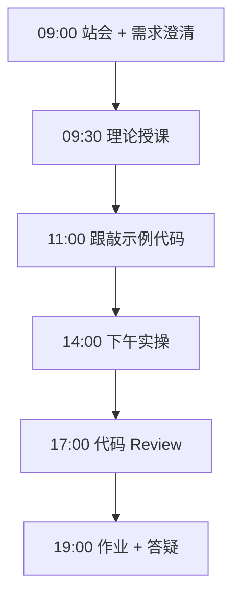
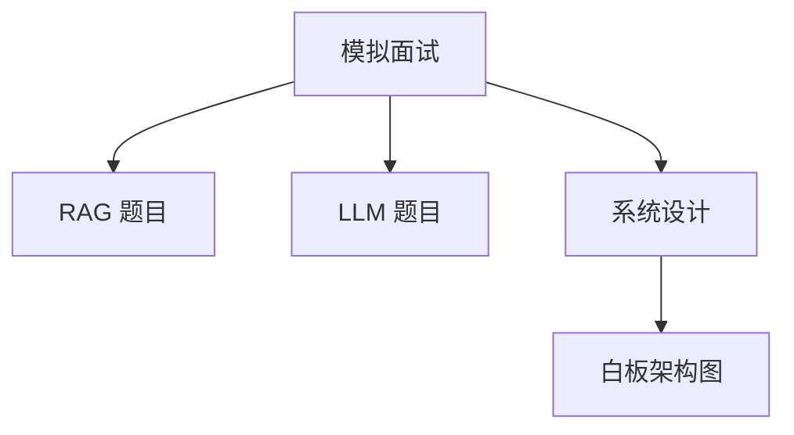
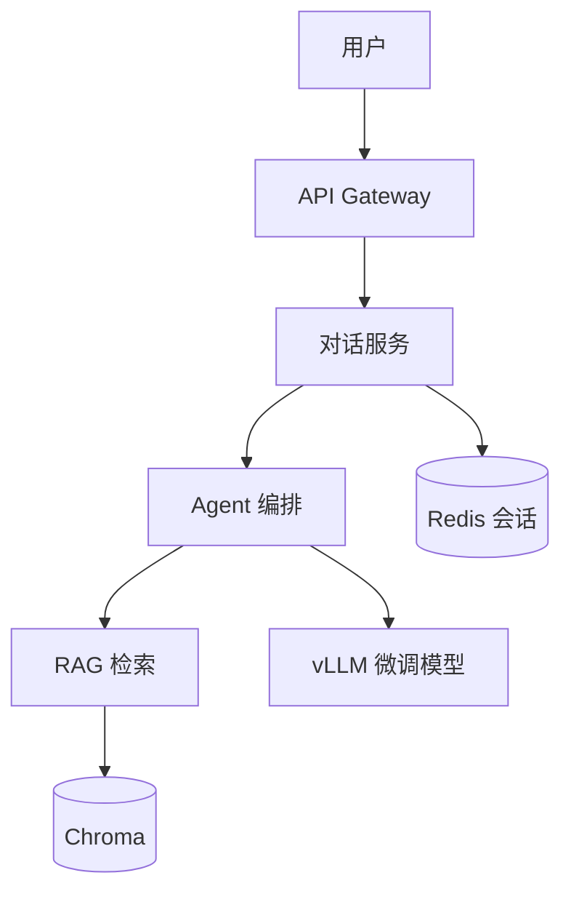

# Day 68：技术面试（二）：RAG 与 LLM 应用

> **阶段**：Phase 6：毕业设计 | **Epic**：NEXUS-E6 | **预计学时**：6-8 小时

## 旁白解读：今日上下文

> 🎬 **模拟站会 09:00** — 智链科技 Nexus 项目组

大厂面试官视频连线：「我们不考 LeetCode Hard，考你能不能设计一个能上线的 RAG 系统。」

**今日在 NexusAgent 主线中的位置**：基于 NexusAgent 项目经验应对 RAG/LLM 面试

**今日 Jira 看板**：
- `NEXUS-612`

---


## 需求文档（产品林悦下发）

**文档编号**：PRD-NEXUS-D68  
**版本**：v1.0  
**优先级**：P0

### 背景

Phase 6：毕业设计阶段第 68 天教学任务，与 NexusAgent 主线项目对齐。

### User Stories

### NEXUS-612

**描述**：技术面试（二）：RAG 与 LLM 应用 相关交付

**验收标准**：
- [ ] 代码可本地运行
- [ ] 通过 `scripts/verify_day.py --day 68`


---


## 今日课表

### 上午 09:00-12:00

- RAG 面试题：分块、检索、重排序、评估
- LLM 面试题：Prompt Engineering、微调、推理优化
- Agent 面试题：ReAct、工具调用、状态管理
- 系统设计题：设计一个客服 AI 系统

### 下午 14:00-17:30

- 模拟面试 Round 3：RAG 架构设计
- 模拟面试 Round 4：LLM 微调与部署
- 白板设计：从 0 设计企业知识库问答系统
- 面试复盘与答案优化

### 晚自习 19:00-21:00

- 整理 RAG/LLM 面试题笔记（20 题）
- 绘制系统设计图（Mermaid）
- 预习行为面试与项目深挖

---


## 课堂笔记

### 核心知识点速查

| 序号 | 知识点 | 代码位置 |
|------|--------|----------|
| 1 | RAG 系统设计 | 见下午实操 |
| 2 | LLM 面试题 | 见下午实操 |
| 3 | 混合检索 | 见下午实操 |
| 4 | 白板编程 | 见下午实操 |
| 5 | 架构设计 | 见下午实操 |

### 今日流程图



### 架构示意图（当日目标）



---


## 实操代码清单

- `code/interview/day68_rag_design.md`
- `code/interview/day68_llm_questions.md`
- `code/interview/day68_whiteboard.py`

请按顺序创建并运行。每段代码均可直接复制到对应文件执行。

---

## 实验手册（分时段操作表）

### 实验步骤 1：09:30-10:30 理论

| 时间 | 动作 | 预期结果 | 失败处理 |
|------|------|----------|----------|
| +0min | 打开课件本节 | 看到需求与验收标准 | 检查是否拉取最新 `develop` 分支 |
| +10min | 创建/打开当日 `code/` 文件 | 文件路径与清单一致 | 对照「实操代码清单」 |
| +30min | 粘贴并运行第一个脚本 | 终端有正常输出无 Traceback | 见下方「排错手册」 |
| +60min | 完成全部文件并自测 | `python3` 运行通过 | 使用 `scripts/verify_day.py --day 68` |
| +90min | 提交 Git 并建 MR | MR 关联 Jira NEXUS-612 | 按附录 Git 示例操作 |


### 实验步骤 2：10:30-12:00 跟敲

| 时间 | 动作 | 预期结果 | 失败处理 |
|------|------|----------|----------|
| +0min | 打开课件本节 | 看到需求与验收标准 | 检查是否拉取最新 `develop` 分支 |
| +10min | 创建/打开当日 `code/` 文件 | 文件路径与清单一致 | 对照「实操代码清单」 |
| +30min | 粘贴并运行第一个脚本 | 终端有正常输出无 Traceback | 见下方「排错手册」 |
| +60min | 完成全部文件并自测 | `python3` 运行通过 | 使用 `scripts/verify_day.py --day 68` |
| +90min | 提交 Git 并建 MR | MR 关联 Jira NEXUS-612 | 按附录 Git 示例操作 |


### 实验步骤 3：14:00-15:30 实操

| 时间 | 动作 | 预期结果 | 失败处理 |
|------|------|----------|----------|
| +0min | 打开课件本节 | 看到需求与验收标准 | 检查是否拉取最新 `develop` 分支 |
| +10min | 创建/打开当日 `code/` 文件 | 文件路径与清单一致 | 对照「实操代码清单」 |
| +30min | 粘贴并运行第一个脚本 | 终端有正常输出无 Traceback | 见下方「排错手册」 |
| +60min | 完成全部文件并自测 | `python3` 运行通过 | 使用 `scripts/verify_day.py --day 68` |
| +90min | 提交 Git 并建 MR | MR 关联 Jira NEXUS-612 | 按附录 Git 示例操作 |


### 实验步骤 4：15:30-17:00 联调

| 时间 | 动作 | 预期结果 | 失败处理 |
|------|------|----------|----------|
| +0min | 打开课件本节 | 看到需求与验收标准 | 检查是否拉取最新 `develop` 分支 |
| +10min | 创建/打开当日 `code/` 文件 | 文件路径与清单一致 | 对照「实操代码清单」 |
| +30min | 粘贴并运行第一个脚本 | 终端有正常输出无 Traceback | 见下方「排错手册」 |
| +60min | 完成全部文件并自测 | `python3` 运行通过 | 使用 `scripts/verify_day.py --day 68` |
| +90min | 提交 Git 并建 MR | MR 关联 Jira NEXUS-612 | 按附录 Git 示例操作 |


### 实验步骤 5：19:00-20:30 作业

| 时间 | 动作 | 预期结果 | 失败处理 |
|------|------|----------|----------|
| +0min | 打开课件本节 | 看到需求与验收标准 | 检查是否拉取最新 `develop` 分支 |
| +10min | 创建/打开当日 `code/` 文件 | 文件路径与清单一致 | 对照「实操代码清单」 |
| +30min | 粘贴并运行第一个脚本 | 终端有正常输出无 Traceback | 见下方「排错手册」 |
| +60min | 完成全部文件并自测 | `python3` 运行通过 | 使用 `scripts/verify_day.py --day 68` |
| +90min | 提交 Git 并建 MR | MR 关联 Jira NEXUS-612 | 按附录 Git 示例操作 |


### 排错手册（Day 68）

1. **`command not found: python3`** → 安装 Python 3.10+ 或使用 `py -3`（Windows）
2. **`ModuleNotFoundError`** → 确认当前目录、是否激活 venv、`pip install -r requirements.txt`（若当日有）
3. **`SyntaxError: invalid syntax`** → 检查上一行是否缺括号、引号是否中文
4. **`UnicodeDecodeError`** → 文件保存为 UTF-8，终端 `export PYTHONIOENCODING=utf-8`
5. **API 相关（Day12+）** → 检查 `.env` 中 Key，无 Key 时使用课件 MOCK 模式

---


## 逐步跟敲指南（完整源码与解析）

> 以下代码与 `code/` 目录完全一致，可直接复制。每段附行级说明。

### 文件：`code/interview/day68_rag_design.md`

**操作步骤**：
1. 在 `courseware/day-68/code/` 下创建文件 `interview/day68_rag_design.md`
2. 完整粘贴下方代码
3. 在终端执行：`cd courseware/day-68/code && python3 day68_rag_design.md.py`（若为包内模块则按课件说明）

```python
# 系统设计题：企业知识库问答系统

## 需求
- 500 员工，10 万篇内部文档
- 支持多轮对话 + 引用溯源
- P99 延迟 < 3s，可用性 99.9%

## 架构方案


## 关键设计决策
1. **分块**：512 token + 50 overlap，语义分块优化
2. **检索**：混合检索（向量 0.7 + BM25 0.3）+ Reranker
3. **微调**：QLoRA rank=8，3000 条领域 QA
4. **部署**：Docker Compose，vLLM + FastAPI
5. **评估**：ROUGE-L + 人工抽检 + 在线 A/B

## 扩展讨论
- 如何处理文档更新？→ 增量索引 + 版本管理
- 如何防止幻觉？→ 引用强制 + 置信度阈值
- 如何控制成本？→ 缓存热门查询 + 小模型路由

```

**解析要点（`interview/day68_rag_design.md`）**：

- 共 **30** 行，请逐行阅读注释中的中文说明

- 运行前确认 Python 版本 ≥ 3.10：`python3 --version`

- 若报错，先检查缩进是否为 4 空格，勿混用 Tab

- 企业 Review 清单：命名是否清晰、是否有异常处理、是否可复用

---

### 文件：`code/interview/day68_llm_questions.md`

**操作步骤**：
1. 在 `courseware/day-68/code/` 下创建文件 `interview/day68_llm_questions.md`
2. 完整粘贴下方代码
3. 在终端执行：`cd courseware/day-68/code && python3 day68_llm_questions.md.py`（若为包内模块则按课件说明）

```python
# Day 68 RAG/LLM 面试题

## RAG
1. 文档分块策略有哪些？各优缺点？
2. 混合检索如何融合向量分和 BM25 分？
3. 如何评估 RAG 系统质量？
4. Embedding 模型如何选择？
5. 如何处理多模态文档（PDF/表格）？

## LLM / 微调
6. LoRA 原理？rank 如何选择？
7. QLoRA vs LoRA 区别？
8. 如何减少 LLM 幻觉？
9. vLLM 为什么比原生推理快？
10. Prompt Engineering 最佳实践？

## Agent
11. ReAct 模式是什么？
12. LangGraph 状态机优势？
13. 工具调用失败如何处理？
14. 多 Agent 协作模式？
15. MCP 协议是什么？

```

**解析要点（`interview/day68_llm_questions.md`）**：

- 共 **22** 行，请逐行阅读注释中的中文说明

- 运行前确认 Python 版本 ≥ 3.10：`python3 --version`

- 若报错，先检查缩进是否为 4 空格，勿混用 Tab

- 企业 Review 清单：命名是否清晰、是否有异常处理、是否可复用

---

### 文件：`code/interview/day68_whiteboard.py`

**操作步骤**：
1. 在 `courseware/day-68/code/` 下创建文件 `interview/day68_whiteboard.py`
2. 完整粘贴下方代码
3. 在终端执行：`cd courseware/day-68/code && python3 day68_whiteboard.py`（若为包内模块则按课件说明）

```python
#!/usr/bin/env python3
"""Day 68 — 白板编程：简化版 RAG Pipeline（面试手写）"""

def rag_pipeline(query: str, documents: list[str], top_k: int = 3) -> str:
    """面试白板版 RAG：关键词匹配 + 模板回答"""
    # Step 1: 检索（简化为关键词匹配）
    scored = []
    for doc in documents:
        score = sum(1 for word in query.split() if word in doc)
        scored.append((score, doc))
    scored.sort(reverse=True)
    top_docs = [doc for _, doc in scored[:top_k]]

    # Step 2: 组装上下文
    context = "\n".join(top_docs) if top_docs else "无相关文档"

    # Step 3: 生成回答（生产环境调用 LLM）
    return f"根据知识库资料：\n{context}\n\n以上信息供参考。"


if __name__ == "__main__":
    docs = ["重置密码请进入管理后台", "RAG 需要 Chroma 在线", "API 限流默认 100/min"]
    print(rag_pipeline("如何重置密码", docs))

```

**解析要点（`interview/day68_whiteboard.py`）**：

- 共 **23** 行，请逐行阅读注释中的中文说明

- 运行前确认 Python 版本 ≥ 3.10：`python3 --version`

- 若报错，先检查缩进是否为 4 空格，勿混用 Tab

- 企业 Review 清单：命名是否清晰、是否有异常处理、是否可复用

---


### 深度讲解 1：RAG 系统设计

在企业级 Python 开发与大模型应用工程中，**RAG 系统设计** 是学员必须牢固掌握的基本功。智链科技 Nexus 项目组在 Day 68 的代码评审中，特别强调以下几点：

1. **为什么学**：RAG 系统设计 直接服务于后续 NexusAgent 平台的 `NEXUS-E6` 模块。没有扎实的 RAG 系统设计，Day 75 之后调用 API、解析 JSON、编写 Agent 工具函数时会出现大量低级错误。

2. **常见坑**：
   - 忽略输入类型校验，导致运行时 `TypeError`
   - 编码问题（Windows 默认 GBK vs UTF-8）
   - 复制粘贴时缩进错乱（Python 对缩进敏感）

3. **企业实践**：在 SmartLink 的 GitLab 仓库中，所有与 RAG 系统设计 相关的代码必须经过 Ruff 静态检查；变量命名使用 `snake_case`，常量使用 `UPPER_SNAKE_CASE`。

4. **与主线项目的关系**：今日代码位于 `courseware/day-68/code/`，部分模块将逐步合并到 `platform/nexus_agent/`。请养成「每日代码皆可运行、皆可测试」的习惯。

5. **扩展阅读建议**：完成今日作业后，可阅读 `docs/project-master-plan.md` 中关于 NEXUS-E6 的章节，建立全局视角。

**课堂互动题**：请用 3 句话向非技术同事解释「RAG 系统设计」是什么。写在作业 MR 的评论里，讲师会抽查点评。

**实操检查清单**：
- [ ] 能不看课件复述 RAG 系统设计 的定义
- [ ] 能独立写出相关代码并运行
- [ ] 能向同学讲解一处容易写错的地方


### 深度讲解 2：LLM 面试题

在企业级 Python 开发与大模型应用工程中，**LLM 面试题** 是学员必须牢固掌握的基本功。智链科技 Nexus 项目组在 Day 68 的代码评审中，特别强调以下几点：

1. **为什么学**：LLM 面试题 直接服务于后续 NexusAgent 平台的 `NEXUS-E6` 模块。没有扎实的 LLM 面试题，Day 75 之后调用 API、解析 JSON、编写 Agent 工具函数时会出现大量低级错误。

2. **常见坑**：
   - 忽略输入类型校验，导致运行时 `TypeError`
   - 编码问题（Windows 默认 GBK vs UTF-8）
   - 复制粘贴时缩进错乱（Python 对缩进敏感）

3. **企业实践**：在 SmartLink 的 GitLab 仓库中，所有与 LLM 面试题 相关的代码必须经过 Ruff 静态检查；变量命名使用 `snake_case`，常量使用 `UPPER_SNAKE_CASE`。

4. **与主线项目的关系**：今日代码位于 `courseware/day-68/code/`，部分模块将逐步合并到 `platform/nexus_agent/`。请养成「每日代码皆可运行、皆可测试」的习惯。

5. **扩展阅读建议**：完成今日作业后，可阅读 `docs/project-master-plan.md` 中关于 NEXUS-E6 的章节，建立全局视角。

**课堂互动题**：请用 3 句话向非技术同事解释「LLM 面试题」是什么。写在作业 MR 的评论里，讲师会抽查点评。

**实操检查清单**：
- [ ] 能不看课件复述 LLM 面试题 的定义
- [ ] 能独立写出相关代码并运行
- [ ] 能向同学讲解一处容易写错的地方


### 深度讲解 3：混合检索

在企业级 Python 开发与大模型应用工程中，**混合检索** 是学员必须牢固掌握的基本功。智链科技 Nexus 项目组在 Day 68 的代码评审中，特别强调以下几点：

1. **为什么学**：混合检索 直接服务于后续 NexusAgent 平台的 `NEXUS-E6` 模块。没有扎实的 混合检索，Day 75 之后调用 API、解析 JSON、编写 Agent 工具函数时会出现大量低级错误。

2. **常见坑**：
   - 忽略输入类型校验，导致运行时 `TypeError`
   - 编码问题（Windows 默认 GBK vs UTF-8）
   - 复制粘贴时缩进错乱（Python 对缩进敏感）

3. **企业实践**：在 SmartLink 的 GitLab 仓库中，所有与 混合检索 相关的代码必须经过 Ruff 静态检查；变量命名使用 `snake_case`，常量使用 `UPPER_SNAKE_CASE`。

4. **与主线项目的关系**：今日代码位于 `courseware/day-68/code/`，部分模块将逐步合并到 `platform/nexus_agent/`。请养成「每日代码皆可运行、皆可测试」的习惯。

5. **扩展阅读建议**：完成今日作业后，可阅读 `docs/project-master-plan.md` 中关于 NEXUS-E6 的章节，建立全局视角。

**课堂互动题**：请用 3 句话向非技术同事解释「混合检索」是什么。写在作业 MR 的评论里，讲师会抽查点评。

**实操检查清单**：
- [ ] 能不看课件复述 混合检索 的定义
- [ ] 能独立写出相关代码并运行
- [ ] 能向同学讲解一处容易写错的地方


### 深度讲解 4：白板编程

在企业级 Python 开发与大模型应用工程中，**白板编程** 是学员必须牢固掌握的基本功。智链科技 Nexus 项目组在 Day 68 的代码评审中，特别强调以下几点：

1. **为什么学**：白板编程 直接服务于后续 NexusAgent 平台的 `NEXUS-E6` 模块。没有扎实的 白板编程，Day 75 之后调用 API、解析 JSON、编写 Agent 工具函数时会出现大量低级错误。

2. **常见坑**：
   - 忽略输入类型校验，导致运行时 `TypeError`
   - 编码问题（Windows 默认 GBK vs UTF-8）
   - 复制粘贴时缩进错乱（Python 对缩进敏感）

3. **企业实践**：在 SmartLink 的 GitLab 仓库中，所有与 白板编程 相关的代码必须经过 Ruff 静态检查；变量命名使用 `snake_case`，常量使用 `UPPER_SNAKE_CASE`。

4. **与主线项目的关系**：今日代码位于 `courseware/day-68/code/`，部分模块将逐步合并到 `platform/nexus_agent/`。请养成「每日代码皆可运行、皆可测试」的习惯。

5. **扩展阅读建议**：完成今日作业后，可阅读 `docs/project-master-plan.md` 中关于 NEXUS-E6 的章节，建立全局视角。

**课堂互动题**：请用 3 句话向非技术同事解释「白板编程」是什么。写在作业 MR 的评论里，讲师会抽查点评。

**实操检查清单**：
- [ ] 能不看课件复述 白板编程 的定义
- [ ] 能独立写出相关代码并运行
- [ ] 能向同学讲解一处容易写错的地方


### 深度讲解 5：架构设计

在企业级 Python 开发与大模型应用工程中，**架构设计** 是学员必须牢固掌握的基本功。智链科技 Nexus 项目组在 Day 68 的代码评审中，特别强调以下几点：

1. **为什么学**：架构设计 直接服务于后续 NexusAgent 平台的 `NEXUS-E6` 模块。没有扎实的 架构设计，Day 75 之后调用 API、解析 JSON、编写 Agent 工具函数时会出现大量低级错误。

2. **常见坑**：
   - 忽略输入类型校验，导致运行时 `TypeError`
   - 编码问题（Windows 默认 GBK vs UTF-8）
   - 复制粘贴时缩进错乱（Python 对缩进敏感）

3. **企业实践**：在 SmartLink 的 GitLab 仓库中，所有与 架构设计 相关的代码必须经过 Ruff 静态检查；变量命名使用 `snake_case`，常量使用 `UPPER_SNAKE_CASE`。

4. **与主线项目的关系**：今日代码位于 `courseware/day-68/code/`，部分模块将逐步合并到 `platform/nexus_agent/`。请养成「每日代码皆可运行、皆可测试」的习惯。

5. **扩展阅读建议**：完成今日作业后，可阅读 `docs/project-master-plan.md` 中关于 NEXUS-E6 的章节，建立全局视角。

**课堂互动题**：请用 3 句话向非技术同事解释「架构设计」是什么。写在作业 MR 的评论里，讲师会抽查点评。

**实操检查清单**：
- [ ] 能不看课件复述 架构设计 的定义
- [ ] 能独立写出相关代码并运行
- [ ] 能向同学讲解一处容易写错的地方


## 阶段复盘锚点（Phase 6：毕业设计）

今天是 **Phase 6：毕业设计** 的第 **8** 个学习日。请回顾：

- 昨天学了什么？今天如何承接？
- 今天的内容在 70 天路线图中的坐标？
- 如果我是 Tech Lead，会如何 Review 今日代码？

**陈工寄语**：慢即是快。企业里没人关心你一天学了多少个语法点，只关心你写的脚本能不能在服务器上稳定跑 7×24 小时。今天把地基打牢，后面 Agent 编排、RAG 检索才不会塌。

**林悦补充**：产品侧只验收「用户能感知到的价值」。今日交付虽然简单，但「个人信息卡片」本质是后续「用户画像 Agent」的数据采集原型——字段设计请认真思考。

**代码量统计（累计）**：完成今日后，个人仓库累计约 **95200** 行（含注释与测试），全营目标 10 万行。

**明日预告**：请提前阅读 `courseware/day-69/README.md` 开头的旁白，了解上下文。


## 常见问题 FAQ（讲师答疑实录）


**Q1：学习「RAG 系统设计」时最常问的问题是什么？**

A：学员常问「这在大模型开发里到底用在哪里」。直接回答：在 NexusAgent 的 `NEXUS-E6` 中，RAG 系统设计 用于支撑「技术面试（二）：RAG 与 LLM 应用」这一交付。建议你打开 `platform/` 对照看未来模块如何引用今日写法。另一个常见问题是「要不要背语法」——不需要背，但要能写出可运行代码，并能在报错时读懂 Traceback。

**追问**：如果线上报错与 RAG 系统设计 相关，如何排查？  
**答**：① 复现 ② 最小化输入 ③ 打印中间变量 ④ 查 GitLab 历史 diff ⑤ 在 Jira 建 Bug 单附上日志。


**Q2：学习「LLM 面试题」时最常问的问题是什么？**

A：学员常问「这在大模型开发里到底用在哪里」。直接回答：在 NexusAgent 的 `NEXUS-E6` 中，LLM 面试题 用于支撑「技术面试（二）：RAG 与 LLM 应用」这一交付。建议你打开 `platform/` 对照看未来模块如何引用今日写法。另一个常见问题是「要不要背语法」——不需要背，但要能写出可运行代码，并能在报错时读懂 Traceback。

**追问**：如果线上报错与 LLM 面试题 相关，如何排查？  
**答**：① 复现 ② 最小化输入 ③ 打印中间变量 ④ 查 GitLab 历史 diff ⑤ 在 Jira 建 Bug 单附上日志。


**Q3：学习「混合检索」时最常问的问题是什么？**

A：学员常问「这在大模型开发里到底用在哪里」。直接回答：在 NexusAgent 的 `NEXUS-E6` 中，混合检索 用于支撑「技术面试（二）：RAG 与 LLM 应用」这一交付。建议你打开 `platform/` 对照看未来模块如何引用今日写法。另一个常见问题是「要不要背语法」——不需要背，但要能写出可运行代码，并能在报错时读懂 Traceback。

**追问**：如果线上报错与 混合检索 相关，如何排查？  
**答**：① 复现 ② 最小化输入 ③ 打印中间变量 ④ 查 GitLab 历史 diff ⑤ 在 Jira 建 Bug 单附上日志。


**Q4：学习「白板编程」时最常问的问题是什么？**

A：学员常问「这在大模型开发里到底用在哪里」。直接回答：在 NexusAgent 的 `NEXUS-E6` 中，白板编程 用于支撑「技术面试（二）：RAG 与 LLM 应用」这一交付。建议你打开 `platform/` 对照看未来模块如何引用今日写法。另一个常见问题是「要不要背语法」——不需要背，但要能写出可运行代码，并能在报错时读懂 Traceback。

**追问**：如果线上报错与 白板编程 相关，如何排查？  
**答**：① 复现 ② 最小化输入 ③ 打印中间变量 ④ 查 GitLab 历史 diff ⑤ 在 Jira 建 Bug 单附上日志。


**Q5：学习「架构设计」时最常问的问题是什么？**

A：学员常问「这在大模型开发里到底用在哪里」。直接回答：在 NexusAgent 的 `NEXUS-E6` 中，架构设计 用于支撑「技术面试（二）：RAG 与 LLM 应用」这一交付。建议你打开 `platform/` 对照看未来模块如何引用今日写法。另一个常见问题是「要不要背语法」——不需要背，但要能写出可运行代码，并能在报错时读懂 Traceback。

**追问**：如果线上报错与 架构设计 相关，如何排查？  
**答**：① 复现 ② 最小化输入 ③ 打印中间变量 ④ 查 GitLab 历史 diff ⑤ 在 Jira 建 Bug 单附上日志。


## 面试押题（与今日知识点挂钩）

以下题目会出现在 Day 67-69 模拟面试中，建议今日就开始积累答案：

1. **RAG 系统设计**：请结合 NexusAgent 项目举例说明你在哪一天、哪段代码里用到了它？
2. **LLM 面试题**：请结合 NexusAgent 项目举例说明你在哪一天、哪段代码里用到了它？
3. **混合检索**：请结合 NexusAgent 项目举例说明你在哪一天、哪段代码里用到了它？
4. **白板编程**：请结合 NexusAgent 项目举例说明你在哪一天、哪段代码里用到了它？
5. **架构设计**：请结合 NexusAgent 项目举例说明你在哪一天、哪段代码里用到了它？

**参考答案思路**：采用 STAR 法则（情境-任务-行动-结果），引用 `courseware/day-68/code/` 中的具体文件名与函数名。

---


## Code Review 检查表（陈工版）

合并 MR 前自查：

- [ ] 所有新增 `.py` 文件顶部有模块说明 docstring
- [ ] 无硬编码密钥（API Key 走环境变量）
- [ ] 函数长度 < 50 行，过长则拆分
- [ ] 异常有明确提示，禁止裸 `except:`
- [ ] 提交信息符合 `feat(day-68): ...`
- [ ] README 或注释说明如何运行
- [ ] 与 Jira Story 验收标准逐条对应

**今日重点审查项**：技术面试（二）：RAG 与 LLM 应用 相关逻辑是否可读、可测、可扩展至 `platform/nexus_agent/`。

---


## 课后作业

### 作业说明

完成系统设计白板图（企业知识库问答）并口头讲解 10 分钟。整理 15 道 RAG/LLM 面试题答案。

### 提交要求

1. 代码提交到分支 `feature/day-68-homework`
2. GitLab MR 标题：`[Day-68] homework: 课后作业`
3. 在 MR 描述中附上运行截图或终端输出

### 评分标准（满分 100）

| 项 | 分值 |
|----|------|
| 功能完整 | 40 |
| 代码规范与注释 | 30 |
| 异常处理 | 15 |
| MR 与 Jira 关联 | 15 |

---

## 作业参考答案

> ⚠️ 请先独立完成再对照答案

系统设计分五层：接入层 → 应用层 → Agent 层 → 数据层 → 模型层。RAG 核心：分块 → 嵌入 → 检索 → 重排 → 生成。

---


## 附录：Git 提交示例

```bash
git checkout develop
git pull origin develop
git checkout -b feature/day-68-技术面试（二）：ra
# 完成代码后
git add courseware/day-68/
git commit -m "feat(day-68): 技术面试（二）：RAG 与 LLM 应用"
git push -u origin feature/day-68-技术面试（二）：ra
```

---

*课件版本 Day-68-v1.0 | 智链科技培训中心*
