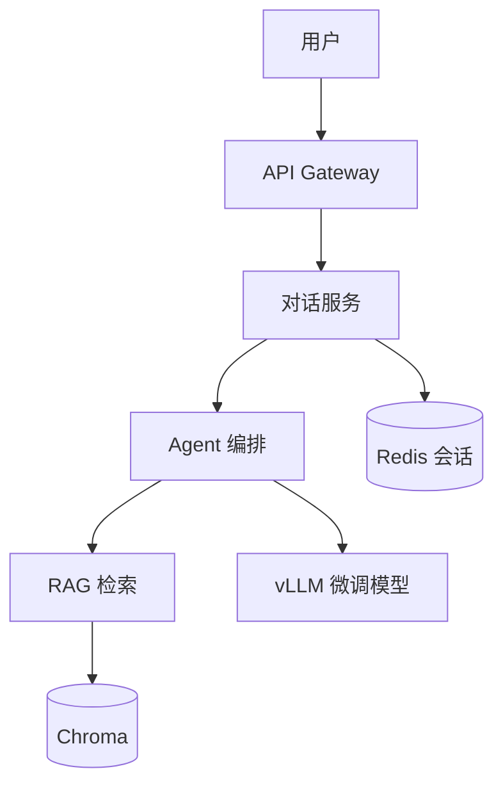

# 系统设计题：企业知识库问答系统

## 需求
- 500 员工，10 万篇内部文档
- 支持多轮对话 + 引用溯源
- P99 延迟 < 3s，可用性 99.9%

## 架构方案

## 关键设计决策
1. **分块**：512 token + 50 overlap，语义分块优化
2. **检索**：混合检索（向量 0.7 + BM25 0.3）+ Reranker
3. **微调**：QLoRA rank=8，3000 条领域 QA
4. **部署**：Docker Compose，vLLM + FastAPI
5. **评估**：ROUGE-L + 人工抽检 + 在线 A/B

## 扩展讨论
- 如何处理文档更新？→ 增量索引 + 版本管理
- 如何防止幻觉？→ 引用强制 + 置信度阈值
- 如何控制成本？→ 缓存热门查询 + 小模型路由
