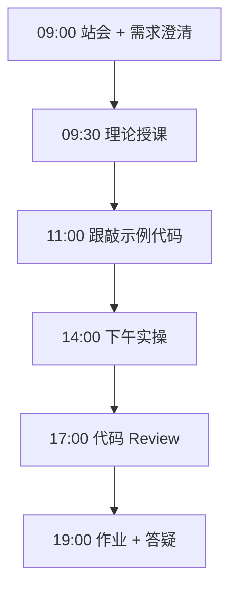
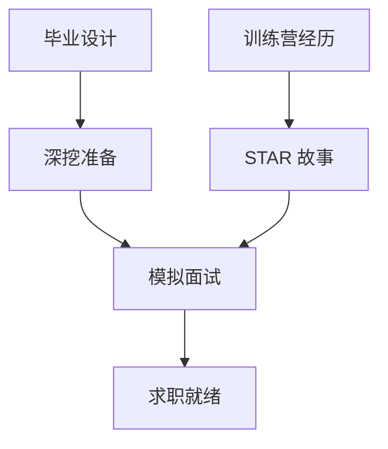

# Day 69：技术面试（三）：项目深挖与行为面试

> **阶段**：Phase 6：毕业设计 | **Epic**：NEXUS-E6 | **预计学时**：6-8 小时

## 旁白解读：今日上下文

> 🎬 **模拟站会 09:00** — 智链科技 Nexus 项目组

最后一天模拟面试。陈工：「技术过了只是门槛，项目深挖和行为面试决定 Offer 质量。」

**今日在 NexusAgent 主线中的位置**：NexusAgent 训练营完整项目经验面试转化

**今日 Jira 看板**：
- `NEXUS-613`

---


## 需求文档（产品林悦下发）

**文档编号**：PRD-NEXUS-D69  
**版本**：v1.0  
**优先级**：P0

### 背景

Phase 6：毕业设计阶段第 69 天教学任务，与 NexusAgent 主线项目对齐。

### User Stories

### NEXUS-613

**描述**：技术面试（三）：项目深挖与行为面试 相关交付

**验收标准**：
- [ ] 代码可本地运行
- [ ] 通过 `scripts/verify_day.py --day 69`


---


## 今日课表

### 上午 09:00-12:00

- 项目深挖技巧：面试官想听什么
- 行为面试 STAR 法则实战
- 常见行为题：冲突、失败、领导力
- 薪资谈判基础与 Offer 比较

### 下午 14:00-17:30

- 模拟面试 Round 5：毕业设计深挖（30 分钟）
- 模拟面试 Round 6：行为面试
- 交叉互评：每组 2 人互相当面试官
- 个人面试弱点分析与改进计划

### 晚自习 19:00-21:00

- 准备 5 个行为面试故事（STAR 格式）
- 完善毕业设计 README 作为面试作品
- 预习结业典礼流程

---


## 课堂笔记

### 核心知识点速查

| 序号 | 知识点 | 代码位置 |
|------|--------|----------|
| 1 | 项目深挖 | 见下午实操 |
| 2 | STAR 行为面试 | 见下午实操 |
| 3 | 薪资谈判 | 见下午实操 |
| 4 | 面试复盘 | 见下午实操 |
| 5 | 求职准备 | 见下午实操 |

### 今日流程图



### 架构示意图（当日目标）



---


## 实操代码清单

- `code/interview/day69_star_stories.md`
- `code/interview/day69_project_deep_dive.md`
- `code/interview/day69_salary_guide.md`

请按顺序创建并运行。每段代码均可直接复制到对应文件执行。

---

## 实验手册（分时段操作表）

### 实验步骤 1：09:30-10:30 理论

| 时间 | 动作 | 预期结果 | 失败处理 |
|------|------|----------|----------|
| +0min | 打开课件本节 | 看到需求与验收标准 | 检查是否拉取最新 `develop` 分支 |
| +10min | 创建/打开当日 `code/` 文件 | 文件路径与清单一致 | 对照「实操代码清单」 |
| +30min | 粘贴并运行第一个脚本 | 终端有正常输出无 Traceback | 见下方「排错手册」 |
| +60min | 完成全部文件并自测 | `python3` 运行通过 | 使用 `scripts/verify_day.py --day 69` |
| +90min | 提交 Git 并建 MR | MR 关联 Jira NEXUS-613 | 按附录 Git 示例操作 |


### 实验步骤 2：10:30-12:00 跟敲

| 时间 | 动作 | 预期结果 | 失败处理 |
|------|------|----------|----------|
| +0min | 打开课件本节 | 看到需求与验收标准 | 检查是否拉取最新 `develop` 分支 |
| +10min | 创建/打开当日 `code/` 文件 | 文件路径与清单一致 | 对照「实操代码清单」 |
| +30min | 粘贴并运行第一个脚本 | 终端有正常输出无 Traceback | 见下方「排错手册」 |
| +60min | 完成全部文件并自测 | `python3` 运行通过 | 使用 `scripts/verify_day.py --day 69` |
| +90min | 提交 Git 并建 MR | MR 关联 Jira NEXUS-613 | 按附录 Git 示例操作 |


### 实验步骤 3：14:00-15:30 实操

| 时间 | 动作 | 预期结果 | 失败处理 |
|------|------|----------|----------|
| +0min | 打开课件本节 | 看到需求与验收标准 | 检查是否拉取最新 `develop` 分支 |
| +10min | 创建/打开当日 `code/` 文件 | 文件路径与清单一致 | 对照「实操代码清单」 |
| +30min | 粘贴并运行第一个脚本 | 终端有正常输出无 Traceback | 见下方「排错手册」 |
| +60min | 完成全部文件并自测 | `python3` 运行通过 | 使用 `scripts/verify_day.py --day 69` |
| +90min | 提交 Git 并建 MR | MR 关联 Jira NEXUS-613 | 按附录 Git 示例操作 |


### 实验步骤 4：15:30-17:00 联调

| 时间 | 动作 | 预期结果 | 失败处理 |
|------|------|----------|----------|
| +0min | 打开课件本节 | 看到需求与验收标准 | 检查是否拉取最新 `develop` 分支 |
| +10min | 创建/打开当日 `code/` 文件 | 文件路径与清单一致 | 对照「实操代码清单」 |
| +30min | 粘贴并运行第一个脚本 | 终端有正常输出无 Traceback | 见下方「排错手册」 |
| +60min | 完成全部文件并自测 | `python3` 运行通过 | 使用 `scripts/verify_day.py --day 69` |
| +90min | 提交 Git 并建 MR | MR 关联 Jira NEXUS-613 | 按附录 Git 示例操作 |


### 实验步骤 5：19:00-20:30 作业

| 时间 | 动作 | 预期结果 | 失败处理 |
|------|------|----------|----------|
| +0min | 打开课件本节 | 看到需求与验收标准 | 检查是否拉取最新 `develop` 分支 |
| +10min | 创建/打开当日 `code/` 文件 | 文件路径与清单一致 | 对照「实操代码清单」 |
| +30min | 粘贴并运行第一个脚本 | 终端有正常输出无 Traceback | 见下方「排错手册」 |
| +60min | 完成全部文件并自测 | `python3` 运行通过 | 使用 `scripts/verify_day.py --day 69` |
| +90min | 提交 Git 并建 MR | MR 关联 Jira NEXUS-613 | 按附录 Git 示例操作 |


### 排错手册（Day 69）

1. **`command not found: python3`** → 安装 Python 3.10+ 或使用 `py -3`（Windows）
2. **`ModuleNotFoundError`** → 确认当前目录、是否激活 venv、`pip install -r requirements.txt`（若当日有）
3. **`SyntaxError: invalid syntax`** → 检查上一行是否缺括号、引号是否中文
4. **`UnicodeDecodeError`** → 文件保存为 UTF-8，终端 `export PYTHONIOENCODING=utf-8`
5. **API 相关（Day12+）** → 检查 `.env` 中 Key，无 Key 时使用课件 MOCK 模式

---


## 逐步跟敲指南（完整源码与解析）

> 以下代码与 `code/` 目录完全一致，可直接复制。每段附行级说明。

### 文件：`code/interview/day69_star_stories.md`

**操作步骤**：
1. 在 `courseware/day-69/code/` 下创建文件 `interview/day69_star_stories.md`
2. 完整粘贴下方代码
3. 在终端执行：`cd courseware/day-69/code && python3 day69_star_stories.md.py`（若为包内模块则按课件说明）

```python
# 行为面试 STAR 故事库

## 故事 1：解决技术难题
- **S**：毕业设计 RAG 检索命中率仅 60%
- **T**：需要将命中率提升到 80% 以上
- **A**：分析 bad case，调整分块策略（500→300），引入混合检索，扩充训练数据
- **R**：命中率提升至 85%，答辩获优秀

## 故事 2：团队协作
- **S**：训练营小组项目中 API 接口定义不一致
- **T**：需要统一接口规范保证联调进度
- **A**：主动编写 OpenAPI 文档，组织接口评审会，推动统一错误码
- **R**：联调时间从 3 天缩短到 1 天

## 故事 3：快速学习
- **S**：Day 51 前从未接触模型微调
- **T**：一周内完成 QLoRA 微调并部署
- **A**：系统学习 LLaMA-Factory 文档，在云 GPU 反复实验，记录每次实验参数
- **R**：成功微调客服模型，ROUGE-L 0.42

## 故事 4：处理失败
- **S**：首次 Docker 部署健康检查一直超时
- **T**：需要在答辩前完成部署
- **A**：逐服务排查日志，发现 Postgres 未就绪就启动 API，添加 depends_on + healthcheck
- **R**：部署成功，编写 deploy.sh 自动化脚本

## 故事 5：主动性
- **S**：课程未要求内容安全模块
- **T**：企业上线必须有审计和过滤
- **A**：自学合规要求，实现 AuditLogger + ContentFilter 并集成
- **R**：项目安全合规性获评委好评

```

**解析要点（`interview/day69_star_stories.md`）**：

- 共 **31** 行，请逐行阅读注释中的中文说明

- 运行前确认 Python 版本 ≥ 3.10：`python3 --version`

- 若报错，先检查缩进是否为 4 空格，勿混用 Tab

- 企业 Review 清单：命名是否清晰、是否有异常处理、是否可复用

---

### 文件：`code/interview/day69_project_deep_dive.md`

**操作步骤**：
1. 在 `courseware/day-69/code/` 下创建文件 `interview/day69_project_deep_dive.md`
2. 完整粘贴下方代码
3. 在终端执行：`cd courseware/day-69/code && python3 day69_project_deep_dive.md.py`（若为包内模块则按课件说明）

```python
# 毕业设计面试深挖准备

## 必问题目与回答要点

### Q: 为什么选择这个技术栈？
A: FastAPI（异步高性能）+ Chroma（轻量向量库）+ LangGraph（状态机 Agent）+ Docker（生产部署），平衡学习成本与企业需求。

### Q: 最大技术挑战是什么？
A: RAG 检索准确率。通过混合检索 + 分块优化 + 微调模型三管齐下解决。

### Q: 如果用户量增长 10 倍怎么办？
A: API 水平扩展 + Redis 会话共享 + Chroma 分片 + vLLM 多实例负载均衡 + CDN 静态资源。

### Q: 如何保证回答不幻觉？
A: 强制引用检索结果 + 置信度阈值拒答 + 微调减少领域幻觉 + 人工审核高频问题。

### Q: 项目下一步计划？
A: 多模态文档支持、用户反馈闭环微调、A/B 测试框架、K8s 部署。

```

**解析要点（`interview/day69_project_deep_dive.md`）**：

- 共 **18** 行，请逐行阅读注释中的中文说明

- 运行前确认 Python 版本 ≥ 3.10：`python3 --version`

- 若报错，先检查缩进是否为 4 空格，勿混用 Tab

- 企业 Review 清单：命名是否清晰、是否有异常处理、是否可复用

---

### 文件：`code/interview/day69_salary_guide.md`

**操作步骤**：
1. 在 `courseware/day-69/code/` 下创建文件 `interview/day69_salary_guide.md`
2. 完整粘贴下方代码
3. 在终端执行：`cd courseware/day-69/code && python3 day69_salary_guide.md.py`（若为包内模块则按课件说明）

```python
# 薪资谈判指南（AI 应用开发初级岗）

## 市场行情参考（2026）
- 初级 AI 应用工程师：15-25K（一线城市）
- 有完整项目经验：20-30K
- 训练营 + 毕业设计优秀：可争取区间上限

## 谈判技巧
1. 了解市场价位，给出区间而非单点
2. 用项目量化数据支撑要价
3. 综合考虑：薪资 + 成长空间 + 技术栈匹配度
4. 拿到 Offer 再谈，多 Offer 博弈

## 红线
- 不要贬低前雇主/同学
- 不要虚报项目经验
- 不要只谈钱不谈成长

```

**解析要点（`interview/day69_salary_guide.md`）**：

- 共 **17** 行，请逐行阅读注释中的中文说明

- 运行前确认 Python 版本 ≥ 3.10：`python3 --version`

- 若报错，先检查缩进是否为 4 空格，勿混用 Tab

- 企业 Review 清单：命名是否清晰、是否有异常处理、是否可复用

---


### 深度讲解 1：项目深挖

在企业级 Python 开发与大模型应用工程中，**项目深挖** 是学员必须牢固掌握的基本功。智链科技 Nexus 项目组在 Day 69 的代码评审中，特别强调以下几点：

1. **为什么学**：项目深挖 直接服务于后续 NexusAgent 平台的 `NEXUS-E6` 模块。没有扎实的 项目深挖，Day 76 之后调用 API、解析 JSON、编写 Agent 工具函数时会出现大量低级错误。

2. **常见坑**：
   - 忽略输入类型校验，导致运行时 `TypeError`
   - 编码问题（Windows 默认 GBK vs UTF-8）
   - 复制粘贴时缩进错乱（Python 对缩进敏感）

3. **企业实践**：在 SmartLink 的 GitLab 仓库中，所有与 项目深挖 相关的代码必须经过 Ruff 静态检查；变量命名使用 `snake_case`，常量使用 `UPPER_SNAKE_CASE`。

4. **与主线项目的关系**：今日代码位于 `courseware/day-69/code/`，部分模块将逐步合并到 `platform/nexus_agent/`。请养成「每日代码皆可运行、皆可测试」的习惯。

5. **扩展阅读建议**：完成今日作业后，可阅读 `docs/project-master-plan.md` 中关于 NEXUS-E6 的章节，建立全局视角。

**课堂互动题**：请用 3 句话向非技术同事解释「项目深挖」是什么。写在作业 MR 的评论里，讲师会抽查点评。

**实操检查清单**：
- [ ] 能不看课件复述 项目深挖 的定义
- [ ] 能独立写出相关代码并运行
- [ ] 能向同学讲解一处容易写错的地方


### 深度讲解 2：STAR 行为面试

在企业级 Python 开发与大模型应用工程中，**STAR 行为面试** 是学员必须牢固掌握的基本功。智链科技 Nexus 项目组在 Day 69 的代码评审中，特别强调以下几点：

1. **为什么学**：STAR 行为面试 直接服务于后续 NexusAgent 平台的 `NEXUS-E6` 模块。没有扎实的 STAR 行为面试，Day 76 之后调用 API、解析 JSON、编写 Agent 工具函数时会出现大量低级错误。

2. **常见坑**：
   - 忽略输入类型校验，导致运行时 `TypeError`
   - 编码问题（Windows 默认 GBK vs UTF-8）
   - 复制粘贴时缩进错乱（Python 对缩进敏感）

3. **企业实践**：在 SmartLink 的 GitLab 仓库中，所有与 STAR 行为面试 相关的代码必须经过 Ruff 静态检查；变量命名使用 `snake_case`，常量使用 `UPPER_SNAKE_CASE`。

4. **与主线项目的关系**：今日代码位于 `courseware/day-69/code/`，部分模块将逐步合并到 `platform/nexus_agent/`。请养成「每日代码皆可运行、皆可测试」的习惯。

5. **扩展阅读建议**：完成今日作业后，可阅读 `docs/project-master-plan.md` 中关于 NEXUS-E6 的章节，建立全局视角。

**课堂互动题**：请用 3 句话向非技术同事解释「STAR 行为面试」是什么。写在作业 MR 的评论里，讲师会抽查点评。

**实操检查清单**：
- [ ] 能不看课件复述 STAR 行为面试 的定义
- [ ] 能独立写出相关代码并运行
- [ ] 能向同学讲解一处容易写错的地方


### 深度讲解 3：薪资谈判

在企业级 Python 开发与大模型应用工程中，**薪资谈判** 是学员必须牢固掌握的基本功。智链科技 Nexus 项目组在 Day 69 的代码评审中，特别强调以下几点：

1. **为什么学**：薪资谈判 直接服务于后续 NexusAgent 平台的 `NEXUS-E6` 模块。没有扎实的 薪资谈判，Day 76 之后调用 API、解析 JSON、编写 Agent 工具函数时会出现大量低级错误。

2. **常见坑**：
   - 忽略输入类型校验，导致运行时 `TypeError`
   - 编码问题（Windows 默认 GBK vs UTF-8）
   - 复制粘贴时缩进错乱（Python 对缩进敏感）

3. **企业实践**：在 SmartLink 的 GitLab 仓库中，所有与 薪资谈判 相关的代码必须经过 Ruff 静态检查；变量命名使用 `snake_case`，常量使用 `UPPER_SNAKE_CASE`。

4. **与主线项目的关系**：今日代码位于 `courseware/day-69/code/`，部分模块将逐步合并到 `platform/nexus_agent/`。请养成「每日代码皆可运行、皆可测试」的习惯。

5. **扩展阅读建议**：完成今日作业后，可阅读 `docs/project-master-plan.md` 中关于 NEXUS-E6 的章节，建立全局视角。

**课堂互动题**：请用 3 句话向非技术同事解释「薪资谈判」是什么。写在作业 MR 的评论里，讲师会抽查点评。

**实操检查清单**：
- [ ] 能不看课件复述 薪资谈判 的定义
- [ ] 能独立写出相关代码并运行
- [ ] 能向同学讲解一处容易写错的地方


### 深度讲解 4：面试复盘

在企业级 Python 开发与大模型应用工程中，**面试复盘** 是学员必须牢固掌握的基本功。智链科技 Nexus 项目组在 Day 69 的代码评审中，特别强调以下几点：

1. **为什么学**：面试复盘 直接服务于后续 NexusAgent 平台的 `NEXUS-E6` 模块。没有扎实的 面试复盘，Day 76 之后调用 API、解析 JSON、编写 Agent 工具函数时会出现大量低级错误。

2. **常见坑**：
   - 忽略输入类型校验，导致运行时 `TypeError`
   - 编码问题（Windows 默认 GBK vs UTF-8）
   - 复制粘贴时缩进错乱（Python 对缩进敏感）

3. **企业实践**：在 SmartLink 的 GitLab 仓库中，所有与 面试复盘 相关的代码必须经过 Ruff 静态检查；变量命名使用 `snake_case`，常量使用 `UPPER_SNAKE_CASE`。

4. **与主线项目的关系**：今日代码位于 `courseware/day-69/code/`，部分模块将逐步合并到 `platform/nexus_agent/`。请养成「每日代码皆可运行、皆可测试」的习惯。

5. **扩展阅读建议**：完成今日作业后，可阅读 `docs/project-master-plan.md` 中关于 NEXUS-E6 的章节，建立全局视角。

**课堂互动题**：请用 3 句话向非技术同事解释「面试复盘」是什么。写在作业 MR 的评论里，讲师会抽查点评。

**实操检查清单**：
- [ ] 能不看课件复述 面试复盘 的定义
- [ ] 能独立写出相关代码并运行
- [ ] 能向同学讲解一处容易写错的地方


### 深度讲解 5：求职准备

在企业级 Python 开发与大模型应用工程中，**求职准备** 是学员必须牢固掌握的基本功。智链科技 Nexus 项目组在 Day 69 的代码评审中，特别强调以下几点：

1. **为什么学**：求职准备 直接服务于后续 NexusAgent 平台的 `NEXUS-E6` 模块。没有扎实的 求职准备，Day 76 之后调用 API、解析 JSON、编写 Agent 工具函数时会出现大量低级错误。

2. **常见坑**：
   - 忽略输入类型校验，导致运行时 `TypeError`
   - 编码问题（Windows 默认 GBK vs UTF-8）
   - 复制粘贴时缩进错乱（Python 对缩进敏感）

3. **企业实践**：在 SmartLink 的 GitLab 仓库中，所有与 求职准备 相关的代码必须经过 Ruff 静态检查；变量命名使用 `snake_case`，常量使用 `UPPER_SNAKE_CASE`。

4. **与主线项目的关系**：今日代码位于 `courseware/day-69/code/`，部分模块将逐步合并到 `platform/nexus_agent/`。请养成「每日代码皆可运行、皆可测试」的习惯。

5. **扩展阅读建议**：完成今日作业后，可阅读 `docs/project-master-plan.md` 中关于 NEXUS-E6 的章节，建立全局视角。

**课堂互动题**：请用 3 句话向非技术同事解释「求职准备」是什么。写在作业 MR 的评论里，讲师会抽查点评。

**实操检查清单**：
- [ ] 能不看课件复述 求职准备 的定义
- [ ] 能独立写出相关代码并运行
- [ ] 能向同学讲解一处容易写错的地方


## 阶段复盘锚点（Phase 6：毕业设计）

今天是 **Phase 6：毕业设计** 的第 **9** 个学习日。请回顾：

- 昨天学了什么？今天如何承接？
- 今天的内容在 70 天路线图中的坐标？
- 如果我是 Tech Lead，会如何 Review 今日代码？

**陈工寄语**：慢即是快。企业里没人关心你一天学了多少个语法点，只关心你写的脚本能不能在服务器上稳定跑 7×24 小时。今天把地基打牢，后面 Agent 编排、RAG 检索才不会塌。

**林悦补充**：产品侧只验收「用户能感知到的价值」。今日交付虽然简单，但「个人信息卡片」本质是后续「用户画像 Agent」的数据采集原型——字段设计请认真思考。

**代码量统计（累计）**：完成今日后，个人仓库累计约 **96600** 行（含注释与测试），全营目标 10 万行。

**明日预告**：请提前阅读 `courseware/day-70/README.md` 开头的旁白，了解上下文。


## 常见问题 FAQ（讲师答疑实录）


**Q1：学习「项目深挖」时最常问的问题是什么？**

A：学员常问「这在大模型开发里到底用在哪里」。直接回答：在 NexusAgent 的 `NEXUS-E6` 中，项目深挖 用于支撑「技术面试（三）：项目深挖与行为面试」这一交付。建议你打开 `platform/` 对照看未来模块如何引用今日写法。另一个常见问题是「要不要背语法」——不需要背，但要能写出可运行代码，并能在报错时读懂 Traceback。

**追问**：如果线上报错与 项目深挖 相关，如何排查？  
**答**：① 复现 ② 最小化输入 ③ 打印中间变量 ④ 查 GitLab 历史 diff ⑤ 在 Jira 建 Bug 单附上日志。


**Q2：学习「STAR 行为面试」时最常问的问题是什么？**

A：学员常问「这在大模型开发里到底用在哪里」。直接回答：在 NexusAgent 的 `NEXUS-E6` 中，STAR 行为面试 用于支撑「技术面试（三）：项目深挖与行为面试」这一交付。建议你打开 `platform/` 对照看未来模块如何引用今日写法。另一个常见问题是「要不要背语法」——不需要背，但要能写出可运行代码，并能在报错时读懂 Traceback。

**追问**：如果线上报错与 STAR 行为面试 相关，如何排查？  
**答**：① 复现 ② 最小化输入 ③ 打印中间变量 ④ 查 GitLab 历史 diff ⑤ 在 Jira 建 Bug 单附上日志。


**Q3：学习「薪资谈判」时最常问的问题是什么？**

A：学员常问「这在大模型开发里到底用在哪里」。直接回答：在 NexusAgent 的 `NEXUS-E6` 中，薪资谈判 用于支撑「技术面试（三）：项目深挖与行为面试」这一交付。建议你打开 `platform/` 对照看未来模块如何引用今日写法。另一个常见问题是「要不要背语法」——不需要背，但要能写出可运行代码，并能在报错时读懂 Traceback。

**追问**：如果线上报错与 薪资谈判 相关，如何排查？  
**答**：① 复现 ② 最小化输入 ③ 打印中间变量 ④ 查 GitLab 历史 diff ⑤ 在 Jira 建 Bug 单附上日志。


**Q4：学习「面试复盘」时最常问的问题是什么？**

A：学员常问「这在大模型开发里到底用在哪里」。直接回答：在 NexusAgent 的 `NEXUS-E6` 中，面试复盘 用于支撑「技术面试（三）：项目深挖与行为面试」这一交付。建议你打开 `platform/` 对照看未来模块如何引用今日写法。另一个常见问题是「要不要背语法」——不需要背，但要能写出可运行代码，并能在报错时读懂 Traceback。

**追问**：如果线上报错与 面试复盘 相关，如何排查？  
**答**：① 复现 ② 最小化输入 ③ 打印中间变量 ④ 查 GitLab 历史 diff ⑤ 在 Jira 建 Bug 单附上日志。


**Q5：学习「求职准备」时最常问的问题是什么？**

A：学员常问「这在大模型开发里到底用在哪里」。直接回答：在 NexusAgent 的 `NEXUS-E6` 中，求职准备 用于支撑「技术面试（三）：项目深挖与行为面试」这一交付。建议你打开 `platform/` 对照看未来模块如何引用今日写法。另一个常见问题是「要不要背语法」——不需要背，但要能写出可运行代码，并能在报错时读懂 Traceback。

**追问**：如果线上报错与 求职准备 相关，如何排查？  
**答**：① 复现 ② 最小化输入 ③ 打印中间变量 ④ 查 GitLab 历史 diff ⑤ 在 Jira 建 Bug 单附上日志。


## 面试押题（与今日知识点挂钩）

以下题目会出现在 Day 67-69 模拟面试中，建议今日就开始积累答案：

1. **项目深挖**：请结合 NexusAgent 项目举例说明你在哪一天、哪段代码里用到了它？
2. **STAR 行为面试**：请结合 NexusAgent 项目举例说明你在哪一天、哪段代码里用到了它？
3. **薪资谈判**：请结合 NexusAgent 项目举例说明你在哪一天、哪段代码里用到了它？
4. **面试复盘**：请结合 NexusAgent 项目举例说明你在哪一天、哪段代码里用到了它？
5. **求职准备**：请结合 NexusAgent 项目举例说明你在哪一天、哪段代码里用到了它？

**参考答案思路**：采用 STAR 法则（情境-任务-行动-结果），引用 `courseware/day-69/code/` 中的具体文件名与函数名。

---


## Code Review 检查表（陈工版）

合并 MR 前自查：

- [ ] 所有新增 `.py` 文件顶部有模块说明 docstring
- [ ] 无硬编码密钥（API Key 走环境变量）
- [ ] 函数长度 < 50 行，过长则拆分
- [ ] 异常有明确提示，禁止裸 `except:`
- [ ] 提交信息符合 `feat(day-69): ...`
- [ ] README 或注释说明如何运行
- [ ] 与 Jira Story 验收标准逐条对应

**今日重点审查项**：技术面试（三）：项目深挖与行为面试 相关逻辑是否可读、可测、可扩展至 `platform/nexus_agent/`。

---


## 课后作业

### 作业说明

准备 5 个 STAR 行为面试故事。完成 30 分钟毕业设计深挖模拟面试。整理项目深挖 10 题答案。

### 提交要求

1. 代码提交到分支 `feature/day-69-homework`
2. GitLab MR 标题：`[Day-69] homework: 课后作业`
3. 在 MR 描述中附上运行截图或终端输出

### 评分标准（满分 100）

| 项 | 分值 |
|----|------|
| 功能完整 | 40 |
| 代码规范与注释 | 30 |
| 异常处理 | 15 |
| MR 与 Jira 关联 | 15 |

---

## 作业参考答案

> ⚠️ 请先独立完成再对照答案

项目深挖核心：为什么这样设计 → 遇到什么困难 → 怎么解决的 → 效果如何（量化）。行为面试用 STAR，每个故事 2 分钟。

---


## 附录：Git 提交示例

```bash
git checkout develop
git pull origin develop
git checkout -b feature/day-69-技术面试（三）：项目
# 完成代码后
git add courseware/day-69/
git commit -m "feat(day-69): 技术面试（三）：项目深挖与行为面试"
git push -u origin feature/day-69-技术面试（三）：项目
```

---

*课件版本 Day-69-v1.0 | 智链科技培训中心*
