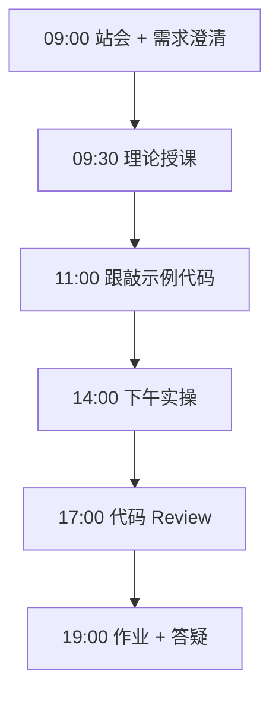
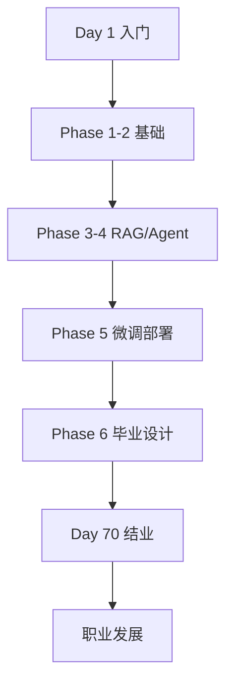
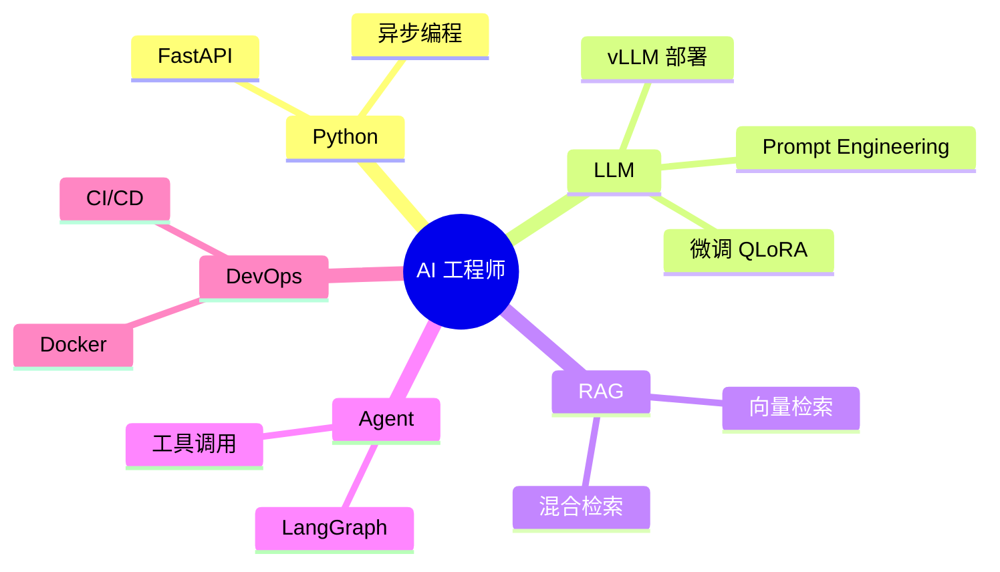

# Day 70：结业典礼：70 天旅程回顾与展望

> **阶段**：Phase 6：毕业设计 | **Epic**：NEXUS-E6 | **预计学时**：6-8 小时

## 旁白解读：今日上下文

> 🎬 **模拟站会 09:00** — 智链科技 Nexus 项目组

结业典礼。陈工：「70 天前你们连 f-string 都不会，今天能独立部署一个企业级 AI Agent 平台。这不是终点，是你们 AI 工程师职业生涯的起点。」全场掌声。

**今日在 NexusAgent 主线中的位置**：NexusAgent 训练营圆满结业

**今日 Jira 看板**：
- `NEXUS-614`

---


## 需求文档（产品林悦下发）

**文档编号**：PRD-NEXUS-D70  
**版本**：v1.0  
**优先级**：P0

### 背景

Phase 6：毕业设计阶段第 70 天教学任务，与 NexusAgent 主线项目对齐。

### User Stories

### NEXUS-614

**描述**：结业典礼：70 天旅程回顾与展望 相关交付

**验收标准**：
- [ ] 代码可本地运行
- [ ] 通过 `scripts/verify_day.py --day 70`


---


## 今日课表

### 上午 09:00-12:00

- 70 天学习旅程回顾视频
- 优秀学员项目展示（Top 3）
- 结业证书颁发仪式
- 陈工结业寄语与行业展望

### 下午 14:00-17:30

- 学员成长分享环节
- 企业合作方招聘宣讲
- 校友网络建立（微信群 + GitHub Org）
- 合影留念与自由交流

### 晚自习 19:00-21:00

- 填写训练营反馈问卷
- 更新个人简历投递第一批岗位
- 撰写个人技术博客：70 天总结
- 开启下一阶段学习规划

---


## 课堂笔记

### 核心知识点速查

| 序号 | 知识点 | 代码位置 |
|------|--------|----------|
| 1 | 70 天学习回顾 | 见下午实操 |
| 2 | 结业证书 | 见下午实操 |
| 3 | 职业发展 | 见下午实操 |
| 4 | 校友网络 | 见下午实操 |
| 5 | 持续学习 | 见下午实操 |

### 今日流程图



### 架构示意图（当日目标）



---


## 实操代码清单

- `code/graduation/CERTIFICATE.md`
- `code/graduation/70day_summary_blog.md`
- `code/graduation/next_steps.md`
- `code/graduation/feedback_survey.json`

请按顺序创建并运行。每段代码均可直接复制到对应文件执行。

---

## 实验手册（分时段操作表）

### 实验步骤 1：09:30-10:30 理论

| 时间 | 动作 | 预期结果 | 失败处理 |
|------|------|----------|----------|
| +0min | 打开课件本节 | 看到需求与验收标准 | 检查是否拉取最新 `develop` 分支 |
| +10min | 创建/打开当日 `code/` 文件 | 文件路径与清单一致 | 对照「实操代码清单」 |
| +30min | 粘贴并运行第一个脚本 | 终端有正常输出无 Traceback | 见下方「排错手册」 |
| +60min | 完成全部文件并自测 | `python3` 运行通过 | 使用 `scripts/verify_day.py --day 70` |
| +90min | 提交 Git 并建 MR | MR 关联 Jira NEXUS-614 | 按附录 Git 示例操作 |


### 实验步骤 2：10:30-12:00 跟敲

| 时间 | 动作 | 预期结果 | 失败处理 |
|------|------|----------|----------|
| +0min | 打开课件本节 | 看到需求与验收标准 | 检查是否拉取最新 `develop` 分支 |
| +10min | 创建/打开当日 `code/` 文件 | 文件路径与清单一致 | 对照「实操代码清单」 |
| +30min | 粘贴并运行第一个脚本 | 终端有正常输出无 Traceback | 见下方「排错手册」 |
| +60min | 完成全部文件并自测 | `python3` 运行通过 | 使用 `scripts/verify_day.py --day 70` |
| +90min | 提交 Git 并建 MR | MR 关联 Jira NEXUS-614 | 按附录 Git 示例操作 |


### 实验步骤 3：14:00-15:30 实操

| 时间 | 动作 | 预期结果 | 失败处理 |
|------|------|----------|----------|
| +0min | 打开课件本节 | 看到需求与验收标准 | 检查是否拉取最新 `develop` 分支 |
| +10min | 创建/打开当日 `code/` 文件 | 文件路径与清单一致 | 对照「实操代码清单」 |
| +30min | 粘贴并运行第一个脚本 | 终端有正常输出无 Traceback | 见下方「排错手册」 |
| +60min | 完成全部文件并自测 | `python3` 运行通过 | 使用 `scripts/verify_day.py --day 70` |
| +90min | 提交 Git 并建 MR | MR 关联 Jira NEXUS-614 | 按附录 Git 示例操作 |


### 实验步骤 4：15:30-17:00 联调

| 时间 | 动作 | 预期结果 | 失败处理 |
|------|------|----------|----------|
| +0min | 打开课件本节 | 看到需求与验收标准 | 检查是否拉取最新 `develop` 分支 |
| +10min | 创建/打开当日 `code/` 文件 | 文件路径与清单一致 | 对照「实操代码清单」 |
| +30min | 粘贴并运行第一个脚本 | 终端有正常输出无 Traceback | 见下方「排错手册」 |
| +60min | 完成全部文件并自测 | `python3` 运行通过 | 使用 `scripts/verify_day.py --day 70` |
| +90min | 提交 Git 并建 MR | MR 关联 Jira NEXUS-614 | 按附录 Git 示例操作 |


### 实验步骤 5：19:00-20:30 作业

| 时间 | 动作 | 预期结果 | 失败处理 |
|------|------|----------|----------|
| +0min | 打开课件本节 | 看到需求与验收标准 | 检查是否拉取最新 `develop` 分支 |
| +10min | 创建/打开当日 `code/` 文件 | 文件路径与清单一致 | 对照「实操代码清单」 |
| +30min | 粘贴并运行第一个脚本 | 终端有正常输出无 Traceback | 见下方「排错手册」 |
| +60min | 完成全部文件并自测 | `python3` 运行通过 | 使用 `scripts/verify_day.py --day 70` |
| +90min | 提交 Git 并建 MR | MR 关联 Jira NEXUS-614 | 按附录 Git 示例操作 |


### 排错手册（Day 70）

1. **`command not found: python3`** → 安装 Python 3.10+ 或使用 `py -3`（Windows）
2. **`ModuleNotFoundError`** → 确认当前目录、是否激活 venv、`pip install -r requirements.txt`（若当日有）
3. **`SyntaxError: invalid syntax`** → 检查上一行是否缺括号、引号是否中文
4. **`UnicodeDecodeError`** → 文件保存为 UTF-8，终端 `export PYTHONIOENCODING=utf-8`
5. **API 相关（Day12+）** → 检查 `.env` 中 Key，无 Key 时使用课件 MOCK 模式

---


## 逐步跟敲指南（完整源码与解析）

> 以下代码与 `code/` 目录完全一致，可直接复制。每段附行级说明。

### 文件：`code/graduation/CERTIFICATE.md`

**操作步骤**：
1. 在 `courseware/day-70/code/` 下创建文件 `graduation/CERTIFICATE.md`
2. 完整粘贴下方代码
3. 在终端执行：`cd courseware/day-70/code && python3 CERTIFICATE.md.py`（若为包内模块则按课件说明）

```python
# 🎓 NexusAgent 训练营结业证书

## 兹证明

**[学员姓名]**

已完成智链科技 NexusAgent **70 天 AI 应用开发训练营**全部课程，

掌握从 Python 基础到企业级 AI Agent 平台开发的完整技能链：

| 阶段 | 天数 | 核心能力 | 状态 |
|------|------|---------|------|
| Phase 1 | Day 1-14 | Python 基础与 CLI | ✅ |
| Phase 2 | Day 15-24 | API 与 Web 层 | ✅ |
| Phase 3 | Day 25-38 | RAG 知识库 | ✅ |
| Phase 4 | Day 39-50 | 多 Agent 编排 | ✅ |
| Phase 5 | Day 51-57 | 微调与部署 | ✅ |
| Phase 6 | Day 58-70 | 毕业设计 | ✅ |

**累计代码量**：约 98,000 行  
**毕业设计评级**：[优秀/良好/合格]  
**颁发日期**：2026 年 XX 月 XX 日

---
智链科技培训中心 | Tech Lead: 陈工 | 产品经理: 林悦

```

**解析要点（`graduation/CERTIFICATE.md`）**：

- 共 **25** 行，请逐行阅读注释中的中文说明

- 运行前确认 Python 版本 ≥ 3.10：`python3 --version`

- 若报错，先检查缩进是否为 4 空格，勿混用 Tab

- 企业 Review 清单：命名是否清晰、是否有异常处理、是否可复用

---

### 文件：`code/graduation/70day_summary_blog.md`

**操作步骤**：
1. 在 `courseware/day-70/code/` 下创建文件 `graduation/70day_summary_blog.md`
2. 完整粘贴下方代码
3. 在终端执行：`cd courseware/day-70/code && python3 70day_summary_blog.md.py`（若为包内模块则按课件说明）

```python
# 我的 70 天 AI 工程之旅

## 开篇
（为什么选择这个训练营，初始水平）

## Phase 1-2：从 Hello World 到 API（Day 1-24）
（关键收获、代表项目）

## Phase 3-4：RAG 与 Agent（Day 25-50）
（技术突破、踩坑记录）

## Phase 5：微调与部署（Day 51-57）
（微调成果、Docker 部署经验）

## Phase 6：毕业设计（Day 58-70）
（项目介绍、答辩心得）

## 技能图谱


## 下一步计划
（求职目标、持续学习方向）

## 致谢
（导师、同学、家人）

```

**解析要点（`graduation/70day_summary_blog.md`）**：

- 共 **44** 行，请逐行阅读注释中的中文说明

- 运行前确认 Python 版本 ≥ 3.10：`python3 --version`

- 若报错，先检查缩进是否为 4 空格，勿混用 Tab

- 企业 Review 清单：命名是否清晰、是否有异常处理、是否可复用

---

### 文件：`code/graduation/next_steps.md`

**操作步骤**：
1. 在 `courseware/day-70/code/` 下创建文件 `graduation/next_steps.md`
2. 完整粘贴下方代码
3. 在终端执行：`cd courseware/day-70/code && python3 next_steps.md.py`（若为包内模块则按课件说明）

```python
# 结业后学习路线图

## 短期（1-3 个月）
- [ ] 投递 AI 应用开发岗位，目标 10+ 面试
- [ ] 完善毕业设计（根据答辩反馈）
- [ ] 考取云厂商 AI 认证（阿里云/华为云）

## 中期（3-6 个月）
- [ ] 深入学习 LLM 推理优化（TensorRT-LLM / TGI）
- [ ] 贡献开源项目（LangChain / LLaMA-Factory）
- [ ] 写 3 篇技术博客建立个人品牌

## 长期（6-12 个月）
- [ ] 独立负责企业 AI 项目
- [ ] 掌握 K8s + GPU 调度
- [ ] 探索 Agent 前沿（Multi-Agent / Computer Use）

## 推荐资源
- 书籍：《Designing Machine Learning Systems》
- 课程：DeepLearning.AI LangChain 系列
- 社区：Hugging Face / LangChain Discord
- 校友群：NexusAgent Graduates 2026

```

**解析要点（`graduation/next_steps.md`）**：

- 共 **22** 行，请逐行阅读注释中的中文说明

- 运行前确认 Python 版本 ≥ 3.10：`python3 --version`

- 若报错，先检查缩进是否为 4 空格，勿混用 Tab

- 企业 Review 清单：命名是否清晰、是否有异常处理、是否可复用

---

### 文件：`code/graduation/feedback_survey.json`

**操作步骤**：
1. 在 `courseware/day-70/code/` 下创建文件 `graduation/feedback_survey.json`
2. 完整粘贴下方代码
3. 在终端执行：`cd courseware/day-70/code && python3 feedback_survey.json.py`（若为包内模块则按课件说明）

```python
{
  "survey_title": "NexusAgent 70天训练营结业反馈",
  "questions": [
    {"id": 1, "question": "整体满意度（1-10）", "type": "rating"},
    {"id": 2, "question": "最有价值的模块", "type": "multi_choice", "options": ["Python基础", "RAG", "Agent", "微调", "毕业设计"]},
    {"id": 3, "question": "需要改进的地方", "type": "text"},
    {"id": 4, "question": "是否愿意推荐给朋友", "type": "rating", "scale": "NPS"},
    {"id": 5, "question": "结业后最想做的工作", "type": "text"}
  ]
}
```

**解析要点（`graduation/feedback_survey.json`）**：

- 共 **10** 行，请逐行阅读注释中的中文说明

- 运行前确认 Python 版本 ≥ 3.10：`python3 --version`

- 若报错，先检查缩进是否为 4 空格，勿混用 Tab

- 企业 Review 清单：命名是否清晰、是否有异常处理、是否可复用

---


### 深度讲解 1：70 天学习回顾

在企业级 Python 开发与大模型应用工程中，**70 天学习回顾** 是学员必须牢固掌握的基本功。智链科技 Nexus 项目组在 Day 70 的代码评审中，特别强调以下几点：

1. **为什么学**：70 天学习回顾 直接服务于后续 NexusAgent 平台的 `NEXUS-E6` 模块。没有扎实的 70 天学习回顾，Day 77 之后调用 API、解析 JSON、编写 Agent 工具函数时会出现大量低级错误。

2. **常见坑**：
   - 忽略输入类型校验，导致运行时 `TypeError`
   - 编码问题（Windows 默认 GBK vs UTF-8）
   - 复制粘贴时缩进错乱（Python 对缩进敏感）

3. **企业实践**：在 SmartLink 的 GitLab 仓库中，所有与 70 天学习回顾 相关的代码必须经过 Ruff 静态检查；变量命名使用 `snake_case`，常量使用 `UPPER_SNAKE_CASE`。

4. **与主线项目的关系**：今日代码位于 `courseware/day-70/code/`，部分模块将逐步合并到 `platform/nexus_agent/`。请养成「每日代码皆可运行、皆可测试」的习惯。

5. **扩展阅读建议**：完成今日作业后，可阅读 `docs/project-master-plan.md` 中关于 NEXUS-E6 的章节，建立全局视角。

**课堂互动题**：请用 3 句话向非技术同事解释「70 天学习回顾」是什么。写在作业 MR 的评论里，讲师会抽查点评。

**实操检查清单**：
- [ ] 能不看课件复述 70 天学习回顾 的定义
- [ ] 能独立写出相关代码并运行
- [ ] 能向同学讲解一处容易写错的地方


### 深度讲解 2：结业证书

在企业级 Python 开发与大模型应用工程中，**结业证书** 是学员必须牢固掌握的基本功。智链科技 Nexus 项目组在 Day 70 的代码评审中，特别强调以下几点：

1. **为什么学**：结业证书 直接服务于后续 NexusAgent 平台的 `NEXUS-E6` 模块。没有扎实的 结业证书，Day 77 之后调用 API、解析 JSON、编写 Agent 工具函数时会出现大量低级错误。

2. **常见坑**：
   - 忽略输入类型校验，导致运行时 `TypeError`
   - 编码问题（Windows 默认 GBK vs UTF-8）
   - 复制粘贴时缩进错乱（Python 对缩进敏感）

3. **企业实践**：在 SmartLink 的 GitLab 仓库中，所有与 结业证书 相关的代码必须经过 Ruff 静态检查；变量命名使用 `snake_case`，常量使用 `UPPER_SNAKE_CASE`。

4. **与主线项目的关系**：今日代码位于 `courseware/day-70/code/`，部分模块将逐步合并到 `platform/nexus_agent/`。请养成「每日代码皆可运行、皆可测试」的习惯。

5. **扩展阅读建议**：完成今日作业后，可阅读 `docs/project-master-plan.md` 中关于 NEXUS-E6 的章节，建立全局视角。

**课堂互动题**：请用 3 句话向非技术同事解释「结业证书」是什么。写在作业 MR 的评论里，讲师会抽查点评。

**实操检查清单**：
- [ ] 能不看课件复述 结业证书 的定义
- [ ] 能独立写出相关代码并运行
- [ ] 能向同学讲解一处容易写错的地方


### 深度讲解 3：职业发展

在企业级 Python 开发与大模型应用工程中，**职业发展** 是学员必须牢固掌握的基本功。智链科技 Nexus 项目组在 Day 70 的代码评审中，特别强调以下几点：

1. **为什么学**：职业发展 直接服务于后续 NexusAgent 平台的 `NEXUS-E6` 模块。没有扎实的 职业发展，Day 77 之后调用 API、解析 JSON、编写 Agent 工具函数时会出现大量低级错误。

2. **常见坑**：
   - 忽略输入类型校验，导致运行时 `TypeError`
   - 编码问题（Windows 默认 GBK vs UTF-8）
   - 复制粘贴时缩进错乱（Python 对缩进敏感）

3. **企业实践**：在 SmartLink 的 GitLab 仓库中，所有与 职业发展 相关的代码必须经过 Ruff 静态检查；变量命名使用 `snake_case`，常量使用 `UPPER_SNAKE_CASE`。

4. **与主线项目的关系**：今日代码位于 `courseware/day-70/code/`，部分模块将逐步合并到 `platform/nexus_agent/`。请养成「每日代码皆可运行、皆可测试」的习惯。

5. **扩展阅读建议**：完成今日作业后，可阅读 `docs/project-master-plan.md` 中关于 NEXUS-E6 的章节，建立全局视角。

**课堂互动题**：请用 3 句话向非技术同事解释「职业发展」是什么。写在作业 MR 的评论里，讲师会抽查点评。

**实操检查清单**：
- [ ] 能不看课件复述 职业发展 的定义
- [ ] 能独立写出相关代码并运行
- [ ] 能向同学讲解一处容易写错的地方


### 深度讲解 4：校友网络

在企业级 Python 开发与大模型应用工程中，**校友网络** 是学员必须牢固掌握的基本功。智链科技 Nexus 项目组在 Day 70 的代码评审中，特别强调以下几点：

1. **为什么学**：校友网络 直接服务于后续 NexusAgent 平台的 `NEXUS-E6` 模块。没有扎实的 校友网络，Day 77 之后调用 API、解析 JSON、编写 Agent 工具函数时会出现大量低级错误。

2. **常见坑**：
   - 忽略输入类型校验，导致运行时 `TypeError`
   - 编码问题（Windows 默认 GBK vs UTF-8）
   - 复制粘贴时缩进错乱（Python 对缩进敏感）

3. **企业实践**：在 SmartLink 的 GitLab 仓库中，所有与 校友网络 相关的代码必须经过 Ruff 静态检查；变量命名使用 `snake_case`，常量使用 `UPPER_SNAKE_CASE`。

4. **与主线项目的关系**：今日代码位于 `courseware/day-70/code/`，部分模块将逐步合并到 `platform/nexus_agent/`。请养成「每日代码皆可运行、皆可测试」的习惯。

5. **扩展阅读建议**：完成今日作业后，可阅读 `docs/project-master-plan.md` 中关于 NEXUS-E6 的章节，建立全局视角。

**课堂互动题**：请用 3 句话向非技术同事解释「校友网络」是什么。写在作业 MR 的评论里，讲师会抽查点评。

**实操检查清单**：
- [ ] 能不看课件复述 校友网络 的定义
- [ ] 能独立写出相关代码并运行
- [ ] 能向同学讲解一处容易写错的地方


### 深度讲解 5：持续学习

在企业级 Python 开发与大模型应用工程中，**持续学习** 是学员必须牢固掌握的基本功。智链科技 Nexus 项目组在 Day 70 的代码评审中，特别强调以下几点：

1. **为什么学**：持续学习 直接服务于后续 NexusAgent 平台的 `NEXUS-E6` 模块。没有扎实的 持续学习，Day 77 之后调用 API、解析 JSON、编写 Agent 工具函数时会出现大量低级错误。

2. **常见坑**：
   - 忽略输入类型校验，导致运行时 `TypeError`
   - 编码问题（Windows 默认 GBK vs UTF-8）
   - 复制粘贴时缩进错乱（Python 对缩进敏感）

3. **企业实践**：在 SmartLink 的 GitLab 仓库中，所有与 持续学习 相关的代码必须经过 Ruff 静态检查；变量命名使用 `snake_case`，常量使用 `UPPER_SNAKE_CASE`。

4. **与主线项目的关系**：今日代码位于 `courseware/day-70/code/`，部分模块将逐步合并到 `platform/nexus_agent/`。请养成「每日代码皆可运行、皆可测试」的习惯。

5. **扩展阅读建议**：完成今日作业后，可阅读 `docs/project-master-plan.md` 中关于 NEXUS-E6 的章节，建立全局视角。

**课堂互动题**：请用 3 句话向非技术同事解释「持续学习」是什么。写在作业 MR 的评论里，讲师会抽查点评。

**实操检查清单**：
- [ ] 能不看课件复述 持续学习 的定义
- [ ] 能独立写出相关代码并运行
- [ ] 能向同学讲解一处容易写错的地方


## 阶段复盘锚点（Phase 6：毕业设计）

今天是 **Phase 6：毕业设计** 的第 **10** 个学习日。请回顾：

- 昨天学了什么？今天如何承接？
- 今天的内容在 70 天路线图中的坐标？
- 如果我是 Tech Lead，会如何 Review 今日代码？

**陈工寄语**：慢即是快。企业里没人关心你一天学了多少个语法点，只关心你写的脚本能不能在服务器上稳定跑 7×24 小时。今天把地基打牢，后面 Agent 编排、RAG 检索才不会塌。

**林悦补充**：产品侧只验收「用户能感知到的价值」。今日交付虽然简单，但「个人信息卡片」本质是后续「用户画像 Agent」的数据采集原型——字段设计请认真思考。

**代码量统计（累计）**：完成今日后，个人仓库累计约 **98000** 行（含注释与测试），全营目标 10 万行。

**明日预告**：请提前阅读 `courseware/day-70/README.md` 开头的旁白，了解上下文。


## 常见问题 FAQ（讲师答疑实录）


**Q1：学习「70 天学习回顾」时最常问的问题是什么？**

A：学员常问「这在大模型开发里到底用在哪里」。直接回答：在 NexusAgent 的 `NEXUS-E6` 中，70 天学习回顾 用于支撑「结业典礼：70 天旅程回顾与展望」这一交付。建议你打开 `platform/` 对照看未来模块如何引用今日写法。另一个常见问题是「要不要背语法」——不需要背，但要能写出可运行代码，并能在报错时读懂 Traceback。

**追问**：如果线上报错与 70 天学习回顾 相关，如何排查？  
**答**：① 复现 ② 最小化输入 ③ 打印中间变量 ④ 查 GitLab 历史 diff ⑤ 在 Jira 建 Bug 单附上日志。


**Q2：学习「结业证书」时最常问的问题是什么？**

A：学员常问「这在大模型开发里到底用在哪里」。直接回答：在 NexusAgent 的 `NEXUS-E6` 中，结业证书 用于支撑「结业典礼：70 天旅程回顾与展望」这一交付。建议你打开 `platform/` 对照看未来模块如何引用今日写法。另一个常见问题是「要不要背语法」——不需要背，但要能写出可运行代码，并能在报错时读懂 Traceback。

**追问**：如果线上报错与 结业证书 相关，如何排查？  
**答**：① 复现 ② 最小化输入 ③ 打印中间变量 ④ 查 GitLab 历史 diff ⑤ 在 Jira 建 Bug 单附上日志。


**Q3：学习「职业发展」时最常问的问题是什么？**

A：学员常问「这在大模型开发里到底用在哪里」。直接回答：在 NexusAgent 的 `NEXUS-E6` 中，职业发展 用于支撑「结业典礼：70 天旅程回顾与展望」这一交付。建议你打开 `platform/` 对照看未来模块如何引用今日写法。另一个常见问题是「要不要背语法」——不需要背，但要能写出可运行代码，并能在报错时读懂 Traceback。

**追问**：如果线上报错与 职业发展 相关，如何排查？  
**答**：① 复现 ② 最小化输入 ③ 打印中间变量 ④ 查 GitLab 历史 diff ⑤ 在 Jira 建 Bug 单附上日志。


**Q4：学习「校友网络」时最常问的问题是什么？**

A：学员常问「这在大模型开发里到底用在哪里」。直接回答：在 NexusAgent 的 `NEXUS-E6` 中，校友网络 用于支撑「结业典礼：70 天旅程回顾与展望」这一交付。建议你打开 `platform/` 对照看未来模块如何引用今日写法。另一个常见问题是「要不要背语法」——不需要背，但要能写出可运行代码，并能在报错时读懂 Traceback。

**追问**：如果线上报错与 校友网络 相关，如何排查？  
**答**：① 复现 ② 最小化输入 ③ 打印中间变量 ④ 查 GitLab 历史 diff ⑤ 在 Jira 建 Bug 单附上日志。


**Q5：学习「持续学习」时最常问的问题是什么？**

A：学员常问「这在大模型开发里到底用在哪里」。直接回答：在 NexusAgent 的 `NEXUS-E6` 中，持续学习 用于支撑「结业典礼：70 天旅程回顾与展望」这一交付。建议你打开 `platform/` 对照看未来模块如何引用今日写法。另一个常见问题是「要不要背语法」——不需要背，但要能写出可运行代码，并能在报错时读懂 Traceback。

**追问**：如果线上报错与 持续学习 相关，如何排查？  
**答**：① 复现 ② 最小化输入 ③ 打印中间变量 ④ 查 GitLab 历史 diff ⑤ 在 Jira 建 Bug 单附上日志。


## 面试押题（与今日知识点挂钩）

以下题目会出现在 Day 67-69 模拟面试中，建议今日就开始积累答案：

1. **70 天学习回顾**：请结合 NexusAgent 项目举例说明你在哪一天、哪段代码里用到了它？
2. **结业证书**：请结合 NexusAgent 项目举例说明你在哪一天、哪段代码里用到了它？
3. **职业发展**：请结合 NexusAgent 项目举例说明你在哪一天、哪段代码里用到了它？
4. **校友网络**：请结合 NexusAgent 项目举例说明你在哪一天、哪段代码里用到了它？
5. **持续学习**：请结合 NexusAgent 项目举例说明你在哪一天、哪段代码里用到了它？

**参考答案思路**：采用 STAR 法则（情境-任务-行动-结果），引用 `courseware/day-70/code/` 中的具体文件名与函数名。

---


## Code Review 检查表（陈工版）

合并 MR 前自查：

- [ ] 所有新增 `.py` 文件顶部有模块说明 docstring
- [ ] 无硬编码密钥（API Key 走环境变量）
- [ ] 函数长度 < 50 行，过长则拆分
- [ ] 异常有明确提示，禁止裸 `except:`
- [ ] 提交信息符合 `feat(day-70): ...`
- [ ] README 或注释说明如何运行
- [ ] 与 Jira Story 验收标准逐条对应

**今日重点审查项**：结业典礼：70 天旅程回顾与展望 相关逻辑是否可读、可测、可扩展至 `platform/nexus_agent/`。

---


## 课后作业

### 作业说明

撰写 70 天学习总结博客（1000 字以上）。填写结业反馈问卷。更新简历并投递至少 3 个岗位。

### 提交要求

1. 代码提交到分支 `feature/day-70-homework`
2. GitLab MR 标题：`[Day-70] homework: 课后作业`
3. 在 MR 描述中附上运行截图或终端输出

### 评分标准（满分 100）

| 项 | 分值 |
|----|------|
| 功能完整 | 40 |
| 代码规范与注释 | 30 |
| 异常处理 | 15 |
| MR 与 Jira 关联 | 15 |

---

## 作业参考答案

> ⚠️ 请先独立完成再对照答案

博客按 Phase 分段，每段含具体项目和技术收获。反馈问卷诚实填写助力下期改进。投递优先 AI 应用开发 / LLM 工程师岗位。

---


## 附录：Git 提交示例

```bash
git checkout develop
git pull origin develop
git checkout -b feature/day-70-结业典礼：70-天旅
# 完成代码后
git add courseware/day-70/
git commit -m "feat(day-70): 结业典礼：70 天旅程回顾与展望"
git push -u origin feature/day-70-结业典礼：70-天旅
```

---

*课件版本 Day-70-v1.0 | 智链科技培训中心*
