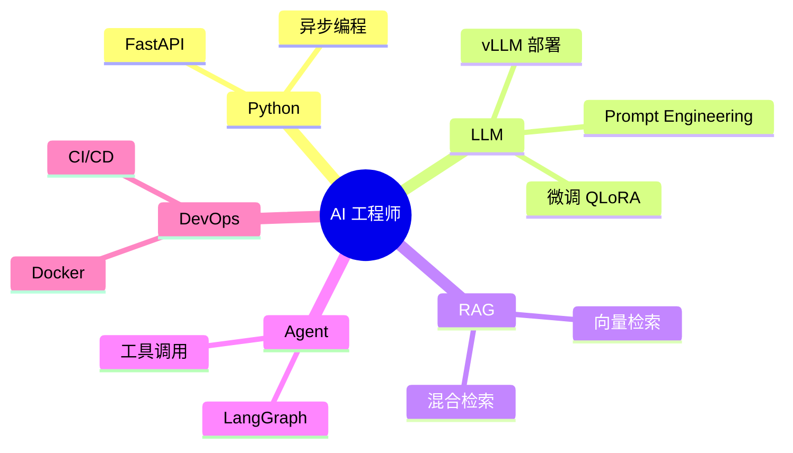

# 我的 70 天 AI 工程之旅

## 开篇
（为什么选择这个训练营，初始水平）

## Phase 1-2：从 Hello World 到 API（Day 1-24）
（关键收获、代表项目）

## Phase 3-4：RAG 与 Agent（Day 25-50）
（技术突破、踩坑记录）

## Phase 5：微调与部署（Day 51-57）
（微调成果、Docker 部署经验）

## Phase 6：毕业设计（Day 58-70）
（项目介绍、答辩心得）

## 技能图谱

## 下一步计划
（求职目标、持续学习方向）

## 致谢
（导师、同学、家人）
