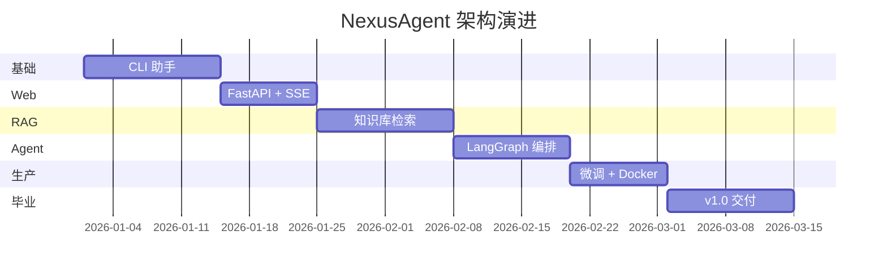
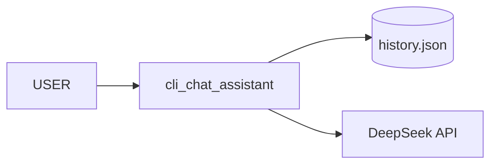
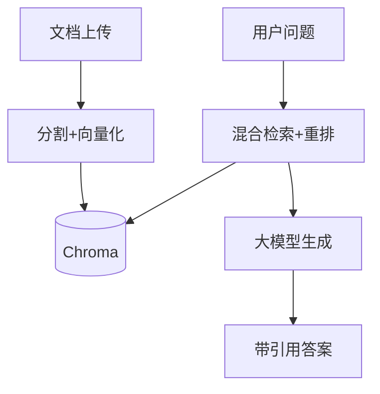

# NexusAgent 架构演进路线图

## v0.1 → v1.0 演进时间线

## 各版本架构快照

### v0.1 (Day 14) — 单机 CLI

### v0.3 (Day 38) — RAG 知识库

### v1.0 (Day 70) — 完整企业平台

见 [project-master-plan.md](./project-master-plan.md) 最终架构图。

## 技术选型决策记录 (ADR)

| ADR | 决策 | 原因 |
|-----|------|------|
| ADR-001 | Python 3.10+ | 类型注解、match 语句 |
| ADR-002 | FastAPI | 异步、自动文档、Pydantic |
| ADR-003 | Chroma 教学 / Milvus 生产 | 易学 + 可扩展 |
| ADR-004 | LangGraph Agent 编排 | 状态机、人工审批 |
| ADR-005 | Docker Compose 部署 | 学员可复现 |
