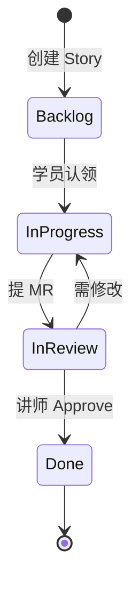

# Jira + GitLab 协作流程规范

## 1. 模拟团队角色

| 角色 | 姓名 | 职责 |
|------|------|------|
| 产品经理 | 林悦 | 需求文档、验收标准、优先级 |
| 技术负责人 | 陈工 | 架构设计、Code Review |
| 后端开发 | 你（学员） | Python/FastAPI/Agent 开发 |
| 前端开发 | 周同学 | Vue/React 界面（Day 22+ 协作） |
| 测试工程师 | 赵QA | 用例编写、回归测试 |
| DevOps | 吴运维 | CI/CD、Docker、监控（Day 56+） |

---

## 2. Jira 工作流



### 2.1 Issue 类型

- **Epic**：阶段级（如 NEXUS-E1）
- **Story**：可交付功能（如 NEXUS-102）
- **Task**：技术子任务
- **Bug**：缺陷

### 2.2 Story 模板

```markdown
## 用户故事
作为 [角色]，我希望 [功能]，以便 [价值]。

## 验收标准
- [ ] AC1: ...
- [ ] AC2: ...

## 技术备注
- 关联课件：courseware/day-XX/
- 关联分支：feature/day-XX-xxx
```

---

## 3. GitLab MR 规范

### 3.1 MR 标题
```
[Day-01] feat: 个人信息卡片程序
```

### 3.2 MR 描述模板
```markdown
## 变更说明
- 实现 xxx

## 关联 Jira
Closes NEXUS-102

## 自测清单
- [ ] 本地运行通过
- [ ] 作业已完成

## 截图/日志
（如有）
```

### 3.3 CI 流水线（Day 10 后启用）

```yaml
# .gitlab-ci.yml 预览
stages:
  - lint
  - test
  - build

lint:
  script:
    - pip install ruff
    - ruff check platform/
```

---

## 4. 每日站会模拟（课件旁白）

每天课件开头的「旁白解读」会模拟 15 分钟站会：

> **林悦**：昨天 CLI 助手完成了多轮对话，今天客户要求先做最简单的信息录入 demo。  
> **陈工**：Day 1 别贪多，先把 Python 环境和第一个可运行脚本搞定，这是后面十万行代码的地基。  
> **你**：明白，今天完成 NEXUS-101 和 NEXUS-102。

---

*智链科技研发部 | 内部规范 v2.3*
