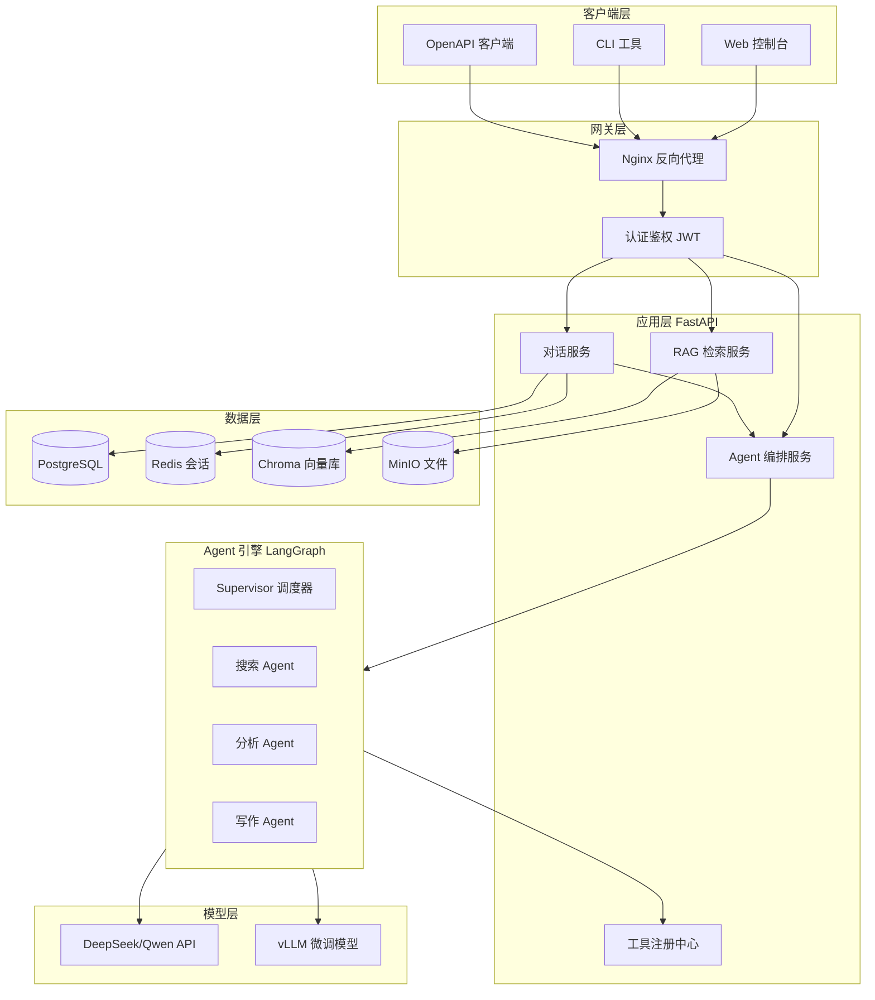
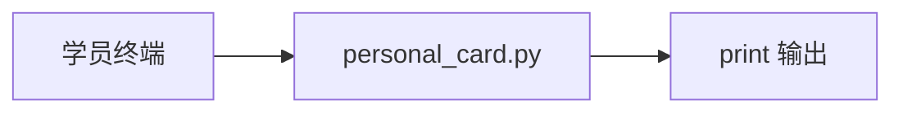

# NexusAgent Platform — 从 0 到 1 主计划书

## 1. 项目背景（企业真实需求）

**客户**：智链科技（SmartLink Tech）— 中型 SaaS 企业，500+ 员工  
**痛点**：
- 内部知识分散在 Confluence、飞书文档、工单系统
- 客服、销售、研发重复回答相同问题，人力成本高
- 希望用 AI Agent 统一入口：问答、办公自动化、数据分析

**项目代号**：NEXUS-2026（灵犀智能体协作平台）  
**项目周期**：70 天（培训课程同步迭代）  
**技术负责人**：陈工（Tech Lead，你的导师角色）

---

## 2. 产品愿景

> 一个企业级、可扩展、可观测的多 Agent 协作平台，支持知识库问答、工具调用、工作流编排、人工审批、多租户隔离。

### 2.1 MVP 功能清单（按阶段解锁）

| 版本 | 对应天数 | 核心能力 |
|------|----------|----------|
| v0.1 | Day 1-14 | CLI 多轮对话、历史持久化、指令系统 |
| v0.2 | Day 15-24 | REST API、SSE 流式、Web 聊天界面 |
| v0.3 | Day 25-38 | 文档上传、向量检索、混合检索、引用溯源 |
| v0.4 | Day 39-50 | LangGraph 编排、多 Agent、MCP、人工审批 |
| v0.5 | Day 51-60 | 领域微调模型、Docker 部署、监控告警 |
| v1.0 | Day 58-70 | 毕业设计完整版、生产级部署 |

---

## 3. 系统架构演进

### 3.1 最终目标架构（Day 70）



### 3.2 Day 1 架构（极简）



---

## 4. Jira Epic 规划

| Epic ID | 名称 | 起止天 | 状态 |
|---------|------|--------|------|
| NEXUS-E1 | Python 基础与 CLI 助手 | Day 1-14 | 进行中 |
| NEXUS-E2 | API 与 Web 层 | Day 15-24 | 待开始 |
| NEXUS-E3 | RAG 知识库 | Day 25-38 | 待开始 |
| NEXUS-E4 | 多 Agent 编排 | Day 39-50 | 待开始 |
| NEXUS-E5 | 微调与部署 | Day 51-60 | 待开始 |
| NEXUS-E6 | 毕业设计 | Day 58-70 | 待开始 |

### Day 1 关联 Story

- **NEXUS-101**：搭建 Python 开发环境
- **NEXUS-102**：实现个人信息卡片 CLI 程序
- **NEXUS-103**：配置 Git 并完成首次提交

---

## 5. GitLab 分支策略

```
main          ← 稳定可发布版本（讲师合并）
develop       ← 日常集成分支
feature/*     ← 每日功能分支，如 feature/day-01-env-setup
release/*     ← 阶段发布，如 release/v0.1-cli
```

**学员每日流程**：
1. 从 `develop` 拉取最新：`git pull origin develop`
2. 创建当日分支：`git checkout -b feature/day-01-env-setup`
3. 完成课件代码后提交：`git commit -m "feat(day-01): 个人信息卡片程序"`
4. 推送并提 MR：`git push -u origin feature/day-01-env-setup`

---

## 6. 代码规范

- Python：PEP 8，Black 格式化，类型注解（Day 13 后强制）
- 提交信息：Conventional Commits（`feat`/`fix`/`docs`/`test`）
- 每个模块必须有 docstring 和行内注释（课件要求）

---

## 7. 风险与应对

| 风险 | 应对 |
|------|------|
| 零基础学员环境配置失败 | Day 1 提供 Docker 备选环境 + 助教远程排查清单 |
| API Key 费用 | 默认 DeepSeek，提供 mock 模式 |
| 显卡不足 | 微调阶段用云 GPU 租用指南（AutoDL） |

---

*文档版本：v1.0 | 最后更新：Day 1 | 负责人：陈工*
